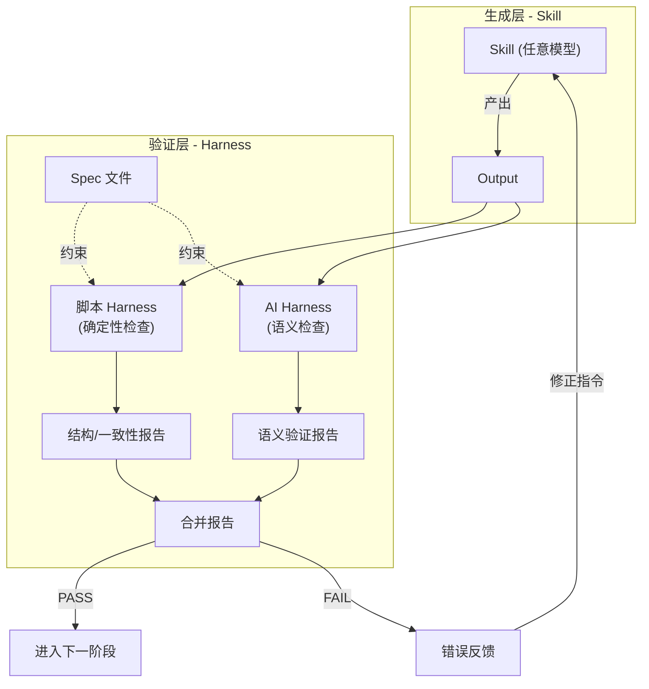
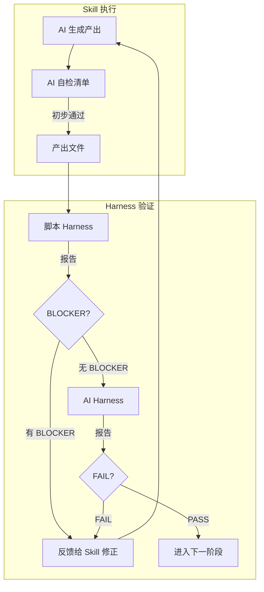

# Spec/Harness 验证体系 -- 集成到全生命周期 Skill 流水线

## 核心思想

当前 Skill 体系的质量门禁是"AI 自检清单"，等同于**考生自己批改试卷**。引入 Spec/Harness 后变为：

- **Spec（规约）**: 每个阶段产出必须满足的机器可验证契约，用 YAML 格式定义
- **Harness（验证器）**: 独立于生成过程的验证程序，分两类：
  - **脚本 Harness**: TypeScript 脚本，做结构/语法/一致性检查（确定性，零误判）
  - **AI Harness**: Prompt 模板 + Spec，由任意大模型执行语义级验证（概率性，处理复杂逻辑）




**关键设计原则**:

- **模型无关**: Spec 文件是纯 YAML，Prompt 模板是纯 Markdown，脚本是标准 TypeScript -- 不绑定任何 AI 厂商或 IDE
- **生成与验证分离**: 生成代码/文档的 AI 和验证的 AI 可以是不同模型（甚至不同厂商），消除"自己验自己"的偏差
- **渐进严格**: 脚本 Harness 做硬约束（必须通过），AI Harness 做软约束（提供建议和风险评估）

---

## 目录结构

```
harness/
  specs/                        # Spec 文件（YAML 格式的契约定义）
    prd-spec.yaml               # PRD 阶段规约
    design-spec.yaml            # 设计阶段规约
    coding-spec.yaml            # 编码阶段规约
    review-spec.yaml            # Review 阶段规约
    ut-spec.yaml                # UT 阶段规约
    testing-spec.yaml           # 真机测试阶段规约
  scripts/                      # 脚本 Harness（TypeScript，确定性检查）
    check-prd.ts                # PRD 结构完整性检查
    check-design.ts             # 设计文档完整性 + PRD 映射覆盖率
    check-coding.ts             # 代码一致性检查（文件存在性/接口签名/分层合规/资源引用）
    check-review.ts             # Review 报告格式 + BLOCKER 检测
    check-ut.ts                 # UT 覆盖率 + DAG 节点映射完整性
    check-testing.ts            # 测试报告 P0/P1 通过率计算
    utils/
      yaml-loader.ts            # YAML/Markdown 解析工具
      ast-analyzer.ts           # ArkTS AST 分析工具（检查 import/接口签名/分层违规）
      report-generator.ts       # 统一报告生成器
  prompts/                      # AI Harness 的 Prompt 模板（模型无关）
    verify-prd.md               # PRD 语义验证 prompt
    verify-design.md            # 设计方案合理性验证 prompt
    verify-coding.md            # 代码质量/逻辑正确性验证 prompt
    verify-review.md            # Review 结论合理性验证 prompt
    verify-ut.md                # UT 有效性验证 prompt
    verify-testing.md           # 测试覆盖度验证 prompt
  reports/                      # 验证报告输出目录
    {feature}/{phase}/          # 按功能模块和阶段组织
      script-report.json        # 脚本 Harness 报告
      ai-report.md              # AI Harness 报告
      merged-report.md          # 合并报告（最终判定）
  harness-runner.ts             # 统一入口：读取 spec + 执行脚本 harness + 调用 AI harness + 合并报告
  package.json                  # 依赖管理（ts-node, yaml, etc.）
  tsconfig.json
  README.md                     # Harness 使用说明
```

---

## Spec 文件设计

每个阶段的 Spec 文件定义三类约束：

### 1. 结构约束（Structure）-- 脚本 Harness 检查

文档/代码的结构规则，100% 可自动化：

```yaml
# harness/specs/coding-spec.yaml（编码阶段示例，节选）

phase: coding
version: "1.0"

structure_checks:
  file_completeness:
    description: "design.md 中规划的所有文件必须存在"
    severity: BLOCKER
    method: script
    check: "对比 design.md 的文件列表与实际文件系统"

  interface_consistency:
    description: "代码中的接口签名必须与 design.md 定义一致"
    severity: BLOCKER
    method: script
    check: "AST 解析代码接口签名，对比 design.md 中的定义"

  layer_compliance:
    description: "模块内 import 不得违反 shared->data->domain->presentation 分层"
    severity: BLOCKER
    method: script
    check: "分析每个文件的 import 语句，验证不存在反向依赖"

  no_hardcoded_strings:
    description: "UI 文本必须通过 $r() 引用资源，不得硬编码"
    severity: MAJOR
    method: script
    check: "扫描 presentation 层 .ets 文件中的字符串字面量"

  resource_integrity:
    description: "代码中所有 $r() 引用的资源 key 必须在对应 json 中存在"
    severity: BLOCKER
    method: script
    check: "提取所有 $r() 引用，对比 resources/ 下的 json 文件"
```

### 2. 语义约束（Semantics）-- AI Harness 检查

需要理解代码/文档含义的检查，由 AI 执行：

```yaml
  semantic_checks:
    business_logic_correctness:
      description: "代码逻辑是否正确实现了 design.md 描述的业务流程"
      severity: MAJOR
      method: ai
      prompt_template: "prompts/verify-coding.md"
      input_context:
        - "design.md 的业务流程图和功能映射表"
        - "对应的源代码文件"

    error_handling_completeness:
      description: "PRD 中定义的异常场景是否都有对应的错误处理代码"
      severity: MAJOR
      method: ai
      prompt_template: "prompts/verify-coding.md"
      input_context:
        - "PRD.md 的异常场景章节"
        - "对应的源代码文件"
```

### 3. 跨阶段追溯约束（Traceability）-- 脚本 + AI

确保阶段间产出的一致性链：

```yaml
  traceability_checks:
    prd_to_design_coverage:
      description: "PRD 中每个 P0/P1 功能点在 design.md 映射表中有对应行"
      severity: BLOCKER
      method: script
      check: "解析 PRD 功能清单 ID，对比 design.md 映射表的 PRD 编号列"

    design_to_code_coverage:
      description: "design.md 映射表中每个文件路径在代码中存在"
      severity: BLOCKER
      method: script

    prd_acceptance_to_test:
      description: "PRD 验收标准的每一条在测试计划中有对应用例"
      severity: BLOCKER
      method: script
```

---

## 各阶段 Spec/Harness 详解

### Phase 1: PRD -- `prd-spec.yaml`

**脚本 Harness** (`check-prd.ts`):

- Markdown 结构检查：8 个必需章节是否存在
- 功能清单格式：每项是否有 P0-P3 优先级标注
- Mermaid 语法校验：业务流程图是否能正确渲染
- 验收标准格式：每条是否为可量化描述（检测包含数字或具体条件的模式）

**AI Harness** (`verify-prd.md`):

- 功能描述是否具体可实现（非空泛表述）
- 异常场景覆盖是否充分
- 验收标准是否与功能清单一一对应

### Phase 2: Design -- `design-spec.yaml`

**脚本 Harness** (`check-design.ts`):

- PRD 功能点覆盖率：解析 PRD 功能编号 vs 设计映射表编号
- 文件路径合法性：路径是否符合五层架构约定
- 接口定义完整性：函数签名是否有入参和返回类型
- 无 TBD 项：扫描 P0/P1 范围内的"待定"/"TBD"/"TODO"

**AI Harness** (`verify-design.md`):

- 五层架构分配合理性：功能是否放在了正确的层
- 数据模型是否充分覆盖 PRD 中的数据实体
- 组件拆分粒度是否合理

### Phase 3: Coding -- `coding-spec.yaml`

**脚本 Harness** (`check-coding.ts`) -- 这是最有价值的：

- 文件存在性：design.md 规划的文件 vs 实际文件
- 接口签名一致性：AST 解析代码 vs design.md 定义
- 分层合规：import 依赖方向分析
- 资源引用完整性：$r() 引用 vs resources/*.json
- 硬编码字符串检测
- 模块依赖 DAG 检查（无循环，方向正确）

**AI Harness** (`verify-coding.md`):

- 业务逻辑正确性
- 错误处理完备性
- 性能反模式检测

### Phase 4: Review -- `review-spec.yaml`

**脚本 Harness** (`check-review.ts`):

- Review 报告格式合规
- BLOCKER 数量统计

**AI Harness** (`verify-review.md`):

- Review 结论与代码是否一致（避免 Review 走过场）
- 是否遗漏了关键问题

### Phase 5: UT -- `ut-spec.yaml`

**脚本 Harness** (`check-ut.ts`):

- DAG 节点覆盖率：DAG 中的 assertion 节点是否都有对应 expect
- user_intervention 节点打桩覆盖率
- UT 编译通过
- UT 执行通过率

**AI Harness** (`verify-ut.md`):

- Mock 数据是否合理（不是无意义的占位数据）
- 断言是否有效（不是永真断言）

### Phase 6: Testing -- `testing-spec.yaml`

**脚本 Harness** (`check-testing.ts`):

- P0 用例 100% 通过率验证
- P1 用例 >= 90% 通过率验证
- 失败用例是否都有 Bug Report

**AI Harness** (`verify-testing.md`):

- 测试用例是否覆盖了 PRD 验收标准

---

## AI Harness Prompt 模板设计（模型无关）

每个 AI Harness prompt 遵循统一结构，任何 LLM 都能执行：

```markdown
<!-- harness/prompts/verify-coding.md -->
# 编码阶段语义验证

## 你的角色
你是一个独立的代码审查员。你不是代码的生成者。你的职责是根据 Spec 约束，
客观评估代码是否满足要求。

## 输入
1. **Spec 文件**: {coding_spec_content}
2. **Design 文档**: {design_md_content}
3. **PRD 文档**: {prd_md_content}
4. **源代码文件列表及内容**: {source_files}
5. **脚本 Harness 报告**（已通过的硬性检查）: {script_report}

## 验证任务
针对 Spec 中 method=ai 的每个检查项，逐一评估：

### 检查 1: business_logic_correctness
对比 design.md 中的业务流程描述与实际代码实现：
- 流程步骤是否完整
- 条件分支是否与设计一致
- 数据流转是否正确

### 检查 2: error_handling_completeness
对比 PRD 中的异常场景与代码中的错误处理：
- 每个 PRD 异常场景是否有对应的 try-catch/条件判断
- 错误信息是否对用户友好

## 输出格式（必须严格遵循）
```yaml
verification_result:
  phase: coding
  feature: "{feature_name}"
  timestamp: "{ISO8601}"
  checks:
    - id: business_logic_correctness
      status: PASS | FAIL | WARN
      severity: MAJOR
      details: "具体发现..."
      affected_files: ["path/to/file.ets"]
      suggestion: "修正建议..."
    - id: error_handling_completeness
      status: PASS | FAIL | WARN
      ...
  summary:
    total: N
    pass: N
    fail: N
    warn: N
    verdict: PASS | FAIL
```

```

---

## 统一运行器 (`harness-runner.ts`)

```

用法:
  npx ts-node harness/harness-runner.ts --phase coding --feature home-page

流程:

1. 读取 harness/specs/{phase}-spec.yaml
2. 收集输入文件（PRD.md, design.md, 源码等）
3. 运行脚本 Harness（check-{phase}.ts）
4. 输出脚本报告到 harness/reports/{feature}/{phase}/script-report.json
5. 组装 AI Harness 的 prompt（填充模板 + 上下文）
6. 输出组装好的 prompt 到 harness/reports/{feature}/{phase}/ai-prompt.md

（用户可将此 prompt 发送给任意 AI 模型执行）
7. 若 AI 返回结果，合并生成最终报告 merged-report.md

```

**关键**: 第 6 步只**生成 prompt**，不直接调用任何 AI API。用户可以：
- 在 Cursor 中粘贴执行
- 通过 OpenAI/Claude/Gemini API 调用
- 在其他 IDE 的 AI 助手中执行
- 甚至让人工审查

这保证了**完全的模型无关性**。

---

## 与现有 Skill 体系的集成方式

Spec/Harness **不替代**现有 Skill，而是在每个 Skill 的 Step "质量门禁自检" 后增加一道独立验证：



**在 Skill SKILL.md 中的改动**：每个 Skill 的最后一步增加：

```
### Step N+1: Harness 验证（独立验证）
产出归档后，运行 Harness 进行独立验证：
\`\`\`bash
npx ts-node harness/harness-runner.ts --phase {phase} --feature {feature-name}
\`\`\`
1. 脚本 Harness 如有 BLOCKER，必须修复后重新运行
2. AI Harness 的 prompt 输出后，发送给独立 AI 模型执行验证
3. 所有检查 PASS 后，方可进入下一阶段
```

---

## 跨阶段追溯链

Spec/Harness 最强大的能力是跨阶段追溯 -- 确保从 PRD 到最终测试的每一环不丢失需求：

```
PRD.md
  功能编号 F1, F2, F3...
  验收标准 AC1, AC2, AC3...
       │
       ▼  prd-to-design traceability (脚本检查)
design.md
  映射表: F1→模块A, F2→模块B...
  接口定义: func1(), func2()...
       │
       ▼  design-to-code traceability (脚本检查)
source code
  模块A/func1.ets, 模块B/func2.ets...
       │
       ▼  code-to-ut traceability (脚本检查)
UT (DAG + test code)
  DAG 覆盖 func1, func2...
       │
       ▼  prd-acceptance-to-test traceability (脚本检查)
Test Plan
  用例覆盖 AC1, AC2, AC3...
```

每一环的追溯都由脚本 Harness 自动验证，确保**零需求遗漏**。

---

## 实施顺序

### 第一步：搭建 Harness 基础设施（1-2天）

- 创建 `harness/` 目录结构
- 实现 `harness-runner.ts` 统一入口
- 实现 `utils/yaml-loader.ts` 和 `utils/report-generator.ts`
- 编写 `package.json` 和 `tsconfig.json`

### 第二步：编码阶段 Spec + Harness（2-3天，最高价值）

- 编写 `coding-spec.yaml`
- 实现 `check-coding.ts`（文件存在性 + 接口一致性 + 分层合规 + 资源引用）
- 实现 `utils/ast-analyzer.ts`（ArkTS AST 分析）
- 编写 `verify-coding.md` prompt 模板
- 在已有的首页代码上验证

### 第三步：设计阶段 Spec + Harness（1-2天）

- 编写 `design-spec.yaml`
- 实现 `check-design.ts`（PRD 映射覆盖率 + TBD 检测 + 路径合法性）
- 编写 `verify-design.md` prompt 模板

### 第四步：PRD 阶段 Spec + Harness（1天）

- 编写 `prd-spec.yaml`
- 实现 `check-prd.ts`（结构检查 + Mermaid 语法 + 优先级标注）
- 编写 `verify-prd.md` prompt 模板

### 第五步：Review/UT/Testing 阶段（与 Skill 4-6 同步开发）

- 这三个阶段的 Spec + Harness 与对应 Skill 同步开发
- Review Harness 本质上就是 Skill 4 的自动化版本
- UT Harness 与 DAG 体系天然结合
- Testing Harness 主要是通过率计算

### 第六步：更新现有 Skill 1-3

- 在 Skill 1/2/3 的 SKILL.md 中追加 Harness 验证步骤
- 将 Spec 文件路径写入 Skill 的关联文件章节

