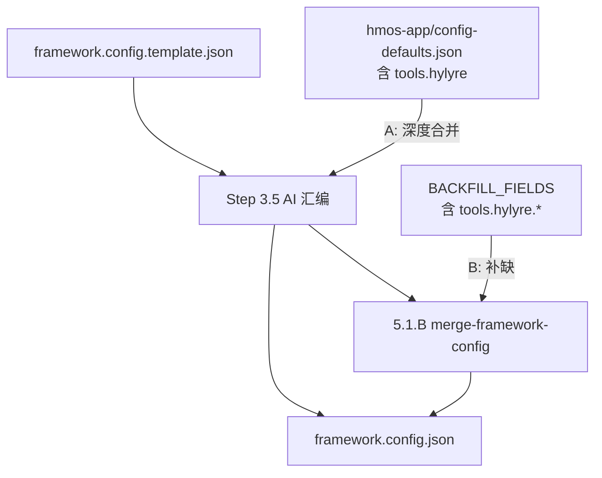

# `tools.hylyre` init 缺口 — 实施方案（A + B）

## 已采纳策略

**组合 A + B**（用户确认），**不做**方案 C（仅在 addendum 里口头提醒）。


| 方案    | 作用面                                                                                                              | 目标                                                    |
| ----- | ---------------------------------------------------------------------------------------------------------------- | ----------------------------------------------------- |
| **A** | [framework/profiles/hmos-app/config-defaults.json](framework/profiles/hmos-app/config-defaults.json)             | CREATE / Step 3.5 前「profile defaults 深度合并」时带入 `tools` |
| **B** | [framework/harness/scripts/utils/config-field-merger.ts](framework/harness/scripts/utils/config-field-merger.ts) | UPDATE、`5.1.B`、`Q1.A`、`check-init` missing_keys 机器追平  |


修复后数据流：




---

## 根因摘要（不变）

- 模板 [framework.config.template.json](framework/templates/framework.config.template.json) **已有** `tools.hylyre`。
- init 安全网只认 `BACKFILL_FIELDS`；profile defaults 原先只有 `architecture`。
- 虚拟钱包 [framework.config.json](framework.config.json) 中的段**不能**证明 init 会写——更可能为演示仓手工维护；运行时 [resolveHylyreToolConfig](framework/harness/config.ts) 在缺段时仍有默认，**一般不 BLOCKER**。

---

## 实施步骤

### Step 0：导出运行时默认值（B 的前置，避免双源）

**文件**：[framework/harness/config.ts](framework/harness/config.ts)

- 将 `const DEFAULT_HYLYRE_TOOL_CONFIG` 改为 `**export const`**（约 1488 行），保持字段与 `HylyreToolConfig` 一致。
- `resolveHylyreToolConfig` 继续引用该常量，行为不变。

### Step 1：方案 A — profile defaults

**文件**：[framework/profiles/hmos-app/config-defaults.json](framework/profiles/hmos-app/config-defaults.json)

在顶层追加（与模板 / 本仓实例对齐，`hypium_page_name` 用空串）：

```json
"tools": {
  "hylyre": {
    "vendor_dir": "framework/profiles/hmos-app/vendor/hylyre",
    "venv_dir": ".hylyre/venv",
    "app_snapshot_cache_dir": "doc/app-snapshot-cache",
    "pypi_extra_index_url": "https://pypi.tuna.tsinghua.edu.cn/simple",
    "auto_install": true,
    "doctor_first_run": true,
    "hypium_page_name": ""
  }
}
```

**范围**：仅 `hmos-app` profile；`generic` 等 profile **不**加（无 Skill 6 / hylyre vendor）。

**Skill 00 行为**：Step 2 已有「读取 `config-defaults.json` 与 skeleton 深度合并」——**无需改 SKILL 正文**，A 靠数据文件生效。

### Step 2：方案 B — BACKFILL 白名单

**文件**：[framework/harness/scripts/utils/config-field-merger.ts](framework/harness/scripts/utils/config-field-merger.ts)

1. `import { DEFAULT_HYLYRE_TOOL_CONFIG } from '../../config'`（与 `DEFAULT_PATHS` 并列）。
2. 在 `BACKFILL_FIELDS` 末尾（`toolchain.hvigor.analyze` 之后）追加 **7 条**点分路径：


| path                                  | defaultValue 来源                                |
| ------------------------------------- | ---------------------------------------------- |
| `tools.hylyre.vendor_dir`             | `DEFAULT_HYLYRE_TOOL_CONFIG.vendor_dir`        |
| `tools.hylyre.venv_dir`               | `.venv` 同上                                     |
| `tools.hylyre.app_snapshot_cache_dir` | 同上                                             |
| `tools.hylyre.pypi_extra_index_url`   | 同上                                             |
| `tools.hylyre.auto_install`           | 同上                                             |
| `tools.hylyre.doctor_first_run`       | 同上                                             |
| `tools.hylyre.hypium_page_name`       | `''`（空串；与模板、runtime 扫描 entry `mainElement` 一致） |


1. 文件头注释「严禁补缺」列表**保持** `prd` / `devEcoStudio.installPath` 等；**不**把整段 `tools` 标为 opt-in——对 `hmos-app` 已与 `toolchain.hvigor.`* 同级对待。

**语义**：

- 缺 `tools` 或缺任一子键 → `detectMissingBackfillFields` 报缺失 → `check-init` `missing_keys` 可见。
- 已有 `tools.hylyre` 且用户改过 `hypium_page_name`（如 `PhoneAbility`）→ **只补缺缺失键，不覆盖**既有值。

**不采用**「整对象 `tools` 一次 merge」——沿用现有点分路径机制，与 `state_machine.`* / `toolchain.hvigor.*` 一致。

### Step 3：单测

**文件**：[framework/harness/tests/unit/config-field-merger.unit.test.ts](framework/harness/tests/unit/config-field-merger.unit.test.ts)

- 在 `must` 数组（约 37–52 行）增加上述 7 个 `tools.hylyre.`* 路径。
- `forbidden` **不**加入 `tools` / `tools.hylyre`（仍禁止 `prd.`*）。
- 可选：新增用例「仅缺 `tools.hylyre.vendor_dir` 的 partial config → merge 后 7 键齐全且已有字段不变」。

### Step 4：MIGRATION 说明

**文件**：[framework/MIGRATION.md](framework/MIGRATION.md)

- 在 `BACKFILL_FIELDS` 相关小节追加一条：**v2.x+** 老实例缺 `tools.hylyre` 时，跑  
`node framework/harness/scripts/merge-framework-config.mjs --apply`  
可自动补齐（与 `paths.state_file` 等同级）。

### 明确不改（本轮）

- **不**改 [framework/skills/00-framework-init/SKILL.md](framework/skills/00-framework-init/SKILL.md)（A/B 由数据 + 白名单 SSOT 驱动）。
- **不**改实例根 [framework.config.json](framework.config.json)（真实工程由用户 init/merge 后自行落盘）。
- **不**做方案 C（addendum 纯文案检查）。

---

## 验收标准

1. `cd framework/harness && npm test` 全部通过。
2. 对**无** `tools` 键的 JSON fixture：`merge-framework-config.mjs --dry-run` 列出 7 条 `tools.hylyre.`*。
3. `config-field-merger` 单测 `must` 含 7 条新路径；`forbidden` 仍不含 `tools`。
4. hmos-app `config-defaults.json` 含完整 `tools.hylyre`；`generic/config-defaults.json` 仍无 `tools`。
5. （手工）UPDATE init + `Q1=n` 且用户 `Q1.A=y` 后，磁盘 config 出现 `tools` 段。

---

## 老工程一次性修复（给用户）

已 init 的真实工程无需重跑整次 framework-init，在工程根执行：

```bash
node framework/harness/scripts/merge-framework-config.mjs --apply
```

再将 `hypium_page_name` 按需改为 entry 的 `mainElement`（或留空依赖自动扫描）。

---

## 根因判定（归档）

- **设计缺口**：是（模板有、机器化闭环无）。
- **init 脚本 bug**：否（按白名单正常工作）。
- **虚拟钱包有、真实工程无**：实例历史差异 + AI Step 3.5 不可靠，非 adapter 移植直接导致。

