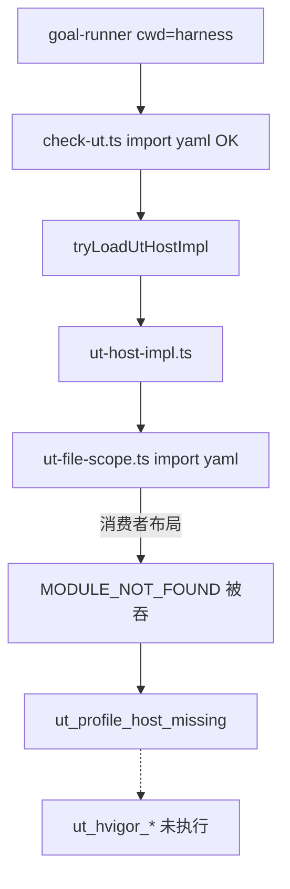

# UT 阶段 `ut_profile_host_missing` 根因验证与修复计划

## 实测结论（已在本仓执行）

### 1. 路径解析实验

在 `framework/harness` 下运行 Node 祖先链分析（profile 文件目录 → 向上找 `node_modules/yaml`）：

```json
{
  "hitsHarnessNodeModules": false,
  "hitsRootNodeModules": true,
  "rootYamlExists": true,
  "harnessYamlExists": true
}
```

含义：

- 从 `profiles/hmos-app/harness/` 向上遍历祖先目录，**永远不会**经过同级的 `harness/node_modules/`（`profiles` 与 `harness` 是兄弟目录，不是父子）。
- 本开发仓因**仓根**也有 `node_modules/yaml`，`tryLoadUtHostImpl` 在本地显示 **OK**，掩盖了消费者纯布局下的失败。
- 模拟工程仅执行 `cd framework/harness && npm install`（framework-init 契约）时，仓根**无** `yaml` → `ut-host-impl` 加载链断裂。

### 2. 与 coding 成功并不矛盾


| 阶段     | profile 模块                                                                                                                        | 裸 npm 依赖                         | hvigor 是否执行                      |
| ------ | --------------------------------------------------------------------------------------------------------------------------------- | -------------------------------- | -------------------------------- |
| coding | `[coding-host-rules.ts](profiles/hmos-app/harness/coding-host-rules.ts)`                                                          | 无（仅 `../../../harness/...` 相对引用） | 是 → `coding_hvigor_build` PASS   |
| ut     | `[ut-host-impl.ts](profiles/hmos-app/harness/ut-host-impl.ts)` → `[ut-file-scope.ts](profiles/hmos-app/harness/ut-file-scope.ts)` | `**import 'yaml'`**（L6）          | **否**（在 `tryLoadUtHostImpl` 即失败） |


`[check-ut.ts](harness/scripts/check-ut.ts)` 自身 L21 也 `import yaml`，但入口在 `harness/scripts/` 下，能解析 `harness/node_modules`；**动态 require profile 模块**时解析基准变成 `profiles/...`，二者不同。

### 3. 错误表象为何像「hvigor 基础设施」

`[profile-host-loader.ts](harness/profile-host-loader.ts)` L71–77：`require(profile/.../ut-host-impl)` 失败时 **catch 吞错返回 null** → `[check-ut.ts](harness/scripts/check-ut.ts)` L3398–3408 报 `ut_profile_host_missing` BLOCKER。  
goal-runner / harness 从未进入 `ut_hvigor_build` / `ut_hvigor_test`。

**结论：用户 goal-run 路径正确；是 framework profile 依赖解析 bug，不是 UT 阶段执行错了。**




### 4. 仓内已有正确范式（应复用）

`[ts-compile.ts](profiles/hmos-app/harness/ts-compile.ts)` L22–25：

```ts
const harnessRequire = createRequire(
  path.resolve(__dirname, '..', '..', '..', 'harness', 'package.json'),
);
const ts = harnessRequire('typescript');
```

从 `profiles/<p>/harness/` 上溯三级到 `framework/`，再进 `harness/package.json`——**dev 与 consumer（`framework/profiles` + `framework/harness`）均成立**。

全 `profiles/` 仅 `[ut-file-scope.ts](profiles/hmos-app/harness/ut-file-scope.ts)` 一处裸 `import 'yaml'`（已 grep 确认）。

---

## 修复方案（最小 diff）

### P0-1. 修 `[profiles/hmos-app/harness/ut-file-scope.ts](profiles/hmos-app/harness/ut-file-scope.ts)`

- 删除 `import * as YAML from 'yaml'`
- 改为与 `ts-compile.ts` 相同的 `createRequire` + `harness/package.json` 锚点：

```ts
const harnessRequire = createRequire(
  path.resolve(__dirname, '..', '..', '..', 'harness', 'package.json'),
);
const YAML = harnessRequire('yaml');
```

- **TS 类型**：与 `ts-compile.ts` 一致，运行时 `harnessRequire` 为 `any`，`YAML.parse(...)` 处保留 `as {...}` 断言即可；非阻塞，不必另加 `import type`。

路径常量与 `ts-compile.ts` **完全一致**（`../../../harness/package.json`）。

### P0-2. 单测：锁定 yaml 解析来源（BLOCKER，防 dev 仓根掩盖）

审查指出：开发仓根也有 `node_modules/yaml`，仅跑 `tryLoadUtHostImpl` 可能 **假绿**。

在 `[harness/tests/unit/profile-decoupling.unit.test.ts](harness/tests/unit/profile-decoupling.unit.test.ts)` 或独立 `profile-yaml-resolve.unit.test.ts` 增加**确定性断言**：

```ts
const harnessPkgPath = path.resolve(hmosProfileDir, '..', '..', 'harness', 'package.json');
const yamlResolved = createRequire(harnessPkgPath).resolve('yaml').replace(/\\/g, '/');
assert(yamlResolved.includes('harness/node_modules'), `yaml must resolve via harness, got ${yamlResolved}`);
```

并保留：

- `tryLoadUtHostImpl(hmosProfileDir)` 非 null（回归）
- 可选：`partitionUtFiles` 冒烟（间接证明模块可加载）

**禁止**仅用「能 require 成功」作为唯一断言。

### P0-3. loader 诊断增强（本轮必做，非可选）

`[profile-host-loader.ts](harness/profile-host-loader.ts)` `tryLoadProfileHarnessModule`：

- catch 时记录 `lastLoadError: string`（模块级或返回值附带），`process.stderr` 一次性输出 `[profile-host-loader] require failed: <baseName>: <message>`

`[check-ut.ts](harness/scripts/check-ut.ts)` `ut_profile_host_missing` 分支：

- `details` 追加 `load_error: ...`（来自 loader；路径可截断）

目的：避免「依赖解析失败」再次被误诊为「hvigor 基础设施坏了」。本轮与主修复一并交付。

### 不纳入本修复

- 不改 goal-runner cwd（已正确）
- 不要求消费者在仓根 `npm install yaml`（违背 harness 安装契约）
- 不顺延大改：把 profile 全迁入 `harness/profiles` 目录

---

## 文档（可选一行）

`[docs/skills/business-ut.md](docs/skills/business-ut.md)` 或 `[docs/profiles/hmos-app-harness-toolchain.md](docs/profiles/hmos-app-harness-toolchain.md)` 维护同步：profile harness 裸 npm 依赖须经 `harness/package.json` 的 `createRequire` 解析（与 `ts-compile` 一致）。仅当触及 `DOC_INVENTORY` source 时需 commit doc 消 `doc_freshness`。

---

## 发布窗口与 plan 门禁（`version: 2.3.0`）

- 本修复并入 **2.3.0 在研窗口**（与根 `[package.json](package.json)` `version` 一致）；**版本号由维护者控制**，实施阶段不擅自 bump。
- `check-plan-version.mjs`：`version: 2.3.0` 与当前窗口匹配 → 检查 todo 状态；3 项 pending 时 `release:verify` **红**（预期，防止未修完就发版）；全部标 `completed` 后门禁自然 **绿**，修复随 **2.3.0** 发布。
- 无 `deferred_to`；不顺延到 2.3.1 / 2.4.0。

---

## 验收

```powershell
cd harness
npm test
npx ts-node -e "const {tryLoadUtHostImpl}=require('./profile-host-loader');const p=require('path').resolve('../profiles/hmos-app');if(!tryLoadUtHostImpl(p))process.exit(1);"
```

消费者烟测（可选）：

```powershell
npm run release:smoke-consumer
```

发版前：`npm run release:verify`

**模拟工程复验**：升级 framework zip → `framework-init` 已装 harness 依赖 → goal `--force-resume` 从 `ut` 继续，`ut_profile_host_missing` 不应再出现。

---

## 风险


| 风险                                       | 缓解                                                       |
| ---------------------------------------- | -------------------------------------------------------- |
| `harness/package.json` 路径在非标 vendor 布局错位 | 与 `ts-compile` 同路径；单测覆盖                                  |
| 未来 profile 再裸 import npm 包               | P0-3 load_error + 文档约定                                   |
| semver                                   | 并入 2.3.0 窗口；版本 bump 由维护者决定，实施不擅自改 `package.json.version` |


