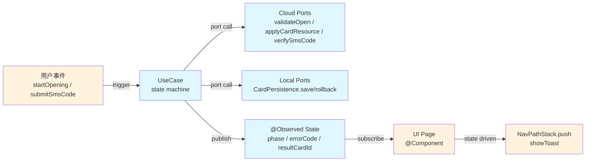

# UT 分层分工 + UseCase 端到端化方案（v2）

## 背景：两次升级后的完整诉求

| 轮次 | 澄清点 |
|---|---|
| 轮 1 | UT 不应只统计"声明覆盖"；UI 类 AC 交真机；纯 UI 替身（Fake NavPathStack 等）不要做 |
| 轮 2 | 但 UT **必须能跑完一条业务流程**（2→3→4→6→7 的云侧/本地/用户事件串联），多个用例覆盖：成功、校验失败、短验失败、持久化失败等端到端分支 |

核心矛盾：**业务流程要端到端地测** 且 **不 mock UI**——唯一自洽的出路是把"业务流程"从页面里抽出来成为独立 **UseCase**，UT 只测 UseCase。

---

## 方案：UseCase 作为一等公民（贯穿 Skill 1→6）

### 一、UseCase 模型



- 浅蓝区域（`UseCase`、Ports、State）：**UT 端到端覆盖**
- 橙色区域（UI、导航/Toast、真实用户输入）：**Skill 6 真机覆盖**
- UT 里"用户事件"通过**直接调用 UseCase 方法**完成；不需要 fake 任何 ArkUI

### 二、use-cases.yaml（新增的 feature Spec）

路径：`doc/features/{module}/use-cases.yaml`

```yaml
schema_version: "1.0"
feature: "card-opening"

use_cases:
  - id: "card_opening"
    class: "CardOpeningUseCase"
    file: "02-Feature/CardOpen/src/main/ets/domain/usecase/CardOpeningUseCase.ets"
    description: "银行卡开卡完整流程"

    triggers:
      - event: "startOpening"
        params: [{ name: "bankInfo", type: "BankInfo" }]
        from_ac: ["AC-1"]
      - event: "submitSmsCode"
        params: [{ name: "smsCode", type: "string" }]
        from_ac: ["AC-5"]

    ports:
      - name: "api"
        type: "CardOpenApi"
        ownership: "cloud"
        methods:
          - { name: "validateOpen",      params: ["BankInfo"],        returns: "ValidateResult" }
          - { name: "applyCardResource", params: ["ValidateResult"],  returns: "CardResource"  }
          - { name: "verifySmsCode",     params: ["string","string"], returns: "VerifyResult"  }
      - name: "storage"
        type: "CardPersistence"
        ownership: "local"
        methods:
          - { name: "save",     params: ["CardInfo"] }
          - { name: "update",   params: ["CardInfo"] }
          - { name: "rollback", params: ["string"] }

    state_model:
      phases:  [Idle, Validating, Applying, Persisting, WaitingSms, Verifying, Success, Failed]
      fields:
        - { name: "errorCode",    type: "string | null" }
        - { name: "resultCardId", type: "string | null" }

    branches:
      - id: "happy_path"
        scenario: "开卡全链路成功"
        setup: { api.validateOpen: ok, api.applyCardResource: ok, storage.save: ok, api.verifySmsCode: ok }
        expected_phase_sequence: [Idle, Validating, Applying, Persisting, WaitingSms, Verifying, Success]
        expected_port_calls: ["api.validateOpen", "api.applyCardResource", "storage.save", "api.verifySmsCode", "storage.update"]
        linked_acceptance: ["AC-1"]

      - id: "validate_fail"
        scenario: "云侧开卡校验失败，不触发持久化"
        setup: { api.validateOpen: fail:VAL_ERR }
        expected_phase_sequence: [Idle, Validating, Failed]
        expected_port_calls: ["api.validateOpen"]
        expected_state: { errorCode: "VAL_ERR" }
        not_called: ["storage.save", "api.applyCardResource"]
        linked_acceptance: ["AC-2"]

      - id: "sms_fail_rollback"
        scenario: "短验失败，回滚本地已写入的卡记录"
        setup: { api.validateOpen: ok, api.applyCardResource: ok, storage.save: ok, api.verifySmsCode: fail:SMS_ERR }
        expected_phase_sequence: [Idle, Validating, Applying, Persisting, WaitingSms, Verifying, Failed]
        expected_port_calls: ["api.validateOpen", "api.applyCardResource", "storage.save", "api.verifySmsCode", "storage.rollback"]
        linked_acceptance: ["AC-3"]

      - id: "persist_fail"
        scenario: "本地持久化写入失败，流程终止，不进入短验"
        setup: { api.validateOpen: ok, api.applyCardResource: ok, storage.save: throw }
        expected_phase_sequence: [Idle, Validating, Applying, Persisting, Failed]
        expected_port_calls: ["api.validateOpen", "api.applyCardResource", "storage.save"]
        not_called: ["api.verifySmsCode"]
        linked_acceptance: ["AC-4"]
```

### 三、acceptance.yaml 变更（补字段，不重构）

```yaml
- id: "AC-3"
  priority: "P0"
  description: "短验失败，已写入本地的卡被回滚"
  ut_layer: "unit"               # unit | device | both
  ut_focus: "state 最终为 Failed；storage.rollback 被调用；storage.save 数据不残留"
  linked_flow: "card_opening"    # 指向 use-cases.yaml
  linked_branch: "sms_fail_rollback"
```

### 四、Skill 2 / 3 的新约束（这是能端到端 UT 的根本保证）

**Skill 2（design）**

- 必须产出 `use-cases.yaml`（若该 feature 涉及多步骤业务流程）
- `design.md` 新增「业务流程 UseCase 清单」章节，含状态机 Mermaid
- UseCase 的 ports 必须与 `contracts.yaml.interfaces` 对齐（一个 port 就是一个 interface）

**Skill 3（coding）**

- UseCase 类放在 `{module}/src/main/ets/domain/usecase/`（新分层位置，符合现有 `shared/data/domain/presentation` 序列）
- UseCase **构造器注入**所有 ports；严禁 `new XxxRepository()` 等硬依赖
- UseCase 文件 **禁止 import**：`@Component`、`@Consume`、`@Provide`、`NavPathStack`、`$r`、`showToast`、`getUIContext`、`@kit.AbilityKit`、`@aspect/CommUI`
- 页面层（`@Component`）只负责：订阅 UseCase 的 state（通过 `@ObjectLink` 或 `@Watch`），根据 state 翻译成 `navPathStack.pushPath` / `showToast`
- 页面层 **不得在** `onClick` 里直接写业务逻辑，必须转发到 `useCase.xxxTrigger(...)`

### 五、Skill 5 / DAG 扩展

**DAG 节点类型新增/精化**（`framework/skills/5-business-ut/templates/dag-schema.md`）：

| 类型 | 说明 | UT 映射 |
|---|---|---|
| `user_trigger` | 用户事件入口（对应 UseCase.trigger 方法） | 直接调 `useCase.startOpening(...)` |
| `port_call_cloud` | 云侧端口调用 | UT 中 SpyPort 预设返回值/异常 |
| `port_call_local` | 本地端口调用（持久化/文件） | SpyPort + 副作用记录 |
| `state_transition` | UseCase 内部 state 迁移 | `expect(useCase.state.phase).assertEqual(...)` |
| `assertion` | 组合断言 | 聚合 state + port 调用序列断言 |

**DAG 文件头新增字段**：

```yaml
flow_id: card_opening_sms_fail
flow_name: 开卡-短验失败分支
use_case: CardOpeningUseCase   # ← 新增：必须匹配 use-cases.yaml 中的 class
branch: sms_fail_rollback      # ← 新增：必须匹配该 UseCase 的 branch id
linked_acceptance: [AC-3]
```

### 六、ut-rules.yaml 规则（结构/语义/追溯三组）

**Structure（BLOCKER）**

- `usecase_spec_exists`：若 feature 的 design 声明存在业务流程，则 `use-cases.yaml` 必须存在
- `usecase_class_pure`：UseCase 源文件不得 import UI/Nav/Toast 符号
- `dag_linked_usecase`：每个 DAG 必须声明 `use_case` 与 `branch`，且在 use-cases.yaml 中存在
- `ports_all_stubbed`：UseCase 声明的每个 port，UT 中必须有对应 Spy/Stub 类且通过构造器注入
- `no_ui_dep_in_ut`：UT 文件禁 import UI/Nav/Toast 符号（白名单：`@ohos/hypium` + 被测 UseCase + ports 所在文件）
- `it_name_has_ac_or_branch_tag`：`it()` 名称必须以 `[AC-X]` 或 `[BRANCH-xxx]` 开头

**Traceability（BLOCKER）**

- `branch_coverage_full`：use-cases.yaml 中每个 UseCase 的所有 branches，在 UT 中必须至少各有一个 `it()`（以 `[BRANCH-id]` 或 `[AC-X]`+branch 绑定两种方式之一识别）
- `ut_case_per_unit_ac`：每条 `ut_layer in [unit, both]` 且 `priority in [P0, P1]` 的 AC，必须能找到对应 `it()`
- `acceptance_coverage`（修订）：分母只计 `ut_layer in [unit, both]`

**Semantic（MAJOR，verify-ut.md）**

- `state_model_completeness`：UseCase 的 state_model 能否表达所有业务分支（由 AI 复核）
- `port_abstraction_quality`：ports 是否过度/不足抽象（云侧/本地边界是否清晰）
- `end_to_end_driving`：UT 中 `it()` 是否**真的驱动了完整链路**——启发式：覆盖 ≥ 2 个 port 调用且 ≥ 2 次 state 断言
- `branch_coverage_semantic`：AI 复核分支覆盖是否涵盖关键异常路径（对比 PRD 异常场景表）
- `device_ac_delegation`：`ut_layer in [device, both]` 的 AC 在 `device-testing-todo.md` 或 Skill 6 计划中出现

### 七、UT 模板骨架（替换现有 ut-template.md）

```typescript
import { describe, it, expect, beforeEach } from '@ohos/hypium';
import { CardOpeningUseCase, Phase } from '../../../main/ets/domain/usecase/CardOpeningUseCase';
import { SpyCardOpenApi } from './spy/SpyCardOpenApi';
import { SpyCardPersistence } from './spy/SpyCardPersistence';

export default function cardOpeningUseCaseTest() {
  describe('CardOpeningUseCase', () => {
    let api: SpyCardOpenApi;
    let storage: SpyCardPersistence;
    let useCase: CardOpeningUseCase;

    beforeEach((): void => {
      api = new SpyCardOpenApi();
      storage = new SpyCardPersistence();
      useCase = new CardOpeningUseCase(api, storage);
    });

    it('[BRANCH-happy_path][AC-1] 开卡全链路成功', 0, async () => {
      api.whenValidateOpen.returns({ ok: true, token: 't' });
      api.whenApplyCardResource.returns({ cardId: 'c1', holder: 'u1' });
      api.whenVerifySmsCode.returns({ ok: true });

      await useCase.startOpening({ bankCode: 'BOC' });
      expect(useCase.state.phase).assertEqual(Phase.WaitingSms);
      expect(storage.saved[0].cardId).assertEqual('c1');

      await useCase.submitSmsCode('123456');
      expect(useCase.state.phase).assertEqual(Phase.Success);
      expect(api.callLog).assertDeepEqual(
        ['validateOpen', 'applyCardResource', 'verifySmsCode']
      );
      expect(storage.callLog).assertDeepEqual(['save', 'update']);
    });

    it('[BRANCH-sms_fail_rollback][AC-3] 短验失败，回滚已写入的卡记录', 0, async () => {
      api.whenValidateOpen.returns({ ok: true, token: 't' });
      api.whenApplyCardResource.returns({ cardId: 'c1', holder: 'u1' });
      api.whenVerifySmsCode.returns({ ok: false, code: 'SMS_ERR' });

      await useCase.startOpening({ bankCode: 'BOC' });
      await useCase.submitSmsCode('999999');

      expect(useCase.state.phase).assertEqual(Phase.Failed);
      expect(useCase.state.errorCode).assertEqual('SMS_ERR');
      expect(storage.callLog).assertDeepEqual(['save', 'rollback']);
      expect(storage.currentCards.length).assertEqual(0);
    });
  });
}
```

关键特征：

- 无任何 UI import
- 一个 `it()` 端到端驱动 **多个** port + **多个** state 检查点
- `SpyPort` 提供「预设返回值」+「调用序列记录」两种能力（样例随 Skill 5 `templates/spy-template.md` 一并给出）

### 八、home-page 迁移（轻量 UseCase 演示）

home-page 没有多步骤交互，但仍按新模型迁移一遍作验证：

- 新增 `HomeLoadingUseCase`（ports=`HomeRepository`，state={phase, errorCode}，triggers=`onAppear`）
- branches：`happy_load` / `empty_services` / `empty_promos` / `repo_failure`
- `HomeTabPage` 改为订阅 `useCase.state` 并由 state 驱动 Toast/展示
- acceptance.yaml 补 `ut_layer`：`AC-2` / `AC-10` / `BD-1` / `BD-2` 为 unit/both；其余 device
- 产出 `home_loading.dag.yaml` + `home_loading.test.ets` + `device-testing-todo.md`

### 九、Skill 6 衔接

- 消费 `doc/features/{module}/device-testing-todo.md`
- 在 Skill 6 的测试计划与报告中，`ut_layer in [device, both]` 的 AC 必须逐条追溯
- `device_ac_delegation` 检查先以 MAJOR 入场，Skill 6 Harness 就绪后升级到 BLOCKER

---

## 受影响的产物一览

| 层 | 文件 | 改动 |
|---|---|---|
| Skill 1 | acceptance 生成 prompt | 加 ut_layer/ut_focus/linked_flow/linked_branch |
| Feature Spec | `doc/features/{module}/use-cases.yaml` | **新增 Schema** |
| Skill 2 | `framework/skills/2-requirement-design/SKILL.md` | 要求产出 use-cases.yaml + design.md 新章节 |
| Skill 3 | `framework/skills/3-coding/SKILL.md` | UseCase 分层 + DI + 禁 UI import |
| Skill 5 | SKILL.md / dag-schema.md / ut-template.md | 按 UseCase 端到端；新增 user_trigger/port_call_* 节点类型；SpyPort 模板 |
| Skill 5 样例 | `framework/skills/5-business-ut/examples/card-opening/` | **新增规范级样例** |
| Skill 6 | SKILL.md | 消费 device-testing-todo.md |
| Spec | [ut-rules.yaml](framework/specs/phase-rules/ut-rules.yaml) | 9 条新规则 + 修订 acceptance_coverage |
| Harness 脚本 | [check-ut.ts](framework/harness/scripts/check-ut.ts) | 新增对应 check 函数 |
| Harness Prompt | [verify-ut.md](framework/harness/prompts/verify-ut.md) | 新增 5 项语义检查 |
| 示例迁移 | home-page 全套产物 | acceptance 补字段 + 抽 UseCase + 重写 DAG/UT |

## 风险与取舍

- **Skill 3 改 UseCase 分层成本**：对既有代码是一次性重构，后续 feature 按模板走即可；迁移期用"渐进式"，`usecase_spec_exists` 在 feature 无流程时 SKIP。
- **无开卡模块作为现实样例**：通过 `examples/card-opening/` 沉淀为"纸面样例"作为 AI/人的锚点；home-page 做最小演示，弥补无真实复杂流程的短板。
- **UI 副作用的观测性**：UseCase 只 publish state，"是否触发了 Toast/导航"在 UT 完全不测——这是刻意为之；Skill 6 必须覆盖对应 device AC，否则该 AC 在整条流水线上零覆盖，通过 `device_ac_delegation` 硬门禁兜底（后续升 BLOCKER）。
- **分支爆炸**：分支数量由 use-cases.yaml 显式列出，DAG/UT 1:1 对应；AI 不会无限扩分支，人可控。
