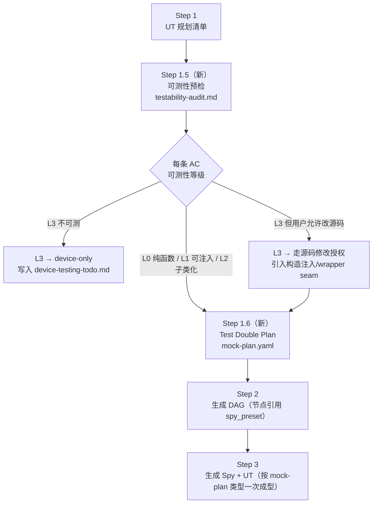

## 背景与根因

从用户给的 `HWP-PaymentButton` 失败对话看，UT 写不出来由 3 层根因叠加导致：

- **L1 不可测代码**：`BankCardOpenQrNfcOperator` 直接依赖 `JumpManager.routerPush` 等全局单例 + 内部 inline lambda，无任何「构造注入 / setter / 子类化」接缝（seam）。
- **L2 ArkTS 强类型 + 禁 `any`**：DAG 当前只给 `mock_data.success.value: "{ ok: true, token: 't' }"` 字面量字符串，没有显式类型；ArkTS 编译器要求每个对象字面量都能映射到具名 `interface` / `class`。
- **L3 缺可测性预检**：[`framework/skills/5-business-ut/SKILL.md`](framework/skills/5-business-ut/SKILL.md) 的 Step 1「UT 规划清单」不要求先确认每条 AC 的被测入口能否被 UT 调用 + mock 注入，AI 直到 Step 3 写代码才发现卡死，已经烧掉大量上下文。

仅扩 DAG 字段只能解决 L2；本方案三层一起打，并按可落地难度分 3 阶段。

---

## 总体设计



**核心思想**：把「写不出来」前置成「**预检阶段就发现并显式归类**」，把「mock 写不对」前置成「**先固化类型骨架，再填实现**」。

---

## P1 — 可测性预检（最小可用，落地优先）

### 新增产物：`doc/features/<feature>/ut/testability-audit.md`

每条 `acceptance.yaml` 中 `ut_layer ∈ {unit, both}` 的 AC 必须有一条记录：

```yaml
acceptance_id: AC-5
entry_point:
  symbol: BankCardOpenQrNfcOperator.checkCanBindHWP
  file: 02-Feature/.../BankCardOpenQrNfcOperator.ets
testability_level: L0 | L1 | L2 | L3
dependencies:
  - name: JumpManager
    kind: global_singleton          # global_singleton / inline_lambda / di_injectable / pure / system_api
    seam: none                       # none / constructor_injection / setter / subclass_override / proto_replace
verdict: testable | downgrade_device | needs_seam
recommendation:
  option_a: "标记 device-only，写入 device-testing-todo.md"
  option_b: "源码改造：把 JumpManager 提为构造参数（需用户确认走 ut_no_src_mutation 授权流程）"
selected: option_a   # 用户确认后填
```

### 文件改动

- 新增 [`framework/skills/5-business-ut/templates/testability-audit-template.md`](framework/skills/5-business-ut/templates/testability-audit-template.md)：审计表模板 + 4 级判定标准（L0/L1/L2/L3）+ 每种依赖类型对应 seam 选项。
- 修改 [`framework/skills/5-business-ut/SKILL.md`](framework/skills/5-business-ut/SKILL.md)：在现有 Step 1「UT 规划清单」与 Step 2「生成 DAG」之间插入 **Step 1.5**，HARD STOP 等用户对每个 L3 项做 a/b 二选一。
- 修改 [`framework/specs/phase-rules/ut-rules.yaml`](framework/specs/phase-rules/ut-rules.yaml)：新增 BLOCKER：
  - `ut_testability_audit_present`：`testability-audit.md` 存在且覆盖每条 unit/both AC
  - `ut_unsupported_targets_handled`：每条 L3 必须 `selected ∈ {option_a, option_b}`，option_a 必须在 `device-testing-todo.md` 出现，option_b 必须在 `gap-notes.md > approved_src_mutations[]` 登记
- 修改 [`framework/harness/scripts/check-ut.ts`](framework/harness/scripts/check-ut.ts)：新增两个 check 函数；缺失时 details 给出生成模板路径，避免 AI 凭空猜结构。

**P1 已经能解决你这次 `HWP-PaymentButton` 的 90% 痛苦**：AI 在 Step 1.5 就会因为 `JumpManager` 单例直接判 L3，向你请示「降级 device-only / 改源码」，而不是烧 52 分钟在 Step 3 撞墙。

---

## P2 — Test Double Plan（杀掉 ArkTS 类型反复）

### 新增产物：`doc/features/<feature>/ut/mock-plan.yaml`

```yaml
schema_version: "1.0"
feature: <feature>
imports:                         # 集中声明类型 import，避免 spy / preset 各自又写一遍
  - { symbol: VerifyResult, from: "02-Feature/.../model/VerifyResult" }
  - { symbol: BizError,     from: "00-Common/.../shared/BizError" }
spies:
  - target_class: CardCloudApi             # 必须 ∈ contracts.yaml > interfaces[].class
    target_file:  02-Feature/.../api/CardCloudApi.ets
    base_strategy: subclass                # subclass | prototype_override
    spy_fields:
      - { name: callLog, type: "string[]", default: "[]" }
    methods:
      - name: verifyCard
        params:
          - { name: draft, type_text: "CardDraft" }
        return_type: { text: "Promise<VerifyResult>" }
        presets:
          - id: success
            returns: { ts_expr: "{ ok: true, token: 't' } as VerifyResult" }
          - id: error_sms
            throws:  { ts_expr: "new BizError('SMS_ERR')" }
fixtures:                        # 复用测试数据（取代散落 inline 字面量）
  - { name: draftSample, type: "CardDraft", ts_expr: "..." }
```

### 关键约束

- 每个 `presets[].returns.ts_expr` 必须**显式带类型断言**（`as VerifyResult` 或显式构造），ArkTS 编译期一次过；
- `target_class` 与 `methods[].name` 必须匹配 [`doc/features/<feature>/contracts.yaml`](doc/features/home-page/contracts.yaml) 的 `interfaces[]` 声明；
- mock-plan 是**唯一**的 spy 真源，DAG / UT 都通过 `preset id` 引用。

### 文件改动

- 新增 [`framework/skills/5-business-ut/templates/mock-plan-schema.md`](framework/skills/5-business-ut/templates/mock-plan-schema.md)：完整 Schema + 示例 + 「ArkTS 类型化 mock 写法对照（错例 vs 正例）」。
- 修改 [`framework/skills/5-business-ut/SKILL.md`](framework/skills/5-business-ut/SKILL.md)：插入 **Step 1.6 生成 mock-plan.yaml**（位于 1.5 之后、Step 2 之前），HARD STOP 等用户确认 spy 边界与 preset 列表。
- 修改 [`framework/skills/5-business-ut/templates/mock-strategy.md`](framework/skills/5-business-ut/templates/mock-strategy.md)：明确 Spy 类生成必须 1:1 翻译 mock-plan，禁止 AI 在 Spy 内自由发挥字段。
- 修改 [`framework/specs/phase-rules/ut-rules.yaml`](framework/specs/phase-rules/ut-rules.yaml) 新增 BLOCKER：
  - `ut_mock_plan_present`：每条 L0/L1/L2 AC 对应的所有 boundary 必须在 mock-plan 里有 spy 条目
  - `ut_mock_plan_typed`：每个 preset 必须有 `ts_expr` 且包含类型断言或构造表达式（粗校验 `as \w+|new \w+\(`）
  - `ut_mock_plan_contracts_consistent`：`target_class` / `methods[].name` 与 contracts.yaml 一致
- 修改 [`framework/harness/scripts/check-ut.ts`](framework/harness/scripts/check-ut.ts)：新增三个对应 check；解析 mock-plan.yaml 时容错兜底。
- 修改 [`framework/harness/prompts/verify-ut.md`](framework/harness/prompts/verify-ut.md)：语义层 review mock-plan 的 preset 是否足以覆盖 DAG 全部分支（happy + 失败 + 回滚）。

---

## P3 — DAG 类型化引用（消除双源不一致）

### DAG schema 修改

[`framework/skills/5-business-ut/templates/dag-schema.md`](framework/skills/5-business-ut/templates/dag-schema.md)：在 `port_call_cloud` / `port_call_local` / `async_call` 节点上：

```yaml
boundary:
  name: cloudApi
  type: CardCloudApi
  method: verifyCard
spy_preset: success            # 新增；引用 mock-plan.yaml > spies[].methods[].presets[].id
# 旧 mock_data: { success: { value: "..." } }  → 标记 deprecated，过渡期共存
```

### 优点

- DAG 节点不再承载「字面量字符串」类型猜谜，类型骨架完全交给 mock-plan；
- DAG 仍然只表达**业务流拓扑**，职责保持单一；
- AI 在 Step 3 写 UT 时，对每个节点只需 `spy.preset('success')` 一行，不再写 inline 字面量。

### harness 改动

- [`framework/specs/phase-rules/ut-rules.yaml`](framework/specs/phase-rules/ut-rules.yaml) 新增 BLOCKER：
  - `dag_spy_preset_resolvable`：`spy_preset` 引用的 preset id 必须在 mock-plan 里存在
- [`framework/harness/scripts/check-ut.ts`](framework/harness/scripts/check-ut.ts)：新增对应 check。
- 过渡期（≥ 1 个版本）：保留对历史 DAG `mock_data` 字段的兼容；harness 同时接受旧/新写法，但 verify-ut.md 优先推荐新写法。

---

## 与既有规则的接缝

- **不动 `ut_no_src_mutation`**：testability-audit 的 option_b 路径走的就是它现有的「先 gap-notes 登记 approved_src_mutations[]，再改源码」流程，本次只在 SKILL.md 里把入口讲清，不放宽门禁。
- **不动 `boundaries_all_stubbed`**：仍要求 UT 里每个 boundary 有 spy；现在 spy 形态由 mock-plan 标准化。
- **不动 contracts.yaml 主结构**：但在 Skill 2 的 SKILL.md 里加一行提示——`interfaces[].methods` 必须含完整入参/返回类型文本，否则 P2 mock-plan 生成时无源可循。

---

## 落地顺序与里程碑

| 阶段 | 范围 | 改动文件数（估） | 风险 |
|---|---|---|---|
| **P1** | 可测性预检 + 2 个 BLOCKER | SKILL.md / ut-rules.yaml / check-ut.ts / 1 模板 | 低；只多 1 份审计文档 |
| **P2** | mock-plan + 3 个 BLOCKER | + mock-plan-schema.md / mock-strategy.md / verify-ut.md | 中；存量 feature 需补 mock-plan |
| **P3** | DAG `spy_preset` + 1 个 BLOCKER | dag-schema.md / check-ut.ts | 低（兼容旧字段） |

**建议**：本轮先实现 **P1**，让 `HWP-PaymentButton` 这种场景立即得到救赎；P2/P3 在 P1 跑通至少 1 个真实 feature 后再推。

---

## 待确认开放点（已闭环 · 2026-05-08）

下列三项已在工程内落地，**权威表述以代码与 Skill 正文为准**；本节仅作计划书收口，避免与 frontmatter `todos` 状态矛盾。

| # | 议题 | 决议摘要 | SSOT |
|---|------|----------|------|
| 1 | **存量 feature 迁移** | 已在历史 UT PASS 的 feature **仅当再次进入 Skill 5 且变更 UT 相关产物时** 回补 `ut/testability-audit.md` 与 `ut/mock-plan.yaml`；**新 feature 自 v2.3 起一律强制**。`home-page` 等已具备审计 + mock-plan + DAG `spy_preset` 可对齐此项。 | [`framework/skills/5-business-ut/SKILL.md`](../../framework/skills/5-business-ut/SKILL.md)「UT 可测性 / mock-plan 策略决议（v2.3）」§1 |
| 2 | **L3 + option_b 接缝白名单** | 仅允许 **构造注入、包装 wrapper、提取命名方法、setter 注入**；**禁止**「换一种全局单例」式敷衍。 | 同上 §2；`ut_unsupported_targets_handled` + gap-notes 授权流 |
| 3 | **Cursor / Claude 入口** | **已做**：Cursor `framework/agents/cursor/templates/skills/ut-audit/` → `.cursor/skills/ut-audit/`；Claude `ut-audit.md` → `/ut-audit`。仍须 **完整阅读** Skill 5 后自 Step 1.5 切入。 | 同上 §3；[`framework/agents/cursor/templates/skills/ut-audit/SKILL.md`](../../framework/agents/cursor/templates/skills/ut-audit/SKILL.md)、[`framework/agents/claude/templates/commands/ut-audit.md`](../../framework/agents/claude/templates/commands/ut-audit.md) |

**回归保险**：`framework/profiles/hmos-app/harness/tests/fixtures/v2_2/` 下 `ut_v23_*` 系列 fixture（见 [`framework/harness/tests/README.md`](../../framework/harness/tests/README.md)）对 v2.3 脚本门禁做阴性覆盖；全量 `cd framework/harness && npm test` 应通过。

> **说明**：Framework 四件套闭环（某 feature 的 trace / harness ut / verifier / phase-completion-receipt）仅在整个 **UT 阶段交付** 时产生；本计划书范围是 **机制与模板 + harness + 适配器入口**，不等价于替某一业务 feature 跑完 UT 阶段闭环。

---

## 机制闭环确认（计划书维度 · 2026-05-08）

本节表示：**本计划所列 P1/P2/P3、todos、harness/fixtures、适配器模板**已与当前仓库对齐，**无再在计划书里登记的待办条目**。

| 核对项 | 状态 |
|--------|------|
| **frontmatter todos**（`p1`–`p3` / fixtures / adapters / decisions） | 全部为 `completed` |
| **`check-ut.ts`** | 含 `ut_testability_audit_present`、`ut_unsupported_targets_handled`、`ut_mock_plan_*`、`dag_spy_preset_resolvable` 等门禁 |
| **Skill / 模板** | `Skill 5` 含 Step 1.5/1.6；`testability-audit-template.md` / `mock-plan-schema.md` / `dag-schema.md`（`spy_preset`）已存在 |
| **Harness 回归** | `cd framework/harness && npm test`：**108** unit + **23** fixture 全通过（含 `ut_v23_*` 全套） |

**仍需人工完成、但不属于「计划未写完」的范畴**：合并到主分支时请把 **`framework/agents/*/templates/` 下的 ut-audit 产物与实例 `.cursor/skills/ut-audit`** 一并纳入版本控制（或通过后续 `framework-init` 下发），避免新克隆仓库缺跳板。