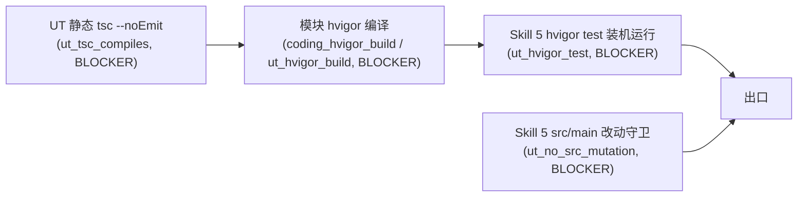

## 背景与定性

当前 coding / ut harness 只做**静态结构检查**。三个真实痛点：
1. Claude 写的 UT 常带大量 `tsc` 编译错误，harness 却 PASS（无编译校验）。
2. `named_business_handler` 的正则只认传统 `function xxx` / 类方法 `xxx()`，误杀了 ArkTS 合法的类字段函数（`handler = async () => {}`）。
3. UT skill 遇到 `named_business_handler` 误报时，Claude 绕过用户直接往业务源码里塞新函数方便调用，违反"必要函数抽取须征得用户同意"的红线。

## 核心策略

三道护栏（由便宜到昂贵，从 Skill 3 延伸到 Skill 5）：



---

## 1. 方案 A：UT 静态编译 BLOCKER（`ut_tsc_compiles`）

### 落点
- 规则定义：[framework/specs/phase-rules/ut-rules.yaml](framework/specs/phase-rules/ut-rules.yaml) 新增 `structure_checks.ut_tsc_compiles`，severity=BLOCKER。
- 实现：[framework/harness/scripts/check-ut.ts](framework/harness/scripts/check-ut.ts) 新增 `checkUtTscCompiles(ctx)`，在 `safeRun` 名单里注册。
- 共享工具：新建 [framework/harness/scripts/utils/ts-compile.ts](framework/harness/scripts/utils/ts-compile.ts)，用 TypeScript Compiler API (`ts.createProgram`) 对目标 UT 文件做 `noEmit` 扫描；避免 shell 化带来的 Windows/PowerShell 兼容问题。

### 逻辑
- 输入：`02-Feature/<module>/src/ohosTest/ets/test/**/*.test.ets`（从 `coordinator_file` 所属模块推断）+ 必要 `lib.d.ts`。
- 使用宽松 `tsconfig`（`allowJs: false, noEmit: true, target: ES2020, moduleResolution: node, skipLibCheck: true`），避免被工程 tsconfig 的严苛模式误伤。
- 过滤规则：仅对诊断 severity = `Error` 的项汇总为 BLOCKER 明细，输出 `file:line:col  TSxxxx  message`。

### 报告
- 通过：`PASS [BLOCKER] ut_tsc_compiles: N 个 UT 文件编译无 Error`
- 失败：`FAIL [BLOCKER] ut_tsc_compiles: 3 个 UT 文件存在 N 条 Error` + details 列前 30 条。

---

## 2. 方案 B：模块级 hvigor 编译（Skill 3 / Skill 5 共用）

### 2.1 Harness 侧实现
- 新建 [framework/harness/scripts/utils/hvigor-runner.ts](framework/harness/scripts/utils/hvigor-runner.ts)，封装：
  - `runHvigorBuild(moduleName, cwd) -> { ok, durationMs, logPath, errors[] }`
  - 命令：`hvigorw --mode module -p module=<module>@default -p product=default assembleHap --no-daemon`（Windows 下走 `hvigorw.bat`）
  - 日志落盘：`framework/harness/reports/<feature>/<phase>/hvigor-build.log`
  - 解析：抓取 `> hvigor ERROR` / `ArkTS:ERROR` / `error TSxxxx` 行。
- [framework/harness/scripts/check-coding.ts](framework/harness/scripts/check-coding.ts) 新增 `checkCodingHvigorBuild`（BLOCKER, id=`coding_hvigor_build`）。
- [framework/harness/scripts/check-ut.ts](framework/harness/scripts/check-ut.ts) 新增 `checkUtHvigorBuild`（BLOCKER, id=`ut_hvigor_build`），覆盖 ohosTest 模块。
- 规则定义：同步到 [framework/specs/phase-rules/coding-rules.yaml](framework/specs/phase-rules/coding-rules.yaml) 和 [framework/specs/phase-rules/ut-rules.yaml](framework/specs/phase-rules/ut-rules.yaml)。
- 触发策略：**默认启用**（与用户最新立场一致：编译是必要出口）。提供一个**逃生阀** `HARNESS_SKIP_HVIGOR=1`，触发时不是 SKIP 而是 `FAIL [BLOCKER]`，details 说明"显式跳过真实编译不被允许作为出口"。这样避免内网 CI 悄悄绕过。

### 2.2 Skill 侧"自修复闭环"
- [framework/skills/3-coding/SKILL.md](framework/skills/3-coding/SKILL.md) Step 6.5 新增"编译闭环"：
  1. 执行 `hvigorw assembleHap`
  2. 读取日志 `hvigor-build.log`
  3. 若有错 → 定位文件/行 → 回到 Step 3 修复（不得绕过）
  4. 再跑直到成功
- [framework/skills/5-business-ut/SKILL.md](framework/skills/5-business-ut/SKILL.md) Step 7.5 同结构新增"UT 编译闭环"。

---

## 3. 方案 C：Skill 5 hvigor test 真实运行（装机）

### 3.1 事实前提（已和用户确认）
- 项目 UT 在 `02-Feature/WalletMain/src/ohosTest/` 下，是 hypium 形态，**物理上需要设备 / 模拟器**。
- "无设备就 SKIP → PASS" 是当前假通过的根因，必须纠正。

### 3.2 Harness 侧实现
- `hvigor-runner.ts` 新增：
  - `runHvigorTest(moduleName, cwd) -> { ok, passCount, failCount, skippedCount, logPath, failures[] }`
  - 命令：`hvigorw --mode module -p module=<module>@ohosTest test --no-daemon`
  - 解析 hypium 输出：`OHOS_REPORT_STATUS` / `OHOS_REPORT_CODE` / `OHOS_REPORT_RESULT` 行；或若使用 JUnit XML，直接解析。
- [framework/harness/scripts/check-ut.ts](framework/harness/scripts/check-ut.ts) 新增 `checkUtHvigorTest`（BLOCKER, id=`ut_hvigor_test`）。
- 规则定义：`framework/specs/phase-rules/ut-rules.yaml` 新增条目。
- **无设备处理**（关键修正）：
  - harness 先探测设备：`hdc list targets`，若无设备（或返回 `[Empty]`）→ **不再 SKIP**，直接 `FAIL [BLOCKER] ut_hvigor_test: 未检测到可用设备/模拟器，出口条件未满足`。
  - details 附引导：用户必须在本机接入真机 / 启动模拟器再跑，不允许"无设备即放行"。
- 逃生阀：同 2.1，`HARNESS_SKIP_HVIGOR_TEST=1` 时也是 `FAIL`，不是 SKIP。

### 3.3 Skill 侧闭环
- Skill 5 SKILL.md Step 7.6 "UT 装机运行闭环"：
  1. `hdc list targets` 确认设备
  2. `hvigorw ... test`
  3. 解析日志中的 failure，回到 Step 3/4 修 UT 或修 DAG
  4. 不得因为"本地没设备"而标绿

---

## 4. 放宽 `named_business_handler`：识别 ArkTS 类字段函数

### 根因
[framework/harness/scripts/utils/named-handler.ts](framework/harness/scripts/utils/named-handler.ts) 第 93-95 行的三条正则漏掉以下合法命名形态：

```typescript
handleClick = async () => { /* ... */ }
handleClick = function(x: number) { /* ... */ }
handleClick: () => void = async () => { /* ... */ }
handleClick: MyFuncType = () => { /* ... */ }
```

这些都是**有稳定命名符号、UT 可直接 `instance.handleClick()` 调用**的合法业务入口。

### 改造
新增 2 条正则（合并成 `reFieldFunc`）：

```typescript
// (1) 类字段或 const 赋值为箭头/函数表达式，允许中间有类型注解
const reFieldFunc = new RegExp(
  `\\b${symbol}\\b` +
  `(?:\\s*:\\s*[^;=\\n]+)?` +       // 可选：`: () => void` 类型注解
  `\\s*=\\s*` +                     // 必有 =
  `(?:async\\s+)?` +                // 可选 async
  `(?:function\\b|\\([^)]*\\)\\s*=>)`  // function 表达式 或 (...)=> 箭头
);
```

- 合并到 `found = ... || reFieldFunc.test(f.content)`。
- 避免误判：仍要求 `symbol` 是合法标识符且在源文件中完整出现。
- 单测：用 `.cursor/plans/test-fixtures/`（或 inline 在脚本里 assert）覆盖 4 种字段写法、1 种 inline lambda（必须不匹配）。

### 对应文案修订
- [framework/skills/3-coding/SKILL.md](framework/skills/3-coding/SKILL.md) 第 258 行、第 300 行的"不是 inline lambda"措辞改为："不是**匿名**直接挂在 UI 事件上的 inline lambda；类字段 / const 命名的箭头函数、function expression 均合法"。
- [framework/skills/5-business-ut/SKILL.md](framework/skills/5-business-ut/SKILL.md) 第 393 行等描述同步。
- [framework/skills/5-business-ut/examples/card-opening/README.md](framework/skills/5-business-ut/examples/card-opening/README.md) 第 62 行描述同步。

---

## 5. Skill 5 "禁止擅改业务源码" 硬门禁

### 5.1 Prompt / SKILL 文字强化
- [framework/skills/5-business-ut/SKILL.md](framework/skills/5-business-ut/SKILL.md) 第 454 行"约束与注意事项"第 12 条，由"不修改业务源码"提升为：

```
【HARD STOP（不可绕过）】Skill 5 阶段 agent 对 `02-Feature/**/src/main/**`
（以及 01-Business/、00-Common/ 等非 ohosTest 目录）下**任何文件的修改**：
1. 必须在动手前**显式询问用户**并得到书面确认；
2. 必须把"拟抽取的函数签名 / 变更位置 / 为何不改 UT 即可避免"三项列入请求；
3. 得到同意后，必须把确认纪要写入 `gap-notes.md > approved_src_mutations[]`
   （含时间戳和改动摘要）；
4. 无授权改动一律视为违规，触发 harness BLOCKER。
```

- 同步更新 [framework/harness/prompts/verify-ut.md](framework/harness/prompts/verify-ut.md)，在语义检查 checklist 顶部加一条 HARD STOP 等价条款。

### 5.2 Harness 层硬检测（`ut_no_src_mutation`）
- 新建 [framework/harness/scripts/utils/git-diff.ts](framework/harness/scripts/utils/git-diff.ts)，调用 `git diff --name-only <baseRef>...HEAD -- 02-Feature/*/src/main 01-Business 00-Common`，找出 Skill 5 阶段以来的源码变更。
  - baseRef 约定：trace.json 开阶段时记录当时的 `git rev-parse HEAD` 到 `trace.start_commit`；如无 trace，退化为 `HEAD~1`（并在报告里标注置信度）。
- [framework/harness/scripts/check-ut.ts](framework/harness/scripts/check-ut.ts) 新增 `checkUtNoSrcMutation`（BLOCKER, id=`ut_no_src_mutation`）：
  - 若 diff 命中上述路径 → 读取 `gap-notes.md` 的 `approved_src_mutations[]` 列表
  - 每个命中文件必须在已批准列表里，否则 `FAIL [BLOCKER]`，details 列未授权文件
- 规则声明：`ut-rules.yaml` 新增条目。
- gap-notes 模板：更新 [framework/harness/trace/gap-notes.template.md](framework/harness/trace/gap-notes.template.md) 加入 `approved_src_mutations:` 字段样板。

---

## 6. 其他配套

- `harness-runner.ts` 在 trace 中新增 `start_commit` 字段采集（供 5.2 使用）。
- [doc/HarmonyOS-AI研发框架全景介绍.md](doc/HarmonyOS-AI研发框架全景介绍.md) 第 152 行等位置同步新增的 5 条规则命名。
- 不动 Skill 1 / 2 / 4 / 6。

---

## 风险与取舍

- **hvigor/hdc 在 Windows 下的鲁棒性**：用 `spawn` 跑，避免 PowerShell 拼接陷阱；对 exit code + stderr 双向判定。
- **真实编译慢**：首次可能 1~3 分钟。用 `--no-daemon` 避免 IDE 态干扰；`ut_hvigor_build` 失败时直接短路，不再跑 `ut_hvigor_test`。
- **放宽 `named_business_handler` 可能放过恶意 inline**：新正则仍要求 `= <async>? <function|(...)=>` 结构，匿名直接挂 `.onClick(() => {...})` 的写法不会匹配（因为没有 `symbol =` 前缀）。
- **`ut_no_src_mutation` 假阳性**：当用户确实同意抽函数时需要在 `gap-notes.md` 登记；模板提供样板，降低摩擦。
- **阶段性落地**：建议先出 Phase 1（方案 A + `named_business_handler` 修正 + 5.1 prompt 强化）形成快速闭环；Phase 2 再出方案 B/C + 5.2 硬门禁，以便验收难度可控。
