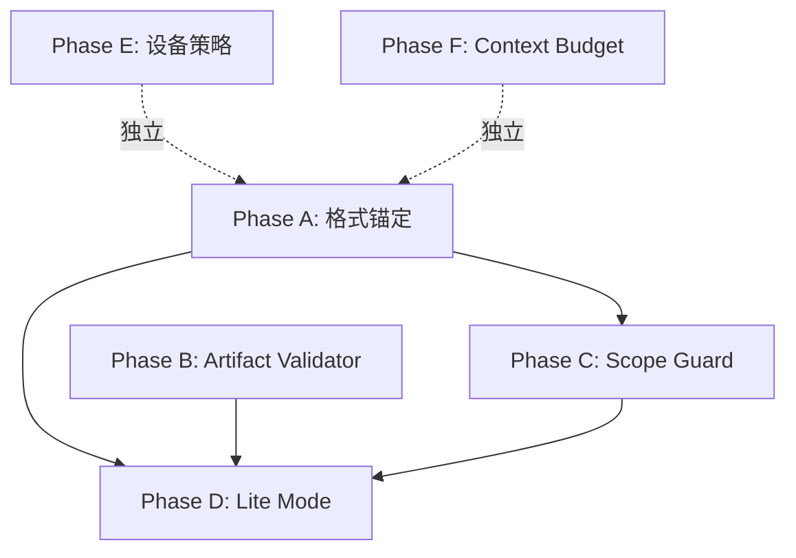

# UT 能力深度提升方案（修订版 v2）

## 修订说明

本版吸收外部 AI 审查的两轮修正（均经代码验证）：


| #   | 审查意见                                  | 代码验证结论                                                        | 修订动作                                 |
| --- | ------------------------------------- | ------------------------------------------------------------- | ------------------------------------ |
| 1   | Scope Guard 需双集合                      | `check-ut.ts:2848` 只有一个 `utFiles`，全部规则共用                      | Phase C 改为 partition 双集合架构           |
| 2   | Lite Mode 跳 DAG 会触发 BLOCKER           | `branch_coverage_full` 无 use-cases 时本来 N/A；收益在减确认点            | Phase D 重定义收益点                       |
| 3   | `ut_hvigor_test` 引用错层                 | UT 走 `hvigor-runner`→`hdc-runner`，不走 `device-test-install.ts` | Phase E 方案 A/B 二选一                   |
| 4   | `testability-audit.md` 支持 fenced YAML | `ut-artifact-parse.ts:72-96` 支持纯 YAML 或 fenced YAML           | Phase A 区分 .md/.yaml 契约              |
| 5   | `[BD-]` 开头不合法                         | `check-ut.ts:1592` 正则只认 `[AC-]` 或 `[BRANCH-]` 开头             | Phase C BD 命名契约修正                    |
| 6   | `HARNESS_DIFF_BASE_REF=working` 已有    | `check-ut.ts:688` + SKILL.md:555                              | Phase C 改为"以 UT baseline 判定"         |
| 7   | `--dry-run` 不宜塞 check-ut.ts 本体        | check-ut.ts 是 phase checker default export 非 CLI              | Phase B 改为独立 validate-ut-artifact.ts |
| 8   | 外部阻塞不应叫 PASS                          | 当前 ut_hvigor_test 是 BLOCKER，改 PASS 制造假闭环                      | Phase E 改用 INCOMPLETE verdict         |
| 9   | mock-plan-schema.md YAML 注释合法         | YAML `#` 注释 ≠ markdown `#` 标题                                 | Phase A 精确区分                         |


---

## 根因诊断（不变）

从 `D:\97.log\UT执行记录.txt` 的 hwp-channel 执行过程：

1. **格式漂移**：markdown 表格代替 fenced YAML → 解析失败；mock-plan 混入 markdown
2. **BD 命名违规**：`[BD-1-a]` — 既用了不存在的子 ID，又用了 `[BD-]` 开头（正则不允许）
3. **全模块误扫**：`loadUtFiles` 扫整个模块 ohosTest，非本 feature 既有测试被检查
4. **源码越权**：5 个 `src/main` 变更是 coding 阶段产物，未在 UT 阶段 gap-notes 归档
5. **设备版本硬阻塞**：`ut_hvigor_test` 因版本降级安装失败
6. **Context 过载**：11w 行模块远超模型能力，反复读文件烧 context

---

## 方案设计（6 个 Phase，修订后优先级）

### Phase A: 格式锚定（最高优先 — 直接减少格式循环）

**目标**：让弱模型"照着抄就对"，消除对 schema 的自由发挥。

**关键区分（审查修正）**：

- `testability-audit.md`（`.md` 文件）：可以是"Markdown + fenced yaml 块"或纯 YAML — **失败的是 markdown 表格**
- `mock-plan.yaml`（`.yaml` 文件）：**必须纯 YAML**，不允许 markdown 混排

**具体改动**：

1. **修改 `[testability-audit-template.md](profiles/hmos-app/skills/5-business-ut/templates/testability-audit-template.md)`**：
  - 顶部添加 `## OUTPUT CONTRACT` 区块
  - 添加完整 hwp-channel 级别的文件正例（从第 1 行到最后 1 行）
  - 添加"常见错误 vs 正确"对照：markdown 表格 = 错；fenced yaml 块 = 对
  - 明确说："文件扩展名是 .md，但内容只能是 fenced yaml 块或纯 YAML"
2. **修改 `[mock-plan-schema.md](profiles/hmos-app/skills/5-business-ut/templates/mock-plan-schema.md)`**：
  - 顶部标红："`mock-plan.yaml` 是纯 YAML 文件。禁止写 markdown 标题（`#` 标题 ≠ YAML 注释）、禁止写 ```yaml 围栏、禁止 markdown 格式"
  - YAML 注释（`# 这是注释`）仍然允许 — 修正现有示例中的 YAML 注释措辞以避免歧义（`# 说明` 是合法 YAML 注释，`# 标题` 后跟空行是 markdown 标题）
  - 添加完整最小文件正例（含合法 YAML 注释示范）
3. **新建 `[templates/format-contract.md](profiles/hmos-app/skills/5-business-ut/templates/format-contract.md)`**：
  - 弱模型专用"速查卡"，只列输出约束（200 字以内）
  - 按文件类型逐一说明允许/禁止格式

---

### Phase B: 机器化 Artifact Validator（与 A 同批，减少修复循环）

**目标**：在模型写文件前就验证格式，不等 harness 全量跑。

**具体改动**：

1. **新建 `harness/scripts/validate-ut-artifact.ts`**（审查修正 — 不塞进 check-ut.ts 本体）：
  - 独立 CLI 脚本，职责单一：验证单个 UT 产物文件格式
  - 用法：`npx ts-node harness/scripts/validate-ut-artifact.ts --type testability-audit --file <path>`
  - 或 `npx ts-node harness/scripts/validate-ut-artifact.ts --type mock-plan --file <path>`
  - 底层复用 `ut-artifact-parse.ts`（`parseTestabilityAuditFile` / `parseMockPlanFile`）
  - 输出 JSON `{ok: boolean, errors: [{field, message}], warnings: []}`
  - 也可通过 `harness-runner.ts --phase ut --validate-artifact <type> <path>` 调度
  - 容易写 unit test（独立模块）
2. **SKILL.md Step 1.5/1.6/Step 3 前增加"写前自检"段落**：
  ```markdown
   ### 写入前自检（必须逐条核对后再写文件）
   - [ ] testability-audit.md：内容是 fenced yaml 块（```yaml...```）或纯 YAML（不是 markdown 表格）
   - [ ] mock-plan.yaml：纯 YAML（无 markdown 标题/围栏/注释行以外的 # 标记）
   - [ ] acceptance_id 严格来自 acceptance.yaml 已有 ID（无子编号如 -a/-b）
   - [ ] it() 名称以 [AC-] 或 [BRANCH-] 开头；BD 用 [AC-x][BD-y] 组合而非 [BD-] 单独
   - [ ] ts_expr 包含 `as TypeName` 或 `new ClassName(`
  ```

---

### Phase C: Scope Guard（P0 — 双集合架构 + BD 契约修正）

**目标**：UT harness 对追溯/命名规则只检查本 feature 相关文件，编译/注册规则保留全量。

**核心问题**：`check-ut.ts:2848` 只有一个 `utFiles` 变量，后续所有规则共用。直接改 `loadUtFiles` 返回过滤结果会导致 `ut_tsc_compiles` / `test_registration` 等编译级规则漏检。

**设计：双集合（allUtFiles + scopedUtFiles）**：

1. `**ut-host-impl.ts`**：
  - `loadUtFiles(ctx)` 保持不变，返回全量
  - 新增 `partitionUtFiles(ctx, allUtFiles)` → `{ all, scoped }`
  - scoped 判定依据：git diff (working + staged) 对 `*.test.ets` 的增量 + `context-exploration.md` 中显式声明的文件列表
  - 无 scope 信息时 scoped = all（向后兼容）
2. `**check-ut.ts` 消费双集合**：
  - 使用 `all`（全量）的规则：`ut_tsc_compiles`、`ut_hvigor_build/test`、`test_registration`、`ut_framework_import`、`ut_file_naming`
  - 使用 `scoped`（仅本 feature）的规则：`it_name_has_ac_or_branch_tag`、`it_drives_flow`、`branch_coverage_full`、`ut_case_per_unit_ac`、`boundary_coverage`、`ut_import_whitelist`、`boundaries_all_stubbed`
  - summary 输出 `all_ut_files_count` 和 `scoped_ut_files_count` 便于排查
3. **BD 命名契约修正**：
  - `check-ut.ts:1592` 正则 `/^\s*\[(AC|BRANCH)-/` 只认 `[AC-]` 或 `[BRANCH-]` 开头
  - SKILL.md `it()` 命名规范段落修正：
    - 正确：`[AC-1][BD-1] getData 返回 undefined 时 fallback` — BD 作为组合标签
    - 正确：`[BRANCH-main_channel_missing][AC-1] ...`
    - 错误：`[BD-1] ...`（正则不认，会 BLOCKER FAIL）
    - 错误：`[BD-1-a] ...`（子编号不存在 + BD 开头不合法）
  - `boundary_coverage` check (line 2253) 的 suggestion 修正为推荐 `[AC-x][BD-y]` 组合
  - `ut-template.md` 命名示例同步更新
4. **源码变更：以 UT 阶段开始时 baseline 判定**：
  - 问题本质：coding 阶段已提交的变更在 UT 阶段 harness 以 trace.start_commit 为 base 时被判定为"UT 越权"
  - SKILL.md Step 8 判定树修正为：
    - harness 报 `stale_diff_base` 或 committed 变更 >> working 变更 → 以 UT 阶段开始时的 baseline 判定：`HARNESS_DIFF_BASE_REF=working` 只检查当前工作区增量
    - working 有业务源码变更 → 确认是 UT 阶段越权 → 走 HARD STOP
  - 明确原则："以 UT 阶段开始时的 baseline 判定"，不追溯 coding 阶段合法变更

---

### Phase D: UT Lite 保守落地（依赖 Phase C 完成）

**目标**：简单 feature 减少认知负载，但不跳过 harness 必要检查。

**触发条件**（不变）：

- AC/BD (unit/both) <= 7 条
- 全部 L0/L1
- 无 use-cases.yaml

**保守设计（审查修正 — 不跳 DAG）**：

1. **"Quick Plan" 合并产物**（`ut/quick-plan.yaml`）：
  - 包含：testability 结论 + mock 边界声明 + 用例列表
  - 作用：**辅助文档**，帮助模型规划，减少步骤间遗忘
  - 关系：harness 仍然要求 `testability-audit.md` + `mock-plan.yaml` 存在，quick-plan 只是生成指南
2. **最小 DAG（不跳过）**：
  - Lite 模式下允许单个 "flat DAG" 文件，只含 entry_point + assertion 节点
  - 跳过 Mermaid 展示确认步骤（不走 `ut.dag_confirm`）
  - harness `dag_schema_compliance` 仍然校验
3. **Lite 的真正收益在"减少确认点 + 模板化生成"，不在规则降级**：
  - `branch_coverage_full` 无 use-cases.yaml 时本来就 N/A
  - `dag_spy_preset_resolvable` 无 spy_preset 时本来就 PASS
  - 重点改进：提供 Lite 专用"一键生成模板"，模型只需填充 acceptance_id 和被测函数，其余结构固定
  - 确认点从 4 个（plan_confirm + mock_plan + dag_confirm + ok_to_testing）减为 2 个（plan_confirm + ok_to_testing）
4. **SKILL.md Lite Mode 判定树**：
  - 在 Step 1 之前插入判定逻辑
  - 满足条件 → 展示"Lite Mode：合并步骤，减少确认点"
  - 仍保留 `ut.plan_confirm` 一次确认

---

### Phase E: 设备门禁策略（独立 — 解决硬阻塞卡死）

**目标**：`ut_hvigor_test` 设备失败时不让模型无限循环，分类处理。

**关键架构问题（审查修正）**：

- `device-test-install.ts` 的版本预检 / bm dump / 自动卸载逻辑**只在 testing 阶段**使用
- UT 路径是 `ut-run.ts` → `hvigor-runner.runHvigorTest()` → `hdc-runner`，当前只做 `hdc install -r` + 日志诊断
- 两套 install 链路不共享

**二选一方案（需确认）**：

**方案 A（推荐）：抽取公共 install service**

- 将 `device-test-install.ts` 中的 `loadAppInstallCandidateMeta` / `runHdcShellBmDump` / `parseInstalledBundleVersionFromDump` / 版本降级预检逻辑抽到公共 `harness/device-install-service.ts`
- UT 和 testing 两个 provider 都通过 service 获取版本诊断
- UT 侧产出 `ut-install.meta.json`（与 testing 侧 `device-test-install.meta.json` 同结构）

**方案 B（最小改动）：UT 侧独立增加 preflight**

- 在 `hvigor-runner.ts` 的 `runHvigorTest` 前插入 `utInstallPreflight()`
- 只做：探测设备 + bm dump 版本比对 + 降级检测
- 不复用 `device-test-install.ts` 的完整逻辑，但输出等价的诊断字段

**失败分类（无论哪种方案都需要）**：


| 分类        | 判定条件                                                                    | 处理策略                      |
| --------- | ----------------------------------------------------------------------- | ------------------------- |
| **可自愈**   | `downgradeDetected` 且 `HARNESS_DEVICE_TEST_UNINSTALL_BEFORE_INSTALL` 未设 | 提示模型设置 env 重跑             |
| **需用户确认** | 降级检测 + 包签名冲突 + bundleName 冲突                                            | HARD STOP 列出诊断信息，让用户选择    |
| **外部阻塞**  | 无设备 / hdc 未安装 / 设备 OS 版本不兼容                                             | 标记 `device_blocked`，不循环重试 |


**关于"外部阻塞时 PASS"的修正（审查 P1）**：

- **不叫 PASS**，新增 verdict 状态 `INCOMPLETE`：
  - `compile_passed_device_blocked`：编译通过但设备不可用
  - summary verdict 为 `INCOMPLETE`（非 PASS），不触发阶段完成
  - 增加 `next_action: device_ready_then_rerun_ut`
- 这样既避免模型无限循环，又不制造"假 PASS"误标阶段完成

**INCOMPLETE 牵动的契约改动（审查补充 — 不补会跑炸）**：

- `harness/summary.schema.json` (line 33)：当前 verdict 枚举只有 `PASS | FAIL`，需新增 `INCOMPLETE`
- `harness/harness-runner.ts` (line 547)：verdict 类型声明需同步扩展
- `harness/tests/` 下 summary 相关 unit test：硬断言 verdict in {PASS, FAIL} 的用例需适配
- `harness/scripts/check-receipt.ts`：receipt 闭环校验需识别 INCOMPLETE（不允许 receipt PASS）
- `skills/5-business-ut/SKILL.md` Step 8.3：verdict=INCOMPLETE 不满足闭环条件

**决定：选方案 A — 公共 install service（渐进抽取）**：

第一波（本计划范围）：

- 从 `device-test-install.ts` 抽出纯函数到新建 `profiles/hmos-app/harness/device-install-diag.ts`：
  - `loadAppInstallCandidateMeta()` — 读 bundleName/versionCode
  - `runHdcShellBmDump()` + `parseInstalledBundleVersionFromDump()` — 设备版本探测
  - `diagnoseInstallBlocking()` → `{kind: selfHealable | needsConfirmation | externalBlocked, details}`
- UT 侧 (`hvigor-runner.ts` 的 `runHvigorTest` 前) 调用 `diagnoseInstallBlocking()`
- 产出 `ut-install-diag.json`（诊断结果 + blockingKind）
- `device-test-install.ts` 改为 import 公共函数（不重复实现）

第二波（后续迭代，不在本计划）：

- 完整 install 流程（卸载 + 重装 + reuse）也收入公共 service
- UT 和 testing 的 install 链路完全统一

**具体改动**：

1. **SKILL.md Step 7.6 增加"设备失败分类决策树"**
2. **新增 `profiles/hmos-app/harness/device-install-diag.ts`** — 公共诊断纯函数
3. **修改 `profiles/hmos-app/harness/hvigor-runner.ts`** — runHvigorTest 前调用诊断
4. **修改 `profiles/hmos-app/harness/providers/device-test-install.ts`** — import 公共函数
5. **修改 `harness/summary.schema.json`** — verdict 枚举加 INCOMPLETE
6. **修改 `harness/harness-runner.ts`** — verdict 类型扩展
7. **修改相关 `harness/tests/`** — 适配 INCOMPLETE verdict
8. **修改 `harness/scripts/check-receipt.ts`** — INCOMPLETE 不允许 receipt PASS

---

### Phase F: Context Budget 工具化（独立 — 大模块专项）

**目标**：不是文档里写"200 行以内"，而是给模型固定可执行的摘取协议。

**具体改动**：

1. **新建 [`templates/context-extraction-protocol.md`](profiles/hmos-app/skills/5-business-ut/templates/context-extraction-protocol.md)**：

````markdown
## UT 上下文摘取协议（BLOCKER — 禁止读完整源文件）

### 摘取清单（按顺序执行）

1. 被测函数签名（rg + 行范围）：

   ```bash
   rg "buildChannelPage|targetFunction" <module>/src/main/ -C 3 --max-count 5
   ```

2. 构造参数/依赖 import：

   ```bash
   rg "^import|constructor" <被测文件路径> --max-count 20
   ```

3. contracts.yaml 对应条目：

   ```bash
   # 只读 interfaces[] 部分
   读取 doc/features/<feature>/contracts.yaml
   ```

4. acceptance.yaml 的 unit/both 条目：

   ```bash
   # 读取并过滤 ut_layer
   读取 doc/features/<feature>/acceptance.yaml
   ```

### 绝对禁止

- 读取整个 Page 文件（通常 500+ 行，大部分是 UI 代码）
- 遍历模块目录树
- 读取非被测函数的实现细节

### 上下文总预算：≤ 300 行
````

2. **SKILL.md Step 1.0 修订**：
   - 把 `exploration_strategy` 从"读 N 个文件"改为"摘取 N 个签名集 + 依赖图"
   - 添加引用：`context-extraction-protocol.md` 为 Lite 和 Standard 模式共用

---

## 落地优先级




**建议顺序**：A + B（同批，1.5 天） → C（1 天） → D（1.5 天） → E（1 天） → F（0.5 天）

**预期效果**：

- Phase A+B 解决 hwp-channel 类场景中 60% 的格式循环问题
- Phase C 消除非本 feature 测试文件的误报
- Phase D 将简单 feature 的 UT 工作流步骤从 8 步降到 4 步
- Phase E 避免设备不可用时的无限卡死循环
- Phase F 让 11w 行模块的上下文不再溢出

---

## 关键改动文件清单


| Phase | 文件                                                                                | 改动类型                                |
| ----- | --------------------------------------------------------------------------------- | ----------------------------------- |
| A     | `profiles/hmos-app/skills/5-business-ut/templates/testability-audit-template.md`  | 修改：加完整正例                            |
| A     | `profiles/hmos-app/skills/5-business-ut/templates/mock-plan-schema.md`            | 修改：加完整正例 + YAML 注释 vs markdown 标题区分 |
| A     | `profiles/hmos-app/skills/5-business-ut/templates/format-contract.md`             | 新增                                  |
| B     | `harness/scripts/validate-ut-artifact.ts`                                         | 新增：独立 artifact 格式校验 CLI             |
| B     | `skills/5-business-ut/SKILL.md`                                                   | 修改：各步前加自检                           |
| C     | `profiles/hmos-app/harness/ut-host-impl.ts`                                       | 修改：新增 partitionUtFiles              |
| C     | `harness/scripts/check-ut.ts`                                                     | 修改：双集合消费                            |
| C     | `skills/5-business-ut/SKILL.md`                                                   | 修改：BD 命名 + 源码归档 baseline            |
| C     | `profiles/hmos-app/skills/5-business-ut/templates/ut-template.md`                 | 修改：命名示例                             |
| D     | `profiles/hmos-app/skills/5-business-ut/templates/quick-plan-template.yaml`       | 新增                                  |
| D     | `skills/5-business-ut/SKILL.md`                                                   | 修改：Lite 判定树 + 减确认点                  |
| E     | `skills/5-business-ut/SKILL.md`                                                   | 修改：设备失败决策树                          |
| E     | `profiles/hmos-app/harness/device-install-diag.ts`                                | 新增：公共诊断纯函数                          |
| E     | `profiles/hmos-app/harness/hvigor-runner.ts`                                      | 修改：runHvigorTest 前调诊断               |
| E     | `profiles/hmos-app/harness/providers/device-test-install.ts`                      | 修改：import 公共函数                      |
| E     | `harness/summary.schema.json`                                                     | 修改：verdict 枚举加 INCOMPLETE           |
| E     | `harness/harness-runner.ts`                                                       | 修改：verdict 类型扩展                     |
| E     | `harness/tests/` (相关 unit test)                                                   | 修改：适配 INCOMPLETE                    |
| E     | `harness/scripts/check-receipt.ts`                                                | 修改：INCOMPLETE 不允许 receipt PASS      |
| F     | `profiles/hmos-app/skills/5-business-ut/templates/context-extraction-protocol.md` | 新增                                  |
| F     | `skills/5-business-ut/SKILL.md`                                                   | 修改：Step 1.0                         |


