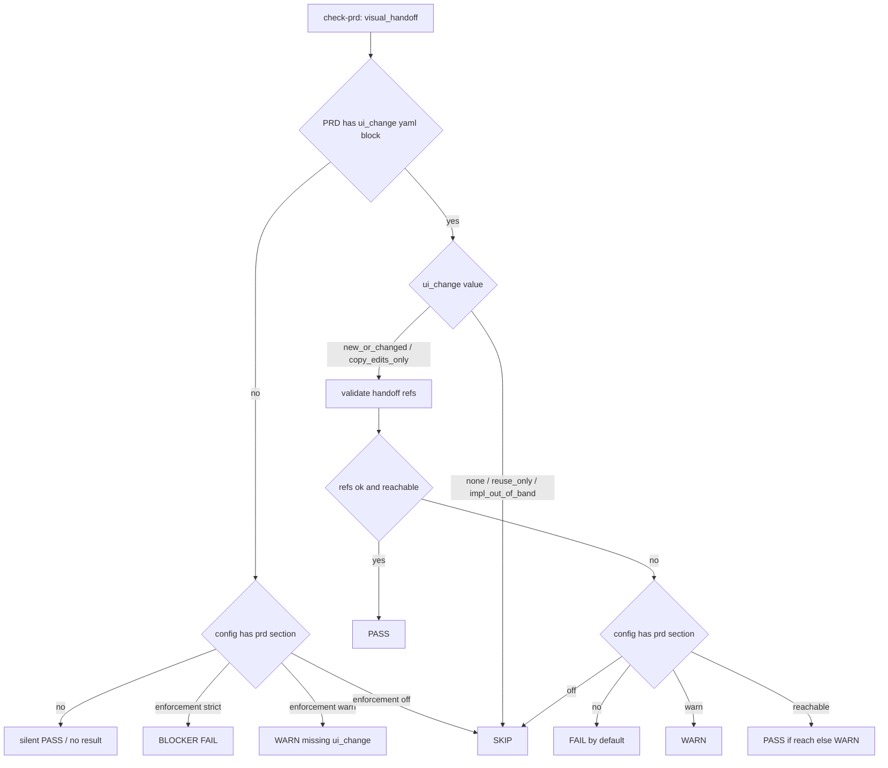
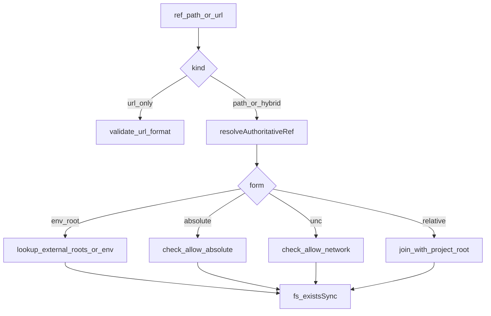

# UX 真源可达 + 工程外解耦

## 一、问题与定位

- 当前 `check-prd` 路径校验全部强制「**项目根内**必须 `existsSync`」（[`framework/harness/scripts/check-prd.ts`](framework/harness/scripts/check-prd.ts) 的 `resolveSafeProjectPath` + `validateRefsForKind`），且默认 `prd.visual_handoff_enforcement: warn` 还会对"PRD 没写 `ui_change` 块"提 WARN，这相当于把"本项目有 UI"当成默认假设。
- Framework 的目标定位是 **HarmonyOS app / Android / iOS / 云侧 Go·Java 微服务 / 库工程** 等多形态通用：**云侧/库工程根本没有 UX 诉求**，不应在每条 PRD 上都报"少了 ui_change"。
- 真实工程：UX 由专业团队交付（高保真 HTML+CSS+图片包、内网 NAS、独立 git、Figma、内部门户等），**不应**进入主代码 git；`doc/features/<feature>/` 也只是开发期资产，**不**保证入库。
- 模拟工程（本仓）出于演示把 `ux-reference/` 入了 git，**不应**反过来约束真实工程。

## 二、核心设计

### 2.0 PRD 驱动 + 项目级可选 override（关键决策）

framework 默认**不**预设 `prd` 段；check-prd 的 visual_handoff 是否生效，**完全由 PRD 自身是否声明 `ui_change` 决定**：

| PRD 内容 | 项目 config 是否含 `prd` 段 | check-prd 行为 |
|---------|-----------------------------|----------------|
| 无 `ui_change` yaml 块 | 无 | **静默 PASS**（不输出 visual_handoff 检查项；云侧/库工程零噪声） |
| 无 `ui_change` yaml 块 | `enforcement: strict` | **BLOCKER FAIL**（前端工程强制每条 PRD 显式 ui_change，opt-in） |
| 无 `ui_change` yaml 块 | `enforcement: warn` | WARN（迁移期柔和提醒） |
| 无 `ui_change` yaml 块 | `enforcement: off` | SKIP |
| `ui_change: none / reuse_only / impl_out_of_band` | 任意 | SKIP（PRD 显式声明无 UI 诉求） |
| `ui_change: new_or_changed / copy_edits_only` + 合法可达 handoff | 任意 | PASS |
| `ui_change: new_or_changed / copy_edits_only` + 不合法/不可达 handoff | 无 | **FAIL**（你已显式承诺 UX，违约即 FAIL；软化要 opt-in） |
| 同上不合法/不可达 | `enforcement: warn / reachable / off` | 按 override 决定 |

**核心原则**：
- 没声明 ui_change ≠ 没合规；只是"PRD 不在 UX 形态范畴里"，云侧/库工程**默认就该这样**。
- 前端工程要"强制全员 ui_change"是**显式 opt-in**：在 `framework.config.json` 追加 `prd.visual_handoff_enforcement: strict`。
- 已 opt-in handoff 的单条 PRD（声明了 new_or_changed），**必须**履行；这是 PRD 自己的承诺，不需要全局开关也能 FAIL。

### 2.1 三层分离（决定 Skill 00 该问什么、PRD 该写什么、运行时如何解析）

| 层 | 决策粒度 | 配置位置 | 谁问 / 谁写 |
|----|---------|---------|-------------|
| 项目策略（**仅 UI 形态工程 opt-in**：违例处置 / 是否允许绝对路径） | 项目级 | `framework.config.json` 的可选 `prd` 段 | **不在 init 问**；按需 JSON 编辑 |
| 工程语义（`paths.docs_committed`） | 项目级 | `framework.config.json` `paths` | 模板默认 `false`，不交互问 |
| 需求形态（动不动 UI、`kind` 是哪种、有几条 refs） | 每个 PRD | `PRD.md` 内 yaml 块 | **Skill 1**（已实现） |
| 运行时解析（`${UX_ROOT}` 解析到哪 / 本机有没有图） | 每个开发者 / CI | `process.env` + `external_roots`（在可选 prd 段里声明） | 不在 init 问；JSON 编辑 + 环境变量 |

明确不做：**per-feature override**（保留三层清爽分离）。

### 2.2 改动要点

1) **check-prd 重构为 PRD 驱动**：无 `ui_change` 块默认静默；前端工程通过追加可选 `prd` 段 opt-in 严格度。
2) 把已声明 handoff 的检查从「**path 在仓内 existsSync**」改成「**path 解析后可达即 PASS；不可达按 enforcement 升降级**」。
3) 引入**多源 path 形态**：仓内相对路径 / 环境变量根（`${UX_ROOT}/...`）/ 绝对路径 / UNC 网络盘 / 仅 URL；按你意见**不**为高保真包新建 kind。
4) 新增 enforcement 档位 **`reachable`**（opt-in 后推荐档位）；strict / warn / off 行为保留。
5) **从 framework.config.template.json 删除 `prd` 段**（仅在 `$schema_docs.field_notes` 留 opt-in 说明）；**`paths.docs_committed` 默认 `false`**。
6) 报告里增加 **Resolved Visual Sources** 段（仅在 PRD 声明了 visual handoff 时才输出）。
7) **Skill 00 改动**：Step 2 表格删除 `prd.visual_handoff_enforcement` 那一问（init 不再追问 UX 字段）；UPDATE 模式遇到老 config 已含 `prd` 段则保留并提示。
8) **prd-harness-options.md 重定位**为「opt-in 高级文档」，告诉用户什么样的工程值得加 `prd` 段。
9) **未来方向备忘**：framework 还含若干 HarmonyOS/前端默认（`module_inner_layers.presentation`、`cross_module_exports_file: index.ets`、`toolchain.devEcoStudio`、`project_type: app|atomic_service`），后续按 modality 渐进剥离；本轮**不**实现。

## 三、关键文件与改动

### A. Harness 解析与校验

- [`framework/harness/scripts/check-prd.ts`](framework/harness/scripts/check-prd.ts)
  - **重写 `checkVisualHandoff` 入口判定逻辑**（新表见 §2.0）：
    - 读 `parseVisualHandoffYamlRoot(prd)` 拿到 `ui_change` 与 `visual_handoff`。
    - 若整体缺失：根据**项目是否含 `prd` 段**决定 PASS（缺）/ WARN（warn）/ FAIL（strict）/ SKIP（off）；不再无条件 WARN。
    - 若 `ui_change ∈ {none / reuse_only / impl_out_of_band}`：SKIP。
    - 若 `ui_change ∈ {new_or_changed / copy_edits_only}`：进入 refs 校验。
  - 抽出 `resolveAuthoritativeRef(rec, ctx)`：依序识别  
    1. URL（已有）  
    2. `${VAR}` / `$ENV{VAR}` → 优先查 `framework.config.json` `prd.visual_sources.external_roots`，再退到 `process.env`  
    3. 绝对路径 / Windows 盘符 / UNC（仅当 `allow_absolute_paths` / `allow_network_paths` 开）  
    4. 相对路径 → 项目根（保持当前行为）
  - `validateRefsForKind` 改为：解析 → 形态合法 → 可达性结果 →（按 enforcement 决定 PASS / WARN / FAIL；**未配 prd 段时默认按 strict—声明即承诺**）。
  - 新增 enforcement 值 `reachable`：可达 PASS、不可达 WARN（注明"agent 本机不可见"）。
- 新增最小工具 `framework/harness/scripts/utils/visual-source-resolver.ts`（与 git-diff 工具风格一致），便于 verify 阶段复用。

### B. 配置 schema 调整（向后兼容）

- [`framework.config.template.json`](framework/templates/framework.config.template.json)（**先改源头**）：
  - **删除** `prd` 段：framework 默认不预设任何 UI 形态假设，云侧/库工程开箱即过。
  - `paths` 段加：
    ```json
    "paths": {
      "features_dir": "doc/features",
      "docs_committed": false
    }
    ```
  - `$schema_docs.field_notes` 中：
    - 删除 `prd` / `prd.visual_handoff_enforcement` 旧条目；新增一段 **opt-in 说明**：
      > "`prd`（opt-in，默认不写入）：仅当本工程含 UI 形态需求且想强制全员遵守 Visual Handoff 时按需追加。字段语义见 `framework/skills/00-framework-init/prompts/prd-harness-options.md` 与 `framework/skills/1-prd-design/reference/visual-handoff.md`。"
    - 增加 `paths.docs_committed`：
      > "`paths.docs_committed`（默认 `false`）：是否把 `doc/features/` 业务过程产物提交到主仓。**真实工程默认 `false`**——这些是开发期参考，最终交付仅代码 + 测试。仅当工程显式想归档（如本仓 sim-wallet 演示）时改为 `true`。"
- 本仓 sim-wallet 实例（不入框架默认）：显式追加 `prd: { visual_handoff_enforcement: "strict", visual_sources: { ... } }`、`paths.docs_committed: true`，作为"严格 + 仓内真源 + 演示归档"对照样例。

### C. Skill 00（framework-init）改动

- [`framework/skills/00-framework-init/SKILL.md`](framework/skills/00-framework-init/SKILL.md):
  - Step 2 表格**删除** `prd.visual_handoff_enforcement` 那一行；init **不再追问** UX 相关字段，避免对云侧/库工程造成"答非所问"。
  - 在 Step 2 备注一句："`prd` 段是 opt-in；如本工程是 UI 形态且要强制全员 Visual Handoff，请在 init 完成后按 [prompts/prd-harness-options.md](prompts/prd-harness-options.md) 手工追加。"
  - **UPDATE 模式特例**：若老 `framework.config.json` 已含 `prd` 段 → **保留**用户值，并在汇报里提示"已检测到 `prd` 段保留；档位枚举见 prd-harness-options.md（含新 `reachable`）"。
- [`framework/skills/00-framework-init/prompts/prd-harness-options.md`](framework/skills/00-framework-init/prompts/prd-harness-options.md) **重写为 opt-in 高级文档**：
  - 开篇明确"本文档面向 UI 形态工程，云侧/库工程可整段忽略"。
  - 档位补全：`strict` / `warn` / `reachable`（**新增，推荐**） / `off`，每档行为表格化。
  - 把"什么样的工程值得 opt-in `prd` 段"做成 checklist。
- [`framework/templates/AGENTS.md.template`](framework/templates/AGENTS.md.template)（CLAUDE.md / AGENTS.md 的源头）：
  - 在「全局约束」相关段补一句"**`doc/features/` 默认不入主仓**（除非 `paths.docs_committed: true`）；harness 与 receipt 都按工作区状态判断，不强求 commit"。
  - **删除**任何"PRD 必须含 ui_change yaml 块"的硬性表述（若有），替换为"含 UI 形态的 PRD 应声明 `ui_change`；其它形态不强制"。

### D. Skill 1 / harness 提示与文档

- [`framework/skills/1-prd-design/reference/visual-handoff.md`](framework/skills/1-prd-design/reference/visual-handoff.md)：新增「path 形态总览」「`reachable` / `strict` / `warn` / `off` 选型表」「真实工程范式（独立 git / NAS / Figma + 本地 mirror）」。
- [`framework/skills/1-prd-design/templates/prd-template.md`](framework/skills/1-prd-design/templates/prd-template.md)：示例增加一段 `${UX_ROOT}/...` 写法。
- [`framework/skills/1-prd-design/SKILL.md`](framework/skills/1-prd-design/SKILL.md)：在 Visual Handoff 段补一句"`doc/features/` 是否入库由实例决定，harness 不再隐含强制"。
- [`framework/specs/phase-rules/prd-rules.yaml`](framework/specs/phase-rules/prd-rules.yaml)：`visual_handoff` 规则描述更新（含 `reachable` 行为）。
- [`framework/harness/prompts/verify-prd.md`](framework/harness/prompts/verify-prd.md) check 9：把"是否聊天缩略图路径"判断扩展到"真源是否在 agent 本机可达 / 是否给了内网门户的版本号"。

### E. doc/features 不入库模式（轻处理）

- 默认改为 `false` 后，影响面集中在「报告引用路径"工程根相对"」与「receipt 的 `q3_last_diff_file` 自检题」上。仅做最小适配：
  - check-prd 报告里的 `affected_files` 仍写工程根相对路径；不做 git ls-files 强制。
  - [`framework/harness/scripts/check-receipt.ts`](framework/harness/scripts/check-receipt.ts) 在 `paths.docs_committed: false` 时，对"自检 Q3 = doc/features/* 文件"不报警；当前 Q3 仅校验"自填一行"无强校验，主要是文档与提示语的同步。
  - [`framework/harness/scripts/check-coding.ts`](framework/harness/scripts/check-coding.ts) / `check-ut.ts` 的 `diff_within_scope` 已经只看代码 scope，不动；只在 `paths.docs_committed: false` 时把"未提交 doc/features/* 也视为正常"明确写入说明。

### F. 试点（本仓 sim-wallet）

- [`doc/features/home-page/PRD.md`](doc/features/home-page/PRD.md)：在 Visual Handoff 之外新增一个**注释式示例 yaml**（不参与脚本解析，仅作团队范式参考），展示 `${UX_ROOT}/home-page/v3/` 的写法。
- [`doc/features/home-page/ux-reference/README.md`](doc/features/home-page/ux-reference/README.md)：明确"本目录入库是 sim-wallet 演示用；真实工程通常用 `${UX_ROOT}` 等外部根，且 `doc/features/` 默认不入主仓"。
- 本仓 `framework.config.json` 仍保留 `strict` + `paths.docs_committed: true`，作为"严格 + 仓内 path + 演示归档"对照。

### G. Harness 测试 fixture

- 在 [`framework/harness/tests/`](framework/harness/tests) 新增最小用例：
  - `visual_handoff_reachable_external_root` 通过 `${UX_ROOT}` 解析后 existsSync。
  - `visual_handoff_unreachable_external_root` 解析失败 / 文件不存在 → enforcement=reachable 时 WARN，strict 时 FAIL。
  - 绝对路径开关 ON/OFF 的两个对照。

## 四、验收口径

- **云侧 / 库工程**（无 UI）：init 后 `framework.config.json` 不含 `prd` 段；任何 PRD 不写 `ui_change` 块时 check-prd 不产生 visual_handoff 检查项（也不 WARN），整张报告"清爽"。
- **UI 形态工程**（opt-in 后）：在 `framework.config.json` 追加 `prd.visual_handoff_enforcement: reachable`，PRD 没声明 `ui_change` → WARN；声明 `new_or_changed` 但 handoff 不可达 → WARN；声明且可达 → PASS。
- **opt-in 后 strict**：缺 `ui_change` 块 → BLOCKER FAIL；声明 `new_or_changed` 不合法/不可达 → FAIL。
- **真实工程 `paths.docs_committed: false`**：receipt + diff 检查不再因 `doc/features/**` 未入库而告警。
- Skill 00 init 的交互问题**减少 1 个**（删了 enforcement 那一问）；其它字段走 skeleton 默认。
- UPDATE 升级：老 config 含 `prd` 段 → 保留；不含 → 不追加（除非用户手工选择 opt-in）。
- 本仓 sim-wallet：显式追加 `prd: { ... strict ... }` + `paths.docs_committed: true`，所有现有 PRD/harness 路径**仍 PASS**。

## 五、风险与回滚

- **行为变更：删除模板默认 `prd` 段** → 旧的"每条 PRD 都被 WARN 提醒补 ui_change"行为消失。  
  - 风险：UI 工程团队可能"忘了 opt-in"导致 visual_handoff 静默不跑。  
  - 缓释：`prd-harness-options.md` 重写后顶部明示 opt-in 决策；UPDATE 模式遇老工程**保留** `prd` 段（不会被静默清除）；`framework/docs` 的升级备忘里专门一段提示。
- **`ui_change=new_or_changed` 默认 FAIL（无 prd 段时）**：这是设计意图——你显式承诺 UX，就该履行。如要软化，opt-in `prd.visual_handoff_enforcement: warn` 即可。
- 改路径解析有"误把相对路径当 ENV 变量"风险：用严格语法 `${...}` 仅在以 `${` 开头时启用，其他原样。
- 新增 `reachable` 档位仅作"加项"，旧值 `strict / warn / off` 行为不变。
- `paths.docs_committed` 从隐含 `true` 改为显式 `false`：harness 实际行为**几乎无影响**（绝大多数检查走工作区，不要求 commit）；主要变化在文档与提示语。

## 六、Mermaid

### 6.1 PRD 驱动的入口判定



### 6.2 已声明 handoff 时的 path 解析


