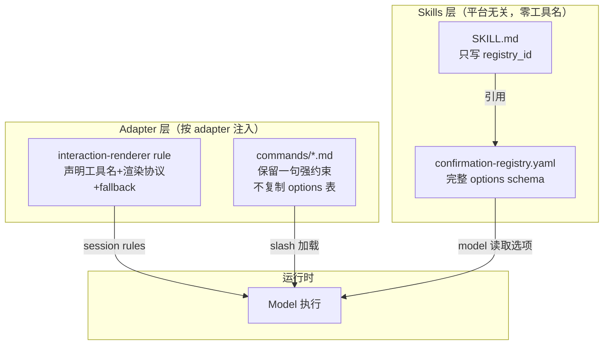

# 交互层架构大重构（v2 — 采纳外部审查）

> 本方案基于 v1 draft + 外部 AI 审查的 4 条风险修正。建议走 OpenSpec SDD 流程（`/opsx-propose`）。

## 0. 现状诊断

### 问题一：平台特判遍地开花

当前 skills 正文直接出现具体工具名：

```
80:- **BLOCKER — Widget**：……Claude Code：`AskUserQuestion`；Cursor：`AskQuestion`
```
([skills/00-framework-init/SKILL.md](skills/00-framework-init/SKILL.md) 第 80 行)

泄漏点分布（完整清单）：

- **共享层（应为零）**：
  - `skills/00-framework-init/SKILL.md` — 4 处
  - `skills/00-framework-init/templates/intra-layer-deps-confirm.template.md` — 1 处
  - `skills/00-framework-init/templates/adapter-widget-options.md` — 2 处
  - `skills/1-prd-design/SKILL.md` — 2 处
  - `skills/3-coding/SKILL.md` — 2 处
  - `skills/reference/user-confirmation-ux.md` — 1 处（§5 "Cursor 须 AskQuestion"）
  - `agents/shared/agent-bundle/templates/rules/framework.mdc` — 1 处（第 29 行 "Cursor 须 AskQuestion"）
- **adapter 专属层（允许出现）**：
  - `agents/claude/templates/commands/*.md` — 9 份
  - `agents/claude/templates/rules/confirmation-ux.md` — 3 处
  - `agents/claude/templates/rules/widget-options/*.md` — 9 份

### 问题二：知识散落 + 弱模型指令追踪困难

一个模型要正确执行一次确认交互，需"集齐"至少 4 份文件：


MiniMax 2.7 等弱模型经常只读了 Skill 正文，没跟进到 widget-options 文件，退化为文本提示。

### 问题三：覆盖面不完整

`confirmation-registry.yaml` 登记了 33 个确认点（含 `init.*` 7 个 + `catalog.*` 3 个 + `prd.*` 3 个 + `design.*` 4 个 + `coding.*` 4 个 + `phase.next_step` 1 个 + `review.*` 3 个 + `ut.*` 5 个 + `testing.*` 3 个），但实际工作流中还有大量**未登记的 ad-hoc 交互**（探索阶段确认、上下文确认、中间产物审阅等），完全未被 widget 机制覆盖。

### 问题四：registry schema 过弱

当前 registry 的 `options` 只是文本 `portable_menu`；实际 widget-options 文件包含更多语义：
- `phase-next-step-options.md` — 动态 label `{next_skill_label}` + phase 速查表
- `skill1-prd-options.md` — artifact 写回 side_effect（"对话 widget 后须写回 PRD [x]"）
- `skill2-design-options.md` — freeform preamble（"须先展示完整 Scope 扩展提议正文"）

简单 `value/label` 无法承载这些语义。

---

## 1. 目标架构

借鉴 Superpowers 核心设计：**skills 是纯协议 Markdown，平台无关；平台适配由 adapter 在投递层处理**。



**核心原则**：

- **共享层零平台工具名**：`skills/`、`profiles/`、`agents/shared/`、`templates/AGENTS.md.template` 中禁止出现 `AskUserQuestion`、`AskQuestion` 等具体工具名；只允许出现在 `agents/claude/**`、`agents/cursor/**` 等 adapter 专属层
- **Adapter 单文件注入交互协议**：每个 adapter 一份 `interaction-renderer.md`（或 `.mdc`），session 加载时告诉模型"所有确认点 + 所有 ad-hoc 交互 → 调 X 工具"
- **Commands 保留强约束不减弱**（审查风险 #1 修正）：Claude commands 不简化成 2 行链接，而是保留一句 adapter 层强约束（如"任何用户选择必须先调用 AskUserQuestion"），但不再复制 options 表和 widget-options 文件引用
- **Registry 成为完整选项 SSOT**（审查风险 #2 修正）：options 数组支持 `label`、`portable`、`description`、`side_effect`、`dynamic_label` 字段
- **默认全覆盖 fallback**：即使未在 registry 登记的 ad-hoc 交互，adapter interaction-renderer 也要求用键盘选择

---

## 2. Registry schema 增强设计

### 2.1 新 options schema

```yaml
- id: phase.next_step
  skill: "_cross_phase"
  class: enum
  ssot_anchor: "user-confirmation-ux.md §8.3"
  skill_step: "任一 feature phase 四件套 PASS 后"
  portable_menu: "1=进入下一Skill 2=暂停 3=其它"
  options:
    - value: enter_next
      label: "进入下一 Skill — {next_skill_label}"
      portable: "1=进入下一 Skill"
      dynamic_label:
        placeholder: "{next_skill_label}"
        lookup: |
          prd → Skill 2 技术设计
          design → Skill 3 编码
          coding → Skill 4 Code Review
          review → Skill 5 业务级 UT
          ut → Skill 6 真机测试
          testing → 结束交付 / 归档
    - value: pause
      label: "暂停 — 本阶段到此，暂不进入下游"
      portable: "2=暂停"
    - value: other
      label: "其它 — 我在对话中说明意图"
      portable: "3=其它（说明）"

- id: design.scope_expansion
  skill: "2-requirement-design"
  class: freeform_approval
  ssot_anchor: "user-confirmation-ux.md §3.5"
  skill_step: "Step 2.5"
  requires_preamble: "须先展示完整 Scope 扩展提议正文"
  options:
    - value: approve
      label: "已读并同意扩展 — 记录用户原话到 expansions_with_user_approval"
      portable: "1=已读并同意"
      side_effect: "记录用户原话到 gap-notes expansions_with_user_approval"
    - value: reject
      label: "拒绝扩展 — 在原 in_scope 内重新设计"
      portable: "2=拒绝"
    - value: revise
      label: "修改提议后再议"
      portable: "3=修改提议"

- id: prd.terminology
  skill: "1-prd-design"
  class: artifact_checkbox
  ssot_anchor: "user-confirmation-ux.md §3.4"
  skill_step: "Step 1.5"
  artifact: "PRD.md ## 0. 术语映射表 [x]"
  harness: check-prd terminology_mapping_table
  options:
    - value: all_confirm
      label: "全部确认 — 所有行写回 PRD [x]，进入后续 PRD 步骤"
      portable: "1=全部确认 high 行"
      side_effect: "写回 PRD 术语映射表 [x] 列"
    - value: row_by_row
      label: "逐行确认 — 逐条确认，有问题可修改"
      portable: "2=逐行确认"
    - value: row_edit
      label: "逐行修改映射 — 我要修改部分术语映射"
      portable: "3=逐行修改"
```

### 2.2 新增字段说明

- `options[].label` — widget 选项标签（SSOT，逐字引用）
- `options[].portable` — portable 编号菜单文案
- `options[].description` — 可选长描述（复杂选项补充说明）
- `options[].side_effect` — 可选，选该项后的副作用声明（如写回 artifact、记录原话）
- `options[].dynamic_label.placeholder` — 可选，label 中需运行时替换的占位符
- `options[].dynamic_label.lookup` — 可选，占位符的枚举值速查表
- `requires_preamble` — entry 级别，freeform_approval 等须先展示正文的前置说明
- `反模式` 等叙述性内容不进 registry，留在 `user-confirmation-ux.md` 语义参考

---

## 3. 分步实施

### Phase 0：OpenSpec change proposal

通过 `/opsx-propose` 创建 change，将本方案转为 SDD 标准流程。当前 `npm run openspec -- list --json` 确认无 active change。

### Phase 1：增强 registry schema + 合并 widget-options 数据

**目标**：`confirmation-registry.yaml` 成为选项文案完整 SSOT。

- [skills/reference/confirmation-registry.yaml](skills/reference/confirmation-registry.yaml) — 新增 `schema_version: "2.0"`，所有 33 个 registry entry 完成交互 schema 补齐：其中 `enum|gate|freeform_approval|artifact_checkbox` 类增加 `options` 数组，`matrix` 类增加 `matrix_options` 或 parent 引用
- 数据来源优先级：`widget-options/*.md`（最完整，含 label/portable/side_effect/dynamic_label）→ `adapter-widget-options.md`（init.adapter 等）→ registry 现有 `portable_menu`（init/toolchain/profile 类仅有 portable 的条目）→ `user-confirmation-ux.md` 模板（兜底派生）。每条 entry 按此优先级合并，确保 33 条无遗漏
- 特殊处理：`dynamic_label`（phase.next_step）、`requires_preamble`（freeform_approval 类）、`side_effect`（artifact_checkbox 类）
- **删除（非 deprecated）旧字段**：`widget_options_ref` 和 `widget_hint` 直接迁出/删除。理由：`confirmation-registry.yaml` 在 `skills/reference/` 下属于共享层，若保留 `widget_hint: AskUserQuestion | AskQuestion` 则违反"共享层零工具名"的验收标准。旧字段的语义已被 `options` 数组和 adapter 专属 `interaction-renderer` 完全替代

### Phase 2：创建 adapter interaction-renderer（3 份独立，不共用）

**审查修正**：Cursor 需要声明 `AskQuestion`，generic 无 widget，若共用 `agents/shared/` 下的同一文件会违反"共享层零工具名"原则或让 Cursor 缺乏强约束。因此改为 3 份独立文件：

**新增文件**：

- `agents/claude/templates/rules/interaction-renderer.md` — Claude Code 渲染器（约 80 行），声明 `AskUserQuestion`
- `agents/cursor/templates/rules/interaction-renderer.mdc` — Cursor 渲染器，声明 `AskQuestion`（放在 adapter 专属层，符合禁区边界）
- `agents/generic/templates/rules/interaction-renderer.md` — generic 渲染器，仅 portable 编号菜单（无 widget 工具名）

**下发闭环**（审查风险修正）：

Cursor 和 generic 的 `rules.template_dir` 当前指向 `../shared/agent-bundle/templates/rules`（共享目录），新增的 adapter 专属 renderer 放在各自 `templates/rules/` 下不会被原有机制拷贝。

解决方案：利用 `adapter-schema.yaml` 新增的 `user_confirmation.interaction_renderer_rule` 字段（相对于 adapter 目录的路径），由 `check-init` / Skill 00 在正常 `template_dir` 拷贝之外，**单独收集**该文件并拷贝到 `rules.target_dir`。这是增量机制，不改变现有 `template_dir` 拷贝流程。

```yaml
# cursor adapter.yaml 变更后
rules:
  target_dir: .cursor/rules
  template_dir: ../shared/agent-bundle/templates/rules  # 不变，共享 rules 仍从此拷贝
user_confirmation:
  structured_widget: supported
  # widget_tool_hint: 已在 Phase 6 删除（见下方 Phase 6 说明）
  portable_required: true
  interaction_renderer_rule: templates/rules/interaction-renderer.mdc  # 新增：相对 adapter 目录
```

`check-init` 处理顺序：
1. 先从 `rules.template_dir` 拷贝共享规则（`framework.mdc` 等）
2. 再从 `user_confirmation.interaction_renderer_rule` 拷贝 adapter 专属渲染器
3. **去重**：拷贝 `interaction_renderer_rule` 时按 `targetRel`（目标相对路径）去重——若该文件已被 `rules.template_dir` 扫描拷贝过（如 Claude 的 `rules.template_dir` 就是 `templates/rules`，renderer 已在其中），则跳过，不重复拷贝。即：只有 Cursor/generic 等 `template_dir` 指向 shared 的 adapter 才需要额外收集
4. 后者同样遵循 `rules.update_policy`

**Claude interaction-renderer.md 核心结构**：

```markdown
# 用户交互渲染器（Claude Code · BLOCKER）

## 全局规则
任何需要用户做选择的场合——无论是 registry 已登记的确认点还是 ad-hoc 临时交互——
**必须先调 `AskUserQuestion`**，禁止仅展示 Markdown 表或文本编号。

## 已登记确认点
- 读取 `framework/skills/reference/confirmation-registry.yaml`
- 用 entry 的 `options[].label` 逐字构造 AskUserQuestion 选项
- 动态 label 按 `dynamic_label.lookup` 替换
- `requires_preamble` 非空时须先展示正文再调 widget
- 选项含 `side_effect` 时须在选择后执行声明的副作用

## 未登记 ad-hoc 交互（fallback）
- 临时构造 AskUserQuestion，选项至少包含 2 个有意义的选择
- 同轮仍附 portable 编号

## 同轮 portable 编号（向后兼容）
调 AskUserQuestion 的同轮消息末尾仍须附 `1=/2=/3=…` 编号菜单

## 决策复述
写入或进入下一步前须结构化复述决策

## 反模式（BLOCKER）
- widget 可用却仅给 Markdown 表 + 文本编号
- option label 自造路径
- freeform 提议未展示正文只要用户回 1
- 阶段四件套 PASS 后自动开下一阶段
```

### Phase 3：清理共享层平台特判

**禁区边界**（审查风险 #3 修正）：

```
禁止出现工具名的目录/文件：
  skills/**
  profiles/**
  agents/shared/**
  templates/AGENTS.md.template

允许出现工具名的目录（adapter 专属层）：
  agents/claude/**
  agents/cursor/**
```

**具体变更**：

- `skills/00-framework-init/SKILL.md` — 4 处 → `呈现确认菜单（registry \`init.xxx\`）`
- `skills/00-framework-init/templates/intra-layer-deps-confirm.template.md` — 1 处
- `skills/00-framework-init/templates/adapter-widget-options.md` — 2 处
- `skills/1-prd-design/SKILL.md` — 2 处
- `skills/3-coding/SKILL.md` — 2 处
- `skills/reference/user-confirmation-ux.md` — §5 "Adapter 能力" 段去具体工具名
- **`agents/shared/agent-bundle/templates/rules/framework.mdc`** — 第 29 行去 "Cursor 须 AskQuestion"，改为平台无关表述

### Phase 4：Claude commands 保留强约束（审查风险 #1 修正）

**关键决策**：不将 commands 削弱为 2 行链接，保留 adapter 层"最强约束"：

变更前（每份）：
```
> **BLOCKER — 本 Skill registry 确认点（Claude Code）**：
> 凡 `ut.plan_confirm` / `ut.mock_plan` / `ut.src_mutation` / `ut.dag_confirm`，须**先**调 **AskUserQuestion**，
> options 逐字引用 [../rules/widget-options/skill5-ut-options.md]；
> **同轮仍附** portable 编号；`ut.src_mutation` 须先展示变更描述再 widget。
> 会话级 SSOT：[../rules/confirmation-ux.md]。
```

变更后：
```
> **BLOCKER — 用户交互**：任何用户选择必须先调 **AskUserQuestion**（选项文案从
> `framework/skills/reference/confirmation-registry.yaml` 的 `options` 逐字引用）。
> 完整协议：[interaction-renderer](../rules/interaction-renderer.md)。
```

**要点**：保留了 `AskUserQuestion` 这一强约束在 adapter 专属层（commands 属于 `agents/claude/`），但不再复制 options 表和 widget-options 文件引用。弱模型在 slash 加载 command 时就能直接看到工具名。

### Phase 5：合并 confirmation-ux.md 到 interaction-renderer

- `agents/claude/templates/rules/confirmation-ux.md` 内容已被 `interaction-renderer.md` 完全覆盖
- 删除 `confirmation-ux.md`
- 删除 `agents/claude/templates/rules/widget-options/` 目录（9 文件 + index.md）
- 更新 `agents/claude/adapter.yaml` 的 `rules` 段

### Phase 5b：旧实例产物清理机制（deprecated adapter artifacts cleanup）

**问题**：源模板删除 `widget-options/` 和 `confirmation-ux.md` 后，已有消费者工程实例里的 `.claude/rules/widget-options/` 和 `.claude/rules/confirmation-ux.md` **不会自动消失**——Skill 00 策略矩阵明确说"用户自建、在源模板中不存在的额外文件一律保留"（第 161 行）。旧文件会继续污染 ClaudeCode 会话上下文。

**解决方案**：在 `adapter-schema.yaml` 新增 `deprecated_artifacts` 字段，`check-init` 消费它做自动清理：

```yaml
# adapter-schema.yaml 新增
deprecated_artifacts:
  type: list
  default: []
  description: |
    已废弃的 adapter 产物路径（相对于 adapter 的 target 根，如 .claude/）。
    check-init UPDATE 模式下发现这些路径存在时，action: backup_delete
    自动备份到 .framework-backup/<timestamp>/ 后删除，结果写入 check-init.json。
  items:
    path: string       # 相对路径，如 "rules/confirmation-ux.md" 或 "rules/widget-options/"（末尾 / 表目录）
    action: string     # "backup_delete"
    reason: string     # 废弃原因，写入 check-init.json 供诊断
```

```yaml
# claude adapter.yaml 新增
deprecated_artifacts:
  - path: rules/confirmation-ux.md
    action: backup_delete
    reason: "v4.0 起合并到 interaction-renderer.md"
  - path: rules/widget-options/
    action: backup_delete
    reason: "v4.0 起选项文案合入 confirmation-registry.yaml"
```

`check-init` 行为：
- **UPDATE 模式**：扫描 `<adapter_target_root>/<path>`，存在则自动备份到 `.framework-backup/<timestamp>/` 后删除
- **CREATE 模式**：无旧产物，跳过
- 结果写入 `check-init.json` → `deprecated_artifacts_cleaned: [{path, action, backup_path}]`
- **smoke test 断言对齐**：smoke 脚本检查的 `.claude/rules/widget-options/` 不存在，与 check-init UPDATE 自动删除一致，不再矛盾

### Phase 6：更新 adapter-schema.yaml + adapter.yaml

- `adapter-schema.yaml` 的 `user_confirmation` 段：
  - 新增 `interaction_renderer_rule`（必填，相对 adapter 目录的路径）
  - **删除** `widget_tool_hint` 字段定义（工具名只留在各 adapter 专属的 `interaction-renderer` 和 `commands` 中，不出现在 schema/adapter.yaml 配置层）
  - 新增 `deprecated_artifacts` 列表字段
- 各 `adapter.yaml` 更新：
  - 3 份都新增 `interaction_renderer_rule`
  - 3 份都删除 `widget_tool_hint` 行
  - Claude adapter.yaml 新增 `deprecated_artifacts`（初始含 `confirmation-ux.md` 和 `widget-options/`）
  - 删除各 entry 的 `widget_options_ref` 引用（已在 Phase 1 从 registry 删除）

### Phase 6b：文档引用更新

删除 `confirmation-ux.md` / `widget-options/` 后，以下文档中的旧引用需要更新：

- [agents/README.md](agents/README.md) — 第 91 行引用了 `.claude/rules/confirmation-ux.md` 和 `widget-options/`
- [docs/overview.md](docs/overview.md) — 第 178、248、255、642 行引用了 `confirmation-ux.md`、`widget-options/`、`AskUserQuestion BLOCKER`
- [docs/evolution/extension-e2e-acceptance.md](docs/evolution/extension-e2e-acceptance.md) — 第 45 行引用了 `confirmation-ux.md`
- [docs/concepts/extensibility.md](docs/concepts/extensibility.md) — 第 109 行引用了 `AskUserQuestion` + `user-confirmation-ux.md`

更新方式：将旧路径替换为 `interaction-renderer.md` + `confirmation-registry.yaml`，措辞改为平台无关（如"adapter 交互渲染器"代替"Claude AskUserQuestion BLOCKER"）

### Phase 7：harness lint 扩展（审查风险 #3 修正）

`harness/scripts/check-skills-confirmation-ux.ts` 变更：

- **共享层禁工具名断言**：扫描 `skills/`、`profiles/`、`agents/shared/`、`templates/` 下所有 text-like 文件（`.md`、`.mdc`、`.md.template`、`.template.md`、`.yaml`、`.yml`），出现 `AskUserQuestion` 或 `AskQuestion` 即 BLOCKER。覆盖范围含 `framework.mdc`、`AGENTS.md.template` 等非 `.md` 后缀文件
- **registry options 完整性**：`enum|gate|freeform_approval|artifact_checkbox` 类 entry 必须有 `options` 数组且每项有 `value`+`label`+`portable`；`matrix` 类可有 `matrix_options` 或引用 parent/fallback 模板
- **interaction-renderer 存在性**：所有声明了 `user_confirmation` 段的 adapter，都必须声明且下发 `interaction_renderer_rule`（不仅限于 `structured_widget: supported`；generic 的 portable-only renderer 同样需要，确保 ad-hoc fallback 统一）
- 删除 `CLAUDE_WIDGET_OPTION_FILES` 常量及旧检查

### Phase 8：消费者工程 smoke test（审查风险 #4 修正）

harness lint 只能证明文档结构干净，不能证明模型实际调用了工具。增加：

- **产物 smoke 脚本**（`harness/scripts/smoke-interaction-renderer.ts`）：
  - `framework-init --adapter claude` 后检查 `.claude/rules/interaction-renderer.md` 存在
  - 检查各 slash command 包含 `AskUserQuestion` 强约束行
  - 检查 `.claude/rules/widget-options/` 不存在（旧产物已清理）
- **真实模型验收清单**（写入 `docs/operations/release-checklist.md`）：
  - ClaudeCode + MiniMax 2.7 环境下实测至少 6 类交互：
    1. `init` — adapter 选型 enum
    2. `PRD` — 术语映射 artifact_checkbox
    3. `coding` — module_batch enum
    4. `UT` — DAG 确认 enum
    5. `phase.next_step` — 动态 label 跨阶段
    6. `ad-hoc` — 未登记的临时交互 fallback
  - 每类交互确认渲染为键盘选择而非文本输入

---

## 4. 变更文件清单

- 改 `skills/reference/confirmation-registry.yaml` — schema 2.0 + 合入 options
- 改 `skills/reference/user-confirmation-ux.md` — 去工具名，改为引用 interaction-renderer
- 改 `skills/00-framework-init/SKILL.md` — 去 4 处工具名
- 改 `skills/00-framework-init/templates/intra-layer-deps-confirm.template.md` — 去 1 处
- 改 `skills/00-framework-init/templates/adapter-widget-options.md` — 去 2 处
- 改 `skills/1-prd-design/SKILL.md` — 去 2 处
- 改 `skills/3-coding/SKILL.md` — 去 2 处
- 改 `agents/shared/agent-bundle/templates/rules/framework.mdc` — 去 "Cursor 须 AskQuestion"
- 新增 `agents/claude/templates/rules/interaction-renderer.md` — Claude 交互渲染器（AskUserQuestion）
- 新增 `agents/cursor/templates/rules/interaction-renderer.mdc` — Cursor 交互渲染器（AskQuestion）
- 新增 `agents/generic/templates/rules/interaction-renderer.md` — generic 渲染器（仅 portable）
- 改 `agents/claude/templates/commands/*.md` (9) — 保留强约束一行，删 options 引用
- 删 `agents/claude/templates/rules/confirmation-ux.md` — 合并到 interaction-renderer
- 删 `agents/claude/templates/rules/widget-options/` (10 files) — 合入 registry
- 改 `agents/adapter-schema.yaml` — 新增 interaction_renderer_rule + deprecated_artifacts
- 改 `agents/claude/adapter.yaml` — 新增字段 + deprecated_artifacts 列表 + 清理旧引用
- 改 `agents/cursor/adapter.yaml` — 新增字段
- 改 `agents/generic/adapter.yaml` — 新增字段
- 改 `agents/README.md` — 更新确认 UX 段引用
- 改 `docs/overview.md` — 更新 v3.2-v3.4 / 渐进增强 / 确认 UX 段引用
- 改 `docs/evolution/extension-e2e-acceptance.md` — 更新 confirmation-ux.md 引用
- 改 `docs/concepts/extensibility.md` — 更新 adapter 桥接段引用
- 改 `harness/scripts/check-skills-confirmation-ux.ts` — lint 扩展
- 改 `harness/scripts/check-init.ts` (或相关) — 新增 deprecated_artifacts 检测
- 新增 `harness/scripts/smoke-interaction-renderer.ts` — 产物 smoke test
- 改 `docs/operations/release-checklist.md` — 增加 MiniMax 2.7 实测清单

---

## 5. 验收标准

- `rg "AskUserQuestion|AskQuestion" skills/ profiles/ agents/shared/ templates/` 输出为零（共享层零平台知识）
- `rg "AskUserQuestion" agents/claude/` 只出现在 `interaction-renderer.md` 和 `commands/*.md`（adapter 专属层集中管理）
- `rg "AskQuestion" agents/cursor/` 只出现在 `interaction-renderer.mdc`（Cursor adapter 专属层）
- `cd harness && npm test` 全 PASS
- `confirmation-registry.yaml` schema_version = 2.0，所有 33 个 entry 中 `enum|gate|freeform_approval|artifact_checkbox` 类有完整 `options` 数组；`matrix` 类有 `matrix_options` 或 parent 引用；`widget_hint` / `widget_options_ref` 字段已删除（非 deprecated）
- `agents/claude/templates/rules/widget-options/` 目录不存在
- `agents/claude/templates/rules/confirmation-ux.md` 不存在
- 消费者工程 smoke test：`framework-init --adapter claude` 后 `.claude/rules/interaction-renderer.md` 存在；`check-init.json` 含 `deprecated_artifacts_cleaned` 记录且旧 `.claude/rules/widget-options/` 目录不存在
- `docs/overview.md`、`agents/README.md` 等文档无残留旧路径引用
- ClaudeCode + MiniMax 2.7 实测 6 类交互全部渲染为键盘选择
