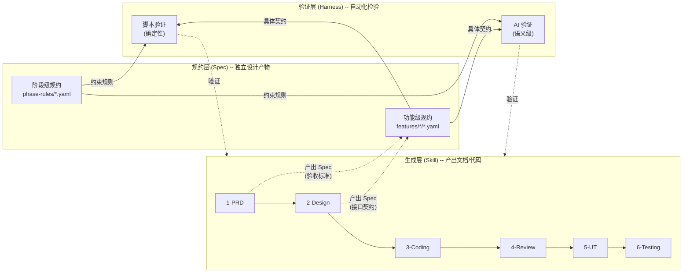
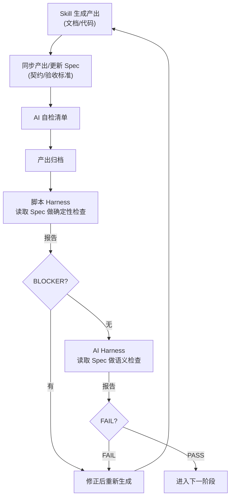

# 模拟华为钱包应用 -- Skill + Spec + Harness 统一开发计划

## 核心架构：三层分离


| 层                | 职责                  | 定位            | 目录                                       |
| ---------------- | ------------------- | ------------- | ---------------------------------------- |
| **Skill（生成层）**   | 产出文档和代码             | 生产者           | `skills/`（`.cursor/skills/` 为 Cursor 跳板） |
| **Spec（规约层）**    | 定义契约、验收标准、边界用例      | 设计产物，独立于生成和验证 | `specs/`                                 |
| **Harness（验证层）** | 消费 Spec，自动化检验产出是否合规 | 消费者           | `harness/`                               |


三者的关系：




**Spec 的双重角色**：

- **被 Skill 生产**：Skill 1 产出 PRD 时同步提取验收标准到 Spec；Skill 2 产出设计文档时同步提取接口契约到 Spec
- **被 Harness 消费**：Harness 读取 Spec 做自动化验证
- **被 Skill 参照**：Skill 3 编码时参照 Spec 中的接口契约；Skill 5 生成 UT 时参照 Spec 中的验收标准

**每个阶段的完整工作流**：




**关键设计原则**：

- **三层独立演进**：Spec 可以在没有 Harness 时供人工审查；Harness 可以在没有 Skill 时验证手写代码；Skill 可以在没有 Harness 时独立运行
- **模型无关**：Spec 是 YAML，Prompt 是 Markdown，脚本是 TypeScript -- 不绑定 Cursor 或任何 AI 厂商
- **生成与验证分离**：生成者和验证者可以是不同 AI 模型，消除"自己验自己"的偏差
- **Skill 双层目录规范**：Skill 的实际内容（SKILL.md + templates/examples/reference）统一存放在根目录 `skills/` 下，内容中不应包含项目特有名称（以"本项目"指代）。Cursor 通过 `.cursor/skills/` 下的轻量跳板文件（仅含 frontmatter + 跳转指令）发现并加载 Skill。开发新 Skill 时必须同时创建两处文件

---

## 目录结构总览

```
项目根目录/
│
├── skills/                           # 生成层 -- Skill（实际内容，通用，可被任意 AI 工具使用）
│   ├── 1-prd-design/                #   ✅ 已完成
│   ├── 2-requirement-design/         #   ✅ 已完成
│   ├── 3-coding/                     #   ✅ 已完成
│   ├── 4-code-review/                #   ⏳ 待开发
│   ├── 5-business-ut/                #   ⏳ 待开发
│   └── 6-device-testing/             #   ⏳ 待开发
│
├── .cursor/skills/                  # Cursor 发现入口 -- 跳板（每个仅 ~17 行，指向 skills/ 下对应目录）
│   ├── 1-prd-design/SKILL.md        #   → 读取 skills/1-prd-design/SKILL.md
│   ├── 2-requirement-design/SKILL.md #   → 读取 skills/2-requirement-design/SKILL.md
│   ├── 3-coding/SKILL.md            #   → 读取 skills/3-coding/SKILL.md
│   ├── 4-code-review/SKILL.md       #   ⏳ 待开发时同步创建跳板
│   ├── 5-business-ut/SKILL.md       #   ⏳ 待开发时同步创建跳板
│   └── 6-device-testing/SKILL.md    #   ⏳ 待开发时同步创建跳板
│
├── specs/                            # 规约层 -- Spec（独立设计产物）
│   ├── phase-rules/                  #   阶段级规约（通用规则，适用于所有功能模块）
│   │   ├── prd-rules.yaml            #     PRD 必须满足的结构/内容约束
│   │   ├── design-rules.yaml         #     设计文档必须满足的约束
│   │   ├── coding-rules.yaml         #     代码必须满足的约束（分层/命名/资源引用等）
│   │   ├── review-rules.yaml         #     Review 报告的约束
│   │   ├── ut-rules.yaml             #     UT 的覆盖率/有效性约束
│   │   └── testing-rules.yaml        #     测试通过率/覆盖度约束
│   └── features/                     #   功能级规约（每个功能模块的具体契约）
│       ├── home-page/                #     示例：首页
│       │   ├── contracts.yaml        #       接口契约（从 design.md 提取的函数签名、数据模型）
│       │   ├── acceptance.yaml       #       验收标准（从 PRD.md 提取的可量化条件）
│       │   └── boundaries.yaml       #       边界用例（异常场景、极端输入）
│       └── card-management/          #     示例：卡片管理
│           ├── contracts.yaml
│           ├── acceptance.yaml
│           └── boundaries.yaml
│
├── harness/                          # 验证层 -- Harness（纯验证工具）
│   ├── scripts/                      #   脚本 Harness（TS，确定性检查）
│   │   ├── check-prd.ts              #     读取 prd-rules.yaml + acceptance.yaml 做检查
│   │   ├── check-design.ts           #     读取 design-rules.yaml + contracts.yaml 做检查
│   │   ├── check-coding.ts           #     读取 coding-rules.yaml + contracts.yaml 做检查
│   │   ├── check-review.ts
│   │   ├── check-ut.ts
│   │   ├── check-testing.ts
│   │   └── utils/
│   │       ├── spec-loader.ts        #       Spec 文件加载/解析工具
│   │       ├── ast-analyzer.ts       #       ArkTS AST 分析工具
│   │       └── report-generator.ts   #       统一报告生成器
│   ├── prompts/                      #   AI Harness Prompt 模板（模型无关）
│   │   ├── verify-prd.md
│   │   ├── verify-design.md
│   │   ├── verify-coding.md
│   │   ├── verify-review.md
│   │   ├── verify-ut.md
│   │   └── verify-testing.md
│   ├── reports/                      #   验证报告输出
│   │   └── {feature}/{phase}/
│   ├── harness-runner.ts             #   统一运行入口
│   ├── package.json
│   └── tsconfig.json
│
└── doc/                              # 过程文档
    ├── 业务级UT策划.md
    └── features/{module}/
        ├── PRD.md
        ├── design.md
        └── ...
```

---

## Spec 规约层详解

### 阶段级规约 (`specs/phase-rules/`)

定义每个阶段产出的**通用规则**，适用于所有功能模块。例如：

```yaml
# specs/phase-rules/coding-rules.yaml（节选）
phase: coding
version: "1.0"

structure_checks:
  file_completeness:
    description: "design.md 中规划的所有文件必须存在"
    severity: BLOCKER
  layer_compliance:
    description: "模块内 import 不得违反 shared->data->domain->presentation 分层"
    severity: BLOCKER
  no_hardcoded_strings:
    description: "UI 文本必须通过 $r() 引用资源"
    severity: MAJOR
  resource_integrity:
    description: "所有 $r() 引用的资源 key 必须在 json 中存在"
    severity: BLOCKER

semantic_checks:
  business_logic_correctness:
    description: "代码逻辑是否正确实现了 design.md 描述的业务流程"
    severity: MAJOR
  error_handling_completeness:
    description: "PRD 中定义的异常场景是否都有对应处理"
    severity: MAJOR

traceability_checks:
  design_to_code:
    description: "design.md 映射表中每个文件路径在代码中存在"
    severity: BLOCKER
```

### 功能级规约 (`specs/features/{module}/`)

每个功能模块的**具体契约**，在 Skill 1/2 执行时同步产出：

```yaml
# specs/features/home-page/contracts.yaml（节选）
feature: home-page
source: doc/features/home-page/design.md

interfaces:
  - module: WalletMain
    layer: data/repository
    file: CardRepository.ets
    class: CardRepository
    methods:
      - name: getCardList
        params: []
        return: "Promise<CardInfo[]>"
      - name: getCardById
        params: [{name: "id", type: "string"}]
        return: "Promise<CardInfo | undefined>"

data_models:
  - name: CardInfo
    file: data/model/CardInfo.ets
    fields:
      - {name: "cardId", type: "string", required: true}
      - {name: "cardName", type: "string", required: true}
      - {name: "cardType", type: "CardType", required: true}
      - {name: "balance", type: "number", required: false}

files:
  - WalletMain/src/main/ets/data/model/CardInfo.ets
  - WalletMain/src/main/ets/data/repository/CardRepository.ets
  - WalletMain/src/main/ets/presentation/pages/HomePage.ets
```

```yaml
# specs/features/home-page/acceptance.yaml（节选）
feature: home-page
source: doc/features/home-page/PRD.md

criteria:
  - id: AC1
    description: "首页加载后在 2 秒内展示卡片列表"
    priority: P0
    testable: true
    linked_functions: [F1, F2]
  - id: AC2
    description: "无卡片时展示引导开卡的空状态页面"
    priority: P0
    testable: true
    linked_functions: [F3]

boundaries:
  - id: BD1
    description: "网络断开时展示离线缓存数据"
    scenario: network_offline
  - id: BD2
    description: "卡片数量超过 100 张时列表滚动流畅"
    scenario: large_dataset
```

### Spec 的生产时机


| Spec 类型                      | 生产者               | 生产时机             | 内容来源                       |
| ---------------------------- | ----------------- | ---------------- | -------------------------- |
| `phase-rules/*.yaml`         | 架构师/开发者           | 项目初期一次性定义，后续迭代更新 | 编码规范、架构规则、质量标准             |
| `features/*/contracts.yaml`  | Skill 2 (Design)  | 设计文档归档时同步提取      | design.md 中的接口定义、数据模型、文件列表 |
| `features/*/acceptance.yaml` | Skill 1 (PRD)     | PRD 归档时同步提取      | PRD.md 中的验收标准、异常场景         |
| `features/*/boundaries.yaml` | Skill 1 + Skill 2 | PRD/设计归档时同步提取    | 边界场景、极端输入、性能指标             |


---

## 各阶段概要（Skill + Spec + Harness 三层视角）

### Phase 1: PRD -- Skill ✅ | Spec ⏳ | Harness ⏳

- **Skill**（已完成）：生成 PRD.md
- **Spec 产出**：PRD 归档时同步提取 `acceptance.yaml` + `boundaries.yaml`
- **Harness 检查**：脚本验 PRD 结构 + AI 验语义质量

### Phase 2: Design -- Skill ✅ | Spec ⏳ | Harness ⏳

- **Skill**（已完成）：生成 design.md
- **Spec 产出**：设计归档时同步提取 `contracts.yaml`（接口/模型/文件清单）
- **Harness 检查**：脚本验 PRD 覆盖率 + AI 验架构合理性

### Phase 3: Coding -- Skill ✅ | Spec ⏳ | Harness ⏳

- **Skill**（已完成）：生成源代码
- **Spec 消费**：编码时参照 `contracts.yaml` 中的接口签名
- **Harness 检查**（最高价值）：脚本验文件存在性/接口一致性/分层合规/资源引用 + AI 验逻辑正确性

### Phase 4: Review -- Skill ⏳ | Spec ⏳ | Harness ⏳

- **Skill**：生成 Review 报告
- **Spec 消费**：Review 时参照 `coding-rules.yaml` + `contracts.yaml`
- **Harness 检查**：脚本验报告格式/BLOCKER 计数 + AI 验 Review 结论一致性

### Phase 5: UT -- Skill ⏳ | Spec ⏳ | Harness ⏳

- **Skill**：基于 DAG 生成 UT
- **Spec 消费**：UT 生成时参照 `acceptance.yaml` + `boundaries.yaml` 提取断言
- **Harness 检查**：脚本验 DAG 覆盖率/编译/执行通过率 + AI 验 Mock 合理性/断言有效性

### Phase 6: Testing -- Skill ⏳ | Spec ⏳ | Harness ⏳

- **Skill**：生成测试计划和报告
- **Spec 消费**：测试计划直接参照 `acceptance.yaml` 生成用例
- **Harness 检查**：脚本验通过率 + AI 验覆盖度

---

## 跨阶段追溯链

Spec 是追溯链的**枢纽** -- 每一环的追溯都通过 Spec 中的 ID 关联，由 Harness 自动验证。

```
PRD.md
  └→ acceptance.yaml (AC1, AC2... / BD1, BD2...)    ← Spec 提取
       │
       ▼ prd→design 追溯
design.md
  └→ contracts.yaml (接口/模型/文件, linked: AC1→func1)  ← Spec 提取
       │
       ▼ design→code 追溯
source code (func1.ets, func2.ets...)
       │
       ▼ code→ut 追溯
UT/DAG (断言覆盖 AC1, AC2...)
       │
       ▼ ut→test 追溯
Test Plan (用例覆盖 AC1, AC2, BD1...)
```

---

## 统一实施顺序

### 第一阶段：Spec 规约定义 + Harness 基础设施 + 编码验证（4-6天）

最高价值 -- 已有 Skill 1-3 的产出，可立即验证效果。


| 步骤  | 内容                                                                             | 层       | 预计耗时 |
| --- | ------------------------------------------------------------------------------ | ------- | ---- |
| 1.1 | 编写阶段级规约 `specs/phase-rules/` 的 6 个 YAML                                        | Spec    | 1-2天 |
| 1.2 | 为首页功能提取功能级规约 `specs/features/home-page/`（contracts + acceptance + boundaries）  | Spec    | 0.5天 |
| 1.3 | 搭建 `harness/` 基础设施：harness-runner.ts、spec-loader、ast-analyzer、report-generator | Harness | 1-2天 |
| 1.4 | 实现 `check-coding.ts` + `verify-coding.md` prompt，引用 specs/ 做检查                 | Harness | 1-2天 |
| 1.5 | 在首页代码上运行 Harness，验证三层协作效果                                                      | 验证      | 0.5天 |


### 第二阶段：补建 PRD/Design 阶段 Harness + 更新 Skill 1-3（2-3天）


| 步骤  | 内容                                                    | 层       | 预计耗时 |
| --- | ----------------------------------------------------- | ------- | ---- |
| 2.1 | 实现 `check-design.ts` + `check-prd.ts` + 对应 AI prompt  | Harness | 1-2天 |
| 2.2 | 更新 Skill 1/2/3 的 SKILL.md：追加 Spec 产出步骤 + Harness 验证步骤 | Skill   | 0.5天 |
| 2.3 | 在已有的首页 PRD + design 上运行完整验证链                          | 验证      | 0.5天 |


### 第三阶段：Review Skill + Spec + Harness（2-3天）


| 步骤  | 内容                                                                                                                              | 层       | 预计耗时 |
| --- | ------------------------------------------------------------------------------------------------------------------------------- | ------- | ---- |
| 3.1 | 开发 Skill 4：`skills/4-code-review/` 下创建 SKILL.md + 检查清单 + 报告模板（内置 Spec 参照 + Harness 步骤），同步在 `.cursor/skills/4-code-review/` 创建跳板 | Skill   | 1-2天 |
| 3.2 | 实现 `check-review.ts` + `verify-review.md`                                                                                       | Harness | 1天   |


### 第四阶段：业务级 UT Skill + Spec + Harness（5-7天，最复杂）


| 步骤  | 内容                                                                                                                                                 | 层       | 预计耗时 |
| --- | -------------------------------------------------------------------------------------------------------------------------------------------------- | ------- | ---- |
| 4.1 | 开发 Skill 5：`skills/5-business-ut/` 下创建 SKILL.md + DAG Schema + UT/Mock 模板 + 打桩策略（UT 生成参照 acceptance.yaml），同步在 `.cursor/skills/5-business-ut/` 创建跳板 | Skill   | 3-5天 |
| 4.2 | 实现 `check-ut.ts` + `verify-ut.md`                                                                                                                  | Harness | 2天   |


### 第五阶段：真机测试 + 端到端收官（3-5天）


| 步骤  | 内容                                                                                                                              | 层       | 预计耗时 |
| --- | ------------------------------------------------------------------------------------------------------------------------------- | ------- | ---- |
| 5.1 | 开发 Skill 6：`skills/6-device-testing/` 下创建 SKILL.md + 测试模板（测试计划直接参照 acceptance.yaml），同步在 `.cursor/skills/6-device-testing/` 创建跳板 | Skill   | 1-2天 |
| 5.2 | 实现 `check-testing.ts` + `verify-testing.md`                                                                                     | Harness | 1天   |
| 5.3 | **端到端总验证**：走通 6 阶段 Skill -> Spec -> Harness 全流水线，验证跨阶段追溯链                                                                       | 三层      | 2天   |


---

## 详细参考文档

- Harness 验证器的详细设计（AI Prompt 模板结构、运行器架构、报告格式等）见：[Spec-Harness 验证体系详细规划](../../c:/Users/shengqsq/.cursor/plans/spec-harness验证体系_27975623.plan.md)
- 业务级 UT 的 DAG 方案详细设计见：[doc/业务级UT策划.md](../../doc/业务级UT策划.md)

