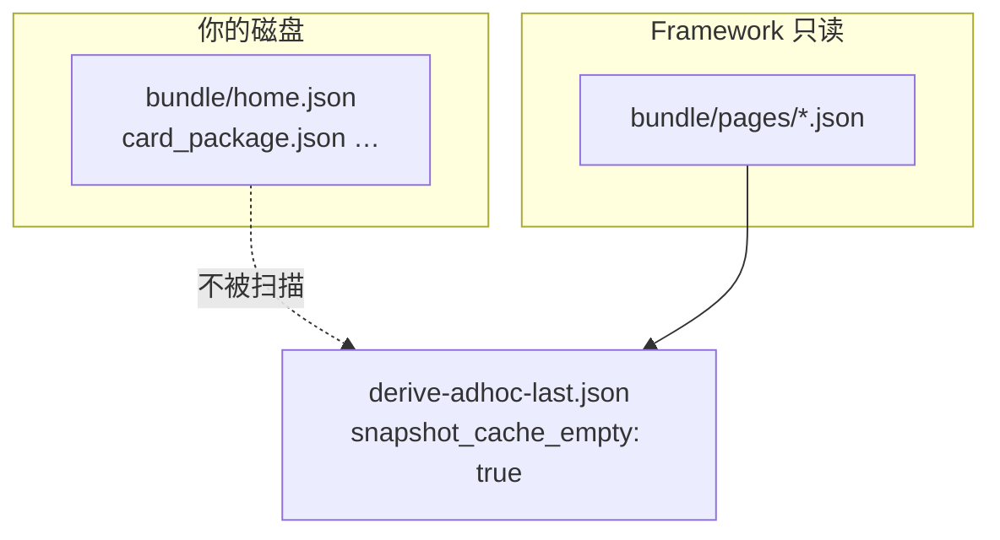
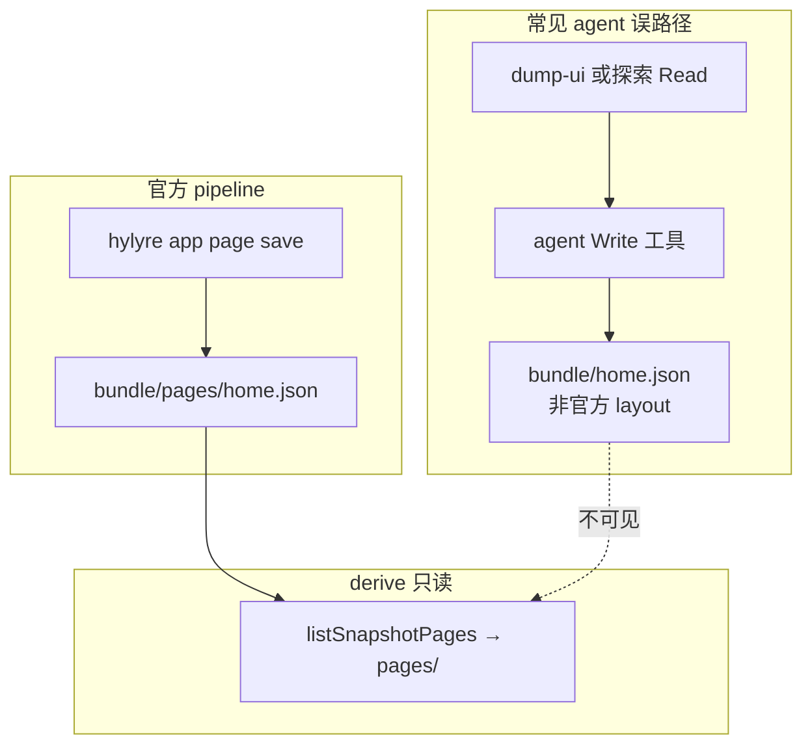
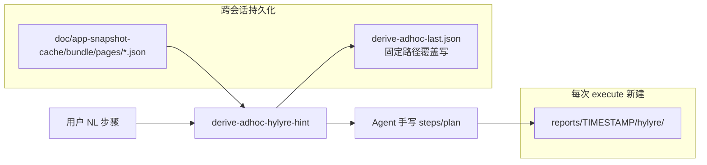

# 即席真机两大问题：最新 Framework 能否解决？

## 结论摘要


| 问题                                           | 最新 framework 能否解决     | 一句话                                                                                                                                                                                                                         |
| -------------------------------------------- | --------------------- | --------------------------------------------------------------------------------------------------------------------------------------------------------------------------------------------------------------------------- |
| **1. 有 snapshot cache / 跑过同用例，新会话仍从头写 plan** | **否（在你当前 cache 布局下）** | **已确认根因**：你的 `home.json`/`card_package.json` 在 bundle **根目录**，framework 判空/hint **只读** `pages/*.json` → derive 恒 `snapshot_cache_empty: true`、warmup 仍会跑、selector_hints 为空；agent 只能盲写 plan。另：不会自动复用上次 timestamp 下的 plan 文件。 |
| **2. 写 plan 大量语法错误、反复真机失败**                  | **大部分可缓解，touch 结构仍漏** | `lint-adhoc-steps` + `adhoc-device-test` 写前 lint 可拦截 `wait`/`wait_for`/`dump_ui` 类错误；**不能**拦截 `{"touch":{"selector":{"text":…}}}`（Hylyre 运行时 `Unsupported touch payload`）；agent 若跳过 lint 或只用错误示例仍会浪费跑机时间。                   |


以下均引用本仓库 **当前已提交代码**（`git status` 仅 plan 文件本身 untracked；**HEAD `2d74851`**）。**勘校日期：2026-05-21（第二轮）。**

---

## 勘校：相对上一轮 plan 的新增/变更（均有代码证据）

| 条目 | 状态 | 证据 |
|------|------|------|
| **HEAD 基准** | `2d74851`（非 ed82bb8） | `git log -1` → `fix(harness): Hypium 子进程注入 hdc toolchains 到 PATH` |
| **hdc PATH 注入** | **新增** | [`hdc-runner.ts`](framework/profiles/hmos-app/harness/hdc-runner.ts) L155 `mergeEnvWithHdcOnPath`；[`adhoc-dump-ui.ts`](framework/harness/scripts/utils/adhoc-dump-ui.ts) L11-15 `hylyreSpawnEnv`；[`app-snapshot-warmup.ts`](framework/profiles/hmos-app/harness/app-snapshot-warmup.ts) L263/L315 spawn env |
| **warmup 失败分类** | **新增（f0ddbfe 链）** | [`hdc-foreground-probe.ts`](framework/profiles/hmos-app/harness/hdc-foreground-probe.ts) `pollUntilForeground`；[`app-snapshot-warmup.ts`](framework/profiles/hmos-app/harness/app-snapshot-warmup.ts) L335-368 `classifyWarmupFailure` → `reason_kind: dump_ui_failed` 等写入 meta |
| **移除 NL 自动翻译** | **已删除** | commit `3994e76` 删除 [`adhoc-step-translate.ts`](framework/harness/scripts/utils/adhoc-step-translate.ts)（`git show 3994e76`）；Grep 全仓 **0** 引用 |
| **derive-adhoc-last.json 落盘** | **仅** `adhoc-device-test --steps` | [`derive-adhoc-hylyre-hint.ts`](framework/harness/scripts/derive-adhoc-hylyre-hint.ts) 仅 stdout/`--out`，**不写**固定路径；[`adhoc-device-test.ts`](framework/harness/scripts/adhoc-device-test.ts) L94-103 + L287-291 写 `derive-adhoc-last.json` |
| **本仓 derive 产物** | **已是 schema 4** | [`derive-adhoc-last.json`](doc/features/_adhoc/testing/reports/derive-adhoc-last.json) 含 `steps_file_contract`、`selector_hints`（`pages/home` 命中）；**上一轮「旧产物缺字段」已过时** |
| flat cache 扫描 | **仍 pending** | [`app-snapshot-cache-hint.ts`](framework/harness/scripts/utils/app-snapshot-cache-hint.ts) L9-19 未变 |
| touch lint | **仍 pending** | [`hylyre-planned-step-lint.ts`](framework/harness/scripts/utils/hylyre-planned-step-lint.ts) 仍无 touch 深校验 |
| UI_RESET trace 路径 | **仍 pending** | [`adhoc-device-test.ts`](framework/harness/scripts/adhoc-device-test.ts) L483 仍读本次 `traceOutPath` |

**对 transcript 中 `dump_ui_failed` 的关联**：若当时根因是 Python 子进程 **PATH 无 hdc**（Claude Code CLI 常见），`2d74851` **可能修复** warmup/`--dump-ui-only`；若根因是 ability/前台/device，仍依赖 `snapshot-warmup.meta.json` 的 `reason_kind` 诊断（**不能推测已修复**，须看 meta/log）。

---

## 勘校：ed82bb8 及更早已落地项（保持不变）

| 原 plan 条目 | 勘校结果 | 代码证据 |
|-------------|---------|---------|
| cold-restart | **已实现** | commit `ed82bb8`；[`device-test-run.ts`](framework/profiles/hmos-app/harness/providers/device-test-run.ts) L439-457 `runAaForceStop`；L1164-1167 |
| 即席 `--plan` NAV BLOCKER | **已实现** | [`adhoc-device-test.ts`](framework/harness/scripts/adhoc-device-test.ts) L397-414 |
| coldRestart 默认 | **已实现** | L199-200：`!continueSession && !process.argv.includes('--no-cold-restart')` |
| page save 可观测 | **已实现** | L565-566：`ADHOC_PAGE_SAVE_EXIT`、`ADHOC_CACHE_UPDATED` |
| Hylyre page save 路径 | **仍为 pages/** | vendored wheel `page_store.py` L180 |

---

## 问题 1：Snapshot Cache 存在，新会话仍「从头写 plan」

### 你已确认的事实：cache 路径与 framework 不一致（**主因**）

你的真实工程布局（示例）：

```text
doc/app-snapshot-cache/com.huawei.hmos.wallet/
  home.json
  card_package.json
  non_native_cards.json   # 等
  app-meta.json           # 可能有
  dump-ui-*.json          # 可能有
```

Framework **唯一**认作「页面快照」的路径（两处 SSOT 一致）：


| 函数                                           | 文件                                                                                               | 扫描路径                            |
| -------------------------------------------- | ------------------------------------------------------------------------------------------------ | ------------------------------- |
| `listSnapshotPages` / `isSnapshotCacheEmpty` | `[app-snapshot-cache-hint.ts](framework/harness/scripts/utils/app-snapshot-cache-hint.ts)` L9-23 | `<cache>/<bundle>/pages/*.json` |
| `isAppSnapshotCacheEmpty`                    | `[app-snapshot-warmup.ts](framework/profiles/hmos-app/harness/app-snapshot-warmup.ts)` L97-114   | 同上                              |


`buildSelectorHints` 读快照时也硬编码 `pages/${page}.json`（`[app-snapshot-cache-hint.ts](framework/harness/scripts/utils/app-snapshot-cache-hint.ts)` L52）。

**后果（对你当前布局）：**

1. derive → `**snapshot_cache_empty: true`**（即使根目录有十几个 page JSON）
2. `**available_pages: []`**、`**selector_hints` 几乎为空**（无法从 cache 匹配「添加卡片」等文案）
3. warmup **不会**因 cache 非空而跳过（仍尝试 dump-ui/page save）
4. Agent 收到「无 cache」信号 → **从头猜 selector 写 plan** —— 这与 transcript 完全一致，**不是 agent 误读**，是 **framework 路径契约与磁盘布局不匹配**

文档期望 layout（`[profile-addendum.md](framework/profiles/hmos-app/skills/6-device-testing/profile-addendum.md)` L121）为 `pages/home.json`；若 Hylyre/历史探索把 JSON 写在 bundle 根目录，**最新 framework 代码仍无法识别**。




**临时 workaround（不改 framework 代码）：**

- 把根目录 page JSON **移入或复制到** `pages/` 子目录，例如 `pages/home.json`、`pages/card_package.json`（保留 slug 名即可）
- 或一次性：`mkdir pages && mv *.json pages/`（排除 `app-meta.json`、`dump-ui-*.json`、`*_summary.json`）

**framework 增强方向（plan todo `fix-cache-path-mismatch`）：**

- 扩展 `listSnapshotPages`：合并 `pages/*.json` **与** bundle 根目录 `*.json`（排除 `app-meta.json`、`dump-ui-`*、`*summary`* 等 meta 文件）
- 单测覆盖 flat layout；derive/warmup/selector_hints 共用同一 SSOT

---

### 为什么不是「pages/ 被弄丢了」，而是「pages/ 可能从未被官方 pipeline 创建」

你未手动改 cache，这完全合理——**根目录的 `home.json` / `card_package.json` 大概率也不是 Hylyre/framework 写的**。

#### 官方写入路径（Hylyre 0.1.0 wheel 源码）

从 vendored wheel `hylyre/app_store/paths.py` + `page_store.py`：

```python
def pages_dir(store_dir, bundle):
    return store_dir / bundle / "pages"

def save_page_snapshot(...):
    out = pages_dir(store_dir, bundle) / f"{page_name}.json"
```

即：**只要 `hylyre app page save` 成功，必然写到 `<bundle>/pages/<slug>.json`**，不会在 bundle 根目录生成 `home.json`。

Framework harness 调用方式与此一致（`[device-test-page-save.ts](framework/profiles/hmos-app/harness/device-test-page-save.ts)` → `app page save <BUNDLE> <SLUG>`，env `HYLYRE_APP_STORE_DIR`）。

#### 根目录 JSON 的实际来源（按可能性排序）


| 文件/模式                                            | 谁写的                                                                                                 | 是否被 derive 识别 |
| ------------------------------------------------ | --------------------------------------------------------------------------------------------------- | ------------- |
| `pages/home.json`                                | `hylyre app page save`（harness run 后 / warmup）                                                      | **是**         |
| `dump-ui-YYYYMMDD.json`                          | `[adhoc-dump-ui.ts](framework/harness/scripts/utils/adhoc-dump-ui.ts)` 显式 `--out` 到 bundle 根        | **否**         |
| `app-meta.json`                                  | `[resolve-main-ability.ts](framework/profiles/hmos-app/harness/resolve-main-ability.ts)` bm dump 缓存 | **否**（元数据）    |
| `home.json` / `card_package.json` **在 bundle 根** | **Hylyre 不会这样写**；framework **也没有**对应 Write 代码                                                       | **否**         |
| `home_summary.json` / `*_summary.json`           | 命名即表明是**汇总产物**，典型为 **agent 会话内 Write**                                                              | **否**         |


**结论：不是「AI 生成时把 pages/ 目录删了」，而是：**

1. **官方 page save 在你的 Wallet 场景里很可能一直失败**（transcript 已有 `dump_ui_failed`、warmup 软失败）；page save **非致命**，run 仍继续，但 `**pages/` 从未被创建**。
2. **某次 agent 探索/汇总时**，用 Read 读了 dump-ui 或设备 UI，再用 **Write 把简化 JSON 直接落到 bundle 根目录**（误当作「cache」），文件名自定（`home.json`、`non_native_cards.json` 等）。
3. 这些文件**看起来像 cache**，但对 derive/warmup **等于不存在**——因为 framework 与 Hylyre 的 SSOT 都是 `pages/`。




#### 如何在你工程里验证（只读）

在 WalletForHarmonyOS 查看：

1. `doc/features/_adhoc/testing/reports/device-test-run.log` — 搜 `hylyre app page save`，看 `exit=0` 还是 `exit=2`
2. `snapshot-warmup.meta.json` — 看 `page_save` / `reason_kind`
3. `device-test-run.meta.json` — 看 `hylyre_page_save.exit_code`
4. 根目录 JSON 的 **mtime** 是否与某次 agent Write 会话时间对齐（而非 harness run 时间）

若 page save 从未 exit 0，则 `**pages/` 缺失是预期结果**，不是用户误删。

#### Framework 应补的防护（plan todo `agent-cache-write-discipline`）

- Skill 6 / agent-execution：**禁止** agent 向 `doc/app-snapshot-cache/<bundle>/` 根目录 Write page 结构 JSON
- derive 输出增加 `cache_layout_expected: "pages/<slug>.json"` + 若检测到根目录有 page-like JSON 但 `pages/` 为空 → stderr `ADHOC_CACHE_LAYOUT_MISMATCH=1`
- page save 失败时在 derive stderr 明确提示「cache 未更新，勿自行 Write 替代」

---

### Framework 实际提供了什么（在 `pages/` 布局下才有用）




1. **固定 derive 产物** — `[framework/harness/scripts/adhoc-device-test.ts](framework/harness/scripts/adhoc-device-test.ts)` 与 `[derive-adhoc-hylyre-hint.ts](framework/harness/scripts/derive-adhoc-hylyre-hint.ts)` 每次 derive 覆盖写入：
  - `doc/features/_adhoc/testing/reports/derive-adhoc-last.json`
  - stderr：`ADHOC_DERIVE_FILE=`
2. **Cache 判空与 hint** — `[app-snapshot-cache-hint.ts](framework/harness/scripts/utils/app-snapshot-cache-hint.ts)`：
  - **仅** `doc/app-snapshot-cache/<bundle>/pages/*.json` 计入非空
  - `dump-ui-*.json`、`app-meta.json`、bundle 根目录下的 `home_summary.json` 等 **不计入**
  - 非空时 derive 输出 `snapshot_cache_empty: false`、`available_pages`、`selector_hints`（从 pages JSON 模糊匹配 NL）
3. **Warmup 跳过** — cache 非空时 `[app-snapshot-warmup.ts](framework/profiles/hmos-app/harness/app-snapshot-warmup.ts)` 返回 `reason: 'cache_nonempty'`，不再探索。
4. **观察型 NL 分流** — `[adhoc-derive-helpers.ts](framework/harness/scripts/utils/adhoc-derive-helpers.ts)` 将「查看/汇总/所有/列表…」拆到 `observation_steps`，`next_action` 指向「导航 steps + `--dump-ui-only` + summarize」，避免把观察写进 Hylyre steps。
5. **机械 touch 草稿** — 对「点击某某」类 NL，`steps_file_minimal_example` 可生成 `[{"touch":{"by_text":"…"}}]`（见 `buildMinimalTouchExample`）。

### Framework **没有**提供什么（transcript 现象的根源之一）

- **不会**自动加载上次 `reports/<旧timestamp>/hylyre/test-plan.hylyre.md`；`[hylyreDirForRun()](framework/harness/scripts/adhoc-device-test.ts)` 每次 execute **必建新时间戳目录**。
- **不会**把 NL 自动翻译成完整 Hylyre plan（derive 明确「mechanical hints only」）。
- **没有**「同 bundle + 同 NL → 复用上次成功 steps 文件」的 registry。

### 对照你的 transcript


| Transcript 行为                         | 代码层解释                                                                                       |
| ------------------------------------- | ------------------------------------------------------------------------------------------- |
| derive 报 `snapshot_cache_empty: true` | **已确认**：cache 在 bundle 根目录（`home.json` 等），**不在** `pages/`；framework 按设计判空，**不是 cache 不存在**。 |
| Agent 后来 Read `home.json` 能汇总卡片       | Agent 手动读根目录 JSON 成功；但 derive **不会**自动注入这些 selector —— 两套路径脱节。                              |
| Agent 仍新建多份 `test-plan.hylyre.md`     | 符合设计：每次 run 新 timestamp；**应**先读 `derive-adhoc-last.json` + cache JSON，而非从零猜 selector。       |
| 后来手动读 cache 汇总卡片                      | 正确 fallback；更优路径是 derive 后读 `selector_hints` + 观察型走 `--dump-ui-only`。                       |


### 问题 1 判定（更新）

- **在你当前的 flat cache 布局下：最新 framework 不能解决问题 1。** derive/warmup/hint 链路对现有 cache **视而不见**。
- **若**把 page JSON 迁到 `pages/`（或 framework 补 flat-layout 扫描）：derive 才会 `snapshot_cache_empty: false` 并填充 `selector_hints`；新会话 agent **仍须**手写/复用 steps，但**不必**从零猜按钮文案。
- 「不从头写 plan 文件」**仍不能**自动完成 — 每次 execute 新建 timestamp 目录；需 agent 读 `derive-adhoc-last.json` + 可选 `--plan <已有路径>`。
- **额外已落地**（ed82bb8）：execute **默认 cold-restart**（`runAaForceStop` + `aa start`）；即席 `--plan` **NAV 违规亦 BLOCKER**
- **仍 pending**：flat cache 扫描；`ADHOC_UI_RESET_RECOMMENDED` 在默认新 timestamp 下几乎无效（应读固定 `device-test-run.meta.json` 或上次 trace）

---

## 问题 2：写作过程大量语法错误

### Transcript 中的三类错误 vs 当前拦截能力


| 错误（transcript）                                                        | 当前写前能否拦截 | 机制                                                                                                                                                                                                                                                                                         |
| --------------------------------------------------------------------- | -------- | ------------------------------------------------------------------------------------------------------------------------------------------------------------------------------------------------------------------------------------------------------------------------------------------ |
| `{"touch":{"selector":{"text":"…"}}}` → **Unsupported touch payload** | **否**    | `[hylyre-planned-step-lint.ts](framework/harness/scripts/utils/hylyre-planned-step-lint.ts)` **不校验** touch payload 结构；Hylyre 0.1.0 即席推荐 `by_text`（见 `[hylyre-planned-step-fields.md](framework/profiles/hmos-app/skills/6-device-testing/reference/hylyre-planned-step-fields.md)` L29-30） |
| `{"wait_for":{"timeout":3000}}` 无定位                                   | **是**    | STEP-WAIT；`adhoc --plan` / `--steps-file` 阻断 run（exit 2 + `plan_lint_blocker`）                                                                                                                                                                                                             |
| `{"wait":{"timeout":3}}`                                              | **是**    | STEP-WAIT-SECONDS                                                                                                                                                                                                                                                                          |
| 观察步骤写进 steps / 滥用 `wait_for` 等待观察                                     | **部分**   | derive 分流 + STEP-002 禁 `dump_ui`；应用 `--dump-ui-only` + `summarize-adhoc-dump`                                                                                                                                                                                                              |


### 已落地改进（6dcf0ba + a43bc1d + ed82bb8 + f0ddbfe + 2d74851 + 3994e76）

- [`lint-adhoc-steps.ts`](framework/harness/scripts/lint-adhoc-steps.ts) — 写前 CLI
- derive schema 4 — [`adhoc-derive-payload.ts`](framework/harness/scripts/utils/adhoc-derive-payload.ts)
- [`adhoc-device-test.ts`](framework/harness/scripts/adhoc-device-test.ts) — execute 前 lint；NAV BLOCKER；`ADHOC_PAGE_SAVE_EXIT`/`ADHOC_CACHE_UPDATED`
- **默认冷重启** — ed82bb8；opt-out：`--continue-session` / `--no-cold-restart`
- **warmup 诊断** — [`classifyWarmupFailure`](framework/profiles/hmos-app/harness/app-snapshot-warmup.ts) + [`hdc-foreground-probe.ts`](framework/profiles/hmos-app/harness/hdc-foreground-probe.ts)
- **hdc PATH 注入** — 2d74851；[`mergeEnvWithHdcOnPath`](framework/profiles/hmos-app/harness/hdc-runner.ts) 用于 dump-ui/warmup/page-save spawn
- **移除 adhoc-step-translate** — 3994e76；即席 **禁止**期待 harness 自动 NL→JSON
- Skill 6 + agent-execution 规则 — lint + 冷重启协议

### 仍存在的 gap（会导致 transcript 类浪费）

1. **touch 结构无 lint** — [`hylyre-planned-step-lint.ts`](framework/harness/scripts/utils/hylyre-planned-step-lint.ts) 无 touch 校验；[`profile-addendum.md`](framework/profiles/hmos-app/skills/6-device-testing/profile-addendum.md) **L106 仍写** `{"touch":{"selector":{"text":"确认"}}}`，与 [`hylyre-planned-step-fields.md`](framework/profiles/hmos-app/skills/6-device-testing/reference/hylyre-planned-step-fields.md) L29 `by_text` **冲突**
2. **`wait_for` 用 `duration` 但有 `by_text`** — [`hylyre-planned-step-lint.unit.test.ts`](framework/harness/tests/unit/hylyre-planned-step-lint.unit.test.ts) 仍 PASS
3. **JSON lint 未禁 `start_app`** — derive `forbidden_in_steps` 含 `start_app`，但 `validatePlannedStepsArray` 仍允许（`start_app` 在 `PLANNED_STEP_ROOT_KEY_SET`）
4. **cache 路径** — `fix-cache-path-mismatch` 仍 pending；无 `ADHOC_CACHE_LAYOUT_MISMATCH`
5. **`ADHOC_UI_RESET_RECOMMENDED` 路径 bug** — 见上表；默认新 timestamp 下 continue-session 检测失效

### 问题 2 判定

- **能显著减少** transcript 中 `**wait` / `wait_for` / 纯 timeout** 导致的无效跑机 — **前提是 agent 走 derive → lint → run 协议**。
- **不能消除** `**Unsupported touch payload`** 及文档示例冲突 — 除非补 touch lint 或统一文档为 `by_text`。
- 对你这条用例（含「查看…汇总」），最新协议应走：**导航 steps-file（3 个 touch）→ lint → run → `--dump-ui-only` → summarize**，而不是在 plan 里堆 `wait_for`。

---

## 真实工程落地前提（WalletForHarmonyOS vs 本仓）

你的 transcript 发生在 `**D:/1.code/WalletForHarmonyOS`**；本评估代码来自 `**SimulatedWalletForHmos/framework`**。

要获得上述能力，真实工程需：

1. **framework 子模块/拷贝 ≥ `2d74851`**（lint：`6dcf0ba`/`a43bc1d`；冷重启/NAV：`ed82bb8`；hdc PATH：`2d74851`）
2. **Skill 00 render** 或手动同步 `.cursor/rules/framework-agent-execution.mdc`、Skill 6 跳板
3. **Cache 目录结构**：framework 只认 `…/pages/*.json`；你当前是 bundle 根目录 flat layout → **必须先迁移或等 framework 修复路径扫描**，否则 derive 恒判空
4. Agent 会话加载 **framework-agent-execution** 规则；derive 建议用 **`adhoc-device-test --steps`**（写 `derive-adhoc-last.json`），单独跑 `derive-adhoc-hylyre-hint` **不会**更新该固定文件（除非 `--out`）

本仓 [`derive-adhoc-last.json`](doc/features/_adhoc/testing/reports/derive-adhoc-last.json) **已是 schema 4**（2026-05-21 重 derive；`pages/home` 命中，`selector_hints` 含 `matched_text`）。Wallet 工程须各自重跑 derive。

---

## 对你两个问题的直接回答

### 1. 最新 framework 能解决「有 cache 仍从头写 plan」吗？

**在你当前的 cache 布局下：不能。** 根因是 **路径契约不匹配**（根目录 `home.json` vs framework 只读 `pages/*.json`），derive 会如实报 `snapshot_cache_empty: true`，selector_hints 为空，agent 只能从头写 plan。

**若** page JSON 位于 `pages/`（或 framework 后续支持 flat layout 扫描）：可跨会话复用 cache hint，减少盲猜；但仍**不会**自动复用上次 timestamp 下的 plan 文件。

### 2. 最新 framework 能解决「语法错误浪费时间」吗？

**大部分能（协议执行时）。** `wait`/`wait_for`/`dump_ui` 可在跑机前拦截；NAV 在即席 `--plan` 亦阻断（ed82bb8）。**不能**覆盖 touch payload 结构错误；profile L106 与即席 SSOT 仍冲突。

---

## 若要在真实工程验证（确认 plan 后可选执行）

1. **先修复 cache 路径**：将 `home.json`、`card_package.json` 等移入 `pages/`（或等 framework 扩展 flat 扫描）
2. 跑 derive 并 Read `derive-adhoc-last.json` — 迁移后预期 `snapshot_cache_empty: false`、`available_pages` 含 `home,card_package,…`
3. 按 `steps_file_minimal_example` 或 cache 中 `by_text` 写 `test-steps.json`
4. `npm run lint-adhoc-steps -- --file … --normalize` — 应 0 violation
5. `adhoc-device-test --steps-file …` — 默认 `ADHOC_COLD_RESTART=1`
6. 成功后 `--dump-ui-only` + `summarize-adhoc-dump` 完成「汇总卡片」观察步骤

这 6 步是 **framework 已支持** 的正确路径；transcript 偏离了 Step 4.B 的 derive→lint→steps-file→dump 流程。