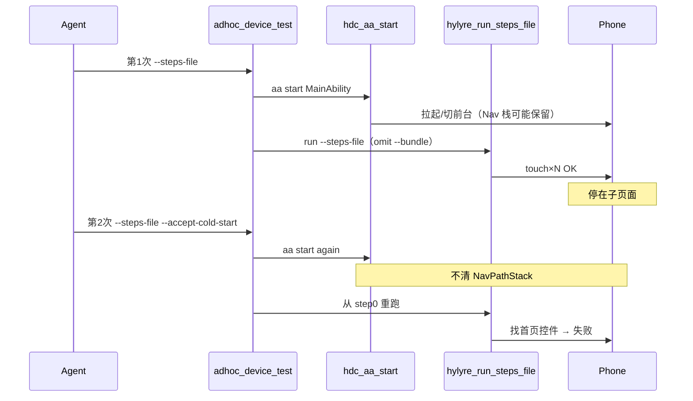

# 即席重跑「子页面污染」根因分析

> **勘校基准**：`main` @ `a43bc1d`  
> **关联**：[hylyre步骤错误根因分析_dfae989c.plan.md](hylyre步骤错误根因分析_dfae989c.plan.md)（步骤 JSON 语法类错误 **已落地**）

## 结论（直接回答）

**仍未解决。** 即席体验优化（derive/lint/observe-ui/`--accept-cold-start`/进度锚点/wait.seconds）**没有**增加「重跑前回到首页或冷重启 App」的机制。

你描述的现象与 framework + Hylyre 的**现有执行模型一致**：harness 默认假设「每次 run 起点已是首页 Tab」，失败后设备常不满足该假设。

---

## 与已落地工作的关系

| 问题 | 状态 @ a43bc1d | 本 plan |
|------|----------------|---------|
| dump_ui 误写进步骤 | ✅ STEP-002 + 观察分流 | 无关 |
| wait/seconds 误写 | ✅ STEP-WAIT-SECONDS | 无关 |
| lint 减少格式重试 | ✅ 已减少无效跑机 | **弱缓解**（少跑几次，起点仍可能是子页） |
| **失败后重跑子页当首页** | ❌ | **本 plan 主题** |

---

## 场景时间线（不变）



---

## 证据 1：执行模型（代码未变）

[`device-test-run.ts`](framework/profiles/hmos-app/harness/providers/device-test-run.ts)：

- 每次 run：`runAaStartPreflight` → `hdc shell aa start`
- steps-file 成功 preflight 后：`omitBundleForHylyre=true` → Hylyre **不调** `start_app`
- **无** `force-stop` / `stop_app` / Nav 清栈

| 步骤 | 行为 |
|------|------|
| harness aa start | ability 级拉起/切前台 |
| hylyre start_app | **省略**（防双冷启） |
| NavPathStack | **无自动 pop/clear** |

---

## 证据 2：本轮 flag 与「复位」无关

| Flag | 实际作用 | 是否复位 UI |
|------|----------|-------------|
| `--accept-cold-start` | `skipExplore=true`，跳过 snapshot **warmup** | **否** |
| `--observe-ui` | touch-only 一站式 + skip page_save | **否** |
| `--skip-page-save` | run 后不做 page save | **否** |
| `--dump-ui-only` | session + dump-ui | **否**（状态延续） |
| `lint-adhoc-steps` | JSON 写前 lint（含 STEP-WAIT-SECONDS） | **否** |

[`adhoc-device-test.ts`](framework/harness/scripts/adhoc-device-test.ts)：**无** `--cold-restart` / `--continue-session` / `ADHOC_UI_RESET_RECOMMENDED`。

Skill 4.B L290「重复跑加 `--accept-cold-start`」= **跳过 warmup**，易误解为 UI 冷启 → todo `skill-rerun-reset` 须澄清。

---

## 证据 3：导航 hint vs 自动注入

**已更新（相对初版 plan）**：adhoc derive 经 `buildNavigationHintForCase` 输出 `navigation_hint.suggested_preamble_steps`（如 `{"back":{}}`），见 [`adhoc-derive-payload.ts`](framework/harness/scripts/utils/adhoc-derive-payload.ts)。

**但仍未解决**：execute 时 harness **不会**自动注入 preamble 或 cold-restart；agent 须手写 steps 或等 `--cold-restart` 实现。

即席 `--steps-file` **不跑** NAV-001~003；`adhoc --plan` 跑 NAV 但 **NAV 违规当前不阻断 run**（仅 STEP BLOCKER 阻断，见 hylyre plan「Lint 路径差异」）。

---

## 证据 4：失败后无 teardown

- Hylyre `on_fail=abort`：立即 return，无 back/home/stop_app
- `synthesizeTraceFromStepsBatchRun`：无 `ui_reset_hint` / `last_step_index`
- `classifyRunFailure` 已有 `step_field_invalid`（步骤字段类），**无** `ui_state_stale` 类

---

## 建议实现（Phase 2 — 当前 todo）

### A. `--cold-restart`（todo `cold-restart-flag`）

每次 execute 前（或检测到上次 aborted/failed 时）：

```text
方案1（hdc）：aa force-stop + aa start -a <ability> -b <bundle>
方案2（Hylyre 内建）：harness 在 run 前注入 stop_app+start_app（需解决 omitBundle 冲突）
```

落点：[`adhoc-device-test.ts`](framework/harness/scripts/adhoc-device-test.ts) + [`device-test-run.ts`](framework/profiles/hmos-app/harness/providers/device-test-run.ts)

### B. `--continue-session`（todo `continue-session-optout`）

默认 **cold-restart**；调试 Nav 栈时显式 opt-out。

### C. trace / stderr 提示（todo `reset-hint-meta`）

- stderr：`ADHOC_UI_RESET_RECOMMENDED=1`（前次非全 pass 且未 cold-restart）
- trace/run_meta：`last_step_index`、`ui_reset_hint`

### D. Skill / profile / agent-execution（todo `skill-rerun-reset`）

> 即席 **每次新 steps-file 执行**（尤其前次 run 非全 pass）默认 `--cold-restart`；禁止假设仍在首页 Tab。

并修正 `--accept-cold-start` 命名误导（仅 skip warmup）。

### E. NAV 政策（todo `adhoc-plan-nav-policy`，与 hylyre plan 共享）

决定即席 `--plan` 时 `lint.nav.violations` 是否 exit 2。

---

## 自测（移植后必做）

1. Run steps 到子页成功 → **不要**动手机
2. 立刻第二次 `adhoc-device-test --steps-file`（可加 `--accept-cold-start`）
3. step0 找不到首页控件 → 确认需要 **cold-restart**，而非改 agent prompt

---

## 优先级

| 优先级 | 项 | 理由 |
|--------|-----|------|
| **P0** | cold-restart + continue-session + Skill 文档 | 直接解决用户重跑失败 |
| P1 | reset-hint-meta | 失败后可读 meta，减少 agent 猜设备状态 |
| P2 | adhoc-plan-nav-policy | 文档/行为一致，非子页污染主因 |
