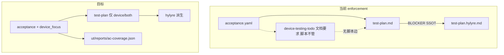

# 取消 device-testing-todo：验收分层 SSOT 收敛方案（修订版）

> **修订说明（第二轮）**：已对照 `framework/`、`doc/features/home-page/` 与 `git log` 至 `b53a561`（2026-05）。**方案 C 方向不变**；相对首轮修订**无** `device_focus` / 废弃 todo 的代码落地，但 Skill6 真机链继续增强（耗时汇总、init hylyre 闭环）。下文 §0.4 记录本轮 delta。

---

## 0. 代码库现状核查（与旧 plan 的差异）

### 0.1 已落地（本 plan **不要重复做**）

近期 Framework 已完成 **Skill 6 执行链**硬化（见 [.cursor/plans/skill6_派生计划_ssot_420a5005.plan.md](.cursor/plans/skill6_派生计划_ssot_420a5005.plan.md)，对应提交如 `6643286`、`75f17e9`、`2599bf3` 等）：

| 能力                                          | 实现位置                                                                                                                                                              | 含义                                                                                                |
| ------------------------------------------- | ----------------------------------------------------------------------------------------------------------------------------------------------------------------- | ------------------------------------------------------------------------------------------------- |
| **test-plan.md ↔ test-plan.hylyre.md SSOT** | [derived-hylyre-plan.ts](framework/harness/scripts/utils/derived-hylyre-plan.ts)、[check-testing.ts](framework/harness/scripts/check-testing.ts) `device_test_run` | 派生 TC ∪ `explicit_skip_tc_ids` 须覆盖顶层全部 TC；缺项/stale/extra → BLOCKER + `derive-hint-from-plan.json` |
| **派生计划新鲜度**                                 | `coverage_reason=stale`                                                                                                                                           | 仅 **test-plan.md mtime > hylyre 派生** 时 FAIL；**尚未**检查 acceptance ↔ test-plan                       |
| **NAV 静态 lint**                             | check-testing NAV-001/002/003                                                                                                                                     | 派生 JSON 导航纪律                                                                                      |
| **Hylyre vendor / venv**                    | `device-test-run.ts`、`tools.hylyre` init 闭环                                                                                                                       | fingerprint、doctor、pip 对齐                                                                         |
| **构建/装机复用与降级预检**                            | profile-addendum、[testing-build-conventions.ts](framework/profiles/hmos-app/harness/testing-build-conventions.ts)                                                 | HAP 复用、versionCode 降级、可选 uninstall                                                                |
| **hypium 临时目录隔离**                           | `reports/.hypium-workdir/tmp_hypium`                                                                                                                              | 不再污染仓库根                                                                                           |
| **真机流水线耗时汇总**                               | [device-test-timings.ts](framework/profiles/hmos-app/harness/device-test-timings.ts)、`check-testing` 写 `device-test-timing.json`                                  | build/install/hylyre_run 耗时；**不改变**验收 SSOT，属 reports 过程态                                          |
| **init · tools.hylyre 机器化**                 | [00-framework-init/SKILL.md](framework/skills/00-framework-init/SKILL.md)（`b53a561`）                                                                              | `framework.config.json > tools.hylyre` 与 vendor wheel 对齐的 init 闭环；与 todo 废弃无关                     |

**UT 侧**： [check-ut.ts](framework/harness/scripts/check-ut.ts) 已对 **UT 覆盖率分母**使用 `ut_layer ∈ {unit,both}`（`isUnitLayer`），并在报告中注明 device AC「交 Skill 6」。**这与旧 plan 中「UT 已分层」一致，且比 testing 阶段更先进。**

### 0.2 仍未落地（本 plan 的**真实缺口**）

| 项                            | 现状                                                                                                                                                                                                                               |
| ---------------------------- | -------------------------------------------------------------------------------------------------------------------------------------------------------------------------------------------------------------------------------- |
| `**device_focus` 字段**        | 全仓库 **无** 实现；home-page `acceptance.yaml` 仍用合并的 `ut_focus` 串（both 的 UI 部分写在同一段里）                                                                                                                                                  |
| `**device-testing-todo.md`** | Skill 5/6 正文、ut-rules、spec-loader OPTIONAL、check-ut L3 option_a **仍依赖**；实例 home-page **仍存在**                                                                                                                                     |
| `**ac-coverage.json`**       | **不存在**                                                                                                                                                                                                                          |
| **testing 追溯与 ut_layer**     | [check-testing.ts](framework/harness/scripts/check-testing.ts) `acceptance_to_test_case` 仍对 **全部 P0/P1 criteria** 与 **全部 boundaries**（**未按 ut_layer 过滤**）要求 test-plan 覆盖；鼓励在 plan 里为 **AC-2（unit）** 写 TC，与 Skill 6 自检「剔除 unit」矛盾 |
| **todo ↔ plan 衔接**           | check-testing **零引用** todo；Skill 6 仍 **文档要求** todo 优先                                                                                                                                                                            |
| **acceptance.yaml 机器校验**     | [check-prd.ts](framework/harness/scripts/check-prd.ts) 只校验 **PRD.md** 内 AC 章节，**不读** `acceptance.yaml` 的 `ut_layer` / focus 字段                                                                                                   |
| **文档自相矛盾**                   | [profile-addendum.md L54](framework/profiles/hmos-app/skills/6-device-testing/profile-addendum.md) 写「todo 为第一来源」；同文件 L125 写「**test-plan.md 为唯一用例清单权威**」                                                                          |
| **overview 陈旧**              | [overview.md §4.1](framework/docs/overview.md) 仍写「Skill 6 真机 harness 未完全搭起来」；与已落地的 build/install/run + Hylyre SSOT **不符**——本 plan 实施时须改写为「缺 acceptance→test-plan 分层」                                                             |
| **verify-testing**           | [verify-testing.md](framework/harness/prompts/verify-testing.md) 读 acceptance 做语义检查，**无** todo 消费 / device_focus 检查项                                                                                                             |

### 0.4 第二轮深度核查结论（相对首轮修订无方案漂移）

- **Git 范围**：`framework/` 最近 20 条提交以 Hylyre、test-plan SSOT、构建复用、init、generic adapter 为主；**零**提交涉及 `device_focus` 或删除 `device-testing-todo` 引用。
- **实例**：`[doc/features/home-page/device-testing-todo.md](doc/features/home-page/device-testing-todo.md)` **仍在**；`[acceptance.yaml](doc/features/home-page/acceptance.yaml)` 仍无 `device_focus` 字段。
- **计划状态**：本 plan 7 项 todo 均为 **pending**——用户若见「本地已改很多」，主要指 **Skill6 真机执行链**，而非 **todo→acceptance 收敛**（后者尚未开工）。
- **与 [.cursor/plans/skill6_派生计划_ssot_420a5005.plan.md](.cursor/plans/skill6_派生计划_ssot_420a5005.plan.md)**：该 plan 的 todos 已 **completed**；本 plan 是**正交**后续项，勿重复实现 derived-hylyre SSOT。

### 0.3 对 home-page 的结论（更新）

- 断档根因仍是：**验收定义（acceptance）→ 执行计划（test-plan）** 之间缺 `ut_layer` 过滤与 `device_focus` 契约；**不是** Hylyre SSOT 未做。
- 近期 testing harness PASS **不能**证明 todo 被消费；只证明 **test-plan ↔ hylyre 派生** 闭环。

---

## 1. 架构结论（保持不变）

### 1.1 要不要 `device-testing-todo.md`？

**长期：不要**作为 Framework 规定的交接物（方案 C）。

- **分层合理**：业务 UT（Hypium + 打桩）与真机 UI/导航/渲染验收分离，见 [5-business-ut.md](framework/docs/skills/5-business-ut.md) §2.2。
- **单独 todo 不合理**：与 Skill 1 已声明的「Skill 6 参照 acceptance.yaml」重复；且与已强化的 **test-plan SSOT** 形成第三份清单。

### 1.2 UT 不可测 → 真机，是否合理？

**合理的是 `ut_layer` 委派；不合理的是再抄一份 todo。**

Skill 1 已要求 `both` 在 `ut_focus` 中拆分业务/UI（[SKILL.md §6.1.1 L277](framework/skills/1-prd-design/SKILL.md)），但 **schema 未强制分字段**，导致 home-page 把两侧写在一段 `ut_focus` 里，又催生 todo 复述。

---

## 2. 修订后的 SSOT 分层（对齐已落地的 test-plan 门禁）

避免与现有 Hylyre 工作冲突，明确 **三层**（写入 `acceptance-layering.md`）：

| 层         | 文件                                                                                      | 写入者                            | 消费者                               |
| --------- | --------------------------------------------------------------------------------------- | ------------------------------ | --------------------------------- |
| **验收定义**  | `acceptance.yaml`（+ `ut_layer`、`ut_focus`、`device_focus`）                               | Skill 1 + 用户确认                 | Skill 3/5/6、harness 追溯            |
| **执行计划**  | `test-plan.md`                                                                          | Skill 6（**从 acceptance 过滤派生**） | 人审、derive-hint、Hylyre             |
| **自动化派生** | `testing/reports/.../test-plan.hylyre.md`                                               | Skill 6 Step 4.5               | `device_test.run`（**已有 SSOT 门禁**） |
| **过程回执**  | `ut/reports/ac-coverage.json`、`testing/reports/**/trace.json`、`device-test-timing.json` | harness / Hylyre               | 可选引用，**非 SSOT**                   |

**禁止**：与 `acceptance` 同语义的 `device-testing-todo.md`。

**保留**：`test-plan.md` 不是多余文件——它是带 TC 编号、优先级、Hylyre JSON 映射的**执行层**；要少的是 **todo**，不是 **test-plan**。

---

## 3. 与你关注点的对齐（修订）

### 3.1 少中间文件 / 避免 AI 误读

- 删除 todo 后，Skill 6 输入矩阵应改为：`acceptance.yaml`（必需）/ `PRD` / `design` / `test-plan`（阶段产出）——**不再列 todo**。
- [profile-addendum.md L54](framework/profiles/hmos-app/skills/6-device-testing/profile-addendum.md) 必须改，否则与 L125 test-plan SSOT **直接冲突**（当前代码库文档 bug）。

### 3.2 acceptance 是规约，谁改？

| 内容                                                                      | 写入者                     |
| ----------------------------------------------------------------------- | ----------------------- |
| `description`、`ut_layer`、`verification_steps`、`ut_focus`、`device_focus` | **Skill 1**（PRD 提取）     |
| `ut/reports/ac-coverage.json`                                           | **check-ut 脚本**（UT 结束后） |
| Skill 5 **不得**新建平行验收清单                                                  | 删除 Step 6 todo          |

**修正旧 plan 不准确处**：`check-prd.ts` **今天不校验** `acceptance.yaml` 文件。`device_focus` 门禁应新增为：

- **方案 A（推荐）**：在 `check-prd.ts` 增加 `acceptance_yaml_present` + `acceptance_ut_layer_schema`（当 `--feature` 且文件存在时）；
- **或** `framework/specs/phase-rules/acceptance-spec-rules.yaml` + 在 prd/design/ut/testing 共用加载。

**不要写**「更新 check-prd（若有）」——应写明 **新增 acceptance 文件级校验**。

### 3.3 独立 Skill / 降级（含未来演进）

已有机制：

- **[compat-protocol-v1.md](framework/docs/evolution/compat-protocol-v1.md)**：`compat.yaml` 仅 **prd～ut**，**不含 testing**（仍准确）。
- **Skill 6 即席 `_adhoc`**：不绑 feature、不跑完整 testing 门禁（[SKILL.md Step 4.B](framework/skills/6-device-testing/SKILL.md)）——这是「无上游 acceptance」的**显式旁路**，不应与标准 feature 混淆。

建议在 `acceptance-layering.md` 增加 **输入档位表**（旧 plan 表格保留，并补充）：

| Skill 6 模式  | 最小输入                                            | harness                   |
| ----------- | ----------------------------------------------- | ------------------------- |
| 标准 feature  | `acceptance.yaml`（含 device/both + device_focus） | 全量 testing                |
| 降级          | 仅 `acceptance.yaml` + `PRD`（无 design）           | WARN，可派生粗 plan            |
| 即席 `_adhoc` | bundle + 步骤                                     | **不跑** feature testing 门禁 |

**OpenSpec 对照**：行为真源 = `acceptance.yaml`（≈ specs/）；`test-plan`/`reports` = 执行与证据（≈ tasks/artifacts）；**不要**再增加平行 spec 文件（todo）。

---

## 4. Framework 改造清单（按依赖排序）

### 4.1 文档与 SSOT 声明（先做，无破坏性）

1. 修正 [6-device-testing/profile-addendum.md](framework/profiles/hmos-app/skills/6-device-testing/profile-addendum.md) L54：上游交接改为 **acceptance.yaml（ut_layer + device_focus）**；test-plan 为执行 SSOT。
2. 同步 [Skill 5/6 SKILL.md](framework/skills/5-business-ut/SKILL.md)、[test-plan-template.md](framework/profiles/hmos-app/skills/6-device-testing/templates/test-plan-template.md)、[overview.md](framework/docs/overview.md) 产物表（去掉 todo）。
3. 新增 [framework/docs/concepts/acceptance-layering.md](framework/docs/concepts/acceptance-layering.md)（三层 SSOT + 档位 + 与 test-plan/hylyre 关系）。
4. **修正** [overview.md §4.1–4.2](framework/docs/overview.md)：将「Skill 6 harness 未搭起来」改为「Hylyre 执行链已就绪；待办为 acceptance 分层 + 废弃 todo」；`device_ac_delegation` 升 BLOCKER 的目标改为 **device_focus** 脚本门禁（非 todo 文件）。

### 4.2 Schema：`device_focus`（Skill 1）

在 [1-prd-design/SKILL.md](framework/skills/1-prd-design/SKILL.md) §6.1：

- `ut_layer: device|both` → **必填** `device_focus`（可执行、可观察的真机要点）。
- `ut_layer: both` → **必填** `ut_focus` + `device_focus`（**禁止**只写一段混合 `ut_focus`）。
- `ut_layer: unit` → 不得仅有 `device_focus`。

**Harness（新增，非仅 check-prd 读 PRD）**：

- `acceptance_ut_layer_complete`：每条 criterion/boundary 有合法 `ut_layer`。
- `acceptance_device_focus_present`：device/both 必有 `device_focus`。
- 挂载点：`check-prd.ts` 在 feature 维度读 `ctx.featureSpec.acceptance`，或独立 `check-acceptance.ts` 由 prd/design/ut/testing 复用。

### 4.3 废弃 todo

- Skill 5：删 Step 6 todo；改为 harness 写 `ac-coverage.json`。
- Skill 6：删 todo 优先/兼容；Step 2 **从 acceptance 过滤** `ut_layer∈{device,both}` 生成/更新 `test-plan.md`。
- ut-rules：删 `device_todo`；`device_ac_delegation` → 检查 `device_focus`（**BLOCKER**，仅 verifier 不够）。
- spec-loader：移除 OPTIONAL 中的 todo。
- check-ut L3 option_a → 写 `device_focus` 或 compat/gap-notes，非 todo。

**过渡期**：存在 `device-testing-todo.md` 且无 `device_focus` → **WARN** + migration 文案（1 minor）；**不要** BLOCKER 存量。

### 4.4 Testing harness（与现有 test-plan SSOT **叠加**）

在 [check-testing.ts](framework/harness/scripts/check-testing.ts) 新增/修改：

| 检查 id                                   | 行为                                                                                                       |
| --------------------------------------- | -------------------------------------------------------------------------------------------------------- |
| `acceptance_to_test_case`（改）            | 分母 = **仅** `ut_layer∈{device,both}` 的 P0/P1 criteria + 同层 boundaries；plan 若覆盖 `ut_layer=unit` → **WARN** |
| `test_plan_covers_device_acceptance`（新） | 顶层 test-plan「关联 AC」须覆盖上述分母 100%                                                                          |
| `test_plan_freshness_vs_acceptance`（新）  | `acceptance.yaml` mtime **新于** `test-plan.md` → BLOCKER（类比已有 hylyre stale）                               |
| `device_focus_present`（新）               | 与 prd 阶段同规则，testing 再验一次                                                                                 |

**不改动**：已有 `test-plan` ↔ `hylyre` 覆盖、stale、NAV lint、explicit_skip（避免回归）。

### 4.5 UT 机器回执

- 路径：`doc/features/<feature>/ut/reports/ac-coverage.json`
- 由 `check-ut` 在 PASS 时根据 `it()` 名 / DAG 链接生成；Skill 6 **可选**读取，**非** SSOT。

### 4.6 实例（非 framework 必须）

- [home-page/acceptance.yaml](doc/features/home-page/acceptance.yaml)：拆 `device_focus`；删 [device-testing-todo.md](doc/features/home-page/device-testing-todo.md)。
- 若 acceptance 新于 test-plan：按 Skill 6 重派生 test-plan + hylyre（利用**已有** stale 门禁）。

---

## 5. 为何不选「保留 todo + 加强门禁」

- 与已落地的 **test-plan SSOT** 三套清单并存，AI 误读风险更高。
- Skill 1 与 Skill 5/6 文档已分裂；profile-addendum 已自相矛盾。
- 加强 todo→plan 门禁 **不解决** acceptance→plan 的 ut_layer 过滤缺失。

---

## 6. 实施顺序（修订）

1. **文档 SSOT 三层 + 修 profile-addendum 矛盾**（无代码行为变化）
2. **acceptance schema + harness 校验**（device_focus、ut_layer）
3. **Skill 5/6 + templates 去 todo**
4. **check-testing 追溯/新鲜度**（叠加现有 hylyre SSOT）
5. *ac-coverage.json + verify- 更新**
6. **MIGRATION + sample-flow + home-page 实例迁移**

---

## 7. 决策摘要

| 问题                          | 结论                                                      |
| --------------------------- | ------------------------------------------------------- |
| 要不要 todo？                   | **不要**（Framework 废弃交接物）                                 |
| UT→真机合理吗？                   | **合理**；用 `ut_layer` + `device_focus`，不用第二份 md           |
| 与最近 Hylyre 工作的关系？           | **互补**：已固化 test-plan→hylyre；本方案固化 acceptance→test-plan  |
| check-prd 能校验 acceptance 吗？ | **当前不能**；须 **新增** acceptance 文件级检查（旧 plan 表述已修正）        |
| 独立 Skill？                   | **acceptance 最小输入** + `_adhoc` 旁路 + compat（prd～ut only） |

---

## 8. 已废弃的旧 plan / 文档表述

以下说法在 **HEAD b53a561 一带** **不准确**，以本修订为准：

- ~~「check-testing 对 todo 零引用」作为唯一缺口~~ → 缺口是 **acceptance↔test-plan 未衔接 + todo 文档仍主导**；hylyre 子链已衔接。
- ~~「计划升 BLOCKER device_ac_delegation」单独即可~~ → UT 侧仍 MAJOR/verifier-only；且应改为 **device_focus** 而非 todo。
- ~~「check-prd 若需」~~ → 必须 **明确新增 acceptance.yaml 校验**（`check-prd` 今日仍只读 PRD.md）。
- ~~实施时先 enforce todo→plan~~ → 应先 **acceptance schema + test-plan 从 acceptance 派生规则**，再删 todo。
- ~~overview §4.1「Skill 6 真机 harness 未完全搭起来」~~ → **已过时**；真机 build/install/run + Hylyre 派生 SSOT 已上线，薄弱点在 **验收分层 SSOT**。

---

## 9. 计划文件位置

- 主文件：`c:\Users\shengqsq\.cursor\plans\取消_todo_收敛验收_6dda587a.plan.md`（Cursor Plan 模式）
- 与仓库内历史讨论对齐：`.cursor/plans/ut_分层分工与门禁收紧_1c6f6036.plan.md`（**引入** todo 的旧 plan，与本 plan **方向相反**——实施时勿混读）

