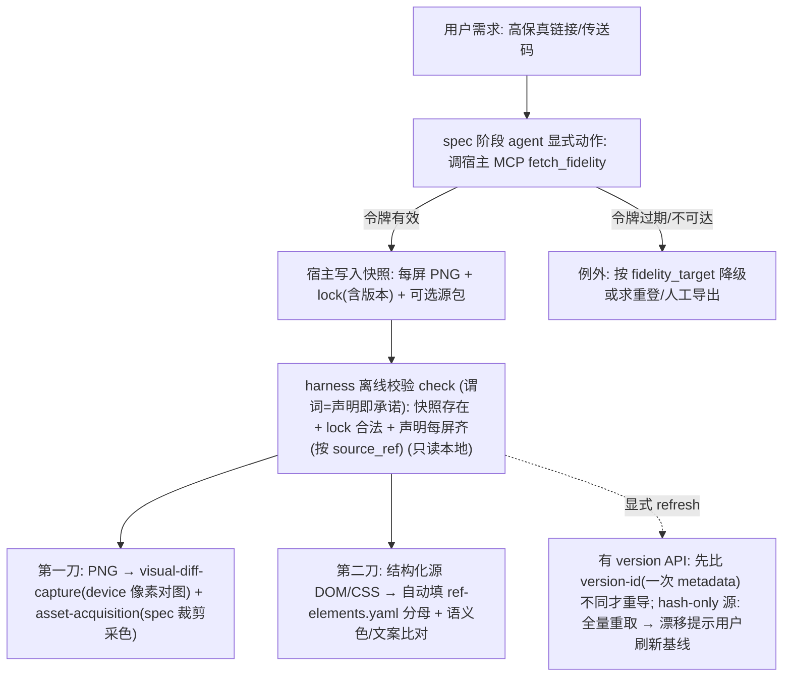

# 在线高保真对照能力（framework-only，窗口 2.4.0，不 bump 版本）

> 版本绑定 `version: 2.4.0`（与 `package.json.version` 一致，遵循版本演进规则，不改版本号）。改动均属发布内容（`harness/` `specs/` `profiles/` `skills/`），完成后 `cd harness && npm test` 必须全 PASS（AGENTS.md BLOCKER）。

## 一、问题与定位

当前所有视觉对齐都依赖「本机已存在的截图/可达路径」：[profiles/hmos-app/harness/authoritative-ref-images.ts](profiles/hmos-app/harness/authoritative-ref-images.ts) 只索引本机可达的 png/jpg/webp，URL 类 handoff（`design_tool_link`/`portal_only` 等）只在 [skills/feature/spec/reference/visual-handoff.md](skills/feature/spec/reference/visual-handoff.md) 约定里校验格式、从不抓取。真实工程的高保真是**在线、需内网鉴权**的源，开源 maison 无法内置鉴权。

定位：maison 提供「高保真对照能力 + 获取契约 + 快照落盘格式 + 离线消费/校验/降级/刷新」；宿主通过 **MCP** 提供「内网鉴权 + 导出」。

### 1.1 与「视觉保真结构化加固」的关系（地基复用，非冲突）

[视觉保真结构化加固](.cursor/plans/视觉保真结构化加固_f4aaf66d.plan.md) 已落地的本地改动是本 plan 的**地基**，本 plan **复用而非重写**：

- `**source_ref ↔ authoritative_refs[].id ↔ png` 联结**：[authoritative-ref-images.ts](profiles/hmos-app/harness/authoritative-ref-images.ts) 的 `buildAuthoritativeRefImageIndex` 用 `authoritative_refs[].id` 建 `byId`；ui-spec 的 screen/token/asset 经 `source_ref` → `resolveRefSourceImage` → png。**真消费 `byId` 的只有两件**（grep 实证）：[visual-diff-capture.ts](profiles/hmos-app/harness/visual-diff-capture.ts)（device-testing 像素对图）+ [asset-acquisition.ts](profiles/hmos-app/harness/asset-acquisition.ts)（spec 素材裁剪/采色）；`static-fidelity` 与 `capture-completeness` **不读 PNG**（前者静态 token/色彩分析，后者分母=ref-elements.yaml 比 ui-spec 节点 id）。
- `**fidelity_target` / ratchet / `RefElementsDoc`**：[fidelity-shared.ts](harness/scripts/utils/fidelity-shared.ts) 已有 `parseFidelityTargetFromHandoffDoc` / `fidelityRatchetFailOrWarn` / `isPixel1to1` / `resolveFidelityContextFromFeature`（注入 `CheckContext.fidelityTarget`）/ `RefElementsDoc`+`loadRefElementsFile`+`refElementsAbsPath`。本 plan 的降级与第二刀**直接复用这些**，不另造。
- **唯一接入点小改**：PNG 进索引需在 `authoritative-ref-images.ts` 加一条「读 `_fidelity-cache/lock` → 合成 byId 条目」分支（见 §4.3）；下游零改动。

## 二、获取模型：A 案（agent 调宿主 MCP）—— 关键架构决策

- **鉴权可缓存**：抓取本身非交互——首登只是宿主侧一次性预热（SSO 会话/令牌缓存在宿主环境里，**maison 不碰**）。因此 halt 从「常态」降为「例外」：只有缓存令牌过期才 halt 求重登，headless goal-runner 在令牌有效期内能全自动跑完。
- **A 案（采纳）agent 调宿主 MCP**：宿主 MCP server 持令牌、暴露 `fetch_fidelity(...) → PNG + lock`（**完整权威签名含 `screens[]`，见 §4.1**）；agent 在 **spec 阶段作为显式动作**调用。maison core 零改动，抓取留在 check 之前，**check 仍只读本地文件、离线确定**。
- **B 案（不采纳）harness 调宿主 CLI provider**：要走 capability 派发 → 必须修「派发缺口」（含 metadata 契约重构），坏处是把网络抓取塞进本应确定性的 check 派发路径，破坏「check 离线确定」的心智模型。
- 一句话：鉴权可缓存让 B 案技术上也可行，但**确定性契约 + 派发改造的爆炸半径**让我们推荐 A 案 MCP。

> 「插槽」由此从 capability-provider 收敛为 **MCP 工具契约 + 快照/lock 格式规范**——更贴合「skill 或 mcp」的原始设想。

## 三、核心架构（两刀切）




职责边界：

- **maison core（`harness/` `specs/` `skills/`）**：MCP 契约文档、快照/lock 格式、离线校验 check、降级/刷新逻辑。
- **profile（hmos-app）**：让既有视觉检查消费快照 PNG（零改动吃进）；第二刀结构化对比层。
- **宿主（MCP，不进 maison）**：持令牌鉴权 + 导出 PNG/源包 + 写 lock。maison 只发契约 + 本地假宿主 demo stub。

## 四、第一刀（核心，复用既有 100% 机器）

### 4.1 宿主 MCP 契约 `fetch_fidelity`（source-agnostic，must-fix①）

- **薄签名撑不起多屏 + id 联键，这是「零改动吃进」的命门**：[authoritative-ref-images.ts:43](profiles/hmos-app/harness/authoritative-ref-images.ts) 全靠 `byId.get(source_ref)` 联结，lock 里每屏 id **必须等于** ui-spec 用的 `source_ref`，否则全落 `firstReachable`/null、零改动消费直接散架。
- 契约改为带 `screens[]` 并**分开两个命名空间**：

```
fetch_fidelity(source_link, feature, out_dir, screens[])
  screens[i] = { id, node_ref?, state? }   # id  = maison 逻辑命名空间(= ui-spec source_ref，由 agent 赋)
                                            # node_ref = 上游帧选择器(Figma node / 门户屏 key，宿主命名空间)
  → out_dir/<id>.<state>.png + lock 记 id→png
```

- **id 所有权落在 agent/ui-spec**：lock 每屏 `id` **必须等于 `authoritative_refs[].id`**（即 ui-spec 的 screen/token/asset `source_ref` 指向的那个 id），否则 `byId.get(source_ref)` 落空。`node_ref` 是宿主侧上游选择器；两者分开，下游 byId 联结才有保证。`state` 省略时落 `<id>.png`（默认态）。`node_ref` 如何获得（用户给 / MCP 列帧）是 spec SKILL 的实现细节，不进契约。
- **保持源无关**：Figma 作参考实现，内部门户/Figma 兼容工具同样适用；契约只约定「产出 PNG + 合法 lock」，不约定上游是什么。渲染由宿主在导出时完成（maison **不内置 headless 浏览器**）。

### 4.2 落盘格式 `fidelity.lock.yaml`

- 快照目录：`doc/features/<feature>/ux-reference/_fidelity-cache/`（沿用 ux-reference 约定）。
- `lock` 字段：`schema_version` + 每屏 `id 联键 (id = ui-spec source_ref → png + state)` + `**version_id` 或 `content_hash` 兜底**（无版本 API 的源用 hash）+ `viewport`/`DPR` + 可选源包相对路径。**lock 不嵌令牌**（横切安全项）。
- visual_handoff 增 `source_link`/`delivery_code` + 指向 `_fidelity-cache/` 的 snapshot 引用；解析复用 [harness/scripts/utils/ui-spec-shared.ts](harness/scripts/utils/ui-spec-shared.ts) 的 `parseVisualHandoffYamlRoot`。落 [specs/](specs/) 新 schema + [skills/feature/spec/reference/visual-handoff.md](skills/feature/spec/reference/visual-handoff.md)。
- `**delivery_code` 安全（tighten）**：传送码在某些门户本身=访问凭证，而 visual_handoff 写在 `spec.md` 且常被 commit/共享。契约须二选一：**要么声明 `delivery_code` 必须是非密标识、要么同令牌对待（不落可提交文档，改用 `${env:...}` / 仅本机）**。

### 4.3 快照每屏物化 → 现有机器吃进（方案 a：接入点小改，下游零改动）

**已定方案 a**：id→png 的 SSOT 在机器生成的 `lock`，spec.md 只写 `source_link`/`delivery_code`/`snapshot` 意图（不放置 N 条逐屏 png 路径）。否决方案 b（spec.md 写回 authoritative_refs：双 SSOT/漂移、spec.md 噪声与 refresh churn、且部分快照查全仍离不开 lock）。

- **接入点（唯一需改）**：[authoritative-ref-images.ts](profiles/hmos-app/harness/authoritative-ref-images.ts) 的 `buildAuthoritativeRefImageIndex` 增一条分支——读 `_fidelity-cache/fidelity.lock.yaml` 把每屏 `id→png(绝对路径)` 合进 `byId`（与现有从 yaml `authoritative_refs[].path` 建索引同语义），并参与 `firstReachable`。
  - **no-op 兜底**：lock 不存在/不可达 → 该分支完全无副作用返回，保现有单测（`authoritative_ref_source_ref_routing` 等）与无 fidelity 快照的工程 0 影响。
  - **合并优先级**：同一 `id` 既在 spec.md yaml `authoritative_refs` 又在 lock → **lock（在线高保真快照）胜**，并出 WARN 提示来源冲突（便于发现误配）。
- **真消费者只有两件（grep 实证，零改动吃进）**：[visual-diff-capture.ts](profiles/hmos-app/harness/visual-diff-capture.ts):309/337（device-testing 像素对图，`resolveRefSourceImage(refIndex, refId)`）+ [asset-acquisition.ts](profiles/hmos-app/harness/asset-acquisition.ts):52/91/113（spec 阶段从参考图裁剪素材 / 采色喂 token）。两者走 `byId`，PNG 进索引后自动吃进。
- **不吃 PNG、不在此受益**（勿误列）：[capture-completeness-check.ts](profiles/hmos-app/harness/capture-completeness-check.ts) 分母=`ref-elements.yaml`、比对 ui-spec 节点 id，全程不读 PNG（只能靠**第二刀**结构化→ref-elements 受益）；[static-fidelity-score.ts](profiles/hmos-app/harness/static-fidelity-score.ts) 是静态 token/色彩数学（`deltaE2000`/`hexToLab`），未 import authoritative-ref-images。
- 报告输出溯源段（源链接 + 版本 + hash + 抓取时间），复用 merged-report 的 Resolved Visual Sources 思路。

### 4.4 谓词驱动的离线校验 check（must-fix②：存在性 + 严重度同源，合并旧 4.4/4.5）

A 案把「抓取（agent/MCP，联网）」与「校验（harness，离线）」拆开。为防 agent 跳过抓取又不留两个对 missing 各执一词的检查，**4.4/4.5 合并为一个谓词驱动的纯离线 check**：

- **触发谓词（复用 [visual-handoff.md:55](skills/feature/spec/reference/visual-handoff.md) 的「声明即承诺」）**：
  - `visual_handoff` 含 `source_link` 且 `ui_change ∈ {new_or_changed, copy_edits_only}` → **承诺**：进入校验。
  - 未声明 `source_link` → **静默**（沿用现有 `ui_change` 零噪声惯例，云侧/无 UI 零干扰）。
- **校验内容（只读本地 `lock`/文件、不联网，不破坏确定性）**：
  1. 快照存在 + `lock` 格式合法；
  2. **声明的每屏都齐（tighten：部分快照）**——以 ui-spec 的 `source_ref` 为分母，逐屏校验有对应 `id→png`，破「5 屏导出成功 3 屏、静默漏掉其余」；按屏可达性沿用现有 ref 降级，但**「按声明屏算齐不齐」须写明**；
  3. （可选）版本与声明一致。
- **缺/不齐的处置（复用既有 ratchet，不另造）**：按 `fidelity_target` 用 [fidelity-shared.ts](harness/scripts/utils/fidelity-shared.ts) 的 `fidelityRatchetFailOrWarn` / `isPixel1to1`（`pixel_1to1`→BLOCKER/FAIL、`semantic_layout`→WARN）；`CheckContext.fidelityTarget` 由 `resolveFidelityContextFromFeature` 注入。给明确「重登宿主 MCP / 人工导出到 `_fidelity-cache/`」指引；headless/goal 态按既有用户确认 UX 自动降级 + 留痕 must-review（**非绑定 goal 模式**，交互态直接问人）。
- 移出「派发缺口修复」≠ 移出校验：校验照做，只是不经 capability 派发、不联网。

### 4.5 refresh（廉价漂移检测）

- **有版本 API 的源**：先比 `version_id`（一次 metadata 请求），不同才全量重导——成本可忽略。
- **hash-only 兜底源（tighten）**：无版本 API，`content_hash` 必须**先下载才能算**，故 refresh = **全量重取**才能知道有没有漂移；文档须写明「廉价漂移检测依赖 version API，hash-only 源的 refresh 是全量重取」。
- 漂移检出后**暂停提示用户**「高保真已更新，是否刷新基线」，把漂移变成知情决策而非静默。

## 五、第二刀（差异化，结构化对比层）

> 撤回早前「整体推后」的保守判断：结构化层不是投机，而是 pixel-diff 拿不到的差异化价值，且与「捕获完整性」强协同。但顺序仍在第一刀之后。

- **直击最弱环（捕获 ~0.4）**：[视觉保真结构化加固](.cursor/plans/视觉保真结构化加固_f4aaf66d.plan.md) P0-2 的命门是 `capture-completeness` 的分母必须来自参考图侧独立枚举，现状靠 VL「分区扫描」肉眼数元素填 `spec/ref-elements.yaml`（不可靠、非 100%）。结构化源能**程序化推导元素清单（文案/颜色值/枚举）**直接喂 `ref-elements.yaml` 当参考侧分母，绕开「ui-spec 当自己分母」的数学盲区，降低对 VL 的依赖。
- **抓语义色错绑**：结构里有 token/颜色值，能抓「成功√该绿用了蓝」这类 pixel-diff 被白底稀释掉的错绑。
- **诚实边界**：结构化 node 树 ≠ 干净语义元素清单（大量嵌套 frame/group），程序化推导仍需归一化夯实，比 VL 强但不是免费的 1.0；源不支持结构化导出时**优雅退回现有 VL 分区扫描行为**。
- **硬约束：element_id 必须归一化到 ui-spec 语义 id 命名空间（否则 capture-completeness 失伪）**：[capture-completeness-check.ts:28-42](profiles/hmos-app/harness/capture-completeness-check.ts) 的 `uiSpecCoversElement` 按 id 大小写不敏感匹配 ui-spec 节点；若结构化直接吐 Figma 图层名（`Frame 1207`）而 ui-spec 用语义 id（`search_bar`）→ 全不匹配→覆盖率 0%→**假 BLOCKER**。这是第一刀 id 联结问题在元素粒度的复现，是第二刀**最难、不可一笔带过**的一步：结构化派生的 `element_id` 必须落进 ui-spec 语义 id 命名空间（建立 figma-node→语义 id 的映射/归一化层，无法归一的标 provenance=structured 但不计入分母或显式标注待人工归并）。
- **ref-elements.yaml 双写定优先级（tighten：结构化层 vs 前序 P0-2 的 VL 分区扫描都会写它）**：**结构化派生为基线**，逐元素标 `provenance`（`structured` / `vl`），**VL 只增补不覆盖**——既拿结构化的准确分母，又保住「人工枚举」的审计痕迹与可追溯性。
- **复用既有结构（兼容扩展）**：`provenance` 作为 [fidelity-shared.ts](harness/scripts/utils/fidelity-shared.ts) `RefElementEntry` 的**新可选字段**（现无此字段，向后兼容）；读写复用 `RefElementsDoc` / `loadRefElementsFile` / `refElementsAbsPath`，不另起格式。
- 落点：profile 侧新脚本，喂 [capture-completeness-check.ts](profiles/hmos-app/harness/capture-completeness-check.ts)；jimp/解析不可用时 SKIP。

## 六、横切项（维持上一轮意见不变）

- **安全/不入库**：快照 `docs_committed=false` + `.gitignore`，内网敏感资产不入主仓。
- **viewport-DPR 对齐**：lock 记 viewport/DPR，与实现截图/真机分辨率对齐，避免缩放伪差异。
- **本地假宿主 demo stub**：maison 内提供一个本地 stub MCP/脚本，模拟 `fetch_fidelity` 写假快照，供 fixture/演示，**不含真实内网鉴权**。
- **lock 不嵌令牌**；`**delivery_code` 安全**：传送码在某些门户=访问凭证，而 visual_handoff 在 `spec.md` 常被 commit→要么声明 `delivery_code` 必须是非密标识、要么同令牌对待（不落可提交文档，改 `${env:...}`）。
- **定位复用既有 `external_roots` 解析**（[harness/scripts/utils/visual-source-resolver.ts](harness/scripts/utils/visual-source-resolver.ts)）。

## 七、阶段范围（按真消费者校正，勿写「spec/coding/device 全亮」）

按 grep 实证的真消费者，逐阶段精确化：

- **device-testing**：**唯一直接吃快照 PNG 做像素对图**的阶段（`visual-diff-capture` → `byId`）。
- **spec**：不是像素对图，而是 (1) `asset-acquisition` 从快照裁剪素材 / 采色喂 token（吃 PNG）；(2) **第二刀**结构化派生喂 `ref-elements.yaml` 分母。
- **coding**：`static-fidelity` **不直接吃快照 PNG**，吃的是 token 值（其值可能在 spec 阶段由 asset-acquisition 采样自快照）+ ref-elements 做静态 token/色彩/结构校验——**间接受益**。
- **plan**：消费快照清单做覆盖规划（`plan.visual_parity` / [plan-visual-parity-check.ts](profiles/hmos-app/harness/plan-visual-parity-check.ts)），不联网不对图。
- **review**：fidelity 治理签字（ratchet / deferrals human_signed），不对图。
- **ut**：无视觉面，不接入。
- **结论**：直接像素对图只在 device-testing；spec/coding 的「受益」是裁剪采色 + ref-elements + 间接 token 校验，**不要表述为像素对图**；且不得在「移出」时砍掉 plan/review 对 lock/快照的既有消费。

### 7.1 范围决策（已定：本 plan 不做，登记为 future task）

**决策**：coding 的 `static-fidelity` **直接**采样快照 PNG 做色彩对比 —— **本 plan 不做**。coding 走间接受益（吃 spec 阶段 asset-acquisition 采样出的 token 值 + ref-elements 做静态校验），第一刀保持轻。

**Future task（登记占位，明确边界，非本 plan scope）**：

- 标题：`static-fidelity 直接采样快照 PNG 色彩对比`。
- 内容：给 [static-fidelity-score.ts](profiles/hmos-app/harness/static-fidelity-score.ts) 新增「按 ui-spec 节点 bbox 采样快照 PNG 实际像素色 → 与代码 `$r('app.color.*')` 解析色 ΔE 对比」能力（复用 `image-toolkit` 的 `deltaE2000`/`hexToLab` + `byId` 取快照图）。
- 性质：**非零改动**（static-fidelity 从「静态 token vs color.json」升级为「采样真图 vs 代码色」），独立立项，不混入本 plan「复用既有 100% 机器」的第一刀。
- 触发：当「token 值已采样仍漏掉错绑、需直接对真图兜底」被实测证明有 ROI 时再启动。

## 八、移出本 plan（独立处理）

- **capability-registry 派发缺口修复**（让 extension provider 绝对路径可派发）：A 案用不到；仅当要把「extension capability」做成**通用扩展机制**（不止本需求）时才值得单独做——那是独立卫生 PR，不进本 plan 关键路径。
- **review/ut 不新增像素对图**（像素对图只在 device-testing，见 §7），本 plan 不为 review/ut 增加像素对图。

## 九、出口：测试 + 文档 + 预期边界

- 为第一刀（lock 格式/离线校验/降级/refresh）与第二刀（结构化分母）补 harness 单测与 fixture（用本地假宿主 stub 造快照），注册 [harness/tests/run-unit.ts](harness/tests/run-unit.ts)（执行前确认 fixture 目录约定）；`cd harness && npm test` 全 PASS（BLOCKER）。
- 更新 spec/plan/coding/code-review/device-testing 各 SKILL：在线高保真→MCP 抓取→快照→离线对照流程，与 A/B/C 预期边界（A 结构样式可逼近 1:1；B 美术资产取决于源完整度；C 动态交互不在静态参考承诺内）。
- 产出宿主 MCP `fetch_fidelity` 契约文档 + 本地假宿主 demo stub（不含真实内网鉴权）。
- 不动 `package.json.version`（保持 2.4.0），不新建发布说明。

## 十、明确不做

- 不在 maison 内置 headless 浏览器/渲染器（渲染由宿主导出时完成）。
- 不在 maison 实现任何具体公司内网鉴权（只发 MCP 契约 + demo stub）。
- 不把网络抓取塞进 harness check 派发路径（保住 check 离线确定）。
- 不引入 AI 生成缺失高保真资产。
- 不改 simulatedWallet 业务代码（framework-only）。

