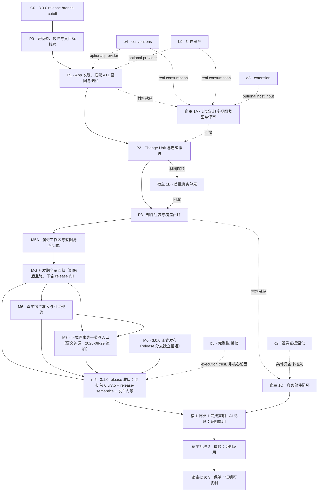

# 复杂能力建设 3.1：单部件复杂需求闭环首期总计划

## 1. 计划定位

本 plan 是 3.1.0 的**版本级统筹蓝本**，不是把总纲全文重新抄成一次性任务，也不是三个真实
需求的施工计划。它只冻结四件事：

1. 首期到底做到哪一层；
2. 四个核心子 plan 的边界和依赖；
3. 哪些既有 provider 进入关键路径，哪些不得阻塞；
4. framework 机械验收与真实宿主语义验收如何分批完成。

四个核心子 plan 承载具体设计与实施；本 plan 的 todo 只在对应里程碑通过后更新，不代替
OpenSpec tasks、Feature events、phase evidence 或真实宿主完成事实。

## 2. 首期结论

### 2.1 当前要完成的里程碑

首期目标是：

> **Maison 能够面对一项 App 单部件的正式需求，从真实当前态、原始需求和人工提供的已知外部
> 约束，以适配 4+1 形成供 SE、开发、测试共同评审、跨视图一致并主动暴露输入缺口的部件演进
> 蓝图；再分解并连续完成一个或多个 Change Unit，最后证明这些单元按共同设计组装成了完整
> 部件能力。单次 spec/plan 无法安全承载的大型需求是这条链的完整形态：多个有依赖的 Change
> Unit、共享部件级决策与组合验证义务同时出现。**

对应目标域：G1、G3、G4、G5、G6、G7，并为 G8 建立真实宿主入口和回灌机制。

> **入口语义（2026-08-29 M7 追加，§6.6）**：蓝图是**正式需求必经的部件内设计阶段**，不是
> "复杂多 CU 才启用的可选路线"；只有一种蓝图协议，内容深度由真实影响面派生。上文"大型需求"
> 描述的是完整形态，不是入口条件。

### 2.2 跨部件信息本期如何处理

- 云侧、账号、跨设备同步、外部接口和端到端责任本期都可以真实存在；
- SE 人工提供当前 App 所需的部件职责、外部契约、全局不变量和端到端验收分工；
- Maison 只消费这些输入，不重新裁决其它部件的架构；
- 本期不建设 G2 的能力架构蓝图自动生成、跨部件调度或自动交接；
- 没有跨部件问题时，单部件大型需求直接从原始需求和当前事实进入 App 部件蓝图。

### 2.3 这不是总纲终局

3.1.0 即使全部完成，也只证明“单 App 部件正式需求核心机制”成立（含 M7 的统一入口与接缝契约），
不宣称长期总纲完成，也不宣称真实宿主已采用。以下能力留待后续真实需求驱动：

- G2 跨部件蓝图正式交接；
- Service 设计透镜与 Service 宿主验证；
- 跨 App/Service 的 Capability E2E closure；
- 多 Change Unit 实际并行施工；
- 常驻调度、跨仓状态或通用图执行器。

## 3. 当前基线与真实缺口

Maison 已有可靠的单 Feature 流水线：

```text
spec → plan → coding → review → UT → testing → completion
```

当前缺失的是这条流水线外侧的四层连接：

1. 没有以适配 4+1 承载一次复杂建设共同目标态、运行行为、实现结构、运行拓扑和关键场景的
   App 部件演进蓝图，也没有跨视图一致性门；
2. 没有可检查的 Change Unit 契约、严格前置和 ready set；
3. 没有复用现有 Goal Mode 的跨单元薄推进循环；
4. 没有证明多个绿灯已正确组装的 Component closure。

现有 e4、b9、c2、b8、d8 分别是知识、资产、验证、执行可信或宿主输入 provider，不能替代
上述核心链路。

## 4. 总体依赖与推进节奏



执行纪律：

- P0→P1→P2→P3 的**消费契约顺序**不能颠倒；
- 子 plan/OpenSpec 评审可以提前交错，但后层实现不得猜测前层尚未冻结的协议；
- provider 可以并行建设，但“可并行”不等于安排多个 writer 同时修改相同框架表面；
- 真实宿主按**分层准入**交错进入：蓝图类活动依赖 P1 就绪、单元施工依赖 P2 就绪、部件闭环
  依赖 P3 就绪——对应机制层未就绪不得拿真实宿主硬跑；材料早到即验证已完成的那一层，不再
  只限于"校准设计"；完整宣称宿主批次 1"证明能用"，仍需真实多单元施工与部件闭环完成；
- 真实宿主材料晚到不阻塞 framework 建设，也不允许用独立演示 App 冒充语义验收；
- 两层接缝分开控制范围（总纲 §11.2/§11.3）：**Maison 自身零插件运行时**——不加 loader、
  注册表、插件包、动态发现或运行状态，现有 P0–P3 实现视为静态内置 provider；**宿主演进
  接缝是 P1–P3 既有交付物的内容扩展**——蓝图产出变化轴裁决、CU 纵切落地接缝、闭环机械
  验证替换/禁用/绕过，属首期真实范围，不按"零增量"豁免。

## 5. 版本与批次策略

### 5.1 3.0.0：只做基线收口

- `Br_release_3.0.0` 从提交 `90a4df90` 接管 3.0.0 的开放项、OpenSpec 收口、宿主回归、
  发布说明、打包与 tag；main 不复制或伪造其完成状态；
- 该隔离 cutoff 形成 3.1.0 **开发基线**；release 分支 `npm run release:all` 成功形成
  3.1.0 **正式发布顺序前置**，两者不得混写为同一状态；
- 3.0.0 后续通用修复以 `cherry-pick -x` 逐提交前向传播，禁止整体 merge release branch；
- 不把本计划的核心生产逻辑回填到 3.0.0；
- 各开放项的完成、取消或顺延事实由原 plan/OpenSpec 承载，本计划不复制其状态——M0 的唯一
  完成事实是 `release:all` 成功；
- "待宿主实测"类开放项逐项裁决，不搞一刀切：影响 3.0.0 发布声明的，发布前必须实测；只剩
  校准或后续观察的，显式顺延并相应收窄发布声明；取消或移交的，由原 plan owner 留下理由；
- 已顺延到 3.1.x 的宿主实测项，仅当验收契约与宿主批次 1 一致时可复用其证据关闭——条件性
  复用，不得反向把 H1 变成 3.0.0 收口的依赖（避免"3.0 发布→P0–P3→H1"循环）。

### 5.2 3.1.0：交付 framework 最小机械闭环

3.1.0 必须交付 P0–P3、M5A、M6 与 M7（正式需求统一入口与宿主接缝契约），以及真实宿主准入/
回灌契约。它证明：

- 适配 4+1 视图协议、稳定节点寻址、跨视图一致性、关系派生、门禁接线与兼容行为可靠；
- 正常、失败、阻塞、恢复和调和路径可机械回归；
- 现有 Goal Mode 可以被薄循环连续调用；
- 部件闭环能够发现故意制造的覆盖空洞；
- 正式需求统一入口成立：单 CU 与多 CU 共用同一蓝图协议，`applicability` 与 `evolution_impact`
  两维正交且消费面同步接线，三条宿主接缝的方向、权威、缺失与冲突行为可机械验证（M7）。

真实材料到位时，按 §4 分层准入随各机制层就绪逐级进入 AI 记账宿主验证；材料未到位时，
3.1.0 照常发布，但必须明确标记“真实宿主语义尚待验证”，不得把 fixture 结果宣传成 G8 完成。

### 5.3 宿主反馈窗口：由材料和改动风险决定

- AI 记账宿主发现的小修复，可进入 3.1.x；
- 若暴露 schema、权威边界或核心流程重构，则进入下一 minor；
- 不在本 plan 中预先写死版本号，也不为了守原排期把重大反馈伪装成 patch；
- Android 3.2.0 与本目标保持独立，不自动纳入复杂能力关键路径。

## 6. 四个核心子 plan

## 6.1 P0：元模型、边界与父目标校验

**推进**：G1 + G8 governance 入口。

**必须交付**：

- 部件演进蓝图、Change Unit、Component closure 的最小对象边界和引用关系；
- 单部件大型需求直入，以及跨部件场景仅引用人工/上游投影的条件式入口；
- 原始需求、当前事实、目标设计、运行事实和证据各自的权威边界；
- 稳定内核与 provider 接缝语义（总纲 §11.2 的 change 化）：核心/provider 边界、Seam Card
  模板、required/optional 缺失行为、权威冲突 fail-closed、退出四类行为、provider 不得修改
  完成事实、三命名空间分离；
- 兼容读取、非法输入和 unknown/open decision 的失败语义；
- `parent_goal`、`advances`、`relation`、`layer`、`goal_requires`、`goal_provides`、
  `real_host_validation`、`parallel_authority_added` 的声明校验；
- 声明语义澄清：`advances` 是非累加的追溯标签，不表示完成度或工作量；统筹 plan 与子 plan
  同时指向同一目标域不构成重复进度，Gx 是否完成由子 plan 状态、OpenSpec 验收和真实宿主
  证据共同证明；`relation/layer` 区分统筹、实现与 provider 贡献；`goal_requires/goal_provides`
  首期只做格式与边界校验，不建全局注册表、不生成依赖图、不参与自动调度；
- 只对声明了 `parent_goal` 的 plan 校验，未声明者保持零行为变化。

**禁止长出**：

- 万能总图 schema；
- 跨单元运行状态；
- 可手改的完成台账；
- 能力蓝图、部件蓝图、Feature plan 和 events 的合并文件；
- plugin loader、注册表、插件包分发、动态发现或任何运行时插件状态。

**完成判据**：

- OpenSpec strict validate 通过；
- 合法/非法/兼容 fixture 全覆盖；
- 父目标不存在、目标 id 非法、枚举非法、字段缺失时有明确诊断；
- 现有未声明父目标的 plan 不新增告警。

## 6.2 P1：App 部件发现、适配 4+1 蓝图与调和

**推进**：G3 + G4。

**输入**：

- 产品提供的原始需求、原型和适用时的高保真；
- 已存在时，feature spec 中已经澄清的用户可见数据语义、业务规则、场景、异常与 NFR；
- SE 人工提供的部件职责、外部契约、全局不变量与端到端验收分工；
- 代码、schema、接口、配置、测试、architecture、catalog、code-graph、conventions 和组件资产；
- 明确的范围、非目标、风险与未知项。

**必须交付**：

- 公共发现内核：来源、证据强度、冲突与 unknown 的统一纪律；
- 适配 4+1 视图协议：区分可复用 viewpoint contract 与具体蓝图 view，同一蓝图内使用稳定
  `logical/runtime/development/deployment/scenarios` 视图 id；logical、development 与 scenarios
  必需，可执行 App 的 runtime 必需，deployment 按平台/运行拓扑条件裁决。每个适用视图区分
  关注者/用途、当前态证据、目标态、演进 delta、决定/缺口和验证义务；不生成五份独立文档，
  不要求无价值的图；
- App 透镜：向各适用视图填充数据/契约、状态与控制、模块/依赖、平台运行节点和关键场景，
  **并含模块边界、能力接缝、特性开关，以及数据生产者/消费者、生命周期触发、状态 owner、
  初始化、发布订阅、UI 刷新和进程恢复等强制根问题**（宿主 App 是否采用插件式模块架构是蓝图
  待裁决问题，不预设答案）；
- 一份供 SE、开发、测试共同评审的蓝图，固定包含三组同源内容：**评审摘要**（范围、当前态/
  目标态、关键流程、主要决策、风险、待决项和 CU 地图）、**设计视图**（适配 4+1 及 cross-view
  信息，覆盖领域/数据/契约、运行时、实现结构、条件式运行拓扑和关键场景）、**决策与缺口**（证据
  事实、已裁决设计、外部输入缺口、不适用项及来源/owner/解除条件）；它们是同一蓝图的内容或
  派生视图，不新增第四类对象或平行设计真源；
- 跨视图关系与完整性门：关键 scenario 步骤能追到 logical 元素、runtime 交互、development
  owner 和适用时 deployment 节点；运行边引用 logical 契约与实现 owner；模块和运行节点有设计
  依据；术语、契约、状态 owner 和失败语义无冲突；
- 运行时数据闭环（总纲 §6.6，满足触发条件时为蓝图固定设计节点）：从 PRD/UI 消费面、手动/
  自动/系统/外部生产者、代码中的数据库/Repository/Store/生命周期入口、平台 profile 和外部契约
  推导带稳定 id 的 `runtime_data_flows`，至少表达数据真源、trigger、initial load、state owner、
  mutation、publication/invalidation、subscription、consumer、failure/recovery、provenance 和
  verification refs；构建时必须“consumer 反向追来源 + producer 正向追影响 + lifecycle 矩阵
  交叉检查”，未闭合边进入 frontier，不得由模型常识补齐；
- P1 OpenSpec 必须同时锁定 viewpoint contract/view instance 的边界、视图适用性、公共视图契约、
  稳定节点寻址、跨视图一致性，以及运行时流的触发条件、语义最小形状和完整性不变量；独立
  质询 provider 逐视图、逐关系，再逐边检查“消费者→首次加载/更新”“写入→传播→受影响
  消费者”“订阅→初始快照/清理”“后台写入→
  持久化/恢复”等断链，不能以标题存在或 Mermaid 可渲染代替完整性；
- 当前态、目标态、关键决策、复用/演进/新建裁决、迁移和风险；
- 蓝图评审与调和协议：新事实先改蓝图认知和后续工作，不篡改已完成事实；
- 稳定结果的归位规则；蓝图不得与 architecture/catalog/spec/ADR 竞争当前态真值；
- 接缝边界（总纲 §11.2）：本层至少形成四个静态内置 provider——当前事实发现、SE 人工契约
  输入、App 设计透镜、独立设计质询；输出统一落 **provider-neutral 的蓝图协议**，更换透镜、
  输入来源或质询实现不破坏 P2 的消费，3.1.0 不建设动态插件加载；
- 证据驱动质询（总纲 §6.5）：借鉴 `grill-me` 的逐层追问，但把对话内化为“蓝图编写者 ↔ 独立
  质询 provider”的内部循环；首期由独立 subagent 或等价隔离上下文检查蓝图草稿和证据包，以
  每个适用视图、跨视图一致性和 App lens 必答题为强制根问题并按 frontier 展开需求特有分支，
  不能由编写者同一上下文自证；
  质询问题先由蓝图编写方携证据回答，当前事实由 Agent 查证，不把仓库可回答的问题甩给用户；
  产品语义、外部契约、风险接受或不可逆取舍等真实权责问题，按 frontier 成包给出推荐答案、
  依据和影响后再请求有权者裁决；
- 问题 disposition 只允许 `answered_with_evidence`、`decided_with_authority`、
  `open_decision`/`blocker`、`not_applicable` 四类语义；质询过程报告不是新 SSOT，稳定结论只回写
  蓝图及既有 ADR/契约真源；
- P1 OpenSpec 必须规范化 `unknown` 与 disposition 的映射：`unknown` 是内容级认知标记而非第五种
  disposition；证据不足的内容继续标 unknown，并按当前准入门落 `open_decision`（可延期）或
  `blocker`（阻断）；`decided_with_authority`/`not_applicable` 均不得用于掩盖未知事实；
- 分层准入：蓝图送评审前所有强制根问题已有合法 disposition、无静默假设，待人裁决项已成包；
  当前 CU 施工前，其设计切片和关键外部输入已裁决；远期 CU 可以保留带 owner/needed-by 的
  open decision，部件完成声明前再全部闭合或由有权者接受；
- 外部契约反馈：已有 SE/权威契约时只引用并校验；缺失时输出消费方需要的 operation、数据语义、
  错误/幂等/NFR、owner、needed-by 和阻塞门槛，明确标作需求/提案而非已冻结 request/response，
  不由 Maison 替云侧或其它部件作最终裁决；
- 变化轴与演进接缝决策（总纲 §11.3，蓝图固定组成部分）：发现候选变化轴、耦合热点与外部
  不稳定边界，**实质候选**（有可追溯变化证据且有实质影响）逐个产出决策卡——建缝或保持
  直接实现（附再提取条件），普通实现差异不逐项登记；AI 提候选，人裁决，不预设答案。

**完成判据**：

- 从 fixture 当前事实和需求生成一份可供 SE、开发、测试评审、且具备评审摘要/设计视图/决策与
  缺口的 App 蓝图；
- 正常 fixture 形成 logical/runtime/development/scenarios 和适用的 deployment 视图，每个节点
  能区分当前态、目标态与演进 delta；单运行环境 fixture 可在检查进程、持久化和外部边界后对
  deployment 作有证据的裁决，但不得仅以“单部件”为由跳过；
- 跨视图正反 fixture 覆盖：正常场景贯穿全部适用视图；分别移除 scenario 的实现 owner、runtime
  边的 logical 契约、development 模块的设计依据、deployment 映射，或制造状态 owner/失败语义
  冲突时，完整性门失败并定位具体视图节点；
- AI 记账型 fixture 能从首页/分析/列表等消费者与手动/自动/外部写入者自动识别运行时闭环触发，
  形成至少一条带稳定 id 的运行时流；全部不触发时才允许有证据的 `not_applicable`；
- fixture 证明双向追踪与 lifecycle 矩阵会发现 consumer 无来源、producer 无消费方、前后台行为
  不一致和两端权威冲突；每条已确认边可追到来源证据，纯推断不得升级为已确认设计；
- 运行时流正反 fixture 覆盖：正常链通过；分别移除首次加载、写入传播、晚订阅快照、后台持久化/
  恢复、订阅清理或状态 owner 时，蓝图完整性门失败并给出具体缺边；空泛的“使用状态管理自动
  刷新”不得通过；
- 文档宣称与代码事实冲突时以事实优先并显式报告；
- 独立设计质询 provider 缺失时，蓝图不得跳过质询直接进入可送评审；质询来源与本轮证据可追溯，
  但不因此新增长期运行状态真源；
- 强制根问题必须全部得到合法 disposition；视图标题、空图、编写方自述、无来源结论和伪造证据
  不得满足事实问题；
- fixture 必须证明 unknown 在问题处置后仍被原样保留：远期且当前门允许延期时为
  `unknown + open_decision`，当前单元依赖它时为 `unknown + blocker`；不得用
  `decided_with_authority` 或 `not_applicable` 洗掉证据缺口；
- 缺少外部契约时能主动发现并形成可追溯消费需求，以 open decision 或 blocker 保留，不由 AI
  补造已批准契约；
- 蓝图可送评审门允许把真实人类决策成包带入评审；当前 CU 设计可施工门会阻止相关未决问题，
  但远期 CU 的有 owner/needed-by 未决项不阻塞当前单元；
- 同一未解决 frontier 重复或轮次/成本预算耗尽时形成结构化 blocker，不静默 PASS，也不为此
  新增跨轮次 ledger、常驻 daemon 或第二恢复权威；
- 新事实可以触发受控调和，已完成结果不被改回 pending；
- e4/b9 存在时能够作为可选输入消费，不存在时核心蓝图仍可诚实工作；
- 变化轴决策：存在实质候选时逐一形成决策卡（建缝，或直接实现并附再提取条件）；不存在
  实质候选时，以可追溯的"无实质候选"结论完成——不得强造决策卡。

## 6.3 P2：Change Unit 与连续推进

**推进**：G5 + G6。

**最小单元契约**至少表达：

- purpose、preconditions；
- requires、provides；
- touches 与所有权；
- preserved invariants；
- target predicates、verification refs；
- safe intermediate state；
- 所属 blueprint 引用；
- `design_refs`：当前单元实际消费的蓝图稳定视图节点、关键场景、决策与外部契约引用，不复制
  蓝图正文；所有视图共用一个引用字段，不新增 per-view refs。

**首版推进机制**：

```text
读取蓝图关系与既有完成事实
  → 校验当前单元的 design_refs 与设计可施工门
  → 派生当前 ready set / blocker
  → 按显式优先级与稳定 tie-break 选择一个单元
  → 调用现有 Goal Mode 完成该单元
  → 读取可信 completion/evidence 刷新当前态
  → 必要时路由蓝图调和
  → 重新派生，直到进入部件闭环或明确阻塞
```

**关系建设纪律**：

- 3.1.0 只实现机械闭环和首个真实宿主必需的最小关系；
- `requires/provides` 和结构化 blocker 足以消费时，不预建六类完整关系注册表；
- write-conflict、migration/order、verification 组合等关系由真实案例证明有消费者后补充；
- ready set 表示“当前可选择”，不等于并发授权；
- 实际选序只进入执行轨迹，不回写成虚假依赖。

**接缝边界（总纲 §11.2）**：稳定部分＝CU 契约、蓝图引用、ready/blocker 派生语义、Goal Mode
消费入口、执行事实与 evidence 权威；可替换部分＝蓝图拆分策略、关系分析器、候选选序策略。
3.1.0 每处只提供一个静态内置实现，不建动态插件机制。

**设计消费纪律（总纲 §6.1/§6.5/§8）**：Change Unit 只有在当前设计切片、相关部件内决定和关键
外部输入达到“设计可施工”门后，才可进入 spec/plan/Goal Mode。当前单元不要求引用全部 4+1
视图，但必须引用它实际改变的 logical/runtime/development/适用时 deployment 节点，以及证明
该 delta 的关键 scenario；跨视图关系随当前 delta 改变时必须一起进入施工切片。Feature spec
继续澄清用户可见语义和业务规则，Feature plan 精确设计当前单元的数据结构、接口、控制/展示
与测试落点；二者不得把部件级数据模型、数据/UI 主链或外部契约语义作为施工时的首次发明。
施工发现缺失或冲突时，路由回 spec、蓝图调和或外部 owner，而不是填入无依据 TBD 后继续。

**运行时流施工投影（总纲 §6.6）**：当前 CU 触及运行时流时，`design_refs` 必须引用对应稳定 id；
现有 `contracts.yaml.state_management` 扩展承载当前切片的初始化、状态 owner、published state、
freshness、subscription/cleanup 和 failure policy，适用时的 `use-cases.yaml` 扩展支持
`user|lifecycle|system|external|schedule` trigger 及状态传播分支。plan.md 提供人读时序和取舍，机器
契约承载施工精确信息；三者不得复制整条部件蓝图。首期只实现 AI 记账真实需要的触发与验证类型，
不建设通用事件图引擎、宿主运行时 EventBus 或新的 Maison 状态权威。

新建或重构共享运行时主链的首个 CU 必须纵向包含权威来源/持久化、状态 owner、发布或失效语义、
至少一个真实 consumer 和可执行验证；后续生产者或消费者各自成为有界 CU，不以“先建空 Store/
EventBus，未来再接”制造不可验证基础单元。

**宿主演进接缝的落地模式（总纲 §11.3）**：一个获批接缝的**首次落地**必须从一个纵切
Change Unit 开始——稳定契约 + 首个真实 Provider + 真实 Consumer + 契约测试同单元；
后续 Provider 可分别成为独立 CU（如手动记账先立最小接缝，自动/闪控球随后各自扩展），
不破坏小批次原则；禁止只建空接口的横向基础单元（§7.1 四条件同判）。

**完成判据**：

- 至少三个存在前置关系的 fixture Change Unit 能连续推进；
- ready set 有多个候选时仍只启动一个；
- 未满足关系与 blocker 能阻断对应资格；
- `design_refs` 缺失、悬空或所引关键设计尚未达到施工门时，当前单元不得进入 Goal Mode；相关
  设计已准入时，Feature plan 能把它精确展开到本单元而不复制整份蓝图；
- fixture 证明同一 `design_refs` 能引用各类稳定视图节点和关键 scenario；遗漏当前 delta 实际
  改变的视图节点、跨视图关系或场景步骤时阻塞，但不要求无关视图凑数；
- 运行时流引用能够投影到 plan/contracts/use-cases，并保持 trigger、initial load、state owner、
  mutation、publication/subscription、consumer 和 recovery 的追溯；缺任一当前相关关键边时阻塞；
- fixture 证明 lifecycle/system/external trigger 可进入现有施工与测试链，状态发布后的 subscriber
  反应不再永久停留在“UT 忽略”的文档占位；具体 UI 渲染仍由 device/visual 证据承担；
- 新运行时主链首个 CU 的 fixture 同时含真实数据 owner、一个真实 consumer 与验证，空 Store/
  EventBus 横向单元不得获得完成资格；
- 远期单元保留有 owner/needed-by 的 open decision 不阻塞当前单元，当前单元相关未决项必须阻塞；
- Goal Mode 失败、暂停、恢复和 completion 仍由既有 events/reducer/receipt 证明；
- 不新增跨单元 ledger、锁、常驻 daemon 或第二恢复目录；
- 获批接缝的首次落地模式可由 fixture 证明：一个纵切单元承载"契约+首个 Provider+真实
  Consumer+契约测试"，后续 Provider 为独立单元。

## 6.4 P3：部件组装与覆盖闭环

**推进**：G7 + G8 的宿主验收准备。

**必须检查**：

- 每个目标谓词、不变量和高风险都有单元 owner 或组合 owner；
- 每项影响目标的蓝图设计决策都有 Change Unit/组合 owner，能经 `design_refs` 追到 plan、
  contracts、实现和适当层级测试；蓝图明确设计但施工未消费、或 CU 绕过共同设计时必须失败；
- 每个影响目标态或本次演进 delta 的 logical、runtime、development、适用时 deployment 节点和
  关键 scenario 步骤都有实现/Change Unit/组合 owner；纯当前态且本次不改变的节点只要求事实
  证据，不为覆盖矩阵强造施工单元；
- 跨视图一致性可重建：runtime 边引用 logical 契约和 development owner，development 模块有设计
  依据，deployment 节点有软件/数据映射，同一术语、契约、状态 owner 和失败语义无冲突；
- 每条适用的运行时数据边——trigger、initial load、state owner、mutation、publication/invalidation、
  subscription、consumer、failure/recovery——都有施工 owner 与对应层级证据；不得因所有 CU 单独
  全绿，就忽略组装后数据未加载、状态未传播、页面未刷新或后台事件丢失；
- requires/provides 闭合，无悬空契约和未完成迁移；
- 单元之间新增的数据、调用、状态和发布边经过真实组装验证；
- 部件可构建、可运行、可恢复，适用 NFR 达标；
- feature flag、兼容层、双写和临时资产有明确去留；
- 失败、跳过、降级和人工验收都有诚实结果与责任方；
- 稳定知识进入既有真源，一次施工细节留在 Feature/Change Unit 产物与 reports。

**接缝边界（总纲 §11.2）**：稳定部分＝Closure 聚合规则与最终裁决；可插拔部分＝UT、契约
测试、视觉、真机、人工验收等验证 provider——某 provider 不存在时按 required/optional
形成 blocker 或诚实降级，不得自动 PASS；最终裁决不由任何单一 provider 自行宣布。

**宿主演进接缝的闭环义务（总纲 §11.3）**：对蓝图裁决建缝的每个变化轴，机械验证四件事——
契约兼容、实现可替换（新增/替换 Provider 时既有 Consumer 不变；契约或 Consumer 必须
变化时触发蓝图调和/契约版本化/迁移裁决，不作替换混入）、缺失/失败行为符合蓝图裁决
（降级｜禁用｜阻塞｜fail-closed，不得静默成功）、Consumer 未绕过接缝直接依赖具体实现。

**完成判据**：

- 完整 fixture 通过；
- 分别删除目标 owner、蓝图设计 owner/引用、契约提供方、验证证据、迁移收口和组合结果时，闭环
  必须失败且能定位；
- fixture 中故意让 CU 忽略或绕过一项已批准蓝图设计时，闭环不得被单元自身绿灯掩盖；
- 单个 Change Unit 全绿但组合缺失时不得通过；
- 运行时数据闭环有正反 fixture：完整链可证明启动/恢复加载、写入后的发布或失效、晚订阅当前
  快照、前后台恢复、订阅释放与受影响 consumer 刷新；分别删除 initial load、写后传播、晚订阅
  快照、后台持久化/恢复、订阅清理或 state owner 时，闭环必须失败并定位到对应稳定流 id；
- fixture 中所有 CU 各自通过、但真实 consumer 仍停留在旧状态或直接绕过 state owner 读写时，
  Component closure 必须失败；
- 适配 4+1 有正反 fixture：完整场景贯穿所有适用视图；分别删除必需视图、scenario 实现 owner、
  runtime→logical/development 引用、deployment 映射，伪造 `not_applicable`，或制造跨视图语义
  冲突时，闭环必须失败并定位到具体视图节点/关系；
- 宿主演进接缝四验证可机械执行并有正反 fixture：契约兼容、替换不侵入既有 Consumer、
  缺失/失败行为符合蓝图裁决、绕过依赖可发现并定位；
- 闭环投影可由同一蓝图的视图节点/跨视图关系、单元契约和现有执行事实重建，不产生五份视图
  完成台账或其它手工状态。

## 6.5 M5A：演进工作区与蓝图身份纠偏（2026-08-21 追加）

**推进**：G1 身份边界修订 + G4/G5/G6/G7 已交付内容的路径与身份纠偏。

P1–P3 与 MG 首轮实施完成后、真实宿主进入前，蓝图定位经裁决修正：蓝图是一次演进的设计
权威而非部件常驻真源（总纲 §3.2/§5.3 2026-08-21 裁决）。原 `blueprint/component/<component_id>/`
根路径以部件为键、工作树单例，与该定位冲突且留有二次演进撞路径隐患；在未发布、零存量的
唯一低成本窗口内做一次窄范围硬切纠偏。范围、目录契约、身份规则、机械证明与不做清单由
子 plan `复杂能力建设3.1_M5A_演进工作区与蓝图身份纠偏_e2a7c4b9` 承载；蓝图的 4+1 视图、
质询、调和、`design_refs`、CU 依赖、单并发推进、证据与闭环算法不重做。M5A 完成后须重跑
MG **开发期**全量回归（不含 release 门），随后进入 M6 准入与回灌契约；release 收口（勾 P1 6.6 /
P2、P3 7.5、同批更新 release-semantics.json、标 m5）须等 M0、M6 与 MG 回归三者齐备——M5A 不
依赖 m0，也不提前触碰任何 release 项。所有宿主路径表述以 `<features_dir>`（默认
`doc/features`）为根，不把 `doc/features` 写死成契约。

## 6.6 M7：正式需求统一蓝图入口与 Story 投影接缝（2026-08-29 追加）

**推进**：G1 入口语义修订 + G4/G5/G6/G7 已交付协议的正式需求化扩展 + G8 宿主接缝契约
与仓内验收。

P0–P3、M5A、MG 回归与 M6 完成后、m5 release 收口前，蓝图入口语义经真实宿主证伪并裁决
修正：宿主同事在无蓝图可用时以 extension 造出 /story（上游拉料→spec→再从 spec 反向装配
评审载体），暴露"小正式需求没有部件内设计环节"的结构缺口。裁决：蓝图是**正式需求必经的
部件内设计阶段**（组织侧活动名 Story Design），只有一种蓝图协议，内容深度由真实影响面
派生，原三条 AND 入口判据降为条件式设计义务；非正式维护动作继续走 L0/L1，不建蓝图。

M7 只负责把 Maison 做完整，并为宿主适配提供稳定接口、通道、文档与契约验证；不修改任何
宿主工程，模拟钱包 story extension 仅作为事实样本。协议细节、术语边界、裁决与机械证明
由子 plan `复杂能力建设3.1_M7_正式需求统一蓝图入口与Story投影_f9e2c7b4` 及其 OpenSpec
承载，本计划不复制；蓝图 4+1 骨架、质询、调和、`design_refs`、CU 依赖、单并发推进与
闭环算法不重做。

**自本节追加起，release 收口（勾 P1 6.6 / P2、P3 7.5、同批更新 release-semantics.json、
标 m5）的顺序前置为 M0、M6、MG 回归与 M7 四者齐备——§6.5 中"三者齐备"的表述由本节
覆盖**；M7 自身不执行、不勾选任何 release 门禁项。真实宿主接入（story extension 改造、
内网对接、H1A 语义验收）为发布后的采用工作，按 §8 宿主批次与 M6 回灌契约推进，不阻塞
m5。

## 7. 既有 provider 的位置

| 计划/能力 | 本期位置 | 是否阻塞 P0–P3 | 3.1.0 处理原则 |
|---|---|---|---|
| e4 conventions | P1/review 的知识 provider | 否 | 消费接口稳定后并行建设；真实宿主必须实际消费才算对总纲产生语义价值 |
| b9 组件资产 | App 透镜的资产发现/选型 provider | 否 | 不要求全工程盘点；由首个真实 UI 单元增量消费 |
| c2 视觉证据深化 | P3/宿主的验证 provider | 否 | 外部 build/逐例驱动钩子不具备时诚实降级或顺延，不得卡住核心闭环 |
| b8 完整性与授权 | 执行可信基础 | 默认否 | 只有出现直接阻断核心证据时才升级前置；不得借机新增第三套账本 |
| d8 extension | M6/H1A 的宿主输入与检视 provider | 否 | 批次一可独立建设；phase 消费接线须等 P1/P2 接口冻结，不进入核心前置链 |
| 既有 Goal Mode/e5 底座 | 单元执行事实权威 | 是 | 复用，不重建；若 3.0 基线不可信则先收口基线 |

provider 与核心计划可以同窗，但 3.1.0 的优先级顺序是：**P0–P3 核心闭环 > 可选 provider 完善**。
provider 不构成 P0–P3 的能力前置，但仍服从统一版本发布门禁：3.1.0 发布前，未完成的 provider
必须由各自 plan 按既有 `version/deferred_to` 机制顺延到后续窗口——不修改发布门禁，不增加豁免。

## 8. 真实宿主准入与节奏

### 8.1 准入按 Change Unit 判断，不等所有材料齐套

进入某个真实单元前，要求其依赖的机制层已就绪（§4 分层准入），且与该单元相关的材料就绪：

- 可访问的真实 App 仓库、入口与构建方式；
- 当前需求切片及可确认的验收意图；
- SE 提供的相关外部契约、全局不变量和 App 责任；契约未完整时，当前单元所需消费语义已形成
  明确需求/提案并由有权 owner 裁决，不能把 Maison 提案冒充已批准契约；
- 当前代码、数据、接口和测试事实可发现；
- 与当前单元相关的仓内及已登记工程惯例/参考实现由 Agent 自行发现；只有当前设计明确依赖某个
  跨仓权威实现或兼容基座时，才由 SE/用户提供可解析定位；已声明依赖但无法访问时形成 blocker，
  不存在参考实现本身不阻塞；
- 当前单元引用的蓝图设计切片已有合法 disposition，相关 blocker 已解除并达到设计可施工门；
- UI 单元才要求相应高保真与页面验收口径；
- 自动记账等外部事件场景应提供模拟注入、测试数据或可信 contract fake。

缺少当前单元的关键输入时形成有责任方和解除条件的 blocker；不因为其它远期页面高保真未到，
阻塞已经具备条件的非 UI 单元。

### 8.2 宿主批次 1：AI 记账——证明“能用”

第一个宿主主要用于修路，不预设比旧流程快。最低证据：

- 一份真实 App 部件演进蓝图，具备可共同评审的摘要、适配 4+1 设计视图、cross-view 信息与
  决策/缺口；logical/runtime/development/scenarios 必须成立，deployment 根据 App 进程、后台
  任务/系统扩展、本地存储、云端运行边界和平台约束作有证据的适用性裁决；
- 独立设计质询至少完成一次真实 frontier 探索：发现非表面缺口时必须得到合法 disposition；确无
  实质缺口时须形成有证据的结论，不能以空报告冒充质询。SE、开发、测试对蓝图完成一次共同评审，
  真实权责问题以成包方式裁决或保留为有 owner/门槛的 blocker；
- 多个存在真实依赖的 Change Unit；
- 至少一次基于实施新事实的受控蓝图调和；
- 单元级和部件级闭环均通过；
- 真实构建、测试、界面及适用时真机证据；
- 发现的 framework 缺口回灌并有回归防线；
- 稳定知识归位。

这份宿主蓝图至少让团队能沿五个观察面回答同一个需求，而不是各讲一套：

- **logical**：账目、分类、账户、聚合 projection、设置与外部契约分别由谁拥有，有哪些不变量；
- **runtime**：启动/恢复怎样加载，手动/自动/闪控球及系统事件怎样写入、传播、刷新和恢复；
- **development**：上述职责落到哪些真实模块、公开接缝、代码 owner、复用资产和 Change Unit；
- **deployment**：App 进程、适用的后台/系统入口、本地持久化、设备/账号环境与云端边界怎样映射；
- **scenarios**：冷启动、三种记账入口、分类调整、后台写入、账号切换和进程重建怎样贯穿前四者。

其中至少选择一条真实账目数据域，把以下链路完整走通并留下可复核证据，而不是只画静态数据模型：

- 冷启动、进程重建、前后台切换或页面首次订阅时，明确查什么、由谁加载、加载结果归谁持有，
  并覆盖有数据、无数据、失败与过期数据；
- 手动记账、后台自动记账、闪控球或其它真实外部写入发生后，受影响的首页、收支分析、列表、
  详情等 consumer 按蓝图裁决通过发布、失效或重查获得新状态，不依赖重启或人工刷新；
- 晚加入的 consumer 能获得当前快照；重复、乱序或恢复重放不会重复入账，订阅离开后可释放；
- 分类调整等既改明细又影响聚合的写操作，能够追到权威写入、派生数据失效/重算和全部受影响
  consumer；账号切换或账号级设置不得串用上一账号状态；
- 进程被杀后，不能只存在内存中的后台事件或状态必须按既定策略恢复、补偿、禁用或 fail-closed，
  不得静默成功。

这些是验收场景，不预定宿主采用 Store、EventBus、数据库订阅、Repository、DI 或具体双向绑定
框架；实现形态由真实代码和平台约束裁决。UI 表单的局部草稿可以局部双向绑定，共享业务状态的
变更必须经过蓝图指定的 command/write owner，避免多个页面各自修改同一真值。

正式单元顺序由真实蓝图派生。本 plan 不预定“手动记账、自动记账、图表”等施工队列，也不把
示例依赖图当计划；优先选择输入稳定、能形成安全中间态、可独立验证的首个纵向闭环。

真实蓝图机制必须裁决（不预设答案）：宿主 App 是否采用插件式模块架构、哪些边界值得接缝化，
并把结论落实到设计视图、Change Unit 与闭环证据，而不是只在一次工作坊里口头决定。验证口径
平台中立：模块边界、显式依赖、可替换实现、禁用/降级行为与产物兼容——实际采用普通源码模块、
HAR、HSP、Feature/HAP 还是注册表，由真实仓库结构、复用范围、包体与发布约束决定。

宿主期记录**自然发生**的 provider 事件（缺失降级、替换、退出）及其真实代价作为 G8 证据；
未自然发生的类型不阻塞宿主完成声明（机械保证由 M5 接缝断言承担）。

记账来源（手动 / 自动 / 闪控球）是天然的**变化轴候选**：宿主批次以真实三来源自然验证
演进接缝能力（总纲 §11.3）——是否建缝、以何种形态落地，仍由真实蓝图按门槛裁决，本
plan 不预定。若后续借款/保单真实材料证实其导入通道为同型多来源，可作为同型变化轴与
复用案例，以真实材料为准。

### 8.3 宿主批次 2：借款——证明“能复用”

重点观察：

- 材料确认到第一单元出厂的时间；
- 蓝图、工程惯例、组件、测试步骤和模拟能力的真实复用；
- 相似能力新增所需人时与调试时长；
- 是否仍大量依赖人手把 AI 从错误设计中拉回。

第二个消费者出现前，不为“数据导入、AI 建议、提醒”等相似名称预建公共单元；只有契约稳定、
有真实消费者且自身可独立验证时，才抽取公共能力。

### 8.4 宿主批次 3：保单——证明“可复制”

重点观察：

- 第三次是否仍能沿同一套方法进入、推进和闭环；
- 人工决策点、验收往返和晚期缺陷是否下降；
- 已形成资产是否减少重复实现；
- 单人执行承载量是否明显提升，能否接近 2–3 倍由实测决定，不预设结论。

## 9. 权威与状态边界

| 信息 | 权威位置 | 本计划新增对象不得做什么 |
|---|---|---|
| 当前代码行为 | 代码/schema/接口/配置/测试 | 蓝图不得冒充当前事实 |
| 部件目标态、适配 4+1 视图和共同决策 | 同一部件演进蓝图 | 各视图不拆成独立真源，也不拥有 phase 运行裁决权 |
| 质询 frontier、轮次与报告 | 本轮过程 evidence/report | 不成为可手改决策账本；稳定事实、决定和缺口必须归入蓝图/ADR/契约 |
| 单元施工要求 | spec/plan/contracts | 不升级为整个部件第二蓝图 |
| run、恢复与完成事实 | events/reducer/receipt/evidence | 不复制到跨单元手工 ledger |
| 依赖与 ready set | 由蓝图和完成事实派生 | 不持久化选择队列为新真源 |
| 稳定工程知识 | architecture/catalog/conventions/spec/scenarios/ADR | 蓝图 realized 后不得与其竞争真值 |

## 10. 关键风险与控制

| 风险 | 控制 |
|---|---|
| 一上来建设完整图执行器 | P2 只建最小消费关系与单并发薄循环；新增关系必须有真实消费者 |
| provider 抢占核心链路 | P0–P3 为 3.1.0 第一优先级；provider 默认非阻塞 |
| fixture 冒充真实能力 | framework 与宿主验收分开表述；没有真实宿主只宣称机械闭环 |
| AI 补造云侧契约 | 契约缺失落 open decision/blocker，必须由 SE/既有架构资料提供 |
| 质询变成 AI 自问自答或问卷走场 | 编写与质询职责分离；事实结论必须有证据，设计决定必须有 authority，强制根问题逐项有合法 disposition |
| 质询把用户淹没或演化成新流程系统 | Agent 先查可查事实，只把真实权责问题按 frontier 成包；限制轮次/成本并检测无进展，不建 ledger/daemon |
| 外部消费需求被误当正式契约 | 蓝图区分权威契约引用与需求/提案；只有 SE/既有契约真源能冻结对端 request/response |
| 蓝图变成第二架构真源 | 当前事实引用现有资产；实现完成后稳定知识归位，蓝图标 realized/superseded |
| 4+1 被误做成五份文档或五张强制图 | 五个视图是同一蓝图的稳定节点和派生表达；只生成能消除真实歧义的图，不建视图完成台账 |
| 只有视图标题，没有跨视图设计 | P1 强制稳定节点与一致性门，P2 必须消费当前 delta 的节点，P3 用断链 fixture 验证 |
| 以“单部件”为由跳过平台/运行拓扑，或反向扩成全公司部署设计 | deployment 条件式裁决；只映射当前部件运行节点并引用外部契约，不替外部部件设计 |
| 运行时数据视图成为漂亮时序图、施工和闭环可绕过 | 稳定 flow id 经 `design_refs` 投影到现有 contracts/use-cases/plan，P3 对每条边核 owner 与证据并提供断边反例 |
| 为解决一个宿主的数据刷新预建通用响应式运行时 | 只表达真实触发与状态语义，复用宿主现有设施；首期不建通用事件图、EventBus 或新的 Maison 运行权威 |
| 一个 run 扩成整个部件 | Goal Mode 边界保持一个 Change Unit；外层只做读取、选择、调用、刷新 |
| 真实材料晚到拖住版本 | 3.1.0 交付机械闭环和宿主入口；语义验收进入材料触发批次，诚实标状态 |
| 为三需求提前抽公共层 | 第一个闭环优先；第二个真实消费者验证通用性后再抽取 |

## 11. 子 plan 准入与 review 清单

四个核心子 plan 必须：

1. 携带总纲要求的父目标对齐声明；
2. 只推进本节规定的目标层，不把相邻层实现塞进来；
3. 先建立对应 OpenSpec change，再修改发布内容；
4. 写清输入真源、输出消费者和不存在时的行为；
5. 说明是否新增状态、索引、证据或裁决入口；
6. 证明不与 architecture/catalog/code-graph/conventions/contracts/events 形成双真值；
7. 同时给出 framework fixture 与真实宿主验收位置；
8. 若真实反例没有出现，不为未来关系或并发能力预建机制；
9. 遵守简单优先：已有 schema、事件、恢复和验证链能扩展时，不另建平行系统；
10. 证明 P1 的适配 4+1 视图节点、跨视图关系、决策和缺口会被 P2 的 `design_refs` 与 P3 闭环
    实际消费，不能只增加一份内容丰富但下游可合法绕过的文档；
11. 视图必须是同一蓝图的稳定观察面：明确适用性、当前/目标/delta、稳定寻址和一致性门，不新增
    五份文档、per-view refs、完成台账或平行真源；
12. 若总纲 §6.6 触发，明确本层对运行时数据流的产出、消费或闭环责任，并证明 trigger、初始化、
    状态 owner、写入传播、订阅生命周期、consumer 刷新和恢复不会停留在 prose-only 设计。

## 12. 验收矩阵

| 层级 | 必须证明 | 验收载体 |
|---|---|---|
| P0 元模型 | 形状、边界、兼容、非法声明诊断 | OpenSpec + unit/fixtures + plan scanner |
| P1 蓝图 | 适配 4+1 视图、适用性、当前/目标/delta、跨视图一致性、运行时数据闭环、主动缺口发现、合法 disposition、调和 | fixture + 结构化报告；宿主后补语义验收 |
| P2 单元推进 | `design_refs` 消费相关视图节点/场景、运行时流施工投影、设计可施工门、ready set、blocker、单并发、Goal Mode 复用 | unit/fixtures + Goal Mode 集成测试 |
| P3 部件闭环 | 需求/视图/CU/实现/测试/证据链、跨视图关系及运行时边、目标/风险/契约/迁移/组合证据无空洞 | 正反 fixture + harness |
| 3.1.0 发布 | 核心机械闭环、兼容性和发布件成立 | `npm run openspec:validate`、`cd harness && npm test`、`npm run release:all` |
| AI 记账宿主 | SE/开发/测试可沿适配 4+1 共同评审整体设计、真实缺口发现、拆分、连续实施、运行时闭环、调和和组装 | 视图/跨视图评审记录 + 启动/后台写入/订阅/多页面刷新/恢复场景 + 真实构建/测试/界面/真机证据 |
| 借款/保单 | 资产复用、返工下降、方法可复制和人效变化 | 同口径周期、缺陷阶段、人时与复用记录 |

## 13. 3.1.0 完成定义

本 plan 的 3.1.0 里程碑只有同时满足以下条件才完成：

- 3.0.0 稳定基线已发布；
- P0–P3 子 plan/OpenSpec 均完成各自验收，偏离已显式记录；
- 父目标对齐声明已进入现有 plan 扫描器，未声明 plan 保持兼容；
- App 蓝图的适配 4+1 视图、cross-view 信息、证据驱动质询、分层准入、`design_refs`、Change
  Unit、ready set、薄推进循环和 Component closure 形成一条可执行机械链；
- 正常、失败、阻塞、恢复、质询、调和、必需视图缺失、跨视图冲突、设计断链、运行时数据断边
  和缺口反例均有回归；
- 没有新增五份独立视图文档/per-view refs/视图完成台账、跨单元运行权威、运行时流平行账本、
  质询/决策手工台账、常驻调度器、通用事件图或图数据库；
- 演进工作区目录契约与蓝图/CU/Feature 身份规则已按总纲 2026-08-21 裁决落地：同一
  `component_id` 多 `blueprint_id` 工作区共存、跨蓝图不满足依赖、老式平铺 Feature 兼容并存；
  发布内容、生产解析/写入代码、当前 Skills、未归档 OpenSpec 契约与有效 fixtures 中无旧根
  `blueprint/component/` 路径行为或权威表述，已完成历史 plan 由 M5A 声明 superseded（M5A）；
- 设计链至少机械走通一次：强制根问题 → frontier/disposition → 蓝图可评审 → 当前 CU 设计
  可施工 → `design_refs` 消费 → 部件闭环，并能抓到静默跳题、伪造证据、相关未决项和设计绕过；
- **单 CU 正式需求链至少机械走通一次**（M7）：物化来源材料 → 薄蓝图 admitted → 设计准备段
  （`admitted blueprint + 0 CU` 合法入口）→ consumer validator 原子写 1 个 canonical CU →
  `design_refs` 与 readiness → 退化 closure（跨单元组装边为空集合法，追溯核对通过）；该链与
  多单元链**共用同一蓝图协议、同一 `design_refs`、同一 closure 算法**，不存在第二套协议或
  档位，且设计交接段可证伪地停在 selector、Goal Mode 与 P3 之前；
- **M7 交付项齐备**（详见子 plan f9e2c7b4）：`applicability` 与 `evolution_impact` 两维正交
  且 schema / questioning / runtime flow / closure / fixture 五处消费面同步接线；`/component-design`
  统一入口与 `/spec`、`/change-lite` 双兜底落地；三条 Story 类宿主接缝（materialization /
  publication / feedback）方向与 owner 独立，发布态 SSOT 与校验入口在发布件内点名，随包
  有效/无效样例位于入包路径并由仓内单测经同一正式 checker 锁住；发布件内含宿主适配唯一人读
  入口 `docs/operations/component-design-host-adaptation.md`；M7 零宿主工程改动；
- 视图链至少机械走通一次：stakeholder concern/需求 → applicability → logical/runtime/
  development/条件式 deployment → scenarios 贯穿及 cross-view 校验 → 稳定节点 `design_refs`
  → 施工与闭环；删除视图或关系、伪造不适用和制造语义冲突不得假绿；
- 运行时数据链至少机械走通一次：真实 trigger → initial load/state owner → mutation →
  publication/invalidation → subscription/consumer → UI 或其它可观察状态刷新 → failure/recovery，
  且通过稳定 flow id、`design_refs`、现有 CU 施工产物与 P3 证据贯通；删除任一关键边不得假绿；
- 宿主演进接缝链至少机械走通一次：实质候选决策卡 → 首次纵切落地 → 替换/缺失/绕过验证
  （M5 fixture）；
- e4/b9/c2/b8 的未完成项不被误报为核心闭环完成；其发布处置遵守统一门禁——3.1.0 发布前
  未完成者按既有 `version/deferred_to` 机制顺延，不改门禁、不加豁免；
- 真实宿主准入、证据和回灌契约已明确；若宿主尚未跑通，发布说明诚实标注 G8 语义验收待完成；
- OpenSpec、plan、harness、发布件验证全部通过。

## 14. 后续触发条件

以下事项不自动进入下一版，只有出现对应证据才立项：

- **G2 自动交接**：真实跨部件案例反复证明人工投影交接成为主要瓶颈；
- **Service 透镜**：出现真实 Service 单部件复杂需求和可验证宿主；
- **实际并发**：单并发成为实测瓶颈，且写集、迁移、环境、契约和恢复都可控制；
- **新增关系类型**：现有最小关系无法表达真实阻塞或闭环责任；
- **常驻调度器/图执行器**：反复出现必须持久协调的 fan-out/fan-in 与组合恢复，且新机制能够
  替换而不是叠加现有执行权威。

没有这些证据时，保持当前简单模型。
