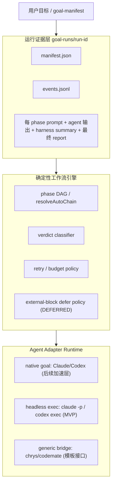
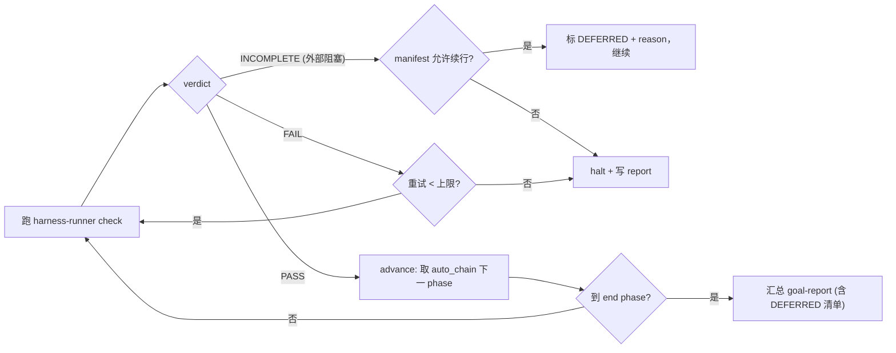

# 工具无关 Goal 全链路自动化（收敛 MVP + 运行证据层）

> 版本绑定：`version: 2.3.0`（读自根 `package.json`）。
> 流程：本变更为框架级行为变更，**先走 OpenSpec change**（`/opsx-propose`），本 plan 作实施清单辅助。当前 `openspec list` 无进行中变更。

## 采纳 review 后的核心修正

经 openspec-explore 核验，原 plan 有一处方向性错误与若干疏漏，已逐条对照源码确认并修正：

- **不存在「环境不可用→SKIP 即完成」语义**：Maison 刻意把无设备/工具链缺失/逃生阀判为 **FAIL BLOCKER** 以防假 PASS（[ut-rules.overlay.yaml:291](profiles/hmos-app/phase-rules-overlays/ut-rules.overlay.yaml)、[coding-rules.overlay.yaml:194](profiles/hmos-app/phase-rules-overlays/coding-rules.overlay.yaml)）。`INCOMPLETE` 语义极窄，仅覆盖 UT 设备阻塞（[report-generator.ts:515](harness/scripts/utils/report-generator.ts)），且 check-receipt 明确禁止其宣称完成（[check-receipt.ts:251](harness/scripts/check-receipt.ts)）。
  - **修正**：裁决用 `INCOMPLETE → defer_external_and_continue_if_allowed`；最终报告标 **DEFERRED（未完成·待外部条件）**，绝不伪装成完成或 PASS。
- **schema 字段不能取消注释了事**：[workflow-schema.json:7](specs/workflow-schema.json) 为 `additionalProperties: false`，`WorkflowSpec`（[workflow-loader.ts:23](harness/workflow-loader.ts)）无相关字段。
  - **修正**：显式扩 schema 属性 + loader 类型 + `validateWorkflow`。
- **不扩 Stop hook 抢跨阶段推进**：[check-phase-completion.mjs](agents/claude/templates/hooks/check-phase-completion.mjs) 职责保持「拦假完成」。跨阶段推进**统一由 runner 发下一 phase prompt**，避免 hook / native goal / runner 三者抢方向。
- `**goal_capability` 第一版 optional/WARN**：不做 check-init BLOCKER，否则不用 goal 的工具会初始化失败。
- **原生 /goal 第一版只做文档 + adapter metadata**：可移植核心是 runner，不是 Claude/Codex 原生 goal。

## 复用既有基础设施（不重造）

- 确定性闭环判据：state machine + harness verdict + receipt 四件套
- 机器可读裁决输入：`summary.json` 的 `verdict` / `failure_kind` / `blocking_class` / `next_action`
- 策略类型已预留：`TransitionPolicy` 含 `goal_mode`（[phase-transition-policy.ts](harness/scripts/utils/phase-transition-policy.ts)）
- adapter 能力声明模式：[adapter-schema.yaml](agents/adapter-schema.yaml) 已点名 chrys/codemate 为目标

## 三层控制面（目标架构）

裁决流（runner 与 goal-orchestration skill 共用同一裁决 SSOT）:

---

## Step 0 — OpenSpec change（先行）

`/opsx-propose`，kebab 名建议 `tool-agnostic-goal-runner`：产出 `proposal.md`（what & why）、`design.md`（裁决语义/运行证据层/分层）、`tasks.md`（实施步骤）。`.cursor/plans` 此 plan 作实施清单辅助，二者并存。

## Layer 1 — 契约层（spec / SSOT）

### 1.1 workflow schema 真正扩字段

- [specs/workflow-schema.json](specs/workflow-schema.json)：在 `additionalProperties: false` 下显式新增 `transition_policy`（enum manual|batch_authorized|goal_mode）与 `auto_chain`（array）属性
- [harness/workflow-loader.ts](harness/workflow-loader.ts)：`WorkflowSpec` 接口加字段 + `validateWorkflow` 校验
- [workflows/spec-driven.workflow.yaml](workflows/spec-driven.workflow.yaml)：填 `transition_policy: manual`（默认）+ `auto_chain`（也可不写，由 DAG 推导）

### 1.2 裁决 SSOT（[phase-transition-policy.ts](harness/scripts/utils/phase-transition-policy.ts)）

- `resolveAutoChain(workflow, start, end)`：**从 DAG 推导**有序 phase 列表（review/ut 并行串行化），manifest 可覆盖顺序，不硬编码唯一线性真理
- `classifyPhaseVerdict(verdict, blocking_class)`：
  - `PASS → advance`
  - `FAIL → retry`（未超上限）/ `halt`
  - `INCOMPLETE → defer_external_and_continue_if_allowed`（标 DEFERRED，按 manifest `dependency_policy` 决定续行或 halt）

### 1.2b DEFERRED ↔ DAG 依赖透传规则（review P1）

`testing` 在 workflow 中 `requires: [ut]`（[spec-driven.workflow.yaml:87](workflows/spec-driven.workflow.yaml)）。若 UT 为 DEFERRED 而 runner 继续 testing，本质是「带未完成依赖继续」，需显式规则而非默认放行：

- `dependency_policy`：声明**哪些** `blocking_class` / `failure_kind`（如 `device_blocked` / `externalBlocked`）可作为「deferred 依赖」向下游透传；未列入者一律 halt
- 下游 phase prompt **必须显式携带 upstream DEFERRED 清单**（让 agent 知道依赖未真正满足）
- **最终 goal 总状态**：只要链路中存在 DEFERRED，总状态只能是 `DEFERRED` / `PARTIAL`，**禁止** `completed`

### 1.3 goal manifest（新）

新增 `workflows/goal-manifest.schema.yaml` + `harness/scripts/utils/goal-manifest.ts`：

- `start_phase` / `end_phase`（默认 prd→testing；支持中途起步）
- `feature` / `requirement`
- `budget`: `{ max_retries_per_phase, max_total_turns, wall_clock_minutes }`
- `dependency_policy`: `{ deferrable_blocking_classes: [...], propagate_to_downstream: true }`（替代原 defer_policy；DEFERRED 不等于完成）
- `unattended`（见 2.3）：`{ write_mode, approval_mode, max_turns, timeout, allowed_tools/commands }`
- `run_id` / `report_path`（默认落 `goal-runs/<run-id>/`）

### 1.4 最终报告

新增 `goal-report-generator.ts`：聚合各 phase `summary.json` 为 `goal-report.{md,json}`，列 `phase | verdict | DEFERRED? | reason | artifact`；DEFERRED 阶段明确标「未完成·待外部条件」。

---

## Layer 2 — 编排执行层

### 2.1 确定性外层编排器（MVP 核心）

新增 [harness/scripts/goal-runner.ts](harness/scripts/goal-runner.ts)：

- CLI：`--start <phase> --end <phase> --feature <f> --requirement <text|file> --adapter <name> [--resume <run-id>] [--dry-run]`
- 循环：`resolveAutoChain` 取序 → 每 phase headless invoke agent（fresh context，repo/git/产物做记忆）→ 复用 `harness-runner.ts --phase --feature --summary` → 读 `summary.json` 经 `classifyPhaseVerdict` 裁决 → 预算守卫 → 汇总
- DEFERRED 按 `dependency_policy` 续行；**绝不**把外部阻塞软通过为 PASS

### 2.2 运行证据层（新）

`goal-runs/<run-id>/`：`manifest.json` + `events.jsonl` + 每 phase 的 `prompt.md`/`agent-output.log`/`harness summary` + `goal-report`。resume / 审计 / 预算以此为 SSOT，不依赖对话上下文（goal 模式只是"继续执行器"，Maison 自身才是事实来源）。

### 2.3 agent headless invoke 抽象

新增 `harness/scripts/utils/agent-invoke.ts`：按 adapter `goal_capability.headless_invoke` 模板拼命令并 spawn（占位符 `{{PROMPT_FILE}}`/`{{SKILL_PATH}}`/`{{PROJECT_ROOT}}`）。**第一版只硬化 `claude -p` 与 `codex exec`** 两条稳定路径；generic/chrys 仅定义模板接口，不承诺质量。

**unattended 权限契约（review P1）**：headless ≠ 能无人值守编辑/跑命令/过审批。`codex exec` / `claude -p` 默认可能落在只读 sandbox 或卡 permission prompt。须在 `goal_capability.external_runner` 或 manifest `unattended` 显式声明：写权限模式、审批模式、最大 turns、超时、允许的工具/命令策略；**goal-runner preflight 硬校验**这些已就绪，否则第一轮就会卡住。各工具映射示例：`claude -p --allowedTools ... --permission-mode`、`codex exec --sandbox workspace-write --ask-for-approval never|on-request`（必要时才用 full access）。

---

## Layer 3 — adapter 能力层

### 3.1 schema（optional/WARN）

[agents/adapter-schema.yaml](agents/adapter-schema.yaml) 新增 **optional** `goal_capability`：

- `mode: native_goal | external_runner`（预留 `hook_loop`）
- `native_goal`: `goal_condition_template`、`supports_resume`
- `external_runner`: `headless_invoke` + `unattended` 权限契约
- **两级校验（review P2）**：[check-init.ts](harness/scripts/check-init.ts) 对 `goal_capability` 缺失/非法只 **WARN**（不用 goal 不挡 init）；但 **goal-runner preflight 对当前激活 adapter 的 goal capability 是 BLOCKER**（用了 goal 必须在 preflight 拦住，不能让 runner 入口漏校验）

### 3.2 各 adapter metadata（不动 Stop hook）

- [claude](agents/claude/adapter.yaml) / 新增 [codex] adapter：`native_goal`（占位 metadata + /goal 条件模板）+ external fallback；**第一版不改 Stop hook**
- [cursor](agents/cursor/adapter.yaml) / [generic](agents/generic/adapter.yaml)（含 chrys/codemate）：`external_runner` + `headless_invoke` 模板

### 3.3 goal-orchestration Skill（薄入口，review P2）

新增 `skills/project/goal-orchestration/SKILL.md`，**收窄为薄入口/说明书**：只**调用或指导使用 goal-runner**（启动命令、manifest 字段、报告解读），**不复刻一套独立自驱动裁决流程**，避免 runner 与 Skill 形成两个执行真源后续漂移。裁决/续行/DEFERRED 逻辑唯一真源在 goal-runner + `phase-transition-policy.ts`。登记 [skills.index.yaml](skills/skills.index.yaml) + 各 adapter 跳板。

---

## Layer 4 — 测试 / 文档 / 发版

### 4.1 测试（BLOCKER：`cd harness && npm test` 全 PASS）

- 单测：`resolveAutoChain`、`classifyPhaseVerdict`（含 DEFERRED 分支）、`dependency_policy` 透传 + 最终状态禁 completed、goal-manifest、agent-invoke 模板、unattended preflight、goal-runs 留痕
- fixtures：happy path、DEFERRED 续行（UT 无设备→testing 带 upstream deferred）、FAIL 重试到上限、中途起步（design→testing）、check-init WARN、goal-runner preflight BLOCKER（缺 goal_capability/unattended）

### 4.2 文档

- 更新 [phase-transition-policy.md](docs/concepts/phase-transition-policy.md)：goal_mode 转「已实现」+ DEFERRED 语义
- 新增 `docs/operations/goal-mode-runbook.md`：启动/预算/中断/resume/报告解读
- 更新 [user-confirmation-ux.md](skills/reference/user-confirmation-ux.md) §8

### 4.3 发版门禁与归档

- 过 `release:check-plans`（version 2.3.0 已绑定）+ `release:verify`
- OpenSpec change `/opsx-archive`

---

## 关键风险与取舍

- **反假 PASS 红线**：外部阻塞一律 DEFERRED，绝不软通过；这是与 Maison 现有 FAIL 哲学一致的前提
- 弱模型质量：执行用强模型、裁决用脚本（harness verdict 确定性），低级模型也能跑链路靠这条
- 上下文策略：runner 每 phase fresh context（Ralph 式）优于长上下文累积
- native /goal 评估者只读 transcript：故第一版不依赖它做闭环判定，闭环统一由 harness verdict + runner 裁决
- 一次只激活一个 adapter（schema 既有约束）

