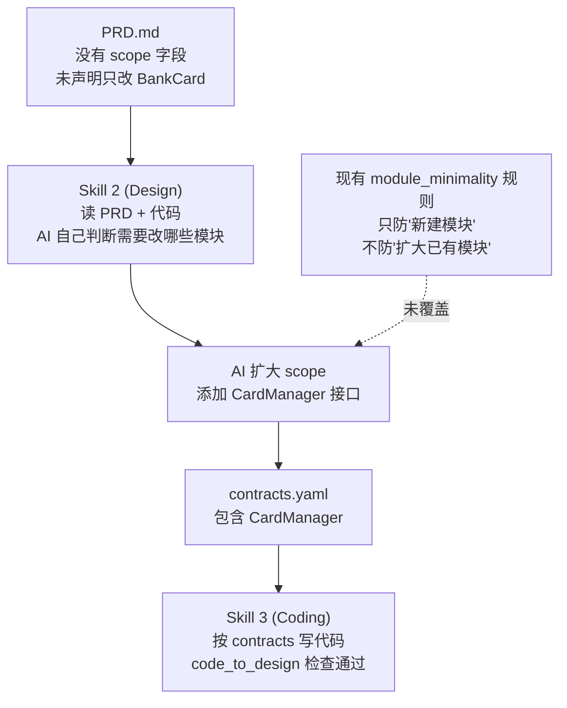
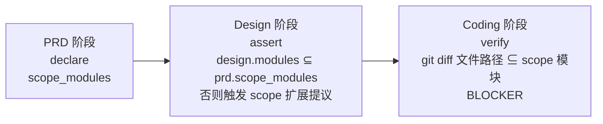

# 弱模型友好框架第一波改造

## 背景与目标

本工程是真实钱包项目的框架沙盒。真实项目只能用内网 MiniMax / GLM + Claude Code CLI 开发，但可以通过 OpenAI-compatible endpoint 接入。当前用户已暴露两个核心痛点：

- **Pain A（scope creep）**：开发 BankCard 需求时，AI 在 Skill 2 生成 design.md 时擅自决定"需要在 03-CommonBusiness / CardManager 新增接口"，把单模块改动变成跨模块改动，导致逻辑偏离。
- **Pain C（产物质量抖动）**：GLM/MiniMax 写 ArkTS 经常跑偏，缺少即时反馈机制把错误截在当轮。

本次改造针对这两个痛点做**定向修复**，同时铺设两条基础设施：

- **Claude Code CLI 运行时**：让同一套 skill 在 Cursor 和内网 Claude Code CLI 都可用。
- **异步反馈回路**：用户内网跑完后，只需 commit 一个目录回来，Cursor 这侧就能续上。

## 根因与修复思路

### Pain A 根因（BankCard 案例）

**五个失效叠加**：PRD 缺 scope → Design 缺负面约束 → Design 缺"扩展提议"流程 → design-rules 缺 scope 一致性校验 → coding-rules 缺 git diff vs scope 校验。

### 修复策略：三阶段 scope 守门

## 关键文件定位

- PRD 模板：`skills/1-prd-design/templates/prd-template.md`（需新增 scope 声明章节）
- PRD 规约：`specs/phase-rules/prd-rules.yaml`（需新增 scope_modules 字段要求）
- Design 模板：`skills/2-requirement-design/templates/design-template.md`（需新增 scope 声明章节）
- Design Skill：[skills/2-requirement-design/SKILL.md](skills/2-requirement-design/SKILL.md)（Step 2 和 Step 3 之间插入"scope 继承与提议"）
- Design 规约：[specs/phase-rules/design-rules.yaml](specs/phase-rules/design-rules.yaml)（新增 `scope_consistency_with_prd` BLOCKER）
- Design check：`harness/scripts/check-design.ts`（实现 scope 一致性校验）
- Coding Skill：[skills/3-coding/SKILL.md](skills/3-coding/SKILL.md)（强化 Step 3.6 lint 反馈循环）
- Coding 规约：[specs/phase-rules/coding-rules.yaml](specs/phase-rules/coding-rules.yaml)（新增 `diff_within_scope` BLOCKER）
- Coding check：[harness/scripts/check-coding.ts](harness/scripts/check-coding.ts)（新增 `checkDiffWithinScope`）
- ArkTS 参考：`skills/3-coding/reference/`（新增 arkts-pitfalls.md）
- Claude Code 入口：`CLAUDE.md` + `.claude/commands/` + `.claude/agents/`（新增）
- 反馈回路：`harness/reports/<feature>/<timestamp>/` 约定 + `harness/trace/gap-notes.template.md` + `trace.schema.json`（新增）

## 工作包划分（按优先级）

### WP1 - Scope 守门（P0，最对症 Pain A）

目标：让 BankCard 那类 scope creep 无法通过 design 阶段。

关键变更点：
- PRD 模板增加「Scope 声明」章节，要求列出 `in_scope_modules`（本需求允许修改的模块）和 `rationale`（为什么不需要改其他模块）。
- Design skill 在 Step 2 之后、Step 3 之前插入新 Step **「Scope 继承与提议」**：必须先显式复述 PRD scope；如果发现确实需要扩展（例如需动 CardManager），**必须停下来生成一份 scope 扩展提议 `proposed_scope_expansion`**，等用户明确确认，不能默默写入 design.md。
- Design 模板增加「Scope 声明与继承」章节，字段：`in_scope_modules` / `out_of_scope_modules` / `inherited_from_prd: true/false` / `expansions_with_user_approval`。
- `design-rules.yaml` 新增 BLOCKER：`scope_consistency_with_prd`（design.in_scope_modules 必须是 prd.in_scope_modules 的子集，除非有 expansions_with_user_approval 记录）。
- `check-design.ts` 实现该校验。
- Design skill 的约束章节新增"**最小改动原则**"：默认所有逻辑就地实现在最底层 Feature 模块，如果要提取到 03-CommonBusiness 或增加公共接口，必须发起 scope 扩展提议。

Coding 侧补充：
- `coding-rules.yaml` 新增 BLOCKER：`diff_within_scope`（git diff 涉及的所有非资源/配置文件必须属于 design 声明的 in_scope_modules）。
- `check-coding.ts` 新增 `checkDiffWithinScope`：基于 `git diff --name-only HEAD~1` 或 `git diff --name-only main`（通过 --base-ref 参数可配置），比对 contracts.yaml 的模块 package_path，越界即 FAIL。

### WP2 - ArkTS 正确性反馈环（P0，最对症 Pain C）

目标：让弱模型写 ArkTS 时错误在当轮被发现并修复，不累积到 review 阶段。

关键变更点：
- 在 `skills/3-coding/reference/` 新增 `arkts-pitfalls.md`：收录弱模型在 ArkTS 上最容易犯错的 10-15 条（@State/@Prop 的 reactivity 差异、装饰器位置、@Component 的 build() 约束、router 与 NavPathStack 混用、resource 引用、oh-package 路径格式、async/await 在 build() 外、LazyForEach + IDataSource、HAR Index.ets 导出规则等）。用"错误示例 → 正确示例"对照形式，利于弱模型 pattern matching。
- Coding skill Step 3 的"每写完一个文件"循环里，**把 Lint 检查从"有 error 则修复"强化为强制门禁**：单个文件 Lint 不过不得进入下一个文件。SKILL.md 在 Step 3 段落增加显式提示"弱模型尤其要逐文件验证，不得批量生成后再统一 lint"。
- 在 coding skill 的"常用参考"章节顶部置顶 `arkts-pitfalls.md` 的引用。

### WP3 - Claude Code CLI 运行时（P1）

目标：同一套 skill 在 Cursor 和内网 Claude Code CLI 都能驱动。

关键变更点：
- 新增根目录 `CLAUDE.md`：装载全局指令 = 引用 `doc/architecture.md` 作为 SSOT + 简化版"核心约束清单"（中文输出、模块 PascalCase、最小改动原则、scope 守门流程等）。
- 新增 `.claude/commands/` 下 6 个 slash command：`prd.md` / `design.md` / `code.md` / `review.md` / `ut.md` / `devtest.md`。每个命令内容为"本阶段入口指令 + 引用对应 `skills/<n>/SKILL.md`"。不拷贝内容，避免双源维护。
- 新增 `.claude/agents/verifier.md`：调用 harness/prompts/verify-*.md，作为可复用"判官"子 agent。
- Cursor 的 `.cursor/skills/` 保留，仍指向同一套 `skills/` 内容。

### WP4 - 异步反馈回路（P1）

目标：用户内网跑完一轮，只需 commit 一个目录回来，Cursor 侧就能无损消化。

关键变更点：
- 定义 `harness/trace/trace.schema.json`：字段包括 `feature_name` / `model_backend`（如 glm-4.5-plus）/ `phase` / `timings` / `tool_calls`（按序）/ `retries` / `final_artifacts`（路径清单）/ `human_pain_points`（结构化数组，每条含 `step`、`symptom`、`hypothesis`）。
- 定义 `harness/trace/gap-notes.template.md`：一份 markdown 模板，包含"本轮跑了什么 / 卡在哪 / 是否 scope 被扩大 / 是否 lint 循环多次才过 / 希望哪个 skill 改什么"等结构化问答。
- 约定目录：`harness/reports/<feature>/<YYYYMMDD-HHmm>/<model>-<phase>/` 下放 check-*.ts 的 JSON 报告 + trace.json + gap-notes.md。
- 在 PRD/Design/Coding skill 的末尾都增加"若在 Claude Code CLI 下跑，请产出 trace.json 到上述路径"的说明。

### WP5 - Dry-run：home-page 端到端验证（WP1~4 完成后）

目标：在 Cursor + Claude 侧用 home-page 作为试验田，验证改造后框架不破坏现有能力，且 scope 守门可生效。

关键动作：
- 回填 home-page 的 PRD 和 design，补 scope 声明字段（示范作用）。
- 跑 `npx ts-node harness/scripts/check-design.ts --feature=home-page` 和 `check-coding.ts`，确认新增的 scope 校验能通过现有 home-page 产物（现有产物合规 → 回归不破坏）。
- 构造一个**故意触发 scope creep 的 BankCard 最小用例**（PRD 声明只改 BankCard，让 AI 在 design 阶段尝试扩到 CardManager），观察 scope 扩展提议是否被正确触发。这是新机制是否真正有效的关键试金石。
- 产出一份内部"沙盒自检报告"作为 WP1~4 的交付凭证。

## 推进节奏（符合 10+ 轮/天 + 异步回传）

- **回合 1**：完成 WP1 全部（PRD 模板 + Design 模板 + Design skill 内嵌 + 两份 yaml + 两个 check-*.ts 实现）。这是单一焦点，一次性拿下，不留半成品。
- **回合 2**：完成 WP2（ArkTS pitfalls + coding skill lint 强化）。
- **回合 3**：完成 WP3 + WP4（CLI 入口 + 反馈回路），两者耦合度低可同批。
- **回合 4**：WP5 dry-run + 试金石用例。
- **回合 5+**：用户拿到内网跑一遍 home-page 完整流程，把 `harness/reports/<feature>/<timestamp>/` 目录 commit 回来，进入第二波改造（针对真实 gap）。

## 不在本次范围的事

以下事项**有意留到下一波**，本次不做，避免scope 膨胀（自己也要遵守 scope 守门原则）：

- Skill 1/4/5/6 的内容调整（除非是插入 scope 字段引用这种最小修改）。
- Harness 的 LLM 判官 prompt（`verify-*.md`）针对弱模型的重写。
- 建立跨模型 eval 测试集。
- hook 自动触发 harness（PostToolUse）。
- 迁移到 pnpm workspace 或统一依赖管理。

这些都会等第一轮真实反馈数据回来后再动手，避免在沙盒里优化错方向。
