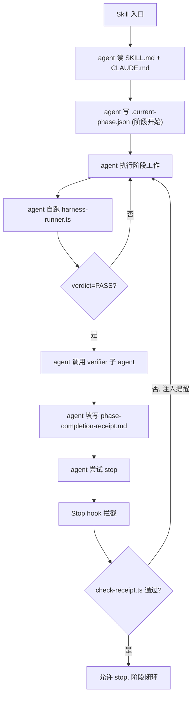

## 设计原则

1. **三层互相加固**：意图层（prompt）+ 凭证层（回执）+ 物理层（hooks）。任一层失守，下一层拦截。
2. **反幻觉条款核心化**：把"假设规则限制我"列为 framework 级禁忌。
3. **复用现有概念**：trace.json / `framework/harness/reports/` 路径不变，不引入新坐标系。
4. **跨阶段通用**：方案对 PRD / design / coding / review / UT / device-testing 全部生效，不是 coding 专属。
5. **跨平台兼容**：Windows + PowerShell + win32 路径，hook 脚本一律用 Node.js 跨平台实现。

## 整体闭环



## Layer 1 · Prompt 加固

### A. [CLAUDE.md](CLAUDE.md) 改动

- **新增「六、与用户交互的硬性规则」第 5 条 — 反假设条款**：

```
5. **反假设条款（Rule Hallucination Ban）**：
   - 若你声称某条规则限制你执行某动作（含执行 shell / harness / 编译 / 工具），
     必须立即逐字 quote 该规则原文 + 文件路径 + 行号 给用户看。
   - quote 不出 = 该规则不存在 = 你必须执行该动作。
   - 严禁以"我假设"、"我理解"、"通常这类项目"为由跳过工作流步骤。
   - 这是 BLOCKER 级硬约束，违反一次即视为本次任务失败。
```

- **新增「四、工作流与 Skill 路由」末尾段 — 主 agent 与 verifier 子 agent 的职责边界**：

```
**主 agent 与 verifier 子 agent 的职责切分（明示授权，避免误读）**：
- 结构级 harness（`framework/harness/harness-runner.ts`）：**必须由主 agent 自己执行**
  （它会自动调用 hvigor 编译、check-*.ts 等），不得借口"等 verifier"跳过。
- 语义级 verify（`framework/harness/prompts/verify-*.md`）：在结构级 harness PASS 后，
  由独立 verifier 子 agent 执行；主 agent 必须主动通过 Task 工具触发 verifier，
  不得仅"提示用户去跑"。
- CLAUDE.md 全文未禁止主 agent 调用 shell / 执行命令；空白处一律按"允许"理解。
```

- **修改「五、交付凭证与 Trace」末段**：增加"trace.json 缺失 = 阶段未完成"的明示。

### B. [framework/skills/3-coding/SKILL.md](framework/skills/3-coding/SKILL.md) 改动

- **Step 7 措辞统一**：把所有"告知用户可运行 / 引导用户执行 / 用户可使用"改成"agent 必须执行"。
- 同时保留"用户也可手动运行"作为 fallback，但不再是默认动作。
- **Step 7 末尾加完成判定**：必须同时满足三个条件才能宣布 coding 完成：
  1. `framework/harness/reports/<feature>/coding/trace.json` 存在
  2. harness-runner.ts 退出码 0（verdict=PASS）
  3. verifier 子 agent 已通过 Task 工具调用并返回 PASS
  4. `phase-completion-receipt.md` 已填写并通过 `check-receipt.ts`

### C. 其他 Skill 同步改造

对 `framework/skills/{1-prd-design,2-requirement-design,4-code-review,5-business-ut,6-device-testing}/SKILL.md` 做同样的措辞统一：搜 `告知用户` / `引导用户` / `用户可` / `可使用` / `若你想` 等弱措辞，统一替换。

### D. [.claude/commands/coding.md](.claude/commands/coding.md) 加最后一秒重申

末尾追加"**阶段闭环必读**"段：

```markdown
## 阶段闭环必读（不可跳过）

无论你怎么分解步骤，结束本次 `/coding` 之前必须做完：

1. 主 agent 自己执行：`cd framework/harness && npx ts-node harness-runner.ts --phase coding --feature <name>`
2. 主 agent 通过 Task 工具调用 verifier 子 agent，feature/phase/report 路径完整传入
3. 填写 `doc/features/<name>/coding/phase-completion-receipt.md`（模板见 framework/harness/templates/）
4. 不要"宣布完成"——Stop hook 会读 receipt + trace.json，缺一项会把你打回来
```

对 `.claude/commands/{prd-design,requirement-design,code-review,business-ut,device-testing}.md` 做同样追加。

## Layer 2 · 完成回执

### E. 新增 [framework/harness/templates/phase-completion-receipt.md](framework/harness/templates/phase-completion-receipt.md)

```markdown
# 阶段完成回执

> **填写规则**：所有字段必填；编造任意一项 = 反假设条款触发 = 任务失败。

- feature: <name>
- phase: <prd|design|coding|review|ut|device-testing>
- agent_model: <实际模型 id>
- claimed_completion_at: <YYYY-MM-DD HH:mm:ss>
- claimed_completion_commit_sha: <git rev-parse HEAD 真实值>

## 1. 实际执行的 shell 命令（最后 5 条，按时序）

1. `<命令1>`
2. `<命令2>`
...

## 2. Harness 验证

- script_harness_command: `<完整命令>`
- script_harness_exit_code: <0|非0>
- script_harness_report_path: `framework/harness/reports/<feature>/<phase>/...`
- ai_verifier_invoked_via: <Task 工具 / slash / 其它>
- ai_verifier_report_path: `<路径>`
- ai_verifier_verdict: <PASS|FAIL>

## 3. trace.json 凭证

- trace_json_path: `framework/harness/reports/<feature>/<timestamp>/<model>-<phase>/trace.json`
- trace_json_exists: <true|false 真实判断>

## 4. 自检题（agent 必须自己回答，回答错误会被 check-receipt.ts 抓出）

- Q1: 我有没有跑 `harness-runner.ts`？给出 trace.json 真实绝对路径：
- Q2: verifier 子 agent 报告里 verdict 字段的真实值是什么？
- Q3: 本阶段 git diff 的最后一个文件路径是？
- Q4: 我是否使用了 CLAUDE.md / SKILL.md 中并不存在的"假设规则"作为跳过任何步骤的理由？(必须答 no，并自证)
```

### F. 新增 [framework/harness/scripts/check-receipt.ts](framework/harness/scripts/check-receipt.ts)

校验逻辑：
1. receipt 文件存在 → 解析 frontmatter / 段落
2. `trace_json_path` 真实存在 + JSON 可解析
3. `script_harness_exit_code == 0`
4. `ai_verifier_verdict == PASS`
5. `claimed_completion_commit_sha == git rev-parse HEAD`（防造假）
6. 自检题 Q1 给的路径必须存在
7. 任一项失败 → exit 1，输出明确的 BLOCKER 报告

### G. harness-runner.ts 集成 check-receipt

在 [framework/harness/harness-runner.ts](framework/harness/harness-runner.ts) 主流程末尾追加：harness 自身 PASS 后，再做一道"上一阶段 receipt 检查"作为下一阶段进入门槛——以防有人跳着用 phase。

## Layer 3 · Hooks 物理拦截

### H. 新增 [.claude/settings.json](.claude/settings.json)

参考 Claude Code Hooks 官方约定：

```json
{
  "hooks": {
    "Stop": [
      {
        "matcher": "*",
        "hooks": [
          {
            "type": "command",
            "command": "node \"${CLAUDE_PROJECT_DIR}/.claude/hooks/check-phase-completion.mjs\""
          }
        ]
      }
    ],
    "SubagentStop": [
      {
        "matcher": "verifier",
        "hooks": [
          {
            "type": "command",
            "command": "node \"${CLAUDE_PROJECT_DIR}/.claude/hooks/record-verifier-report.mjs\""
          }
        ]
      }
    ]
  }
}
```

### I. 新增 [.claude/hooks/check-phase-completion.mjs](.claude/hooks/check-phase-completion.mjs)

跨平台 Node.js 脚本（Windows + macOS + Linux 通用）。逻辑：

1. 从 `framework/harness/state/.current-phase.json` 读取当前 feature/phase
2. 若文件不存在 → exit 0（不在阶段流程中，放行）
3. 若 `claimed_done: true` 且 `verdict: PASS` → exit 0（已闭环，放行）
4. 否则 → 输出阻止理由（精确到缺哪一项）+ exit 2（Stop hook 协议中 exit 2 = block + 把 stderr 注入下一轮 prompt）
5. 阻止理由 prompt 模板：

```
[Stop Hook 阻止] 当前阶段 <phase> for feature <feature> 未闭环：
- trace.json: <存在/缺失 + 真实路径>
- harness verdict: <PASS/FAIL/未跑>
- verifier report: <存在/缺失>
- receipt: <存在且通过/缺失/伪造嫌疑>

请立即执行剩余步骤，不要再次声称完成。本次声称属"假完成"，违反 CLAUDE.md 反假设条款。
```

### J. 新增 [.claude/hooks/record-verifier-report.mjs](.claude/hooks/record-verifier-report.mjs)

监听 verifier 子 agent 结束，把 verifier 的 transcript 落到 `framework/harness/reports/<feature>/<phase>/verifier-report.json`，供 check-receipt.ts 读取。

### K. 新增状态文件 [framework/harness/state/.current-phase.json](framework/harness/state/.current-phase.json)

由 SKILL.md Step 1 强制要求 agent 写入；harness-runner.ts 在每次运行成功后更新；Stop hook 读取。

格式：

```json
{
  "feature": "home-page",
  "phase": "coding",
  "started_at": "2026-04-27T09:30:00",
  "claimed_done": false,
  "verdict": null,
  "receipt_path": null
}
```

把这个路径加入 `framework.config.json` 的 `paths` 段以便 SSOT。

### L. .gitignore 调整

`framework/harness/state/` 入仓还是 ignore？建议 **ignore**（每开发者本地状态机），但保留目录通过 `.gitkeep`。

## 改造产物清单

### 修改

- [CLAUDE.md](CLAUDE.md) — 反假设条款 + 主 agent/verifier 职责边界 + trace 强制
- [framework/skills/3-coding/SKILL.md](framework/skills/3-coding/SKILL.md) — Step 7 措辞 + 完成判定
- [framework/skills/{1-prd-design,2-requirement-design,4-code-review,5-business-ut,6-device-testing}/SKILL.md] — 同步措辞
- [.claude/commands/{coding,prd-design,requirement-design,code-review,business-ut,device-testing}.md] — 末尾闭环必读
- [framework/harness/harness-runner.ts](framework/harness/harness-runner.ts) — 集成 check-receipt + 写状态文件
- [framework.config.json](framework.config.json) — 新增 paths.receipt_dir / paths.state_file
- [.gitignore](.gitignore) — state 目录处理

### 新增

- [framework/harness/templates/phase-completion-receipt.md](framework/harness/templates/phase-completion-receipt.md)
- [framework/harness/scripts/check-receipt.ts](framework/harness/scripts/check-receipt.ts)
- [.claude/settings.json](.claude/settings.json)
- [.claude/hooks/check-phase-completion.mjs](.claude/hooks/check-phase-completion.mjs)
- [.claude/hooks/record-verifier-report.mjs](.claude/hooks/record-verifier-report.mjs)
- `framework/harness/state/.gitkeep`

## 风险与开放点

1. **MX 2.5 不会主动写 state 文件**：必须靠 SKILL.md Step 1 在每次进入阶段时强制写入；可在 harness-runner.ts 第一次运行时自动写一份兜底。
2. **Stop hook 可能被 `claude --no-hooks` 之类参数绕过**：CLI 层限制，方案兜不住；用户应在团队约定层禁用此 flag。
3. **Windows 路径分隔符**：所有 hook 脚本一律用 Node.js 的 `path` 模块和 `process.cwd()`，不要硬编码 `/`。
4. **slash command 不是唯一入口**：用户可能不走 `/coding` 而直接对话，方案要靠 CLAUDE.md 兜住——这就是 Layer 1 加反假设条款最重要的地方。
5. **回执自检题如何防"硬编造"**：Q3（git diff 最后文件）这种是真实可机验的；Q1/Q2 也是路径检查；Q4 主要起"反复施压让弱模型不敢编"的心理作用，配合反假设条款。
6. **回执是否要 git 跟踪**：建议 `doc/features/<feature>/<phase>/phase-completion-receipt.md` 入仓，作为审计凭证。
7. **验证落地效果**：建议改完后用同一个 mx2.5 重跑一次 home-page 的 coding 阶段，看是否还能跳 harness——这是方案有效性的回归用例。
8. **未覆盖**：对"agent 假装跑了 harness 但实际没跑"——靠 check-receipt 的 commit_sha + trace.json 真实存在性 + Stop hook 三重防御，理论上无法伪造（伪造需要构造 trace.json 内容并改 git 状态，超出弱模型能力）。

