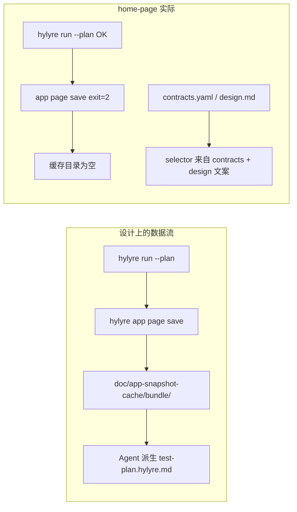
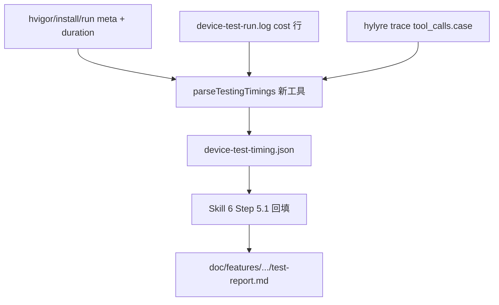
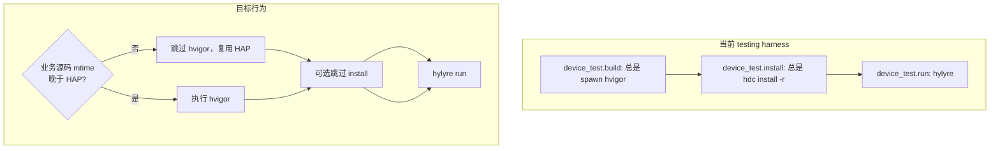

# 快照缓存与真机耗时报告 — 调研结论与改进计划

## 问题 1：`doc/app-snapshot-cache` 为什么一直是空的？

### 设计意图：**需要持久化，且仅本地**


| 维度   | 说明                                                                                                                                                                             |
| ---- | ------------------------------------------------------------------------------------------------------------------------------------------------------------------------------ |
| 配置   | `[framework.config.json](framework.config.json)` → `tools.hylyre.app_snapshot_cache_dir` = `doc/app-snapshot-cache`                                                            |
| 版本控制 | `[.gitignore](.gitignore)` 已忽略 `/doc/app-snapshot-cache/`（跨 feature 共享、不入库）                                                                                                    |
| 用途   | 存 Hylyre `app page save` 产出的 `<bundle>/pages/*.json` + `index.json`，供 **派生计划** 时 `app find` / agent 读 selector（见 [Skill 6 §4.5.2](framework/skills/6-device-testing/SKILL.md)） |
| 谁写入  | `**hylyre app page save`** / `**dump-ui`**（探索）；**不是** `hylyre run --plan`                                                                                                      |





### 根因 A（主因）：自动快照 **每次失败**，且失败不阻断 harness

`[device-test-run.ts](framework/profiles/hmos-app/harness/providers/device-test-run.ts)` 在 `runHylyreDeviceTest` 末尾调用 `tryHylyreAppPageSaveAfterRun`，但 CLI 形态与当前 Hylyre 不一致：

- **框架实际调用**（v8 日志末尾）：
`python -m hylyre app page save --bundle com.example.simulatedwallet --device-sn …`
- **Hylyre 报错**（`[device-test-run.log](doc/features/home-page/testing/reports/device-test-run.log)` L85–91）：
`Usage: … app page save [OPTIONS] BUNDLE NAME` — `**No such option '--bundle'`**
- **元数据佐证**（`[device-test-run.meta.json](doc/features/home-page/testing/reports/device-test-run.meta.json)`）：
`"hylyre_page_save": { "attempted": true, "exit_code": 2 }`

因此目录即使用 `mkdirSync` 创建过，也**不会有** `pages/*.json` 内容。

**文档与实现不一致**：`[profile-addendum.md](framework/profiles/hmos-app/skills/6-device-testing/profile-addendum.md)` 仍写 `app page save --bundle <bundleName>`，与真实 CLI 不符，属于 framework 源头 bug。

### 根因 B：Skill 6 **未执行主动探索**

协议要求（Skill 6 Step 4.5.2 / profile addendum）在缺 selector 时用 `**hylyre dump-ui`** 或设备连线探索，并可选读缓存。

home-page 实际路径：

- 派生依赖 `[contracts.yaml](doc/features/home-page/contracts.yaml)` + `[design.md](doc/features/home-page/design.md)` 中的文案（「首页」「消息」「Huawei Card」等）
- `[derive-hylyre-plan-hint.ts](framework/harness/scripts/derive-hylyre-plan-hint.ts)` **只读** `test-plan.md`，**不读** `app-snapshot-cache`
- `[testing/context-exploration.md](doc/features/home-page/testing/context-exploration.md)` 未记录任何 `dump-ui` / `app page save` 探索
- 仓库内 **无** `dump-ui` 执行痕迹（仅 test-report 建议里提到）

结论：**不是“完全不需要持久化”**，而是 **自动写入坏了 + 人工/Agent 探索步骤未做**，导致缓存一直空。

### 根因 C：`hylyre run` 本身不写缓存（符合设计）

`HYLYRE_APP_STORE_DIR` 在 run 时已注入，但仅 `save/load/find` 消费；run 只产出 trace/report。即使 run 成功，不调用正确的 `page save` 就不会有缓存。

---

## 问题 2：真机耗时为何未出现在 `test-report.md`？

### 当前数据在哪里


| 层级        | 已有数据                                                                                                                                                    | 缺失                               |
| --------- | ------------------------------------------------------------------------------------------------------------------------------------------------------- | -------------------------------- |
| 打包        | `[hvigor-app-build.meta.json](doc/features/home-page/testing/reports/hvigor-app-build.meta.json)` `durationMs: 1258`                                    | 未汇入 test-report                  |
| 装机        | `[device-test-install.meta.json](doc/features/home-page/testing/reports/device-test-install.meta.json)` `durationMs: 588`                               | 未汇入 test-report                  |
| Hylyre 整段 | 日志时间戳约 `19:02:49` → `19:03:31`（~42s 设备操作；含预启动）                                                                                                          | meta 仅有 `ran_at`，无 `duration_ms` |
| 单步        | `[device-test-run.log](doc/features/home-page/testing/reports/device-test-run.log)` 每行 `cost: 0.341s` 等                                                 | 未按 TC 聚合                         |
| trace     | `[trace.json](doc/features/home-page/testing/reports/20260519-rerun-v8/hylyre/trace.json)` `cases[]` 仅 id/status/notes                                  | **无** `duration_ms` / 起止时间       |
| 顶层报告      | `[test-report.md](doc/features/home-page/test-report.md)` + [模板](framework/profiles/hmos-app/skills/6-device-testing/templates/test-report-template.md) | **无耗时章节/列**                      |


`[HylyreTraceCase](framework/profiles/hmos-app/harness/providers/device-test-run.ts)` 类型与 `parseHylyreTrace` 均未解析耗时字段；Skill 6 Step 5.1 只要求按 `cases[]` 回填状态，**没有耗时契约**。

### 本次 v8 可推算的参考值（仅供理解，非正式产物）

- **Hylyre run 设备侧**：日志约 **42s**（不含 harness 外 pip/编译）
- **整条 testing harness**（你上次会话）：Shell 约 **56s**（含 build/install/ensure/run）
- **单 TC**：trace 有 `tool_calls[].case`，log 有顺序 `cost`，可离线汇总，但**今天没有自动化汇总**

---

## 改进计划（Framework 优先）

### 轨道 1：修复快照缓存（BLOCKER 级体验问题）

1. **修正 `tryHylyreAppPageSaveAfterRun`**（`[device-test-run.ts](framework/profiles/hmos-app/harness/providers/device-test-run.ts)`）
  - 对齐 Hylyre CLI：`app page save <BUNDLE> <PAGE_NAME> [--device-sn SN]`
  - `PAGE_NAME`：复用已有 `resolveHypiumPageNameForRun` / `PhoneAbility` 映射，或约定默认名（如 `default` / 首页路由名），需对照 vendor wheel `hylyre app page save --help` 一次确认
  - 成功后检查 `doc/app-snapshot-cache/<bundle>/pages/` 非空；失败时 meta 写清 stderr
2. **同步文档**：`[profile-addendum.md](framework/profiles/hmos-app/skills/6-device-testing/profile-addendum.md)`、`[SKILL.md](framework/skills/6-device-testing/SKILL.md)` 中删除错误的 `--bundle` 示例
3. **单测**：为 `tryHylyreAppPageSaveAfterRun` 增加参数拼装单元测试（mock spawn）
4. **Skill 6 流程补强**（可选但推荐）：派生前若 `app-snapshot-cache/<bundle>/` 为空且导航类 TC 多，**BLOCKER 级提示** agent 先跑 `dump-ui` 再派生（可在 derive-hint JSON 增加 `snapshot_cache_empty: true`）

### 轨道 2：耗时写入 `test-report.md`




1. `**runHylyreDeviceTest` 记录整段耗时**
  - `device-test-run.meta.json` 增加：`run_started_at`、`run_ended_at`、`run_duration_ms`
  - 可选：`page_save_duration_ms`
2. **新增 `parseDeviceTestRunTimings`**（建议放在 `framework/profiles/hmos-app/harness/` 或 `framework/harness/scripts/utils/`）
  - 输入：`device-test-run.log` + `trace.json` + build/install meta
  - 输出：`device-test-timing.json`，结构示例：
    - `pipeline`: `{ build_ms, install_ms, hylyre_run_ms, page_save_ms, total_harness_ms }`
    - `cases[]`: `{ id, duration_ms, step_count }`（按 trace `tool_calls[].case` 顺序对齐 log 中 `cost:` 累加；TC 边界以 case 切换为准）
3. **在 `check-testing.ts` 的 `device_test.run` 成功后** 调用上述解析，写入 `doc/features/<feature>/testing/reports/device-test-timing.json`
4. **扩展报告模板** `[test-report-template.md](framework/profiles/hmos-app/skills/6-device-testing/templates/test-report-template.md)`
  - 「测试概览」增加：**真机流水线耗时**表（build / install / Hylyre run / 合计）
  - 「测试执行结果」表增加列：**耗时**（如 `12.4s`）
5. **更新 Skill 6 Step 5.1**：回填 `test-report.md` 时必须读取 `device-test-timing.json`（缺失则 WARN，允许仅写整体耗时）
6. **长期（可选）**：向 Hylyre vendor 提 `trace.cases[].duration_ms`，减少 log 解析脆弱性

### 轨道 3：无代码变更时复用 HAP，跳过重复打包（你本次新增诉求）

#### 现状：为什么感觉「每次都在打包」？

`[check-testing.ts](framework/harness/scripts/check-testing.ts)` 的 `checkDeviceTestBuildGate` **每次**都会调用 `[runDeviceTestAppBuild](framework/profiles/hmos-app/harness/providers/device-test-build.ts)` → `[runHvigorAssembleApp](framework/profiles/hmos-app/harness/hvigor-runner.ts)`，**没有任何「复用上次 HAP」分支**。

但两次事实需要区分：


| 现象                        | 实际含义                                                                                                                                     |
| ------------------------- | ---------------------------------------------------------------------------------------------------------------------------------------- |
| harness 每次都 **启动 hvigor** | 是（无法跳过进程调用）                                                                                                                              |
| 每次都 **全量重编译 / 重写 HAP**    | **否**（日志 `PackageHap` / `SignHap` 为 **UP-TO-DATE**，`BUILD SUCCESSFUL in 290 ms`）                                                         |
| HAP 资源管理器 **修改日期会变**      | **否**（用户实测 `Phone-default-signed.hap` 仍为 **2026/5/18 19:37**；5/19 两次 testing 未改写该文件）                                                     |
| 每次都 **装机**                | **是**（`[device-test-install.ts](framework/profiles/hmos-app/harness/providers/device-test-install.ts)` 无条件 `hdc install -r`，约 **588ms**） |


**易误导点**：`device-test-build.result.json` 的 `timestamp` 是 **本次 harness 跑 build 门禁的时刻**（如 `2026-05-19T11:02:42`），**不是** HAP 落盘时间；**以 HAP 文件 mtime 为准**。

因此：你「最近没改代码」时，系统**已在事实复用昨天那份 HAP**；harness 仍每次调 hvigor + install，只是门禁文案让人以为「又打了一包」。轨道 3 应 **显式判定复用、跳过 hvigor/install**，并在报告写 `hapBuiltAt` / `build_reused`。




#### 复用判定策略（推荐）

在 **framework**（`[device-test-build.ts](framework/profiles/hmos-app/harness/providers/device-test-build.ts)` + 新工具 `device-test-build-reuse.ts`）实现，**不**依赖 agent 记忆：

1. **读取上次成功构建** `[device-test-build.result.json](doc/features/home-page/testing/reports/device-test-build.result.json)`（扩展字段）：
  - `hapPath`、`hapMtimeMs`、`resolvedProduct`、`resolvedBuildMode`
  - `inputsMaxMtimeMs`（或 `inputsFingerprint`）
  - `builtAt`
2. **计算「业务输入新鲜度」**（仅影响安装包的源码，**不含** `doc/`、`framework/`、测试计划）：
  - **主路径**：扫描 `framework.config.json` → `architecture` 所列外层目录下模块的 **源码**（`*.ets`、`*.ts`（若参与宿主构建）、`module.json5`、`oh-package.json5` 等），取 `max(mtime)`，**排除** `build/`、`oh_modules/`、`.preview`
  - **辅路径（可选增强）**：复用 `[git-diff.ts](framework/harness/scripts/utils/git-diff.ts)` 的 `filterBusinessSourceChanges`，若自上次 `builtAt` 对应 commit 以来业务路径 **无变更** 且 HAP 存在 → 可复用
  - **原则**：`test-plan.md` / 派生 hylyre 计划变更 **不应** 触发重编译
3. **复用条件（全部满足才 SKIP hvigor）**：
  - 磁盘上 `hapPath` 存在
  - `hapMtimeMs >= inputsMaxMtimeMs`（HAP 不早于任一相关源文件）
  - `resolvedProduct` / `resolvedBuildMode` 与本次 `HARNESS_DEVICE_TEST_`* 环境一致
  - 未设置 `HARNESS_DEVICE_TEST_FORCE_BUILD=1`
4. **SKIP 时的 harness 行为**：
  - `device_test.build` 仍 **PASS**，`details` 写明：`复用 HAP（跳过 hvigor，inputsMaxMtime < hapMtime）`
  - `hvigor.executed = false`，`durationMs = 0`，写入 `reused: true` 到 result.json
  - **禁止**使用 `HARNESS_SKIP_DEVICE_TEST_BUILD`（现有策略：设置即 **FAIL**）
5. **装机复用（轨道 3b，可选第二阶段）**：
  - 当 build 复用 **且** 当前 HAP 的 `mtime/size` 与 `[device-test-install.meta.json](doc/features/home-page/testing/reports/device-test-install.meta.json)` 上次记录一致 **且** 设备 `bm dump` 显示已安装同 `bundleName` + `versionCode` → 可 **SKIP install**（`reused: true`）
  - 强制重装：`HARNESS_DEVICE_TEST_FORCE_INSTALL=1`
  - 仅重跑用例、包未变时，可再省 ~0.5s + 避免反复 `-r` 覆盖安装
6. **门禁与文档**：
  - 更新 `[testing-rules.yaml](framework/specs/phase-rules/testing-rules.yaml)` `device_test_build` 描述：允许 PASS(reused)
  - 更新 `[profile-addendum.md](framework/profiles/hmos-app/skills/6-device-testing/profile-addendum.md)` 环境变量表
  - **耗时报告**（轨道 2）：`device-test-timing.json` 的 `pipeline.build_ms` 在复用时记 `0`，并增加 `build_reused: true`
7. **单测**：
  - HAP 新于所有源 → reused
  - 任一 `.ets` 新于 HAP → 必须 hvigor
  - product/buildMode 变化 → 必须 hvigor
  - `FORCE_BUILD` → 必须 hvigor

#### 与既有「hvigor 加速」计划的关系

`[.cursor/plans/hvigor_编译加速_709d2588.plan.md](.cursor/plans/hvigor_编译加速_709d2588.plan.md)` 解决的是 **「要编译时更快」**；本轨道解决 **「无源码变更时根本不编译」**。二者互补，不冲突。

### 轨道 4：home-page 实例落地（agent 执行项，待你确认计划后）

- 修复 framework 后重跑 testing harness → 验证 `doc/app-snapshot-cache/com.example.simulatedwallet/` 有文件
- 无代码变更重跑：应看到 `device_test.build` **PASS(reused)**，总耗时明显下降
- 将 `device-test-timing.json` 合并进 `[test-report.md](doc/features/home-page/test-report.md)` v1.5

---

## 计划验收与测试（改完后怎么测）

分三层：**framework 单测**（不连真机）→ **home-page 真机 E2E**（四场景）→ **阶段闭环**（harness + verifier + receipt）。真机场景需 USB 设备在线；agent 自跑，无需你手敲 harness CLI。

### 层 0：改代码后先跑（CI 等价）

在仓库根或 `framework/harness`：

```bash
cd framework/harness && npm test
```

**期望**：新增/修改的 unit test 全绿；既有 `hylyre-ensure-upgrade`、`hvigor-args` 等无回归。

**建议新增单测文件（实现时一并提交）**：

| 文件 | 覆盖 |
|------|------|
| `framework/profiles/hmos-app/harness/tests/unit/device-test-build-reuse.unit.test.ts` | 源码 mtime vs HAP mtime、product/buildMode、FORCE_BUILD |
| `framework/profiles/hmos-app/harness/tests/unit/device-test-page-save-args.unit.test.ts` | `app page save` 参数为 `BUNDLE NAME` 而非 `--bundle` |
| `framework/profiles/hmos-app/harness/tests/unit/device-test-timings.unit.test.ts` | 从样例 log + trace 解析 `cases[].duration_ms` |

（可选）`framework/harness/tests/fixtures/` 增加最小 `testing_build_reuse_pass` fixture：mock 无源码变更 + 假 HAP 路径，断言 `device_test_build` 为 PASS 且 `reused: true`。

### 层 1：轨道逐项验收（真机 / 本地）

**前置**：DevEco `hdc` 可用、设备 `hdc list targets` 非空；`HARNESS_HDC_EXE` 指向 toolchains（与上次 home-page 会话相同）。

| 场景 | 操作 | 通过判据 |
|------|------|----------|
| **A. 快照缓存（轨道 1）** | 修 CLI 后跑一轮 `testing --feature home-page` | `doc/app-snapshot-cache/com.example.simulatedwallet/pages/` 下出现 JSON；`device-test-run.meta.json` → `hylyre_page_save.exit_code: 0`；`device-test-run.log` 无 `No such option '--bundle'` |
| **B. 构建复用（轨道 3）** | **不改任何 `.ets`**，连续跑 **两次** testing | 第 2 次：`device-test-build.result.json` 含 `reused: true`、`hvigor.executed: false`（或等价字段）；`merged-report` / script 明细写「复用 HAP」；**HAP mtime 仍可为昨日**；总耗时较第 1 次明显下降 |
| **C. 强制重编（轨道 3 负例）** | 设 `HARNESS_DEVICE_TEST_FORCE_BUILD=1` 再跑 testing | 必须执行 hvigor；若源码有变或 clean 后，**HAP mtime 更新为今日** |
| **D. 源码变更触发重编** | 触摸任一参与打包的 `.ets`（或 `touch` 后还原）再跑 testing | `reused: false`；hvigor 日志出现非全 `UP-TO-DATE` 或 `PackageHap` 非 UP-TO-DATE；HAP mtime ≥ 源码 mtime |
| **E. 装机复用（轨道 3b，若实现）** | 场景 B 后立即第 3 次跑 | `device-test-install.meta.json` 含 `reused: true`；无第二次 `hdc install` 或明细标注跳过 |
| **F. 耗时报告（轨道 2）** | 任一轮 testing 成功后 | 存在 `doc/features/home-page/testing/reports/device-test-timing.json`；顶层 `test-report.md` 含「流水线耗时」表 + 用例表「耗时」列；B 场景下 `build_ms` 为 0 且 `build_reused: true` |

**对比记录建议**（便于你肉眼确认）：

- 资源管理器：`01-Product\Phone\build\default\outputs\default\Phone-default-signed.hap` 修改时间
- `device-test-build.result.json`：`timestamp` vs 新增字段 `hapBuiltAt` / `hapMtimeMs`
- 两次 harness 总耗时（或 `device-test-timing.json` → `pipeline.total_harness_ms`）

### 层 2：Skill 6 阶段闭环（与 AGENTS.md 一致）

每轮 E2E 后由 agent 完成（你只需保证设备连着）：

1. `cd framework/harness && npx ts-node harness-runner.ts --phase testing --feature home-page --summary --failures-only` → exit 0，`can_claim_done: YES`
2. Task `verifier` + `check-receipt.ts --feature home-page --phase testing` → PASS
3. 更新 `test-report.md` / `phase-completion-receipt.md` / `trace.json`

**语义验收**：verifier 仍 PASS；`test-report` 中耗时与 `device-test-timing.json` 一致；构建复用场景结论里应写清「包龄 / 未重编」避免与「今日跑过 harness」混淆。

### 层 3：不建议作为本 plan 主验收的项

- 仅改 `test-plan.md` / 派生 hylyre：**不应**触发重编（场景 B 仍 `reused`）——若失败说明 `inputsMaxMtime` 扫描范围过大，需收窄。
- `explicit_skip` 用例（TC-010 等）：仍跳过，与本 plan 无关。
- Nav 类 TC 通过率（TC-003/004/005）：属派生/探索问题，**不阻塞**本 plan 的 framework 验收；可另开 v9 派生迭代。

### 验收清单（勾选即用）

- [ ] `npm test` 全绿
- [ ] `app-snapshot-cache/<bundle>/pages/` 非空
- [ ] 无改码连跑两次：`build_reused` + 耗时下降
- [ ] `FORCE_BUILD=1` 或改 `.ets`：重编且 HAP mtime 更新
- [ ] `device-test-timing.json` + `test-report.md` 含整体与各 TC 耗时
- [ ] harness + verifier + receipt 四凭证 PASS

---

## 直接回答摘要


| 问题             | 结论                                                                                                                                                                        |
| -------------- | ------------------------------------------------------------------------------------------------------------------------------------------------------------------------- |
| 缓存为何空？         | **需要持久化**；空因 `**app page save` CLI 错误（exit 2）** + **从未 dump-ui/手动 save** + **run 不写缓存**。不是 Skill 6 故意不用。                                                                  |
| 是否探索过页面结构？     | **没有系统性探索**；selector 来自契约/设计文档，未用快照缓存。                                                                                                                                    |
| 耗时为何不在 report？ | **schema/模板/Step 5.1 均未定义**；数据在 meta/log，未汇总。                                                                                                                             |
| 为何每次都要打包？      | harness **无复用逻辑**，每次都调 hvigor；hvigor **多为 UP-TO-DATE**，**不重写 HAP 文件**（HAP mtime 可仍为昨日）。**装机**则每次都执行。应用 **源码 mtime vs HAP mtime** 显式跳过 hvigor/install，并在报告区分「门禁跑过」与「包已重建」。 |
| 如何实现？          | 轨道 1–3（快照/耗时/构建复用）均在 **framework/** 落地；实例 test-report 由 agent 在修复后重跑回填。                                                                                                   |


