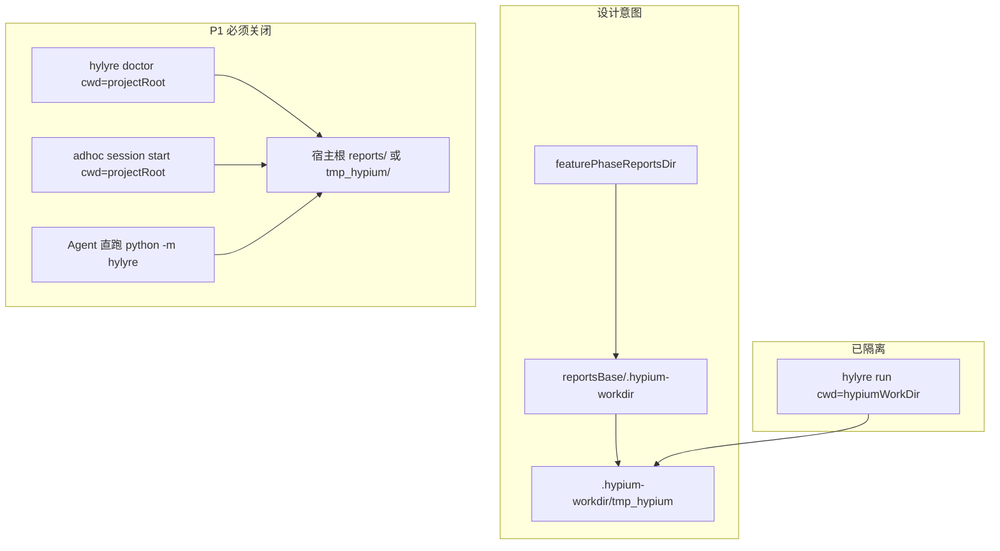

# 工程根 `reports/` / `tmp_hypium/` 污染根因与修复计划

**状态：已定稿（第四轮收敛），可进入实现。**

> Plan 文件：[`.cursor/plans/根目录_reports_污染根因_5879653f.plan.md`](.cursor/plans/根目录_reports_污染根因_5879653f.plan.md)

## Review 修订摘要

### 第一轮（2026-05-28）


| Review 点                        | 计划调整                                                          |
| ------------------------------- | ------------------------------------------------------------- |
| doctor/session cwd 对齐是根因修复，非可选  | **P1 必须**，先于 gitignore                                        |
| 勿盲目把 `/reports/` 写入全局 canonical | **先修 cwd + 污染检测**；`/reports/` 仅 P3 决策                         |
| 各子命令 cwd 易回归                    | 新增 `resolveHylyreRuntimeWorkDir` + `spawnHylyre`              |
| 根 `reports/` 勿递归盲删              | `tmp_hypium` best-effort；根 `reports/` 默认 WARN + 启发式           |
| legacy 路径笔误                     | `framework/harness/reports/<feature>/testing/.hypium-workdir` |


### 第二轮（2026-05-28）— 可执行


| Review 点                    | 计划调整                                                                                                                                  |
| --------------------------- | ------------------------------------------------------------------------------------------------------------------------------------- |
| 顺序可靠：cwd → 污染检测 → 再谈 ignore | **批准执行**；避免 git 干净但磁盘仍乱落                                                                                                              |
| `spawnHylyre` 职责收窄          | **仅**封装 `python -m hylyre …`；**不**纳入 `pip install`、`python -m venv`、`python -c import hylyre` 等环境探测（仍用 `projectRoot` cwd，与 hypium 无关） |
| `HYLYRE_APP_STORE_DIR`      | `spawnHylyre` 内可选字段；`run` / `dump-ui` / `page-save` / `session` 传入；**doctor 不传**，避免 ensure 仅为 doctor 解析 snapshot 路径                   |
| 策略确认                        | 默认不把 `/reports/` 进 canonical；不盲删根 `reports/`；`ROOT_HYLYRE_POLLUTION=1` + meta 显式回归                                                    |


### 第三轮（2026-05-28）— 结构收敛


| Review 点  | 计划调整                                                                                               |
| --------- | -------------------------------------------------------------------------------------------------- |
| 关键边界已到位   | `spawnHylyre` 收窄、`HYLYRE_APP_STORE_DIR` 可选、doctor 不传 store、`/reports/` 不进默认 canonical — **无结构性异议** |
| P2 落盘缺口   | 污染若发生在 **doctor（ensure）** 且 **run 未执行/早退**，仅写 `device-test-run.meta.json` 会**丢半套**机读记录             |
| 双 meta 分工 | **ensure 结束** → `hylyre-ready.meta.json`；**run 结束** → `device-test-run.meta.json`                  |
| 锚点一致性     | 两阶段均在 **stderr** 与对应 **log** 打印 `ROOT_HYLYRE_POLLUTION=1`                                          |
| 文档措辞      | **Review 已收敛，可执行**（归档提案用「收敛」）                                                                      |


### 第四轮（2026-05-28）— 可执行定稿


| Review 点      | 计划调整                                                                                                                                                        |
| ------------- | ----------------------------------------------------------------------------------------------------------------------------------------------------------- |
| P2 双 meta 已补齐 | ensure → `hylyre-ready.meta.json`；run → `device-test-run.meta.json`；stderr/log → `ROOT_HYLYRE_POLLUTION=1` — **逻辑闭环**                                       |
| 快照时序（必实现） | `tmp_hypium`：段首先清理再 `before` 快照；`reports` 记 mtime+entryCount，检测新建或变更 |
| 文档排版 | 修正正文误嵌 `**`；overview 为 Review 已收敛；表格内链接勿包反引号（定稿已修） |
| 结论 | 无结构性问题；**本版可定稿**，可进入实现 |

**总体执行顺序**：**修 cwd 泄漏 → 污染检测/告警（双 meta + 正确快照时序）→ 再定 gitignore 策略**。

---

## 设计原则：该不该出现在宿主工程根？

**不该。** 宿主实例根（与 `framework.config.json` 同级）**不是** Hylyre/Hypium 官方落盘位置；根目录出现即 **污染 / 历史遗留**。


| 目录            | 正确落点（现代 harness）                                                     | 正确落点（legacy，未配 `reports_dir_pattern`）                                     |
| ------------- | -------------------------------------------------------------------- | ------------------------------------------------------------------------- |
| `tmp_hypium/` | `doc/features/<feature>/testing/reports/.hypium-workdir/tmp_hypium/` | `framework/harness/reports/<feature>/testing/.hypium-workdir/tmp_hypium/` |
| 根 `reports/`  | **不是** harness 报告树（后者在 `doc/features/<feature>/<phase>/reports/`）    | 同上；根 `reports/` = cwd=工程根时的 Hylyre/Hypium task 日志，属误落盘                    |


**.gitignore**：canonical 含 `**/tmp_hypium/`（init 同步）；**不含** `/reports/`（有意区分 harness 报告路径）。ignore 不能替代 cwd 修复，只能防误提交。

**Wallet 实例止血**：确认无手工内容后，根 `tmp_hypium/` 可删；根 `reports/` 删前建议看一眼是否仅为 Hylyre 日志；删后若再出现 → 仍有 cwd 泄漏或未跑 init。

---

## 代码确认（Review 已核对）


| 入口                    | cwd 现状                                           | 锚点                                                                                                                                         |
| --------------------- | ------------------------------------------------ | ------------------------------------------------------------------------------------------------------------------------------------------ |
| `hylyre run`          | 已隔离 → `reports/.hypium-workdir`                  | `[device-test-run.ts](profiles/hmos-app/harness/providers/device-test-run.ts)` L1127–1287                                                  |
| `hylyre doctor`       | **仍 `projectRoot`**；首装/升级必跑                      | 同文件 L282–294、L939–940                                                                                                                      |
| `adhoc session start` | **仍 `projectRoot`**；`dump-ui` 已用 `hypiumWorkDir` | `[adhoc-dump-ui.ts](harness/scripts/utils/adhoc-dump-ui.ts)` L48–74                                                                        |
| canonical gitignore   | 含 `**/tmp_hypium/`，**无** `/reports/`；仅 init 同步   | `[canonical-gitignore.ts](harness/scripts/utils/canonical-gitignore.ts)` L9–26；`[check-init.ts](harness/scripts/check-init.ts)` L2133–2140 |
| Agent 直跑 CLI          | 不经 harness，cwd 常为工程根                             | `[skills/6-device-testing/SKILL.md](skills/6-device-testing/SKILL.md)` L223                                                                |


---

## 架构：设计意图 vs 泄漏点




---

## Framework 修复（agent-maison）

### P1 必须：统一 Hylyre 运行时 cwd（根因）

**禁止**仅靠补 `.gitignore` 解决根目录污染。

1. **扩展** `[device-test-hypium-workdir.ts](profiles/hmos-app/harness/device-test-hypium-workdir.ts)`（或邻文件 `hylyre-spawn.ts`）：
  - `resolveHylyreRuntimeWorkDir(...)` → `{ reportsBase, hypiumWorkDir }`
  - `spawnHylyre(opts)` — **范围仅限** `spawnSync(pythonPath, ['-m', 'hylyre', …])`：
    - **强制** `cwd: hypiumWorkDir`（禁止 `projectRoot`）
    - **可选** `appSnapshotCacheAbs?: string` → 有值时才 `env.HYLYRE_APP_STORE_DIR=…`；无值则仅 `mergeEnvWithHdcOnPath`
    - 可选 `logPath` 追加、`timeout`、`stdio`
  - **不经过 `spawnHylyre`**（保持现有 `cwd: projectRoot` 即可）：
    - `python -m pip install …`
    - `python -m venv …`
    - `python -c "import hylyre"` / `pip show` 等环境探测
2. **走 `spawnHylyre` 的子命令**（`python -m hylyre`）：

  | 子命令                                                   | `appSnapshotCacheAbs` |
  | ----------------------------------------------------- | --------------------- |
  | `doctor`                                              | **不传**（仅 cwd 隔离）      |
  | `run` / `dump-ui` / `app page save` / `session start` | **传入**                |

3. **`ensureHylyreReady`**：创建 `reportsBase` → `ensureHypiumWorkDir` → pip/venv（`projectRoot` cwd）→ **`spawnHylyre` doctor** → **P2 污染检测** → 更新 `hylyre-ready.meta.json`。

### P2：宿主根污染检测（不掩盖泄漏）

新增类型与辅助（建议 `[device-test-hypium-workdir.ts](profiles/hmos-app/harness/device-test-hypium-workdir.ts)`）：

```ts
type RootPathSnapshot = {
  exists: boolean;
  mtimeMs: number | null;
  entryCount: number | null; // 目录存在时 readdir 长度，文件则为 null
};

type RootPollutionDiff = {
  tmp_hypium_new: boolean;      // after.exists && !before.exists
  reports_new: boolean;
  reports_changed: boolean;     // before.exists && after.exists && (mtime 或 entryCount 变化)
};
```

**段首顺序（第四轮必做，避免漏报）**：

1. `removeLegacyHypiumTmpAtProjectRoot(projectRoot)`（best-effort）
2. `before = snapshotRootHylyrePaths(projectRoot)` — 对 `<repo>/tmp_hypium` 与 `<repo>/reports` 各采 `exists` + `mtimeMs` + `entryCount`
3. 执行本段 Hylyre 子进程（`spawnHylyre` …）

**段尾**：

4. `after = snapshotRootHylyrePaths(projectRoot)` → `diffRootHylyrePollution(before, after)`
5. 若 `tmp_hypium_new || reports_new || reports_changed`：
  - **stderr** + **log**：`ROOT_HYLYRE_POLLUTION=1`
  - **meta**：`root_pollution: { tmp_hypium, reports, reports_changed?, detected_at, phase: 'ensure'|'run' }`

**段尾清理（与检测分离）**：

- `tmp_hypium`：可再 best-effort 删一次（便于下一段从干净基线开始）
- 根 `reports/`：**不盲删**；仅启发式 + 本次 `reports_new` 时 optional 删（与第三轮一致）

**落盘分工（第三轮必做）**：


| 阶段 | meta 文件 | log 文件 |
| --- | --- | --- |
| `ensureHylyreReady`（含 doctor 后） | `hylyre-ready.meta.json`（`reportsBase` 下；落盘见 [device-test-run.ts](profiles/hmos-app/harness/providers/device-test-run.ts)） | `hylyre-doctor.log` |
| `runHylyreDeviceTest` | `device-test-run.meta.json` | `device-test-run.log` |


**动机**：首装/升级时污染常发生在 **doctor**；若随后 run 未跑或早退，仅写 run meta 会丢失 ensure 阶段的机读证据。

**与旧草案差异**：段首快照必须在 **tmp 清理之后**；`reports` 除「新建」外还须检测 **mtime/条目数变化**（段首已存在但被 Hylyre 改写时仍能告警）。

**消费方**：`check-testing` 可读 **任一** meta 的 `root_pollution` → **WARN**（非 BLOCKER）；优先读 `hylyre-ready.meta.json`（ensure 必跑）再读 run meta。

### P3 待定：`.gitignore` 策略（cwd 修完后再定）

- **维持**：canonical 已有 `**/tmp_hypium/`；init 未跑则实例仍裸奔 → MIGRATION 强调升级后 **必须** `framework-init`
- `/reports/`：
  - **不默认**写入全局 `CANONICAL_IGNORE_PATTERNS`（避免掩盖 cwd bug、与宿主自有 `reports/` 业务目录冲突）
  - 若 P2 长期仍有个别泄漏：优先 **profile addendum 可选** `/reports/`（用户确认），或 init **advisory** 提示，而非 silent canonical
- **不在** `check-testing` 默认调用 `ensureCanonicalGitignore`（除非后续产品明确要求；与 init SSOT 分工）

### P4：文档

- `[skills/6-device-testing/SKILL.md](skills/6-device-testing/SKILL.md)`：设备探索 **禁止**在工程根直跑 `python -m hylyre dump-ui`；改用 `adhoc-device-test --dump-ui-only` 或 harness
- [profile-addendum.md](profiles/hmos-app/skills/6-device-testing/profile-addendum.md) L87：「勿单独加 tmp_hypium」→「cwd 隔离为主；canonical 中 `**/tmp_hypium/**` 仅作兜底」
- `MIGRATION.md`：framework 升级后重跑 init；根污染修复版 changelog 一条

### 测试与验收

- 单测：`spawnHylyre` 传入 doctor/run 参数时 `cwd` 必须为 `…/.hypium-workdir`
- 单测：段首遗留 `tmp_hypium` → 先清理再快照 → doctor 后重建 → 必须 `tmp_hypium_new` + `ROOT_HYLYRE_POLLUTION=1` 写入 `hylyre-ready.meta.json`
- 单测：段首已有根 `reports/` → doctor 改写 mtime/文件数 → 必须 `reports_changed` 告警（不依赖「新建」）
- `cd harness && npm test` 全 PASS
- 验收：**宿主根不再新增** `reports/`、`tmp_hypium/`（或 P2 明确告警）；`git status` 不依赖新增 `/reports/` canonical 也能干净（在已 sync `**/tmp_hypium/` 前提下）

---

## 实例侧快速诊断（Wallet）

1. 存在 `framework/profiles/hmos-app/harness/device-test-hypium-workdir.ts`
2. `doc/features/<feature>/testing/reports/device-test-run.log` 含 `hypium 工作目录（cwd）: …/.hypium-workdir`
3. `framework/harness/reports/_global/init/*/check-init.json` → `gitignore_sync.added` 是否含 `**/tmp_hypium/`
4. 止血：`cd framework/harness && npx ts-node harness-runner.ts --phase init`（或 `/framework-init`）

---

## 实施优先级（修订后）


| 优先级       | 内容                                                               |
| --------- | ---------------------------------------------------------------- |
| **P0**    | 实例重跑 framework-init（同步 `**/tmp_hypium/` 等 canonical）             |
| **P1 必须** | `spawnHylyre` SSOT + doctor/session/run/page-save/dump-ui cwd 统一 |
| **P2**    | 根污染检测 + 保守清理（tmp 可删，根 reports 不盲删）                               |
| **P3 待定** | `/reports/` 是否进 canonical / 仅 advisory                           |
| **P4**    | Skill 6 / MIGRATION 文档                                           |


---

## 与 Wallet git status 的对应

- 未跟踪 vendor wheel → 首装/升级 → doctor（P1 修后 cwd 已隔离）→ 若仍见根 `reports/` 则为 P1 未落地或 agent 直跑 CLI
- 根 `tmp_hypium/` 未忽略 → 未 init 同步和/或 P1 泄漏在清理后又写入
- `framework.config.json` 改动 → 只影响 harness 报告路径，**不解释**根 `reports/`

