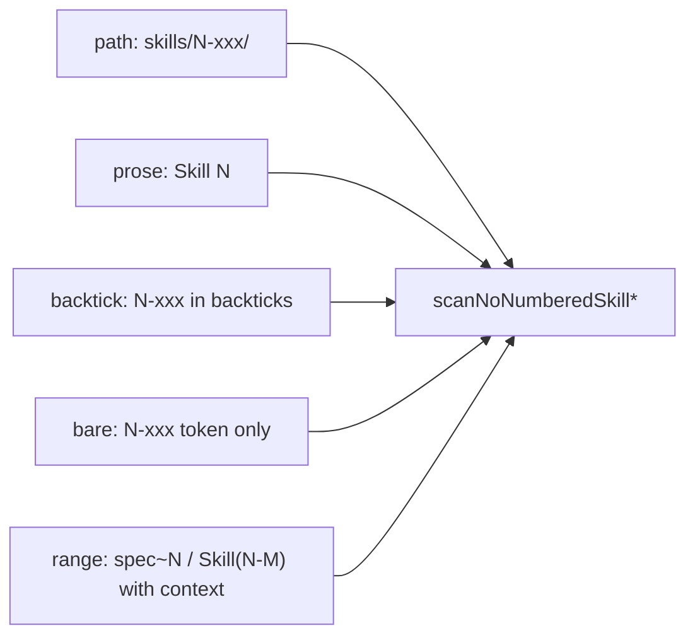

# 编号 skill 彻底清扫（含区间缩写）

> **SSOT**：本文件为当前有效 plan。已作废 [`编号_skill_残留清扫_55fe6550.plan.md`](编号_skill_残留清扫_55fe6550.plan.md)（最小档 + 「故意保留桶」）。
> 版本窗口：`version: 2.4.0`（不 bump）。吸收 Review 两轮意见。**purge_everywhere** 指清扫**死引用**（已不存在的编号路径、散文缩写）；**不删**运行时 backward-compat alias 代码与对应 MIGRATION 文档行。

## 死引用 vs 活 alias（Review 二轮，BLOCKER 概念）

| 类别 | 示例 | 处置 |
|------|------|------|
| **死编号路径** | `skills/3-coding/`、`.cursor/skills/3-coding/`、`spec~6` 散文 | Phase A **改/删**；扫描器 **命中** |
| **活编号 alias** | [`profile-skill-assets.ts`](harness/scripts/utils/profile-skill-assets.ts) L29–32；[`MIGRATION.md`](MIGRATION.md) `profile-skill-asset` 对照表行（含 `` `1-spec` `` / `` `2-plan` ``） | **代码与文档均保留**；扫描器 **文件级 exclude**（ts）+ **内容匹配豁免**（MIGRATION，见 Phase B；**禁止硬编码行号**） |
| **纯语义 legacy** | `prd-design` → `spec`（无数字前缀） | 文档可保留；`bare` kind **不匹配** |

## Review 结论（已核实）

Review 指出的盲区**成立**：当前 [`no-numbered-skill-scan.ts`](harness/scripts/utils/no-numbered-skill-scan.ts) 仅 `kind: path | prose`，`NUMBERED_PROSE_RE` 只匹配 `Skill N`，**抓不到**区间缩写。若只执行旧 plan C+D，会**假绿**。

### 已确认漏网（发布根内，Phase A 必改）

| 文件 | 形态 | 建议改写 |
|------|------|----------|
| [`skills/feature/code-review/SKILL.md`](skills/feature/code-review/SKILL.md) L1 | `` `4-code-review` `` | `` `code-review` `` |
| 6× feature SKILL.md L7 | `` `00-framework-init` `` label | `` `framework-init` `` |
| [`agents/claude/adapter.yaml`](agents/claude/adapter.yaml) L80 | `spec~6` | 六篇 feature skill 语义名或 slash 列举 |
| [`skills/reference/harness-cli-cwd.md`](skills/reference/harness-cli-cwd.md) L81 | `spec～6` | `spec→device-testing 六阶段闭环` |
| [`skills/project/catalog-bootstrap/SKILL.md`](skills/project/catalog-bootstrap/SKILL.md) L21 | `Skill（1~6）` | 「六篇 feature 阶段 Skill」 |
| [`docs/overview.md`](docs/overview.md) L200 | `★00-init · 0-catalog · 1～6` | 纯语义名列举 |
| [`docs/overview.md`](docs/overview.md) L224 | `3-coding` 等 inline | cleanup-deprecated 改纯语义旧名 |
| [`docs/overview.md`](docs/overview.md) L423 | `# Step 1 ~ 6` | 列 `/spec`…`/device-testing`，去掉 skill 编号暗示 |
| [`docs/skills/business-ut.md`](docs/skills/business-ut.md) L132 | `spec～4` | 列出 spec/plan/coding/code-review |
| [`docs/concepts/extensibility.md`](docs/concepts/extensibility.md) L113 | `3-coding` / `1-prd-design` | 纯语义旧名（prd-design、requirement-design） |
| [`agents/README.md`](agents/README.md) L58 | `3-coding` / `1-prd-design` | 同上 |
| [`skills/project/framework-init/SKILL.md`](skills/project/framework-init/SKILL.md) L180 | `3-coding` / `1-prd-design` | 同上 |
| [`MIGRATION.md`](MIGRATION.md) L651 | `spec～6` | 语义叙述 |
| [`MIGRATION.md`](MIGRATION.md) §v2.3.0 | 编号路径对照表 L126–144 | **降级**为一句：「旧编号目录已全部扁平化，见下方语义 alias 与现行 layout」+ 现行路径说明（不保留逐行 old→new 表） |
| [`MIGRATION.md`](MIGRATION.md) L154、L721 | `.cursor/skills/3-coding/` 等举例 | 改 `.cursor/skills/coding/` 等扁平举例 |
| [`MIGRATION.md`](MIGRATION.md) `profile-skill-asset` 对照表 | `1-prd-design` / `1-spec` / `2-plan` 等 | **保留**（与 `profile-skill-assets.ts` 对齐；Phase A 删 L126–144 后行号会上移，扫描豁免用**内容规则**不用行号） |

**保留不动**：[`agents/claude/adapter.yaml`](agents/claude/adapter.yaml) L81、[`agents/README.md`](agents/README.md) L52–55 的 `skills/<n>/` —— 路径占位符，非编号 skill id。

## 勿误清（Review §IV + 二轮，扫描器须显式排除）

- **Harness 阶段计数**：meta-stage 输出、stage 序号（非 skill id）
- **数量/议题编号区间**：`3-6 items`、`responsibilities 3-6`、`infer-module-card 3-6`；[`docs/atomic-service-roadmap.md`](docs/atomic-service-roadmap.md) L107 `议题 2.1～2.6`（roadmap 小节号，非 skill）
- **版本号区间**：semver / 文档小节号中含 `N～M` 子串
- **[`docs/skills/phase6-keyword-allowlist.md`](docs/skills/phase6-keyword-allowlist.md)**：`Phase 6` = 文档批次清理概念，非 skill 编号
- **[`skills/feature/business-ut/SKILL.md`](skills/feature/business-ut/SKILL.md)** 内 `Step 1~3`：用例编写步骤，非 skill 区间
- **历史/工具数据**：`.cursor/plans/**`（实施前快照）、`RELEASE-NOTES*`、`openspec/changes/archive/**`、`harness/tests` fixtures、迁移脚本 `utf8-rename-*.mjs` / `restore-*.mjs`
- **扫描器自排除（legacy 词表常量）**：[`no-numbered-skill-scan.ts`](harness/scripts/utils/no-numbered-skill-scan.ts)、[`legacy-skill-bridge-cleanup.ts`](harness/scripts/utils/legacy-skill-bridge-cleanup.ts)
- **运行时 alias SSOT（活编号，不可删）**：[`profile-skill-assets.ts`](harness/scripts/utils/profile-skill-assets.ts) L25–41 — **整文件 exclude**
- **活 alias 文档镜像**（MIGRATION `profile-skill-asset` 表行）：**内容匹配豁免**（见下节 `LIVE_ALIAS_DOC_RULE`）；禁止 `L718–719` 等硬编码行号（Review 四轮：Phase A 改 L126–144 后行号漂移 ~15–20 行）
- **prd/design phase alias 区**（MIGRATION）：profile-skill-asset 对照表与代码 SSOT 对齐

## 扫描器 SSOT 扩展（五 kind）

在 [`harness/scripts/utils/no-numbered-skill-scan.ts`](harness/scripts/utils/no-numbered-skill-scan.ts) 统一 legacy 词表，扩展 `ScanHit.kind`：



**bare 分支**（Phase B 钉死，仅枚举数字前缀形态；**不匹配**纯语义 legacy）：

```text
\b(?:00-framework-init|00b-framework-setup|0-catalog-bootstrap|[1-6]-(?:spec|plan|coding|code-review|business-ut|device-testing))\b
```

- 命中：`` `4-code-review` ``、裸 token `1-spec` / `2-plan`（enum 内）
- 不命中：`1-prd-design`、`2-requirement-design`（后缀不在 enum）；`prd-design`、`requirement-design`（无数字前缀）
- **活 alias 文档行例外**（Review 三轮）：MIGRATION `profile-skill-asset` 表含 `` `1-spec` `` / `` `2-plan` ``，与 bare 冲突 → Phase B 用 **内容匹配** 豁免（Review 四轮：**不用行号**）

**range 分支**（半角/全角 `~`/`～`/`‑`；**所有子规则均须同行上下文**，防 `[1-6][~~][0-6]` 误伤 `2.1～2.6` 等）：

| 子规则 | 正则方向 | 同行上下文（缺一不可） |
|--------|----------|------------------------|
| spec 缩写 | `spec[~~～][0-9]` | 含 `skill` / `阶段` / `feature` / check- 脚本名之一 |
| Skill 区间 | `Skill\s*[（(]\s*[0-6]\s*[~~～\-—–]\s*[0-6]` | 含 `Skill` 关键词（自带） |
| 目录树缩写 | `(?:★)?00[‑‑-]?init\|0[‑‑-]?catalog\|[1-6][~~～][1-6]` | 含 `skills/` / `Skill 正文` / `framework/` 树形注释 |
| Step 区间 | `Step\s+[0-6]\s*[~~～]\s*[0-6]` | 含 `/spec`、`/plan`、`/coding` 等 slash 或 feature skill 名 |

- **禁止**裸 `[1-6][~~～][0-6]` 无上下文匹配（Review 二轮：`atomic-service-roadmap.md` 误报根因）

同步 [`scripts/check-no-numbered-skill-release.mjs`](scripts/check-no-numbered-skill-release.mjs) 与 [`harness/scripts/check-docs.ts`](harness/scripts/check-docs.ts)；**移除** `MIGRATION.md` 整文件 prose 豁免，改为 **`LIVE_ALIAS_DOC_RULE` 内容匹配**（TS/MJS 共用 SSOT）。

### 活 alias 扫描豁免 SSOT（Phase B 必落地）

| 粒度 | 目标 | 机制 |
|------|------|------|
| 文件级 | `harness/scripts/utils/profile-skill-assets.ts` | path exclude |
| 内容级 | `MIGRATION.md` 内 `profile-skill-asset` 活 alias 表行 | **`LIVE_ALIAS_DOC_RULE`**（见下；**禁止** `file + line range` 硬编码） |
| 文档登记 | [`docs/skills/rename-tail-allowlist.md`](docs/skills/rename-tail-allowlist.md) | 「活编号 skill-id alias（MIGRATION 内容匹配）」 |

**`LIVE_ALIAS_DOC_RULE`（选用 Review 四轮方案 a：内容匹配）**：

```text
isLiveAliasDocLine(relPath, line, sectionContext):
  relPath === 'MIGRATION.md'
  && sectionContext 含近邻标题「profile-skill-asset」
  && line 匹配对照表行（含 `` `1-spec` `` 或 `` `2-plan` `` 或 `` `1-prd-design` `` / `` `2-requirement-design` ``）
```

- bare/backtick 扫描：若 `isLiveAliasDocLine` → skip
- **漂移断言**（Review 四轮，Phase B 单测必含）：启动时对当前 `MIGRATION.md` 跑 `LIVE_ALIAS_DOC_RULE`，**至少命中 2 行**且每行须含 `` `1-spec` `` 或 `` `2-plan` ``；命中 0 行 → **测试 FAIL**（alias 表被挪走/改名时 loudly break，禁止静默假绿/假红）
- **备选方案 b**（未选用）：`<!-- live-alias-allowlist:start/end -->` 哨兵注释；若内容匹配维护成本高再切换

## 实施顺序

### Phase A — 发布根文案（BLOCKER：宿主 init）

1. [`code-review/SKILL.md`](skills/feature/code-review/SKILL.md) 标题 + 6× feature label
2. 上表区间/缩写 + inline legacy 逐处改语义叙述
3. [`MIGRATION.md`](MIGRATION.md) §v2.3.0：L126–144 对照表 → 一句降级 + 现行 layout；**保留** `profile-skill-asset` 活 alias 表（行号会变，不影响 Phase B 内容规则）；举例路径改扁平 id
4. [`docs/skills/rename-tail-allowlist.md`](docs/skills/rename-tail-allowlist.md) 更新库存与误报登记口径

### Phase B — 扫描器 + 门禁

1. 五 kind + 误报排除：文件 exclude `profile-skill-assets.ts`；MIGRATION **`LIVE_ALIAS_DOC_RULE` 内容匹配** + **漂移断言**
2. 单测：负例含 MIGRATION 活 alias 表（bare 不报错）、`atomic-service-roadmap` 议题号、`prd-design`；**漂移断言**命中 ≥2 行且含 `` `1-spec` ``/`` `2-plan` ``
3. release 打包断言与 `check-no-numbered-skill-release.mjs` 对齐

### Phase C — 验收（广撒网，防假绿）

1. **自动化**：`cd harness && npm test` + `npm run release:verify`
2. **广撒网人工对照**（发布根）：

```bash
rg -n "spec[~~～][0-9]|Skill\s*[（(][0-9]|★00|[1-6][~~～][0-6]|`[0-9]-|00-framework-init|4-code-review|skills/[0-9]" skills docs agents harness MIGRATION.md README.md
```

3. 逐条：**真残留 → 改**；**误报 → exclude 或 rename-tail-allowlist**；直至仅剩允许项
4. **consumer 冒烟**：framework 子目录下 `check:docs` / init 不因 `(4-code-review)` 或 `spec~6` BLOCKER

## 与旧 plan 差异

| 旧 plan（55fe6550，已作废） | 本 plan |
|---------------------------|---------|
| 「故意保留」MIGRATION/docs 内联 legacy | purge_everywhere |
| C 仅 backtick | 五 kind（含 range） |
| D 仅 `npm test` PASS | 护栏 + 广撒网 + 误报桶签收 |
| B 可选 | 6× label 必改 |

## 风险与边界

- `docs/overview.md` L200 目录树：**清编号缩写**，改语义名
- MIGRATION：删**死路径对照表**（L126–144 降级）；**保留** profile-skill-asset 活 alias 表 + **内容匹配豁免**（非行号）
- `profile-skill-assets.ts` + MIGRATION 活 alias 表：文档与代码对齐；**漂移断言**防静默错位
- **plan 文件默认不 commit**；实施完成后再由用户决定是否入库
