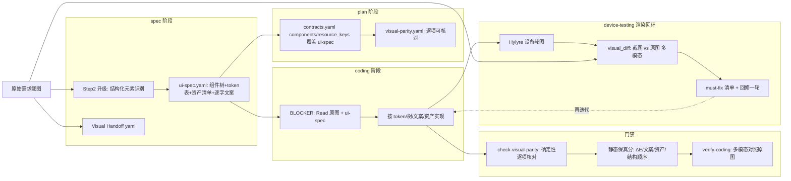

# 视觉保真管线升级（framework 级）

> 版本窗口：绑定当前在研 `package.json.version = 2.4.0`，不 bump。落地为 `.plan.md` 时 frontmatter 须写 `version: 2.4.0`。

## 1. 问题诊断（基于 temp 银行卡案例的证据）

对比四组原始需求 vs 实际实现，差异高度规律化，全部指向"信息在链路上被系统性丢弃"，而非模型画不出来：

- **品牌资产丢失**：真实银行 logo（招商/工商/中信…）→ 全是同一个占位"卡片图标"。模型手里没有 logo 资产，只能造占位符。
- **品牌主题色丢失**：招商页红色主题（红按钮/红勾选）→ 全局蓝。没有"每品牌一套 theme token"概念。
- **版面结构误读**：选卡半模态，原图是"储蓄卡/信用卡"各占整行+右侧勾选 → 实现挤成错乱两列。散文承载不了二维布局。
- **数据/文案保真低**："支持 100 家银行""首绑送 12 元券包"营销标签、带行名插值的协议文案 → 全变成泛化文案。

### 现有框架的三个断点（已核实）

- `skills/feature/spec/SKILL.md` Step 2「截图分析」把图**转成 5 条散文 bullet**，之后图基本被丢弃；
- `skills/feature/coding/SKILL.md` 输入表里 `spec.md` 仅"可选交叉验证"，**全文无任何"Read 原图 / 对照设计真源"指令**——编码是看着 `contracts.yaml` 盲写；
- 全流程（coding/review/ut/device-testing）**无任何"实现 vs 原图"比对**，`Visual Handoff` 只校验"图路径存不存在"。

### 业界 SOTA 对策（与诊断一一对应）

- 小红书工业级论文（arXiv 2603.01460）：把设计稿转成**带类型的层级 IR + 全局 style/token 空间**，PRD 拆解当作**以 UI 组件为实体的 NER**（7 类控件 taxonomy），再做**静态版面校验**（渲染结果 vs 设计树）。→ 对应"UI-DSL + 资产/token 表 + parity 校验"。
- WyeWorks 实践：`prompt < context < feedback-loop engineering`；专门的 **asset-extractor agent**（下载 logo/SVG、稳定本地路径）+ **确定性 QA**（从设计稿提取数值，按容差和渲染结果比对）。→ 对应"资产管线 + 确定性 parity 门禁"。

## 2. 目标管线（改造后）

## 3. 核心新增产物：`ui-spec.yaml`（你说的"DSL"）

每个 feature 一份 `doc/features/<f>/spec/ui-spec.yaml`，由 spec 阶段从截图结构化提取，贯穿到 coding：

- `**screens[]**`：每屏一个**组件树**（region → component → children），节点字段：`type`（取自固定控件 taxonomy，参考论文 7 类：输入/功能按钮/浮层面板/导航与页框/内容展示/列表选择/逻辑条件）、`layout`（排列方向、对齐、整行 vs 分栏、占比）、`order`（同级顺序）、`text`（**逐字文案**，禁止泛化）、`data_binding`、`style_ref`（指向 token）、`asset_ref`（指向资产）、`**bbox`/相对几何**（在**原图**中的归一化坐标框，是**原图侧 ground truth**——供 F 渲染 diff 的几何 IoU 与人工核对用；**注意：ArkUI 最终几何运行时解析，不能拿它跟代码做静态 IoU**，静态侧只用 `type`/`order`/`layout` 做结构与顺序匹配，见 4.K/4.F）。
- `**tokens`**：全局 + 变体 token 表——主题色（含**每品牌色**如 `brand.cmb`）、间距档位、字号档位、圆角、分隔线等，给稳定标识符。**色值来源 = 从图像区域像素采样得真实 hex，不靠模型"记得招商红=#C7000B"**；每个 token 记 `source_bbox`（采样区域）与 `value`（采样得色值）。**这是半确定性（review-r2#2）：`source_bbox` 由模型看图给出、像素采样由脚本确定**——对大块 logo/主题色区域够用，文档须如实写"区域模型给、采样脚本定"，不夸大为"全确定性"。
- `**assets[]`**：每个 logo/图标/图片 → `key` + `acquisition`（**获取方式**：`crop`（按 `source_bbox` 从原图裁出）/`svg_grab`（抓品牌矢量）/`repo_ref`（已有仓内资源））+ `resolved_path`（**真正落地的资产文件**）或显式 `placeholder: true` + `rationale`。**两层目标**：(1) 诚实——缺资产必须显式声明不静默替换；(2) **可获得性——优先真正拿到资产**（银行案例的 logo 就在原始截图里，可按 bbox 裁出），而非停在"诚实占位"。对应 review#2。

**按 P0-P3 分层提取（review-r3#3，控成本）**：逐屏全量抽（组件树+bbox+采色+逐字文案）是笔不小的 token/时间开销，弱模型尤甚。`ui-spec.md` 规范须给**分层口径**，对齐既有 P0-P3：**P0 屏出完整树 + 几何 + 采色 + 逐字文案；P2/P3 屏可只出 token/文案/资产的轻量版**（省略细粒度组件树与 bbox）。别让"抽 DSL"自己变成新瓶颈。

配套：`skills/feature/spec/reference/ui-spec.md`（DSL 规范 + taxonomy + 分层提取口径）、`harness` 下 JSON schema、`profiles/<profile>/skills/spec/templates/ui-spec-template.yaml`。

## 4. 改造点清单（按文件，framework SSOT = 本仓）

### A. spec 阶段：从散文升级为结构化 IR

- `skills/feature/spec/SKILL.md` Step 2：由"5 条散文"升级为"产出 `ui-spec.yaml`"——逐屏元素识别、原子组件拆解、按 taxonomy 分类、逐字文案、**bbox/几何与像素采样色值**、资产清单。Step 5/6 输出 + 提取产物加入 ui-spec；Step 4 自检加 ui-spec 完整性项；与 Visual Handoff 打通（`assets[].source` 引用 `authoritative_refs`）。
- **资产获取子步骤（review#2）**：Step 2 后增一步"资产落地"——对每个 `assets[]`，按 `acquisition` 真正产出 `resolved_path`：`crop` 用图像工具按 `source_bbox` 从原图裁出、`svg_grab` 抓矢量、`repo_ref` 复用现有资源；裁图能力在 hmos-app profile 以脚本 capability 提供（generic 可降级为人工/占位）。**目标是"真拿到 logo"，不是停在"诚实占位"**。
- **bbox 精度是"真获取"链的承重弱点（review-r3#1，最该盯）**：裁图与采色全吊在**模型估的 `source_bbox`** 上，而精确坐标恰是 VLM 最弱项。两个失败模式必须兜底：
  - **裁图偏 20px → 裁出半个 logo / 带白边**，`resolved_path` 拿到残缺资产，比诚实占位更糟。对策：**宽松框 + 自动 trim 边缘**；**关键资产留一道"人工确认 crop"轻 gate**（复用 DSL gate 的 `[x]` 机制）。
  - **采色框落到 logo 内白色"招商银行"字样 → 采到白色当主题色**，更阴险的是**会让 ΔE 把错色判成"已保真"（假阳性反向污染本用于抓错的指标）**。对策：**区域中位数/众数采色（非单像素）+ 过滤近白/近黑**。
  否则 M2 的价值会在 bbox 噪声上打折。上述两条兜底**随 `image-tool-spike` 一起定型**，是让 ΔE/资产可信的前提，非锦上添花。
- **图像工具选型 spike（review-r2#2，M2 前置，BLOCKER 性质）**：像素采样、bbox 裁图、CIEDE2000、**区域中位数/众数采色 + 近白近黑过滤 + 自动 trim** 都需 harness(Node) 真实图像处理。**先做一个选型 spike**（候选：`sharp` / `jimp` / `canvas` / python 边车），评估**对 [Host harness readiness](../../skills/feature/spec/SKILL.md) 的影响**——`sharp`/`canvas` 是 native 依赖，可能与"宿主 harness 零额外原生依赖"约束打架；`jimp` 纯 JS 但慢。**spike 须一并验证上面两条 bbox 兜底可实现**；通过并定型后再写成 capability，不让 A 的资产获取 / K 的 ΔE 卡在一个未落地的图像工具上。
- **DSL↔原图校验 gate（review#4，关键）**：ui-spec 是同模型从截图抽出的**新 SSOT**，抽错（如"100 家→20 家"、漏协议段）会一路"验证通过"流向下游。故在 ui-spec **生成时**加一道保真校验——人工逐屏确认（类比 spec 术语映射表的 `[x]` 确认 gate）**或**多模态核对（条件具备时）；未过不得进 plan。否则只是把"盲写"升级成"盲抽"。
- **"无 VL + 无人工"降级格（review-r2#3，必须显式覆盖）**：当**既无多模态、又无人工**校验时，ui-spec 只能标记 `**verified: unverified`**，并**连带降级整条视觉链**：(a) C 的"Read 原图"BLOCKER 对纯文本模型形同虚设，降为"尽力而为"；(b) **D 不得宣称保真**——因为 D 是"代码 vs ui-spec"对照，ui-spec 本身可能错时 D 全过等于零，故 `unverified` 下 D **只报"结构在不在"、报告显式标注"基线未校验，非保真结论"**。该状态由 §7.I 降级表驱动，**禁止**拿一份未校验 SSOT 当保真基线驱动下游。
- `specs/phase-rules/spec-rules.yaml`：新增 `ui_spec_structure`（`ui_change=new_or_changed` 时）——ui-spec 存在、每屏有组件树、token 表非空、每个 asset 有 `resolved_path` 或显式 placeholder+rationale、文案非空、关键节点有 bbox。**注意其只查"结构完整"非"对图保真"**（保真由上面的校验 gate + 4.K 静态分承担）。profile 分态（hmos-app 启用 / generic SKIP），复用 `spec-visual-handoff-check.ts` 的 provider 模式。

### B. plan 阶段：parity 从方法论升级为可核对结构

- `skills/feature/plan/SKILL.md` Step 7 Visual parity：产出 `visual-parity.yaml`，把每个 ui-spec 节点/token/资产映射到 `contracts.yaml` 的 `components`/`resource_keys`，标注允许偏差（占位图/模拟数据）。
- `specs/phase-rules/plan-rules.yaml`：新增 `visual_parity_coverage`——ui-spec 每个 asset key ↔ contracts.resource_keys，每屏节点 ↔ contracts.components。profile 分态。

### C. coding 阶段：强制读图（最关键的行为修复）

- `skills/feature/coding/SKILL.md`：输入表把 `ui-spec.yaml` + 原始需求图片（`authoritative_refs`）在 `ui_change=new_or_changed` 时升为**必需**；Step 2.5 加 BLOCKER「**必须 `Read` authoritative_refs 指向的原图文件 + ui-spec**，UI 以图与 ui-spec 的 token/tree/copy/asset 为准，禁止占位图标/泛化文案替代」；Step 5 自检加 4 项（主题色 token 已应用、真实资产 key 非占位、文案逐字、组件树吻合）；资产缺失须按资产清单显式声明 placeholder，不得静默替换。

### D. 确定性视觉 parity 门禁（option C，本期主交付）

- 新增 `harness/scripts/check-visual-parity.ts`（或并入 `check-coding`）：**确定性**核对——ui-spec asset key → 资源文件存在；color token → 资源已定义；逐字文案 → 命中资源字符串；组件树节点 → 对应 component 存在。注册 capability `coding.visual_parity`（hmos-app=script，generic=none），模式照搬 `profiles/hmos-app/harness/spec-visual-handoff-check.ts`。
- `specs/phase-rules/coding-rules.yaml`：登记该规则与严重级。
- **边界声明（review#5，必须写进规则文档与报告）**：D 查的是"**在不在**"不是"**对不对**"——一个值是蓝色但被命名为 `brand.cmb` 照样过、组件命名对但版面排错照样过。**D 抬地板（不缺 key/token/文案/节点），不等于保真**；真正的保真信号来自 4.K 的静态保真分与 F（option A）的设备渲染 diff。严禁用 D 通过制造"已保真"的安全错觉。

### K. 静态保真分（review#6，无需渲染即可量化）

- 真·CLIP 视觉相似度与**几何 IoU 需渲染（依赖设备，归 option A / 4.F）**；静态侧**只算两边都是确定值、不依赖运行时布局解析的指标**（只靠 ui-spec + 代码，不装机）：
  - **色差 ΔE**：ui-spec 像素采样色值 vs 代码资源色值（CIEDE2000）；
  - **文案 exact-match %**：逐字文案命中率；
  - **资产覆盖 %**：`resolved_path` 真落地（非 placeholder）比例；
  - **组件树结构/顺序匹配**：ui-spec 的 `type`/嵌套/`order` vs 代码组件树是否对得上（**可静态算**，能部分抓"半模态两列"这类结构错）。
- **明确剔除（review-r2#1）**：**不**做"bbox 几何 vs 代码布局约束"的静态偏差——ArkUI 的 Flex/Column/百分比/weight/padding 最终几何是运行时按设备尺寸+字体+文本长度解析的，静态读源码得不到绝对几何，硬算会产出**算不准的分数反而污染 trace 回灌信号**。真·几何 IoU 一律归 4.F（渲染后才有像素）。
- 产出**每屏保真分 + 阈值**（先给保守阈值，可调），写进 coding 报告与 `trace.json`/`gap-notes.md`——让"弱模型 trace 回灌"有**数值信号**可优化，并可作为 MAJOR/WARN 门禁。这是把"看起来差不多"变"可测量"的离线一环。

### E. 多模态语义对照（option C 的语义补充）

- `harness/prompts/verify-coding.md`：新增检查（MAJOR，多模态）——verifier 打开原图 + ui-spec + 实现代码，逐区域报告 parity（版面结构 / 品牌主题色 / 真实资产 vs 占位 / 文案保真）。并文档化"该 verifier 必须是多模态模型"（承接 `prd_图片精度无损化` 计划遗留的开放点 G）。

### F. option A：最小可用"渲染→视觉 diff→回修"闭环（本期交付，review#1）

> 用户决策（2026-06-23）：**不推迟**，本期至少交付最小可用版。复用 hmos-app 既有 Hylyre 截图能力，挂在 device-testing 阶段。这是 SOTA 主线、保真"残差闭合"的关键一环；4.K 静态分负责"别丢信息"，本回环负责"闭合残差"，两者缺一不可。

- **capability `visual_diff`（hmos-app=script/hylyre，generic=none）**：在 `skills/feature/device-testing/SKILL.md` 增一步 + 报告 schema（`doc/features/<f>/device-testing/device-screenshots/` + `visual-diff.md`）。
- **最小回环（单轮，MVP）**：
  1. 复用 device-testing 既有 build+装机产物，用 Hylyre 导航到目标屏并 `screenshot`；
  2. 多模态模型把**设备截图 vs `authoritative_refs` 原图**逐屏对照，产出 **must-fix 清单**（按区域：版面结构/品牌色/真实资产 vs 占位/文案）+ 每屏**视觉保真 verdict 与分数**（此处可拿真·渲染级相似度与**几何 IoU**——这是 4.K 静态分**拿不到**的像素/几何维度，二者互补）；
  3. **回修**：must-fix 交 agent/人工修一轮；可选再跑一轮（MVP 先单轮 + 人工决定是否再迭代，不强制全自动收敛）。
- **MVP 屏幕范围（review-r2#5）**：option A 要截图的不止首页——半模态(屏3)/短信验证(屏5)/卡详情(屏7)都要先把 app **驱动到该状态**才能截。MVP **先只覆盖可直达的顶层屏**；深层屏**复用 device-testing 既有导航**到达后再截，**不在 MVP 硬啃**深层状态编排。
- **韧性与降级（应对鸿蒙重型件）**：build/装机/Hylyre warmup 失败或无设备时，`visual_diff` **优雅降级**为 SKIP 并显式标注"设备渲染回环未执行，仅静态保真分(4.K)生效"，**不**硬 exit、不阻断其他门禁（呼应 `skill6_*` 系列已知 warmup 易碎点）。
- **与既有设计的兼容（必须显式处理，勿默默加）**：`hylyre-planned-step-fields.md` 把 `screenshot`/`dump_ui` 列为**禁止作派生测试步骤的根键**——而 `visual_diff` 是**阶段级 QA/门禁动作**（由 skill/harness 直接发起），**不是** test-plan 派生出的步骤根键，二者不冲突。落地时须在文档讲清这一区分；若实现上确需经 Hylyre 步骤通道，则为 `visual_diff` 显式登记一个**允许的 QA action**，而非放开通用 `screenshot` 步骤根键。
- **门禁档位**：MVP 阶段建议 MAJOR/WARN（产出 must-fix 供修，不直接 BLOCKER 卡死），与 enforcement 旋钮一致；成熟后可升 BLOCKER。

### G. profiles 与配置开关

- hmos-app profile：启用 `coding.visual_parity`（script）+ ui-spec 模板 + coding/spec addendum 补充（ArkUI 资源/色值/图片资产约定、token→ArkUI Resource 映射）。
- generic profile：provider=none / SKIP（文档型工程零噪声）。
- `framework.config.json` schema：新增 `spec.ui_spec_enforcement` + `coding.visual_parity_enforcement` 旋钮（镜像现有 `visual_handoff_enforcement` 四档：strict/warn/reachable/off）。**默认档 = `warn`/`reachable`，不是 `strict`（review-r2#5）**——否则启用即让所有存量 UI feature 一夜红灯（与早期 PRD 视觉保真"渐进、不一刀切"原则一致）；团队成熟后再手动升 `strict`。

### H. 回归与验证

- `harness/tests/` 增 fixtures：ui-spec 合法/非法、parity pass/fail；`cd harness && npm test` 全 PASS（AGENTS.md BLOCKER）。
- 用 temp 银行卡案例作为**激励性回归样例**写入 `ui-spec.md` 文档示例（招商红 token、bank-logo 资产清单、半模态组件树）；真正的端到端验证在消费者工程 SimulatedWalletForHmos 重跑该 feature 时完成（属下一步、跨仓）。

## 5. 诊断症状 → 改造点对照

- 占位 logo → 资产清单(3.assets) + **资产真获取(4.A 子步骤,review#2)** + 资产覆盖校验(D) + 资产覆盖%(K) + coding 读图(C)
- 全局蓝主题 → token 表含品牌色(3.tokens) + **色值像素采样而非记忆(review#3)** + token 覆盖校验(D) + 色差 ΔE(K)
- 半模态布局错乱 → 组件树+type/order(3.screens) + 结构/顺序匹配(K,静态) + 多模态版面核对(E) + 几何 IoU+渲染 diff(F,设备)
- 文案泛化 → 逐字文案(3.screens.text) + 文案命中校验(D) + 文案 exact-match%(K)
- DSL 被静默写错 → DSL↔原图校验 gate(4.A,review#4)

## 6. 实施顺序与风险

- 顺序（**以 §8 里程碑为准**，review-r4 对齐）：**M1（A/C/D/G/H）先发** → **M2（image-tool-spike → deterministic-extract/asset-acquisition/K）** → **M3（I/J/E/K2）** → **M4（F 设备渲染回环）**。其中 **C 是 ROI 最高的单点**；**I 不是全局前置**，只是 M3 多模态路径的前置（Cursor 里 composer 本就能看图，M1 不吃 I）；**F 闭合像素级残差**——K（静态、离线、always-on）与 F（设备渲染、device-testing）互补，前者"别丢信息"、后者"闭合残差"。
- 风险：(1) 多模态可用性——属 **M3**（见 §7.I 的可用性探测），**不阻塞 M1**；探测不支持则 M3 视觉语义层降级，M1/M2 的确定性能力不受影响；(2) 仓库膨胀——原图入库走 `paths.docs_committed` 策略，必要时压缩/LFS；(3) 向后兼容——新规则仅对 `ui_change=new_or_changed` 且 profile 启用时强制，老 feature 与文档型工程零影响；(4) **像素采样/裁图/ΔE 依赖图像处理工具（新基建风险）**——先做选型 spike（§4.A），native 依赖（sharp/canvas）可能撞 host-harness-readiness；spike 定型前 M2 不动工，hmos-app 以脚本 capability 提供、generic 降级为人工/占位；(5) **bbox 坐标精度（VLM 最弱项，review-r3#1）**——裁图/采色吊在模型估的 `source_bbox` 上，靠 §4.A 两条兜底（中位数采色+过滤近白黑 / 宽松框+trim+关键资产人工 gate）兜，否则反向污染 ΔE；(6) **ui-spec 提取成本（review-r3#3）**——逐屏全量抽 token/时间开销大、弱模型尤甚，靠 §3 按 P0-P3 分层提取（P0 完整、P2/P3 轻量）控住；(7) **与在研 `init_s4` 的协调（无硬冲突，文件面基本不相交）**——init_s4 改 init 编排/下一步派生/`skills.index.yaml`，本 plan 改 feature 视觉链，两者不同路径。仅两处同区域轻量协调：(a) `harness/tests/run-unit.ts` 两边都追加单测注册，后落地者 rebase 追加即可；(b) `I` 给 adapter 契约加 `multimodal` 标志位时，对齐 init_s4 刚重构的 `agent-bundle-paths.ts`/`instance-skill-bridge.ts` 之后的最新 adapter schema 形状。**本 plan 能力一律走 profile capability registry（照搬 `spec.visual_handoff`），不进 `skills.index.yaml` 的 `init_next_steps[]`，不触发 init_s4 新增的 `check-skills-index-init-steps.ts` lint。**

## 7. 多模态可用性与模型解耦（内网弱模型工程的前置条件）

> 动机：真实工程常用 **minimax 2.7 / glm 5.1** 等内网模型经 adapter 接入。本节决定这些模型能否吃到 plan 红利，是"内网弱模型工程闭环"的前提。不解决这两条，第 4 节的视觉层会退化到只剩 D（确定性门禁）+ 文本语义。

### 收益分层（先认清哪些与模型无关）

- **完全模型无关（任何模型都享受）**：D `check-visual-parity` 确定性门禁、ui-spec 结构化产物本身（资产显式 placeholder、token 表、逐字文案）。只要产物在，脚本照查照拦。
- **吃多模态能力（需 VL 形态 + 图真喂进去）**：A 的"从截图提取 ui-spec"、C 的"coding 读原图还原"、E 的"多模态对照"。

### I. 图片多模态注入通道（**M3 多模态层的前置，非全局前置**）

> review-r4 作用域澄清：`I` 只是**内网 adapter 多模态路径（M3/E）**的前置，**不是整条管线的全局前置**。Cursor 里 composer 原生看图、M1 的确定性门禁不吃 `I`，故 **M1 不依赖本节**。本节含的"可用性探测"亦随 M3 落地，不当 M1 前的全局闸。

- 现状缺口：早期 `[prd_图片精度无损化](.cursor/plans/prd_图片精度无损化_271528e1.plan.md)` 开放点 G 已指出 `harness-runner.collectContextFiles` **只喂文本**；纯文本通道下 spec 提取 / coding 读图 / 多模态 verify 都拿不到像素。
- 改造：在 `harness/harness-runner.ts` 的 `collectContextFiles`（或等价装配点）为 `spec` / `coding` / `verify-coding` 三处增加**图片字节注入**（base64 或 adapter 支持的多模态输入形态），扫描 `ui_change=new_or_changed` 对应的 `authoritative_refs` 图片。
- **前置可用性探测**：新增一个轻量探测（脚本或 init 步骤），判定当前 adapter/model 是否支持图片输入；不支持 → 自动降级到"D + 文本语义"，并在报告中显式标注"视觉多模态层已降级"，而非静默失效。
- adapter 适配：在 `agents/` adapter 契约中声明各模型的 `multimodal: true|false`，runner 据此决定喂图或降级。
- **完整降级矩阵（review-r2#3，补齐缺格）**：

| 场景           | ui-spec 来源/状态            | 视觉链行为                                                                                      |
| ------------ | ------------------------ | ------------------------------------------------------------------------------------------ |
| 有 VL         | VL 提取 + 多模态 gate         | 全链生效（A/C/D/E/K + F 视设备）                                                                    |
| 无 VL、有人工     | 弱模型/人工抽 + **人工 gate 确认** | ui-spec `verified`，A/C/D/K 生效；E/F 视多模态/设备降级                                                |
| **无 VL、无人工** | 未校验                      | **ui-spec `unverified`**：C 降"尽力而为"、**D 只报结构不报保真**、K 标"基线未校验"、E/F SKIP。**不得**以未校验 SSOT 宣称保真 |

### J. 提取模型与编码模型解耦（让弱模型也吃到红利）

- 核心：ui-spec.yaml 一旦产出即为**纯文本视觉 SSOT**。**提取（看图）**可用强多模态模型 / Cursor composer / 人工校验；**编码**交 minimax/glm **只消费文本化的组件树+token+资产 key+逐字文案**，无需自己看懂图。
- 文档化（写入 `ui-spec.md` 与 spec/coding SKILL）：推荐"**提取阶段优先 VL 模型/人工校验 → 编码阶段交内网弱模型**"的分工；明确 ui-spec 是跨模型契约，弱模型即使纯文本也能受益（小红书论文验证：喂结构化产物后纯文本模型拆解准确率仍显著提升）。
- 反模式警示：用**同一个看不到图的弱模型**跑 spec Step 2 提取 → ui-spec 本身失真（garbage in）。SKILL 中须提示此风险并给出解耦建议。

### K2. 模型选型写进 plan（review#7，你的真实变量）

- 不止"verifier 必须多模态"：**抽 DSL（spec Step 2）与 coding 读图这两个吃图步骤，本身就该指定强多模态模型**。强制一个图像 grounding 弱的模型去"Read 原图"只有边际作用。
- 在 spec/coding SKILL 与 profile addendum 写明**推荐模型档位**：吃图步骤（提取/读图/多模态 verify）用强 VL 模型；纯结构/编码步骤可用内网弱模型（与 J 解耦一致）。
- **跨模型基准**：用 temp 银行卡案例做一组跨模型对照（composer-2.5 / minimax 2.7 / glm 5.1 …），按 4.K 静态保真分打分，接入既有 `trace.json`/`gap-notes.md` 回灌闭环，量化"换模型/换档位"对保真的影响，驱动下一轮迭代。

## 8. 里程碑分组（review-r2#4；均在同一 2.4.0 窗口，按序交付）

> 版本归属（用户决策 2026-06-23）：**M1–M4 全部落在 2.4.0**，不 bump、不 `deferred_to`；除非用户主动提出升版本，否则后续修改一律同窗口。里程碑只表示**执行排序与独立可交付边界**，不是版本切分。
>
> 关键风险：**别让 M1 被 M2/M3/M4 的图像工具、多模态、Hylyre 依赖拖住**——M1 现在与它们同处一份 plan，是最大的交付风险，故显式切开、M1 先独立交付。

- **M1（模型无关 · 零新基建 · ROI 最高 · 先发）**：`A`(ui-dsl-schema/spec-step2-upgrade/spec-rules) + `C`(coding-read-image) + `D`(check-visual-parity) + `G`(profiles-config) + `H`(tests-regression)。
  - 这一刀就能消除大半差距（100→20 家、文案丢失、token 缺色），且 minimax/glm **一视同仁**（不依赖多模态注入）。**不依赖任何新基建**，应独立发出去。
  - **"模型无关"的精确含义（review-r3#2，别把话说满）**：M1 的模型无关**仅指消费侧的确定性门禁**（D 拿"代码 vs ui-spec"核对，跟什么模型无关）；**生产侧 ui-spec 仍需 VL 或人工看图抽出**。故：在 **Cursor 里开发**（composer 能看到 Read/粘贴的图）→ M1 完全自洽、直接受益；但**内网 minimax/glm 跑 M1**，在图片注入通道 `I`（属 M3）落地前**看不到图**，ui-spec 只能靠**人工抽**或走 `unverified` 降级。**内网 VL 自动抽取依赖 M3 的 `I`**——别真到内网铺现场才发现 M1 单独不能让弱模型端到端跑通。
- **M2（离线量化 · 需图像工具 spike 先过）**：`deterministic-extract` + `asset-acquisition` + `K`(static-fidelity-score)。**前置 = §4.A 图像工具选型 spike 通过**。
- **M3（多模态层）**：`I`(mm-injection) + `J`(model-decoupling) + `E`(verify-coding-multimodal) + `K2`(model-tiering-benchmark)。含"无 VL+无人工"降级矩阵落地。
- **M4（闭环）**：`F`(visual-diff-loop) 设备渲染回环（含几何 IoU、深层屏复用 device-testing 导航）。
- **DSL↔原图校验 gate（dsl-fidelity-gate）**：人工 gate 形态随 M1 落地（零基建）；多模态形态随 M3 增强。

里程碑边界即"独立可交付单元"：M1 可单独验收上线；M2 待 spike；M3 待多模态注入；M4 待设备回环。任一里程碑不阻塞前序已交付价值。