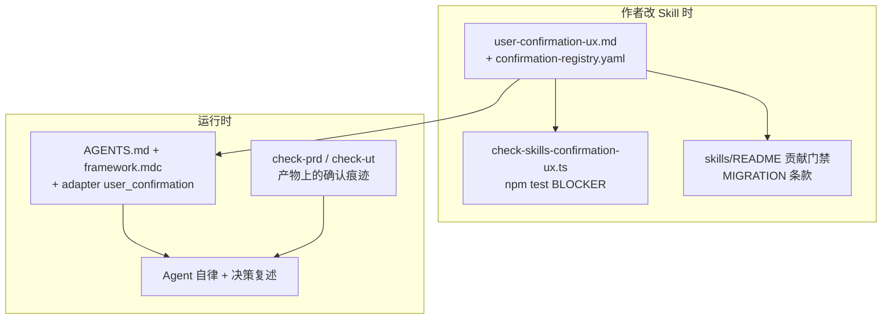
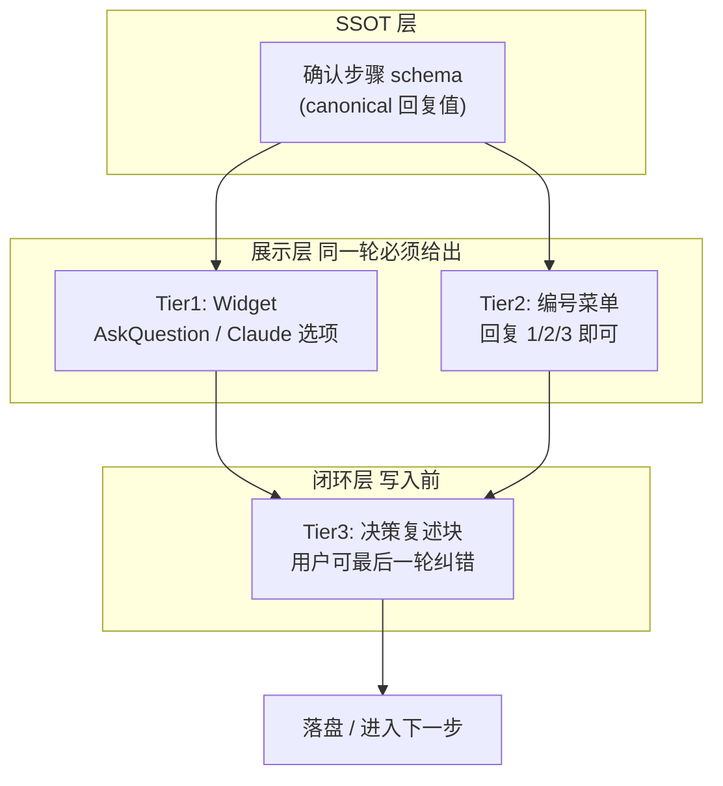

# 跨 Agent 用户确认 UX 优化方案

## 代码库现状快照（2026-05-20 重探）

**结论：plan 尚未落地**——workspace 内仍无 `user-confirmation-ux.md`、`adapter-schema` 无 `user_confirmation`、Skills 1～6 无统一编号菜单 SSOT。

### 已有、可复用的碎片（执行时锚定，不重复造轮）

| 资产 | 路径 | 现状 |
|------|------|------|
| 最完整结构化 Q | Skill 00 §0.3.4 | `Q1=y` / `all=y` / 禁止裸 `y`（v2.8.2） |
| 同层策略表 | `intra-layer-deps-confirm.template.md` | **仍强制逐行打字**（本次改造重点） |
| AskQuestion | Skill 00 §0.2.5.1 | 仅 1 处「推荐」，无 adapter 能力字段 |
| PRD 术语 `[x]` | Skill 1 + `check-prd.ts` | **唯一有 harness 的对话相关确认** |
| UT 源码授权 | Skill 5 + `check-ut.ts` | 验 gap-notes，不验话术 |
| catalog staging | Skill 0 | 口头 `y/e/s/q`，AI 翻 flag |
| 全局入口 | `AGENTS.md.template` | 术语/Scope/反假设；**无确认 UX SSOT 索引** |
| reference 目录 | `skills/reference/` | 仅有 `host-harness-readiness.md`、`harness-cli-cwd.md` |
| 近期并行改动（非本 plan） | `MIGRATION.md` v3.1、`merge-framework-config.mjs`、`check-init` gitignore 同步、harness-cli-cwd SSOT | 不改变确认 UX；vendor/init 流程更完整 |

### 全库 UX 确认触点（约 **41 处**，按 Skill）

| Skill | 触点约数 | 主要形态 | plan 动作 |
|-------|---------|----------|-----------|
| 00 init | ~10 | 编号 Q、`按默认` 表、adapter 字符串 | gate + SSOT |
| 0 catalog | ~4 | 口头 y/e/s/q | 编号映射 |
| 1 PRD | ~4 | `[x]` + 口头 | portable 辅助写回 `[x]` |
| 2 design | ~5 | 自由文 Scope 扩展、design OK | enum + freeform 辅助 |
| 3 coding | ~3 | 等待确认、A/B/C | enum |
| 4 review | ~2 | 模块名 + 报告确认 | enum |
| 5 UT | ~9 | HARD STOP ×8 | gate + freeform 辅助 |
| 6 testing | ~4 | 计划 + 打包维度 | enum |

### Skill 4 补充（原 plan 未单列 todo）

- `skill4-confirmations`：模块名确认 + 报告落盘前 enum（纳入 `full-registry-audit` 或 execution 时一并改）

## 执行范围（用户确认：一次性全改）

- **必做**：SSOT + adapter + Skill 00/0 + **Skill 1～6 全部确认点**（registry + 薄补丁）
- **原则**：`gate`/`enum`/`matrix` 能简则简；`freeform_approval` **只加** portable 速记 + 决策复述，**不删**提议正文 / 用户原话 / gap-notes 要求
- **仍不做**：运行时对话确认 harness、独立 pending-confirm 产物文件

---

## 如何防止后续改代码把原则改坏？（治理三层）

目标：**不让 Skill 作者再写出「大段表格 + 请逐行打字」**；不是（也做不到）100% 保证 agent 运行时必用 AskQuestion。



### Layer A — SSOT + Registry（规范源头）

- [framework/skills/reference/user-confirmation-ux.md](framework/skills/reference/user-confirmation-ux.md)：interaction_class、gate/enum 模板、禁止 oral OK
- [framework/skills/reference/confirmation-registry.yaml](framework/skills/reference/confirmation-registry.yaml)（新建）：每确认点一行 — `id` / `skill` / `class` / `ssot_anchor` / `allowed_prompts`
- **新增确认点流程**：先登记 registry → 再改 SKILL **只链 SSOT**（≤10 行）→ 跑 lint

### Layer B — 静态 Lint（防 regression，**推荐纳入本 plan**）

新建 [framework/harness/scripts/check-skills-confirmation-ux.ts](framework/harness/scripts/check-skills-confirmation-ux.ts)，接入 `npm test`（可挂 `--phase docs` 或 init 后段）：

**扫描范围**：`framework/skills/**/SKILL.md`、`framework/skills/**/templates/*.md`、`framework/profiles/**/skills/**/profile-addendum.md`

**BLOCKER 规则（示例）**：

| 规则 id | 检测 | 例外 |
|---------|------|------|
| `confirm_requires_ssot_link` | 含「BLOCKER」「HARD STOP」「停下来.*确认」等且描述对话确认 | 段落内须含 `user-confirmation-ux.md` 或 registry `id` |
| `no_naked_typing_menu` | 「逐行.*回复」「请按以下格式回复」且无同行/相邻 gate 编号 | §0.3.4 已合规的 `Q1=` 格式白名单 |
| `portable_menu_required` | `interaction_class: gate|enum` 的 registry 项对应 SKILL 段 | 由 registry 驱动二次校验 |
| `artifact_checkbox_unchanged` | PRD 术语段禁止删除「须为 `[x]`」 | — |

**WARN 规则**：新增 SKILL 出现「等待用户确认」但未登记 registry → 提示补 registry。

这与「不验对话」不矛盾：**验的是维护者写进 Skill 的指令质量**，类似 `check-docs` 验链接、`check-prd` 验 `[x]`。

### Layer C — 入口规则 + 贡献文档（人读）

- [AGENTS.md.template](framework/templates/AGENTS.md.template) 新 §：**凡 BLOCKER 用户确认，须 progressive enhancement（widget + portable 编号）；禁止仅要求用户打字**
- [framework.mdc](framework/agents/shared/agent-bundle/templates/rules/framework.mdc) 同条 + 指向 SSOT
- [framework/skills/README.md](framework/skills/README.md) **贡献门禁** checklist（改 SKILL 必跑 lint）
- [framework/MIGRATION.md](framework/MIGRATION.md) 增节：**新增/修改用户确认步骤**须更新 registry + SSOT，否则 CI FAIL

### Layer D — 运行时（辅助，非硬保证）

- adapter `user_confirmation` 能力声明
- verifier 可选加 1 条语义项：「是否提供 portable 编号菜单」（WARN 级，不 BLOCKER）
- 已有 `check-prd` / `check-ut` 继续守 artifact

### 不能单靠 lint 覆盖的

- Agent 运行时是否真调 AskQuestion（弱模型漂移）→ 靠 rules + spot-check + 用户反馈迭代 registry
- `doc/extensions/skills/*` 实例扩展 → lint 同样扫描 `paths.extension_dir` 下 SKILL（若存在）

---


| 层级                                   | 占比（本 plan）     | 改什么                                                                                                     | 不改什么                        |
| ------------------------------------ | -------------- | ------------------------------------------------------------------------------------------------------- | --------------------------- |
| `**framework/skills/`**              | **~70%**       | 新增 `reference/user-confirmation-ux.md` SSOT；改 Skill 00 / 0 的确认步骤与 templates；各 Skill 引用 SSOT             | Skill 业务逻辑、harness 脚本       |
| `**framework/agents/`**              | **~20%**       | `adapter-schema.yaml` + 三份 `adapter.yaml` 的 `user_confirmation` 能力段；cursor `framework.mdc` 注入 widget 纪律 | adapter 不承担确认逻辑、不写 skill 正文 |
| `**framework/templates/` + `docs/`** | **~10%**       | `AGENTS.md.template` 全局索引；`overview.md` 概念更新                                                            | —                           |
| `**framework/harness/`**             | **~10%（治理 lint）** | 新增 `check-skills-confirmation-ux.ts` + registry YAML；**只 lint Skill 文案**，不验运行时对话 | 现有 check-prd/check-ut 逻辑不变 |


**结论**：这是 **Skills 层的交互规范统一**，Agents 层只负责声明「宿主是否支持 widget」并在入口 rules 里指向 Skills SSOT——与现有设计一致（adapter 不承载 skill 逻辑）。

---

## 能否保证「整个 Framework 所有确认点」都统一？

**短答：本 plan 保证「规范 SSOT + 高摩擦点落地」；不能保证「全库每一处确认 100% 自动合规」。**

### 本 plan 直接覆盖（会改 SKILL / template / addendum）

- Skill 00 / 0：见上
- Skill 1：Step 1.5 术语 `[x]` + portable；feature 路径；PRD 冻结授权
- Skill 2：design OK；Scope 扩展（freeform+辅助）；架构 impact
- Skill 3：scope 越界停步；逐模块交付确认
- Skill 5：UT 规划清单；mock-plan；源码改动 HARD STOP（freeform+辅助）
- Skill 6：测试计划；打包维度
- 全局：`AGENTS.md` + adapter rules + registry 全表

### 本 plan 明确保留异构（仍算「统一规范」下的不同 **interaction_class**）


| 确认类型                      | 为何不同                             | SSOT 中的类                    |
| ------------------------- | -------------------------------- | --------------------------- |
| **PRD 术语映射 `[x]`**（见下节详述） | 文件 artifact 可追溯，**harness 可机器检** | `artifact_checkbox`         |
| Scope 扩展提议                | 需自然语言批准 + 写入 design              | `freeform_approval`         |
| UT 源码改动 HARD STOP         | 需描述变更 + 用户原话纪要                   | `freeform_approval` + recap |
| Skill 2 design 自检 `[ ]`   | 设计阶段 checklist，非对话菜单             | `artifact_checkbox`         |


统一的是 **交互范式 registry**（gate / enum / matrix / artifact / freeform），不是强行把所有确认都变成编号菜单。

#### 附录：PRD 术语 `[x]` 是哪里？为什么不改成对话菜单？

**流程位置**：进入 **Skill 1（PRD 撰写）→ Step 1.5 术语消歧**，在写 PRD 正文（Step 2 截图分析 / Step 3 生成）**之前** BLOCKER 停步。

**产物路径**：`doc/features/<feature>/PRD.md` 的 `**## 0. 术语映射表`** 章节（PRD 第一章，模板见 profile 的 `prd-template.md`）。

**用户要做什么**：AI 根据需求文字 + `glossary.yaml` + `module-catalog.yaml` 生成表格；用户把每行「用户确认」列从 `[ ]` 改成 `**[x]`**（可在 IDE 里改文件，也可在聊天里说「第 1、2 行确认」由 agent 写回文件）。

**关键规范出处**：

- [framework/skills/1-prd-design/SKILL.md](framework/skills/1-prd-design/SKILL.md) Step 1.5.2 第 5 步、1.5.3、1.5.4 反模式
- [framework/harness/scripts/check-prd.ts](framework/harness/scripts/check-prd.ts) `terminology_mapping_table` BLOCKER（扫描 `[x]`，未勾全则 FAIL）

**为何本 plan 不把这里改成 gate/编号菜单**：

1. **确认记录必须落在 PRD 文件里**——Skill 2/3、code review、后续同事打开 PRD 都能看到「哪条术语映射已被用户批准」，聊天里的 `1/2/3` 不会进 git 历史。
2. **已有机器门禁**——`check-prd.ts` 只认文件中的 `[x]`；若改成纯对话确认，要么改 harness（本 plan 明确不做），要么对话与文件双轨更容易漂移。
3. **逐条语义不同**——每行可能是 high/medium/low 置信度、易混项、候选 Top-3，用户常需「第 2 行改成模块 B」而非统一选「全部按默认」；artifact 表格比单行 enum 更合适。
4. **已有反模式防护**——Skill 1 明确禁止「聊天里说 OK 但没改 `[x]` 就继续」；这正是 init 里 oral OK 事故的 PRD 侧解法。

**与 init 对话菜单的关系（不是退步）**：


| 维度      | init Step 3.x   | PRD Step 1.5     |
| ------- | --------------- | ---------------- |
| 确认载体    | 对话（+ 可选 widget） | **PRD.md 文件表格**  |
| harness | 不检对话            | **检 `[x]`**      |
| 典型操作    | 「全部按默认」一次搞定     | 逐条勾 `[x]` 或逐条改映射 |


**Phase 1 纳入（仍保留 `[x]`）**：对话侧 gate/编号辅助 + agent 写回 PRD——见 todo `prd-terminology-portable`。

**Phase 1 未改、仅 registry 登记** → **已取消**：用户选择一次性全改，上述点均纳入 execution todos。

~~原 Phase 2 列表~~（现均为 in-scope）：

**registry 全表（execution 逐条挂 SSOT）**：

- `init.*` / `catalog.staging` / `prd.terminology` / `prd.feature_path` / `prd.freeze`
- `design.scope_expansion` / `design.ok_to_code` / `design.arch_impact`
- `coding.module_batch` / `coding.scope_stop`
- `ut.plan_confirm` / `ut.mock_plan` / `ut.src_mutation`
- `testing.plan_confirm` / `testing.packaging`

### 「保证」的三层含义


| 层级                  | Phase 1 能否做到       | 手段                                                     |
| ------------------- | ------------------ | ------------------------------------------------------ |
| **规范统一**            | 能                  | 单一 SSOT + registry；新确认点只登记不复制                          |
| **高摩擦路径体验统一**       | 能（init 为主）         | Step 3.x gate、adapter enum 等具体改造                       |
| **全库每一处执行 100% 合规** | **仍不能**（无 harness） | 本次全改 Skill 文案 + spot-check；长期仍靠 verifier 抽检或轻量 harness |


用户已选 **一次性全改**；执行时遵守上文风险矩阵，**freeform 不 enum 化本质**。

与现有 Framework 哲学一致：PRD `[x]` 靠 harness 检结构，对话确认靠 Skill BLOCKER + agent 自律；本 plan 在对话侧加 **portable 编号菜单 + 决策复述**，不引入确认产物文件。

## 问题根因（你截图里的两种形态）


| 形态                       | 来源                                                                                                                                                                                             | 体验                     |
| ------------------------ | ---------------------------------------------------------------------------------------------------------------------------------------------------------------------------------------------- | ---------------------- |
| **上：Markdown 表格 + 逐行打字** | [Step 3.x BLOCKER](framework/skills/00-framework-init/SKILL.md) 强制引用 [intra-layer-deps-confirm.template.md](framework/skills/00-framework-init/templates/intra-layer-deps-confirm.template.md) | 可移植、纪律强，但摩擦高           |
| **下：编号菜单 + 键盘选择**        | Agent 自行发挥（Claude Code 原生选项 UI / Cursor `AskQuestion`），**非 Framework SSOT**                                                                                                                    | 体验好，但不稳定、其他 agent 无法复现 |


Framework 现状：**没有统一的 portable vs widget 抽象**；仅 Step 0.2.5.1 有一句「推荐 AskQuestion」；[adapter-schema.yaml](framework/agents/adapter-schema.yaml) 无交互能力字段；[overview.md §2.3.1](framework/docs/overview.md) 只笼统写「对话式确认」。

你的取舍：**Skill + adapter 能力声明为主**；**不**引入确认产物文件；chrys/codemate **走 generic + `structured_widget: unsupported`**。

---

## 设计原则：渐进增强（Progressive Enhancement）




**核心契约**（写入新 SSOT，各 Skill 引用而非复制）：

1. **Canonical 回复值**与展示形态解耦——无论 widget 还是编号，`全部按默认` / `1` / AskQuestion 选项 id 都映射到同一语义。
2. **Widget 可用时**：优先调 widget；**同一轮消息末尾仍附 portable 编号菜单**（chrys 用户可复制同一条消息里的编号回复）。
3. **Widget 不可用时**（generic / 内部 agent）：**只展示编号菜单**，禁止要求用户打长句。
4. **批量速记合法化**：对多行确认，允许 `全部按默认` / `all=y` 类速记（与现有 [§0.3.4](framework/skills/00-framework-init/SKILL.md) 对齐，扩展到 Step 3.x）。
5. **写入前决策复述**（已有 §0.3.4.4 模式）推广到所有 BLOCKER 确认点——这是「只靠 A 不够」的**零文件**补强。

---

## 1. 新增 SSOT：`framework/skills/reference/user-confirmation-ux.md`

定义三类确认模式与选用规则：


| 模式       | 适用                 | 用户操作                          |
| -------- | ------------------ | ----------------------------- |
| `gate`   | 多行确认的第一步           | `1` 全部维持 / `2` 逐层调整 / `3` 讨论  |
| `enum`   | 单行多选一（adapter、y/n） | `1`/`2` 或 widget              |
| `matrix` | 逐层表格（仅 gate=2 时进入） | 每行 `按默认`/`dag`/… 或 widget 子问题 |


**必须收录的确认点 registry**（后续 Skill 只链接此表，不再各写一套）：

- `init.adapter` — Step 0.2.5.1
- `init.populated_diff` — §0.3.4（已有 `Q1=y` / `all=y`，补 widget 映射表）
- `init.intra_layer_deps` — Step 3.x（**重点改造**）
- `init.toolchain_path` — profile addendum §5.6.3
- `prd.terminology` — **artifact `[x]` + portable 辅助**（Phase 1 改 Skill 1 / prd-template）
- `catalog.staging` — `y/e/s/q` 编号化（`1=y 2=e …`）

文档内附 **AskQuestion 选项 id ↔ portable 编号 ↔ canonical 值** 对照表示例。

---

## 2. 扩展 adapter 能力声明

在 [adapter-schema.yaml](framework/agents/adapter-schema.yaml) 增加可选段：

```yaml
user_confirmation:
  structured_widget: supported | unsupported   # AskQuestion / Claude 原生选项
  widget_tool_hint: AskQuestion                # cursor 填 AskQuestion；claude 填 native_options
  portable_required: true                      # 即使 supported 也必须在同轮附编号菜单
```

实例化：


| adapter                                          | `structured_widget` | 入口规则注入                                                                                                                               |
| ------------------------------------------------ | ------------------- | ------------------------------------------------------------------------------------------------------------------------------------ |
| [cursor](framework/agents/cursor/adapter.yaml)   | `supported`         | [framework.mdc 模板](framework/agents/shared/agent-bundle/templates/rules/framework.mdc) 增：**BLOCKER 确认须调 AskQuestion，且附 portable 脚注** |
| [claude](framework/agents/claude/adapter.yaml)   | `supported`         | CLAUDE.md 同源段落（经 AGENTS 模板）                                                                                                          |
| [generic](framework/agents/generic/adapter.yaml) | `unsupported`       | 明确：**禁止假设 widget**；只用编号菜单                                                                                                            |


chrys/codemate：**不新建 adapter**，实例 `agent_adapter: generic` + 在 [agents/README.md](framework/agents/README.md) 增「内部 agent 接入说明」——若宿主无 AskQuestion，行为等同 `unsupported`。

---

## 3. Step 3.x 改造（解决截图痛点）

改造 [SKILL.md Step 3.x](framework/skills/00-framework-init/SKILL.md) + [intra-layer-deps-confirm.template.md](framework/skills/00-framework-init/templates/intra-layer-deps-confirm.template.md)：

**3.x.0 Gate（默认路径，一轮搞定常见 case）**

```
请选择（回复编号；支持键盘 widget 时可直接选）：
1. 全部维持「当前值」列所示策略（等价于每层回复「按默认」）
2. 我要调整某几层（进入 3.x.1）
3. 先讨论 forbid/dag/sublayer 语义
```

- 用户选 `1` / widget 等价项 → **视为每层显式「按默认」**，满足现有 BLOCKER，无需逐行打字。
- 用户选 `2` → 进入 3.x.1，用 **matrix + 编号子菜单**（每层：`1按默认 2dag 3forbid 4sublayer`）。

**3.x.1 仅在 gate=2 时展示完整表格**（表格保留作可读摘要，不再作为唯一交互）。

**批量速记**（写入 SKILL BLOCKER 白名单）：

- `全部按默认` / `1`（在 gate 上下文）/ `all=default`

这与现有条文「『按默认』视作显式回复」一致，只是把 **80% 路径从 N 行打字降为 1 次选择**。

---

## 4. 其它高摩擦确认点同步（小步推广）


| 位置                                                                   | 改动                                                                             |
| -------------------------------------------------------------------- | ------------------------------------------------------------------------------ |
| Step 0.2.5.1 adapter                                                 | 引用 SSOT；widget 列出各 adapter；portable `1=claude 2=cursor 3=generic 4=保持当前`       |
| §0.3.4 POPULATED diff                                                | 保留 `Q1=y` 严谨性；**追加** gate：`1=all=y 2=all=n 3=逐项指定`                             |
| profile §5.6.3 toolchain                                             | 与 Step 3.x 同 gate 模式                                                           |
| [0-catalog-bootstrap](framework/skills/0-catalog-bootstrap/SKILL.md) | `y/e/s/q` 增加 `1/2/3/4` 映射（widget 不支持时仍少打字）                                     |
| **Skill 1 Step 1.5**（Phase 1 新增）                                     | gate：`1=全部确认 high 行` / `2=逐行确认` / `3=逐行修改`；逐行时 `1=确认 2=改映射`；**必须写回 PRD `[x]`** |


**扩展 scope 时才改**（见下节风险）：Scope 扩展提议、UT 源码授权等 `freeform_approval` 类——只加 portable 速记 + recap，不强行 gate。

---

## 一次性全改 Skill 1～6：有风险吗？

**有，但可控。** 风险不在「技术做不动」，而在 **改多、验少、语义被误伤**。

### 风险矩阵


| 风险                      | 严重度 | 说明                                                                   |
| ----------------------- | --- | -------------------------------------------------------------------- |
| **freeform 被过度 enum 化** | 高   | Scope 扩展、UT 改源码授权需描述性批准；强行改成 `1/2/3` 会丢「用户原话」追溯（Skill 5 约束 #12 要求纪要） |
| **BLOCKER 语义被改弱**       | 高   | 大 diff 改 8 份 SKILL 时，容易把「禁止 oral OK」改松或漏掉写回 artifact 的步骤             |
| **无 harness 验证 UX**     | 中   | 规则全在 Markdown，改再多也无法机器证明 agent 用了编号菜单；覆盖面越大，**实际合规率越难感知**            |
| **review / 合并成本**       | 中   | Skill 1～6 + 双 profile addendum，单次 PR 难 review，后续 init 改动易冲突          |
| **手验不可穷举**              | 中   | init + PRD + design + UT + testing 各走一遍不现实；只能 spot-check             |
| **假统一**                 | 低～中 | 表面都链 SSOT，但各 Skill 确认形态本不同（artifact / freeform / gate），硬套同一 UI 反而别扭  |


**扩展 scope 时仍建议改的（低风险、收益高）** — **已全部纳入 execution**

**扩展 scope 时应谨慎、只加辅助不改本质的** — **已纳入，执行约束**：

- Scope 扩展 / UT 源码授权：**必须**先展示完整提议/变更描述 → portable `1=授权 2=拒绝 3=先看 diff` → recap → 落盘/gap-notes **不得省略原话字段**

---

## 5. 入口文件与文档索引

- [framework/templates/AGENTS.md.template](framework/templates/AGENTS.md.template) §用户交互：增加 1 段链接 → `user-confirmation-ux.md` + 「写入前复述决策」+ progressive enhancement 硬性要求。
- [framework/docs/overview.md](framework/docs/overview.md) §2.3.1：「对话式确认」→「渐进增强确认」；新增 **§治理** 指向 lint + registry。
- [framework/skills/README.md](framework/skills/README.md)：reference 索引 + **贡献门禁**（改确认流程必过 lint）。
- [framework/MIGRATION.md](framework/MIGRATION.md)：新增确认点变更条款。

**轻量 harness（仅 Skill 文案 lint）**：见上文 Layer B；**不**增加对话 trace 校验、**不**增加 pending-confirm 文件。

---

## 6. 验收方式

1. **Cursor + AskQuestion**：init Step 3.x widget + portable 脚注；选「全部维持」一次完成。
2. **generic/chrys**：仅编号菜单；回 `1` 通过。
3. **纪律**： oral OK → 拒收。
4. **决策复述**：BLOCKER 后 recap。
5. **PRD 术语**：对话 `1` 后 PRD `[x]` 写回，`check-prd.ts` PASS。
6. **治理 lint**：`npm test` 中 `check-skills-confirmation-ux` PASS；故意在 SKILL 写「请逐行回复」无 gate → FAIL。
7. **registry 完整**：41 处触点均在 `confirmation-registry.yaml` 有对应 `id`。

---

## 预期效果

- Claude/Cursor：**稳定**出现键盘可选（不再依赖 agent 偶发发挥）。
- chrys/codemate：**不回退到长表格打字**，统一 `1/2/3` 少键入。
- Framework：**单一 SSOT + registry + lint 防回归**。
- 后续改 Skill：**CI 会拦**「又回到让用户打字」的写法；运行时仍靠 agent rules + artifact harness。

