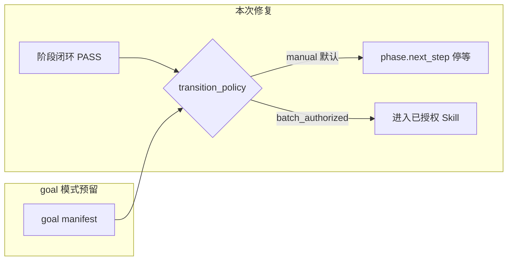

# 全阶段推进闸门排查与修复

## 背景与目标

你遇到的问题是：**coding 四件套齐全后，agent 把「可进入 Skill 4」当成「现在就进入 Skill 4」**，未等你决策。

你的**远期愿景**：结合 Claude Code / Codex **goal 模式**，在无人监管下自动串联 PRD → design → coding → review → UT → testing。

**本次应选策略（推荐）**：**「默认停等 + 可扩展批量授权」**——既不等于选项 A（永久每次必点菜单），也不等于现状（缺闸门就 autopilot）。


| 模式                   | 何时允许同轮/同 goal 进入下一 Skill                                                    |
| -------------------- | --------------------------------------------------------------------------- |
| **manual（默认）**       | 用户在本轮或可追溯消息中**明示**下一 Skill 意图，或通过 `**phase.next_step` / 既有 mid-phase 闸门**确认 |
| **batch_authorized** | 用户一条指令声明多阶段（如「对 hwp-channel 做到 review 为止」）——扩展现有 Skill 2「同时要求编码」模式到全链路      |
| **goal_mode（未来）**    | adapter / workflow manifest 声明 unattended pipeline；**本次只预留 hook，不实现**       |





---

## 排查结论：各阶段边界风险矩阵


| 边界                              | 现有闸门                                                                                                                   | 问题                                                                                                                                                                    | 严重度    |
| ------------------------------- | ---------------------------------------------------------------------------------------------------------------------- | --------------------------------------------------------------------------------------------------------------------------------------------------------------------- | ------ |
| **Init → Catalog/Glossary/PRD** | [Skill 00 Step 7.2](framework/skills/00-framework-init/SKILL.md) 固定「下一步指引」                                             | 文案像流水线顺序，弱模型可能在 init 完成后**自动开 catalog/PRD**；无 `init.next_step` 闸门                                                                                                     | 中      |
| **Catalog/Glossary → PRD**      | 无阶段间 registry                                                                                                          | 全局阶段，通常用户显式触发；风险较低                                                                                                                                                    | 低      |
| **PRD → Design**                | `prd.freeze` + [Skill 1 硬边界](framework/skills/1-prd-design/SKILL.md)                                                   | Step 5 的 freeze **早于** Step 7 harness；用户选「可进 Skill 2」后，agent 可能在 **7.3 闭环同一轮**直接开 design，**未在闭环点二次确认**                                                                | 中      |
| **Design → Coding**             | `design.ok_to_code`                                                                                                    | **规则不一致**：Step 13 硬边界写「若要先审 design **或** design 修订才须 ok_to_code」，但 Step 389 写「须与用户对齐可否进入 Skill 3」——首遍 design 可能被**跳过闸门**                                              | **高**  |
| **Coding → Review**             | **无**；Skill 4 有触发条件但 agent 忽略                                                                                          | 本次事故根因：§483「可进入 Skill 4」+ 流水线叙事 + [framework-agent-execution.mdc](framework/agents/shared/agent-bundle/templates/rules/framework-agent-execution.mdc) 只禁 FAIL 时提议下一阶段 | **严重** |
| **Review → UT**                 | **无**；[review-report-template.md](framework/skills/4-code-review/templates/review-report-template.md) 写「可直接进入 Skill 5」 | 闭环后易 autopilot 到 Skill 5                                                                                                                                              | **高**  |
| **UT → Testing**                | **无**；[Skill 5 交付摘要](framework/skills/5-business-ut/SKILL.md) 写「进入 Skill 6」                                            | 同上                                                                                                                                                                    | **高**  |
| **Testing → 结束**                | 无下一 Skill                                                                                                              | 无 autopilot 风险                                                                                                                                                        | —      |


### 共性根因（非单点 bug）

1. **「可进入 Skill X」= 资格，≠ 授权**——各 Skill 闭环段（§7.3 / Step 13.3 等）措辞误导弱模型。
2. **Stop hook 只管「假完成」**，不管「擅自开下一阶段」。
3. **[framework-agent-execution.mdc](framework/agents/shared/agent-bundle/templates/rules/framework-agent-execution.mdc) 不对称**：只写 harness FAIL 时禁止提议 Skill 4，**未写 PASS 时禁止自动启动下一 Skill**。
4. **confirmation-registry 缺口**：Skill 1–2 有部分 mid-phase 闸门；Skill 3→4→5→6 **无 `*.ok_to_*` 闭环闸门**。
5. **认知偏差**：RELEASE-NOTES/overview 称「流水线」，与 [harness-runbook.md](framework/docs/operations/harness-runbook.md)「Harness 不是开发流水线」矛盾。

---

## 解决方案（分三层）

### Layer 1 — 全局 SSOT（必做）

在 [user-confirmation-ux.md](framework/skills/reference/user-confirmation-ux.md) 新增 **§8 阶段边界推进（BLOCKER）**：

- **阶段闭环（四件套 PASS）只证明当前 phase 完成，不授权下一 Skill。**
- **默认 `transition_policy=manual`**：须满足以下**任一**才可启动下一 Skill：
  1. 用户消息含下一 Skill **触发意图**（各 SKILL「触发条件」关键词）；
  2. 用户消息含 **batch 多阶段意图**（见 Layer 2 白名单句式）；
  3. 用户通过 `**phase.next_step`** 或既有 mid-phase 闸门（`prd.freeze` / `design.ok_to_code`）确认；
  4. （预留）`workflow.auto_chain` / goal manifest 为 `enabled`（本次仅文档占位）。
- **禁止**：读完 `phase-completion-receipt.md` 或 trace 后**在同一 agent 执行流**自动 Read 下一 Skill 并开干。

同步更新 [AGENTS.md.template](framework/templates/AGENTS.md.template) §6 或新增 §3.8 短索引（≤5 行，细节链 SSOT）。

更新 [framework-agent-execution.mdc](framework/agents/shared/agent-bundle/templates/rules/framework-agent-execution.mdc)：


| 新增行                      | 错误                       | 正确                                           |
| ------------------------ | ------------------------ | -------------------------------------------- |
| harness PASS 后 autopilot | 闭环后直接读 Skill 4 并写 review | 汇报闭环摘要 + `**phase.next_step` 停等**（manual 默认） |
| 误读 receipt               | 「回执写下一步是 review」         | 回执只证完成，不证授权                                  |


### Layer 2 — 补齐 registry + widget（必做）

在 [confirmation-registry.yaml](framework/skills/reference/confirmation-registry.yaml) 新增 **统一闭环闸门** `phase.next_step`（enum，各 phase 复用，options 随当前 phase 变化）：


| registry id       | 适用 closure                  | portable 示例                            |
| ----------------- | --------------------------- | -------------------------------------- |
| `phase.next_step` | 任一 feature phase 四件套 PASS 后 | `1=进入下一 Skill` / `2=暂停` / `3=指定其它（说明）` |


并为缺失边界增加 **专用 id**（便于 goal 模式按 phase 授权）：


| 新 id                  | 边界              | widget 文件                                    |
| --------------------- | --------------- | -------------------------------------------- |
| `coding.ok_to_review` | coding → review | 新建 `skill3-coding-options.md` § ok_to_review |
| `review.ok_to_ut`     | review → UT     | 新建 `skill4-review-options.md` § ok_to_ut     |
| `ut.ok_to_testing`    | UT → testing    | 新建 `skill5-ut-options.md` § ok_to_testing    |


**PRD/Design 修正（非新增 id）**：

- **Skill 2**：将 Rule 4 中「若要先审 design 或 design 修订才须 ok_to_code」改为 **每次 Step 13.1 PASS 后 MUST `design.ok_to_code`**（与 Step 389 对齐）。
- **Skill 1**：在 Step 7.3 闭环段补充——`prd.freeze` 只表示 PRD 内容冻结；**除非 batch 授权，闭环后仍须 `phase.next_step` 或用户明示开 design**（避免 Step 5 早授权被误读为「harness 一过就开 design」）。

**batch 多阶段白名单**（写入 user-confirmation-ux §8.2，扩展现有 Skill 2 模式）：

- 示例：「做到 review」「PRD 到 UT」「全链路交付」「coding 并 review」
- 解析为 `transition_policy=batch_authorized`，允许在**已声明范围内**连续执行，**超出范围仍停等**

### Layer 3 — 各 Skill 文案与模板（必做）

逐文件把 **「可进入 Skill X」** 改为 **「具备进入 Skill X 的资格；默认须 `phase.next_step` 或用户/batch 明示授权」**：


| 文件                                                                                              | 改动要点                                                                             |
| ----------------------------------------------------------------------------------------------- | -------------------------------------------------------------------------------- |
| [3-coding/SKILL.md](framework/skills/3-coding/SKILL.md)                                         | §483、交付摘要「下一步」、Step 7 收尾增加 `**coding.ok_to_review` / `phase.next_step` BLOCKER** |
| [4-code-review/SKILL.md](framework/skills/4-code-review/SKILL.md)                               | 触发条件增加：**「上游 coding 闭环 alone 不触发」**；§317 改资格表述 + `review.ok_to_ut`               |
| [5-business-ut/SKILL.md](framework/skills/5-business-ut/SKILL.md)                               | 交付摘要去掉暗示 autopilot 的「进入 Skill 6」；§644 + `ut.ok_to_testing`                       |
| [1-prd-design/SKILL.md](framework/skills/1-prd-design/SKILL.md)                                 | §390 + Step 7.3 闭环停等                                                             |
| [2-requirement-design/SKILL.md](framework/skills/2-requirement-design/SKILL.md)                 | 统一 ok_to_code 为 unconditional                                                    |
| [review-report-template.md](framework/skills/4-code-review/templates/review-report-template.md) | 「可直接进入 Skill 5」→「若需 UT，请明示或确认 `review.ok_to_ut`」                                 |


**Verifier 补强**（可选但建议）：在 [verify-coding.md](framework/harness/prompts/verify-coding.md) / 各 verify-*.md 增加 MAJOR：`phase_transition_autopilot`——若对话显示闭环后立即开下一 Skill 且无授权，判 WARN/FAIL。

### Layer 4 — Lint + 测试（必做）

扩展 [check-skills-confirmation-ux.ts](framework/harness/scripts/check-skills-confirmation-ux.ts)：

- 各 Skill 闭环段须引用 `phase.next_step` 或对应 `*.ok_to_`*
- 禁止闭环段仅写「可进入 Skill N」而无停等语句
- registry ↔ widget SSOT 一致性

新增 unit test：`phase-transition-policy.unit.test.ts`（batch 白名单解析、manual 默认）。

### Layer 5 — goal 模式预留（本次只文档，不实现）

在 [framework/docs/concepts/](framework/docs/concepts/) 或 [workflows/spec-driven.workflow.yaml](framework/workflows/spec-driven.workflow.yaml) 注释段预留：

```yaml
# future: transition_policy: goal_mode | batch_authorized | manual
# future: auto_chain: [prd, design, coding, review, ut, testing]
```

说明：goal 模式下 adapter 在会话开始时注入 `batch_authorized` 范围，**复用同一套 registry id**，无需再改 Skill 正文逻辑。

---

## 实施顺序

1. SSOT：user-confirmation-ux §8 + AGENTS + framework-agent-execution
2. registry + widget options（3 个新 id + phase.next_step）
3. Skill 1–6 闭环段与模板措辞
4. check-skills-confirmation-ux + unit tests
5. render 下发到 `.cursor/rules/`（经 Skill 00 模板源，不手改实例）

---

## 验收标准

- manual 默认：coding 闭环后 agent **不得**自动 Read Skill 4；须展示编号菜单并停等
- batch：用户说「hwp-channel coding 并 review」可在授权范围内连续执行
- design 首遍也须 `design.ok_to_code`
- `cd framework/harness && npm test` 全绿
- **不新增 RELEASE-NOTES**（除非你另行授权）

---

## 明确不在本次范围

- goal 模式 adapter 实现、Stop hook 物理拦截下一阶段
- WalletForHarmonyOS 实例实跑
- 修改已发生的 hwp-channel review 产物（若需撤销由你决定）

