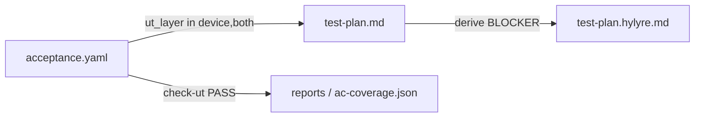

# 验收分层 SSOT（acceptance-layering）

> 本文定义 `acceptance.yaml`、`test-plan.md`、Hylyre 派生计划与 harness 过程回执之间的**权威边界**。
> 自 Framework v2.9 起，**废弃** `device-testing-todo.md` 作为 Skill 5→6 交接物。

---

## 1. 三层 SSOT

| 层 | 文件 | 写入者 | 消费者 |
|----|------|--------|--------|
| **验收定义** | `doc/features/<feature>/acceptance.yaml`（`ut_layer`、`ut_focus`、`device_focus`） | Skill 1 + 用户确认 | Skill 3/5/6、harness 追溯 |
| **执行计划** | `doc/features/<feature>/testing/test-plan.md` | Skill 6（从 acceptance **按 device 层过滤**派生） | 人审、derive-hint、Hylyre |
| **自动化派生** | `testing/reports/<ts>/hylyre/test-plan.hylyre.md` | Skill 6 Step 4.5 | `device_test.run`（**已有 BLOCKER SSOT**） |
| **过程回执** | `ut/reports/ac-coverage.json`、`testing/reports/**/trace.json`、`device-test-timing.json` | harness / Hylyre | 可选引用，**非 SSOT** |

**禁止**：与 `acceptance.yaml` 同语义的平行清单 `device-testing-todo.md`。

**保留**：`testing/test-plan.md`（canonical；读侧兼容 feature 根下旧 `test-plan.md`）不是多余文件——它是带 TC 编号、优先级、Hylyre JSON 映射的**执行层**；要少的是 **todo**，不是 **test-plan**。

---

## 2. 字段契约（acceptance.yaml）

| 字段 | 何时必填 | 说明 |
|------|----------|------|
| `ut_layer` | 每条 criterion / boundary **必填** | `unit` / `device` / `both` |
| `ut_focus` | `unit` 或 `both` | UT 可断言的业务关切；**both 禁止**把 UI 要点只写进 ut_focus |
| `device_focus` | `device` 或 `both` | 真机可观察要点（导航、Toast、布局、性能等） |

**脚本门禁**（`check-acceptance.ts`，prd / design / ut / testing 共用）：

- `acceptance_yaml_present`
- `acceptance_ut_layer_complete`
- `acceptance_device_focus_present`
- `legacy_device_testing_todo_deprecated`（存在旧 todo → **WARN**）

---

## 3. Skill 6 输入档位

| 模式 | 最小输入 | harness |
|------|----------|---------|
| **标准 feature** | `acceptance.yaml`（含 device/both + `device_focus`）、`PRD.md`、`design.md` | 全量 `testing` |
| **降级** | `acceptance.yaml` + `PRD.md`（无 design） | 可 WARN，仍可派生粗 plan |
| **即席 `_adhoc`** | bundle + 步骤 | **不跑** feature `testing` 全套门禁 |

`compat.yaml` 仅覆盖 **prd～ut**，**不含** testing 阶段。

---

## 4. 与 Hylyre / test-plan 已有门禁的关系

以下能力**已落地**，本分层方案**叠加**而非替代：

- 顶层 `test-plan.md` ↔ 派生 `test-plan.hylyre.md` 覆盖（含 `explicit_skip_tc_ids`）
- 派生 plan **stale**（`test-plan.md` mtime > hylyre 派生）
- NAV-001/002/003 静态 lint

**本方案新增**：

- `acceptance_to_test_case` 分母仅 `ut_layer ∈ {device, both}` 的 P0/P1
- `test_plan_freshness_vs_acceptance`：`acceptance.yaml` 新于 `test-plan.md` → BLOCKER
- plan 若关联 `ut_layer=unit` 的 AC → **WARN**（鼓励从 plan 剔除）

---

## 5. Skill 5 与 L3 处置

- Skill 5 **不再**产出 `device-testing-todo.md`。
- `testability-audit` 中 `selected: option_a`（不可测、交真机）→ 须在 **acceptance 对应条目的 `device_focus`** 中可追踪（含 `acceptance_id` 引用），由 `check-ut` 校验。
- UT 结束后 harness 可写出 `ut/reports/ac-coverage.json`（机器回执，**非** acceptance 手改）。

---

## 6. 迁移（存量 feature）

1. 为每条 `ut_layer ∈ {device, both}` 的 AC/BD 补 `device_focus`（从旧 todo 搬迁要点）。
2. `both` 项拆分 `ut_focus`（业务）与 `device_focus`（UI）。
3. 按 Skill 6 从 acceptance 重派生 `test-plan.md` + hylyre（利用新鲜度门禁）。
4. 删除 `device-testing-todo.md`。

存在旧 todo 且无 `device_focus` 时 harness **WARN**，不 BLOCKER 存量。

---

## 7. 相关文档

- [5-business-ut.md](../skills/5-business-ut.md)
- [Skill 6 profile addendum](../../profiles/hmos-app/skills/6-device-testing/profile-addendum.md)
- [compat-protocol-v1.md](../evolution/compat-protocol-v1.md)
