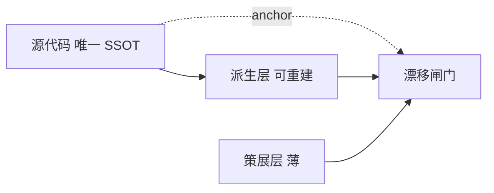

# Code Graph、flow DAG 与 Repo Map（三层术语）

> 本文是 AgentMaison **模块级功能索引**与 **需求级 UT 场景流** 的规范术语 SSOT。
> OpenSpec capability：`code-graph`（`openspec/changes/define-code-graph-concepts`）。
> 运行时门禁 SSOT 仍在 `specs/`、`harness/`、`skills/`；本文不替代代码。

---

## 1. 三层术语

| 术语 | 层级 | 用途 | 默认生命周期 |
|------|------|------|----------------|
| **Code Graph**（功能图谱） | 模块 | 索引模块核心功能节点（入口、边界、分支意图），供 PRD/design/coding/UT/device-testing **导航** | 长期维护、可增删迭代 |
| **flow DAG** | 需求（feature） | 单条业务流的 UT 场景拓扑（entry → port_call → state → assertion） | **默认 ephemeral**，不归档到 `{module}/test/dag/` |
| **Repo Map** | 全局（可选） | 跨模块轻量派生导航（文件/符号/依赖边聚合） | 后置能力，见 §6 |

**禁止**把模块级索引再称作「DAG」——避免与 Skill 5 的 flow DAG 混淆。

---

## 2. 索引唯一原则（非 SSOT）

Code Graph **不是**与源代码平行的真源：

1. **派生层（disposable）**：签名、import 依赖边、调用边等凡可由静态分析生成的内容，一律自动生成、可随时重建。
2. **策展层（thin）**：仅补代码无法表达的意图、不变量、以及 `core: true` 等标记。
3. **锚定**：每个节点须带 `file` + `symbol` + `content_hash`；消费者**必须先反查当前源码**再信任节点内容。
4. **漂移**：符号消失 → BLOCKER；签名 / core anchor 变化 → BLOCKER 或 WARN；仅函数体 hash 变化 → 提示 regenerate/review，不一变即 FAIL。



实现：`GraphExtractor` contract（framework）+ profile provider（如 hmos-app）；路径由 `paths.module_graphs_dir` 配置（默认 `<module>/code-graph.yaml`）。

---

## 3. 「dag」三重含义对照（勿与 Code Graph 混用）

| 语境 | 含义 | 与 Code Graph 关系 |
|------|------|-------------------|
| Skill 5 **flow DAG** | 需求级 UT 场景流 YAML | 不同对象；默认 ephemeral |
| Skill 3 **DAG 合规性** | 模块依赖无环（架构 DSL） | 架构约束，非功能图谱 |
| DSL **`intra_layer_deps: dag`** | 同层模块允许 DAG 型依赖策略 | 配置策略名，非 UT 产物 |

---

## 4. flow DAG 与覆盖证据（Track B）

- 小需求默认将 flow DAG 写在 `doc/features/<feature>/ut/reports/flow-dag/*.dag.yaml`，**不**写入 `{module}/test/dag/`（除非用户明确要求归档，或触及 Code Graph `core` 节点——见 `code-graph-core-closure-gate`）。
- 机器可读 **`ut/reports/coverage-evidence.json`** 登记证据来源与 AC/branch 映射。
- **证据优先级**（高→低）：归档 DAG > ephemeral DAG > `ac-coverage.json` > UT `it()` 标签。
- **in-scope** `ut_layer ∈ {unit, both}` 的 AC/branch **缺证据** → FAIL(BLOCKER) / INCOMPLETE；**仅** allowlist（无 unit/both scope、profile 禁用 UT、登记兼容降级）才 SKIP 并记原因。

详见 OpenSpec change **`ut-flow-dag-evidence`**。

---

## 5. 下游 OpenSpec 变更（2.2.0 窗口）

| change | 内容 |
|--------|------|
| `define-code-graph-concepts` | 术语 + Code Graph schema/GraphExtractor/drift 分级 + core 闭环（Skill 5 Step 8.0） |
| `ut-flow-dag-evidence` | ephemeral DAG、coverage-evidence、seam/mock registry、path-c characterization |

主蓝图（路线图/顺序）：`.cursor/plans/code-graph-ut-evolution_f8fa08ee.plan.md`（dev-only，非运行时 SSOT）。

---

## 6. 试点建图（不必手写整张 YAML）

**派生层**由工具生成；**策展层**只需补少量 `nodes`（意图 + 哪些标 `core: true`）。

在宿主工程根（`framework/` 已挂载）：

```bash
cd framework/harness
npm run bootstrap:code-graph -- --project-root <宿主根> --module <模块名> --seed-from-catalog
```

- 写入路径：`paths.module_graphs_dir`（默认 `<module>/code-graph.yaml`）。
- 已存在 YAML 时：**只刷新 `derived`**，保留已有 `nodes[]`（避免覆盖策展层）。
- `--seed-from-catalog`：仅在 `nodes` 为空时，用 catalog 的 `entry_file` / `key_exports` 生成**草稿**节点（`core: false`，须人工改 intent 并标 3–5 个 `core: true`）。
- `--dry-run`：预览统计不写盘；包路径不对时用 `--package-path <layer>/<name>` 覆盖。

漂移评估仍用库函数 `evaluateCodeGraphDrift()`；日常 `module-graph` phase / `0-code-graph` Skill 仍属后置（见下）。

### 6.1 仍后置的能力

- **Skill 全量接入图谱作导航索引**（Skill 1/2/3/6）；每次使用须反查 anchor，不得当 PRD/design/coding 事实来源。
- **全局 Repo Map**（跨模块聚合派生导航）。
- **日常维护入口**（harness-runner `--phase module-graph`、专用 Skill、CI drift 阶段）。

---

## 7. 相关文档

- [可演进性与扩展分层](extensibility.md)
- [验收分层](acceptance-layering.md)
- [Skill 5 业务级 UT](../skills/5-business-ut.md)
