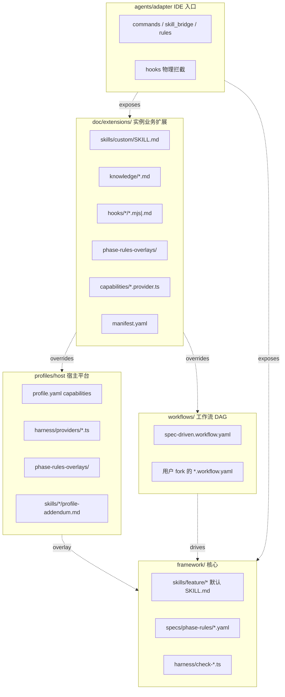

# Framework 可演进性与扩展分层

本文描述 framework **三层叠加扩展模型**：在不引入物理 `framework/core/` 目录的前提下，如何用声明式 workflow、宿主 profile、IDE adapter 与实例侧 extension 接入业务知识与门禁。

模块级 **Code Graph** / 需求级 **flow DAG** 术语见 [code-graph.md](code-graph.md)。

---

## 合并顺序（overlay precedence）

自上而下争权（**后者覆盖前者**）：**实例 `doc/extensions`** > **`workflows/` 中选定的 DAG** > **profile**（`profiles/<name>/`）> **framework 仓库默认**。

与顶层 [README 逻辑分层](../../README.md) 表内「自底向上叠加」四句同义：先落 framework 默认，再叠 profile、workflow、instance extensions；最终在**同一键**上发生冲突时按上式裁决。实现入口：[profile-loader.ts](../../harness/profile-loader.ts)（phase-rules overlay）、[extension-loader.ts](../../harness/extension-loader.ts)（manifest / capability）、[capability-registry.ts](../../harness/capability-registry.ts)（profile 宿主 toolchain 调度，如 `coding.compile` / `device_test.*`）。

```
framework 默认 → profile → workflow（active_workflow YAML）→ doc/extensions（实例根）
```

---

## 架构图（逻辑分层）



---

## 每层职责与边界（不该做什么）

| 层 | 职责 | **不做** |
|---|------|---------|
| **framework 默认**（skills / specs / harness / templates / docs） | 通用阶段流程、YAML 规则、`check-*.ts`、共享模板 | 不写具体宿主编译命令细节（交给 profile）；不写业务名词规则（交给实例 catalog/glossary/extension） |
| **profile**（`profiles/<name>/`） | 宿主 toolchain、capability provider、phase-rules overlay、Skill profile-addendum | 不写 IDE slash/跳板（交给 adapter）；不承担业务扩展包语义 |
| **workflow**（`workflows/*.workflow.yaml`） | phase DAG、`requires`、可选裁剪/重排合法 phase | 不包含业务 Markdown SOP（交给 extension）；不替换 `check-*.ts` 实现 |
| **instance extension**（`doc/extensions/`） | manifest、业务 SKILL、knowledge、hooks、可选 capability overlay | **不**修改 `framework/` 子模块源码；协议错误应在 `--phase extensions` 暴露 |
| **adapter**（`agents/<adapter>/`） | 把 Skill/extension 暴露给 Claude/Cursor 等客户端 | 不承担 harness 规则；不写 phase 校验逻辑 |

---

## 逻辑分层表（顶层目录速查）

| 路径 | 角色 | 可被宿主 fork / 扩展 |
|------|------|---------------------|
| `framework/skills/` | core：阶段 SKILL 正文 | 否（改 upstream framework）；实例通过 extension 增补 SKILL |
| `framework/specs/` | core：phase-rules、JSON/YAML schema | 否；实例通过 extension overlay / workflow |
| `framework/harness/` | core：runner、`check-*.ts` | 否 |
| `framework/templates/` | core：初始化模板 | 否 |
| `framework/docs/` | core：对外设计与概念文档 | 否 |
| `framework/workflows/` | plug-in：默认 workflow + 宿主可增加 yaml | **是**（仓库内 fork 新 workflow） |
| `framework/profiles/` | plug-in：宿主平台 profile | **是**（新 profile 目录） |
| `framework/agents/` | plug-in：IDE adapter | **是**（新 adapter 目录） |
| `doc/extensions/`（实例根） | instance-extension：业务知识/hooks | **是** |

---

## 协议 SSOT（机器可读）

扩展与工作流的契约定义于：

- [`framework/specs/workflow-schema.json`](../../specs/workflow-schema.json) — workflow YAML 校验
- [`framework/specs/instance-extension-manifest.schema.yaml`](../../specs/instance-extension-manifest.schema.yaml) — `doc/extensions/manifest.yaml`
- [`framework/specs/lifecycle-hooks-schema.yaml`](../../specs/lifecycle-hooks-schema.yaml) — lifecycle hook 事件与上下文

演进与 breaking 约定见：[extension-protocol-v1.md](../evolution/extension-protocol-v1.md)。

---

## 维护同步（2026-06-12 · 2.3.0）

- **四层模型**：framework → profile → workflow → `doc/extensions`；争权顺序不变。详见 [`../overview.md`](../overview.md) §1.3.2。
- **核心 Skill 路径**：架构图与正文统一为 `skills/feature/*`（不再使用 `skills/00..6` 编号目录表述）。
- **capability-registry**：宿主编译 / UT / 真机能力由 profile 注册，根 harness 只做编排；详见 [`../../profiles/README.md`](../../profiles/README.md)。
- **adapter 桥接**：`render-agents-md` + `instance_skill_bridge` 下发扩展 Skill；确认 UX 见 adapter **interaction-renderer** 与 [`../../skills/reference/user-confirmation-ux.md`](../../skills/reference/user-confirmation-ux.md)。
- 对照 [`DOC_INVENTORY.yaml`](../DOC_INVENTORY.yaml)：`agents/README.md` / `profile-loader.ts` / workflow 与 schema 仍为本文 SSOT。
