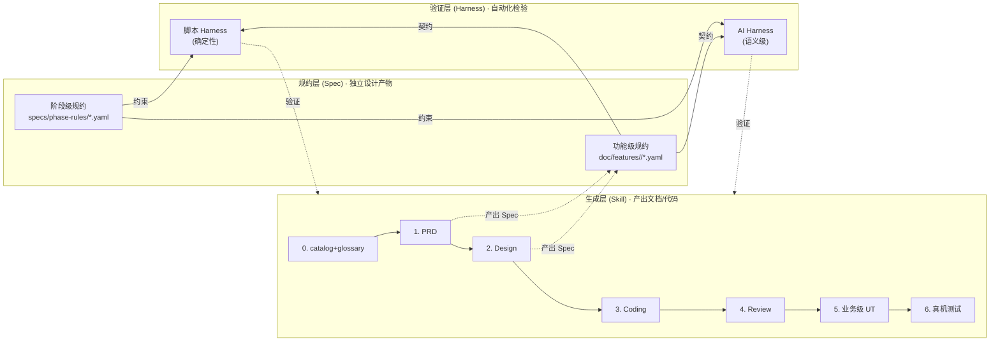
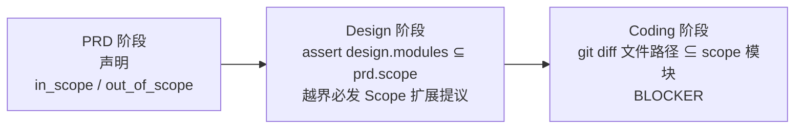

# Framework 全景介绍

> **文档角色**：面向**没接触过本 framework**的同事 / 跨部门协作者的**对外讲解**材料。
>
> **不是**：使用手册（使用手册见 [`../README.md`](../README.md) 与各 [`../skills/*/SKILL.md`](../skills/)）；
>
> **读完之后你会知道**：我们为什么要做这个 framework、它解决什么问题、怎么接入、常见坑怎么躲、未来还会往哪走。
>
> **维护规则**：本文是跨 Skill 的综述材料，不承担字段级 changelog（changelog 见 [`../MIGRATION.md`](../MIGRATION.md)）；演进到下一大版本时整体刷一遍即可。文档新鲜度由 [`DOC_INVENTORY.yaml`](DOC_INVENTORY.yaml) + harness `--phase docs` 跟踪。

---

## 目录

- [一、为什么做这个 framework](#一为什么做这个-framework)
- [二、framework 全貌与使用方式](#二framework-全貌与使用方式)
- [三、常见问题与解决方案](#三常见问题与解决方案)
- [四、未尽事宜与未来演进](#四未尽事宜与未来演进)
- [附录 · 关键文件索引](#附录--关键文件索引)

---

## 一、为什么做这个 framework

### 1.1 背景：要解决什么问题

在"**真实大型工程 + 弱模型 + 业务专有术语**"的约束下，AI 辅助开发面临的不是"能不能用"，而是"**用起来能不能不出事故**"。具体表现为三重挑战：

| #   | 挑战                          | 典型表现                                                                                                                                |
| --- | ----------------------------- | --------------------------------------------------------------------------------------------------------------------------------------- |
| C1  | **弱模型** + 超大代码仓        | 上下文 200K 量级；工程数十万 LOC；**单个一级模块都装不进上下文**                                                                         |
| C2  | **业务专有术语** 的字面相似陷阱 | 自然语言术语（如行业内"刷卡 / 卡管理 / 我的"）和模块名字面相似但归属不同；AI 没有业务先验，只能按字面相似度猜                              |
| C3  | **过程产物质量抖动**           | 同一份 Prompt + 同一份输入，不同模型产出质量差异大；弱模型还会**吞字反转语义**（"不要覆盖" 吞成 "要覆盖"），语法仍通顺、语义完全相反         |

这三项叠加的直接后果：

- 自然语言需求 → AI 选错模块 → PRD / design / coding 内部都对得上，但整条链路都在错的方向上往下走
- 写代码时因上下文缺失频繁跑偏，到 code review 阶段才发现
- UT 覆盖率看起来 80%+，线上一遇业务流程异常就炸（"声明覆盖"陷阱：`expect(list.length > 0)` 能过，业务流完全没跑）
- 凭直觉"加强校验"而不控制边界，架构文档被每个 feature 改动污染成变更日志

### 1.2 设计目标与核心约束

做 framework 时强行画了几条红线，这些红线**反过来决定了 framework 的形态**：

1. **必须在 200K 上下文内可用** —— 所有辅助资源（规约、画像、样例）总 token 预算 ≤ 30K，给需求本体留足空间；任何"把整仓丢给 AI"的思路一开始就否决
2. **必须可离线运行** —— 不依赖外部 API、不依赖向量检索服务
3. **必须显式可审** —— AI 的每一步决策过程都可以被人类快速复查，禁止"黑盒告诉你答案"
4. **模型无关 / 厂商无关 / IDE 无关** —— Spec 是 YAML、Prompt 是 Markdown、脚本是 TypeScript，不绑定任何 agent / 任何 IDE / 任何模型；同一套资产可以在 Claude Code CLI、Cursor、内网模型、未来其他 agent 里跑
5. **显式对抗字面相似 > 更强大的检索** —— 字面相似陷阱只能靠"显式枚举反例"对抗，不能靠相似度算掉（embedding 会把意思相反但字面相近的术语算得很近，反而助长误映射）

### 1.3 核心理念：三层分离



| 层                   | 定位                                                       | 物理位置                                                                                  |
| -------------------- | ---------------------------------------------------------- | ----------------------------------------------------------------------------------------- |
| **Skill（生成层）**  | 产出文档和代码；**生产者**                                 | [`../skills/`](../skills/)                                                                |
| **Spec（规约层）**   | 定义契约 / 验收标准 / 边界用例；**独立于生成和验证**        | [`../specs/phase-rules/`](../specs/phase-rules/)（阶段级） + `doc/features/<feature>/`（功能级） |
| **Harness（验证层）**| 消费 Spec，自动化检验产出是否合规；**消费者**              | [`../harness/`](../harness/)                                                              |

**为什么非要拆三层？**

- **Spec 独立**：让"验收标准"可以在没有 Harness 时就供人工审查；而 Spec 本身又是 Skill 1/2 的**产物**（PRD 产 `acceptance.yaml` / design 产 `contracts.yaml`），同时是 Skill 3/5/6 的**输入**和 Harness 的**消费源** —— 一份数据三个方向使用
- **生成与验证分离**：生成者和验证者**可以是不同模型**（甚至不同厂商），消除"考生自己批改试卷"的偏差
- **机制 > 文字**：文字里的"应该 / 禁止"靠不住，要落到 `check-*.ts` + `verify-*.md` 可执行的硬门禁

### 1.4 演进里程碑

framework 经历了多波演进，每一波都留下了 plan 和自检报告。本节只做"为什么这样走"的回溯：

| 波次                      | 核心主题            | 主要交付                                                                                                                                              |
| ------------------------- | ------------------- | ----------------------------------------------------------------------------------------------------------------------------------------------------- |
| **初建**                  | 三层骨架            | `skills/` + `specs/phase-rules/` + `harness/` 首版；6 个阶段 Skill 打通端到端                                                                          |
| **第一波**                | 弱模型友好          | **三阶段 Scope 守门**（PRD 声明 / design 继承 / coding diff 比对）；ArkTS 编程陷阱手册 + 逐文件 lint                                                   |
| **第二波**                | 术语守门            | `module-catalog.yaml` + `glossary.yaml` 双 SSOT；PRD 新增术语映射表 Step 1.5；三道 BLOCKER 防线                                                       |
| **第二三波**              | Skill 0 自举        | `/catalog-bootstrap` / `/glossary-bootstrap` 建档流程；护栏 A–D；种子词技术词 allowlist                                                                |
| **通用化**                | framework 脱耦      | 从原宿主工程剥离出 `framework/` 作为独立资产；架构 DSL 化（分层可配置）；agent adapter 插件化（generic / claude / cursor）；`00-framework-init` Skill |
| **架构文档收窄**          | 边界划清            | `architecture.md` 改为**架构级契约文档**（只记 `dsl_change`/`module_set_change`/`responsibility_rewrite` 三类事件），不再承担 feature 级变更日志       |
| **UT 分层 v2 → v2.1**     | 刻骨教训            | v2 强制抽 `UseCase` 类 + `Port` 接口 → 简单 feature 翻车；v2.1 回退为**规约驱动**（UseCase 降级为 YAML 规约，代码形态 Skill 3 自选）                   |
| **v2.2 真实编译/真机**    | 假 PASS 三道护栏    | `coding_hvigor_build` / `ut_hvigor_build` / `ut_hvigor_test` / `ut_no_src_mutation` 全部 BLOCKER；改业务源码必须 `gap-notes` 登记                     |
| **v2.3 工具链识别**       | DevEco 适配         | DevEco Studio 路径配置化、`detect-deveco.ts` 自动检测；`ut_hvigor_test` 改用 `genOnDeviceTestHap` + `hdc install` + `hdc shell aa test`                |
| **v2.4 文档体系**         | 对外材料长期化      | `framework/docs/` 文档树 + `DOC_INVENTORY.yaml` + `--phase docs` 自动检查文档新鲜度（即本目录）                                                       |
| **v2.5 弱模型工作流强制门** | 步骤跳过 / 规则幻觉 | Layer 1（`CLAUDE.md` §4.1 主 agent 明示授权 / §5.1 阶段闭环判定 / §6 反假设条款）+ Layer 2（`framework/harness/templates/phase-completion-receipt.md` + `check-receipt.ts` 物理回执校验）+ Layer 3（`claude` adapter 通过 `Stop hook` 物理拦截 stop，`generic` / `cursor` adapter 暂无等价物理层）；adapter schema 因此扩展 `settings_file` + `hooks` 字段，由 `00-framework-init` Skill 自动下发 |
| **v2.6 framework-init 体检脚本化** | 反 LLM 幻觉 | 11 项 framework-init 健康检查全脚本化（`framework/harness/scripts/check-init.ts` + `framework/specs/phase-rules/init-rules.yaml`）；新增 `harness-runner.ts --phase init --adapter <name>` 全局阶段；SKILL `0.3.x` 步骤强制只能搬运脚本输出；新增 `init-diff Hallucination Ban` 规则 BLOCKER 拦截 "看起来一致" 类幻觉措辞 |
| **v2.7 hvigor 加速 + product 自动探测** | hvigor 命令拼装 BLOCKER 与编译性能 | `hvigor-runner.ts` 装配三组加速 flag（`-p buildMode=debug` 仅 assembleApp / `--parallel` / `--incremental`）；新增 `detectProduct(projectRoot)` 自动从 `framework.config.json > toolchain.preferredProduct` > `build-profile.json5 > app.products[0].name` > `'default'` 兜底，**修 v2.6 写死 `product=default` 导致 product 名为 `mirror` 工程编译失败的隐藏 BLOCKER**；`buildAssembleAppArgs` / `buildModuleHapArgs` 两个纯函数被独立 export 供单测覆盖；`detect-product` + `hvigor-args` 共 10 case 单测；本仓库小工程实测 cold 路径 -14.9%、warm 路径 +47%（反向变慢）的反例已如实写入 [`operations/harness-runbook.md §9.4`](operations/harness-runbook.md) 避免后续 agent 假设 "必快" |
| **v2.8 Stop hook 跨会话隔离** | CLI 重启 / 多任务切换 | 修 v2.5 Layer 3 物理拦截层"无会话感知"导致重启 Claude Code CLI 后被 `.current-phase.json` 遗留任务硬拦截无关问答的事故；`framework.config.json` 新增 `state_machine.{grace_period_minutes, ttl_hours, schema_version}`（默认 5min / 12h）；hook 端 `evaluateSessionStaleness` 五态分类（fresh-current / fresh-unstamped / stale-cross-session / stale-legacy-no-sid / stale-ttl-expired），跨会话 / TTL 超期 / legacy 三类 advisory + exit 0 不阻断，仅同会话未闭环 exit 2 + 中性"继续 / 放弃二选一"提示；`harness-runner.ts --clear-state` 显式清理出口；`CLAUDE.md` §5.1.1 + §6.5「作用域澄清」明确反假设条款仅约束同 cli 会话内；新增 `hook-stale-state.unit.test.ts` 12 case 端到端覆盖（详见 [`operations/harness-runbook.md §10`](operations/harness-runbook.md)） |

**最重要的两条经验**（演进到今天才明白的）：

1. **"做 framework 最大的风险不是做不出来，是做多了"** —— v2 把端口/适配器架构硬塞进简单 feature，简单场景被强抽出 UseCase + Port，framework 会**系统性地诱导后续 feature 重复犯错**。v2.1 删除多条硬规则，新增 3 条，才把路走正。
2. **"显式对抗字面相似" > "更强大的检索"** —— 在 L1（Domain Glossary）/ L2（Module Catalog）/ L3（Repo Map）/ L4（Embedding RAG）/ L5（Symbol Graph）五种方案里，真正解决术语误映射的是 L1+L2 而不是 L4+L5；embedding 会把字面相似词算得很近，反而助长错误。详见 [`concepts/terminology-guarding.md`](concepts/terminology-guarding.md)。

---

## 二、framework 全貌与使用方式

### 2.1 总览图

```
目标工程根（HarmonyOS 工程）
├── framework/                      ← framework 资产（vendor 拷贝或 git submodule）
│   ├── README.md                     入门 + 命令清单
│   ├── MIGRATION.md                  升级 / 迁移指引 + changelog
│   ├── docs/                         对外讲解 + 演进材料（本目录）
│   ├── skills/                       生成层：8 个 Skill 正文（0 + 1~6 + 初始化 Skill 00）
│   ├── specs/phase-rules/            阶段级规约 YAML（每个 phase 一份）
│   ├── harness/                      验证层：check-*.ts + verify-*.md + harness-runner.ts
│   ├── agents/                       可插拔 adapter：generic / claude / cursor / ...
│   └── templates/                    AGENTS.md.template 等实例化模板
│
├── CLAUDE.md 或 AGENTS.md          ← 由 adapter 生成的全局 agent 入口
├── framework.config.json           ← 架构 DSL + 路径 + adapter + 工具链路径
├── doc/
│   ├── architecture.md             ← 架构级 SSOT（只记架构级变更）
│   ├── module-catalog.yaml         ← 模块画像 SSOT（职责 / NOT_responsible_for / easily_confused_with）
│   ├── glossary.yaml               ← 业务术语 SSOT（术语 ↔ 权威模块）
│   └── features/<feature>/         ← 一个需求一个目录（PRD / design / contracts / acceptance / 各类报告）
├── .claude/ 或 .cursor/            ← 由 adapter 实例化的路由 / 跳板 / 规则
└── 业务代码                         ← 按 architecture.md 的层级组织
```

### 2.2 全生命周期 Skill

| 阶段 | Skill                                                                  | 职责                              | 关键产物                                              | 主要门禁（BLOCKER）                                                                                                            |
| ---- | ---------------------------------------------------------------------- | --------------------------------- | ----------------------------------------------------- | ------------------------------------------------------------------------------------------------------------------------------ |
| ★    | [`00-framework-init`](../skills/00-framework-init/SKILL.md)             | 接入 / 升级 framework             | `framework.config.json` + agent 入口 + `doc/` 骨架    | adapter 显式选定；存在性体检；宿主 `.gitignore` 补齐；DevEco 工具链路径配置；`npm test` 自检；全局 phase 初始化验收               |
| 0    | [`0-catalog-bootstrap`](../skills/0-catalog-bootstrap/SKILL.md)         | 模块画像 + 术语表自举             | `module-catalog.yaml` / `glossary.yaml`               | `easily_confused_with` 对称、`key_exports_fresh_vs_index`、种子技术词拦截                                                       |
| 1    | [`1-prd-design`](../skills/1-prd-design/SKILL.md)                       | PRD 撰写                          | `PRD.md` + `acceptance.yaml`                          | **术语映射表**（人工逐条确认）+ **Scope 声明** + 术语模块 ⊆ Scope                                                               |
| 2    | [`2-requirement-design`](../skills/2-requirement-design/SKILL.md)       | 技术设计                          | `design.md` + `contracts.yaml` + `use-cases.yaml`*    | Scope 继承一致性、`architecture_impact` 声明、`use-cases.yaml` schema                                                          |
| 3    | [`3-coding`](../skills/3-coding/SKILL.md)                               | 业务代码 (HarmonyOS · ArkTS)      | 源代码 + `contracts.yaml` 回填                        | `diff_within_scope`、逐文件 Lint、分层 import、`named_business_handler`、**`coding_hvigor_build`**（v2.2: 真实 hvigor 编译）   |
| 4    | [`4-code-review`](../skills/4-code-review/SKILL.md)                     | 代码审查                          | `review-report.md`                                    | Review 结论一致性、BLOCKER 数量                                                                                                |
| 5    | [`5-business-ut`](../skills/5-business-ut/SKILL.md)                     | 业务级 UT                         | `dag.yaml` + `*.test.ets` + `device-testing-todo.md`  | `ut_import_whitelist`、`it_drives_flow`、`branch_coverage_full`、`acceptance_coverage`、**`ut_tsc_compiles`**、**`ut_hvigor_build`**、**`ut_hvigor_test`**、**`ut_no_src_mutation`** |
| 6    | [`6-device-testing`](../skills/6-device-testing/SKILL.md)               | 真机测试                          | `test-plan.md` + `test-report.md`                     | P0/P1 通过率、device AC 追溯                                                                                                   |

\* `use-cases.yaml` 仅在 feature 满足复杂度阈值（多 UI / 多步云 / 含回滚 任一）时产出。

**执行规则**：

- 任何阶段开始前**必须完整读完**对应 SKILL.md；其引用的 template / reference 也是强制阅读项
- 每阶段产物**必须通过**：脚本 Harness（`harness-runner.ts --phase <phase> --feature <name>`）+ AI Harness（`prompts/verify-<phase>.md`，由独立 verifier 子 agent 执行）
- 产物归档走 `doc/features/<feature>/` 扁平结构 —— 一个需求一个目录，完整归档（MD + YAML 同级）

### 2.3 三大支柱的细节

#### 2.3.1 Skill 层（生成）

- **双层目录**：实际内容放在 `framework/skills/<skill>/SKILL.md` + `templates/` + `reference/` + `examples/`；Cursor 通过 `.cursor/skills/<skill>/SKILL.md` 的**轻量跳板**（~17 行）发现并加载，Claude 通过 `.claude/commands/<slash>.md` 的 slash 触发。两处入口**都不复制内容**，避免双源不一致
- **对话式确认**：所有关键决策（adapter 选定、术语映射确认、Scope 扩展提议）都是**显式等待用户明确字符串**，"好 / 继续 / ok" 不构成决定
- **staging + 确认后才落地**：大产物先 staging 展示 diff，用户 `y/e/s/q` 回复之后才落地，对弱模型尤其关键

#### 2.3.2 Spec 层（规约）

**阶段级规约**（[`../specs/phase-rules/*.yaml`](../specs/phase-rules/)）：每个 phase 一份 YAML，三类约束：

- `structure_checks`：结构 / 语法 / 一致性（脚本可检）
- `semantic_checks`：业务逻辑 / 设计合理性（AI 检）
- `traceability_checks`：跨阶段追溯（脚本 + AI）

**功能级规约**（在 Skill 1/2 执行时同步产出，归档在实例工程的 `doc/features/<feature>/`）：

| 文件               | 生产者              | 内容                                                  |
| ------------------ | ------------------- | ----------------------------------------------------- |
| `acceptance.yaml`  | Skill 1             | 验收标准（AC-X），含 `priority` / `ut_layer`         |
| `contracts.yaml`   | Skill 2             | 接口签名、数据模型、文件清单（从 design.md 提取）      |
| `boundaries.yaml`  | Skill 1 + 2         | 边界用例、极端输入、性能指标                          |
| `use-cases.yaml`   | Skill 2（条件式）   | 业务流程规约（仅复杂 feature 产出）                   |

#### 2.3.3 Harness 层（验证）

**双 Harness 组合拳**：

| 类型                                       | 特征                                  | 承担的检查                                                  |
| ------------------------------------------ | ------------------------------------- | ----------------------------------------------------------- |
| **脚本 Harness**（`check-*.ts`）           | 确定性、零误判、秒级反馈              | Schema / 一致性 / 符号禁用 / 覆盖率 / 真编译 / 真机执行    |
| **AI Harness**（`verify-*.md`）            | 语义级、概率性、由独立 verifier 子 agent 执行 | 业务逻辑正确性 / 设计合理性 / 端到端驱动                |

**跑法**：操作细节见 [`operations/harness-runbook.md`](operations/harness-runbook.md)。

**AI Harness 为什么不直接调 API？**
因为 Spec / Prompt 是纯文本，把**"组装 prompt"和"调模型"解耦**，才能让用户在 Cursor / 内网模型 / 未来任何 agent 中都能运行。脚本只生成 prompt，由 agent 层决定怎么调用 —— 这就是"模型无关"的实现路径。

### 2.4 可插拔 Agent Adapter

不同的 AI agent（Claude Code / Cursor / 未来的 XX）对"怎么加载指令、怎么触发命令"有不同约定，但 Skill 本身的**正文是一样的**。Adapter 层封装这些差异：

| adapter   | 入口文件        | slash                                           | skill 跳板                              | rules                          |
| --------- | --------------- | ----------------------------------------------- | --------------------------------------- | ------------------------------ |
| `generic` | `AGENTS.md`     | —                                               | —                                       | —                              |
| `claude`  | `CLAUDE.md`     | `.claude/commands/*.md` + `.claude/agents/verifier.md` | —                                       | —                              |
| `cursor`  | `AGENTS.md`     | —                                               | `.cursor/skills/<skill>/SKILL.md`       | `.cursor/rules/framework.mdc`  |

**新增 adapter 只需**：在 `framework/agents/<name>/` 下建目录、按 `adapter-schema.yaml` 写 `adapter.yaml`、放模板。Skill 本身无需改一行。

### 2.5 关键能力拆解

#### A. 架构 DSL（可配置分层）

`framework.config.json → architecture` 声明工程的分层（外层 + 内层）+ 依赖矩阵。`check-design.ts` / `check-coding.ts` / `check-catalog.ts` **全部从这里读**，不再硬编码"五层"或"四层"。

- 一个极简 3 层 App 只需把 `outer_layers` 改短、`module_inner_layers` 改成 `["data","domain","ui"]`，framework 代码一行不改
- 元规则仍由 framework 守门（不可配）：依赖方向自上而下、层级图必须是 DAG、跨模块只许通过 `cross_module_exports_file`

#### B. 术语表 + 模块画像（自然语言 → 技术模块）

详见 [`concepts/terminology-guarding.md`](concepts/terminology-guarding.md)。

#### C. 三阶段 Scope 守门（防 scope creep）



任何"顺手改一下"都必须回到 design 阶段走**显式扩展提议**（`expansions_with_user_approval`），用户批准后才能写入。

#### D. 业务级 UT 分层分工

UT 是**既有代码的消费者**，不驱动架构。详见 [`skills/5-business-ut.md`](skills/5-business-ut.md)。

#### E. 跨阶段追溯链

Spec 是追溯链的枢纽，每一环都由脚本 Harness 自动验证：

```
PRD.md ─→ acceptance.yaml (AC1, AC2, BD1, BD2...)
               │ prd_to_design_coverage
               ▼
design.md ─→ contracts.yaml (interfaces, data_models, files, linked: AC1→func1)
               │ design_to_code_coverage
               ▼
source code (func1.ets, func2.ets...)
               │ code_to_ut_coverage
               ▼
UT (DAG + *.test.ets, it() 标签 [BRANCH-x][AC-Y])
               │ prd_acceptance_to_test
               ▼
Test Plan / device-testing-todo.md
```

### 2.6 使用方式（接入工程的两种部署模式）

#### 模式 A · Vendor（推荐默认）

直接拷贝 `framework/` 目录到目标工程根，**1 步手动复制 + 后续全自动**：

```bash
# Linux / macOS
rsync -av --exclude=node_modules --exclude=dist --exclude='reports/*' \
      --exclude=trace path/to/framework-source/framework/ ./framework/

# Windows PowerShell
robocopy path\to\framework-source\framework .\framework /E ^
         /XD node_modules dist trace ^
         /XF reports
```

之后**所有**初始化工作（宿主 `.gitignore` 补齐 / `npm install` / 自检 `npm test` / DevEco 路径配置 / harness 验证）由 `/framework-init` Skill 自动完成。详见 [`../MIGRATION.md`](../MIGRATION.md)。

#### 模式 B · Submodule

```bash
git submodule add <framework-repo-url> framework
git submodule update --init --recursive
```

之后同样跑 `/framework-init` 完成所有自动化步骤。Submodule 升级走 `git submodule update --remote framework` + `/framework-init UPDATE`。

#### 选择建议

| 优先级                   | 模式               | 理由                                                |
| ------------------------ | ------------------ | --------------------------------------------------- |
| 工程内网 / 不能加 submodule | Vendor             | 一次拷贝即可，`/framework-init` 自动化所有后续步骤 |
| 多仓共享 framework        | Submodule          | 升级集中管理，diff 走 git submodule update         |
| 需要在 framework 仓直接改   | Submodule + 反推    | 在 submodule 工作树里改、commit、push 回 framework 仓 |

#### 日常需求（一条 feature 完整流程）

```bash
# Step 0: 涉及新模块/新术语，先走 Skill 0
/catalog-bootstrap <新模块名>      # 或自然语言：为 X 模块建档
/glossary-bootstrap                # 按需扩充术语表

# Step 1 ~ 6
/prd-design <feature 描述>
/requirement-design
/coding
/code-review
/business-ut
/device-testing
```

每一步的脚本 Harness 结果 + AI Harness 语义审查都会落在 `framework/harness/reports/<feature>/<phase>/`，PASS 之前不要进入下一阶段。

### 2.7 为什么这个 framework 是"工程级资产"

> 你可以把它看成一套**给 AI 的"企业规约"** —— 把对软件研发的经验、约定、红线、追溯要求，从"人脑隐性知识"转成了 **机器可读 + 机器可验 + 模型无关**的显式契约。新同事接手、新模型上线、新工程接入，都按同一套流程走，不会"每个 AI 一个风格"。

---

## 三、常见问题与解决方案

以下是实践中最频繁遇到的痛点 + 当前 framework 的解法。

### 3.1 Scope creep（AI 擅自扩大改动范围）

**症状**：AI 顺手改了无关模块；review 阶段才发现 git diff 范围远超预期。

**根因**：PRD 没有声明"只能改哪些"，AI 只能按"相关性"猜测。

**解法（三阶段 Scope 守门）**：

- PRD 必须声明 `in_scope_modules` / `out_of_scope_modules` / `rationale`
- design.md 必须继承 PRD scope；扩展走显式"Scope 扩展提议"流程
- coding 阶段 `diff_within_scope` BLOCKER：git diff 涉及的文件必须全部在 scope 内

落地：[`../harness/scripts/utils/scope-parser.ts`](../harness/scripts/utils/scope-parser.ts) + [`check-coding.ts`](../harness/scripts/check-coding.ts) 的 `checkDiffWithinScope`。

### 3.2 术语误映射（"字面相似但语义不同"）

详见 [`concepts/terminology-guarding.md`](concepts/terminology-guarding.md)。

### 3.3 UT 的"声明覆盖陷阱"

**症状**：UT 报告 80%+ 覆盖率，但线上一遇业务流异常就炸。打开看，UT 写成了 `expect(repo.getList().length > 0)` —— 业务流程完全没跑。

**根因**：UT 变成了"数据接口测试"，而不是"业务流端到端驱动"。

**解法**：详见 [`skills/5-business-ut.md`](skills/5-business-ut.md) 的"驱动 vs 声明"章节。

### 3.4 UI mock 泥潭

**症状**：为了让 UT 能跑 onClick → Navigation → Toast 这一连串 UI 副作用，造了一堆 `FakeNavPathStack` / `FakePromptAction`。SDK 一升级全红。

**根因**：ArkTS 的 `@Component struct` 是编译期语法糖，hypium 下无法实例化；试图在 UT 里验证 UI 交互是反人性的。

**解法（彻底禁 UI import）**：详见 [`skills/5-business-ut.md`](skills/5-business-ut.md) 的"UT 与 device 分工"。

### 3.5 UT "假 PASS"（v2.2 三道护栏）

**症状**：弱模型生成的 UT 大量 `tsc` 编译不过、或 hvigor 报错、或在没设备的 CI 上"无设备 → SKIP → PASS"，但 harness 全绿。

**根因**：v2.1 之前 harness 只做静态结构扫描，缺少"真编译 / 真运行"出口。

**解法（v2.2 + v2.3）**：

| 规则                  | 落点                                              | 严重度  | 触发逻辑                                                                                                |
| --------------------- | ------------------------------------------------- | ------- | ------------------------------------------------------------------------------------------------------- |
| `ut_tsc_compiles`     | `check-ut.ts` + `utils/ts-compile.ts`            | BLOCKER | TypeScript Compiler API 对 `*.test.ets` 做 `noEmit` 扫描；零 Error 才通过                               |
| `coding_hvigor_build` | `check-coding.ts` + `utils/hvigor-runner.ts`     | BLOCKER | 对每个业务模块跑 `assembleHap`；解析 ArkTS:ERROR / TSxxxx 即 FAIL；工具链缺失也是 FAIL（不 SKIP）       |
| `ut_hvigor_build`     | `check-ut.ts`                                    | BLOCKER | 对 `<module>@ohosTest` 跑 `assembleHap`；兜底 tsc 漏过的跨文件类型违约                                  |
| `ut_hvigor_test`      | `check-ut.ts` + `utils/hdc-runner.ts`            | BLOCKER | `genOnDeviceTestHap` + `hdc install` + `hdc shell aa test`；解析 hypium `OHOS_REPORT_RESULT`            |
| `ut_no_src_mutation`  | `check-ut.ts` + `utils/git-diff.ts`              | BLOCKER | git diff 检测业务源码改动；未在 `gap-notes.md > approved_src_mutations[]` 登记的一律 FAIL              |

**配套**：

- Skill 3 SKILL.md 新增"真实编译闭环"步骤：agent 必须自己跑 hvigor、读日志、定位修复，不允许把编译失败标为"环境问题"
- Skill 5 SKILL.md 新增"UT 编译闭环 + 装机运行闭环"，并把"不修改业务源码"升级为 HARD STOP
- `verify-ut.md` prompt 顶部加 HARD STOP 等价条款，verifier 检测疑似为"为 UT 便利新增的工具函数"时强制标 BLOCKER

### 3.6 弱模型吞字反转语义

**症状**：同一份模板，弱模型落地后关键词"不 / 禁 / 严 / 仅"经常被吞掉，语法仍通顺，语义完全反转。

**示例**：

| 原文                      | 落地                  | 后果                  |
| ------------------------- | --------------------- | --------------------- |
| "本 Skill **不**会覆盖" | "本 Skill 会覆盖"   | 下次重跑毁资产        |
| "**严禁**未确认前覆盖"  | "未确认前覆盖"      | 绕过人工门禁          |
| "**禁止**逆向依赖"      | "允许逆向依赖"      | 架构契约失效          |

**根因**：中文"不"字单字吞掉后语法仍然通顺，无法被语法校验发现；让 LLM "重写整段模板长文本"就会给它吞字机会。

**解法（进行中）**：

1. **Data-driven over LLM-driven**：能机械推导的（adapter 拷贝、占位符替换、architecture.md 渲染）退出 LLM 文字流，改由 framework 脚本产出
2. **三分区纪律**：受管文档划分 `<!-- framework:skeleton/data/narrative -->` 三区
   - skeleton 区（字节不变的规则文字） → sha256 比对，BLOCKER
   - data 区（结构化数据展开） → 脚本重渲染比对，BLOCKER
   - narrative 区（允许 AI 散文） → 极性词 WARN
3. **正向 over 负向**：能用白名单 / "仅 X" 表达的不用"不要 X"。"仅 X"吞字变"X"语义不变；"不要 X"吞字变"要 X"彻底反义
4. **negation-diff verifier**：独立 verifier 子 agent 逐句比对极性词翻转

### 3.7 过度架构化（v2 UseCase 翻车）

详见 [`skills/5-business-ut.md`](skills/5-business-ut.md) 的"v2 → v2.1 教训"。

**教训（值得记到墓志铭上）**：

> 做 framework 时最怕的不是功能不够，是把某种架构风格强塞进所有场景。

### 3.8 架构文档被 feature 级变更污染

**症状**：`doc/architecture.md` 被每一个 feature 改动拿来追加一行变更记录，几个月后变成了 git blame 的彩色版 —— 每一行都跟当前架构没关系。

**解法**：

- design.md 新增**"架构影响声明"**章节，必填 `architecture_impact ∈ {none, dsl_change, module_set_change, responsibility_rewrite}`
- 只有后三种才触发 architecture.md 更新；`impact: none` 是 90% 场景的缺省值
- `check-design.ts` 的 `checkDesignToArchitecture` 按 `impact` 字段条件式 SKIP
- architecture.md 定位收窄为**架构级契约文档**；模块职责 / 公共能力 / 易混点移到 `module-catalog.yaml`

### 3.9 端到端"一键完成"的误区

**症状**：期望 `harness-runner` 能一键跑完 PRD → design → coding → review → UT → testing。

**正解**：Harness 是**每步归档后的质量门禁**，不是开发流水线。各阶段文档与代码仍需按 Skill 由 AI + 人工完成；Harness 的职责是**卡住错误不让往下传**。`AI Harness` 脚本只生成 `ai-prompt.md`，**不会自动调模型** —— 这是模型无关性的前提。

---

## 四、未尽事宜与未来演进

### 4.1 已知局限（当前版本）

| 类别                        | 局限                                                    | 影响                              | 缓解                                                            |
| --------------------------- | ------------------------------------------------------- | --------------------------------- | --------------------------------------------------------------- |
| **Glossary 覆盖**           | 默认沙盒只有 ~15 条术语，真实工程估计需要 50-200 条      | 首轮接入需集中扩充                | Skill 0 `/glossary-bootstrap` 支持增量建档                      |
| **弱模型吞字防护**          | 计划已出，未全部落地                                    | UPDATE 模式重跑仍有反转风险       | 三分区纪律 + negation-diff verifier 推进中                       |
| **design 启发式误报**       | `file_structure_per_module` / `interface_signatures_complete` 用正则启发式 | 偶发误报需人工识别噪声            | 后续替换为 AST 精确分析                                         |
| **diff 基线**               | `diff_within_scope` 依赖 `HARNESS_DIFF_BASE_REF` 环境变量 | CI 需显式指定基线                 | 文档已注明                                                       |
| **Skill 6 真机自动化**      | 真机 harness 脚本未完全搭起来；`device_ac_delegation` 仍为 MAJOR | device AC 闭环偏弱                | 计划升 BLOCKER                                                   |
| **架构漂移检测**            | 大仓长期 drift 缺 `check-architecture` 类门             | 架构违规靠 code review 兜底       | 纳入后续议题                                                     |

### 4.2 短期（1–2 个月）

- **完成弱模型吞字防护**：三分区哨兵 + `check-framework-init.ts` + negation-diff verifier
- **Skill 6 真机 harness 健全**：`check-testing.ts` + `verify-testing.md` 补齐；`device_ac_delegation` 升 BLOCKER
- **第一次真实复杂 feature 实战**：在多步业务流程的真实场景做 v2.1 实战验证，按结果反哺 `use-cases.yaml` Schema
- **首次外部工程接入**：用完全不同架构的 HarmonyOS 工程验证架构 DSL 化是否真的解耦
- **trace.json + gap-notes 回传闭环打通**

### 4.3 中期（3–6 个月）

- **WP7 · 分层 Repo Map**（详见 [`concepts/terminology-guarding.md`](concepts/terminology-guarding.md) §5）：当"术语归属已基本无错，但 contracts 签名错误偏多"时启动
- **元服务差异化规则**：`project_type: atomic_service` 扩展位已预留
- **DAG 可视化工具**：Mermaid 自动渲染 + 覆盖率热图
- **`check-*.ts` 与 IDE 深度集成**：保存时跑门禁

### 4.4 长期（6+ 个月，视真实收益决定）

- **WP8 · 语义检索 / 符号图**（观望）：启动需同时满足多项硬条件，详见 [`concepts/terminology-guarding.md`](concepts/terminology-guarding.md) §6
- **明确的"不做"清单**：
  - 完整的 Kythe / Glean 系统（成本与收益严重不匹配）
  - 训练领域模型（数据不足）
  - 替换现有三层 framework（增量演进优先）
- **AI Harness 专用小模型微调**：降低对通用大模型的依赖

---

## 附录 · 关键文件索引

### 顶层入口

- [`../README.md`](../README.md) · framework 静态使用说明
- [`../skills/README.md`](../skills/README.md) · Skill 索引
- [`../MIGRATION.md`](../MIGRATION.md) · 升级与迁移说明

### 核心 SSOT（实例工程侧）

- `framework.config.json` · 架构 DSL + 路径 + adapter + 工具链
- `doc/architecture.md` · 架构级契约文档
- `doc/module-catalog.yaml` · 模块画像 SSOT
- `doc/glossary.yaml` · 业务术语 SSOT

### Skill 正文

- [`../skills/00-framework-init/SKILL.md`](../skills/00-framework-init/SKILL.md)
- [`../skills/0-catalog-bootstrap/SKILL.md`](../skills/0-catalog-bootstrap/SKILL.md)
- [`../skills/1-prd-design/SKILL.md`](../skills/1-prd-design/SKILL.md)
- [`../skills/2-requirement-design/SKILL.md`](../skills/2-requirement-design/SKILL.md)
- [`../skills/3-coding/SKILL.md`](../skills/3-coding/SKILL.md)
- [`../skills/4-code-review/SKILL.md`](../skills/4-code-review/SKILL.md)
- [`../skills/5-business-ut/SKILL.md`](../skills/5-business-ut/SKILL.md)
- [`../skills/6-device-testing/SKILL.md`](../skills/6-device-testing/SKILL.md)

### 规约与门禁

- [`../specs/phase-rules/`](../specs/phase-rules/) · 9 份阶段规约 YAML
- [`../harness/scripts/`](../harness/scripts/) · 脚本 Harness
- [`../harness/prompts/`](../harness/prompts/) · AI Harness prompt

### 同目录深读

- [`concepts/terminology-guarding.md`](concepts/terminology-guarding.md) · 术语守门：为什么 catalog + glossary 比 RAG 更直打问题
- [`skills/5-business-ut.md`](skills/5-business-ut.md) · 业务级 UT 的设计哲学 + v2 → v2.1 → v2.2 演进
- [`operations/harness-runbook.md`](operations/harness-runbook.md) · Harness 8 phase 的命令、报告、排错速查

---

## 一句话总结

> **短期靠"显式枚举术语与模块的反例与混淆项 + 人工逐条确认"对抗字面相似陷阱；
> 中期靠"分层 Repo Map"让弱模型在不读完全仓的前提下看见真实接口；
> 长期看收益再决定是否引入语义级检索。
> 核心不变：任何时候模型的决策路径都必须是人类可审的显式对抗，而不是黑盒相似度。**
