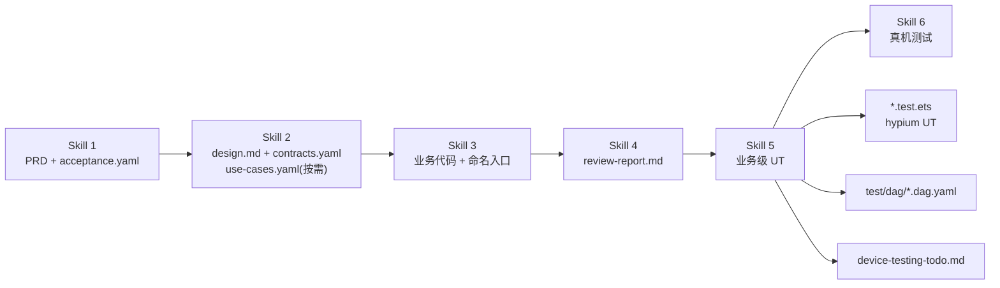
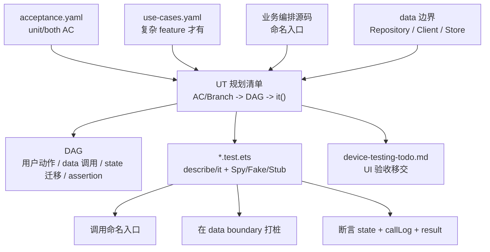
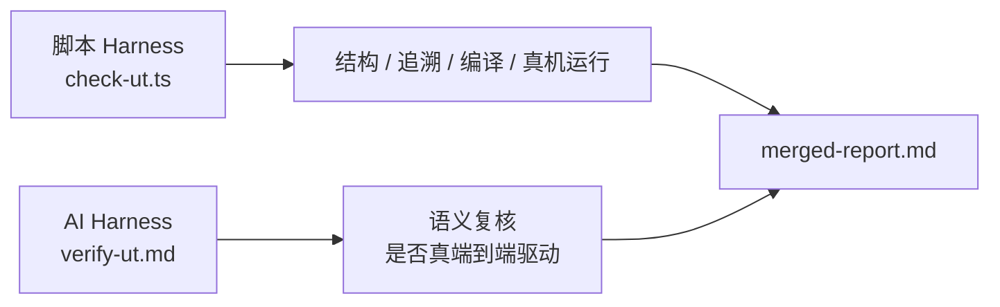

# Skill 5 · 业务级 UT

> **本文档定位**：解释当前 `5-business-ut` Skill 的设计思想、架构模型、工作流程与质量门禁。
>
> **不是**：版本演进复盘，也不是逐步操作脚本。逐步执行细节以 [`../../skills/5-business-ut/SKILL.md`](../../skills/5-business-ut/SKILL.md) 为准。
>
> **读完后你应该知道**：业务级 UT 测什么、不测什么；输入产物如何转成 DAG 与 `*.test.ets`；为什么 UI 必须交给真机测试；哪些 harness 规则会阻止“假 PASS”。

---

## 1. 一句话定义

**业务级 UT** 是一种面向业务分支的端到端单元测试：

> 一个 `it()` 对应一个业务分支或验收项，从**已存在的命名业务入口**开始驱动，沿着用户动作序列推进业务流，在 **data boundary** 处打桩，断言 **state 变化、边界调用序列、业务数据结果**。

它不是普通的“接口级 UT”，也不是 UI 自动化。它关心的是：

- 用户动作是否触发了正确的业务编排；
- 中间态、终态、错误态是否符合设计；
- Repository / Client / Store 等 data 层边界是否按预期被调用；
- P0/P1 且 `ut_layer in [unit, both]` 的验收项是否 100% 有测试追溯；
- UT 本身是否真的编译、装机、运行过，而不是只通过了文本扫描。

---

## 2. 设计思想

### 2.1 UT 是消费者，不是架构驱动者

Skill 5 的第一原则是：**测试消费既有业务代码，不反过来重塑业务架构**。

允许的被测入口：

- Page / ViewModel / Coordinator 中已经抽出的命名方法；
- 普通业务 `Flow` / `Coordinator` 类；
- 模块导出的业务函数；
- 简单 feature 中的 data 层函数或 Repository 方法。

不允许的做法：

- 为了写 UT 强行新增 `domain/usecase/XxxUseCase.ets`；
- 为了打桩强行新增 `XxxPort` 接口；
- 为了模拟点击去 `new @Component struct`；
- UT 写不出来时擅自修改业务源码“让它可测”。

如果业务逻辑藏在 inline lambda 里，正确处理是：回到 Skill 3 让代码暴露命名业务入口。Skill 5 本身不应该偷偷改业务源码。

### 2.2 UI 不进 UT，UI 交给 Skill 6

HarmonyOS 的 `@Component struct`、导航、Toast、资源 `$r()`、`AppStorage` 等 UI 运行时语义不适合在 hypium UT 里 mock。

所以 Skill 5 做硬切分：

| 类型 | 去向 |
| --- | --- |
| 纯业务流、状态机、数据边界、错误码、持久化 | Skill 5 · 业务级 UT |
| 页面渲染、导航、Toast、弹窗、资源、多机型显示 | Skill 6 · 真机测试 |
| 一半业务一半 UI 的验收项 | 业务部分进 Skill 5，UI 部分写入 `device-testing-todo.md` |

这个边界由 `acceptance.yaml > criteria[].ut_layer` 表达：

```yaml
criteria:
  - id: AC-1
    description: 校验失败时返回错误码并进入 Failed 状态
    priority: P0
    ut_layer: unit

  - id: AC-2
    description: 成功后跳转结果页并展示 toast
    priority: P0
    ut_layer: both

  - id: AC-3
    description: 多机型字号展示正常
    priority: P1
    ut_layer: device
```

### 2.3 可追溯优先于覆盖率数字

Skill 5 不追求“行覆盖率看起来很高”，而追求每个测试能回答三个问题：

1. 这条 `it()` 覆盖哪个 `AC` 或 `BRANCH`？
2. 它从哪个命名入口驱动业务？
3. 它断言了哪些 state 与 data boundary？

因此 `it()` 名称必须带追溯标签：

```typescript
it('[BRANCH-sms_fail_rollback][AC-3] 短验失败回滚', 0, async () => {
  // ...
})
```

---

## 3. 架构图

### 3.1 Skill 5 在流水线中的位置



### 3.2 业务级 UT 的内部模型



### 3.3 Harness 双层守门



脚本 Harness 负责可确定检查，例如文件是否存在、标签是否覆盖、能否编译运行。AI Harness 负责语义检查，例如“虽然调用了某函数，但是否真的绕过了业务入口”。

---

## 4. 输入与输出

### 4.1 输入

| 输入 | 必需性 | 用途 |
| --- | --- | --- |
| `acceptance.yaml` | 必需 | 决定哪些 AC 进入 UT，哪些移交真机 |
| `contracts.yaml` | 必需 | 指定模块、接口、data 边界与路径 |
| `design.md` | 必需 | 状态机、流程、架构约束来源 |
| 业务编排源码 | 必需 | 提供可直接调用的命名入口 |
| data 层源码 | 必需 | 提供 Spy / Fake / Stub 的真实边界 |
| `use-cases.yaml` | 按需 | 复杂 feature 的业务流规约 |
| `review-report.md` | 推荐 | 确认编码阶段的问题已收敛 |

`use-cases.yaml` 不是每个 feature 都必须有。满足以下任一条件时推荐产出：

- 多个 UI 节点共享同一业务状态；
- 存在 2 次及以上顺序依赖的云端调用；
- 存在回滚、补偿、取消等复杂分支。

简单 feature 可以直接用 `acceptance.yaml + dag.yaml + data 层函数` 完成 UT。

### 4.2 输出

| 输出 | 位置 | 说明 |
| --- | --- | --- |
| `*.test.ets` | `{module}/src/ohosTest/ets/test/` | hypium 测试文件 |
| `*.dag.yaml` | `{module}/test/dag/` | 业务流与测试的可视化追溯 |
| `device-testing-todo.md` | `doc/features/<feature>/` | 移交 Skill 6 的 UI / 真机验收清单 |
| harness report | `framework/harness/reports/<feature>/ut/` | 脚本检查、AI prompt、合并报告、trace |

---

## 5. 工作流程

### Step 1：读取输入并划分测试责任

先读取 `acceptance.yaml`，按 `ut_layer` 划分：

| `ut_layer` | Skill 5 动作 |
| --- | --- |
| `unit` | 必须产出 UT |
| `both` | 业务部分必须产出 UT，UI 部分写入 `device-testing-todo.md` |
| `device` | 不写 UT，直接移交 Skill 6 |

然后读取 `contracts.yaml` 和业务源码，确认：

- 被测模块有哪些；
- ohosTest 路径在哪里；
- 命名业务入口是否真实存在；
- data boundary 是哪些既有类；
- UT 是否需要 `use-cases.yaml` 作为主规划来源。

### Step 2：选择规划路径

#### 路径 A：复杂 feature，有 `use-cases.yaml`

规划维度是 `use_cases[].branches[]`。

每个 branch 至少要落到：

- 一份或一组 `dag.yaml`；
- 一个 `it('[BRANCH-...][AC-...] ...')`；
- 对应的 data boundary Spy；
- state 序列断言；
- data boundary 调用序列断言。

示例规划表：

| branch | linked AC | DAG | UT |
| --- | --- | --- | --- |
| `happy_path` | `AC-1` | `card_opening_happy.dag.yaml` | `[BRANCH-happy_path][AC-1] 成功开卡` |
| `sms_fail_rollback` | `AC-3` | `card_opening_sms_fail.dag.yaml` | `[BRANCH-sms_fail_rollback][AC-3] 短验失败回滚` |

#### 路径 B：简单 feature，无 `use-cases.yaml`

规划维度是 `acceptance.yaml` 中 `unit/both` 的 AC / BD。

每条测试直接指向被测函数或 data 层方法：

| AC/BD | 被测单元 | DAG | UT |
| --- | --- | --- | --- |
| `AC-1` | `HomeRepository.getServiceEntries` | `home_page_ut.dag.yaml` | `[AC-1] 首页服务入口数据契约完整` |
| `BD-1` | `HomeRepository.getPromoList` | `home_page_ut.dag.yaml` | `[AC-1][BD-1] 推广位为空时返回空列表` |

这条路径不强求“端到端业务编排”，但仍要求至少有被测函数调用与 expect 断言。

### Step 3：生成 DAG

DAG 是测试计划的结构化表达，不是为了炫技。它要让人一眼看出：

- 从哪个入口开始；
- 经过哪些用户动作；
- 调用了哪些 data boundary；
- state 如何迁移；
- 哪些 assertion 对应哪个 AC / branch。

关键节点类型：

| 节点类型 | 含义 |
| --- | --- |
| `user_trigger` | 用户动作或命名入口调用 |
| `port_call_cloud` / `port_call_local` | data boundary 调用 |
| `state_transition` | 状态迁移 |
| `assertion` | 测试断言点 |
| `ui_subscription` | UI 对 state 的订阅说明，仅文档化，不进 UT |

UI 导航、Toast、弹窗不要画成 UT assertion。它们应进入 `ui_subscription` 或 `device-testing-todo.md`。

### Step 4：生成 UT 与 Spy

UT 的结构通常是：

```typescript
import { describe, it, expect, beforeEach } from '@ohos/hypium'

export default function cardOpenFlowTest() {
  describe('CardOpenFlow', () => {
    let flow: CardOpenFlow
    let api: SpyCardOpenApi
    let store: SpyCardStore

    beforeEach((): void => {
      api = new SpyCardOpenApi()
      store = new SpyCardStore()
      flow = new CardOpenFlow(api, store)
    })

    it('[BRANCH-sms_fail_rollback][AC-3] 短验失败回滚', 0, async () => {
      api.whenVerifySmsCode.throws({ code: 'SMS_ERR' })

      await flow.chooseCard(bankInfo)
      expect(flow.state.phase).assertEqual(Phase.WaitingSms)

      await flow.confirmSms('000000')
      expect(flow.state.phase).assertEqual(Phase.Rollback)
      expect(api.callLog).assertDeepEquals(['validateOpen', 'applyCardResource', 'verifySmsCode'])
      expect(store.callLog).assertDeepEquals(['rollback'])
    })
  })
}
```

合法打桩方式：

| 方式 | 适用场景 |
| --- | --- |
| 子类化既有 data 层类：`class SpyXxx extends Xxx` | 首选，最容易读 |
| 原型方法替换 | 既有代码无法注入依赖时使用，必须恢复 |
| 实现既有接口 / 抽象类 | 工程本来已有 DI 抽象时使用 |

不应该为 UT 新造专用业务接口。如果为了测试新增接口，这通常说明测试正在反向驱动架构。

### Step 5：移交 device-only 内容

所有 `device` AC，以及 `both` AC 中的 UI 部分，写入 `device-testing-todo.md`：

```markdown
# device-testing-todo.md

| AC id | UT 已覆盖 | 真机测试要补 |
| --- | --- | --- |
| AC-2 | 已覆盖成功状态与落库 | 跳转结果页、toast 文案 |
| AC-3 | 未覆盖 | 多机型字号与布局 |
```

Skill 6 消费这份清单，生成真机测试计划与报告。

### Step 6：运行 harness

Skill 5 的退出条件不是“文件写完”，而是 `ut` phase 通过：

```bash
cd framework/harness
npx ts-node harness-runner.ts --phase ut --feature <feature>
```

脚本 Harness 会生成：

- `script-report.json`
- `ai-prompt.md`
- `merged-report.md`
- `trace.json`
- hvigor / hdc 相关日志

之后还要把 `ai-prompt.md` 交给 verifier 做语义复核。

---

## 6. 质量门禁

### 6.1 结构与追溯

| 规则 | 严重度 | 防什么 |
| --- | --- | --- |
| `usecase_spec_schema` | BLOCKER | `use-cases.yaml` 存在但结构不合法 |
| `dag_schema_compliance` | BLOCKER | DAG 缺关键字段 |
| `dag_acyclic` | BLOCKER | DAG 有环 |
| `dag_linked_usecase` | BLOCKER | DAG 引用不存在的 use_case / branch |
| `it_name_has_ac_or_branch_tag` | BLOCKER | `it()` 无法追溯到 AC / branch |
| `branch_coverage_full` | BLOCKER | `use-cases.yaml` 的 branch 没有测试 |
| `acceptance_coverage` | BLOCKER | P0/P1 且 unit/both 的 AC 没有测试 |

### 6.2 UT 代码合规

| 规则 | 严重度 | 防什么 |
| --- | --- | --- |
| `ut_framework_import` | BLOCKER | 没用 hypium 的 `describe/it` |
| `ut_assertion_exists` | BLOCKER | 用例没有断言 |
| `ut_import_whitelist` | BLOCKER | UT import UI、资源、导航等不可测对象 |
| `boundaries_all_stubbed` | BLOCKER | 声明了 data boundary 但没有 Spy/Fake/Stub |
| `it_drives_flow` | MAJOR | 测试退化成单接口浅断言 |

### 6.3 防“假 PASS”

| 规则 | 严重度 | 防什么 |
| --- | --- | --- |
| `ut_tsc_compiles` | BLOCKER | `*.test.ets` 文本看着像测试，但 TypeScript 语法/类型不通 |
| `ut_hvigor_build` | BLOCKER | tsc 漏掉的跨文件、跨模块 ArkTS 编译错误 |
| `ut_hvigor_test` | BLOCKER | 测试没有真正在设备 / 模拟器上运行 |
| `ut_no_src_mutation` | BLOCKER | 为了让 UT 通过而擅自改业务源码 |

`ut_hvigor_test` 需要 DevEco Studio 工具链与在线设备 / 模拟器。工具链缺失、无设备、显式跳过都不是 PASS，也不是正常 SKIP。

### 6.4 语义复核

AI Harness 重点看脚本难以判断的内容：

- state model 是否足以表达业务分支；
- `ui_bindings.user_actions.calls` 是否真的指向命名入口；
- UT 是否绕过了业务入口直接调底层 repo；
- Spy 返回值是否符合真实数据模型；
- `device-testing-todo.md` 是否覆盖了所有 device / both AC。

---

## 7. 常见决策

### 7.1 要不要写 `use-cases.yaml`

| 情况 | 建议 |
| --- | --- |
| 单接口加载、列表展示、简单数据转换 | 不写，走路径 B |
| 多步业务流、状态机明显、错误分支多 | 写，走路径 A |
| 多 UI 共用一套业务状态 | 写 |
| 只是为了让文档看起来完整 | 不写 |

### 7.2 该不该把某个 AC 放进 UT

判断标准是：**能不能脱离 UI 运行时，在 hypium 里稳定验证业务语义**。

| AC 内容 | `ut_layer` |
| --- | --- |
| 错误码、状态迁移、落库、请求顺序 | `unit` |
| 成功后跳转、Toast、弹窗、渲染 | `device` |
| 提交流程成功且结果页展示 | `both` |

### 7.3 UT 写不出来怎么办

不要先改业务源码。按顺序判断：

1. 是否缺少命名业务入口？回 Skill 3 抽出命名方法。
2. 是否 data boundary 不清楚？回 Skill 2 / `contracts.yaml` 补清楚。
3. 是否其实是 UI 行为？移交 Skill 6。
4. 是否确实必须改业务源码？先向用户说明原因，得到明确同意，并登记到 `gap-notes.md > approved_src_mutations[]`。

---

## 8. 成功标准

一次 Skill 5 交付应满足：

- `unit/both` 的 P0/P1 AC 全部有 `it()` 追溯；
- 复杂 feature 的每个 branch 都有对应测试；
- UT 从命名业务入口驱动，不绕过业务编排；
- data boundary 全部通过 Spy/Fake/Stub 控制；
- UI 行为没有混进 UT，而是进入 `device-testing-todo.md`；
- `ut_tsc_compiles`、`ut_hvigor_build`、`ut_hvigor_test` 全部通过；
- 没有未授权的业务源码改动；
- verifier 没有给出语义级 BLOCKER。

---

## 一句话总结

> **Skill 5 的价值不是“帮你多写几个测试文件”，而是把验收项、业务分支、命名入口、data 边界和真实运行结果绑在一起。**
>
> 它要求每条 UT 都能说明“我测的是哪个业务承诺、从哪里驱动、经过哪些边界、断言了什么状态”，并用编译、装机、运行和源码改动门禁防止弱模型制造“看起来通过”的假测试。
