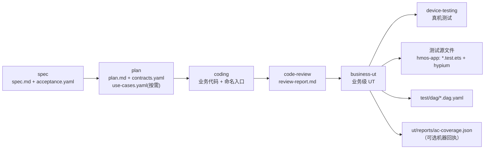
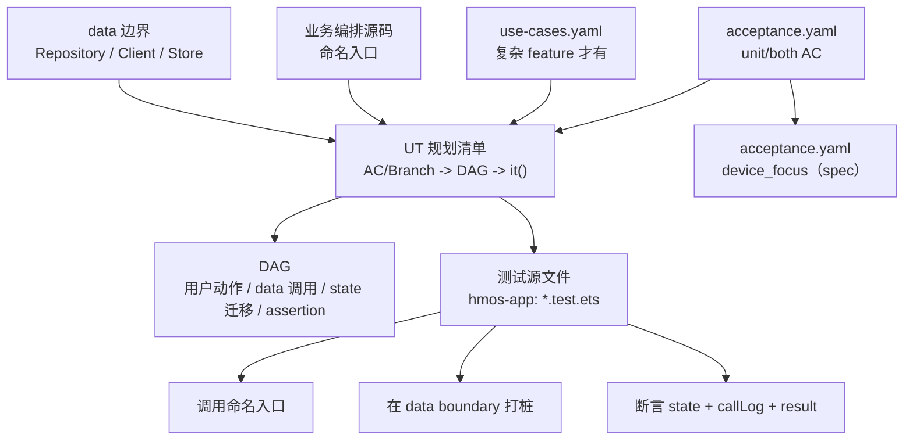
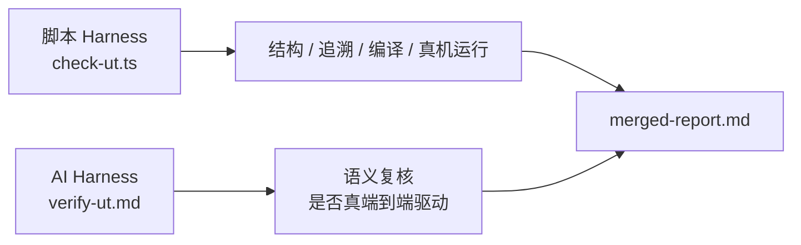
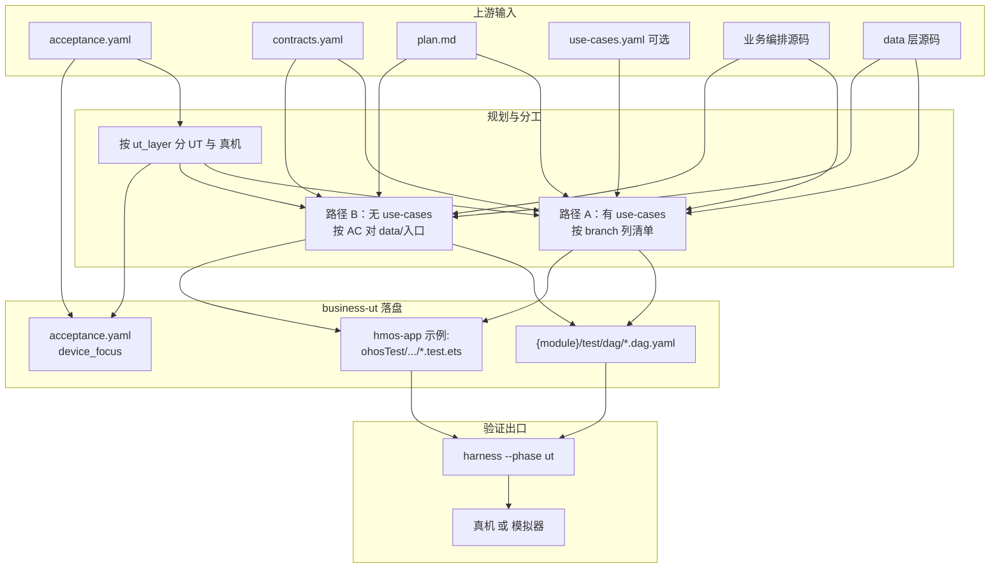

# business-ut · 业务级 UT

> **本文档定位**：解释当前 `business-ut` Skill 的设计思想、架构模型、工作流程与质量门禁。
>
> **不是**：版本演进复盘，也不是逐步操作脚本。逐步执行细节以 [`../../skills/feature/business-ut/SKILL.md`](../../skills/feature/business-ut/SKILL.md) 为准。
>
> **读完后你应该知道**：业务级 UT 测什么、不测什么；输入产物如何转成 DAG 与**测试源文件**；为什么 UI 必须交给真机测试；哪些 harness 规则会阻止“假 PASS”。

**profile 约定**：下文 **流程与概念** 与 `project_profile` 无关；**路径、扩展名、测试框架与 `ut_hvigor_*` 等规则 ID** 以 **`hmos-app`** 为示例（hypium、`*.test.ets`、`ohosTest`）。其它 profile 见对应 addendum；宿主工具链详见 [`../profiles/hmos-app-harness-toolchain.md`](../profiles/hmos-app-harness-toolchain.md)。

---

## 1. 一句话定义

**业务级 UT** 是一种面向业务分支的端到端单元测试：

> 一个 `it()` 对应一个业务分支或验收项，从**已存在的命名业务入口**开始驱动，沿着用户动作序列推进业务流，在 **data boundary** 处打桩，断言 **state 变化、边界调用序列、业务数据结果**。

它不是普通的“接口级 UT”，也不是 UI 自动化。它关心的是：

- 用户动作是否触发了正确的业务编排；
- 中间态、终态、错误态是否符合设计；
- Repository / Client / Store 等 data 层边界是否按预期被调用；
- P0/P1 且 `ut_layer in [unit, both]` 的验收项是否 100% 有测试追溯；
- UT 本身是否真的编译、装机、运行过，而不是只通过了文本扫描。

### 1.1 与正文 SKILL 的版本对齐（2.0 / v2.9）

本节保证对外讲解与 [`../../skills/feature/business-ut/SKILL.md`](../../skills/feature/business-ut/SKILL.md) 同一口径；细节仍以正文为准。

- **Context Exploration Gate（schema 1.1.0）**：在输出「UT 规划清单」并进入用户确认门前，必须先落盘 `doc/features/<feature>/ut/context-exploration.md`（模板见 [`../../harness/templates/context-exploration.md`](../../harness/templates/context-exploration.md)）。须满足 `source_code_paths` 数量阈值、`ready_to_produce: true` 为人工设定；存量 feature 可用 `npm run backfill:context` 或短期 `compat.yaml` 过渡。
- **Agent 行为规约**：Research Sub-Phase 前须读 [`../../skills/reference/agent-behavioral-principles.md`](../../skills/reference/agent-behavioral-principles.md)；verifier 含 `behavior_*` 维度。
- **HARD STOP 规划确认门**：用户未确认清单前不得写 DAG / UT；若必须改 `src/main`，走 SKILL 文末单独授权流程，不得混在规划确认里。
- **可测性与 mock-plan（v2.3）**：新 feature 一律强制 `ut/testability-audit.md`，存在 L0/L1/L2 可测项时 **必填** `ut/mock-plan.yaml`；存量 feature 仅在再次进入 business-ut 且变更 UT 相关产物时回补。L3 接缝只允许构造注入、wrapper、提取命名方法、setter 注入等 **显式** 手段（禁止「换全局单例」式敷衍）。
- **入口约定**：只做 Step 1.5 / 1.6 时，在 **`/business-ut`**（或等价跳板）内向 agent 声明即可；**不**再提供独立 `/ut-audit` slash。
- **Harness 能力命名与调度**：中立叙述使用 capability 键 `ut.compile` / `ut.run`；根 `check-ut.ts` 经 **`capability-registry.ts`** → profile `ut-host-impl` / `hvigor-runner.ts` / `hdc-runner.ts` 执行。**hmos-app** 报告里仍常见历史规则 ID `ut_hvigor_*` / `ut_tsc_compiles`，以 profile 注册与 harness 输出为准。

---

## 2. 设计思想

### 2.1 UT 是消费者，不是架构驱动者

business-ut 的第一原则是：**测试消费既有业务代码，不反过来重塑业务架构**。

允许的被测入口：

- Page / ViewModel / Coordinator 中已经抽出的命名方法；
- 普通业务 `Flow` / `Coordinator` 类；
- 模块导出的业务函数；
- 简单 feature 中的 data 层函数或 Repository 方法。

不允许的做法：

- 为了写 UT 强行新增 `domain/usecase/XxxUseCase` 类文件（**hmos-app** 常见扩展名为 `.ets`；是否禁止以 profile 为准）；
- 为了打桩强行新增仅供测试的 `XxxPort` 接口；
- 为了模拟点击去 `new` UI 组件（**hmos-app**：`@Component struct`，详见 profile 模板）；
- UT 写不出来时擅自修改业务源码“让它可测”。

如果业务逻辑藏在 inline lambda 里，正确处理是：回到 coding 让代码暴露命名业务入口。business-ut 本身不应该偷偷改业务源码。

### 2.2 UI 不进 UT，UI 交给 device-testing

**UI 框架与 UT 运行时不匹配时**，业务语义应在 UT 里验、UI 壳与导航应在真机具语义的测试运行器里验（**hmos-app**：声明式 UI、`$r()`、`AppStorage` 等 + **hypium**；见 profile 下 UT 模板）。

所以 business-ut 做硬切分：

| 类型 | 去向 |
| --- | --- |
| 纯业务流、状态机、数据边界、错误码、持久化 | business-ut · 业务级 UT |
| 页面渲染、导航、Toast、弹窗、资源、多机型显示 | device-testing · 真机测试 |
| 一半业务一半 UI 的验收项 | 业务部分进 business-ut；UI 部分在 spec 的 `acceptance.yaml` > `device_focus`，由 device-testing 派生 test-plan |

这个边界由 `acceptance.yaml > criteria[].ut_layer` 表达：

```yaml
criteria:
  - id: AC-1
    description: 校验失败时返回错误码并进入 Failed 状态
    priority: P0
    ut_layer: unit

  - id: AC-2
    description: 成功后跳转结果页并展示 toast
    priority: P0
    ut_layer: both

  - id: AC-3
    description: 多机型字号展示正常
    priority: P1
    ut_layer: device
```

### 2.3 可追溯优先于覆盖率数字

business-ut 不追求“行覆盖率看起来很高”，而追求每个测试能回答三个问题：

1. 这条 `it()` 覆盖哪个 `AC` 或 `BRANCH`？
2. 它从哪个命名入口驱动业务？
3. 它断言了哪些 state 与 data boundary？

因此 `it()` 名称必须带追溯标签：

```typescript
it('[BRANCH-sms_fail_rollback][AC-3] 短验失败回滚', 0, async () => {
  // ...
})
```

---

## 3. 架构图

### 3.1 business-ut 在流水线中的位置



**怎么读这张**：从左到右是需求在流水线里走的**阶段顺序**（不是代码 import 关系）。spec / plan / coding / code-review 为 business-ut 提供「验收、契约、实现、审阅」；business-ut 为 device-testing 交「能跑通的业务流 UT + 追溯材料 + 真机待办」。

- **S1** — spec 与 `acceptance.yaml`：谁进 UT、谁进真机，由 `ut_layer` 定。
- **S2** — `plan.md`、`contracts.yaml`；复杂 feature 才额外有 `use-cases.yaml`（规划用例与分支的规约）。
- **S3** — 可测的业务编排 + 命名入口；UT 只消费、不要求你为此再造一套 `UseCase` 架构。
- **S4** — 可选的审查结论，用来确认编码侧问题已收敛，不是 harness 的硬输入。
- **S6** — 按 `acceptance.yaml` 的 `device_focus` 派生 test-plan，在真机/模拟器上验 UI / 导航 / 多机型等。

S5 向下的交付物（同一次 business-ut）：

| 落盘 | 作用 |
| --- | --- |
| 测试源文件（hmos-app：`*.test.ets` + hypium） | 可执行用例，真正「重放业务流」的代码。 |
| `test/dag/*.dag.yaml` | 把「从哪些输入到哪些 it」固化成**可追溯结构**（给 harness 与人工对账用）。 |
| `ut/reports/ac-coverage.json` | harness 可选写出的 unit 层覆盖摘要（**非** acceptance SSOT）。 |

真机要点 SSOT 在 **spec** 的 `acceptance.yaml` > `device_focus`（`ut_layer ∈ {device, both}`），**不再**产出 `device-testing-todo.md`。

### 3.2 业务级 UT 的内部模型

**本图回答什么**：*规约和源码，怎样一步步变成「规划 → DAG 文件 → UT 代码 → 真机待办」；一个 `it()` 里要干哪三件事。*



**上半区：四路输入，汇总成「规划」**

| 节点 | 是什么 | 在 UT 里扮演的角色 |
| --- | --- | --- |
| `acceptance.yaml` | 验收表 | 标 `ut_layer`：**谁进 UT、谁进真机**的分流开关。 |
| `use-cases.yaml` | 选填规约 | 仅复杂流需要；有则按 **branch** 规划，没有则不必硬写。 |
| 业务编排源码 | `Flow` / Page 方法等 | **被测的命名入口**；UT 必须从这里进，不绕过业务编排。 |
| data 边界 | `Repository` / `Client` 等 | **可打桩的边界**；Stub/Spy 针对「真实 data 类」，不为 UT 新造 `Port` 专供测试。 |

`UT 规划清单` 在图里指 **Step 1 里那张表**（在 SKILL 里要用户确认的），不默认是仓库里固定文件名的单文件；它的结果会**体现**在：DAG 覆盖范围、`it()` 名字里的 `[AC-*]` / `[BRANCH-*]` 标签、以及表格式文字说明中。

**中间区：三样交付物**

- **DAG**：把业务流画成有节点/边的 YAML，方便「这条 branch 是否写到了、是否对上 AC」的机械核对（对应 harness 的 DAG/追溯类规则）。
- **测试源文件**：可执行的 profile 测试；**hmos-app** 为 hypium 的 `describe`/`it` + 打桩类。
- **`device_focus`**：在 spec 写入 acceptance；device-testing 据此派生 test-plan（见 [acceptance-layering.md](../concepts/acceptance-layering.md)）。

**下半区：一个 `it()` 内部的三步**（和上图「产物」是不同抽象层级：这里描述**单次用例在代码里做什么**）

- **调用命名入口** — 对应 `ui_bindings.user_actions` 里声明的函数或你规划表里的被测函数。
- **在 data boundary 打桩** — 控制云返回、本地存取失败等，不 mock UI 框架。
- **断言** — 状态序列、Spy 的 `callLog`、落库/返回值等，而不是只断言「数组非空」。

### 3.3 Harness 双层守门

**本图回答什么**：跑完 UT 相关 harness 时，**机器能自动验什么**、**为什么还要人/模型过一遍 verify**、**读报告从哪进**。



**脚本 Harness（`check-ut.ts`）**

- **管什么（确定性、可复现）**：  
  文件与 schema 是否齐（含 v2.3 下 testability-audit / mock-plan 等契约）、`it()` 是否带上 `[AC-]` / `[BRANCH-]` 标签、DAG 与 `use-cases`/`acceptance` 是否对得上、import 是否踩了 UI 禁线、以及 **profile 注册的编译/运行类检查**（能力侧为 `ut.compile` / `ut.run`；**hmos-app** 报告常见 ID：`ut_tsc_compiles` / `ut_hvigor_build` / `ut_hvigor_test` / `ut_no_src_mutation`；细则见 [§6](#6-质量门禁) 与 [`../profiles/hmos-app-harness-toolchain.md`](../profiles/hmos-app-harness-toolchain.md)）。
- **产出**：`doc/features/<feature>/ut/reports/` 下的 `script-report.json`、**宿主构建/运行**日志（hmos-app：hvigor/hdc）、以及流程中的 `trace.json`（与改源码对账用）。

**AI Harness（`verify-ut.md`）**

- **管什么（语义、要理解代码）**：  
  是否**真**按 `user_sequence`/branch 在驱动、有没有「直接调 repo 假装端到端」、Spy 设计是否合理、`device/both` AC 是否已声明 `device_focus` 等。  
  脚本**判不了的偷懒**，由这里按 prompt 做二次把关。

**`merged-report.md`**

- **是什么**：同一次运行下，给人类读的**合并说明**（与 `ai-prompt.md` 等产物同目录，具体以 harness 输出为准）。
- **建议阅读顺序**：先看 `script-report.json` 里 FAIL 的 `id` 与 `details` → 再打开 `merged-report.md` 扫结论 → 需要语义复核时把 `ai-prompt.md` 交给 **verifier**（独立模型/人），避免「自己验自己」。

**一句话对照**：脚本守门保证「**结构真、能编译、能跑、没偷偷改业务**」；AI 守门补「**语义像不像业务、有没有绕过入口**」。

---

## 4. 输入与输出

### 4.0 流程全景（从输入到 `ut` 门禁）

**先读图再读下表**：下表是「每个文件干什么」的字段清单；本图是「它们怎么串成一次 business-ut 交付」的时间顺序。



- **`ut_layer`**：`unit` / `both` 驱动写 `utF` 与打桩；`device` 不进 `it()`，真机要点写在 acceptance `device_focus`。
- **路径 A / B**：同一 feature 二选一，由是否存在 **`use-cases.yaml`** 决定（与 [§5](#5-工作流程) Step 2 一致）。
- **`--phase ut`**：跑 [§3.3](#33-harness-双层守门) 的脚本 + 后续语义验证；真机/模拟器是 **`ut_hvigor_test`（hmos-app）** 的必要条件（见 [§6](#6-质量门禁)）。

### 4.1 输入

| 输入 | 必需性 | 用途 |
| --- | --- | --- |
| `acceptance.yaml` | 必需 | 决定哪些 AC 进入 UT，哪些移交真机 |
| `contracts.yaml` | 必需 | 指定模块、接口、data 边界与路径 |
| `plan.md` | 必需 | 状态机、流程、架构约束来源 |
| 业务编排源码 | 必需 | 提供可直接调用的命名入口 |
| data 层源码 | 必需 | 提供 Spy / Fake / Stub 的真实边界 |
| `use-cases.yaml` | 按需 | 复杂 feature 的业务流规约 |
| `review-report.md` | 推荐 | 确认编码阶段的问题已收敛 |

`use-cases.yaml` 不是每个 feature 都必须有。满足以下任一条件时推荐产出：

- 多个 UI 节点共享同一业务状态；
- 存在 2 次及以上顺序依赖的云端调用；
- 存在回滚、补偿、取消等复杂分支。

简单 feature 可以直接用 `acceptance.yaml + dag.yaml + data 层函数` 完成 UT。

### 4.2 输出

| 输出 | 位置 | 说明 |
| --- | --- | --- |
| 测试源文件 | **hmos-app**：`{module}/src/ohosTest/ets/test/*.test.ets` | profile 下的测试框架（hypium） |
| DAG 文件 | **hmos-app**：`{module}/test/dag/*.dag.yaml` | 业务流与测试的可视化追溯 |
| `ut/reports/ac-coverage.json` | `doc/features/<feature>/ut/reports/` | UT 结束后 harness 可选写出的 unit 覆盖摘要 |
| harness report | `doc/features/<feature>/ut/reports/` | 脚本检查、AI prompt、合并报告、trace |

---

## 5. 工作流程

### Step 1：读取输入并划分测试责任

先读取 `acceptance.yaml`，按 `ut_layer` 划分：

| `ut_layer` | business-ut 动作 |
| --- | --- |
| `unit` | 必须产出 UT |
| `both` | 业务部分必须产出 UT；UI 部分在 acceptance `device_focus`（spec），由 device-testing 派生 test-plan |
| `device` | 不写 UT，直接移交 device-testing |

然后读取 `contracts.yaml` 和业务源码，确认：

- 被测模块有哪些；
- **宿主测试模块根路径**（hmos-app：`ohosTest/...`）在哪里；
- 命名业务入口是否真实存在；
- data boundary 是哪些既有类；
- UT 是否需要 `use-cases.yaml` 作为主规划来源。

在进入下列路径 A/B 的详细规划表之前，还须满足正文 SKILL 的闸门顺序：

1. **Context Exploration**：落盘 `ut/context-exploration.md`（探索摘要、`key_inputs_read` 等见模板）。
2. **展示「UT 规划清单」并 HARD STOP**：等待用户明确确认后，才允许进入 Step 1.5 / 1.6 与后续写文件。
3. **Step 1.5 可测性预检**：产出 `ut/testability-audit.md`（覆盖全部 `unit`/`both` AC/BD）。
4. **Step 1.6 mock-plan**：存在 L0/L1/L2 可测项时产出 `ut/mock-plan.yaml`，然后再进入 Step 2（选路径）与 DAG / UT 实现。

### Step 2：选择规划路径

#### 路径 A：复杂 feature，有 `use-cases.yaml`

规划维度是 `use_cases[].branches[]`。

每个 branch 至少要落到：

- 一份或一组 `dag.yaml`；
- 一个 `it('[BRANCH-...][AC-...] ...')`；
- 对应的 data boundary Spy；
- state 序列断言；
- data boundary 调用序列断言。

示例规划表：

| branch | linked AC | DAG | UT |
| --- | --- | --- | --- |
| `happy_path` | `AC-1` | `sample_flow.dag.yaml` | `[BRANCH-happy_path][AC-1] 主路径成功` |
| `otp_fail_rollback` | `AC-3` | `sample_flow.dag.yaml` | `[BRANCH-otp_fail_rollback][AC-3] 校验失败回滚` |

#### 路径 B：简单 feature，无 `use-cases.yaml`

规划维度是 `acceptance.yaml` 中 `unit/both` 的 AC / BD。

每条测试直接指向被测函数或 data 层方法：

| AC/BD | 被测单元 | DAG | UT |
| --- | --- | --- | --- |
| `AC-1` | `HomeRepository.getServiceEntries` | `home_page_ut.dag.yaml` | `[AC-1] 首页服务入口数据契约完整` |
| `BD-1` | `HomeRepository.getPromoList` | `home_page_ut.dag.yaml` | `[AC-1][BD-1] 推广位为空时返回空列表` |

这条路径不强求“端到端业务编排”，但仍要求至少有被测函数调用与 expect 断言。

### Step 3：生成 DAG

DAG 是测试计划的结构化表达，不是为了炫技。它要让人一眼看出：

- 从哪个入口开始；
- 经过哪些用户动作；
- 调用了哪些 data boundary；
- state 如何迁移；
- 哪些 assertion 对应哪个 AC / branch。

关键节点类型：

| 节点类型 | 含义 |
| --- | --- |
| `user_trigger` | 用户动作或命名入口调用 |
| `port_call_cloud` / `port_call_local` | data boundary 调用 |
| `state_transition` | 状态迁移 |
| `assertion` | 测试断言点 |
| `ui_subscription` | UI 对 state 的订阅说明，仅文档化，不进 UT |

UI 导航、Toast、弹窗不要画成 UT assertion。它们应进入 `ui_subscription`（文档化）或 spec 的 `acceptance.yaml` > `device_focus`。

### Step 4：生成 UT 与 Spy

UT 的结构通常是：

```typescript
// hmos-app 示例：hypium（类名与 Spy 仅为示意，请与 use-cases / 工程实际一致）
import { describe, it, expect, beforeEach } from '@ohos/hypium'

export default function sampleFlowTest() {
  describe('TaskSubmitFlow', () => {
    let flow: TaskSubmitFlow
    let remote: SpyRemoteTaskGateway
    let ledger: SpyLocalTaskLedger

    beforeEach((): void => {
      remote = new SpyRemoteTaskGateway()
      ledger = new SpyLocalTaskLedger()
      flow = new TaskSubmitFlow(remote, ledger)
    })

    it('[BRANCH-remote_fail][AC-2] 远端失败回滚', 0, async () => {
      remote.whenSubmit.throws({ code: 'REMOTE_ERR' })

      await flow.startSubmit(samplePayload)
      expect(flow.state.phase).assertEqual(Phase.Rollback)
      expect(remote.callLog).assertDeepEquals(['submit'])
      expect(ledger.callLog).assertDeepEquals(['rollback'])
    })
  })
}
```

合法打桩方式：

| 方式 | 适用场景 |
| --- | --- |
| 子类化既有 data 层类：`class SpyXxx extends Xxx` | 首选，最容易读 |
| 原型方法替换 | 既有代码无法注入依赖时使用，必须恢复 |
| 实现既有接口 / 抽象类 | 工程本来已有 DI 抽象时使用 |

不应该为 UT 新造专用业务接口。如果为了测试新增接口，这通常说明测试正在反向驱动架构。

### Step 5：真机要点（不在 business-ut 新建平行清单）

`device` / `both` 的真机可观察要点应在 **spec** 写入 `acceptance.yaml` > `device_focus`（`both` 须拆分 `ut_focus` + `device_focus`）。business-ut **不再**产出 `device-testing-todo.md`。

若发现缺 `device_focus`，应回到 spec 补全；L3 `option_a` 亦在 acceptance 对应条目补 `device_focus`。Harness UT PASS 后可写出 `ut/reports/ac-coverage.json`（见正文 SKILL Step 6）。

device-testing 从 acceptance 过滤 `ut_layer∈{device,both}` 派生 `test-plan.md`。

### Step 6：运行 harness

business-ut 的退出条件不是“文件写完”，而是 `ut` phase 通过：

```bash
cd framework/harness
npx ts-node harness-runner.ts --phase ut --feature <feature> --summary --failures-only
```

脚本 Harness 会生成：

- `script-report.json`
- `summary.json`
- `ai-prompt.md`
- `merged-report.md`
- `trace.json`
- **宿主**构建/运行日志（**hmos-app**：hvigor / hdc）

agent / CI 优先读取 `summary.json` 里的 `verdict`、`blockers`、`next_action` 与 `ut_run_status`，不要用 `grep` 解析完整控制台日志。

之后还要把 `ai-prompt.md` 交给 verifier 做语义复核。

---

## 6. 质量门禁

### 6.1 结构与追溯

| 规则 | 严重度 | 防什么 |
| --- | --- | --- |
| `usecase_spec_schema` | BLOCKER | `use-cases.yaml` 存在但结构不合法 |
| `dag_schema_compliance` | BLOCKER | DAG 缺关键字段 |
| `dag_acyclic` | BLOCKER | DAG 有环 |
| `dag_linked_usecase` | BLOCKER | DAG 引用不存在的 use_case / branch |
| `it_name_has_ac_or_branch_tag` | BLOCKER | `it()` 无法追溯到 AC / branch |
| `branch_coverage_full` | BLOCKER | `use-cases.yaml` 的 branch 没有测试 |
| `acceptance_coverage` | BLOCKER | P0/P1 且 unit/both 的 AC 没有测试 |

### 6.2 UT 代码合规

| 规则 | 严重度 | 防什么 |
| --- | --- | --- |
| `ut_framework_import` | BLOCKER | 未使用 profile 约定的测试入口（**hmos-app**：hypium `describe`/`it`） |
| `ut_assertion_exists` | BLOCKER | 用例没有断言 |
| `ut_import_whitelist` | BLOCKER | UT import UI、资源、导航等不可测对象 |
| `boundaries_all_stubbed` | BLOCKER | 声明了 data boundary 但没有 Spy/Fake/Stub |
| `it_drives_flow` | MAJOR | 测试退化成单接口浅断言 |

### 6.3 防“假 PASS”

以下 ID 在 **`hmos-app`** 下常见；是否执行以 **active profile** 与 harness 报告为准（详见 [`../profiles/hmos-app-harness-toolchain.md`](../profiles/hmos-app-harness-toolchain.md)）。

| 规则 | 严重度 | 防什么 |
| --- | --- | --- |
| `ut_tsc_compiles` | BLOCKER | 测试源文件（**hmos-app**：`*.test.ets`）语法/类型未被 tsc 接受 |
| `ut_hvigor_build` | BLOCKER | tsc 漏掉的跨文件、跨模块 **ArkTS**（宿主）编译错误 |
| `ut_hvigor_test` | BLOCKER | 测试未在设备 / 模拟器上实际运行 |
| `ut_no_src_mutation` | BLOCKER | 为了让 UT 通过而擅自改业务源码 |

`ut_hvigor_test`（hmos-app）需要 DevEco Studio 工具链与在线设备 / 模拟器。工具链缺失、无设备、显式跳过都不是 PASS，也不是正常 SKIP。

### 6.4 语义复核

AI Harness 重点看脚本难以判断的内容：

- state model 是否足以表达业务分支；
- `ui_bindings.user_actions.calls` 是否真的指向命名入口；
- UT 是否绕过了业务入口直接调底层 repo；
- Spy 返回值是否符合真实数据模型；
- `device_focus` 是否覆盖所有 `ut_layer ∈ {device, both}` 的 AC/BD。

---

## 7. 常见决策

### 7.1 要不要写 `use-cases.yaml`

| 情况 | 建议 |
| --- | --- |
| 单接口加载、列表展示、简单数据转换 | 不写，走路径 B |
| 多步业务流、状态机明显、错误分支多 | 写，走路径 A |
| 多 UI 共用一套业务状态 | 写 |
| 只是为了让文档看起来完整 | 不写 |

### 7.2 该不该把某个 AC 放进 UT

判断标准是：**能否脱离 UI 运行时，在 profile UT 运行器里稳定验证业务语义**（**hmos-app**：hypium）。

| AC 内容 | `ut_layer` |
| --- | --- |
| 错误码、状态迁移、落库、请求顺序 | `unit` |
| 成功后跳转、Toast、弹窗、渲染 | `device` |
| 提交流程成功且结果页展示 | `both` |

### 7.3 UT 写不出来怎么办

不要先改业务源码。按顺序判断：

1. 是否缺少命名业务入口？回 coding 抽出命名方法。
2. 是否 data boundary 不清楚？回 plan / `contracts.yaml` 补清楚。
3. 是否其实是 UI 行为？移交 device-testing。
4. 是否确实必须改业务源码？先向用户说明原因，得到明确同意，并登记到 `gap-notes.md > approved_src_mutations[]`。

---

## 8. 成功标准

一次 business-ut 交付应满足：

- `unit/both` 的 P0/P1 AC 全部有 `it()` 追溯；
- 复杂 feature 的每个 branch 都有对应测试；
- UT 从命名业务入口驱动，不绕过业务编排；
- data boundary 全部通过 Spy/Fake/Stub 控制；
- UI 行为没有混进 UT，真机要点在 acceptance `device_focus`；
- **`hmos-app` 下** `ut_tsc_compiles`、`ut_hvigor_build`、`ut_hvigor_test`（若注册）全部通过；
- 没有未授权的业务源码改动；
- verifier 没有给出语义级 BLOCKER。

---

## 9. 维护同步（2026-05-22 · 对齐 2.0）

- **宿主 UT 实现**：Hypium / hdc / hvigor 在 `framework/profiles/hmos-app/harness/`（`ut-host-impl.ts`、`hvigor-runner.ts`、`hdc-runner.ts`、`ts-compile.ts`）；根 `scripts/utils/*-runner.ts` 多为 **re-export shim**。
- **调度链**：`check-ut.ts` → **`capability-registry.ts`** → profile provider；`generic` profile 可对 `ut.run` 声明 SKIP（非假 PASS）。
- **Context Gate**：`context-exploration.md` schema **1.1.0**；`exploration-strategy.ts` 复合评分；回填 `npm run backfill:context`。
- **acceptance 分层**：`device-testing-todo.md` 已废弃；真机要点在 `acceptance.yaml` > `device_focus`。
- **对照 SSOT**：已对照 [`DOC_INVENTORY.yaml`](../DOC_INVENTORY.yaml) 所列 SKILL / `ut-rules.yaml` / `check-ut.ts` / `verify-ut.md`；叙事与 compile / run 门禁一致。

---

## 一句话总结

> **business-ut 的价值不是“帮你多写几个测试文件”，而是把验收项、业务分支、命名入口、data 边界和真实运行结果绑在一起。**
>
> 它要求每条 UT 都能说明“我测的是哪个业务承诺、从哪里驱动、经过哪些边界、断言了什么状态”，并用编译、装机、运行和源码改动门禁防止弱模型制造“看起来通过”的假测试。

<!--
  last-synced: 2026-06-12 (2.3.0: profile-host-loader / capability-registry 路径复核)
-->

