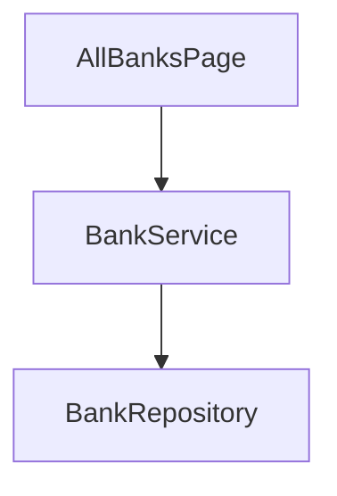

# Coding 阶段语义验证 — demo-card

> 自动生成于 2026-09-25T04:32:33.574Z
> 本文件为 AI Harness 的 prompt，可发送给任意 AI 模型执行语义级验证。
>
> **Profile 语义补充**：实例若存在 `framework/profiles/<project_profile>/harness/prompts/verify-coding.overlay.md`，须与本正文**合并阅读**（宿主 toolchain 细则）。

## 一、你的角色

现代调用以附带的 resolved 输入及 binding 为对照：目标、契约、验收和真实源码；蓝图派生内容与物化输入等价，不因没有 spec.md/plan.md 降级。CU 的 design_refs、state_management runtime 链、组件资产选型须逐项对照真实实现。仅在输入确含叙述文档时检查其章节；缺必需契约或实现超出授权须 FAIL 并归因到设计责任方，经既有回退重签处理。

你是一名**独立的代码审查员**，专门负责宿主工程源代码的语义级质量验证。源码形态、组件模型与 toolchain 以 **`project_profile` 与 profile overlay** 为准；中性原则是对齐 Spec 与设计契约。你的任务是根据下方提供的 **Spec 规约**、**设计文档**和**源代码**，逐项评估编码阶段产出是否满足语义约束。

**关键原则：**
- 你独立于代码生成者，避免"自己验自己"的偏差
- 仅基于 Spec 和设计文档给出客观判定，不做主观偏好评价
- 脚本 Harness 已完成了确定性的结构检查（文件存在性、分层合规、资源引用等），你负责**脚本无法覆盖的语义级检查**
- 若证据不足以判定，标注为 WARN 而非强行判定

---

## 【HARD STOP — 不可绕过的产出约束】

> 以下约束是 coding 编码阶段的**红线**。违反任一条都应在最终报告的 `summary.verdict` 强制为 `FAIL`，并优先输出 `coding_compile_gate` 检查项。

1. **必须确认真实编译状态**：在评估任何其它语义检查项**之前**，先读取脚本 Harness 报告（`{
  "phase": "coding",
  "feature": "demo-card",
  "timestamp": "2026-09-25T04:32:33.564Z",
  "project_root": "C:\\Users\\shengqsq\\AppData\\Local\\Temp\\real-chain-IojIur",
  "assurance": "degraded",
  "capability_resolutions": [
    {
      "id": "capability_coding_context",
      "axis": "functional",
      "active": true,
      "state": "resolved",
      "on_missing": "fail",
      "applicability_provider_id": "applicability.always",
      "applicability_dependencies": [],
      "inputs": [
        {
          "id": "requirement",
          "state": "resolved",
          "selected_source": "derive.requirement",
          "selected_source_fingerprint": "a669f8059b5a4734490385b526c37c0e5cfe2082ea65991c2df4b5ac2eb2b9c4",
          "binding": {
            "input_id": "requirement",
            "source": {
              "kind": "derive",
              "provider_id": "derive.requirement"
            },
            "dependencies": [],
            "source_refs": [],
            "content_fingerprint": "a669f8059b5a4734490385b526c37c0e5cfe2082ea65991c2df4b5ac2eb2b9c4"
          },
          "attempts": [
            {
              "kind": "derive",
              "source": "derive.requirement",
              "state": "resolved",
              "dependencies": []
            }
          ]
        },
        {
          "id": "codebase",
          "state": "resolved",
          "selected_source": "derive.codebase",
          "selected_source_fingerprint": "6db8928e705ecd20f4e070aaf48cc0f312adaff61aef2b6fd1b8b6f6596a67b6",
          "binding": {
            "input_id": "codebase",
            "source": {
              "kind": "derive",
              "provider_id": "derive.codebase"
            },
            "dependencies": [
              {
                "path": "C:\\Users\\shengqsq\\AppData\\Local\\Temp\\real-chain-IojIur\\02-Feature\\FinancialCard\\index.ets",
                "exists": true,
                "sha256": "c42372f3cbb70378e8050f918322ab85b85a706f5b51c303961ded13d16a51bb",
                "role": "derive"
              },
              {
                "path": "C:\\Users\\shengqsq\\AppData\\Local\\Temp\\real-chain-IojIur\\02-Feature\\FinancialCard\\src\\main\\ets\\AllBanksPage.ets",
                "exists": true,
                "sha256": "e9e1d7080d2bd7504115df6e88d94a4ed5eebe19aab033c2268927a5a6c61b95",
                "role": "derive"
              },
              {
                "path": "C:\\Users\\shengqsq\\AppData\\Local\\Temp\\real-chain-IojIur\\02-Feature\\FinancialCard\\src\\main\\ets\\BankListItem.ets",
                "exists": true,
                "sha256": "727e9a2af8334e09b414a53e04f94b7fea76875d30bd73af6307a957b58b9e5f",
                "role": "derive"
              },
              {
                "path": "C:\\Users\\shengqsq\\AppData\\Local\\Temp\\real-chain-IojIur\\02-Feature\\FinancialCard\\src\\main\\ets\\BankModel.ets",
                "exists": true,
                "sha256": "85bf14be522a0c0815a787be2b9e1f739e86be41fb8a25b9f83f47324996b1c4",
                "role": "derive"
              },
              {
                "path": "C:\\Users\\shengqsq\\AppData\\Local\\Temp\\real-chain-IojIur\\02-Feature\\FinancialCard\\src\\main\\ets\\BankRepository.ets",
                "exists": true,
                "sha256": "fa10a20e27b5fa016f02a0e0608747e1f892974bb0a6cf10f7f3021e3ac3c907",
                "role": "derive"
              },
              {
                "path": "C:\\Users\\shengqsq\\AppData\\Local\\Temp\\real-chain-IojIur\\02-Feature\\FinancialCard\\src\\main\\ets\\BankService.ets",
                "exists": true,
                "sha256": "bca6edbcaabe61fba6090d8f396f0105962a18d13dc2eacd88d0802d58045fb6",
                "role": "derive"
              },
              {
                "path": "C:\\Users\\shengqsq\\AppData\\Local\\Temp\\real-chain-IojIur\\02-Feature\\FinancialCard\\src\\main\\resources\\base\\media\\logo_demo.png",
                "exists": true,
                "sha256": "6d51ea2402770798273a2f11d1a64aa04eb290df7790eaaa38ad61420bfeeb1c",
                "role": "derive"
              },
              {
                "path": "C:\\Users\\shengqsq\\AppData\\Local\\Temp\\real-chain-IojIur\\02-Feature\\FinancialCard\\src\\main\\resources\\base\\media\\result_demo.png",
                "exists": true,
                "sha256": "0672172608dc6517fd62993f139ade74279b32c3a2e5ee63f425e40f23de9421",
                "role": "derive"
              }
            ],
            "source_refs": [
              "02-Feature/FinancialCard/index.ets",
              "02-Feature/FinancialCard/src/main/ets/AllBanksPage.ets",
              "02-Feature/FinancialCard/src/main/ets/BankModel.ets",
              "02-Feature/FinancialCard/src/main/ets/BankRepository.ets",
              "02-Feature/FinancialCard/src/main/ets/BankService.ets",
              "02-Feature/FinancialCard/src/main/resources/base/media/logo_demo.png",
              "02-Feature/FinancialCard/src/main/ets/BankListItem.ets",
              "02-Feature/FinancialCard/src/main/resources/base/media/result_demo.png"
            ],
            "content_fingerprint": "6db8928e705ecd20f4e070aaf48cc0f312adaff61aef2b6fd1b8b6f6596a67b6"
          },
          "attempts": [
            {
              "kind": "derive",
              "source": "derive.codebase",
              "state": "resolved",
              "dependencies": [
                {
                  "path": "C:\\Users\\shengqsq\\AppData\\Local\\Temp\\real-chain-IojIur\\02-Feature\\FinancialCard\\index.ets",
                  "exists": true,
                  "sha256": "c42372f3cbb70378e8050f918322ab85b85a706f5b51c303961ded13d16a51bb",
                  "role": "derive"
                },
                {
                  "path": "C:\\Users\\shengqsq\\AppData\\Local\\Temp\\real-chain-IojIur\\02-Feature\\FinancialCard\\src\\main\\ets\\AllBanksPage.ets",
                  "exists": true,
                  "sha256": "e9e1d7080d2bd7504115df6e88d94a4ed5eebe19aab033c2268927a5a6c61b95",
                  "role": "derive"
                },
                {
                  "path": "C:\\Users\\shengqsq\\AppData\\Local\\Temp\\real-chain-IojIur\\02-Feature\\FinancialCard\\src\\main\\ets\\BankModel.ets",
                  "exists": true,
                  "sha256": "85bf14be522a0c0815a787be2b9e1f739e86be41fb8a25b9f83f47324996b1c4",
                  "role": "derive"
                },
                {
                  "path": "C:\\Users\\shengqsq\\AppData\\Local\\Temp\\real-chain-IojIur\\02-Feature\\FinancialCard\\src\\main\\ets\\BankRepository.ets",
                  "exists": true,
                  "sha256": "fa10a20e27b5fa016f02a0e0608747e1f892974bb0a6cf10f7f3021e3ac3c907",
                  "role": "derive"
                },
                {
                  "path": "C:\\Users\\shengqsq\\AppData\\Local\\Temp\\real-chain-IojIur\\02-Feature\\FinancialCard\\src\\main\\ets\\BankService.ets",
                  "exists": true,
                  "sha256": "bca6edbcaabe61fba6090d8f396f0105962a18d13dc2eacd88d0802d58045fb6",
                  "role": "derive"
                },
                {
                  "path": "C:\\Users\\shengqsq\\AppData\\Local\\Temp\\real-chain-IojIur\\02-Feature\\FinancialCard\\src\\main\\resources\\base\\media\\logo_demo.png",
                  "exists": true,
                  "sha256": "6d51ea2402770798273a2f11d1a64aa04eb290df7790eaaa38ad61420bfeeb1c",
                  "role": "derive"
                },
                {
                  "path": "C:\\Users\\shengqsq\\AppData\\Local\\Temp\\real-chain-IojIur\\02-Feature\\FinancialCard\\src\\main\\ets\\BankListItem.ets",
                  "exists": true,
                  "sha256": "727e9a2af8334e09b414a53e04f94b7fea76875d30bd73af6307a957b58b9e5f",
                  "role": "derive"
                },
                {
                  "path": "C:\\Users\\shengqsq\\AppData\\Local\\Temp\\real-chain-IojIur\\02-Feature\\FinancialCard\\src\\main\\resources\\base\\media\\result_demo.png",
                  "exists": true,
                  "sha256": "0672172608dc6517fd62993f139ade74279b32c3a2e5ee63f425e40f23de9421",
                  "role": "derive"
                }
              ]
            }
          ]
        },
        {
          "id": "contracts",
          "state": "resolved",
          "selected_source": "contracts@1",
          "selected_source_fingerprint": "93c49db2c4ed32f462a1dd1f4c29e576704f41b04f53b5f9b457dd86597fa8c1",
          "binding": {
            "input_id": "contracts",
            "source": {
              "kind": "artifact",
              "artifact": "contracts@1"
            },
            "dependencies": [
              {
                "path": "C:\\Users\\shengqsq\\AppData\\Local\\Temp\\real-chain-IojIur\\doc\\features\\demo-card\\contracts.yaml",
                "exists": true,
                "sha256": "62d1104bc2c30d70e590280deb55788b3cca87b43442882ffc1635caa2931db0",
                "role": "artifact"
              }
            ],
            "source_refs": [
              "doc/features/demo-card/contracts.yaml"
            ],
            "content_fingerprint": "93c49db2c4ed32f462a1dd1f4c29e576704f41b04f53b5f9b457dd86597fa8c1"
          },
          "attempts": [
            {
              "kind": "artifact",
              "source": "contracts@1",
              "state": "resolved",
              "dependencies": [
                {
                  "path": "C:\\Users\\shengqsq\\AppData\\Local\\Temp\\real-chain-IojIur\\doc\\features\\demo-card\\contracts.yaml",
                  "exists": true,
                  "sha256": "62d1104bc2c30d70e590280deb55788b3cca87b43442882ffc1635caa2931db0",
                  "role": "artifact"
                }
              ],
              "upstream_producer": "plan",
              "detail": "C:\\Users\\shengqsq\\AppData\\Local\\Temp\\real-chain-IojIur\\doc\\features\\demo-card\\contracts.yaml"
            }
          ]
        },
        {
          "id": "acceptance",
          "state": "resolved",
          "selected_source": "acceptance@1",
          "selected_source_fingerprint": "352b678a652cf596cc0cb311600a4590404c3d9ef08267470b868b529866a080",
          "binding": {
            "input_id": "acceptance",
            "source": {
              "kind": "artifact",
              "artifact": "acceptance@1"
            },
            "dependencies": [
              {
                "path": "C:\\Users\\shengqsq\\AppData\\Local\\Temp\\real-chain-IojIur\\doc\\features\\demo-card\\acceptance.yaml",
                "exists": true,
                "sha256": "b0e125f7bf85e4a13539c65fedc059e82f6d5b74f9d17b2204fe0ebbdb236f03",
                "role": "artifact"
              }
            ],
            "source_refs": [
              "doc/features/demo-card/acceptance.yaml"
            ],
            "content_fingerprint": "352b678a652cf596cc0cb311600a4590404c3d9ef08267470b868b529866a080"
          },
          "attempts": [
            {
              "kind": "artifact",
              "source": "acceptance@1",
              "state": "resolved",
              "dependencies": [
                {
                  "path": "C:\\Users\\shengqsq\\AppData\\Local\\Temp\\real-chain-IojIur\\doc\\features\\demo-card\\acceptance.yaml",
                  "exists": true,
                  "sha256": "b0e125f7bf85e4a13539c65fedc059e82f6d5b74f9d17b2204fe0ebbdb236f03",
                  "role": "artifact"
                }
              ],
              "upstream_producer": "spec",
              "detail": "C:\\Users\\shengqsq\\AppData\\Local\\Temp\\real-chain-IojIur\\doc\\features\\demo-card\\acceptance.yaml"
            }
          ]
        }
      ]
    },
    {
      "id": "capability_coding_plan_context",
      "axis": "functional",
      "active": true,
      "state": "resolved",
      "on_missing": "prune",
      "applicability_provider_id": "applicability.always",
      "applicability_dependencies": [],
      "inputs": [
        {
          "id": "plan",
          "state": "resolved",
          "selected_source": "plan@1",
          "selected_source_fingerprint": "80943594bea440e21b7596113d60d84541049fc88011b97255da396de5216eb2",
          "binding": {
            "input_id": "plan",
            "source": {
              "kind": "artifact",
              "artifact": "plan@1"
            },
            "dependencies": [
              {
                "path": "C:\\Users\\shengqsq\\AppData\\Local\\Temp\\real-chain-IojIur\\doc\\features\\demo-card\\plan\\plan.md",
                "exists": true,
                "sha256": "0c688dbfbd8bc782f7ac5bb40c7c14a1ef6c0f2f3e5fdd1a1e2ecc1ce4ba4c08",
                "role": "artifact"
              }
            ],
            "source_refs": [
              "doc/features/demo-card/plan/plan.md"
            ],
            "content_fingerprint": "80943594bea440e21b7596113d60d84541049fc88011b97255da396de5216eb2"
          },
          "attempts": [
            {
              "kind": "artifact",
              "source": "plan@1",
              "state": "resolved",
              "dependencies": [
                {
                  "path": "C:\\Users\\shengqsq\\AppData\\Local\\Temp\\real-chain-IojIur\\doc\\features\\demo-card\\plan\\plan.md",
                  "exists": true,
                  "sha256": "0c688dbfbd8bc782f7ac5bb40c7c14a1ef6c0f2f3e5fdd1a1e2ecc1ce4ba4c08",
                  "role": "artifact"
                }
              ],
              "upstream_producer": "plan",
              "detail": "C:\\Users\\shengqsq\\AppData\\Local\\Temp\\real-chain-IojIur\\doc\\features\\demo-card\\plan\\plan.md"
            }
          ]
        }
      ]
    },
    {
      "id": "capability_coding_spec_context",
      "axis": "functional",
      "active": true,
      "state": "pruned",
      "on_missing": "prune",
      "applicability_provider_id": "applicability.always",
      "applicability_dependencies": [],
      "inputs": [
        {
          "id": "spec",
          "state": "resolved",
          "selected_source": "spec@1",
          "selected_source_fingerprint": "116ae5f45f28b7e3cfb0cbd6a9bf6508f3346f6ed77265335cc2a66758f3a773",
          "binding": {
            "input_id": "spec",
            "source": {
              "kind": "artifact",
              "artifact": "spec@1"
            },
            "dependencies": [
              {
                "path": "C:\\Users\\shengqsq\\AppData\\Local\\Temp\\real-chain-IojIur\\doc\\features\\demo-card\\spec\\spec.md",
                "exists": true,
                "sha256": "95409507e3001e4973506d2d17618f27f5342415f4493ee388421b1f284e7d96",
                "role": "artifact"
              }
            ],
            "source_refs": [
              "doc/features/demo-card/spec/spec.md"
            ],
            "content_fingerprint": "116ae5f45f28b7e3cfb0cbd6a9bf6508f3346f6ed77265335cc2a66758f3a773"
          },
          "attempts": [
            {
              "kind": "artifact",
              "source": "spec@1",
              "state": "resolved",
              "dependencies": [
                {
                  "path": "C:\\Users\\shengqsq\\AppData\\Local\\Temp\\real-chain-IojIur\\doc\\features\\demo-card\\spec\\spec.md",
                  "exists": true,
                  "sha256": "95409507e3001e4973506d2d17618f27f5342415f4493ee388421b1f284e7d96",
                  "role": "artifact"
                }
              ],
              "upstream_producer": "spec",
              "detail": "C:\\Users\\shengqsq\\AppData\\Local\\Temp\\real-chain-IojIur\\doc\\features\\demo-card\\spec\\spec.md"
            }
          ]
        },
        {
          "id": "use_cases",
          "state": "absent",
          "selected_source": null,
          "selected_source_fingerprint": null,
          "attempts": [
            {
              "kind": "artifact",
              "source": "use-cases@1",
              "state": "absent",
              "dependencies": [
                {
                  "path": "C:\\Users\\shengqsq\\AppData\\Local\\Temp\\real-chain-IojIur\\doc\\features\\demo-card\\use-cases.yaml",
                  "exists": false,
                  "sha256": null,
                  "role": "artifact"
                }
              ],
              "upstream_producer": "plan",
              "detail": "use-cases@1 missing"
            }
          ]
        }
      ]
    },
    {
      "id": "capability_coding_visual_context",
      "axis": "visual",
      "active": false,
      "state": "not_applicable",
      "on_missing": "prune",
      "applicability_provider_id": "applicability.ui",
      "applicability_dependencies": [],
      "applicability_detail": "visual-evidence explicitly not applicable",
      "inputs": []
    }
  ],
  "capability_resolution_contract_fingerprint": "68f724d624858bbfa30361fe65f98ccb0e52fd9d8ff5a04a248d7508b5132eae",
  "checks": [
    {
      "id": "host_entry_reachability",
      "category": "structure",
      "description": "宿主入口→路由→页面静态可达性（integration_points 为真源）",
      "severity": "MINOR",
      "status": "SKIP",
      "details": "contracts.integration_points 未声明——入口可达性无从机器校验。",
      "source": "host_entry_reachability"
    },
    {
      "id": "har_index_export",
      "category": "structure",
      "description": "har_index_export",
      "severity": "BLOCKER",
      "status": "SKIP",
      "details": "当前合并后的 phase-rules 未声明 har_index_export，跳过。",
      "source": "profile_coding_host_structure"
    },
    {
      "id": "module_config_registered",
      "category": "structure",
      "description": "module_config_registered",
      "severity": "BLOCKER",
      "status": "SKIP",
      "details": "无新增模块需要注册。",
      "structured": {
        "applicability": "not_applicable"
      },
      "source": "profile_coding_host_structure"
    },
    {
      "id": "page_registration",
      "category": "structure",
      "description": "page_registration",
      "severity": "BLOCKER",
      "status": "SKIP",
      "details": "无 NavDestination 页面需要检查。",
      "structured": {
        "applicability": "not_applicable"
      },
      "source": "profile_coding_host_structure"
    },
    {
      "id": "named_business_handler",
      "category": "structure",
      "description": "named_business_handler",
      "severity": "BLOCKER",
      "status": "SKIP",
      "details": "use-cases.yaml 不存在，跳过（简单 feature 由 acceptance.yaml + dag.yaml 主导）。",
      "source": "named_business_handler"
    },
    {
      "id": "coordinator_file_exists_if_declared",
      "category": "structure",
      "description": "coordinator_file_exists_if_declared",
      "severity": "BLOCKER",
      "status": "SKIP",
      "details": "use-cases.yaml 不存在，跳过。",
      "source": "coordinator_file_exists_if_declared"
    },
    {
      "id": "visual_parity",
      "category": "structure",
      "description": "visual_parity",
      "severity": "MINOR",
      "status": "SKIP",
      "details": "本次已确认无视觉义务，UI 越界仍由写集门禁检查。",
      "source": "check-coding.ts"
    }
  ],
  "summary": {
    "total": 32,
    "pass": 25,
    "fail": 0,
    "warn": 0,
    "skip": 7,
    "blockers": 0,
    "verdict": "PASS"
  },
  "passed_check_ids": [
    "node_options_injection",
    "context_exploration_facts_phase_delta_present",
    "file_completeness",
    "layer_compliance",
    "inter_module_dependency",
    "no_hardcoded_strings",
    "oh_package_dependencies",
    "naming_conventions",
    "no_any_type",
    "async_await_pattern",
    "arkui_bindsheet_double_close",
    "arkui_push_without_guard",
    "arkui_singleton_flow_multi_subscriber",
    "arkui_clip_overlap_risk",
    "resource_string_interpolation",
    "coding_compile",
    "plan_to_code",
    "plan_file_to_code",
    "code_to_plan",
    "diff_within_scope",
    "ui_diff_within_declared_files",
    "product_behavior_switch_scan",
    "coding_run_status",
    "capability_coding_context",
    "capability_coding_plan_context"
  ]
}`）及同目录 `summary.json`（若存在）中的 `coding_run_status` / `run_statuses`。
2. **脚本未通过则语义不得 PASS**：若 `coding_run_status` 的 details 含 `can_claim_done: NO`，或 `coding_compile` / `coding_hvigor_build`（二者为同一 capability 的 canonical / legacy id）为 **FAIL**，或为 **SKIP** 且 severity 为 BLOCKER → **`summary.verdict` 必须为 `FAIL`**。不得因「错误在其它模块 / 非本 feature scope」而判 PASS。
3. **`coding_compile_gate`（BLOCKER）**：从脚本报告中摘录**第一条**编译错误（文件路径、行号、消息）；若 details 已列出「解析出 N 条 error」，取第一条。同时写明 `failure_kind`（如 `project_dependency_missing` / `project_dependency_undeclared` / `project_dependency_install_failed`）与 `summary.next_action`（若可读）。即使失败文件不在 `contracts.modules` 内，仍须 FAIL 并告知用户「全工程编译未通过，coding 阶段出口未满足」。
4. **禁止用 verifier PASS 代替脚本 harness**：父 agent 在脚本 harness 退出码非 0 或 `can_claim_done=NO` 时**不得**调用本子 agent；若已被误调用，你只输出 `coding_compile_gate: FAIL` 与其余项 WARN，最终 verdict 仍为 FAIL。

> 典型误读（须避免）：
> - 脚本 `coding_compile` FAIL 但 contracts/业务语义「看起来对」→ 仍 FAIL；
> - 「pre-existing 工程问题」→ 须向用户报告阻塞与 `next_action`，**不得**建议进入 code-review（Code Review）。

---

## 二、功能模块

- **模块名称**: demo-card
- **阶段**: coding

---

## 三、Spec 规约内容

以下是 `framework/specs/phase-rules/coding-rules.yaml` 的完整内容，定义了编码阶段的通用约束规则：

```
phase: coding
version: "1.0"
applies_to: "**"
structure_checks:
  host_entry_reachability:
    description: >
      宿主入口可达性（visual-capability-truth S6/P1-G）：以 integration_points 为真源静态
      走查宿主入口→路由→feature 页面——入口未消费/路由缺失 → BLOCKER（页面孤岛在 review 前暴露，不等真机 TC-001
      才发现）。
  upstream_verdict_gate:
    description: >
      跨阶段负面裁决传播门禁（blind-visual-hardening d1）：coding 启动时消费上游 spec/plan
      summary.json 机器裁决——上游 verdict 非 PASS / blocker 未清 / 证据 stale|tampered →
      BLOCKER FAIL。
  resource_string_interpolation:
    description: >
      ArkTS 模板字符串内 `${$r(...)}` Resource 插值 lint（goal-fakepass-hardening t9）：
      Resource 对象进模板串渲染为 [object Object]（bc-openCard 卡包实锤）→ BLOCKER。 仅 hmos 系
      profile 生效。
  product_behavior_switch_scan:
    description: >
      产品源码测试性行为开关扫描（coding 期早警，与 testing 同门禁语义，见 testing-rules.yaml 同
      id）：命名命中且默认 true → BLOCKER；坐标级 waiver+receipt 仅降级 WARN
      且封顶。goal-fakepass-hardening t3。
  visible_text_whitelist:
    description: >
      P1-A（plan f2d8c4a6）：可见文案白名单——源码 Text()/Button() CJK 字面量与被
      $r('app.string.*') 引用的 string.json value 必须 ⊆ ui-spec/ref-elements 文本集 ∪
      豁免表 （coding/visible-text-exemptions.yaml，须非空 rationale，review 视觉维度逐条人审）。
      原图没有的文案不得无中生有（round6：zone 名脑补成「金融信息/设置与帮助」可见标题）。 pixel_1to1 →
      BLOCKER。非对称覆盖匹配（impl⊃spec 须占比 ≥80%，防短合法词漏放长脑补标题）。
    severity: BLOCKER
  visual_parity_unverified_crop:
    description: >
      P0-B 物化前置（plan f2d8c4a6）：crop 资产须 spec 阶段 asset_crop_validation 判 verified
      且 裁决绑定齐全（sha256/resolved_path/source_bbox 快照与当前一致，模块 media 副本 hash 一致）
      才可物化进 resources/base/media；报告缺失/旧格式/绑定漂移一律拦。pixel_1to1 → BLOCKER。
    severity: BLOCKER
  visual_parity_invisible_presence:
    description: >
      透明节点假 presence 拦截（2026-07-03，codex 发现的对抗模式）：spec 文本/资产/符号引用 （$r
      app.string/app.media/sys.symbol 或 CJK 字面量）挂在字面硬不可见节点
      （opacity(0)/visibility None|Hidden/width(0)+height(0)/fontSize(0)）＝骗静态
      presence/asset-render 扫描的作弊（round6 宿主实锤：bottomTabPresence 透明文本、三连零
      Image、透明 SymbolGlyph）。 pixel_1to1 → BLOCKER。仅判字面值（变量/动画绑定不判防误伤），漏报归 device
      OCR 存在性观测兜。
    severity: BLOCKER
  visual_parity_render:
    description: >
      P1-A 升级（plan f2d8c4a6）：spec 声明的源码静态可判几何/填充须按声明渲染——width_ratio≤0.6/
      align=end 不得 .width('100%')/layoutWeight(1)；variant=tonal 不得高饱和实心。
      pixel_1to1 P0 从"低置信 WARN 以 device 为准"升 BLOCKER（round6 按钮全宽信号被降级丢失的通道关闭）；
      收集器对定位不到的场景保守跳过，产出的命中均为确定性违规。
    severity: BLOCKER
  structure_declaration_ledger:
    description: >
      P1-4（c9e2a7f4 子批B）：结构声明台账——spec 每条结构声明（subtitle_position/layout_group/
      bg_color/global_element）须在 coding/structure-conformance.yaml 逐条登记
      {node_id, declaration, implemented_by, how}；缺条目=声明被静默无视的显式证据（round6 实锤：
      card_pack trailing/add_card 分组/tab 容器声明全被无视到真机才暴露）、implemented_by 的 struct
      须真实存在于源码（防糊名）、how 非空。pixel_1to1 → BLOCKER。 诚实边界：台账自报不验真（ArkUI
      结构静态判定不可行——组合爆炸必产 FP），只消灭静默； 内容真实性=独立 review 逐条核验 + device P1-C 文本类确定性信号 +
      当前视觉 provider 证据； 非文本类结构静态验真列 round7。登记≠实现完成。
    severity: BLOCKER
semantic_checks: {}
traceability_checks:
  component_asset_selection:
    severity: BLOCKER
    description: 组件资产检查；语义见 docs/concepts/component-assets.md。
  component_asset_projection:
    severity: BLOCKER
    description: 组件资产检查；语义见 docs/concepts/component-assets.md。
  component_export_registered:
    severity: BLOCKER
    description: 组件资产检查；语义见 docs/concepts/component-assets.md。
  component_new_static_checks:
    severity: BLOCKER
    description: 组件资产检查；语义见 docs/concepts/component-assets.md。
  component_uncurated:
    severity: MAJOR
    description: 组件资产检查；语义见 docs/concepts/component-assets.md。
  change_unit_feature_projection:
    description: CU-bound Feature 的 predicate/provide/design-ref
      映射须落到真实施工文件与测试，运行时只读 state_management 真源
    severity: BLOCKER
  ui_diff_within_declared_files:
    description: >
      UI 文件级 scope 门（plan c4e8b1d3 G1）：越界 UI 文件 = 本次 changed UI files − 冻结
      contracts.files。白名单只来自**同 run plan PASS snapshot** 冻结的 contracts.yaml
      files（缺失/失效/损坏 fail-closed BLOCKER，禁止退回 live contracts——coding 期 agent
      可写）；goal diff 基线 = createGoalRun 出生时冻结的 manifest.run_base_sha （chain 含
      coding/ut 时必需；覆盖 committed/staged/unstaged/untracked 四态，agent 自行 commit
      也检出；goal 内不读取 HARNESS_DIFF_BASE_REF，legacy reader 只认无 run_created 的旧 run）；
      删除/重命名从 base 侧读旧内容做 UI 分类。UI 判据三类：pages/components/presentation 路径
      .ets、ArkUI 结构标志（@Entry/@Component/build()/NavDestination/Tabs/bindSheet）、
      resources media。未声明 UI 文件默认即受保护范围，任何 strictness 均 BLOCKER； expansion 唯一路径
      = 更新 contracts.files 并重新通过 plan（重取 PASS snapshot）。
    severity: BLOCKER
exploration_thresholds:
  min_files_inspected: 6
  min_source_code_paths: 3
  min_searches: 4
  min_code_facts: 3
  require_subagent_when_contract_files_gt: 5
  exploration_mode_allowed:
    - subagent
    - sequential
exploration_strategy:
  default_mode: subagent
  trivial_exemption:
    enabled: true
    conditions_any:
      - intent:
          - rename
          - extract_function
          - move_file
          - typo_fix
      - prd_loc_delta_lt: 30
      - single_function_scope: true
  scoring:
    threshold: 60
    dimensions:
      - id: module_loc
        weight: 25
        tiers:
          - gte: 50000
            score: 25
          - gte: 20000
            score: 15
          - gte: 5000
            score: 8
      - id: scope_breadth
        weight: 20
        tiers:
          - gte: 3
            score: 20
          - gte: 2
            score: 12
          - gte: 1
            score: 5
      - id: cross_layer
        weight: 20
        signal: touches_multiple_outer_layers
        score_if_true: 20
      - id: new_api_surface
        weight: 15
        signal: adds_exports_or_public_api
        score_if_true: 15
      - id: dependency_fan_out
        weight: 20
        tiers:
          - gte: 10
            score: 20
          - gte: 5
            score: 12
          - gte: 2
            score: 5
  sequential_multiplier: 2
  sequential_min_files_inspected_add: 5

```

---

## 四、脚本 Harness 检查结果

以下是脚本 Harness (`check-coding.ts`) 已完成的确定性检查报告。你无需重复检查这些项目，但应参考其结果辅助语义判断（例如：若脚本报告某些文件缺失，你的语义验证也应考虑这一缺失的影响）：

```
{
  "phase": "coding",
  "feature": "demo-card",
  "timestamp": "2026-09-25T04:32:33.564Z",
  "project_root": "C:\\Users\\shengqsq\\AppData\\Local\\Temp\\real-chain-IojIur",
  "assurance": "degraded",
  "capability_resolutions": [
    {
      "id": "capability_coding_context",
      "axis": "functional",
      "active": true,
      "state": "resolved",
      "on_missing": "fail",
      "applicability_provider_id": "applicability.always",
      "applicability_dependencies": [],
      "inputs": [
        {
          "id": "requirement",
          "state": "resolved",
          "selected_source": "derive.requirement",
          "selected_source_fingerprint": "a669f8059b5a4734490385b526c37c0e5cfe2082ea65991c2df4b5ac2eb2b9c4",
          "binding": {
            "input_id": "requirement",
            "source": {
              "kind": "derive",
              "provider_id": "derive.requirement"
            },
            "dependencies": [],
            "source_refs": [],
            "content_fingerprint": "a669f8059b5a4734490385b526c37c0e5cfe2082ea65991c2df4b5ac2eb2b9c4"
          },
          "attempts": [
            {
              "kind": "derive",
              "source": "derive.requirement",
              "state": "resolved",
              "dependencies": []
            }
          ]
        },
        {
          "id": "codebase",
          "state": "resolved",
          "selected_source": "derive.codebase",
          "selected_source_fingerprint": "6db8928e705ecd20f4e070aaf48cc0f312adaff61aef2b6fd1b8b6f6596a67b6",
          "binding": {
            "input_id": "codebase",
            "source": {
              "kind": "derive",
              "provider_id": "derive.codebase"
            },
            "dependencies": [
              {
                "path": "C:\\Users\\shengqsq\\AppData\\Local\\Temp\\real-chain-IojIur\\02-Feature\\FinancialCard\\index.ets",
                "exists": true,
                "sha256": "c42372f3cbb70378e8050f918322ab85b85a706f5b51c303961ded13d16a51bb",
                "role": "derive"
              },
              {
                "path": "C:\\Users\\shengqsq\\AppData\\Local\\Temp\\real-chain-IojIur\\02-Feature\\FinancialCard\\src\\main\\ets\\AllBanksPage.ets",
                "exists": true,
                "sha256": "e9e1d7080d2bd7504115df6e88d94a4ed5eebe19aab033c2268927a5a6c61b95",
                "role": "derive"
              },
              {
                "path": "C:\\Users\\shengqsq\\AppData\\Local\\Temp\\real-chain-IojIur\\02-Feature\\FinancialCard\\src\\main\\ets\\BankListItem.ets",
                "exists": true,
                "sha256": "727e9a2af8334e09b414a53e04f94b7fea76875d30bd73af6307a957b58b9e5f",
                "role": "derive"
              },
              {
                "path": "C:\\Users\\shengqsq\\AppData\\Local\\Temp\\real-chain-IojIur\\02-Feature\\FinancialCard\\src\\main\\ets\\BankModel.ets",
                "exists": true,
                "sha256": "85bf14be522a0c0815a787be2b9e1f739e86be41fb8a25b9f83f47324996b1c4",
                "role": "derive"
              },
              {
                "path": "C:\\Users\\shengqsq\\AppData\\Local\\Temp\\real-chain-IojIur\\02-Feature\\FinancialCard\\src\\main\\ets\\BankRepository.ets",
                "exists": true,
                "sha256": "fa10a20e27b5fa016f02a0e0608747e1f892974bb0a6cf10f7f3021e3ac3c907",
                "role": "derive"
              },
              {
                "path": "C:\\Users\\shengqsq\\AppData\\Local\\Temp\\real-chain-IojIur\\02-Feature\\FinancialCard\\src\\main\\ets\\BankService.ets",
                "exists": true,
                "sha256": "bca6edbcaabe61fba6090d8f396f0105962a18d13dc2eacd88d0802d58045fb6",
                "role": "derive"
              },
              {
                "path": "C:\\Users\\shengqsq\\AppData\\Local\\Temp\\real-chain-IojIur\\02-Feature\\FinancialCard\\src\\main\\resources\\base\\media\\logo_demo.png",
                "exists": true,
                "sha256": "6d51ea2402770798273a2f11d1a64aa04eb290df7790eaaa38ad61420bfeeb1c",
                "role": "derive"
              },
              {
                "path": "C:\\Users\\shengqsq\\AppData\\Local\\Temp\\real-chain-IojIur\\02-Feature\\FinancialCard\\src\\main\\resources\\base\\media\\result_demo.png",
                "exists": true,
                "sha256": "0672172608dc6517fd62993f139ade74279b32c3a2e5ee63f425e40f23de9421",
                "role": "derive"
              }
            ],
            "source_refs": [
              "02-Feature/FinancialCard/index.ets",
              "02-Feature/FinancialCard/src/main/ets/AllBanksPage.ets",
              "02-Feature/FinancialCard/src/main/ets/BankModel.ets",
              "02-Feature/FinancialCard/src/main/ets/BankRepository.ets",
              "02-Feature/FinancialCard/src/main/ets/BankService.ets",
              "02-Feature/FinancialCard/src/main/resources/base/media/logo_demo.png",
              "02-Feature/FinancialCard/src/main/ets/BankListItem.ets",
              "02-Feature/FinancialCard/src/main/resources/base/media/result_demo.png"
            ],
            "content_fingerprint": "6db8928e705ecd20f4e070aaf48cc0f312adaff61aef2b6fd1b8b6f6596a67b6"
          },
          "attempts": [
            {
              "kind": "derive",
              "source": "derive.codebase",
              "state": "resolved",
              "dependencies": [
                {
                  "path": "C:\\Users\\shengqsq\\AppData\\Local\\Temp\\real-chain-IojIur\\02-Feature\\FinancialCard\\index.ets",
                  "exists": true,
                  "sha256": "c42372f3cbb70378e8050f918322ab85b85a706f5b51c303961ded13d16a51bb",
                  "role": "derive"
                },
                {
                  "path": "C:\\Users\\shengqsq\\AppData\\Local\\Temp\\real-chain-IojIur\\02-Feature\\FinancialCard\\src\\main\\ets\\AllBanksPage.ets",
                  "exists": true,
                  "sha256": "e9e1d7080d2bd7504115df6e88d94a4ed5eebe19aab033c2268927a5a6c61b95",
                  "role": "derive"
                },
                {
                  "path": "C:\\Users\\shengqsq\\AppData\\Local\\Temp\\real-chain-IojIur\\02-Feature\\FinancialCard\\src\\main\\ets\\BankModel.ets",
                  "exists": true,
                  "sha256": "85bf14be522a0c0815a787be2b9e1f739e86be41fb8a25b9f83f47324996b1c4",
                  "role": "derive"
                },
                {
                  "path": "C:\\Users\\shengqsq\\AppData\\Local\\Temp\\real-chain-IojIur\\02-Feature\\FinancialCard\\src\\main\\ets\\BankRepository.ets",
                  "exists": true,
                  "sha256": "fa10a20e27b5fa016f02a0e0608747e1f892974bb0a6cf10f7f3021e3ac3c907",
                  "role": "derive"
                },
                {
                  "path": "C:\\Users\\shengqsq\\AppData\\Local\\Temp\\real-chain-IojIur\\02-Feature\\FinancialCard\\src\\main\\ets\\BankService.ets",
                  "exists": true,
                  "sha256": "bca6edbcaabe61fba6090d8f396f0105962a18d13dc2eacd88d0802d58045fb6",
                  "role": "derive"
                },
                {
                  "path": "C:\\Users\\shengqsq\\AppData\\Local\\Temp\\real-chain-IojIur\\02-Feature\\FinancialCard\\src\\main\\resources\\base\\media\\logo_demo.png",
                  "exists": true,
                  "sha256": "6d51ea2402770798273a2f11d1a64aa04eb290df7790eaaa38ad61420bfeeb1c",
                  "role": "derive"
                },
                {
                  "path": "C:\\Users\\shengqsq\\AppData\\Local\\Temp\\real-chain-IojIur\\02-Feature\\FinancialCard\\src\\main\\ets\\BankListItem.ets",
                  "exists": true,
                  "sha256": "727e9a2af8334e09b414a53e04f94b7fea76875d30bd73af6307a957b58b9e5f",
                  "role": "derive"
                },
                {
                  "path": "C:\\Users\\shengqsq\\AppData\\Local\\Temp\\real-chain-IojIur\\02-Feature\\FinancialCard\\src\\main\\resources\\base\\media\\result_demo.png",
                  "exists": true,
                  "sha256": "0672172608dc6517fd62993f139ade74279b32c3a2e5ee63f425e40f23de9421",
                  "role": "derive"
                }
              ]
            }
          ]
        },
        {
          "id": "contracts",
          "state": "resolved",
          "selected_source": "contracts@1",
          "selected_source_fingerprint": "93c49db2c4ed32f462a1dd1f4c29e576704f41b04f53b5f9b457dd86597fa8c1",
          "binding": {
            "input_id": "contracts",
            "source": {
              "kind": "artifact",
              "artifact": "contracts@1"
            },
            "dependencies": [
              {
                "path": "C:\\Users\\shengqsq\\AppData\\Local\\Temp\\real-chain-IojIur\\doc\\features\\demo-card\\contracts.yaml",
                "exists": true,
                "sha256": "62d1104bc2c30d70e590280deb55788b3cca87b43442882ffc1635caa2931db0",
                "role": "artifact"
              }
            ],
            "source_refs": [
              "doc/features/demo-card/contracts.yaml"
            ],
            "content_fingerprint": "93c49db2c4ed32f462a1dd1f4c29e576704f41b04f53b5f9b457dd86597fa8c1"
          },
          "attempts": [
            {
              "kind": "artifact",
              "source": "contracts@1",
              "state": "resolved",
              "dependencies": [
                {
                  "path": "C:\\Users\\shengqsq\\AppData\\Local\\Temp\\real-chain-IojIur\\doc\\features\\demo-card\\contracts.yaml",
                  "exists": true,
                  "sha256": "62d1104bc2c30d70e590280deb55788b3cca87b43442882ffc1635caa2931db0",
                  "role": "artifact"
                }
              ],
              "upstream_producer": "plan",
              "detail": "C:\\Users\\shengqsq\\AppData\\Local\\Temp\\real-chain-IojIur\\doc\\features\\demo-card\\contracts.yaml"
            }
          ]
        },
        {
          "id": "acceptance",
          "state": "resolved",
          "selected_source": "acceptance@1",
          "selected_source_fingerprint": "352b678a652cf596cc0cb311600a4590404c3d9ef08267470b868b529866a080",
          "binding": {
            "input_id": "acceptance",
            "source": {
              "kind": "artifact",
              "artifact": "acceptance@1"
            },
            "dependencies": [
              {
                "path": "C:\\Users\\shengqsq\\AppData\\Local\\Temp\\real-chain-IojIur\\doc\\features\\demo-card\\acceptance.yaml",
                "exists": true,
                "sha256": "b0e125f7bf85e4a13539c65fedc059e82f6d5b74f9d17b2204fe0ebbdb236f03",
                "role": "artifact"
              }
            ],
            "source_refs": [
              "doc/features/demo-card/acceptance.yaml"
            ],
            "content_fingerprint": "352b678a652cf596cc0cb311600a4590404c3d9ef08267470b868b529866a080"
          },
          "attempts": [
            {
              "kind": "artifact",
              "source": "acceptance@1",
              "state": "resolved",
              "dependencies": [
                {
                  "path": "C:\\Users\\shengqsq\\AppData\\Local\\Temp\\real-chain-IojIur\\doc\\features\\demo-card\\acceptance.yaml",
                  "exists": true,
                  "sha256": "b0e125f7bf85e4a13539c65fedc059e82f6d5b74f9d17b2204fe0ebbdb236f03",
                  "role": "artifact"
                }
              ],
              "upstream_producer": "spec",
              "detail": "C:\\Users\\shengqsq\\AppData\\Local\\Temp\\real-chain-IojIur\\doc\\features\\demo-card\\acceptance.yaml"
            }
          ]
        }
      ]
    },
    {
      "id": "capability_coding_plan_context",
      "axis": "functional",
      "active": true,
      "state": "resolved",
      "on_missing": "prune",
      "applicability_provider_id": "applicability.always",
      "applicability_dependencies": [],
      "inputs": [
        {
          "id": "plan",
          "state": "resolved",
          "selected_source": "plan@1",
          "selected_source_fingerprint": "80943594bea440e21b7596113d60d84541049fc88011b97255da396de5216eb2",
          "binding": {
            "input_id": "plan",
            "source": {
              "kind": "artifact",
              "artifact": "plan@1"
            },
            "dependencies": [
              {
                "path": "C:\\Users\\shengqsq\\AppData\\Local\\Temp\\real-chain-IojIur\\doc\\features\\demo-card\\plan\\plan.md",
                "exists": true,
                "sha256": "0c688dbfbd8bc782f7ac5bb40c7c14a1ef6c0f2f3e5fdd1a1e2ecc1ce4ba4c08",
                "role": "artifact"
              }
            ],
            "source_refs": [
              "doc/features/demo-card/plan/plan.md"
            ],
            "content_fingerprint": "80943594bea440e21b7596113d60d84541049fc88011b97255da396de5216eb2"
          },
          "attempts": [
            {
              "kind": "artifact",
              "source": "plan@1",
              "state": "resolved",
              "dependencies": [
                {
                  "path": "C:\\Users\\shengqsq\\AppData\\Local\\Temp\\real-chain-IojIur\\doc\\features\\demo-card\\plan\\plan.md",
                  "exists": true,
                  "sha256": "0c688dbfbd8bc782f7ac5bb40c7c14a1ef6c0f2f3e5fdd1a1e2ecc1ce4ba4c08",
                  "role": "artifact"
                }
              ],
              "upstream_producer": "plan",
              "detail": "C:\\Users\\shengqsq\\AppData\\Local\\Temp\\real-chain-IojIur\\doc\\features\\demo-card\\plan\\plan.md"
            }
          ]
        }
      ]
    },
    {
      "id": "capability_coding_spec_context",
      "axis": "functional",
      "active": true,
      "state": "pruned",
      "on_missing": "prune",
      "applicability_provider_id": "applicability.always",
      "applicability_dependencies": [],
      "inputs": [
        {
          "id": "spec",
          "state": "resolved",
          "selected_source": "spec@1",
          "selected_source_fingerprint": "116ae5f45f28b7e3cfb0cbd6a9bf6508f3346f6ed77265335cc2a66758f3a773",
          "binding": {
            "input_id": "spec",
            "source": {
              "kind": "artifact",
              "artifact": "spec@1"
            },
            "dependencies": [
              {
                "path": "C:\\Users\\shengqsq\\AppData\\Local\\Temp\\real-chain-IojIur\\doc\\features\\demo-card\\spec\\spec.md",
                "exists": true,
                "sha256": "95409507e3001e4973506d2d17618f27f5342415f4493ee388421b1f284e7d96",
                "role": "artifact"
              }
            ],
            "source_refs": [
              "doc/features/demo-card/spec/spec.md"
            ],
            "content_fingerprint": "116ae5f45f28b7e3cfb0cbd6a9bf6508f3346f6ed77265335cc2a66758f3a773"
          },
          "attempts": [
            {
              "kind": "artifact",
              "source": "spec@1",
              "state": "resolved",
              "dependencies": [
                {
                  "path": "C:\\Users\\shengqsq\\AppData\\Local\\Temp\\real-chain-IojIur\\doc\\features\\demo-card\\spec\\spec.md",
                  "exists": true,
                  "sha256": "95409507e3001e4973506d2d17618f27f5342415f4493ee388421b1f284e7d96",
                  "role": "artifact"
                }
              ],
              "upstream_producer": "spec",
              "detail": "C:\\Users\\shengqsq\\AppData\\Local\\Temp\\real-chain-IojIur\\doc\\features\\demo-card\\spec\\spec.md"
            }
          ]
        },
        {
          "id": "use_cases",
          "state": "absent",
          "selected_source": null,
          "selected_source_fingerprint": null,
          "attempts": [
            {
              "kind": "artifact",
              "source": "use-cases@1",
              "state": "absent",
              "dependencies": [
                {
                  "path": "C:\\Users\\shengqsq\\AppData\\Local\\Temp\\real-chain-IojIur\\doc\\features\\demo-card\\use-cases.yaml",
                  "exists": false,
                  "sha256": null,
                  "role": "artifact"
                }
              ],
              "upstream_producer": "plan",
              "detail": "use-cases@1 missing"
            }
          ]
        }
      ]
    },
    {
      "id": "capability_coding_visual_context",
      "axis": "visual",
      "active": false,
      "state": "not_applicable",
      "on_missing": "prune",
      "applicability_provider_id": "applicability.ui",
      "applicability_dependencies": [],
      "applicability_detail": "visual-evidence explicitly not applicable",
      "inputs": []
    }
  ],
  "capability_resolution_contract_fingerprint": "68f724d624858bbfa30361fe65f98ccb0e52fd9d8ff5a04a248d7508b5132eae",
  "checks": [
    {
      "id": "host_entry_reachability",
      "category": "structure",
      "description": "宿主入口→路由→页面静态可达性（integration_points 为真源）",
      "severity": "MINOR",
      "status": "SKIP",
      "details": "contracts.integration_points 未声明——入口可达性无从机器校验。",
      "source": "host_entry_reachability"
    },
    {
      "id": "har_index_export",
      "category": "structure",
      "description": "har_index_export",
      "severity": "BLOCKER",
      "status": "SKIP",
      "details": "当前合并后的 phase-rules 未声明 har_index_export，跳过。",
      "source": "profile_coding_host_structure"
    },
    {
      "id": "module_config_registered",
      "category": "structure",
      "description": "module_config_registered",
      "severity": "BLOCKER",
      "status": "SKIP",
      "details": "无新增模块需要注册。",
      "structured": {
        "applicability": "not_applicable"
      },
      "source": "profile_coding_host_structure"
    },
    {
      "id": "page_registration",
      "category": "structure",
      "description": "page_registration",
      "severity": "BLOCKER",
      "status": "SKIP",
      "details": "无 NavDestination 页面需要检查。",
      "structured": {
        "applicability": "not_applicable"
      },
      "source": "profile_coding_host_structure"
    },
    {
      "id": "named_business_handler",
      "category": "structure",
      "description": "named_business_handler",
      "severity": "BLOCKER",
      "status": "SKIP",
      "details": "use-cases.yaml 不存在，跳过（简单 feature 由 acceptance.yaml + dag.yaml 主导）。",
      "source": "named_business_handler"
    },
    {
      "id": "coordinator_file_exists_if_declared",
      "category": "structure",
      "description": "coordinator_file_exists_if_declared",
      "severity": "BLOCKER",
      "status": "SKIP",
      "details": "use-cases.yaml 不存在，跳过。",
      "source": "coordinator_file_exists_if_declared"
    },
    {
      "id": "visual_parity",
      "category": "structure",
      "description": "visual_parity",
      "severity": "MINOR",
      "status": "SKIP",
      "details": "本次已确认无视觉义务，UI 越界仍由写集门禁检查。",
      "source": "check-coding.ts"
    }
  ],
  "summary": {
    "total": 32,
    "pass": 25,
    "fail": 0,
    "warn": 0,
    "skip": 7,
    "blockers": 0,
    "verdict": "PASS"
  },
  "passed_check_ids": [
    "node_options_injection",
    "context_exploration_facts_phase_delta_present",
    "file_completeness",
    "layer_compliance",
    "inter_module_dependency",
    "no_hardcoded_strings",
    "oh_package_dependencies",
    "naming_conventions",
    "no_any_type",
    "async_await_pattern",
    "arkui_bindsheet_double_close",
    "arkui_push_without_guard",
    "arkui_singleton_flow_multi_subscriber",
    "arkui_clip_overlap_risk",
    "resource_string_interpolation",
    "coding_compile",
    "plan_to_code",
    "plan_file_to_code",
    "code_to_plan",
    "diff_within_scope",
    "ui_diff_within_declared_files",
    "product_behavior_switch_scan",
    "coding_run_status",
    "capability_coding_context",
    "capability_coding_plan_context"
  ]
}
```

---

## 五、语义检查项（你的核心任务）

请**先**完成检查 0（`coding_compile_gate`），再完成其余语义检查。

### 检查 0: 真实编译门禁 (coding_compile_gate)

- **严重等级**: BLOCKER
- **评估方法**:
  1. 从第四节脚本报告中定位 `coding_run_status`、`coding_compile` / `coding_hvigor_build`
  2. 若 `can_claim_done: NO` 或 compile 检查为 FAIL/SKIP(BLOCKER) → 本项 **FAIL**
  3. 在 details 中写入：第一条编译错误（`file:line` + message）、`failure_kind`、`next_action` 摘要
  4. 若 compile PASS 且 `can_claim_done: YES` → 本项 PASS
- **注意**: 即使错误模块不在本 feature 的 `contracts.modules` 内，也不得 PASS

### 检查 1: 业务逻辑正确性 (business_logic_correctness)

- **严重等级**: MAJOR
- **评估方法**:
  1. 阅读 plan.md 中的服务层接口定义（Repository 方法签名及其语义）
  2. 阅读对应的 Repository 实现代码，验证：
     - 方法返回值是否符合设计描述（数据格式、数量约束）
     - 模拟数据是否覆盖了设计中要求的场景
  3. 阅读 plan.md 中的组件树结构
  4. 阅读对应的页面/组件代码，验证：
     - 组件层级是否与组件树一致
     - 页面间跳转逻辑是否与导航设计一致
  5. 检查状态管理是否使用了设计指定的装饰器（@State / @Prop / @Link / @Provide / @Consume）

### 检查 2: 异常处理完整性 (error_handling_completeness)

- **严重等级**: MAJOR
- **评估方法**:
  1. 从上下文文件中的 acceptance.yaml 的 `boundaries` 章节提取**所有**异常场景（BD-1 至 BD-N）
  2. 逐条读取每个 BD 项的 `scenario`、`handling`、`expected_behavior` 字段
  3. 在源代码中查找对应的处理逻辑，判断代码是否满足 `handling` 描述的处理方式和 `expected_behavior` 描述的预期行为
  4. 对每条 BD 给出 PASS / FAIL / WARN 判定
  5. 注意：处理方式可以是显式的 try/catch、条件分支、空状态 UI，或通过架构设计隐式保证（如本地写死数据天然免疫网络异常）

### 检查 3: 接口签名一致性 (interface_signature_consistency)

- **严重等级**: BLOCKER
- **评估方法**:
  1. 从 contracts.yaml 的 `interfaces` 章节提取所有 class/method 定义
  2. 逐一对比实际代码中的实现：
     - 类名是否一致
     - 方法名是否一致
     - 参数列表（名称 + 类型）是否一致
     - 返回类型是否一致
     - async 标记是否一致
  3. 从 contracts.yaml 的 `data_models` 章节提取所有数据模型定义
  4. 逐一对比实际代码：
     - 字段名、类型、是否必填
     - enum 值是否一致
  5. 标出每一处不一致的具体差异

### 检查 4: 组件 Props 一致性 (component_props_consistency)

- **严重等级**: MAJOR
- **评估方法**:
  1. 从 contracts.yaml 的 `components` 章节提取每个组件的：
     - `state` 定义（@State 变量列表）
     - `props` 定义（@Prop 变量列表）
     - `events` 定义（回调事件列表）
  2. 对比实际代码中的装饰器声明：
     - @State 变量是否与设计一致
     - @Prop 变量是否与设计一致
     - 事件回调是否实现
  3. 检查父组件传递给子组件的 Props 是否类型匹配

### 检查 5: 数据所有权合规 (data_ownership_compliance)

- **严重等级**: MAJOR
- **评估方法**:
  1. 审查 presentation 层代码（pages/ 与 components/ 下的宿主实现文件）
  2. 检查是否存在以下违规行为：
     - 直接操作 AppStorage 写入业务数据（读取全局状态可以，但写入业务数据应通过 Repository）
     - 直接构造模拟数据（模拟数据应封装在 Repository 层）
     - 直接操作数据库或文件系统
  3. 正常模式：presentation 通过 Repository/Service 获取数据，通过状态装饰器管理 UI 状态

### 检查 6: 模拟数据隔离 (simulation_data_isolation)

- **严重等级**: MINOR
- **评估方法**:
  1. 检查 data/repository/ 下的 Repository 文件，确认模拟数据封装在内部
  2. 检查 presentation 层代码是否感知数据来源（如判断 `isMock`、读取模拟标记等）
  3. 理想状态：将来替换为真实 API 时，只需修改 Repository 内部实现，presentation 层无需变更

### 检查 7: spec 验收标准覆盖 (spec_acceptance_to_code)

- **严重等级**: MAJOR
- **评估方法**:
  1. 从 acceptance.yaml 的 `criteria` 章节提取所有 P0 和 P1 验收标准（AC-1 至 AC-N）
  2. 逐条审查代码中是否有对应的功能实现：
     - AC 描述的 UI 元素是否在代码中存在
     - AC 描述的交互行为是否有对应事件处理
     - AC 描述的数据约束是否在代码中体现
  3. 对每条 AC 给出 PASS / FAIL / WARN 判定
  4. 对 P2 的 AC 项，若未实现标注为 WARN（非 FAIL）

### 检查 14: 视觉背板语义 (visual_parity_backstop)

- **严重等级**: BLOCKER（硬像素契约：`fidelity_target: pixel_1to1` **且** `acceptance_strictness: hard`，以 `spec/reports/fidelity-intent.json` 的 `effective_fidelity` / `acceptance_strictness` 为准）/ 否则 MAJOR（**软档**下自报的样式残差走视觉债务披露、不驱动回退，但仍阻断发布；不要因这类残差把本项判 BLOCKER 或要求回退）
- **评估方法**:
  1. ui-spec 带 `color_ref`/`semantic_role` 的节点是否在 **visual-parity.yaml 有 ui_spec_node_id→contract_component 映射**
  2. 映射 struct 源码是否引用对应 `$r('app.color.*')`（组件级，非 feature 全局有一处即可）
  3. `must_have_elements` 是否在组件树或 string/源码可见；脚本 `visual_parity` FAIL → 本项 FAIL

### 检查 R: 跨产物引用核对 (reference_crosscheck)

- **严重等级**: MAJOR
- **评估方法**: 逐条核对本阶段产物里的跨文件引用——代码引用的接口签名、常量、资源 ID、路由 ↔ contracts.yaml / ui-spec.yaml / 资源文件；spec 验收标准编号 ↔ 代码注释或测试锚点。每条引用都要打开被引用的原文核对，不凭记忆、不凭上下文摘要。
- **判定标准**: 引用对象存在且含义一致 → PASS；个别引用漂移（行号/名称过期但对象仍可定位） → WARN；关键引用指向不存在或含义相反的对象 → FAIL
- **证据**: 列出核对过的引用（`引用 → 原文位置`）与不一致项


---

## 六、上下文文件

以下是本次验证的上下文：被审产物与直接依据内联；上游文档与源码只给**路径清单**，需要核对时用 Read 按路径读取，不要全量通读。

被审 feature 根目录：`doc/features/demo-card/`（相对仓根；下方清单里的相对路径同样相对仓根）。

### (resolved input requirement)

```
实现全部银行页的银行列表展示与开卡入口
```

### (resolved input codebase)

```
- path: 02-Feature/FinancialCard/index.ets
  content: |
    export { AllBanksPage } from './src/main/ets/AllBanksPage';
    export { BankListItem } from './src/main/ets/BankListItem';
- path: 02-Feature/FinancialCard/src/main/ets/AllBanksPage.ets
  content: |
    import { BankListItem } from './BankListItem';
    import { BankRepository } from './BankRepository';

    @Component
    export struct AllBanksPage {
      @State banks: string[] = new BankRepository().list();
      @State sheetVisible: boolean = false;

      @Builder
      openCardSheet() {
        Column() {
          Text('开卡申请').id('open_card_title')
        }
      }

      sheetTag(phase: string): string {
        return `${phase}`;
      }

      build() {
        Column() {
          Text("全部银行")
          ForEach(this.banks, (b: string) => {
            BankListItem({ bank: { id: b, name: b } })
              .onClick(() => { this.sheetVisible = true; })
          })
        }
        .bindSheet($$this.sheetVisible, this.openCardSheet(), {
          title: { title: this.sheetTag('open_card') },
        })
      }
    }
- path: 02-Feature/FinancialCard/src/main/ets/BankModel.ets
  content: |
    export interface BankModel {
      id: string;
      name: string;
    }
- path: 02-Feature/FinancialCard/src/main/ets/BankRepository.ets
  content: |
    export class BankRepository {
      list(): string[] { return []; }
    }
- path: 02-Feature/FinancialCard/src/main/ets/BankService.ets
  content: |
    export class BankService {
      openCard(id: string): Promise<boolean> { return Promise.resolve(!!id); }
    }
- path: 02-Feature/FinancialCard/src/main/resources/base/media/logo_demo.png
  sha256: 6d51ea2402770798273a2f11d1a64aa04eb290df7790eaaa38ad61420bfeeb1c
  binary: true
- path: 02-Feature/FinancialCard/src/main/ets/BankListItem.ets
  content: |
    import { BankModel } from './BankModel';

    @Component
    export struct BankListItem {
      @Prop bank: BankModel;
      build() {
        Text(this.bank.name).id('bank_row_cmb')
      }
    }
- path: 02-Feature/FinancialCard/src/main/resources/base/media/result_demo.png
  sha256: 0672172608dc6517fd62993f139ade74279b32c3a2e5ee63f425e40f23de9421
  binary: true

```

### (resolved input contracts)

```
feature: demo-card
source: approved
version: "1"
modules:
  - name: FinancialCard
    layer: 02-Feature
    package_path: 02-Feature/FinancialCard
files:
  - 02-Feature/FinancialCard/src/main/ets/AllBanksPage.ets
  - 02-Feature/FinancialCard/src/main/ets/BankRepository.ets
  - 02-Feature/FinancialCard/src/main/ets/BankModel.ets
  - 02-Feature/FinancialCard/src/main/ets/BankService.ets
  - 02-Feature/FinancialCard/index.ets
  - 02-Feature/FinancialCard/src/main/ets/BankListItem.ets
  - 02-Feature/FinancialCard/src/main/resources/base/media/logo_demo.png
  - 02-Feature/FinancialCard/src/main/resources/base/media/result_demo.png
module_dependencies: {}
data_models: []
interfaces: []
components: []
prd_to_code_traceability:
  - prd_id: AC-1
    key_files:
      - 02-Feature/FinancialCard/src/main/ets/AllBanksPage.ets
  - prd_id: AC-2
    key_files:
      - 02-Feature/FinancialCard/src/main/ets/BankService.ets

```

### (resolved input acceptance)

```
feature: demo-card
source: approved
version: "1"
flows:
  open_card:
    - all_banks
    - open_card_entry
criteria:
  - id: AC-1
    feature: F2
    description: 点击银行条目进入开卡流程
    target: 银行条目
    priority: P0
    testable: true
    verification_steps:
      - 在全部银行页点击银行条目
    expected_result: 进入开卡流程页
    ut_layer: device
    device_focus: 真机点击银行条目核对跳转开卡流程
    linked_flow: open_card
    checkpoint:
      pre_screen: all_banks
      action:
        type: touch
        target_element_id: bank_row_cmb
      post_screen: open_card_entry
      required_element_ids:
        - open_card_title
    requirement_ref:
      source_path: doc/features/demo-card/requirements/requirement.md
      snippet: 点击银行条目进入开卡流程
  - id: AC-2
    feature: F1
    description: 银行列表展示
    target: 银行列表
    priority: P1
    testable: true
    verification_steps:
      - 打开全部银行页
    expected_result: 列表展示银行条目
    ut_layer: both
    ut_focus: AllBanksPage 列表渲染
    device_focus: 真机打开全部银行页核对列表渲染
boundaries: []

```

### (resolved input plan)

```
# 银行卡开卡 plan

> **模块标识**: FinancialCard
> **版本**: 1.0
> **创建日期**: 2026-01-01
> **状态**: 已评审
> **对应 spec**: doc/features/demo-card/spec/spec.md

## 1. Scope 声明与继承

```yaml
in_scope_modules:
  - FinancialCard
out_of_scope_modules: []
rationale: 开卡流程只涉及 FinancialCard 模块
```

## 2. 架构影响声明

```yaml
impact: none
affected_items: []
architecture_md_updates: []
catalog_updates: []
```

## 3. 模块架构图



### 3.1 模块变更表

| 模块 | 所属层 | 格式 | 变更类型 | 说明 |
|------|--------|------|----------|------|
| FinancialCard | 02-Feature | HAR | 修改 | 新增银行列表条目组件 |

## 4. 目录/文件结构规划

### 4.1 FinancialCard

```
02-Feature/FinancialCard/
└── src/main/ets/
    ├── AllBanksPage.ets
    ├── BankService.ets
    └── BankListItem.ets
```

| 文件路径 | 职责 | 新增/修改 |
|----------|------|-----------|
| 02-Feature/FinancialCard/src/main/ets/AllBanksPage.ets | 页面容器 | 修改 |
| 02-Feature/FinancialCard/src/main/ets/BankService.ets | 开卡服务 | 修改 |
| 02-Feature/FinancialCard/src/main/ets/BankListItem.ets | 列表条目组件 | 新增 |

## 5. 数据模型定义

```typescript
export interface BankModel {
  id: string;
  name: string;
}
```

| 模型 | 字段 | 类型 | 说明 |
|------|------|------|------|
| BankModel | id | string | 银行标识 |
| BankModel | name | string | 银行名称 |

## 6. 页面组件树

### 6.1 全部银行页

```
AllBanksPage
└── BankListItem
```

| 组件 | 父组件 | 职责 |
|------|--------|------|
| AllBanksPage | — | 页面容器 |
| BankListItem | AllBanksPage | 单条银行 |

## 7. 状态管理方案

| 数据 | 状态 | 作用域 | 装饰器 | 说明 |
|------|------|--------|--------|------|
| 银行列表 | banks | AllBanksPage | @State | 银行列表数据 |

## 8. 服务层接口定义

```typescript
export class BankService {
  openCard(id: string): Promise<boolean>;
}
export class BankRepository {
  list(): string[];
}
```

| 接口 | 签名 | 说明 |
|------|------|------|
| BankService.openCard | `openCard(id: string): Promise<boolean>` | 发起开卡 |
| BankRepository.list | `list(): string[]` | 读取银行列表 |

## 9. 路由/导航设计

| 路由 | 目标页面 | 触发 |
|------|----------|------|
| /open-card | 开卡流程页 | 点击银行条目 |

## 10. 功能映射表

| spec 编号 | 功能名称 | 优先级 | 实现模块 | 关键文件 | 验收编号 |
|-----------|----------|--------|----------|----------|----------|
| F1 | 银行列表展示 | P0 | FinancialCard | 02-Feature/FinancialCard/src/main/ets/BankListItem.ets | AC-1 |
| F2 | 开卡入口 | P1 | FinancialCard | 02-Feature/FinancialCard/src/main/ets/BankService.ets | AC-2 |

```

### (resolved input spec)

```
# 银行卡开卡 spec

> **模块标识**: FinancialCard
> **版本**: 1.0
> **创建日期**: 2026-01-01
> **状态**: 已评审

## 0. 术语映射表

| 原始术语 | 权威模块 | 所属层 | 置信度 | 易混项 | 用户确认 |
|----------|----------|--------|--------|--------|---------|
| 银行卡 | FinancialCard | 02-Feature | high | — | [x] |

## 1. 功能概述

全部银行页展示可开卡银行列表，点击进入开卡流程。

## 2. Scope 声明

```yaml
in_scope_modules:
  - FinancialCard
out_of_scope_modules: []
rationale: 开卡流程只涉及 FinancialCard 模块
```

## 3. 目标用户与使用场景

| 字段 | 取值 |
|------|------|
| 用户 | 个人客户 |

## 4. 功能清单

| 编号 | 功能名称 | 优先级 | 描述 |
|------|---------|--------|------|
| F1 | 银行列表展示 | P0 | 展示可开卡银行 |
| F2 | 开卡入口 | P1 | 进入开卡流程 |

## 5. 页面/界面描述

### 5.1 全部银行页

| 组件 | 类型 | 交互行为 |
|------|------|----------|
| 页面标题 | Text | 无 |
| 银行列表 | List | 点击进入开卡流程 |

## 6. 业务流程图


## 7. 异常/边界场景处理

| 编号 | 异常场景 | 处理方式 |
|------|----------|----------|
| E1 | 列表为空 | 展示空态提示 |
| E2 | 网络失败 | 展示重试按钮 |
| E3 | 银行不可开卡 | 条目置灰并提示 |

## 8. 非功能性需求

列表首屏加载 < 500ms。

## 9. 验收标准

**AC-1** (F1): 银行列表可展示且可测试。
**AC-2** (F2): 开卡入口可点击且可测试。

```

### doc/features/demo-card/context/facts.md

```
---
schema_version: "1.1"
feature: demo-card
run_id: 20260925T043142Z-233c9c
established_by: spec
ready_to_produce: true
has_blocker_coverage_risk: false
exploration_mode: sequential
key_inputs_read:
  - doc/glossary.yaml
  - doc/module-catalog.yaml
  - doc/architecture.md
subagents_used: none
decisions_unlocked:
  - all_banks_page_list
files_inspected_count: 9
searches_performed_estimate: 6
source_code_paths:
  - 02-Feature/FinancialCard/src/main/ets/AllBanksPage.ets
  - 02-Feature/FinancialCard/src/main/ets/BankRepository.ets
  - 02-Feature/FinancialCard/src/main/ets/BankModel.ets
  - 02-Feature/FinancialCard/src/main/ets/BankService.ets
  - 02-Feature/FinancialCard/index.ets
---

## Code Facts

| 路径 | 事实 | 对本阶段影响 |
|------|------|--------------|
| 02-Feature/FinancialCard/src/main/ets/AllBanksPage.ets | AllBanksPage 目前只渲染标题文本 | 列表需新增 |
| 02-Feature/FinancialCard/src/main/ets/BankRepository.ets | BankRepository.list 返回空数组 | 列表数据源需接入 |
| 02-Feature/FinancialCard/src/main/ets/BankModel.ets | BankModel 已定义银行字段 | 列表条目直接复用 |
| 02-Feature/FinancialCard/src/main/ets/BankService.ets | BankService 暴露 openCard 入口 | 点击回调接它 |
| 02-Feature/FinancialCard/index.ets | index.ets 已导出 AllBanksPage | 新增组件需同步导出 |

## phase_delta: spec

本阶段研究结论已确认。

## phase_delta: plan

本阶段研究结论已确认。

## phase_delta: coding

本阶段研究结论已确认。

| 路径 | 事实 | 对本阶段影响 |
|------|------|--------------|
| 02-Feature/FinancialCard/src/main/ets/BankListItem.ets | coding 新建的列表条目组件 | 本阶段按它继续 |
| 02-Feature/FinancialCard/src/main/resources/base/media/logo_demo.png | 既有银行标识图（二进制，按路径引用） | 不改 |
| 02-Feature/FinancialCard/src/main/resources/base/media/result_demo.png | coding 新建的开卡结果图（二进制，按路径引用） | 本阶段按它继续 |

```

---

## 七、输出格式（必须严格遵循）

先给**汇总表**（每个检查项一行，PASS 也要列），再只对 **status ≠ PASS** 的项写 YAML 明细。
PASS 项不写论证，证据一行即可；证据不足时给 WARN 并说明缺什么，不要硬判 FAIL。
不要复述脚本 Harness 已判定的结构项，不要输出本节之外的自由文本。

本轮检查项与严重等级：

| id | severity |
|---|---|
| coding_compile_gate | BLOCKER |
| business_logic_correctness | MAJOR |
| error_handling_completeness | MAJOR |
| interface_signature_consistency | BLOCKER |
| component_props_consistency | MAJOR |
| data_ownership_compliance | MAJOR |
| simulation_data_isolation | MINOR |
| spec_acceptance_to_code | MAJOR |
| reference_crosscheck | MAJOR |
| visual_parity_backstop | BLOCKER（硬像素契约 pixel_1to1 ∧ hard）/ MAJOR（其余档位） |
| visual_multimodal_parity | MAJOR |

### 7.1 汇总表

| id | status | severity | 证据（一行：文件:行 / 引文 / 数值） |
|---|---|---|---|
| <check_id> | PASS / WARN / FAIL / SKIP | <severity> | <一行证据> |

### 7.2 非 PASS 项明细

```yaml
verification_result:
  phase: "coding"
  feature: "demo-card"
  timestamp: "2026-09-25T04:32:33.574Z"
  checks:            # 只列 status ≠ PASS 的项；每项字段固定
    - id: <check_id>
      status: FAIL | WARN | SKIP
      severity: <该项声明的 severity>
      details: |
        <证据：文件路径 + 行号/引文 + 判断依据>
      suggestion: |
        <修正建议：谁改、改哪个文件、改成什么>
  summary:
    total: 11
    pass: <PASS 数>
    fail: <FAIL 数>
    warn: <WARN 数>
    blockers: <severity=BLOCKER 且 status=FAIL 的数量>
    verdict: PASS | FAIL
    # verdict 规则：若存在任何 BLOCKER 级 FAIL → FAIL；否则 → PASS
```

---

## 七-b、多模态视觉对照（ui_change=new_or_changed 时 · MAJOR）

> **Verifier 必须是多模态模型**（强 VL：Composer / Claude 等）。纯文本 verifier 对本节标 SKIP 并在 summary 注明降级。

当 spec 声明 `ui_change: new_or_changed` 且上下文含 **原图 + ui-spec.yaml** 时，额外执行：

### 检查 N: 视觉多模态 parity (visual_multimodal_parity)

- **严重等级**: MAJOR
- **评估方法**:
  1. **用读图工具**逐个读取上下文 `context-images/` 下 sidecar 像素文件（禁止把 markdown 链接当已看图）
  2. 打开 ui-spec.yaml，对照实现代码与资源，逐区域报告：版面结构 / 品牌主题色 / 真实资产 vs 占位 / 文案逐字保真
  3. ui-spec `verified=unverified` 时：仅报告明显冲突，不宣称整体保真 PASS
- **读图证据块（必填，可机读）**：结论中须含 fenced `read-image-evidence` 块，每条 `- file: <sidecar文件名>` + `observation: <关键观察>`（与 sidecar 清单一一对应）
- **证据**: 按屏列出 must-fix 项（若有）

若 adapter `image_input=none` 或上下文无图片注入：本检查 **SKIP**，details 写「视觉多模态层已降级（adapter 不支持图像）」。

若 adapter 为 `tool_read` 但未输出合规读图证据块：本检查 **WARN**，details 写「未取得读图证据，多模态降级（区别于 adapter 不支持）」。

---

## 八、注意事项

1. **`coding_compile_gate` 优先于一切语义项**；脚本 compile FAIL 时不得给出整体 PASS
2. **不要重复脚本 Harness 已覆盖的检查**（文件存在性、分层合规、资源引用等）
3. 若源代码文件缺失导致无法进行某项语义检查，将该检查标为 WARN 并说明原因
4. 对于"暂不支持"类的占位功能，只要 Toast 正确弹出即视为 PASS
5. 模拟阶段的数据正确性要求：写死数据的格式和数量需满足 contracts.yaml 中的约束，但不要求真实 API 调用
6. 对每一项检查，请给出**具体的代码证据**（文件路径 + 关键代码行），而非泛泛而谈

---

## 终态块（唯一版本化结论出口 · 必填）

> **你收到的 Task prompt 是一份 request JSON**（`kind: "maison_verifier_request"`），
> 不是本文件全文。按其中的 `prompt_path` 用 Read 工具读取磁盘上的 `ai-prompt.md`，
> 那才是本轮要审的材料（可达上百 KB，刻意不走传输面）。
>
> 结束时，回答的**最后**必须且只能出现一个终态块，`verifier_subject_id` **逐字回显**
> request 里的 `subject_id`（不得改写、不得截断、不得自行编造）：
>
> ```
> <!-- maison-verifier-result:v1 -->
> verifier_subject_id: <request.subject_id，64 位小写 hex>
> verdict: PASS | FAIL
> blocker_count: <BLOCKER 级 FAIL 数量，整数>
> <!-- /maison-verifier-result:v1 -->
> ```
>
> `verdict=PASS` 当且仅当 `blocker_count=0`；两者不一致的报告一律判为无效证据。
>
> 若你收到的**不是**这样一份 request JSON（例如被手抄成模板、只给了 feature/phase，
> 或 JSON 前后夹带了额外指令）：照常输出审查结论，并在正文显著位置说明
> 「未收到合法 verifier request，本次报告不可入闭环，请调用方把
> `summary.verifier_request` 指向的 JSON 整段重投」。**不要自行编造 subject。**


---

## 多模态读图取证（tool_read · M3）

**读图证据块（必填，可机读）**：须用读图工具逐个读取 `context-images/` 下 sidecar，并在结论中输出：

```read-image-evidence
- file: <sidecar 文件名>
  observation: <关键观察>
```

缺此块 → visual_multimodal_parity 须标 WARN「未取得读图证据，多模态降级」。
