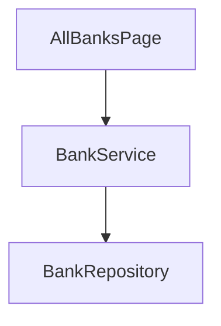

# 银行卡开卡 plan

> **模块标识**: FinancialCard
> **版本**: 1.0
> **创建日期**: 2026-01-01
> **状态**: 已评审
> **对应 spec**: doc/features/demo-card/spec/spec.md

## 1. Scope 声明与继承

```yaml
in_scope_modules:
  - FinancialCard
out_of_scope_modules: []
rationale: 开卡流程只涉及 FinancialCard 模块
```

## 2. 架构影响声明

```yaml
impact: none
affected_items: []
architecture_md_updates: []
catalog_updates: []
```

## 3. 模块架构图



### 3.1 模块变更表

| 模块 | 所属层 | 格式 | 变更类型 | 说明 |
|------|--------|------|----------|------|
| FinancialCard | 02-Feature | HAR | 修改 | 新增银行列表条目组件 |

## 4. 目录/文件结构规划

### 4.1 FinancialCard

```
02-Feature/FinancialCard/
└── src/main/ets/
    ├── AllBanksPage.ets
    ├── BankService.ets
    └── BankListItem.ets
```

| 文件路径 | 职责 | 新增/修改 |
|----------|------|-----------|
| 02-Feature/FinancialCard/src/main/ets/AllBanksPage.ets | 页面容器 | 修改 |
| 02-Feature/FinancialCard/src/main/ets/BankService.ets | 开卡服务 | 修改 |
| 02-Feature/FinancialCard/src/main/ets/BankListItem.ets | 列表条目组件 | 新增 |

## 5. 数据模型定义

```typescript
export interface BankModel {
  id: string;
  name: string;
}
```

| 模型 | 字段 | 类型 | 说明 |
|------|------|------|------|
| BankModel | id | string | 银行标识 |
| BankModel | name | string | 银行名称 |

## 6. 页面组件树

### 6.1 全部银行页

```
AllBanksPage
└── BankListItem
```

| 组件 | 父组件 | 职责 |
|------|--------|------|
| AllBanksPage | — | 页面容器 |
| BankListItem | AllBanksPage | 单条银行 |

## 7. 状态管理方案

| 数据 | 状态 | 作用域 | 装饰器 | 说明 |
|------|------|--------|--------|------|
| 银行列表 | banks | AllBanksPage | @State | 银行列表数据 |

## 8. 服务层接口定义

```typescript
export class BankService {
  openCard(id: string): Promise<boolean>;
}
export class BankRepository {
  list(): string[];
}
```

| 接口 | 签名 | 说明 |
|------|------|------|
| BankService.openCard | `openCard(id: string): Promise<boolean>` | 发起开卡 |
| BankRepository.list | `list(): string[]` | 读取银行列表 |

## 9. 路由/导航设计

| 路由 | 目标页面 | 触发 |
|------|----------|------|
| /open-card | 开卡流程页 | 点击银行条目 |

## 10. 功能映射表

| spec 编号 | 功能名称 | 优先级 | 实现模块 | 关键文件 | 验收编号 |
|-----------|----------|--------|----------|----------|----------|
| F1 | 银行列表展示 | P0 | FinancialCard | 02-Feature/FinancialCard/src/main/ets/BankListItem.ets | AC-1 |
| F2 | 开卡入口 | P1 | FinancialCard | 02-Feature/FinancialCard/src/main/ets/BankService.ets | AC-2 |
