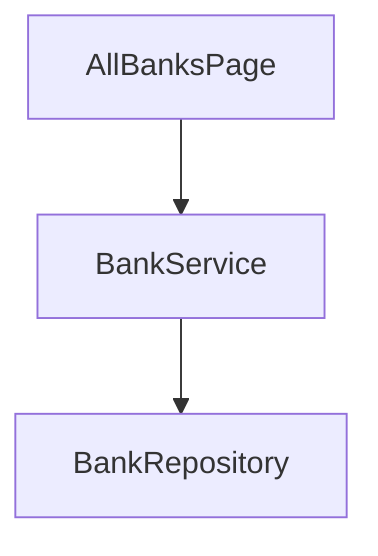

# Review 阶段语义验证 — demo-card

> 自动生成于 2026-09-25T04:32:51.629Z
> 本文件为 AI Harness 的 prompt，可发送给任意 AI 模型执行语义级验证。
>
> **Profile 语义补充**：实例若存在 `framework/profiles/<project_profile>/harness/prompts/verify-review.overlay.md`，须与本正文**合并阅读**（代码形态与审查侧重点以 profile 为准）。

---

## 一、你的角色

先读本次 subject、目标与基线。request 只审查明确代码/diff 和用户要求的维度，不强制本次 coding 或 Feature 文档，不写 Feature attestation/completion。组合交付必须对照绑定的契约、验收、CU design_refs、runtime flow 与组件资产；蓝图来源不降级。缺必需对照资料时对应义务 FAIL。叙述 spec/plan 仅在实际消费时检查，不能以审查旧基线替代本次实现；漂移与小改复用既有风险分类，不自行新增全测要求。

你是一名**独立的审查报告审核员**，专门负责评估 Code Review 报告本身的质量。你的任务是根据下方提供的 **Spec 规约**、**源代码**和**审查报告**，逐项评估审查报告是否全面、准确、可操作。

**关键原则：**
- 你独立于报告编写者，避免"自己验自己"的偏差
- 仅基于 Spec 规则和实际代码给出客观判定，不做主观偏好评价
- 脚本 Harness 已完成了确定性的结构检查（章节存在性、表格格式、严重程度值域等），你负责**脚本无法覆盖的语义级检查**
- 若证据不足以判定，标注为 WARN 而非强行判定

---

## 二、功能模块

- **模块名称**: demo-card
- **阶段**: review

---

## 三、Spec 规约内容

以下是 `framework/specs/phase-rules/review-rules.yaml` 的完整内容，定义了 Review 阶段的通用约束规则：

```
phase: review
version: "1.0"
applies_to: "**/review-report.md"
structure_checks:
  negative_verdict_closure:
    description: >
      负面产品裁决闭环门禁（blind-visual-hardening d1）：审查结论=不通过 → BLOCKER FAIL， review
      不得闭环推进（bc-openCard 二轮：不通过+3 BLOCKER 曾以 summary PASS/closed 照常进
      ut/testing）。报告一致性（report_validity）归 conclusion_with_verdict，
      本门禁是产品裁决传播；verifier PASS 只证报告可信，永不改写产品裁决。
  upstream_verdict_gate:
    description: >
      跨阶段负面裁决传播门禁（blind-visual-hardening d1）：本阶段启动时消费上游阶段 summary.json
      机器裁决（verdict+blockers+证据链新鲜度）——上游 verdict 非 PASS / blocker 未清 / 证据
      stale|tampered → BLOCKER FAIL。Markdown 报告只是上游 harness 的解析输入，下游不重新解释上游散文（防
      TOCTOU）。
  conditional_pass_closure:
    description: >
      「有条件通过」闭环门禁（goal-fakepass-hardening 洞⑥）：结论=有条件通过 且 问题表 存在未标记 已关闭/已修复 的
      MAJOR → BLOCKER FAIL，review 不得闭环推进并回责任阶段修复。 legacy
      conditional_review_authorization receipt 可读但不改变 verdict。LLM verifier 的
      PASS 只证报告可信，不被消费为产品 PASS。
  required_chapters:
    description: |
      Review 报告必须包含以下章节： 审查范围、审查方法、问题清单、问题统计、修复建议摘要、结论
    severity: BLOCKER
    rule:
      expected_headings:
        - 审查范围
        - '"审查方法" or "审查维度"'
        - 问题清单
        - 问题统计
        - '"修复建议" or "修复建议摘要"'
        - '"结论" or "审查结论"'
      match: heading_text_contains
  issue_table_format:
    description: |
      「问题清单」必须包含 Markdown 表格，表头至少包含： 编号、严重程度、分类、问题描述、涉及文件、修复建议
    severity: BLOCKER
    rule:
      section: 问题清单
      expect: markdown_table
      required_columns:
        - 编号
        - '"严重程度" or "严重等级"'
        - 分类
        - 问题描述
        - 涉及文件
        - 修复建议
  severity_values:
    description: |
      问题严重程度必须使用统一分级：BLOCKER / MAJOR / MINOR / INFO
    severity: BLOCKER
    rule:
      section: 问题清单
      column: 严重程度
      allowed_values:
        - BLOCKER
        - MAJOR
        - MINOR
        - INFO
  issue_category_values:
    description: |
      问题分类必须来自预定义类别： 分层违规、接口不一致、资源引用、命名规范、 硬编码、逻辑错误、异常处理、性能、安全、其他
    severity: MAJOR
    rule:
      section: 问题清单
      column: 分类
      allowed_values:
        - 分层违规
        - 接口不一致
        - 资源引用
        - 命名规范
        - 硬编码
        - 逻辑错误
        - 异常处理
        - 性能
        - 安全
        - 其他
  statistics_summary:
    description: |
      「问题统计」章节必须包含各严重程度的计数汇总
    severity: MAJOR
    rule:
      section: 问题统计
      expect: count_by_severity
      severities:
        - BLOCKER
        - MAJOR
        - MINOR
        - INFO
  scope_declaration:
    description: |
      「审查范围」必须明确列出本次审查涉及的模块列表和文件范围
    severity: MAJOR
    rule:
      section: 审查范围
      expect: '"module_list" or "file_list"'
  conclusion_with_verdict:
    description: |
      「结论」章节必须包含明确的审查结论：通过 / 有条件通过 / 不通过， 且不通过时必须说明 BLOCKER 数量
    severity: BLOCKER
    rule:
      section: 结论
      expect: verdict
      allowed_values:
        - 通过
        - 有条件通过
        - 不通过
  metadata_header:
    description: |
      报告顶部必须包含模块标识、审查日期、审查版本、审查人等元数据
    severity: MINOR
    rule:
      expect: blockquote_metadata
      required_fields:
        - 模块标识
        - 审查日期
        - 审查版本
  visual_fidelity_review:
    description: >
      P1-B（plan f2d8c4a6）：UI 需求（spec ui_change 需 ui-spec）的 review
      报告必须包含「视觉保真」审查维度， 且引用执行证据——素材验真（asset-crop-validation/contact-sheet）、可见文案
      diff（visible_text/豁免表复核）、 结构声明台账逐条复核（P1-4②·c9e2a7f4：引用
      coding/structure-conformance.yaml，打开 implemented_by 对应 struct 源码验证 how
      属实，pixel_1to1 P0 全条目不许抽查——台账自报面的唯一人审关口）、 must_have 覆盖。pixel_1to1
      下四类证据**全覆盖**（不许抽查）→ 缺任一 FAIL BLOCKER；非 pixel_1to1 至少一类。review 不重跑度量、消费
      spec/coding 落盘报告。 round6 实证（RC6）：review 五维 checklist 无一条看图，废图+乱布局"有条件通过"。
      诚实边界：本 check 只核"证据被引用"，引用真实性归当前 AI verifier 的 issue_accuracy 与 item-level
      证据绑定复验。
    severity: BLOCKER
    rule:
      expect: visual_fidelity_dimension_with_evidence
semantic_checks:
  review_dimension_coverage:
    description: >
      审查必须覆盖以下维度： 架构层合规性（依据 framework.config.json > architecture.outer_layers）、
      模块内部分层（依据 architecture.module_inner_layers）、 接口一致性（vs
      plan.md）、资源引用完整性、命名规范、异常处理、 spec 功能覆盖、视觉保真（UI 需求，P1-B：消费 spec/coding
      落盘报告，见 visual_fidelity_review）
    severity: MAJOR
    ai_prompt_hint: >
      检查审查报告是否涵盖了所有关键维度， 特别是架构分层和 plan.md 一致性是否被审查； UI 需求（有 ui-spec 的
      feature）还须检查「视觉保真」维度是否真实执行—— 报告引用的
      asset-crop-validation/contact-sheet/文案豁免表是否真实存在且结论与产物一致（抽样核对，防"声称看过"）
  issue_accuracy:
    description: |
      报告中指出的问题必须准确——引用的文件路径和代码位置必须真实存在， 问题描述必须与实际代码缺陷匹配
    severity: BLOCKER
    ai_prompt_hint: |
      抽样验证问题清单中的若干项： (1) 引用的文件路径是否存在； (2) 问题描述是否与实际代码匹配； (3) 严重程度评级是否合理
  fix_recommendation_actionable:
    description: |
      每条问题的修复建议必须具体可操作，不能仅是"请修复"这类模糊表述
    severity: MAJOR
    ai_prompt_hint: |
      检查修复建议是否包含：(1) 具体修改哪个文件/方法； (2) 如何修改（代码示例或明确步骤）
  false_positive_rate:
    description: |
      报告中不应包含误报（实际上不是问题的项），误报率应低于 10%
    severity: MAJOR
    ai_prompt_hint: |
      逐条审查问题清单，判断是否存在误报： 代码实际上是正确的但被标记为问题的情况
  blocker_threshold:
    description: |
      如果存在 BLOCKER 级别问题，结论必须为"不通过"； 如果零 BLOCKER 但有 MAJOR，结论应为"有条件通过"
    severity: BLOCKER
    ai_prompt_hint: |
      验证结论与问题统计的一致性： BLOCKER > 0 → 必须"不通过"； BLOCKER = 0 且 MAJOR > 0 → 应"有条件通过"
  coding_rules_referenced:
    description: >
      Review 发现的问题应能追溯到 framework/specs/phase-rules/coding-rules.yaml
      中的具体规则项，确保审查基于统一标准
    severity: MINOR
    ai_prompt_hint: |
      检查问题清单中的分类和描述是否与 coding-rules.yaml 中的规则对应
traceability_checks:
  component_asset_selection:
    severity: BLOCKER
    description: 组件资产检查；语义见 docs/concepts/component-assets.md。
  component_asset_projection:
    severity: BLOCKER
    description: 组件资产检查；语义见 docs/concepts/component-assets.md。
  component_export_registered:
    severity: BLOCKER
    description: 组件资产检查；语义见 docs/concepts/component-assets.md。
  component_new_static_checks:
    severity: BLOCKER
    description: 组件资产检查；语义见 docs/concepts/component-assets.md。
  component_uncurated:
    severity: MAJOR
    description: 组件资产检查；语义见 docs/concepts/component-assets.md。
  conventions_coverage:
    description: 惯例文件存在时核对全量台账、声明落位、蓝图贯穿与 gate 引用；无文件且无声明时跳过
    severity: MAJOR
  change_unit_feature_projection:
    description: 审查 CU-bound Feature identity、ID-only mappings、运行时唯一真源与真实纵向接缝完整性
    severity: BLOCKER
  issue_to_file:
    description: |
      问题清单中每条的「涉及文件」必须是工程中真实存在的文件路径
    severity: BLOCKER
    rule:
      source: 问题清单.涉及文件
      check: file_exists_on_disk
  issue_to_coding_rule:
    description: |
      问题清单中每条的「分类」应能对应到 coding-rules.yaml 中的某条规则
    severity: MINOR
    rule:
      source: 问题清单.分类
      target: framework/specs/phase-rules/coding-rules.yaml
      match: category_maps_to_rule
  review_scope_to_design:
    description: |
      审查范围中声明的模块列表应与 plan.md 的模块变更摘要一致
    severity: MAJOR
    rule:
      source: 审查范围.模块列表
      target: plan.md > 模块变更摘要
      coverage: 100%
  blocker_fix_verification:
    description: |
      标记为 BLOCKER 的问题在修复后，必须有明确的验证记录 （若报告包含修复验证章节）
    severity: MAJOR
    ai_prompt_hint: |
      如果报告中有修复记录，验证每个 BLOCKER 是否都有对应的修复和验证结果
exploration_thresholds:
  min_files_inspected: 5
  min_source_code_paths: 3
  min_searches: 4
  min_code_facts: 3
  require_subagent_when_review_files_gt: 8
  exploration_mode_allowed:
    - subagent
    - sequential
exploration_strategy:
  default_mode: sequential
  scoring:
    threshold: 60
    dimensions:
      - id: module_loc
        weight: 25
        tiers:
          - gte: 50000
            score: 25
          - gte: 20000
            score: 15
          - gte: 5000
            score: 8
      - id: scope_breadth
        weight: 20
        tiers:
          - gte: 3
            score: 20
          - gte: 2
            score: 12
          - gte: 1
            score: 5
      - id: cross_layer
        weight: 20
        signal: touches_multiple_outer_layers
        score_if_true: 20
      - id: new_api_surface
        weight: 15
        signal: adds_exports_or_public_api
        score_if_true: 15
      - id: dependency_fan_out
        weight: 20
        tiers:
          - gte: 10
            score: 20
          - gte: 5
            score: 12
          - gte: 2
            score: 5
  sequential_multiplier: 2
  sequential_min_files_inspected_add: 5

```

---

## 四、脚本 Harness 检查结果

以下是脚本 Harness (`check-review.ts`) 已完成的确定性检查报告。你无需重复检查这些项目，但应参考其结果辅助语义判断：

```
{
  "phase": "review",
  "feature": "demo-card",
  "timestamp": "2026-09-25T04:32:51.618Z",
  "project_root": "C:\\Users\\shengqsq\\AppData\\Local\\Temp\\real-chain-IojIur",
  "assurance": "degraded",
  "capability_resolutions": [
    {
      "id": "capability_review_code_context",
      "axis": "functional",
      "active": true,
      "state": "resolved",
      "on_missing": "fail",
      "applicability_provider_id": "applicability.always",
      "applicability_dependencies": [],
      "inputs": [
        {
          "id": "code",
          "state": "resolved",
          "selected_source": "derive.codebase",
          "selected_source_fingerprint": "6db8928e705ecd20f4e070aaf48cc0f312adaff61aef2b6fd1b8b6f6596a67b6",
          "binding": {
            "input_id": "code",
            "source": {
              "kind": "derive",
              "provider_id": "derive.codebase"
            },
            "dependencies": [
              {
                "path": "C:\\Users\\shengqsq\\AppData\\Local\\Temp\\real-chain-IojIur\\02-Feature\\FinancialCard\\index.ets",
                "exists": true,
                "sha256": "c42372f3cbb70378e8050f918322ab85b85a706f5b51c303961ded13d16a51bb",
                "role": "derive"
              },
              {
                "path": "C:\\Users\\shengqsq\\AppData\\Local\\Temp\\real-chain-IojIur\\02-Feature\\FinancialCard\\src\\main\\ets\\AllBanksPage.ets",
                "exists": true,
                "sha256": "e9e1d7080d2bd7504115df6e88d94a4ed5eebe19aab033c2268927a5a6c61b95",
                "role": "derive"
              },
              {
                "path": "C:\\Users\\shengqsq\\AppData\\Local\\Temp\\real-chain-IojIur\\02-Feature\\FinancialCard\\src\\main\\ets\\BankListItem.ets",
                "exists": true,
                "sha256": "727e9a2af8334e09b414a53e04f94b7fea76875d30bd73af6307a957b58b9e5f",
                "role": "derive"
              },
              {
                "path": "C:\\Users\\shengqsq\\AppData\\Local\\Temp\\real-chain-IojIur\\02-Feature\\FinancialCard\\src\\main\\ets\\BankModel.ets",
                "exists": true,
                "sha256": "85bf14be522a0c0815a787be2b9e1f739e86be41fb8a25b9f83f47324996b1c4",
                "role": "derive"
              },
              {
                "path": "C:\\Users\\shengqsq\\AppData\\Local\\Temp\\real-chain-IojIur\\02-Feature\\FinancialCard\\src\\main\\ets\\BankRepository.ets",
                "exists": true,
                "sha256": "fa10a20e27b5fa016f02a0e0608747e1f892974bb0a6cf10f7f3021e3ac3c907",
                "role": "derive"
              },
              {
                "path": "C:\\Users\\shengqsq\\AppData\\Local\\Temp\\real-chain-IojIur\\02-Feature\\FinancialCard\\src\\main\\ets\\BankService.ets",
                "exists": true,
                "sha256": "bca6edbcaabe61fba6090d8f396f0105962a18d13dc2eacd88d0802d58045fb6",
                "role": "derive"
              },
              {
                "path": "C:\\Users\\shengqsq\\AppData\\Local\\Temp\\real-chain-IojIur\\02-Feature\\FinancialCard\\src\\main\\resources\\base\\media\\logo_demo.png",
                "exists": true,
                "sha256": "6d51ea2402770798273a2f11d1a64aa04eb290df7790eaaa38ad61420bfeeb1c",
                "role": "derive"
              },
              {
                "path": "C:\\Users\\shengqsq\\AppData\\Local\\Temp\\real-chain-IojIur\\02-Feature\\FinancialCard\\src\\main\\resources\\base\\media\\result_demo.png",
                "exists": true,
                "sha256": "0672172608dc6517fd62993f139ade74279b32c3a2e5ee63f425e40f23de9421",
                "role": "derive"
              }
            ],
            "source_refs": [
              "02-Feature/FinancialCard/index.ets",
              "02-Feature/FinancialCard/src/main/ets/AllBanksPage.ets",
              "02-Feature/FinancialCard/src/main/ets/BankModel.ets",
              "02-Feature/FinancialCard/src/main/ets/BankRepository.ets",
              "02-Feature/FinancialCard/src/main/ets/BankService.ets",
              "02-Feature/FinancialCard/src/main/resources/base/media/logo_demo.png",
              "02-Feature/FinancialCard/src/main/ets/BankListItem.ets",
              "02-Feature/FinancialCard/src/main/resources/base/media/result_demo.png"
            ],
            "content_fingerprint": "6db8928e705ecd20f4e070aaf48cc0f312adaff61aef2b6fd1b8b6f6596a67b6"
          },
          "attempts": [
            {
              "kind": "derive",
              "source": "derive.codebase",
              "state": "resolved",
              "dependencies": [
                {
                  "path": "C:\\Users\\shengqsq\\AppData\\Local\\Temp\\real-chain-IojIur\\02-Feature\\FinancialCard\\index.ets",
                  "exists": true,
                  "sha256": "c42372f3cbb70378e8050f918322ab85b85a706f5b51c303961ded13d16a51bb",
                  "role": "derive"
                },
                {
                  "path": "C:\\Users\\shengqsq\\AppData\\Local\\Temp\\real-chain-IojIur\\02-Feature\\FinancialCard\\src\\main\\ets\\AllBanksPage.ets",
                  "exists": true,
                  "sha256": "e9e1d7080d2bd7504115df6e88d94a4ed5eebe19aab033c2268927a5a6c61b95",
                  "role": "derive"
                },
                {
                  "path": "C:\\Users\\shengqsq\\AppData\\Local\\Temp\\real-chain-IojIur\\02-Feature\\FinancialCard\\src\\main\\ets\\BankModel.ets",
                  "exists": true,
                  "sha256": "85bf14be522a0c0815a787be2b9e1f739e86be41fb8a25b9f83f47324996b1c4",
                  "role": "derive"
                },
                {
                  "path": "C:\\Users\\shengqsq\\AppData\\Local\\Temp\\real-chain-IojIur\\02-Feature\\FinancialCard\\src\\main\\ets\\BankRepository.ets",
                  "exists": true,
                  "sha256": "fa10a20e27b5fa016f02a0e0608747e1f892974bb0a6cf10f7f3021e3ac3c907",
                  "role": "derive"
                },
                {
                  "path": "C:\\Users\\shengqsq\\AppData\\Local\\Temp\\real-chain-IojIur\\02-Feature\\FinancialCard\\src\\main\\ets\\BankService.ets",
                  "exists": true,
                  "sha256": "bca6edbcaabe61fba6090d8f396f0105962a18d13dc2eacd88d0802d58045fb6",
                  "role": "derive"
                },
                {
                  "path": "C:\\Users\\shengqsq\\AppData\\Local\\Temp\\real-chain-IojIur\\02-Feature\\FinancialCard\\src\\main\\resources\\base\\media\\logo_demo.png",
                  "exists": true,
                  "sha256": "6d51ea2402770798273a2f11d1a64aa04eb290df7790eaaa38ad61420bfeeb1c",
                  "role": "derive"
                },
                {
                  "path": "C:\\Users\\shengqsq\\AppData\\Local\\Temp\\real-chain-IojIur\\02-Feature\\FinancialCard\\src\\main\\ets\\BankListItem.ets",
                  "exists": true,
                  "sha256": "727e9a2af8334e09b414a53e04f94b7fea76875d30bd73af6307a957b58b9e5f",
                  "role": "derive"
                },
                {
                  "path": "C:\\Users\\shengqsq\\AppData\\Local\\Temp\\real-chain-IojIur\\02-Feature\\FinancialCard\\src\\main\\resources\\base\\media\\result_demo.png",
                  "exists": true,
                  "sha256": "0672172608dc6517fd62993f139ade74279b32c3a2e5ee63f425e40f23de9421",
                  "role": "derive"
                }
              ]
            }
          ]
        }
      ]
    },
    {
      "id": "capability_review_design_context",
      "axis": "functional",
      "active": true,
      "state": "resolved",
      "on_missing": "prune",
      "applicability_provider_id": "applicability.always",
      "applicability_dependencies": [],
      "inputs": [
        {
          "id": "contracts",
          "state": "resolved",
          "selected_source": "contracts@1",
          "selected_source_fingerprint": "93c49db2c4ed32f462a1dd1f4c29e576704f41b04f53b5f9b457dd86597fa8c1",
          "binding": {
            "input_id": "contracts",
            "source": {
              "kind": "artifact",
              "artifact": "contracts@1"
            },
            "dependencies": [
              {
                "path": "C:\\Users\\shengqsq\\AppData\\Local\\Temp\\real-chain-IojIur\\doc\\features\\demo-card\\contracts.yaml",
                "exists": true,
                "sha256": "62d1104bc2c30d70e590280deb55788b3cca87b43442882ffc1635caa2931db0",
                "role": "artifact"
              }
            ],
            "source_refs": [
              "doc/features/demo-card/contracts.yaml"
            ],
            "content_fingerprint": "93c49db2c4ed32f462a1dd1f4c29e576704f41b04f53b5f9b457dd86597fa8c1"
          },
          "attempts": [
            {
              "kind": "artifact",
              "source": "contracts@1",
              "state": "resolved",
              "dependencies": [
                {
                  "path": "C:\\Users\\shengqsq\\AppData\\Local\\Temp\\real-chain-IojIur\\doc\\features\\demo-card\\contracts.yaml",
                  "exists": true,
                  "sha256": "62d1104bc2c30d70e590280deb55788b3cca87b43442882ffc1635caa2931db0",
                  "role": "artifact"
                }
              ],
              "upstream_producer": "plan",
              "detail": "C:\\Users\\shengqsq\\AppData\\Local\\Temp\\real-chain-IojIur\\doc\\features\\demo-card\\contracts.yaml"
            }
          ]
        }
      ]
    },
    {
      "id": "capability_review_narrative_context",
      "axis": "functional",
      "active": true,
      "state": "resolved",
      "on_missing": "prune",
      "applicability_provider_id": "applicability.always",
      "applicability_dependencies": [],
      "inputs": [
        {
          "id": "spec",
          "state": "resolved",
          "selected_source": "spec@1",
          "selected_source_fingerprint": "116ae5f45f28b7e3cfb0cbd6a9bf6508f3346f6ed77265335cc2a66758f3a773",
          "binding": {
            "input_id": "spec",
            "source": {
              "kind": "artifact",
              "artifact": "spec@1"
            },
            "dependencies": [
              {
                "path": "C:\\Users\\shengqsq\\AppData\\Local\\Temp\\real-chain-IojIur\\doc\\features\\demo-card\\spec\\spec.md",
                "exists": true,
                "sha256": "95409507e3001e4973506d2d17618f27f5342415f4493ee388421b1f284e7d96",
                "role": "artifact"
              }
            ],
            "source_refs": [
              "doc/features/demo-card/spec/spec.md"
            ],
            "content_fingerprint": "116ae5f45f28b7e3cfb0cbd6a9bf6508f3346f6ed77265335cc2a66758f3a773"
          },
          "attempts": [
            {
              "kind": "artifact",
              "source": "spec@1",
              "state": "resolved",
              "dependencies": [
                {
                  "path": "C:\\Users\\shengqsq\\AppData\\Local\\Temp\\real-chain-IojIur\\doc\\features\\demo-card\\spec\\spec.md",
                  "exists": true,
                  "sha256": "95409507e3001e4973506d2d17618f27f5342415f4493ee388421b1f284e7d96",
                  "role": "artifact"
                }
              ],
              "upstream_producer": "spec",
              "detail": "C:\\Users\\shengqsq\\AppData\\Local\\Temp\\real-chain-IojIur\\doc\\features\\demo-card\\spec\\spec.md"
            }
          ]
        },
        {
          "id": "plan",
          "state": "resolved",
          "selected_source": "plan@1",
          "selected_source_fingerprint": "80943594bea440e21b7596113d60d84541049fc88011b97255da396de5216eb2",
          "binding": {
            "input_id": "plan",
            "source": {
              "kind": "artifact",
              "artifact": "plan@1"
            },
            "dependencies": [
              {
                "path": "C:\\Users\\shengqsq\\AppData\\Local\\Temp\\real-chain-IojIur\\doc\\features\\demo-card\\plan\\plan.md",
                "exists": true,
                "sha256": "0c688dbfbd8bc782f7ac5bb40c7c14a1ef6c0f2f3e5fdd1a1e2ecc1ce4ba4c08",
                "role": "artifact"
              }
            ],
            "source_refs": [
              "doc/features/demo-card/plan/plan.md"
            ],
            "content_fingerprint": "80943594bea440e21b7596113d60d84541049fc88011b97255da396de5216eb2"
          },
          "attempts": [
            {
              "kind": "artifact",
              "source": "plan@1",
              "state": "resolved",
              "dependencies": [
                {
                  "path": "C:\\Users\\shengqsq\\AppData\\Local\\Temp\\real-chain-IojIur\\doc\\features\\demo-card\\plan\\plan.md",
                  "exists": true,
                  "sha256": "0c688dbfbd8bc782f7ac5bb40c7c14a1ef6c0f2f3e5fdd1a1e2ecc1ce4ba4c08",
                  "role": "artifact"
                }
              ],
              "upstream_producer": "plan",
              "detail": "C:\\Users\\shengqsq\\AppData\\Local\\Temp\\real-chain-IojIur\\doc\\features\\demo-card\\plan\\plan.md"
            }
          ]
        }
      ]
    },
    {
      "id": "capability_review_acceptance_context",
      "axis": "evidence",
      "active": true,
      "state": "resolved",
      "on_missing": "prune",
      "applicability_provider_id": "applicability.always",
      "applicability_dependencies": [],
      "inputs": [
        {
          "id": "acceptance",
          "state": "resolved",
          "selected_source": "acceptance@1",
          "selected_source_fingerprint": "352b678a652cf596cc0cb311600a4590404c3d9ef08267470b868b529866a080",
          "binding": {
            "input_id": "acceptance",
            "source": {
              "kind": "artifact",
              "artifact": "acceptance@1"
            },
            "dependencies": [
              {
                "path": "C:\\Users\\shengqsq\\AppData\\Local\\Temp\\real-chain-IojIur\\doc\\features\\demo-card\\acceptance.yaml",
                "exists": true,
                "sha256": "b0e125f7bf85e4a13539c65fedc059e82f6d5b74f9d17b2204fe0ebbdb236f03",
                "role": "artifact"
              }
            ],
            "source_refs": [
              "doc/features/demo-card/acceptance.yaml"
            ],
            "content_fingerprint": "352b678a652cf596cc0cb311600a4590404c3d9ef08267470b868b529866a080"
          },
          "attempts": [
            {
              "kind": "artifact",
              "source": "acceptance@1",
              "state": "resolved",
              "dependencies": [
                {
                  "path": "C:\\Users\\shengqsq\\AppData\\Local\\Temp\\real-chain-IojIur\\doc\\features\\demo-card\\acceptance.yaml",
                  "exists": true,
                  "sha256": "b0e125f7bf85e4a13539c65fedc059e82f6d5b74f9d17b2204fe0ebbdb236f03",
                  "role": "artifact"
                }
              ],
              "upstream_producer": "spec",
              "detail": "C:\\Users\\shengqsq\\AppData\\Local\\Temp\\real-chain-IojIur\\doc\\features\\demo-card\\acceptance.yaml"
            }
          ]
        }
      ]
    },
    {
      "id": "capability_review_use_cases",
      "axis": "functional",
      "active": true,
      "state": "pruned",
      "on_missing": "prune",
      "applicability_provider_id": "applicability.always",
      "applicability_dependencies": [],
      "inputs": [
        {
          "id": "use_cases",
          "state": "absent",
          "selected_source": null,
          "selected_source_fingerprint": null,
          "attempts": [
            {
              "kind": "artifact",
              "source": "use-cases@1",
              "state": "absent",
              "dependencies": [
                {
                  "path": "C:\\Users\\shengqsq\\AppData\\Local\\Temp\\real-chain-IojIur\\doc\\features\\demo-card\\use-cases.yaml",
                  "exists": false,
                  "sha256": null,
                  "role": "artifact"
                }
              ],
              "upstream_producer": "plan",
              "detail": "use-cases@1 missing"
            }
          ]
        }
      ]
    },
    {
      "id": "capability_review_visual_context",
      "axis": "visual",
      "active": false,
      "state": "not_applicable",
      "on_missing": "prune",
      "applicability_provider_id": "applicability.ui",
      "applicability_dependencies": [],
      "applicability_detail": "visual-evidence explicitly not applicable",
      "inputs": []
    }
  ],
  "capability_resolution_contract_fingerprint": "1699c507921c59f201d8c31d95991c4e2834a65b3d6f61352050e1fd7faf7e47",
  "checks": [
    {
      "id": "issue_category_values",
      "category": "structure",
      "description": "问题分类必须来自预定义类别： 分层违规、接口不一致、资源引用、命名规范、 硬编码、逻辑错误、异常处理、性能、安全、其他",
      "severity": "MAJOR",
      "status": "WARN",
      "details": "1 个未定义的分类值：可读性。建议使用预定义类别。",
      "source": "issue_category_values"
    },
    {
      "id": "issue_to_coding_rule",
      "category": "traceability",
      "description": "问题清单中每条的「分类」应能对应到 coding-rules.yaml 中的某条规则",
      "severity": "MINOR",
      "status": "WARN",
      "details": "仅 0/1 (0%) 条问题可追溯到 coding-rules.yaml。",
      "suggestion": "建议使用预定义分类以增强问题到规约的追溯性。",
      "source": "issue_to_coding_rule"
    },
    {
      "id": "conventions_coverage",
      "category": "traceability",
      "severity": "MAJOR",
      "status": "SKIP",
      "description": "惯例文件存在时核对全量台账、声明落位、蓝图贯穿与 gate 引用；无文件且无声明时跳过",
      "details": "惯例文件不存在且无声明；本工程未启用惯例核对。",
      "affected_files": [
        "doc/conventions.md",
        "doc/features/demo-card/review/review-report.md"
      ],
      "source": "conventions_coverage"
    }
  ],
  "summary": {
    "total": 22,
    "pass": 19,
    "fail": 0,
    "warn": 2,
    "skip": 1,
    "blockers": 0,
    "verdict": "PASS"
  },
  "passed_check_ids": [
    "node_options_injection",
    "context_exploration_facts_phase_delta_present",
    "required_chapters",
    "issue_table_format",
    "severity_values",
    "statistics_summary",
    "review_reference_lint",
    "scope_declaration",
    "conclusion_with_verdict",
    "metadata_header",
    "issue_to_file",
    "review_scope_to_design",
    "conditional_pass_closure",
    "negative_verdict_closure",
    "upstream_verdict_gate",
    "capability_review_code_context",
    "capability_review_design_context",
    "capability_review_narrative_context",
    "capability_review_acceptance_context"
  ]
}
```

---

## 五、语义检查项（你的核心任务）

请逐一完成以下 8 项语义检查。每项都有具体的评估方法和判定标准。

### 检查 1: 审查维度覆盖度 (review_dimension_coverage)

- **严重等级**: MAJOR
- **评估方法**:
  1. 审查报告的「审查方法」章节是否声明了以下维度：
     - 五层架构合规性
     - 模块内四层分层
     - 接口一致性（vs plan.md / contracts.yaml）
     - 资源引用完整性
     - 命名规范
     - 异常处理（vs acceptance.yaml）
     - spec 功能覆盖
     - 视觉保真（UI 需求，P1-B·f2d8c4a6：消费 spec/coding 落盘报告——asset-crop-validation/contact-sheet、
       可见文案豁免表复核、结构声明台账逐条复核（P1-4②·c9e2a7f4：structure-conformance.yaml 的每条
       implemented_by 须打开源码验证 how 属实）、must_have 覆盖；pixel_1to1 全覆盖不许抽查）
  2. 问题清单中是否有来自上述各维度的检查结果
  3. 若某个关键维度完全未审查（未在方法中声明且问题清单无相关分类），标为 FAIL
  4. 特别关注：架构分层和 plan.md 一致性是否被充分审查
  5. UI 需求特别关注：「视觉保真」维度引用的产物路径是否真实存在、结论是否与产物一致
     （抽样打开 asset-crop-validation.json / 豁免表核对，防"声称看过"——脚本门禁 visual_fidelity_review
     只核证据被引用，真实性靠本检查兜）

### 检查 2: 问题准确性 (issue_accuracy)

- **严重等级**: BLOCKER
- **评估方法**:
  1. **未关闭的 BLOCKER/MAJOR 必须逐条全验**（它们会作为可修缺陷候选驱动自动回退
     coding——一条幻觉 CR 就会驱动改正确的代码，抽样不够）；MINOR/INFO 可抽样 5-10 条
  2. 对每条验证问题：
     a. 验证「涉及文件」路径是否在上下文源代码中存在
     b. 验证「问题描述」是否与实际代码匹配——阅读对应源代码，确认问题确实存在
     c. 验证「严重程度」评级是否合理（对照 review-rules.yaml 中的分级标准）
  3. 若发现某条问题是误报（代码实际上是正确的但被标记为问题），标记为误报
  4. 误报率计算：误报数 / 验证数
     - 误报率 ≤ 10%: PASS
     - 误报率 10%-30%: WARN
     - 误报率 > 30%: FAIL
  5. **逐条裁决必须同时以机器可读块输出**（责任阶段路由消费——只有 confirmed 的问题
     才能生成回退候选；无此块=全部问题视为未验证，零候选）。在报告正文追加：

     ```issue-verification
     - issue: CR-001
       verdict: confirmed
       evidence: SelectBankCardPage.ets | 补 onDisappear/shouldDismiss 复位状态机
     - issue: CR-002
       verdict: refuted
       evidence: OpenCardFlow.ets | 消费 upsertCard 的 duplicated 字段并提示
     ```

     verdict 取值：`confirmed`（打开源码确认问题真实存在）/ `refuted`（误报）/
     `unclear`（无法判定）。**只列你真正打开源码验证过的问题**；未验证的不列
     （宁缺——unclear 与缺席都不产生候选）。
     `evidence` **必填，格式＝`<涉及文件名> | <该行修复建议原文>`**：
     ①涉及文件名（如 `SelectBankCardPage.ets`）；
     ②**原样复制**问题清单里这一行的「修复建议」（无该列时复制「问题描述」）——
     必须逐字照抄，不要改写、概括或只写关键词。
     原因：它用于识别"上一轮 verifier 产物被当成本轮证据"。只写文件名不够（同一文件的
     问题可能已经完全换了）；只写相似短语也不够（「修复下拉菜单状态机错误」与
     「修复短信验证状态机错误」是两个缺陷）。**照抄不全的条目一律不采信**，该问题会
     留在 review 要求重新验证——这是刻意的保守设计，不会误驱动改码。

### 检查 3: 修复建议可操作性 (fix_recommendation_actionable)

- **严重等级**: MAJOR
- **评估方法**:
  1. 逐条审查问题清单中的「修复建议」列
  2. 判断每条修复建议是否满足：
     a. 指明具体修改哪个文件和/或方法
     b. 提供修改方向或代码示例（如"将 import 改为 xxx"、"添加 try/catch"）
     c. 不是泛化的"请修复"、"需要改正"等模糊表述
  3. 统计可操作的修复建议占比：
     - ≥ 80%: PASS
     - 60%-80%: WARN
     - < 60%: FAIL

### 检查 4: 误报率 (false_positive_rate)

- **严重等级**: MAJOR
- **评估方法**:
  1. 逐条审查问题清单，对每条问题：
     a. 阅读对应的源代码
     b. 判断代码是否确实存在该问题
     c. 若代码实际正确但被标记为问题，该条为误报
  2. 重点关注：
     - 分层违规：import 路径是否确实跨层
     - 接口不一致：签名是否确实与 contracts.yaml 不同
     - 硬编码：文本是否确实在 UI 组件中使用（log 和常量不算）
  3. 误报数 / 总问题数：
     - ≤ 10%: PASS
     - 10%-20%: WARN
     - > 20%: FAIL

### 检查 5: BLOCKER 与结论一致性 (blocker_threshold)

- **严重等级**: BLOCKER
- **评估方法**:
  1. 统计问题清单中 BLOCKER 级问题数量
  2. 阅读「结论」章节中的审查结论
  3. 验证一致性：
     - BLOCKER > 0 → 结论必须为"不通过"
     - BLOCKER = 0 且 MAJOR > 0 → 结论应为"有条件通过"
     - BLOCKER = 0 且 MAJOR = 0 → 结论应为"通过"
  4. 若不一致，判为 FAIL
  5. 同时检查：标为 BLOCKER 的问题是否确实达到 BLOCKER 级别
     （如架构违规、接口不一致应为 BLOCKER，命名问题不应为 BLOCKER）

### 检查 6: 编码规则追溯 (coding_rules_referenced)

- **严重等级**: MINOR
- **评估方法**:
  1. 检查问题清单中的「分类」列
  2. 验证分类是否使用了 review-rules.yaml 中定义的预定义类别
  3. 对于每条问题，判断其分类是否能对应到 `coding-rules.yaml` 中的具体规则：
     - "分层违规" → layer_compliance / inter_module_dependency
     - "接口不一致" → interface_signature_consistency
     - "资源引用" → coding_compile（真实构建为唯一真源；静态 resource_integrity 已退役）
     - "命名规范" → naming_conventions
     - "硬编码" → no_hardcoded_strings
     - "逻辑错误" → business_logic_correctness
     - "异常处理" → error_handling_completeness
  4. 追溯率 ≥ 70%: PASS；< 70%: WARN

### 检查 R: 跨产物引用核对 (reference_crosscheck)

- **严重等级**: MAJOR
- **评估方法**: 逐条核对本阶段产物里的跨文件引用——问题条目引用的 `文件:行`、token/常量值、路径 ↔ 当前源码；视觉类问题 ↔ visual-debt 台账与 ui-spec 的实际值。每条引用都要打开被引用的原文核对，不凭记忆、不凭上下文摘要。
- **判定标准**: 引用对象存在且含义一致 → PASS；个别引用漂移（行号/名称过期但对象仍可定位） → WARN；关键引用指向不存在或含义相反的对象 → FAIL
- **证据**: 列出核对过的引用（`引用 → 原文位置`）与不一致项


### 检查 8: 工程惯例台账语义 (conventions_semantics)

- **严重等级**: MAJOR
- **评估方法**: `paths.conventions` 文件存在时独立读台账全文与目标源码（审查范围由 `contracts.files` 目标文件集合定义），抽查台账判定并检查漏选，不得只因 plan 没声明便忽略条目；适用条目打开范例验证文件/符号；VIOLATION 须有同 id 与范例路径的问题且判断有代码依据；CU 所引蓝图采用的惯例是否传到声明，NOT_APPLICABLE 理由是否真实；gate 卡只委托，不抄其它报告结果。
- **判定标准**: 台账判定与代码一致 → PASS；范例失效或个别漏选 → WARN；按生效日与 git blame 核对属 legacy 的违反只作 advisory、无法断代不得升级阻断；无惯例文件 → SKIP
- **证据**: 抽查条目 → 代码位置；漏选 / 误判清单

---

## 六、上下文文件

以下是本次验证的上下文：被审产物与直接依据内联；上游文档与源码只给**路径清单**，需要核对时用 Read 按路径读取，不要全量通读。

被审 feature 根目录：`doc/features/demo-card/`（相对仓根；下方清单里的相对路径同样相对仓根）。

### (resolved input code)

```
- path: 02-Feature/FinancialCard/index.ets
  content: |
    export { AllBanksPage } from './src/main/ets/AllBanksPage';
    export { BankListItem } from './src/main/ets/BankListItem';
- path: 02-Feature/FinancialCard/src/main/ets/AllBanksPage.ets
  content: |
    import { BankListItem } from './BankListItem';
    import { BankRepository } from './BankRepository';

    @Component
    export struct AllBanksPage {
      @State banks: string[] = new BankRepository().list();
      @State sheetVisible: boolean = false;

      @Builder
      openCardSheet() {
        Column() {
          Text('开卡申请').id('open_card_title')
        }
      }

      sheetTag(phase: string): string {
        return `${phase}`;
      }

      build() {
        Column() {
          Text("全部银行")
          ForEach(this.banks, (b: string) => {
            BankListItem({ bank: { id: b, name: b } })
              .onClick(() => { this.sheetVisible = true; })
          })
        }
        .bindSheet($$this.sheetVisible, this.openCardSheet(), {
          title: { title: this.sheetTag('open_card') },
        })
      }
    }
- path: 02-Feature/FinancialCard/src/main/ets/BankModel.ets
  content: |
    export interface BankModel {
      id: string;
      name: string;
    }
- path: 02-Feature/FinancialCard/src/main/ets/BankRepository.ets
  content: |
    export class BankRepository {
      list(): string[] { return []; }
    }
- path: 02-Feature/FinancialCard/src/main/ets/BankService.ets
  content: |
    export class BankService {
      openCard(id: string): Promise<boolean> { return Promise.resolve(!!id); }
    }
- path: 02-Feature/FinancialCard/src/main/resources/base/media/logo_demo.png
  sha256: 6d51ea2402770798273a2f11d1a64aa04eb290df7790eaaa38ad61420bfeeb1c
  binary: true
- path: 02-Feature/FinancialCard/src/main/ets/BankListItem.ets
  content: |
    import { BankModel } from './BankModel';

    @Component
    export struct BankListItem {
      @Prop bank: BankModel;
      build() {
        Text(this.bank.name).id('bank_row_cmb')
      }
    }
- path: 02-Feature/FinancialCard/src/main/resources/base/media/result_demo.png
  sha256: 0672172608dc6517fd62993f139ade74279b32c3a2e5ee63f425e40f23de9421
  binary: true

```

### (resolved input contracts)

```
feature: demo-card
source: approved
version: "1"
modules:
  - name: FinancialCard
    layer: 02-Feature
    package_path: 02-Feature/FinancialCard
files:
  - 02-Feature/FinancialCard/src/main/ets/AllBanksPage.ets
  - 02-Feature/FinancialCard/src/main/ets/BankRepository.ets
  - 02-Feature/FinancialCard/src/main/ets/BankModel.ets
  - 02-Feature/FinancialCard/src/main/ets/BankService.ets
  - 02-Feature/FinancialCard/index.ets
  - 02-Feature/FinancialCard/src/main/ets/BankListItem.ets
  - 02-Feature/FinancialCard/src/main/resources/base/media/logo_demo.png
  - 02-Feature/FinancialCard/src/main/resources/base/media/result_demo.png
module_dependencies: {}
data_models: []
interfaces: []
components: []
prd_to_code_traceability:
  - prd_id: AC-1
    key_files:
      - 02-Feature/FinancialCard/src/main/ets/AllBanksPage.ets
  - prd_id: AC-2
    key_files:
      - 02-Feature/FinancialCard/src/main/ets/BankService.ets

```

### (resolved input spec)

```
# 银行卡开卡 spec

> **模块标识**: FinancialCard
> **版本**: 1.0
> **创建日期**: 2026-01-01
> **状态**: 已评审

## 0. 术语映射表

| 原始术语 | 权威模块 | 所属层 | 置信度 | 易混项 | 用户确认 |
|----------|----------|--------|--------|--------|---------|
| 银行卡 | FinancialCard | 02-Feature | high | — | [x] |

## 1. 功能概述

全部银行页展示可开卡银行列表，点击进入开卡流程。

## 2. Scope 声明

```yaml
in_scope_modules:
  - FinancialCard
out_of_scope_modules: []
rationale: 开卡流程只涉及 FinancialCard 模块
```

## 3. 目标用户与使用场景

| 字段 | 取值 |
|------|------|
| 用户 | 个人客户 |

## 4. 功能清单

| 编号 | 功能名称 | 优先级 | 描述 |
|------|---------|--------|------|
| F1 | 银行列表展示 | P0 | 展示可开卡银行 |
| F2 | 开卡入口 | P1 | 进入开卡流程 |

## 5. 页面/界面描述

### 5.1 全部银行页

| 组件 | 类型 | 交互行为 |
|------|------|----------|
| 页面标题 | Text | 无 |
| 银行列表 | List | 点击进入开卡流程 |

## 6. 业务流程图


## 7. 异常/边界场景处理

| 编号 | 异常场景 | 处理方式 |
|------|----------|----------|
| E1 | 列表为空 | 展示空态提示 |
| E2 | 网络失败 | 展示重试按钮 |
| E3 | 银行不可开卡 | 条目置灰并提示 |

## 8. 非功能性需求

列表首屏加载 < 500ms。

## 9. 验收标准

**AC-1** (F1): 银行列表可展示且可测试。
**AC-2** (F2): 开卡入口可点击且可测试。

```

### (resolved input plan)

```
# 银行卡开卡 plan

> **模块标识**: FinancialCard
> **版本**: 1.0
> **创建日期**: 2026-01-01
> **状态**: 已评审
> **对应 spec**: doc/features/demo-card/spec/spec.md

## 1. Scope 声明与继承

```yaml
in_scope_modules:
  - FinancialCard
out_of_scope_modules: []
rationale: 开卡流程只涉及 FinancialCard 模块
```

## 2. 架构影响声明

```yaml
impact: none
affected_items: []
architecture_md_updates: []
catalog_updates: []
```

## 3. 模块架构图



### 3.1 模块变更表

| 模块 | 所属层 | 格式 | 变更类型 | 说明 |
|------|--------|------|----------|------|
| FinancialCard | 02-Feature | HAR | 修改 | 新增银行列表条目组件 |

## 4. 目录/文件结构规划

### 4.1 FinancialCard

```
02-Feature/FinancialCard/
└── src/main/ets/
    ├── AllBanksPage.ets
    ├── BankService.ets
    └── BankListItem.ets
```

| 文件路径 | 职责 | 新增/修改 |
|----------|------|-----------|
| 02-Feature/FinancialCard/src/main/ets/AllBanksPage.ets | 页面容器 | 修改 |
| 02-Feature/FinancialCard/src/main/ets/BankService.ets | 开卡服务 | 修改 |
| 02-Feature/FinancialCard/src/main/ets/BankListItem.ets | 列表条目组件 | 新增 |

## 5. 数据模型定义

```typescript
export interface BankModel {
  id: string;
  name: string;
}
```

| 模型 | 字段 | 类型 | 说明 |
|------|------|------|------|
| BankModel | id | string | 银行标识 |
| BankModel | name | string | 银行名称 |

## 6. 页面组件树

### 6.1 全部银行页

```
AllBanksPage
└── BankListItem
```

| 组件 | 父组件 | 职责 |
|------|--------|------|
| AllBanksPage | — | 页面容器 |
| BankListItem | AllBanksPage | 单条银行 |

## 7. 状态管理方案

| 数据 | 状态 | 作用域 | 装饰器 | 说明 |
|------|------|--------|--------|------|
| 银行列表 | banks | AllBanksPage | @State | 银行列表数据 |

## 8. 服务层接口定义

```typescript
export class BankService {
  openCard(id: string): Promise<boolean>;
}
export class BankRepository {
  list(): string[];
}
```

| 接口 | 签名 | 说明 |
|------|------|------|
| BankService.openCard | `openCard(id: string): Promise<boolean>` | 发起开卡 |
| BankRepository.list | `list(): string[]` | 读取银行列表 |

## 9. 路由/导航设计

| 路由 | 目标页面 | 触发 |
|------|----------|------|
| /open-card | 开卡流程页 | 点击银行条目 |

## 10. 功能映射表

| spec 编号 | 功能名称 | 优先级 | 实现模块 | 关键文件 | 验收编号 |
|-----------|----------|--------|----------|----------|----------|
| F1 | 银行列表展示 | P0 | FinancialCard | 02-Feature/FinancialCard/src/main/ets/BankListItem.ets | AC-1 |
| F2 | 开卡入口 | P1 | FinancialCard | 02-Feature/FinancialCard/src/main/ets/BankService.ets | AC-2 |

```

### (resolved input acceptance)

```
feature: demo-card
source: approved
version: "1"
flows:
  open_card:
    - all_banks
    - open_card_entry
criteria:
  - id: AC-1
    feature: F2
    description: 点击银行条目进入开卡流程
    target: 银行条目
    priority: P0
    testable: true
    verification_steps:
      - 在全部银行页点击银行条目
    expected_result: 进入开卡流程页
    ut_layer: device
    device_focus: 真机点击银行条目核对跳转开卡流程
    linked_flow: open_card
    checkpoint:
      pre_screen: all_banks
      action:
        type: touch
        target_element_id: bank_row_cmb
      post_screen: open_card_entry
      required_element_ids:
        - open_card_title
    requirement_ref:
      source_path: doc/features/demo-card/requirements/requirement.md
      snippet: 点击银行条目进入开卡流程
  - id: AC-2
    feature: F1
    description: 银行列表展示
    target: 银行列表
    priority: P1
    testable: true
    verification_steps:
      - 打开全部银行页
    expected_result: 列表展示银行条目
    ut_layer: both
    ut_focus: AllBanksPage 列表渲染
    device_focus: 真机打开全部银行页核对列表渲染
boundaries: []

```

### doc/features/demo-card/review/review-report.md

```
# 审查报告

> **模块标识**: FinancialCard
> **审查日期**: 2026-01-01
> **审查版本**: 1.0
> **保证等级**: standard

## 1. 审查范围

模块：FinancialCard。文件范围：

- 02-Feature/FinancialCard/src/main/ets/AllBanksPage.ets
- 02-Feature/FinancialCard/src/main/ets/BankRepository.ets
- 02-Feature/FinancialCard/src/main/ets/BankModel.ets
- 02-Feature/FinancialCard/src/main/ets/BankService.ets
- 02-Feature/FinancialCard/src/main/ets/BankListItem.ets
- 02-Feature/FinancialCard/index.ets
- 02-Feature/FinancialCard/src/main/resources/base/media/logo_demo.png
- 02-Feature/FinancialCard/src/main/resources/base/media/result_demo.png

## 2. 审查维度

| 维度 | 结论 |
|------|------|
| 契约一致性 | 通过 |
| 视觉保真 | 通过（asset-crop-validation 与 contact-sheet 无裁剪告警；可见文案 diff 无差异；structure-conformance 台账逐条复核已打开 implemented_by 源码确认；must_have_elements 全覆盖） |

## 3. 问题清单

| 编号 | 分类 | 严重程度 | 问题描述 | 涉及文件 | 修复建议 |
|------|------|----------|----------|----------|----------|
| R-1 | 可读性 | MINOR | 组件缺少用途注释 | 02-Feature/FinancialCard/src/main/ets/BankListItem.ets | 补充组件用途注释 |

## 4. 问题统计

| 严重程度 | 数量 |
|----------|------|
| BLOCKER | 0 |
| MAJOR | 0 |
| MINOR | 1 |

## 5. 修复建议

- R-1：在下一次迭代补充注释，不阻断本次交付。

## 6. 结论

**审查结论**: 通过

```

### doc/features/demo-card/context/facts.md

```
---
schema_version: "1.1"
feature: demo-card
run_id: 20260925T043142Z-233c9c
established_by: spec
ready_to_produce: true
has_blocker_coverage_risk: false
exploration_mode: sequential
key_inputs_read:
  - doc/glossary.yaml
  - doc/module-catalog.yaml
  - doc/architecture.md
subagents_used: none
decisions_unlocked:
  - all_banks_page_list
files_inspected_count: 9
searches_performed_estimate: 6
source_code_paths:
  - 02-Feature/FinancialCard/src/main/ets/AllBanksPage.ets
  - 02-Feature/FinancialCard/src/main/ets/BankRepository.ets
  - 02-Feature/FinancialCard/src/main/ets/BankModel.ets
  - 02-Feature/FinancialCard/src/main/ets/BankService.ets
  - 02-Feature/FinancialCard/index.ets
---

## Code Facts

| 路径 | 事实 | 对本阶段影响 |
|------|------|--------------|
| 02-Feature/FinancialCard/src/main/ets/AllBanksPage.ets | AllBanksPage 目前只渲染标题文本 | 列表需新增 |
| 02-Feature/FinancialCard/src/main/ets/BankRepository.ets | BankRepository.list 返回空数组 | 列表数据源需接入 |
| 02-Feature/FinancialCard/src/main/ets/BankModel.ets | BankModel 已定义银行字段 | 列表条目直接复用 |
| 02-Feature/FinancialCard/src/main/ets/BankService.ets | BankService 暴露 openCard 入口 | 点击回调接它 |
| 02-Feature/FinancialCard/index.ets | index.ets 已导出 AllBanksPage | 新增组件需同步导出 |

## phase_delta: spec

本阶段研究结论已确认。

## phase_delta: plan

本阶段研究结论已确认。

## phase_delta: coding

本阶段研究结论已确认。

| 路径 | 事实 | 对本阶段影响 |
|------|------|--------------|
| 02-Feature/FinancialCard/src/main/ets/BankListItem.ets | coding 新建的列表条目组件 | 本阶段按它继续 |
| 02-Feature/FinancialCard/src/main/resources/base/media/logo_demo.png | 既有银行标识图（二进制，按路径引用） | 不改 |
| 02-Feature/FinancialCard/src/main/resources/base/media/result_demo.png | coding 新建的开卡结果图（二进制，按路径引用） | 本阶段按它继续 |

## phase_delta: review

本阶段研究结论已确认。

| 路径 | 事实 | 对本阶段影响 |
|------|------|--------------|
| 02-Feature/FinancialCard/src/main/ets/BankListItem.ets | coding 新建的列表条目组件 | 本阶段按它继续 |
| 02-Feature/FinancialCard/src/main/resources/base/media/logo_demo.png | 既有银行标识图（二进制，按路径引用） | 不改 |
| 02-Feature/FinancialCard/src/main/resources/base/media/result_demo.png | coding 新建的开卡结果图（二进制，按路径引用） | 本阶段按它继续 |

```

---

## 七、输出格式（必须严格遵循）

先给**汇总表**（每个检查项一行，PASS 也要列），再只对 **status ≠ PASS** 的项写 YAML 明细。
PASS 项不写论证，证据一行即可；证据不足时给 WARN 并说明缺什么，不要硬判 FAIL。
不要复述脚本 Harness 已判定的结构项，不要输出本节之外的自由文本。

本轮检查项与严重等级：

| id | severity |
|---|---|
| review_dimension_coverage | MAJOR |
| issue_accuracy | BLOCKER |
| fix_recommendation_actionable | MAJOR |
| false_positive_rate | MAJOR |
| blocker_threshold | BLOCKER |
| coding_rules_referenced | MINOR |
| reference_crosscheck | MAJOR |
| conventions_semantics | MAJOR |

### 7.1 汇总表

| id | status | severity | 证据（一行：文件:行 / 引文 / 数值） |
|---|---|---|---|
| <check_id> | PASS / WARN / FAIL / SKIP | <severity> | <一行证据> |

### 7.2 非 PASS 项明细

```yaml
verification_result:
  phase: "review"
  feature: "demo-card"
  timestamp: "2026-09-25T04:32:51.629Z"
  checks:            # 只列 status ≠ PASS 的项；每项字段固定
    - id: <check_id>
      status: FAIL | WARN | SKIP
      severity: <该项声明的 severity>
      details: |
        <证据：文件路径 + 行号/引文 + 判断依据>
      suggestion: |
        <修正建议：谁改、改哪个文件、改成什么>
  summary:
    total: 8
    pass: <PASS 数>
    fail: <FAIL 数>
    warn: <WARN 数>
    blockers: <severity=BLOCKER 且 status=FAIL 的数量>
    verdict: PASS | FAIL
    # verdict 规则：若存在任何 BLOCKER 级 FAIL → FAIL；否则 → PASS
```

---

## 八、注意事项

1. **不要重复脚本 Harness 已覆盖的检查**（章节存在性、表格格式、严重程度值域等）
2. 若审查报告的问题清单为空（无问题），则检查 2/3/4 可标为 PASS 或 SKIP
3. 问题准确性验证（检查 2）要求你阅读实际源代码来验证问题是否真实存在
4. 对每一项检查，请给出**具体的代码/文档证据**（文件路径 + 关键引文），而非泛泛而谈
5. BLOCKER 与结论一致性（检查 5）是 BLOCKER 级别——结论必须与问题统计匹配
6. **报告终态 ≠ 产品裁决**（本节尤其适用于「本轮为产品失败诊断」请求）：终态块的 `blocker_count`
   只数**你自己这轮语义检查**中 severity=BLOCKER 且 status=FAIL 的项数，`verdict=PASS` 当且仅当它为 0。
   审查报告确认了 N 条产品缺陷、review 结论是「不通过」/「有条件通过」，**都不进这个计数**——
   报告准确且你自己无 BLOCKER FAIL 时正确终态就是 `PASS / 0`；产品的 FAIL 与 open 闭环状态由 harness 保持，
   不会因你判 PASS 而放行。反过来，把 confirmed 条数当 `blocker_count`、或为了"和产品一致"硬写 FAIL，
   会造出 `FAIL / 0`、`PASS / 非 0` 这类自相矛盾的无效证据，并让逐条 confirmed 派生的回修候选整批消失。

---

## 终态块（唯一版本化结论出口 · 必填）

> **你收到的 Task prompt 是一份 request JSON**（`kind: "maison_verifier_request"`），
> 不是本文件全文。按其中的 `prompt_path` 用 Read 工具读取磁盘上的 `ai-prompt.md`，
> 那才是本轮要审的材料（可达上百 KB，刻意不走传输面）。
>
> 结束时，回答的**最后**必须且只能出现一个终态块，`verifier_subject_id` **逐字回显**
> request 里的 `subject_id`（不得改写、不得截断、不得自行编造）：
>
> ```
> <!-- maison-verifier-result:v1 -->
> verifier_subject_id: <request.subject_id，64 位小写 hex>
> verdict: PASS | FAIL
> blocker_count: <BLOCKER 级 FAIL 数量，整数>
> <!-- /maison-verifier-result:v1 -->
> ```
>
> `verdict=PASS` 当且仅当 `blocker_count=0`；两者不一致的报告一律判为无效证据。
>
> 若你收到的**不是**这样一份 request JSON（例如被手抄成模板、只给了 feature/phase，
> 或 JSON 前后夹带了额外指令）：照常输出审查结论，并在正文显著位置说明
> 「未收到合法 verifier request，本次报告不可入闭环，请调用方把
> `summary.verifier_request` 指向的 JSON 整段重投」。**不要自行编造 subject。**
