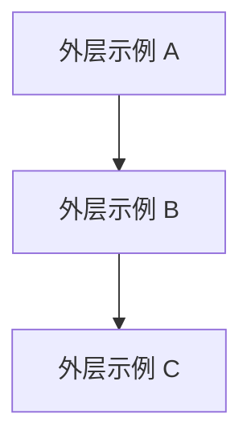

# {{PROJECT_NAME}} — 模块与分层架构

> 本文档描述本工程的模块分层与依赖约定，是架构设计的单一事实源之一。  
> **机器可读结构**见工程根目录 [framework.config.json](../framework.config.json) 的 `architecture` 段；修改分层后请同步更新本文与 config。

---

## 生成说明

- 本文档由 **Skill `00-framework-init`** 基于 `framework` 模板首次生成。
- **后续仅架构级变更才更新本文**，三类触发场景见下方「变更触发条件」；feature 级变更（既有模块内新增页面 / 接口 / 数据模型 / 修复）不写入本文，变更历史由 git 与 `doc/features/<feature>/` 承担。
- 若调整了外层 / 内层 / 出口文件名，必须同步 `framework.config.json` 并通过 harness 相关检查。

### 变更触发条件（写入/修改本文前先对号入座）

| impact 等级 | 触发场景 | 本文需同步的小节 |
|-------------|----------|------------------|
| `dsl_change` | `framework.config.json > architecture` 结构变化（分层 / 依赖边 / 同层策略 / 内层顺序 / 出口约定） | 外层架构 Mermaid、层间依赖表、模块内分层、物理目录 |
| `module_set_change` | 模块集合变化（新增 / 下线 / 迁层） | 业务模块清单增删一行、架构级变更记录 |
| `responsibility_rewrite` | `module-catalog.yaml` 中某模块 `primary_responsibility` 大幅重写 | 业务模块清单该模块的"一句话职责"、架构级变更记录 |
| `none` | 任何普通 feature 需求 | **不写入本文** |

---

## 外层架构（outer_layers）

依赖方向以 `framework.config.json` → `architecture.outer_layers` 为准：**仅允许声明过的层间依赖**，禁止逆向。

### 层间依赖表（摘录）

| 外层 id | 允许依赖的其它外层（can_depend_on） | 同层策略（intra_layer_deps） |
|---------|--------------------------------------|------------------------------|
| （由初始化时填） | （自动生成行） | forbid / dag / sublayer |

---

## 模块内分层（module_inner_layers）

模块代码目录内部采用以下分层（**数组顺序 = upward 依赖方向**，索引小的可被索引大的 import）：

`{{MODULE_INNER_LAYERS_CSV}}`

跨模块引用必须通过各模块根目录下的 **`{{CROSS_MODULE_EXPORTS_FILE}}`** 导出，禁止深路径 import 到其它模块内部实现。

---

## 物理目录与构建

请补充本工程的实际目录布局（可参考 `build-profile.json5` 的 `modules[].srcPath`）。

---

## 业务模块清单

> 本表仅作架构图的图例，**仅在 `module_set_change` 或 `responsibility_rewrite` 时更新**。
> 模块职责 / 公共能力 / 易混点 / NOT_responsible_for 等详情以 [module-catalog.yaml](module-catalog.yaml) 为 SSOT，**不要**在此重复复制。
> 下表由 **Skill 0**（`/catalog-bootstrap`）逐模块建档后补全；初始化阶段保持为空表即可。

| 模块名 | 所属外层 | 一句话职责 |
|--------|----------|-----------|
| （待填） |  |  |

---

## 架构级变更记录

> **准入条件**：仅记录 `dsl_change` / `module_set_change` / `responsibility_rewrite` 三类架构级事件。
> **禁入内容**：feature 级变更（页面新增 / 接口新增 / 数据模型扩展 / bug 修复 / 样式调整等）一律不记录，由 git history 与 `doc/features/<feature>/` 承担。

| 日期 | 影响等级 | 说明 |
|------|----------|------|
| （无） |  |  |
