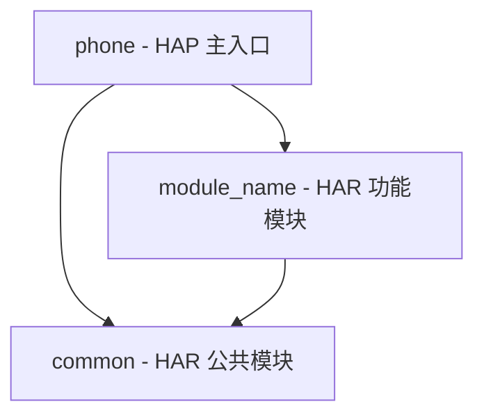
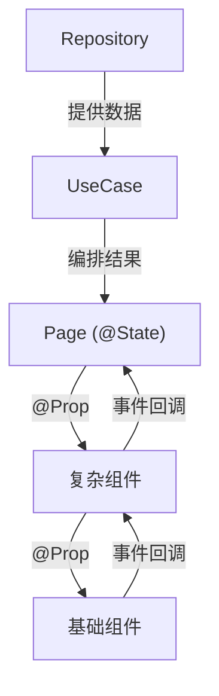

# {模块名称} — 技术设计文档

> **模板说明**：以下 `{module-name}`、`{ModuleA}` 等均为占位；模块名 / 外层 id **必须**与 `doc/architecture.md`、`framework.config.json > architecture` 一致。
>
> **模块标识**: `{module-name}`
> **对应 PRD**: `doc/features/{module-name}/prd/PRD.md`
> **版本**: v1.0
> **创建日期**: {YYYY-MM-DD}
> **最后更新**: {YYYY-MM-DD}
> **状态**: 草稿 / 已确认

---

## Scope 声明与继承

> **本节继承自 PRD 的 Scope 声明，并记录本设计阶段用户批准的扩展。**
> Skill 3（Coding）的 git diff 不得越界到 `in_scope_modules` 之外的模块。

### Scope 概览

| 字段 | 取值 | 说明 |
|------|------|------|
| 继承自 PRD | `true` / `false` | 是否完全继承 PRD 的 in_scope_modules（未扩展） |
| 本设计允许修改的模块 | `{ModuleA}`、`{ModuleB}` | = PRD.in_scope_modules ∪ expansions_with_user_approval |
| 明确不修改的模块 | `{ModuleC}` | 继承自 PRD.out_of_scope_modules |
| 已获用户批准的扩展 | 见下方 yaml | 无扩展则留空数组 `[]` |

### Scope 结构化字段（供 Harness 校验，必填）

```yaml
inherited_from_prd: true
in_scope_modules:
  - {ModuleA}
  - {ModuleB}
out_of_scope_modules:
  - {ModuleC}
rationale: |
  本设计完全继承 PRD 的 scope 声明，未发起扩展。
  {或：经评估确认需扩展到 ModuleB，扩展已获用户批准，见下方 expansions_with_user_approval}
expansions_with_user_approval:
  - modules: [{ModuleB}]
    reason: "{为何需要扩展；为何现有 in_scope 模块无法承载}"
    approved_by: "{user_name}"
    approved_at: "{YYYY-MM-DD}"
```

> 若本次设计未发起任何 scope 扩展，`expansions_with_user_approval` 字段应为空数组 `[]`，
> 且 `inherited_from_prd` 应为 `true`。

### 架构影响声明 (architecture_impact)

> **本节是 Harness 的门禁入口**：`impact` 字段决定 Skill 2 Step 12 是否要更新 `doc/architecture.md`。
> - `none`：最常见，多数 feature 需求（既有模块内新增页面/接口/数据模型/样式修复）都落在这一档。**不动** `architecture.md`。
> - `dsl_change`：`framework.config.json > architecture` 结构发生变化（新增外层 / 改同层策略 / 改内层顺序 / 改 `cross_module_exports_file` / 改依赖边矩阵）。
> - `module_set_change`：模块集合变化（新增模块 / 下线模块 / 模块迁到不同外层）。
> - `responsibility_rewrite`：`module-catalog.yaml > primary_responsibility` 发生大幅重写（模块主职调整，而非单纯新增能力）。
>
> 凡涉及架构级变更，必须在 Skill 2 Step 12 同步更新 `doc/architecture.md`（及 `framework.config.json` / `module-catalog.yaml` 的相应段落）。

```yaml
architecture_impact:
  impact: none
  # impact != none 时以下字段必填；impact == none 时保留空数组即可
  affected_items: []            # 受影响的模块 / 外层 / DSL 段落，如 ["新增模块 BillingService"]、["外层 features can_depend_on 新增 platform"]
  architecture_md_updates: []   # architecture.md 需要新增/修改的小节
  catalog_updates: []           # 可选：module-catalog.yaml 需要新增/修改的模块条目
```

> `impact: none` 时 `affected_items` / `architecture_md_updates` / `catalog_updates` 均保留空数组 `[]`，**不要**删除字段（Harness 依赖完整 schema）。

---

## 1. 模块架构图

展示本次设计涉及的所有 Module 及其依赖关系。使用 Mermaid 绘制。



> **使用时**：将 `module_name` 替换为实际模块名（如 `task_feature`）。

### 1.1 模块变更摘要

| Module | 格式 | 变更类型 | 说明 |
|--------|------|----------|------|
| {module_name} | HAR | 新增 | {功能模块说明} |
| common | HAR | 新增/修改 | {公共模块变更说明} |
| phone | HAP | 修改 | {主入口模块变更说明} |

### 1.2 模块间依赖关系

```
phone (HAP)
  ├── 依赖 → {module_name} (HAR)
  └── 依赖 → common (HAR)

{module_name} (HAR)
  └── 依赖 → common (HAR)
```

---

## 2. 目录/文件结构规划

精确列出每个新增或修改的文件，含完整路径和职责说明。

### 2.1 Module: common (HAR)

```
common/
  src/main/ets/
    shared/
      constant/
        {文件名}.ets          — {职责说明}
      utils/
        {文件名}.ets          — {职责说明}
      components/
        {文件名}.ets          — {职责说明}
    Index.ets                 — HAR 模块导出入口
  src/main/resources/
    base/element/
      string.json             — 文本资源
      color.json              — 颜色资源
```

### 2.2 Module: {module_name} (HAR)

```
{module_name}/
  src/main/ets/
    shared/
      client/
        {ApiClient文件}.ets   — {职责说明}
      constant/
        {常量文件}.ets         — {职责说明}
      components/
        {基础组件文件}.ets     — {职责说明}
      utils/
        {工具文件}.ets         — {职责说明}
    data/
      model/
        {模型文件}.ets         — {职责说明}
      repository/
        {仓库文件}.ets         — {职责说明}
    domain/
      usecase/
        {用例文件}.ets         — {职责说明}（若无复杂逻辑可省略）
    presentation/
      components/
        {复杂组件文件}.ets     — {职责说明}
      pages/
        {页面文件}.ets         — {职责说明}
    Index.ets                 — HAR 模块导出入口
  src/main/resources/
    base/
      element/
        string.json           — 文本资源
        color.json            — 颜色资源
        float.json            — 尺寸资源
      media/                  — 图标等媒体资源
      profile/
        main_pages.json       — 页面注册
        route_map.json        — 路由表（若使用系统路由表）
    zh_CN/element/
      string.json             — 中文文本
    dark/element/
      color.json              — 深色模式颜色
```

### 2.3 Module: phone (HAP) — 修改项

```
phone/
  src/main/ets/
    pages/
      Index.ets               — 修改：注册新功能模块的路由
  src/main/resources/
    base/element/
      string.json             — 修改：追加新文本资源
```

### 2.4 根目录配置变更

| 文件 | 变更类型 | 变更内容 |
|------|----------|----------|
| `build-profile.json5` | 修改 | modules 数组新增 `{module_name}` 和 `common` 模块 |
| `oh-package.json5` | 修改 | dependencies 新增模块间依赖 |

---

## 3. 数据模型定义

### 3.1 {模型名称}

**所在文件**: `{module_name}/src/main/ets/data/model/{ModelName}.ets`

```typescript
// 使用 interface 定义纯数据结构
export interface {ModelName} {
  /** {字段说明} */
  fieldName: string
  /** {字段说明} */
  optionalField?: number
}
```

| 字段 | 类型 | 必填 | 说明 |
|------|------|------|------|
| fieldName | string | ✅ | {说明} |
| optionalField | number | ❌ | {说明} |

> 若模型有内聚方法，使用 class 替代 interface：
>
> ```typescript
> export class {ModelName} {
>   field: string = ''
>
>   /** 格式化展示 */
>   get displayText(): string {
>     return this.field
>   }
> }
> ```

### 3.2 {更多模型...}

（按上述格式逐个定义）

---

## 4. 页面组件树

### 4.1 页面 A: {页面名称}

**所在文件**: `{module_name}/src/main/ets/presentation/pages/{PageName}.ets`

```
{PageName} (NavDestination)
├── {SectionComponent1} (presentation/components/)
│   ├── {BaseComponent1} (shared/components/)
│   └── {BaseComponent2} (shared/components/)
├── {SectionComponent2} (presentation/components/)
│   └── {BaseComponent3} (shared/components/)
└── {SectionComponent3} (presentation/components/)
```

**组件接口定义**：

| 组件 | 层级 | Props | 事件回调 | 说明 |
|------|------|-------|----------|------|
| {SectionComponent1} | presentation | @Prop data: ModelType | onAction: () => void | {说明} |
| {BaseComponent1} | shared | @Prop title: string | onClick: () => void | {说明} |

### 4.2 页面 B: {页面名称}

（按上述格式逐个定义）

---

## 5. 状态管理方案

### 5.1 状态分类

| 数据 | 作用域 | 装饰器 | 持有者 | 说明 |
|------|--------|--------|--------|------|
| {数据名} | 页面内 | @State | {PageName} | {说明} |
| {数据名} | 父子组件 | @Prop | {ChildComponent} | 单向传递 |
| {数据名} | 父子组件 | @Link | {ChildComponent} | 双向同步 |
| {数据名} | 跨页面 | AppStorage | 全局 | {说明} |

### 5.2 数据流向图



---

## 6. 服务层接口定义

### 6.1 Repository: {RepositoryName}

**所在文件**: `{module_name}/src/main/ets/data/repository/{RepositoryName}.ets`

```typescript
export class {RepositoryName} {
  /**
   * {方法说明}
   * @param paramName - {参数说明}
   * @returns {返回值说明}
   */
  async methodName(paramName: ParamType): Promise<ReturnType> { ... }
}
```

| 方法 | 入参 | 出参 | 异步 | 数据来源 | 说明 |
|------|------|------|------|----------|------|
| methodName | ParamType | ReturnType | ✅ | 模拟数据 | {说明} |

### 6.2 业务编排 Coordinator（仅在触发 `use-cases.yaml` 复杂度阈值时产出）

> **产出条件（v2.1）**：仅当满足多 UI 共享状态 / 多步云调用 / 含回滚分支任一条件时，才同步产出 `doc/features/{feature}/use-cases.yaml`；否则无需单独设计业务编排层，页面直接调用 Repository 即可。

**代码形态三选一**（由 Skill 3 编码阶段按复杂度自选，设计阶段**不强制目录**）：

| 形态 | 典型文件位置 | 何时选 |
|------|--------------|--------|
| A. Page 命名方法 | `{module}/presentation/pages/{Page}.ets` 内部命名 async 方法 | 单页 + 1~2 步云调用，无跨页状态共享 |
| B. 独立业务类（Flow / Coordinator） | `{module}/domain/flow/{Name}Flow.ets` 或 `{module}/shared/flow/{Name}Flow.ets` | 多 UI 节点共享状态、回滚分支多的场景 |
| C. 导出命名函数 | `{module}/domain/actions/{name}.ets` 或 `{module}/shared/actions/{name}.ets` | 无状态工具流程，一个函数就能表达 |

```typescript
// 示例采用形态 B：独立业务类，可被 UT 直接 new
export class {CoordinatorName} {
  state: { phase: {PhaseType}; errorCode: string | null } = { phase: 'Idle', errorCode: null }

  constructor(
    private readonly api: {ApiClientType},        // 直接引用 contracts.yaml 已登记的现有 data 层类
    private readonly store: {StoreType},          // 不新造 Port 接口
  ) {}

  /**
   * 命名业务入口（UT 可直接调用）
   * - 与 use-cases.yaml > ui_bindings[].user_actions[].calls 的符号名严格一致
   * - 禁止把业务逻辑放在 `onClick = () => { ... }` 的 inline lambda 里
   */
  async {namedEntryAction}(param: ParamType): Promise<void> {
    this.state = { ...this.state, phase: 'Xxx' }
    // 编排 api / store 调用；UI 副作用通过 state 字段对外发布，不在此文件 import UI 符号
  }
}
```

> **强约束（v2.1）**：
> - 业务编排源文件禁止 import `@Component` / `@Consume` / `NavPathStack` / `$r` / `showToast` / `getUIContext` / `@kit.ArkUI` / `@kit.ArkGraphics`，以保证其可在 Hypium 单测中脱离 ArkUI runtime 直接实例化
> - `use-cases.yaml > ui_bindings[].user_actions[].calls` 列出的每个符号必须是**命名符号**（传统函数 / 类方法 / 类字段函数 `handler = () => {}` / 顶层命名 const 赋值均合法），不能是**匿名** inline lambda（直接挂到 UI 事件上）（由 Skill 3 harness 的 `named_business_handler` BLOCKER 强制）
> - **禁止**为了"便于 UT 打桩"新造 `XxxPort` 接口；`data_boundaries[].type` 必须引用 `contracts.yaml > interfaces[].class` 中已登记的现有数据层类（由 Skill 5 harness 的 `boundary_matches_contracts` 强制）

### 6.3 Client: {ApiClientName}（若有远程接口）

**所在文件**: `{module_name}/src/main/ets/shared/client/{ApiClientName}.ets`

```typescript
/** 请求体 */
export interface {RequestName} {
  field: string
}

/** 响应体 */
export interface {ResponseName} {
  data: DataType
  code: number
  message: string
}
```

---

## 6.5 业务流程 UseCase 清单（若 feature 有多步骤流程）

> **何时必填**：当任一用户操作会触发 ≥2 次 cloud/local 端口调用，或含 conditional 分支（成功/多种失败/回滚/取消）。
> **同时必须产出**：`doc/features/{module}/use-cases.yaml`（Schema 见 [use-cases-schema.md](../../../profiles/hmos-app/skills/5-business-ut/templates/use-cases-schema.md)）。
> **样例**：见本 profile 下 `skills/5-business-ut/examples/sample-flow/`（纯规约示例，无宿主代码）。

### 6.5.1 UseCase: {UseCaseName}

- **触发入口（triggers）**：UI 层 `onClick` 只能转发到下列方法
  - `{trigger1}(param1: Type1)` — 触发该入口的 AC：{AC-X}
  - `{trigger2}(...)` — ...
- **依赖端口（ports）**（构造器注入；禁 UI 符号）
  - `api: {ApiClientName}`（ownership: cloud）— 方法：{method list}
  - `storage: {PersistenceName}`（ownership: local）— 方法：{method list}
- **发布状态（state）**：`{ phase, errorCode, ... }`，UI 层只订阅，不得直接调 api/storage

#### 状态机

```mermaid
stateDiagram-v2
  [*] --> Idle
  Idle --> {Phase1}: {trigger1}
  {Phase1} --> {Phase2}: {port ok}
  {Phase1} --> Failed: {port fail/throw}
  %% 覆盖所有分支（happy / validate_fail / persist_fail / sms_fail_rollback / user_cancel ...）
  Success --> [*]
  Failed --> [*]
```

#### 分支清单（与 `use-cases.yaml > branches` 1:1 对应，Skill 5 据此生成 UT 用例）

| branch id | 场景 | linked AC |
|---|---|---|
| `happy_path` | 全链路成功 | AC-X |
| `validate_fail` | 云侧校验失败 | AC-Y |
| `persist_fail` | 本地持久化失败 | AC-Z |
| `sms_fail_rollback` | 短验失败，回滚已写入卡 | AC-W |
| `user_cancel_in_waiting_sms` | 用户在 WaitingSms 取消 | AC-U |

#### UI 层职责（对应 `{PageName}.ets`）

- `onClick` → `useCase.{trigger}(...)`；禁止直接调用 `api.*` / `storage.*`
- 订阅 `useCase.state.phase`，按 phase 翻译副作用：
  - `Success` → `navPathStack.pushPath('{ResultPage}', { ... })`
  - `Failed` → `showToast(mapErrorToMessage(state.errorCode))`
  - `WaitingSms` → 弹出 {SmsDialog}

### 6.5.2 {下一个 UseCase，若有}

（按上述格式逐一列出）

---

## 7. 路由/导航设计

### 7.1 页面跳转关系


> **使用时**：将 `页面A/B/C` 和 `触发动作` 替换为实际的页面名和跳转触发方式。

### 7.2 Navigation 配置

| 页面 | NavDestination 名称 | 所属模块 | 路由参数 | 说明 |
|------|---------------------|----------|----------|------|
| {页面A} | "{route_name_a}" | {module_name} | 无 | {说明} |
| {页面B} | "{route_name_b}" | {module_name} | { id: string } | {说明} |

### 7.3 NavPathStack 使用

```typescript
// 在 phone/Index.ets 中初始化 NavPathStack
// 通过 NavPathStack.pushPath() 跳转
// 通过 NavPathStack.pop() 返回
```

### 7.4 路由注册

需在以下位置注册路由：

| 配置文件 | 变更 |
|----------|------|
| `{module_name}/src/main/resources/base/profile/main_pages.json` | 注册 {PageName} 页面 |
| `{module_name}/src/main/resources/base/profile/route_map.json` | 配置路由映射（若使用系统路由表） |

---

## 8. PRD 功能映射表

逐项对照 PRD 中的功能清单，确保每个 P0/P1 功能都有明确的技术实现方案。

| PRD 编号 | 功能名称 | 优先级 | 实现模块 | 实现层级 | 关键文件 | 实现说明 |
|----------|----------|--------|----------|----------|----------|----------|
| F1 | {功能名} | P0 | {module} | {layer} | {file}.ets | {简要实现说明} |
| F2 | {功能名} | P0 | {module} | {layer} | {file}.ets | {简要实现说明} |
| ... | ... | ... | ... | ... | ... | ... |

**覆盖率检查**：
- P0 功能映射覆盖率: {X}/{Y} = {100%} ✅
- P1 功能映射覆盖率: {X}/{Y} = {100%} ✅
- P2/P3 功能: 已标注扩展点 / 暂不设计

---

## 附录

### A. 资源文件规划

#### 文本资源 (string.json)

| 资源 Key | 中文值 | 使用位置 |
|----------|--------|----------|
| {module}_{key} | "{文本}" | {组件名} |

#### 颜色资源 (color.json)

| 资源 Key | 色值 | 使用位置 |
|----------|------|----------|
| {module}_{key} | #{RRGGBB} | {组件名} |

#### 尺寸资源 (float.json)

| 资源 Key | 值 | 使用位置 |
|----------|-----|----------|
| {module}_{key} | {N}vp | {组件名} |

### B. 设计决策记录

| 编号 | 决策点 | 可选方案 | 选定方案 | 理由 |
|------|--------|----------|----------|------|
| D1 | {决策点描述} | A: ... / B: ... | A | {理由} |

### C. 变更记录

| 日期 | 版本 | 变更内容 | 变更人 |
|------|------|----------|--------|
| {YYYY-MM-DD} | v1.0 | 初始版本 | AI |
