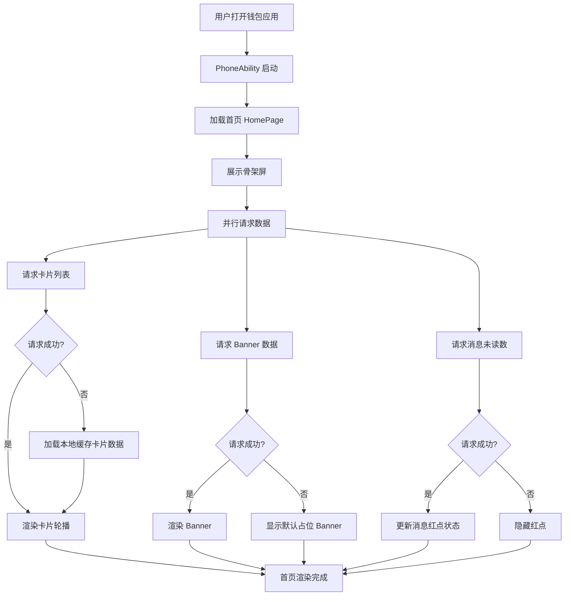
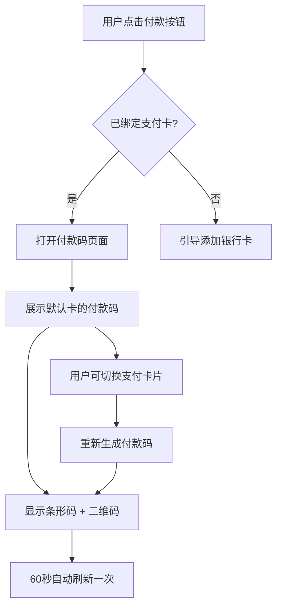

# 华为钱包首页 — 产品需求文档（PRD）

> **示例说明**：本文档以钱包工程的"首页"功能为示例演示 PRD 各字段如何填写，实际使用请替换为你自己工程的业务内容。
>
> **模块标识**: `home-page`
> **版本**: v1.0
> **创建日期**: 2026-04-01
> **最后更新**: 2026-04-01
> **状态**: 已确认

---

## 1. 功能概述

华为钱包首页作为应用的核心入口，为用户提供快捷支付、卡包管理、生活服务的一站式聚合访问，让用户在一个页面内完成高频支付操作并快速触达各类钱包功能。

---

## 2. 目标用户与使用场景

### 2.1 目标用户

| 用户角色 | 描述 |
|----------|------|
| 普通消费者 | 使用华为手机进行日常支付、乘车、门禁等操作的用户 |
| 卡片收藏者 | 拥有多张银行卡/会员卡/交通卡，需要统一管理的用户 |

### 2.2 使用场景

| 场景编号 | 场景名称 | 场景描述 | 前置条件 |
|----------|----------|----------|----------|
| S1 | 快捷支付 | 用户在商超结账时打开钱包首页，快速展示付款码完成支付 | 已绑定至少一张银行卡 |
| S2 | 查看卡包 | 用户想查看已添加的银行卡、会员卡或交通卡信息 | 已登录华为账号 |
| S3 | 生活服务入口 | 用户从首页进入充值、缴费、乘车码等生活服务 | 已登录华为账号 |
| S4 | 首次使用 | 新用户首次打开钱包，看到引导并添加第一张卡 | 已登录华为账号，未绑定任何卡 |

---

## 3. 功能清单

| 编号 | 功能名称 | 优先级 | 描述 | 关联场景 |
|------|----------|--------|------|----------|
| F1 | 付款码快捷入口 | P0 | 首页顶部显示"付款"按钮，点击后展示付款二维码/条形码，支持选择支付卡片 | S1 |
| F2 | 卡包列表展示 | P0 | 以卡片轮播或列表形式展示用户已添加的银行卡、交通卡，显示卡片名称和卡号后四位 | S2 |
| F3 | 功能宫格导航 | P0 | 以宫格形式展示高频功能入口（乘车码、门禁卡、充值、缴费等），点击跳转到对应功能页 | S3 |
| F4 | 顶部搜索栏 | P1 | 页面顶部提供搜索框，支持搜索卡片名称和功能名称 | S2, S3 |
| F5 | 消息通知入口 | P1 | 顶部右侧显示消息图标，有未读消息时显示红点，点击进入消息中心 | S2 |
| F6 | Banner 运营位 | P1 | 卡包下方展示可滑动的运营 Banner 图，用于推广活动或新功能 | S3 |
| F7 | 添加卡片引导 | P1 | 首页展示"添加卡片"入口，首次使用时有引导动画 | S4 |
| F8 | 底部 Tab 导航 | P0 | 底部标签栏包含"首页"、"卡包"、"发现"、"我的"四个 Tab，支持切换 | S1, S2, S3 |
| F9 | 下拉刷新 | P2 | 用户下拉页面时触发数据刷新，更新卡片状态和运营位内容 | S2 |
| F10 | 快捷操作浮层 | P2 | 长按卡片弹出快捷操作菜单（查看详情、设为默认卡、删除） | S2 |

---

## 4. 页面/界面描述

### 4.1 页面总览

```
┌─────────────────────────────────────┐
│  🔍 搜索栏          [消息图标🔔]    │  ← 顶部导航区
├─────────────────────────────────────┤
│                                     │
│   ┌─────────┐ ┌─────────┐          │
│   │  付款   │ │  收款   │          │  ← 快捷操作区
│   └─────────┘ └─────────┘          │
│                                     │
│  ┌─────────────────────────────┐    │
│  │     💳 银行卡卡面展示        │    │  ← 卡包轮播区
│  │     **** **** **** 1234     │    │
│  └─────────────────────────────┘    │
│  ● ○ ○                             │
│                                     │
│  ┌─────┐ ┌─────┐ ┌─────┐ ┌─────┐  │
│  │乘车码│ │门禁卡│ │ 充值 │ │ 缴费 │  │  ← 功能宫格区
│  └─────┘ └─────┘ └─────┘ └─────┘  │
│  ┌─────┐ ┌─────┐ ┌─────┐ ┌─────┐  │
│  │会员卡│ │ 红包 │ │ 保险 │ │ 更多 │  │
│  └─────┘ └─────┘ └─────┘ └─────┘  │
│                                     │
│  ┌─────────────────────────────┐    │
│  │   🎯 Banner 运营位           │    │  ← Banner 运营区
│  └─────────────────────────────┘    │
│                                     │
├─────────────────────────────────────┤
│  [首页]  [卡包]  [发现]  [我的]     │  ← 底部 Tab 栏
└─────────────────────────────────────┘
```

### 4.2 UI 组件详细描述

#### 区域 1: 顶部导航区

| 组件 | 类型 | 内容/数据 | 交互行为 |
|------|------|-----------|----------|
| 搜索框 | TextInput (只读) | 占位文字"搜索卡片或服务" | 点击跳转到搜索页面（非原地搜索） |
| 消息图标 | Image + Badge | 铃铛图标，未读时显示红点 | 点击进入消息中心页面 |

#### 区域 2: 快捷操作区

| 组件 | 类型 | 内容/数据 | 交互行为 |
|------|------|-----------|----------|
| 付款按钮 | Button | 图标 + "付款"文字 | 点击进入付款码页面 |
| 收款按钮 | Button | 图标 + "收款"文字 | 点击进入收款码页面 |

#### 区域 3: 卡包轮播区

| 组件 | 类型 | 内容/数据 | 交互行为 |
|------|------|-----------|----------|
| 卡片容器 | Swiper | 用户已绑定的银行卡/交通卡列表 | 左右滑动切换卡片 |
| 卡片项 | 自定义卡片组件 | 卡片背景色、银行 Logo、卡号后四位、卡类型 | 点击进入卡片详情；长按弹出快捷操作 |
| 指示器 | Swiper 指示器 | 圆点指示器，当前卡片高亮 | 随滑动自动切换 |
| 添加卡片入口 | Button | "+" 图标 + "添加卡片" | 点击进入添加卡片流程 |

#### 区域 4: 功能宫格区

| 组件 | 类型 | 内容/数据 | 交互行为 |
|------|------|-----------|----------|
| 宫格容器 | Grid (2行4列) | 8 个功能入口 | — |
| 功能入口项 | GridItem | 图标 + 功能名称文字 | 点击跳转到对应功能页面 |

默认宫格项配置：

| 位置 | 功能名 | 图标 | 跳转目标 |
|------|--------|------|----------|
| (1,1) | 乘车码 | transit_icon | /pages/TransitCode |
| (1,2) | 门禁卡 | access_icon | /pages/AccessCard |
| (1,3) | 充值 | topup_icon | /pages/TopUp |
| (1,4) | 缴费 | bill_icon | /pages/BillPay |
| (2,1) | 会员卡 | member_icon | /pages/MemberCard |
| (2,2) | 红包 | redpacket_icon | /pages/RedPacket |
| (2,3) | 保险 | insurance_icon | /pages/Insurance |
| (2,4) | 更多 | more_icon | /pages/MoreServices |

#### 区域 5: Banner 运营区

| 组件 | 类型 | 内容/数据 | 交互行为 |
|------|------|-----------|----------|
| Banner 轮播 | Swiper | 运营活动图片列表（远程加载） | 自动轮播（3秒间隔）；点击跳转活动详情（外部链接或应用内页面） |

#### 区域 6: 底部 Tab 栏

| 组件 | 类型 | 内容/数据 | 交互行为 |
|------|------|-----------|----------|
| Tab 容器 | Tabs (BottomTabBar) | 4 个 Tab 项 | 点击切换对应页面 |
| Tab 项 | TabContent | 图标（选中/未选中状态）+ 文字标签 | 选中态图标高亮、文字变色 |

Tab 项配置：

| 序号 | 文字 | 选中图标 | 未选中图标 | 对应页面 |
|------|------|----------|------------|----------|
| 1 | 首页 | home_active | home_inactive | HomePage |
| 2 | 卡包 | cards_active | cards_inactive | CardsPage |
| 3 | 发现 | discover_active | discover_inactive | DiscoverPage |
| 4 | 我的 | profile_active | profile_inactive | ProfilePage |

### 4.3 页面状态

| 状态 | 描述 | 触发条件 |
|------|------|----------|
| 默认状态 | 显示已绑定的卡片列表、功能宫格、Banner | 正常加载，已有绑定卡片 |
| 空卡包状态 | 卡包轮播区显示"还没有卡片，立即添加"引导卡 | 用户未绑定任何卡片 |
| 加载状态 | 卡包和 Banner 区域显示骨架屏（Skeleton） | 页面首次加载或下拉刷新中 |
| 网络异常状态 | 卡包显示上次缓存的数据，Banner 区域显示占位图，顶部出现"网络连接异常"提示条 | 设备无网络 |

---

## 5. 业务流程图

### 5.1 首页加载流程



### 5.2 付款码流程



---

## 6. 异常/边界场景处理

| 编号 | 异常场景 | 触发条件 | 处理方式 | 用户提示 |
|------|----------|----------|----------|----------|
| E1 | 网络断开 | 设备无网络连接 | 展示本地缓存的卡片数据和上次加载的功能配置；Banner 显示默认占位图 | 顶部 Toast: "网络连接异常，显示的是上次数据" |
| E2 | 卡包为空 | 用户未绑定任何卡片 | 卡包区域显示添加引导卡片，功能宫格正常展示 | 引导卡: "还没有卡片？点击添加您的第一张卡" |
| E3 | 卡片数据加载失败 | 卡片接口异常 | 重试一次，仍失败则展示上次缓存 | Toast: "卡片信息加载失败，请稍后重试" |
| E4 | Banner 加载失败 | Banner 接口异常或图片加载失败 | 显示应用内置的默认 Banner 图 | 无额外提示 |
| E5 | 页面加载超时 | 所有接口 5 秒内未响应 | 隐藏骨架屏，展示"加载失败"占位页，提供"重试"按钮 | 占位页: "加载失败，请检查网络后重试" |
| E6 | 用户未登录 | 用户未登录华为账号 | 首页仅展示功能宫格和 Banner，卡包区域显示"登录后查看您的卡片"，点击跳转登录 | 引导卡: "登录华为账号，管理您的卡包" |

---

## 7. 非功能性需求

### 7.1 性能要求

| 指标 | 要求 | 说明 |
|------|------|------|
| 页面首屏加载 | ≤ 2 秒 | 从 Ability 启动到首屏内容可见（含骨架屏消失） |
| 卡片滑动帧率 | ≥ 54 FPS | Swiper 滑动切换卡片时的流畅度 |
| 内存占用增量 | ≤ 30 MB | 首页驻留时相比应用启动的内存增量 |
| 下拉刷新响应 | ≤ 1.5 秒 | 从触发刷新到数据更新完成 |

### 7.2 兼容性要求

| 维度 | 要求 |
|------|------|
| 系统版本 | HarmonyOS 4.0 (API 10) 及以上 |
| 设备类型 | 手机（本模拟项目仅支持手机） |
| 屏幕适配 | 支持 360dp ~ 432dp 宽度范围（覆盖主流华为手机） |
| 深色模式 | 支持系统深色模式自动切换 |

### 7.3 安全性要求

| 要求 | 说明 |
|------|------|
| 卡号脱敏 | 卡片列表仅显示卡号后四位，其余用 * 代替 |
| 本地缓存加密 | 卡片数据本地缓存使用加密存储（模拟实现） |
| 付款码时效性 | 付款码每 60 秒自动刷新，防止截屏盗用 |

---

## 8. 验收标准

### P0 功能验收标准

- [x] **AC-1** (F1): 点击首页"付款"按钮，可正确跳转到付款码页面，页面展示二维码和条形码
- [x] **AC-2** (F2): 首页卡包区域正确展示用户已绑定的卡片列表，左右滑动可切换卡片，显示银行名称和卡号后四位
- [x] **AC-3** (F3): 功能宫格展示 8 个功能入口（乘车码、门禁卡、充值、缴费、会员卡、红包、保险、更多），点击每个入口可跳转到对应页面
- [x] **AC-4** (F8): 底部 Tab 栏展示 4 个 Tab（首页、卡包、发现、我的），点击可切换页面，当前 Tab 图标和文字高亮

### P1 功能验收标准

- [x] **AC-5** (F4): 点击顶部搜索框，跳转到搜索页面
- [x] **AC-6** (F5): 消息图标在有未读消息时显示红点，点击进入消息中心
- [x] **AC-7** (F6): Banner 运营位正确加载并展示运营图片，支持自动轮播和手动滑动，点击可跳转
- [x] **AC-8** (F7): 未绑定卡片时，卡包区域显示添加卡片引导，点击可进入添加流程

### P2 功能验收标准

- [x] **AC-9** (F9): 下拉首页可触发刷新动画，松手后数据更新
- [x] **AC-10** (F10): 长按卡片弹出快捷操作菜单，可执行"查看详情"、"设为默认"操作

### 通用验收标准

- [x] **AC-G1**: 页面在 HarmonyOS 4.0 及以上设备上正常显示，无布局错乱
- [x] **AC-G2**: 所有点击交互响应时间 ≤ 300ms
- [x] **AC-G3**: 网络异常时显示缓存数据和错误提示，不出现白屏或崩溃
- [x] **AC-G4**: 页面支持深色模式，深色模式下文字和背景对比度符合可访问性要求

---

## 附录

### A. 术语表

| 术语 | 解释 |
|------|------|
| 卡包 | 用户在钱包中添加的各类卡片（银行卡、交通卡、门禁卡、会员卡）的集合 |
| 付款码 | 用于线下支付的动态二维码/条形码 |
| 骨架屏 | 页面加载过程中显示的灰色占位块，模拟最终布局形状 |
| 功能宫格 | 以网格形式排列的功能快捷入口区域 |

### B. 参考资料

- 华为钱包 App 实际界面截图（作为 UI 参考）
- HarmonyOS ArkUI 组件文档: Tabs、Swiper、Grid、List
- Material Design 卡片式设计规范（布局参考）

### C. 变更记录

| 日期 | 版本 | 变更内容 | 变更人 |
|------|------|----------|--------|
| 2026-04-01 | v1.0 | 初始版本，基于华为钱包首页截图分析生成 | AI |
