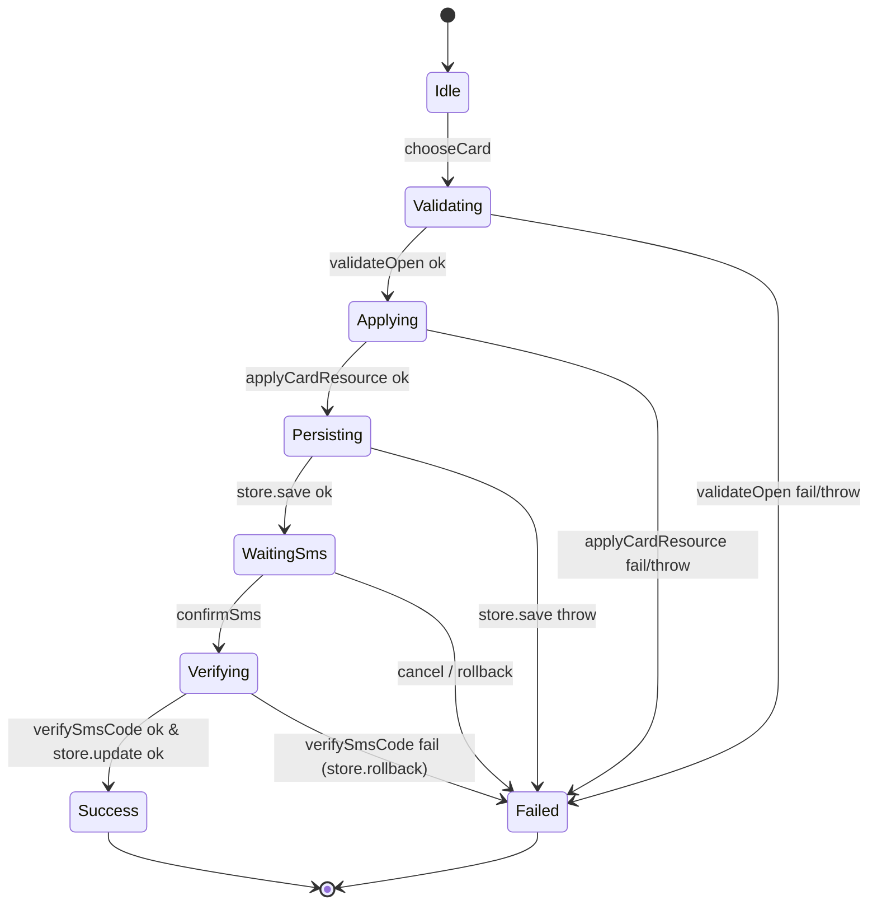

# `design.md` 片段：业务流程 UseCase 清单（v2.1）

> 下面这段应出现在 `doc/features/card-opening/design.md` 的 **"六、业务流程 UseCase 清单"** 章节。本 feature 满足 Skill 2 Step 6.1 的复杂度阈值（多 UI 节点共享状态 + 多步云调用 + 含回滚分支），因此产出 `use-cases.yaml`。完整 Schema 见 `framework/profiles/hmos-app/skills/5-business-ut/templates/use-cases-schema.md`。

---

## 六、业务流程 UseCase 清单

### 6.1 card_opening（开卡流程）

- **业务编排 Coordinator**：`CardOpenFlow`（普通 ArkTS 类，位于 `02-Feature/CardOpen/src/main/ets/domain/flow/CardOpenFlow.ets`）
  - 选"普通 ArkTS 类"形态的理由：流程跨 3 个页面 + 1 个弹框，需要一个独立状态容器承载 `phase / errorCode / resultCardId`
  - **注意**：代码形态由 Skill 3 自选（Page 命名方法 / Flow/Coordinator 类 / 导出函数均可）；本文档的"Coordinator"字段只声明符号名，不规定文件位置
- **业务入口映射表**（由 UI 层调用，UT 可直接调用）：

| UI 节点 | 角色 | 订阅的 state | 用户动作 → 业务函数 |
|---|---|---|---|
| `CardSelectPage` | entry | — | 点击"开卡" → `flow.chooseCard(bankInfo)` |
| `CardOpenProgressPage` | progress | `flow.state.phase` | （纯展示，无用户动作） |
| `SmsDialog` | dialog | `flow.state.phase=WaitingSms` | 点击"确认" → `flow.confirmSms(smsCode)`；点击"取消" → `flow.cancel()` |
| `CardOpenResultPage` | result | `flow.state.phase ∈ {Success, Failed}`、`flow.state.errorCode` | （结果展示，Skill 6 真机验证） |

- **数据边界清单**（引用 `contracts.yaml > interfaces[].class` 中**既有**的 data 层类）：

| name | type（既有类） | kind | 主要方法 |
|---|---|---|---|
| `api` | `CardOpenApi` | cloud | `validateOpen` / `applyCardResource` / `verifySmsCode` |
| `store` | `CardStore` | storage | `save` / `update` / `rollback` |

> **禁止**为打桩方便新造 `CardOpenApiPort` / `CardStorePort` 接口。UT 通过 `extends CardOpenApi` / `extends CardStore` 的 Spy 子类或原型替换实现打桩。

- **状态机**：

- **分支清单（UT 必须 1:1 覆盖，详见 `use-cases.yaml`）**：

| branch id | 场景 | linked AC |
|---|---|---|
| `happy_path` | 开卡全链路成功 | AC-1 |
| `validate_fail` | 云侧校验失败 | AC-2 |
| `apply_fail` | 云侧申请卡资源失败 | AC-7 |
| `persist_fail` | 本地持久化失败 | AC-4 |
| `sms_fail_rollback` | 短验失败，回滚已写入卡 | AC-3 |
| `user_cancel_in_waiting_sms` | 用户在 WaitingSms 取消 | AC-6 |

- **UI 层职责（v2.1 · 严格分离）**：
  - `onClick` 回调**只能**做两件事之一：
    1. 调用 `ui_bindings.user_actions.calls` 所声明的命名函数（如 `this.flow.chooseCard(this.bankInfo)`）
    2. 读取 `flow.state.*` 做纯展示
  - 订阅 `flow.state.phase`（用 `@Watch('flow.state.phase')` 或等价机制）翻译 UI 副作用：
    - `WaitingSms` → 弹出 `SmsDialog`
    - `Success` → `navPathStack.pushPath('CardOpenResultPage', { cardId })`
    - `Failed` → `showToast(mapErrorToMessage(state.errorCode))`
  - UI 层**不得**直接调用 `api.*` / `store.*`
  - UI 层**不得**把业务逻辑写在**匿名** inline lambda 里（会被 Skill 3 harness `named_business_handler` 拦截）；若要就近承载，可改写为**命名**类字段函数（`handleClick = async () => { ... }`）并在 `onClick` 转发调用该字段
