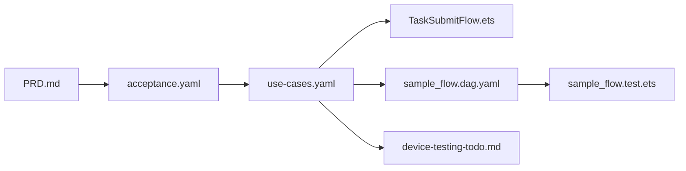

# 示例：多步任务提交 + 二次校验流程（Neutral Canonical Sample · v2.1）

本目录演示 **Skill 2 → 3 → 5 → 6** 在「中性业务域」下应交付的工件形态：仍以 HarmonyOS ArkTS/Hypium 为宿主，但不绑定钱包/支付叙事。

## 目录结构

```
examples/sample-flow/
├── use-cases.yaml
├── TaskSubmitFlow.ets
├── sample_flow.dag.yaml
├── sample_flow.test.ets
├── device-testing-todo.md
├── design-snippet.md
└── spy/
    ├── SpyRemoteTaskGateway.ets
    └── SpyLocalTaskLedger.ets
```

## 流水线串联



## 要点速览

| 问题 | 回答 |
|---|---|
| UT 如何测「用户点击提交」？ | 直接 `await flow.submitTask({...})`（与 `ui_bindings.calls` 对齐） |
| 如何覆盖多个分支？ | `use-cases.yaml` 枚举 branches，`*.test.ets` 中 1 branch ≈ 1 `it()` |
| 导航/Toast 怎么测？ | UT 不测；由 Skill 6 消费 `device-testing-todo.md` |
