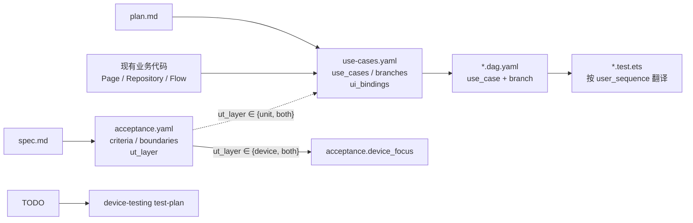

# `use-cases.yaml` Schema 规范

> 本文件定义 `<features_dir>/{module}/use-cases.yaml` 的 Schema。
> **这是一份规约文档（spec），不是代码规格（code form spec）**。
> 由 **plan（需求设计）** 在设计阶段按需产出，是业务级 UT（business-ut）做端到端分支覆盖的蓝图。

## 定位澄清（避免再次翻车）

- `use-cases.yaml` 描述**业务流经过哪些节点、分支、状态**，以及 **UI 事件 ↔ 业务入口** 的映射表
- **不强制**为每个 `use_case` 创造 `.ets` 类 / `domain/usecase/` 目录 / Port 接口
- 业务编排的代码形态由 **coding（编码）** 按实际复杂度选择——三种合法形态：
  1. Page 上的**命名方法**（简单场景，默认首选）
  2. Page 持有的**普通业务类**（Flow/Coordinator，多 UI 共享状态时用）
  3. 模块级**导出函数**（纯计算流程）
- 唯一硬约束：`ui_bindings.user_actions[].calls` 指向的目标必须是 **UT 可直接调用的命名函数**（不能只是 `.onClick(() => {...})` 里的 inline lambda）

## 何时需要产出 `use-cases.yaml`（复杂度阈值）

三条件**任一满足**才产出：

1. 多个 UI 节点（页面 + 组件 ≥ 2）共享同一业务状态
2. 多步云调用串行（≥ 2 次云端接口顺序依赖）
3. 含回滚分支（某步失败需撤销前一步持久化）

否则 `acceptance.yaml` + `dag.yaml` 足够，**不要产 `use-cases.yaml`，不要抽业务编排类**。

## 完整 Schema

```yaml
# ============================================================================
# 顶层必填字段
# ============================================================================
schema_version: "2.0"
feature: string                 # feature 名，与目录名一致，如 "task-demo"

# ============================================================================
# use_cases 列表
# ============================================================================
use_cases:
  - id: string                  # snake_case，feature 内唯一，如 "task_submission"
    description: string         # 中文说明这条业务流做什么

    # ------------------------------------------------------------------------
    # coordinator：业务编排承载对象的名称
    #   可为：
    #     - 类名，如 "TaskSubmitFlow"
    #     - 方法路径，如 "HomeTabPage.triggerLoad"（简单场景直接指向 Page 方法）
    #     - 导出函数名，如 "loadHomeData"
    # ------------------------------------------------------------------------
    coordinator: string

    # coordinator_file：承载文件相对路径（optional）
    #   有独立业务类/函数时必填；指向 Page 命名方法时可省（文件由 ui_bindings 推导）
    coordinator_file: string | null

    # ------------------------------------------------------------------------
    # ui_bindings：UI 节点 ↔ 业务入口的映射表 ★ 最关键字段
    #   作用：
    #     - 告诉 coding：哪些函数必须是命名方法（由 named_business_handler 强制）
    #     - 告诉 business-ut：每条 UT 翻译成"按 user_actions.calls 顺序 await 一遍"
    #     - 告诉 device-testing：role ∈ {progress, result} 且 user_actions 为空的 UI 交它
    # ------------------------------------------------------------------------
    ui_bindings:
      - ui: string                           # 页面或组件名，如 "TaskFormPage"
        role: "entry | progress | dialog | result | passive"
        subscribes: [string]                 # 订阅的 state 字段，如 ["flow.state.phase=WaitingOtp"]

        # user_actions：该 UI 上的用户触发事件
        #   空数组表示该 UI 纯展示 → UT 不覆盖，交 device-testing 真机
        user_actions:
          - trigger: string                  # 中文描述用户动作，如 "点击提交"
            calls: string                    # UT 要调用的命名函数，如 "flow.submitTask"
                                             # ★ 必须是命名方法/导出函数，不能是 inline lambda

    # ------------------------------------------------------------------------
    # data_boundaries：业务编排依赖的外部数据源（替代旧 ports）
    #   指向**现有**的 data 层类/模块，不要求新增 Port 接口
    #   kind：cloud = 云端接口；storage = 本地持久化；system = 系统能力
    # ------------------------------------------------------------------------
    data_boundaries:
      - name: string             # 在 coordinator 里的引用名，如 "cloudApi"
        type: string             # 现有类名，如 "RemoteTaskGateway"
        kind: "cloud | storage | system"
        methods:                 # UT 要打桩的方法清单
          - name: string
            params: [string]
            returns: string
            async: boolean

    # ------------------------------------------------------------------------
    # state_model：业务流对外发布的 state（供 UI 订阅 & UT 断言）
    # ------------------------------------------------------------------------
    state_model:
      phases: [string]           # 状态机阶段枚举，首元素约定为 "Idle"
      fields:
        - name: string
          type: string

    # ------------------------------------------------------------------------
    # branches：业务分支清单——business-ut 按此 1:1 生成 UT it()
    # ------------------------------------------------------------------------
    branches:
      - id: string               # snake_case，如 "happy_path"
        scenario: string         # 中文描述该分支语义

        # user_sequence：UT 按此顺序调用 ui_bindings.user_actions.calls
        #   对应"用户交互触发序列"
        user_sequence: [string]  # 如 ["submitTask", "confirmOtp"]

        # cloud_stubs / local_stubs：按 data_boundaries 打桩
        #   value 约定：
        #     "ok"                 → 返回默认 ok 响应
        #     "ok_nonempty"        → 返回非空列表
        #     "fail:<CODE>"        → 返回失败响应，错误码为 CODE
        #     "throw[:<Error>]"    → 抛异常
        #     其他字面量           → 作为 payload 填入
        cloud_stubs:
          "<boundary>.<method>": string | object
        local_stubs:
          "<boundary>.<method>": string | object

        # 期望序列与终态
        expected_phase_seq: [string]         # phase 变化序列（含 Idle 起点）
        expected_port_calls: [string]        # 期望的 boundary 调用顺序
        expected_state:                      # 终态字段断言（除 phase 外）
          "<field>": any
        not_called: [string]                 # 禁止被调用的 boundary 方法
        local_expect: [string]               # 期望 local_stubs 被调用的顺序（含回滚）

        linked_acceptance: [string]          # 对应 AC / BD 编号，至少一条
```

## 强制规则

1. **`ui_bindings` 必填**：至少一个 UI 条目；否则说明这条业务流不涉及 UI，不应进 `use-cases.yaml`。
2. **`user_actions.calls` 必须命名**：不能是**匿名** inline lambda（直接挂载到 UI 事件）。合法形态含传统函数 / 类方法 / 类字段函数（`handleClick = async () => {}`）/ 顶层命名 const 赋值。由 coding `named_business_handler` 规则强制。
3. **`data_boundaries.type` 指向现有类**：禁止为了 UT 新增抽象 Port 接口；现有 Repository/Service/SDK 类已经是自然边界。
4. **`phases` 首元素为 `Idle`**：`expected_phase_seq` 从 `Idle` 开始。
5. **branches 覆盖分支爆炸**：happy path + 每种可预期失败路径（云侧失败、本地失败、回滚路径）都列入。
6. **`linked_acceptance` 不能为空**：若某分支暂无对应 AC，spec/2 先补 AC。
7. **禁止 UI 副作用断言字段**（如 `expected_navigation` / `expected_toast`）：这类期望写到 `acceptance.yaml` > `device_focus`（spec）。

## 与其他 Spec 的追溯关系



- `acceptance.yaml` 每条 `ut_layer ∈ {unit, both}` 的 AC / BD 必须在 `use-cases.yaml` 的 `branches[].linked_acceptance` 中被引用
- 每条 `*.dag.yaml` 必须填 `use_case: <id>` 与 `branch: <branch_id>` 指回本文件
- `coordinator` 所在文件里，`ui_bindings.user_actions.calls` 指向的每个目标必须以命名方法/导出函数存在（coding `named_business_handler` 核验）

## 最小示例（多步业务流程）

完整形态见 `` `profile-skill-asset:business-ut/sample_flow_use_cases` ``；下列为精简骨架：

```yaml
schema_version: "2.0"
feature: "task-demo"

use_cases:
  - id: "task_submission"
    description: "远端校验 + 配额 + 本地写入 + 二次校验"
    coordinator: "TaskSubmitFlow"
    coordinator_file: "02-Feature/TaskDemo/src/main/ets/domain/flow/TaskSubmitFlow.ets"

    ui_bindings:
      - ui: "TaskFormPage"
        role: "entry"
        subscribes: []
        user_actions:
          - { trigger: "点击提交", calls: "flow.submitTask" }
      - ui: "OtpSheetPage"
        role: "dialog"
        subscribes: ["flow.state.phase=WaitingOtp"]
        user_actions:
          - { trigger: "确认校验码", calls: "flow.confirmOtp" }

    data_boundaries:
      - name: "gateway"
        type: "RemoteTaskGateway"
        kind: "cloud"
        methods:
          - { name: "validateRequest", params: ["TaskPayload"], returns: "GateValidateResult", async: true }
          - { name: "verifyOtpCode", params: ["string", "string"], returns: "OtpVerifyResult", async: true }
      - name: "ledger"
        type: "LocalTaskLedger"
        kind: "storage"
        methods:
          - { name: "save", params: ["TaskRecord"], returns: "void", async: true }

    state_model:
      phases: [Idle, Preparing, WaitingOtp, Verifying, Success, Failed]
      fields:
        - { name: "errorCode", type: "string | null" }

    branches:
      - id: "happy_path"
        scenario: "主路径成功"
        user_sequence: ["submitTask", "confirmOtp"]
        cloud_stubs:
          "gateway.validateRequest": "ok"
          "gateway.verifyOtpCode": "ok"
        local_stubs:
          "ledger.save": "ok"
        expected_phase_seq: [Idle, Preparing, WaitingOtp, Verifying, Success]
        expected_port_calls: ["gateway.validateRequest", "ledger.save", "gateway.verifyOtpCode"]
        linked_acceptance: ["AC-1"]
```

## 校验建议（Harness 做什么）

| 检查项 | 归属 |
|---|---|
| `use-cases.yaml` 存在性按需触发（复杂度三条件） | `check-ut.ts : usecase_spec_optional` |
| `use-cases.yaml` Schema 合规 | `check-ut.ts : usecase_spec_schema` |
| `ui_bindings.user_actions.calls` 在代码中以命名方法存在 | `check-coding.ts : named_business_handler` |
| `data_boundaries.type` 为 `contracts.yaml` 已登记类 | `check-ut.ts : boundary_matches_contracts` |
| DAG 声明的 `use_case / branch` 在本文件存在 | `check-ut.ts : dag_linked_usecase` |
| 每个 branch 有对应 `it()` | `check-ut.ts : branch_coverage_full` |
| 每条 `ut_layer ∈ {unit, both}` 的 AC 被 branches 的 `linked_acceptance` 覆盖 | `check-ut.ts : ut_case_per_unit_ac` |
| UT 文件 import 白名单 | `check-ut.ts : ut_import_whitelist` |
| 语义质量（ui_bindings 完备 / handler 可达 / state 完备） | `verify-ut.md` |
