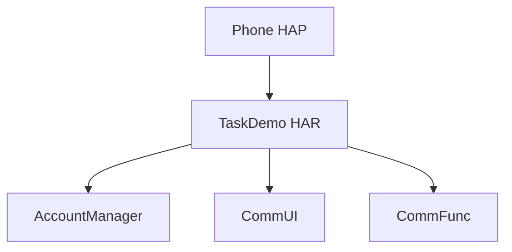

# TaskDemo 模块 — 实现计划（plan）（示例 · 中性业务域）

> **模块标识**: `task-console-home`
> **对应 spec**: `doc/features/task-console-home/spec/spec.md`
> **版本**: v1.0
> **创建日期**: 2026-05-12
> **状态**: 示例文档（演示章节结构与契约字段）

---

## 架构影响声明 (architecture_impact)

本示例演示「从零新增多模块」时的写法，属于 `module_set_change`。多数迭代需求落在 `impact: none`——仅保留占位数组即可。

```yaml
architecture_impact:
  impact: module_set_change
  affected_items:
    - "新增模块 TaskDemo（02-Feature）"
    - "新增模块 AccountManager（04-BusinessBase）"
    - "新增模块 CommUI（05-SystemBase 子层 CommUI）"
    - "新增模块 CommFunc（05-SystemBase 子层 CommFunc）"
  architecture_md_updates:
    - "业务模块清单：追加 TaskDemo / AccountManager / CommUI / CommFunc 行"
    - "架构级变更记录：追加一次「示例 feature 新增模块集合」"
  catalog_updates:
    - "module-catalog.yaml 为上述模块各新增一条目"
```

> 常见反例（多数 feature）：在既有 `TaskDemo` 内新增一个统计面板页，不新增/下线模块——应使用：

```yaml
architecture_impact:
  impact: none
  affected_items: []
  architecture_md_updates: []
  catalog_updates: []
```

---

## 0. 功能拆分到模块

| spec 编号 | 功能名称 | 分配模块 | 所属层 | 拆分理由 |
|----------|----------|----------|--------|----------|
| F1 | 草稿列表 | TaskDemo | 02-Feature | 列表 UI 与本地缓存读取 |
| F2 | 提交草稿 | TaskDemo | 02-Feature | 编排 RemoteGateway 与本地 Ledger |
| F3 | 登录态展示（若 spec 要求） | AccountManager | 04-BusinessBase | 账号会话与状态订阅 |
| — | Toast / 通用列表行 | CommUI | 05-SystemBase | 可复用基础 UI |

**本次新建模块（示意）**

| 模块 | 层 | 理由 |
|------|----|------|
| TaskDemo | 02-Feature | 首页工作台 UI + 与草稿相关的展示逻辑 |
| AccountManager | 04-BusinessBase | 若 spec 要求展示登录信息或触发登录流程 |
| CommUI / CommFunc | 05-SystemBase | 基础组件与工具 |

**不创建模块（示意）**：03-CommonBusiness 暂无横向共享能力需求时可省略。

---

## 1. 模块依赖示意（Mermaid）



---

## 2. 关键文件树（节选）

```text
02-Feature/TaskDemo/
  src/main/ets/
    presentation/pages/WorkbenchPage.ets
    domain/flow/TaskSubmitFlow.ets
    data/repository/DraftRepository.ets
    data/api/RemoteTaskGateway.ets
```

---

## 3. contracts 目录占位（节选）

设计落地时请在 `<features_dir>/<feature>/plan/contracts.yaml` 写入真实路径、导出符号与数据模型；此处仅示意：

- `WorkbenchPage` Props：<略>
- `TaskSubmitFlow`：负责 `startSubmit` / 错误分支占位

---

## 4. 数据与边界

- **本地**：草稿条目模型、最后同步时间字段。
- **远端**：`RemoteTaskGateway` 模拟返回成功/失败；未接真实环境时在 spec 标注「模拟数据」。

---

## 5. 风险与待定

| ID | 描述 | 缓解 |
|----|------|------|
| R1 | 离线场景下列表与提交结果不一致 | F3 顶部条提示 + 失败重试 |
