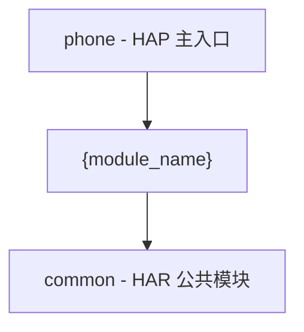
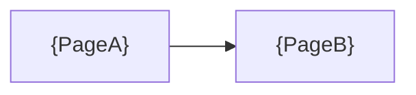

# {模块名称} — 实现计划（plan）

> **模板说明**：本模板以宿主应用常见模块占位名（例如 `demo_home` / `FeatureDemoShell`）演示字段填法；实际工程请替换为 `catalog` / `framework.config.json` / `architecture.md` 中的真实模块标识。
>
> **模块标识**: `{module-name}`
> **对应 spec**: `<features_dir>/{module-name}/spec/spec.md`
> **版本**: v1.0
> **创建日期**: {YYYY-MM-DD}
> **最后更新**: {YYYY-MM-DD}
> **状态**: 草稿 / 已确认
>
> **真源说明**：`plan.md` = 契约草案/来源（ephemeral）；`contracts.yaml` / `use-cases.yaml` = **机器契约真源**（coding / review / UT / harness 优先读取）。

---

## Scope 声明与继承

> **本节继承自 spec 的 Scope 声明，并记录本 plan 阶段用户批准的扩展。**
> coding 的 git diff 不得越界到 `in_scope_modules` 之外的模块。

### Scope 概览

| 字段 | 取值 | 说明 |
|------|------|------|
| 继承自 spec | `true` / `false` | 是否完全继承 spec 的 in_scope_modules（未扩展） |
| 本计划允许修改的模块 | `{ModuleA}`、`{ModuleB}` | = spec.in_scope_modules ∪ expansions_with_user_approval |
| 明确不修改的模块 | `{ModuleC}` | 继承自 spec.out_of_scope_modules |
| 已获用户批准的扩展 | 见下方 yaml | 无扩展则留空数组 `[]` |

### Scope 结构化字段（供 Harness 校验，必填）

```yaml
inherited_from_prd: true
in_scope_modules:
  - {ModuleA}
  - {ModuleB}
out_of_scope_modules:
  - {ModuleC}
rationale: |
  本计划完全继承 spec 的 scope 声明，未发起扩展。
expansions_with_user_approval: []
```

> 机器字段 `inherited_from_prd` 为 harness 历史键名；语义上表示「继承自 spec」。

### 架构影响声明 (architecture_impact)

```yaml
architecture_impact:
  impact: none
  affected_items: []
  architecture_md_updates: []
  catalog_updates: []
```

> `impact` 合法取值：`none` | `dsl_change` | `module_set_change` | `responsibility_rewrite`。`impact != none` 时须在 plan Step 12 同步更新 `doc/architecture.md` 等活规格。

---

## 1. 模块架构图



| Module | 格式 | 变更类型 | 说明 |
|--------|------|----------|------|
| {module_name} | HAR | 新增/修改 | {一句话} |

---

## 2. 目录/文件结构规划

| 路径 | 职责 | 新增/修改 |
|------|------|-----------|
| `{module}/src/main/ets/{path}/{File}.ets` | {职责} | 新增 |
| `{module}/index.ets` | 模块导出 | 修改 |

> 完整签名与类型细节落盘后以 `contracts.yaml` 为准；本节仅作人读草案。

---

## 3. 数据模型定义

| 模型 | 字段（摘要） | 说明 |
|------|--------------|------|
| `{ModelName}` | `{field}: {type}` | {用途} |

---

## 4. 页面组件树

### 4.1 {PageName}

```
{PageName}
├── {ChildA}
└── {ChildB}
```

---

## 5. 状态管理方案

| 状态域 | 存储位置 | 生命周期 | 说明 |
|--------|----------|----------|------|
| `{domain}` | {store} | {scope} | {说明} |

---

## 6. 服务层接口定义

| 接口 | 入参（摘要） | 出参（摘要） | 说明 |
|------|--------------|--------------|------|
| `{api.method}` | `{...}` | `{...}` | {说明} |

---

## 7. 路由/导航设计



| 页面 | NavDestination / 路由名 | 参数 | 说明 |
|------|-------------------------|------|------|
| {PageA} | `{route_a}` | — | {说明} |

---

## 8. spec 功能映射表

逐项对照 spec 功能清单，确保每个 P0/P1 功能有实现落点（BLOCKER 追溯门禁目标端）。

| spec 编号 | 功能名称 | 优先级 | 实现模块 | 实现层级 | 关键文件 | 实现说明 |
|-----------|----------|--------|----------|----------|----------|----------|
| F1 | {功能名} | P0 | {module} | {layer} | {file}.ets | {说明} |

**覆盖率检查**：
- P0: {X}/{Y}
- P1: {X}/{Y}

---

## 宿主扩展（可选）

鸿蒙专有细则（ArkUI 导航、能力权限、存储类型等）通过 `doc/extensions/knowledge/`、`hooks/plan/on_context_load.md` 与 `phase_rules_overlays.plan` 叠加。
