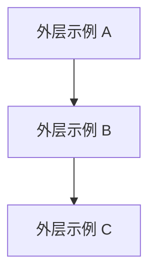

# {{PROJECT_NAME}} — 模块与分层架构

> 本文档描述本工程的模块分层与依赖约定，是架构设计的单一事实源之一。  
> **机器可读结构**见工程根目录 [framework.config.json](../framework.config.json) 的 `architecture` 段；修改分层后请同步更新本文与 config。

---

## 生成说明

- 本文档由 **Skill `00-framework-init`** 基于 `framework` 模板首次生成；后续需求迭代中应持续更新。
- 若调整了外层 / 内层 / 出口文件名，必须同步 `framework.config.json` 并通过 harness 相关检查。

---

## 外层架构（outer_layers）

依赖方向以 `framework.config.json` → `architecture.outer_layers` 为准：**仅允许声明过的层间依赖**，禁止逆向。

### 层间依赖表（摘录）

| 外层 id | 允许依赖的其它外层（can_depend_on） | 同层策略（intra_layer_deps） |
|---------|--------------------------------------|------------------------------|
| （由初始化时填） | （自动生成行） | forbid / dag / sublayer |

---

## 模块内分层（module_inner_layers）

模块代码目录内部采用以下分层（**数组顺序 = upward 依赖方向**，索引小的可被索引大的 import）：

`{{MODULE_INNER_LAYERS_CSV}}`

跨模块引用必须通过各模块根目录下的 **`{{CROSS_MODULE_EXPORTS_FILE}}`** 导出，禁止深路径 import 到其它模块内部实现。

---

## 物理目录与构建

请补充本工程的实际目录布局（可参考 `build-profile.json5` 的 `modules[].srcPath`）。

---

## 业务模块清单

> 下列模块清单在 **Skill 0**（`/catalog-bootstrap`）逐模块建档后补全；初始化阶段保持为空表即可。

| 模块名 | 所属外层 | 职责摘要 |
|--------|----------|----------|
| （待填） |  |  |
