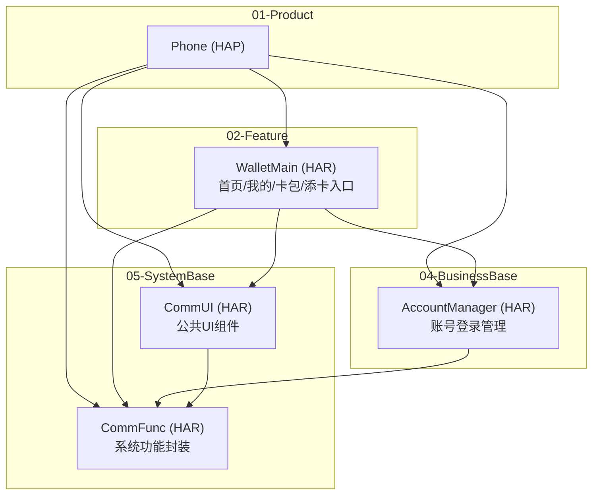
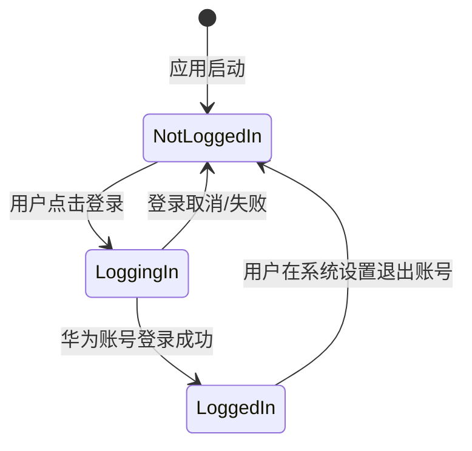
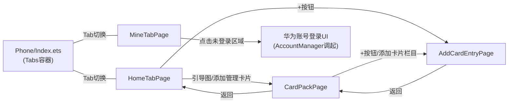

# 钱包首页模块 — 技术设计文档（示例）

> **模块标识**: `home-page`
> **对应 PRD**: `doc/features/home-page/PRD.md`
> **版本**: v1.0
> **创建日期**: 2026-04-08
> **最后更新**: 2026-04-08
> **状态**: 示例文档（用于演示设计文档格式和跨模块功能拆分）

---

## 0. 功能拆分到模块

基于 PRD 功能清单和五层架构，将各功能点分配到以下模块：

| PRD 编号 | 功能名称 | 分配模块 | 所属层 | 拆分理由 |
|----------|----------|----------|--------|----------|
| F1 | 底部 Tab 导航 | WalletMain | 02-Feature | 公共页面框架，与具体业务无关 |
| F2 | 首页-顶部添加按钮 | WalletMain | 02-Feature | 首页UI交互 |
| F3 | 首页-无卡引导区 | WalletMain | 02-Feature | 首页UI交互 |
| F4 | 首页-添加管理卡片按钮 | WalletMain | 02-Feature | 首页UI交互 |
| F5 | 首页-元服务入口区 | WalletMain | 02-Feature | 首页UI交互 |
| F6 | 首页-H5运营轮播区 | WalletMain | 02-Feature | 首页UI交互 |
| F7 | 我的-账号登录状态（UI展示） | WalletMain | 02-Feature | 我的页面UI |
| F7 | 我的-账号登录状态（登录能力） | AccountManager | 04-BusinessBase | 华为账号登录/登出/状态订阅 |
| F8 | 我的-金融信息区 | WalletMain | 02-Feature | 我的页面UI |
| F9 | 我的-设置与帮助区 | WalletMain | 02-Feature | 我的页面UI |
| F10-F13 | 卡包页 | WalletMain | 02-Feature | 公共页面 |
| F14-F16 | 添卡入口页 | WalletMain | 02-Feature | 公共页面 |
| F17 | 登录功能 | AccountManager | 04-BusinessBase | 拉起华为账号登录UI |
| — | Toast 提示 | CommUI | 05-SystemBase | 与业务无关的基础UI能力 |
| — | 通用列表项组件 | CommUI | 05-SystemBase | 可复用的基础UI组件 |
| — | 通用卡片容器组件 | CommUI | 05-SystemBase | 可复用的基础UI组件 |

**本次需要创建的模块**（仅限 PRD 实际需要的）：

| 模块 | 所属层 | 理由 |
|------|--------|------|
| WalletMain | 02-Feature | 首页/我的/卡包/添卡入口 4 个页面的 UI 和业务逻辑 |
| AccountManager | 04-BusinessBase | PRD F7/F17 涉及账号登录状态管理 |
| CommUI | 05-SystemBase | Toast、通用列表项等基础 UI 组件被多处使用 |
| CommFunc | 05-SystemBase | log 能力、基础工具类 |

**不创建的模块**：BankCard/TransportCard/AccessCard 等（PRD 中卡种入口仅展示 Toast"暂不支持"，不涉及实际卡种业务）；03-CommonBusiness 层暂无需求。

---

## 1. 模块架构图



### 1.1 模块变更摘要

| Module | 所属层 | 格式 | 变更类型 | 说明 |
|--------|--------|------|----------|------|
| WalletMain | 02-Feature | HAR | 新增 | 首页功能模块：首页Tab、我的Tab、卡包页、添卡入口页 |
| AccountManager | 04-BusinessBase | HAR | 新增 | 华为账号登录/登出、状态订阅、登录数据发布 |
| CommUI | 05-SystemBase | HAR | 新增 | Toast组件、通用列表项、通用卡片容器等基础UI |
| CommFunc | 05-SystemBase | HAR | 新增 | Log工具、格式化工具等基础能力 |
| Phone | 01-Product | HAP | 修改 | 主入口集成 WalletMain，注册路由 |

---

## 2. 目录/文件结构规划

### 2.1 Module: CommFunc (05-SystemBase)

```
05-SystemBase/CommFunc/
  src/main/ets/
    shared/
      log/
        Logger.ets                — 日志工具封装
      utils/
        FormatUtil.ets            — 格式化工具（账号脱敏等）
    Index.ets                     — HAR 模块导出入口
  oh-package.json5
  build-profile.json5
  src/main/module.json5
```

> CommFunc 为纯工具模块，仅使用 shared 层。

### 2.2 Module: CommUI (05-SystemBase)

```
05-SystemBase/CommUI/
  src/main/ets/
    shared/
      theme/
        CommColors.ets            — 公共颜色常量（可选）
    presentation/
      components/
        ToastUtil.ets             — Toast 弹窗工具组件
        ActionListItem.ets        — 通用可点击列表项（图标+文字+箭头）
        SectionCard.ets           — 通用圆角白底卡片容器
        BaseNavPage.ets           — NavDestination 基础页面壳子（统一标题栏）
    Index.ets                     — HAR 模块导出入口
  src/main/resources/
    base/element/
      color.json                  — 公共颜色资源
      float.json                  — 公共尺寸资源
  oh-package.json5
  build-profile.json5
  src/main/module.json5
```

> CommUI 使用 shared（主题常量）+ presentation（公共 UI 组件）两层。

### 2.3 Module: AccountManager (04-BusinessBase)

```
04-BusinessBase/AccountManager/
  src/main/ets/
    shared/
      constant/
        AccountConstants.ets      — 账号相关常量
    data/
      model/
        UserProfile.ets           — 用户账号信息模型
        LoginState.ets            — 登录状态枚举
    domain/
      service/
        AccountService.ets        — 账号管理核心服务（登录/登出/状态订阅/数据发布）
    Index.ets                     — HAR 模块导出入口
  oh-package.json5
  build-profile.json5
  src/main/module.json5
```

> AccountManager 使用 shared（常量）+ data（模型）+ domain（服务）三层，无 presentation。

### 2.4 Module: WalletMain (02-Feature)

```
02-Feature/WalletMain/
  src/main/ets/
    shared/
      constant/
        HomeConstants.ets         — 首页模块常量和枚举
      components/
        CardImageBanner.ets       — 卡片引导图基础组件
    data/
      model/
        ServiceEntry.ets          — 元服务入口数据模型
        PromoInfo.ets             — 运营轮播数据模型
        FinanceEntry.ets          — 金融信息入口数据模型
        SettingEntry.ets          — 设置项数据模型
        CardCategory.ets          — 卡种添卡入口数据模型
      repository/
        HomeRepository.ets        — 首页数据仓库（元服务、运营）
        MineRepository.ets        — 我的页面数据仓库（金融、设置）
        CardRepository.ets        — 卡包/添卡数据仓库
    presentation/
      components/
        CardGuideSection.ets      — 无卡引导区复杂组件
        ServiceGridSwiper.ets     — 元服务入口区复杂组件
        PromoSwiper.ets           — H5运营轮播区复杂组件
        AccountCard.ets           — 账号信息卡片复杂组件（调用 AccountManager）
        CardCategoryList.ets      — 卡种添卡列表复杂组件
      pages/
        HomeTabPage.ets           — 首页Tab
        MineTabPage.ets           — 我的Tab
        CardPackPage.ets          — 卡包页 (NavDestination)
        AddCardEntryPage.ets      — 添卡入口页 (NavDestination)
    Index.ets                     — HAR 模块导出入口
  src/main/resources/
    base/
      element/
        string.json               — 首页模块文本资源
        color.json                — 首页模块颜色资源
        float.json                — 首页模块尺寸资源
      media/                      — 图标和图片资源
      profile/
        main_pages.json           — 页面注册
        route_map.json            — 路由表
    zh_CN/element/
      string.json                 — 中文文本
  oh-package.json5
  build-profile.json5
  src/main/module.json5
```

### 2.5 Module: Phone (01-Product) — 迁移 + 修改

```
01-Product/Phone/                     ← 从根目录 phone/ 迁移至此
  src/main/ets/
    phoneability/
      PhoneAbility.ets            — 修改：启动后加载 WalletMain 主页面
    pages/
      Index.ets                   — 修改：改为 Tabs + Navigation 主框架
```

### 2.6 根目录配置变更

| 文件 | 变更类型 | 变更内容 |
|------|----------|----------|
| `build-profile.json5` | 修改 | modules 数组新增 CommFunc、CommUI、AccountManager、WalletMain；Phone 的 srcPath 改为 `"./01-Product/Phone"` |
| `oh-package.json5` | 修改 | dependencies 新增各模块间依赖路径，使用层目录前缀 |

---

## 3. 数据模型定义

### 3.1 UserProfile — 用户账号信息

**所在模块**: AccountManager (04-BusinessBase)
**所在文件**: `04-BusinessBase/AccountManager/src/main/ets/data/model/UserProfile.ets`

```typescript
export class UserProfile {
  isLoggedIn: boolean = false
  displayAccount: string = ''
  avatar: Resource | null = null

  constructor(params?: Partial<UserProfile>) {
    if (params) {
      Object.assign(this, params)
    }
  }

  get accountText(): string {
    return this.isLoggedIn ? this.displayAccount : '未登录'
  }
}
```

| 字段 | 类型 | 必填 | 默认值 | 说明 | 来源 |
|------|------|------|--------|------|------|
| isLoggedIn | boolean | ✅ | false | 登录状态 | AccountService |
| displayAccount | string | ✅ | '' | 脱敏账号（如 \*\*\*6790@\*\*.com） | AccountService |
| avatar | Resource \| null | ❌ | null | 头像，null 时用默认头像 | AccountService |

### 3.2 LoginState — 登录状态枚举

**所在模块**: AccountManager (04-BusinessBase)
**所在文件**: `04-BusinessBase/AccountManager/src/main/ets/data/model/LoginState.ets`

```typescript
export enum LoginState {
  NOT_LOGGED_IN = 'not_logged_in',
  LOGGING_IN = 'logging_in',
  LOGGED_IN = 'logged_in',
  LOGIN_FAILED = 'login_failed',
}
```

### 3.3 ServiceEntry — 元服务入口

**所在模块**: WalletMain (02-Feature)
**所在文件**: `WalletMain/src/main/ets/data/model/ServiceEntry.ets`

```typescript
export interface ServiceEntry {
  id: string
  name: string
  icon: Resource
}
```

### 3.4 PromoInfo — 运营轮播

**所在模块**: WalletMain (02-Feature)
**所在文件**: `WalletMain/src/main/ets/data/model/PromoInfo.ets`

```typescript
export interface PromoInfo {
  id: string
  title: string
  description: string
  image: Resource
}
```

### 3.5 FinanceEntry / SettingEntry — 列表入口项

**所在模块**: WalletMain (02-Feature)

```typescript
// WalletMain/src/main/ets/data/model/FinanceEntry.ets
export interface FinanceEntry {
  id: string
  name: string
  icon: Resource
}

// WalletMain/src/main/ets/data/model/SettingEntry.ets
export interface SettingEntry {
  id: string
  name: string
  icon: Resource
}
```

### 3.6 CardCategory — 卡种添卡入口

**所在模块**: WalletMain (02-Feature)
**所在文件**: `WalletMain/src/main/ets/data/model/CardCategory.ets`

```typescript
export interface CardCategory {
  id: string
  name: string
  description: string
  icon: Resource
}
```

---

## 4. 页面组件树

### 4.1 首页 Tab — HomeTabPage

**所在文件**: `WalletMain/src/main/ets/presentation/pages/HomeTabPage.ets`

```
HomeTabPage
├── CardGuideSection (WalletMain/presentation/components/)
│   └── CardImageBanner (WalletMain/shared/components/)
├── ServiceGridSwiper (WalletMain/presentation/components/)
├── 消息中心入口 (内联构建，P2)
└── PromoSwiper (WalletMain/presentation/components/)
```

### 4.2 我的 Tab — MineTabPage

**所在文件**: `WalletMain/src/main/ets/presentation/pages/MineTabPage.ets`

```
MineTabPage
├── AccountCard (WalletMain/presentation/components/)
│   └── 内部调用 AccountManager.AccountService 获取登录状态
├── SectionCard (CommUI/components/) — 金融信息卡片
│   └── ActionListItem × N (CommUI/components/)
└── SectionCard (CommUI/components/) — 设置卡片
    └── ActionListItem × N (CommUI/components/)
```

**关键跨模块调用**：
- `AccountCard` 组件调用 `AccountManager` 的 `AccountService` 获取/订阅登录状态
- 点击未登录区域 → 调用 `AccountService.login()` → 拉起华为账号登录 UI
- 系统设置中退出账号 → `AccountService` 通过状态订阅通知 UI 刷新为未登录

### 4.3 卡包页 — CardPackPage

**所在文件**: `WalletMain/src/main/ets/presentation/pages/CardPackPage.ets`

```
CardPackPage (NavDestination, 使用 CommUI/BaseNavPage 壳子)
├── ActionListItem (CommUI/components/) — "添加卡片"入口
└── ActionListItem (CommUI/components/) — "管理非本机卡片"入口
```

### 4.4 添卡入口页 — AddCardEntryPage

**所在文件**: `WalletMain/src/main/ets/presentation/pages/AddCardEntryPage.ets`

```
AddCardEntryPage (NavDestination, 使用 CommUI/BaseNavPage 壳子)
├── ActionListItem (CommUI/components/) — "非本机卡片"入口
└── CardCategoryList (WalletMain/presentation/components/)
    └── ActionListItem × 5 (CommUI/components/)
```

---

## 5. 状态管理方案

### 5.1 状态分类

| 数据 | 作用域 | 装饰器/机制 | 持有者 | 所属模块 | 说明 |
|------|--------|------------|--------|----------|------|
| 当前Tab索引 | Phone主页面 | @State | Index.ets | Phone | 控制Tabs切换 |
| 元服务列表 | 首页Tab | @State | HomeTabPage | WalletMain | 从HomeRepository加载 |
| 运营轮播列表 | 首页Tab | @State | HomeTabPage | WalletMain | 从HomeRepository加载 |
| 金融信息列表 | 我的Tab | @State | MineTabPage | WalletMain | 从MineRepository加载 |
| 设置项列表 | 我的Tab | @State | MineTabPage | WalletMain | 从MineRepository加载 |
| 用户登录状态 | 全应用 | AppStorage / 事件订阅 | AccountService | AccountManager | 登录/退出登录会全局广播 |
| 卡种列表 | 添卡入口页 | @State | AddCardEntryPage | WalletMain | 从CardRepository加载 |
| NavPathStack | 跨页面 | @Provide/@Consume | Index.ets | Phone | Navigation路由栈 |

### 5.2 账号状态流转



`AccountService` 负责：
1. 调用华为账号登录 Kit API 拉起登录 UI
2. 监听系统级账号退出事件
3. 通过 AppStorage 或事件机制将登录状态变更广播给 UI 层

---

## 6. 服务层接口定义

### 6.1 AccountService (04-BusinessBase / AccountManager)

**所在文件**: `04-BusinessBase/AccountManager/src/main/ets/domain/service/AccountService.ets`

```typescript
export class AccountService {
  /** 获取当前用户信息 */
  async getUserProfile(): Promise<UserProfile> { ... }

  /**
   * 拉起华为账号登录 UI
   * 使用 @ohos.account.osAccount 或华为账号登录 Kit
   * 登录成功后更新 AppStorage 中的用户状态
   */
  async login(): Promise<UserProfile> { ... }

  /** 登出并清除本地登录数据 */
  async logout(): Promise<void> { ... }

  /**
   * 订阅登录状态变化
   * 当系统设置中退出账号时，通过回调通知 UI 刷新
   */
  onLoginStateChanged(callback: (state: LoginState) => void): void { ... }

  /** 取消订阅 */
  offLoginStateChanged(callback: (state: LoginState) => void): void { ... }
}
```

| 方法 | 入参 | 出参 | 异步 | 说明 |
|------|------|------|------|------|
| getUserProfile | — | Promise\<UserProfile\> | ✅ | 获取当前用户信息，未登录返回默认值 |
| login | — | Promise\<UserProfile\> | ✅ | 拉起华为账号登录 UI，模拟阶段返回写死数据 |
| logout | — | Promise\<void\> | ✅ | 登出清理 |
| onLoginStateChanged | callback | void | ❌ | 订阅状态变更（系统退出账号等） |
| offLoginStateChanged | callback | void | ❌ | 取消订阅 |

> **华为账号登录开发细节**：
> - 使用 `@kit.AccountKit` 中的 `authentication` 模块（参考[华为账号服务官方文档](https://developer.huawei.com/consumer/cn/doc/harmonyos-guides-V5/account-overview-V5)）
> - 调用 `createAuthorizationWithHuaweiIDRequest()` 创建授权请求
> - 通过 `AuthenticationController.executeRequest()` 拉起登录 UI
> - 模拟阶段：login() 直接返回模拟的 UserProfile，不实际调用华为账号 API
> - 监听系统账号变化：使用 `@ohos.account.osAccount` 的 `on('change')` 事件

### 6.2 HomeRepository (02-Feature / WalletMain)

**所在文件**: `WalletMain/src/main/ets/data/repository/HomeRepository.ets`

```typescript
export class HomeRepository {
  async getServiceEntries(): Promise<Array<ServiceEntry>> { ... }
  async getPromoList(): Promise<Array<PromoInfo>> { ... }
}
```

| 方法 | 出参 | 数据来源 | 说明 |
|------|------|----------|------|
| getServiceEntries | Promise\<Array\<ServiceEntry\>\> | 模拟数据 | 元服务入口列表（至少3项） |
| getPromoList | Promise\<Array\<PromoInfo\>\> | 模拟数据 | 运营轮播列表（至少2项） |

### 6.3 MineRepository (02-Feature / WalletMain)

**所在文件**: `WalletMain/src/main/ets/data/repository/MineRepository.ets`

```typescript
export class MineRepository {
  async getFinanceEntries(): Promise<Array<FinanceEntry>> { ... }
  async getSettingEntries(): Promise<Array<SettingEntry>> { ... }
}
```

### 6.4 CardRepository (02-Feature / WalletMain)

**所在文件**: `WalletMain/src/main/ets/data/repository/CardRepository.ets`

```typescript
export class CardRepository {
  async getCardCategories(): Promise<Array<CardCategory>> { ... }
  async getNonLocalCardCount(): Promise<number> { ... }
}
```

### 6.5 关于 domain 层

WalletMain 模块业务逻辑较简单（各页面数据来源独立，无跨 Repository 编排需求），故**省略 domain/usecase 层**。各页面直接调用对应的 Repository。AccountCard 组件直接调用 AccountManager 的 AccountService。

---

## 7. 路由/导航设计

### 7.1 页面跳转关系



### 7.2 Navigation 配置

Phone 的 Index.ets 使用 `Tabs` 容器 + 内嵌 `Navigation` 处理页面跳转。

| 页面 | NavDestination 名称 | 所属模块 | 路由参数 | 说明 |
|------|---------------------|----------|----------|------|
| HomeTabPage | 内嵌于 Tabs | WalletMain | — | 首页Tab内容 |
| MineTabPage | 内嵌于 Tabs | WalletMain | — | 我的Tab内容 |
| CardPackPage | "CardPackPage" | WalletMain | — | 卡包页 |
| AddCardEntryPage | "AddCardEntryPage" | WalletMain | — | 添卡入口页 |

---

## 8. PRD 功能映射表

| PRD 编号 | 功能名称 | 优先级 | 所属层 | 实现模块 | 模块内层级 | 关键文件 | 实现说明 |
|----------|----------|--------|--------|----------|-----------|----------|----------|
| F1 | 底部 Tab 导航 | P0 | 01-Product | Phone | pages | Index.ets | Tabs + BarPosition.End |
| F2 | 首页-顶部添加按钮 | P0 | 02-Feature | WalletMain | presentation | HomeTabPage.ets | 标题栏右侧"+"按钮 |
| F3 | 首页-无卡引导区 | P0 | 02-Feature | WalletMain | presentation | CardGuideSection.ets | 引导图+点击跳转卡包 |
| F4 | 首页-添加管理卡片按钮 | P0 | 02-Feature | WalletMain | presentation | CardGuideSection.ets | 按钮跳转卡包页 |
| F5 | 首页-元服务入口区 | P0 | 02-Feature | WalletMain | presentation+data | ServiceGridSwiper.ets, HomeRepository.ets | Swiper+模拟数据 |
| F6 | 首页-H5运营轮播区 | P0 | 02-Feature | WalletMain | presentation+data | PromoSwiper.ets, HomeRepository.ets | Swiper自动轮播 |
| F7 | 我的-账号登录状态(UI) | P0 | 02-Feature | WalletMain | presentation | AccountCard.ets | 条件渲染登录/未登录 |
| F7 | 我的-账号登录状态(能力) | P0 | 04-BusinessBase | AccountManager | domain/service | AccountService.ets | 登录状态管理+订阅 |
| F8 | 我的-金融信息区 | P0 | 02-Feature+05-SystemBase | WalletMain+CommUI | presentation | MineTabPage.ets, ActionListItem.ets | 使用CommUI列表项 |
| F9 | 我的-设置与帮助区 | P0 | 02-Feature+05-SystemBase | WalletMain+CommUI | presentation | MineTabPage.ets, ActionListItem.ets | 使用CommUI列表项 |
| F10 | 卡包页-整体框架 | P0 | 02-Feature | WalletMain | presentation | CardPackPage.ets | NavDestination |
| F11 | 卡包页-添加卡片栏目 | P0 | 02-Feature+05-SystemBase | WalletMain+CommUI | presentation | CardPackPage.ets | ActionListItem跳转 |
| F12 | 卡包页-本设备卡片区 | P1 | 02-Feature | WalletMain | presentation | CardPackPage.ets | 条件渲染 |
| F13 | 卡包页-管理非本机入口 | P0 | 02-Feature+05-SystemBase | WalletMain+CommUI | presentation | CardPackPage.ets | ActionListItem+Toast |
| F14 | 添卡入口页-整体框架 | P0 | 02-Feature | WalletMain | presentation | AddCardEntryPage.ets | NavDestination |
| F15 | 添卡入口页-非本机卡片入口 | P0 | 02-Feature | WalletMain | presentation+data | AddCardEntryPage.ets, CardRepository.ets | 数量徽标 |
| F16 | 添卡入口页-卡种添卡列表 | P0 | 02-Feature | WalletMain | presentation+data | CardCategoryList.ets, CardRepository.ets | 5类卡种 |
| F17 | 我的-登录功能 | P1 | 04-BusinessBase | AccountManager | domain/service | AccountService.ets | 华为账号Kit登录 |
| F18 | 首页-消息中心入口 | P2 | 02-Feature | WalletMain | presentation | HomeTabPage.ets | 内联构建+Toast |
| — | Toast 工具 | — | 05-SystemBase | CommUI | components | ToastUtil.ets | 全局复用 |
| — | 通用列表项 | — | 05-SystemBase | CommUI | components | ActionListItem.ets | 全局复用 |
| — | 通用卡片容器 | — | 05-SystemBase | CommUI | components | SectionCard.ets | 全局复用 |
| — | Log工具 | — | 05-SystemBase | CommFunc | log | Logger.ets | 全局复用 |
| — | 格式化工具 | — | 05-SystemBase | CommFunc | utils | FormatUtil.ets | 账号脱敏等 |

**覆盖率检查**：
- P0 功能映射覆盖率: 15/15 = 100% ✅
- P1 功能映射覆盖率: 2/2 = 100% ✅
- P2 功能: 1项，已标注实现方案
- 基础能力（CommUI/CommFunc）: 已识别并独立列出

---

## 附录

### A. 资源文件规划

#### CommUI — 公共颜色资源

| 资源 Key | 色值 | 使用位置 |
|----------|------|----------|
| comm_primary_blue | #0A59F7 | Tab选中态、主题色 |
| comm_text_primary | #182431 | 主要文字 |
| comm_text_secondary | #99182431 | 次要文字 |
| comm_bg_page | #F1F3F5 | 页面背景色 |
| comm_bg_card | #FFFFFF | 卡片背景色 |

#### WalletMain — 文本资源

| 资源 Key | 中文值 | 使用位置 |
|----------|--------|----------|
| tab_home | "首页" | 底部Tab |
| tab_mine | "我的" | 底部Tab |
| home_title | "钱包" | 首页标题 |
| card_guide_subtitle | "集中管理您的卡证票券钥匙" | 首页引导区 |
| add_manage_cards | "添加管理卡片" | 首页引导按钮 |
| not_supported | "暂不支持" | Toast提示 |
| card_pack_title | "卡包" | 卡包页标题 |
| add_card_title | "添加卡片" | 添卡入口页标题 |

### B. 设计决策记录

| 编号 | 决策点 | 可选方案 | 选定方案 | 理由 |
|------|--------|----------|----------|------|
| D1 | 账号管理放哪个模块 | A: WalletMain内部 / B: 独立AccountManager | B | 账号是全应用级基础能力，不属于某个Feature，且系统退出账号需全局响应 |
| D2 | Toast组件放哪个模块 | A: WalletMain/shared / B: CommUI | B | Toast与业务无关，是基础UI能力，未来所有模块都会用 |
| D3 | 是否需要domain层 | A: 有UseCase / B: 无 | B | 当前业务逻辑简单，无跨Repository编排 |
| D4 | 是否创建卡种Feature模块 | A: 创建BankCard等 / B: 不创建 | B | PRD中卡种入口仅展示Toast，不涉及实际业务，按需添加原则不创建 |

### C. 变更记录

| 日期 | 版本 | 变更内容 | 变更人 |
|------|------|----------|--------|
| 2026-04-08 | v1.0 | 初始版本，基于 home-page PRD v1.0 + 五层架构重新设计 | AI |
