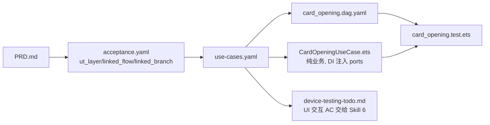

# 示例：银行卡开卡流程（Canonical Sample）

本目录是 **UT 分层分工 + UseCase 端到端化方案（v2）** 的参考实现。钱包工程当前没有真实的开卡模块，因此这里以"纸面样例"形式，示范 AI / 开发者在设计 → 编码 → UT 三环节应当产出什么。

## 目录结构

```
examples/card-opening/
├── use-cases.yaml              ← Skill 2 产出：放到 doc/features/card-opening/use-cases.yaml
├── CardOpeningUseCase.ets      ← Skill 3 产出：放到 02-Feature/CardOpen/src/main/ets/domain/usecase/
├── card_opening.dag.yaml       ← Skill 5 产出：放到 02-Feature/CardOpen/test/dag/
├── card_opening.test.ets       ← Skill 5 产出：放到 02-Feature/CardOpen/src/ohosTest/ets/test/
├── device-testing-todo.md      ← Skill 5 产出：放到 doc/features/card-opening/，供 Skill 6 消费
├── design-snippet.md           ← Skill 2 产出：合并到 doc/features/card-opening/design.md 的相关章节
└── spy/
    ├── SpyCardOpenApi.ets      ← 云侧端口测试替身
    └── SpyCardPersistence.ets  ← 本地端口测试替身
```

## 业务流程（PRD 侧）

1. 用户在页面选择银行信息并点击开卡（UI 真人输入 → Skill 6 覆盖）
2. 云侧 `validateOpen` 校验资格
3. 云侧 `applyCardResource` 申请卡资源
4. 本地 `storage.save` 持久化卡记录，进入 WaitingSms
5. 用户输入短信验证码（UI 真人输入 → Skill 6 覆盖）
6. 云侧 `verifySmsCode` 校验短验
7. 成功 → `storage.update` 激活；失败 → `storage.rollback`

## 流水线串联



## 要点速览

| 问题 | 回答 |
|---|---|
| UT 如何测"用户点击开卡"？ | 直接 `await useCase.startOpening({...})`，不 fake UI |
| 如何覆盖多个分支？ | `use-cases.yaml` 枚举 branches，`*.test.ets` 1 个 branch = 1 个 `it()` |
| 如何保证端到端？ | 每个 `it()` 至少 **≥2 次 port 调用 + ≥2 次 state 断言** |
| 导航/Toast 怎么测？ | **完全不在 UT 里测**，由 Skill 6 消费 `device-testing-todo.md` |
| 端口如何打桩？ | SpyPort：`whenXxx.returns(v)` / `whenXxx.throws(e)` + `callLog` |
| 能否在 UseCase 里写 `showToast`？ | 不行。UseCase 必须通过 `state.errorCode` 传递，由 UI 翻译 |

## 禁令清单（BLOCKER）

- ❌ UseCase 源文件 import 任何 UI 符号（`@Component` / `NavPathStack` / `showToast` / `$r` / `getUIContext`）
- ❌ UT 文件 import UI 符号（仅允许：`@ohos/hypium`、被测 UseCase、Spy、数据模型）
- ❌ 在 UseCase 里 `new XxxRepository()`；必须构造器注入
- ❌ 一个 `it()` 只调一个 port（退化为"数据接口测试"）
- ❌ DAG 文件缺 `use_case` 字段或 `branch` 交叉引用
