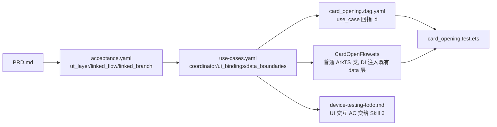

# 示例：银行卡开卡流程（Canonical Sample · v2.1）

本目录是 **UT 分层分工 + UseCase 去代码化方案（v2.1）** 的参考实现。钱包工程当前没有真实的开卡模块，因此这里以"纸面样例"形式，示范 AI / 开发者在设计 → 编码 → UT 三环节应当产出什么。

> **v2 → v2.1 关键区别**：`UseCase` 不再是代码中必须存在的类。`use-cases.yaml` 只是业务**规约**；真正的业务编排代码形态（Page 命名方法 / 普通 Flow 类 / 导出函数）由 Skill 3 自选。本样例选了"普通 ArkTS 协调类 `CardOpenFlow`"，因为它跨 3 页面 + 1 弹框 + 含回滚分支，符合 Skill 2 的复杂度阈值。

## 目录结构

```
examples/card-opening/
├── use-cases.yaml              ← Skill 2 产出：放到 doc/features/card-opening/use-cases.yaml
├── CardOpenFlow.ets            ← Skill 3 产出：放到 02-Feature/CardOpen/src/main/ets/domain/flow/
├── card_opening.dag.yaml       ← Skill 5 产出：放到 02-Feature/CardOpen/test/dag/
├── card_opening.test.ets       ← Skill 5 产出：放到 02-Feature/CardOpen/src/ohosTest/ets/test/
├── device-testing-todo.md      ← Skill 5 产出：放到 doc/features/card-opening/，供 Skill 6 消费
├── design-snippet.md           ← Skill 2 产出：合并到 doc/features/card-opening/design.md 的相关章节
└── spy/
    ├── SpyCardOpenApi.ets      ← 云侧数据边界 Spy 子类（extends CardOpenApi）
    └── SpyCardStore.ets        ← 本地数据边界 Spy 子类（extends CardStore）
```

## 业务流程（PRD 侧）

1. 用户在 `CardSelectPage` 选择银行信息并点击开卡（UI 真人输入 → UT 里直接调 `flow.chooseCard`；真机表现交 Skill 6）
2. 云侧 `api.validateOpen` 校验资格
3. 云侧 `api.applyCardResource` 申请卡资源
4. 本地 `store.save` 持久化卡记录，进入 WaitingSms
5. 用户在 `SmsDialog` 输入短信验证码（UI 真人输入 → UT 里直接调 `flow.confirmSms`；真机表现交 Skill 6）
6. 云侧 `api.verifySmsCode` 校验短验
7. 成功 → `store.update` 激活；失败 → `store.rollback`

## 流水线串联



## 要点速览（v2.1）

| 问题 | 回答 |
|---|---|
| UT 如何测"用户点击开卡"？ | 直接 `await flow.chooseCard({...})`（`ui_bindings.calls` 声明的命名函数），不 new `@Component struct` |
| 如何覆盖多个分支？ | `use-cases.yaml` 枚举 branches，`*.test.ets` 1 个 branch = 1 个 `it()` |
| 如何保证端到端？ | 每个 `it()` 调用至少 1 个命名入口 + 至少 ≥2 次 boundary 调用断言 + ≥2 次 state/phase 断言 |
| 导航/Toast 怎么测？ | **完全不在 UT 里测**，由 Skill 6 消费 `device-testing-todo.md`；DAG 中用 `ui_subscription` 节点文档化 |
| 数据边界如何打桩？ | 子类化既有 data 层类（`SpyCardOpenApi extends CardOpenApi`）+ `whenXxx.returns(v)` / `whenXxx.throws(e)` + `callLog` |
| 能否在 CardOpenFlow 里写 `showToast`？ | 不行。业务编排必须通过 `state.errorCode` 传递，由 UI 层用 `@Watch` 翻译 |
| 要不要为 UT 新建 Port 接口？ | **不要**。`data_boundaries[].type` 直接引用 `contracts.yaml` 已登记的 data 层类 |
| 要不要为 UT 把业务从 Page 里抽出来？ | 要；但目的是"让业务代码可被直接调用"，不是"套入某种架构"。简单场景也可以只抽成 Page 的命名方法或导出函数 |

## 禁令清单（BLOCKER）

- ❌ UT 文件 import 任何 UI 符号（`@Component` / `struct` / `NavPathStack` / `showToast` / `$r(` / `$rawfile(` / `AppStorage` / `LocalStorage` / `@kit.ArkUI` / `@kit.ArkGraphics`）— 由 `ut_import_whitelist` 拦截
- ❌ UT 文件中 `new XxxPage()` / `new XxxComponent()` 之类直接实例化 `@Component struct`
- ❌ `ui_bindings[].user_actions[].calls` 指向 inline lambda 而非命名函数/方法 — 由 `named_business_handler` 拦截
- ❌ 为打桩方便新造 `XxxPort` 接口；必须复用 `contracts.yaml > interfaces[].class` 已登记的既有类
- ❌ 业务编排代码（CardOpenFlow 等普通 class / 导出函数）中出现 `showToast` / `NavPathStack` / `AppStorage` / `$r`
- ❌ 一个 `it()` 只调一个 boundary（退化为"数据接口测试"）— 由 `it_drives_flow` MAJOR 拦截
- ❌ DAG 文件缺 `use_case` 字段（当 use-cases.yaml 存在时），或 `port_call_*` 节点的 `boundary` 字段未回指 `data_boundaries[].name`
