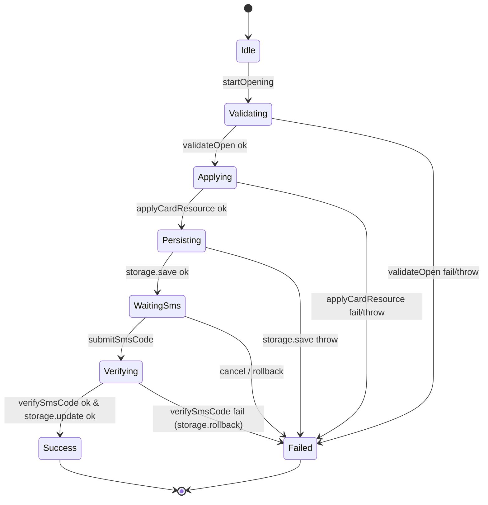

# `design.md` 片段：业务流程 UseCase 清单

> 下面这段应出现在 `doc/features/card-opening/design.md` 的 **"三、业务流程 UseCase 清单"** 章节（Skill 2 新增章节）。完整 Schema 见 `framework/skills/5-business-ut/templates/use-cases-schema.md`。

---

## 三、业务流程 UseCase 清单

本 feature 存在多步骤业务流程，按照 `use-cases.yaml` 模型产出如下 UseCase：

### 3.1 CardOpeningUseCase

- **触发入口**：`startOpening(bankInfo)`、`submitSmsCode(smsCode)`、`cancel()`
- **依赖端口**：
  - `api: CardOpenApi`（云侧：`validateOpen` / `applyCardResource` / `verifySmsCode`）
  - `storage: CardPersistence`（本地：`save` / `update` / `rollback`）
- **发布状态**：`{ phase, errorCode, resultCardId }`
- **状态机**：

- **分支清单（UT 必须 1:1 覆盖，详见 `use-cases.yaml`）**：

| branch id | 场景 | linked AC |
|---|---|---|
| `happy_path` | 开卡全链路成功 | AC-1 |
| `validate_fail` | 云侧校验失败 | AC-2 |
| `apply_fail` | 云侧申请卡资源失败 | AC-7 |
| `persist_fail` | 本地持久化失败 | AC-4 |
| `sms_fail_rollback` | 短验失败，回滚已写入卡 | AC-3 |
| `user_cancel_in_waiting_sms` | 用户在 WaitingSms 取消 | AC-6 |

- **UI 层职责**（对应 `HomeOpenCardPage.ets`）：
  - `onClick` → `useCase.startOpening(...)`
  - 订阅 `useCase.state.phase`：
    - `WaitingSms` → 弹出短验弹框
    - `Success` → `navPathStack.pushPath('CardResultPage', { cardId })`
    - `Failed` → `showToast(mapErrorToMessage(state.errorCode))`
  - UI 层**不得**直接调用 `api.*` / `storage.*`
