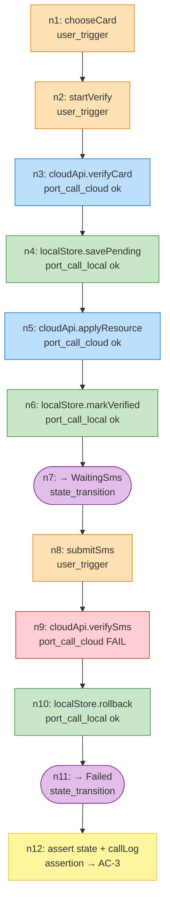

# DAG Schema 规范

> DAG 是业务级 UT 的核心数据结构，用 YAML 描述一条业务流的拓扑 + 打桩 + 断言。
> AI 按 DAG 把 `use-cases.yaml` 的 `branches[].user_sequence` 翻译成 Hypium `it()`。
>
> **核心原则**：
> - DAG 是**消费品**，不驱动生产代码形态
> - DAG 描述**现有代码**的调用链，不描述"应该如何抽象"
> - UI 副作用（Toast / 导航 / 动画）**永远不画进 DAG**，交 `device-testing-todo.md`

## 概述

v2 修正后的 DAG 定位：

| 维度 | 内容 |
|---|---|
| DAG 的上游 | `acceptance.yaml` + `use-cases.yaml`（若产出）+ 现有业务代码 |
| DAG 的下游 | `*.test.ets` UT 用例 |
| 必填元数据 | `flow_id` / `branches[]` / `linked_acceptance` / `entry_point` |
| 可选元数据 | `use_case`（产出了 `use-cases.yaml` 时填；否则省略） |

## 完整 Schema

```yaml
# ============================================================================
# 顶层元数据
# ============================================================================

flow_id: string                    # 唯一标识，snake_case，如 "card_opening_happy"
flow_name: string                  # 人类可读名称（中文）
module: string                     # feature 模块名，如 "card-opening"
version: string                    # 版本号，如 "2.0"

# use_case 仅当产出了 use-cases.yaml 时填；简单 feature 省略
use_case: string | null            # 对应 use-cases.yaml > use_cases[].id

branches:                          # 此 DAG 覆盖的分支 id 列表
  - string                         # 产出了 use-cases.yaml 时：必须是 branches[].id 的子集
                                   # 否则：自定义分支名（如 "happy" / "fail"），用于 it() 命名追溯

linked_acceptance:                 # 关联的 AC 编号
  - string
linked_boundaries:                 # 关联的 BD 编号（可选）
  - string

entry_point:                       # 流程入口 —— 指向**现有代码里 UT 能直接调用的命名函数**
  module: string
  file: string                     # 文件相对路径
  function: string                 # 命名方法/导出函数名
                                   # 产出了 use-cases.yaml 时：通常是 coordinator 上的方法
                                   # 否则：直接指向 Page 命名方法 / Repository 方法

# ============================================================================
# 节点列表
# ============================================================================

nodes:
  - id: string                     # DAG 内唯一，如 "n1"
    type: enum                     # 见下方节点类型枚举
    description: string            # 业务含义（中文）

    source:                        # 源码引用（除 user_trigger / state_transition 外推荐）
      file: string
      function: string
      class: string | null

    next: [string]                 # 后续节点 ID；assertion 节点通常为 []

    # === 各节点类型的专属字段 ===

    # --- user_trigger ---
    trigger:
      event: string                # 对应 use-cases.yaml > ui_bindings.user_actions.calls
                                   # 或现有代码里的命名函数名
      simulated_value: string      # 用户输入的模拟值表达式
      from_branch: string          # 本 trigger 隶属哪条分支（辅助追溯）

    # --- port_call_cloud / port_call_local ---
    boundary:                      # 对应 use-cases.yaml > data_boundaries[]
      name: string                 # 如 "cloudApi" / "localStore"
      type: string                 # 现有类名，如 "CardCloudApi"
      method: string               # 被调用方法名
    stub_strategy: enum            # mock_response | mock_error | throw | mock_delay
    mock_data:
      success: { description: string, value: string }
      error:   { description: string, value: string }
      empty:   { description: string, value: string }

    # --- state_transition ---
    transition:
      from_phase: string | null
      to_phase: string
      field_updates: object        # 如 { errorCode: "'SMS_ERR'" }

    # --- conditional_branch（保留） ---
    condition: string
    branches:
      true_branch: [string]
      false_branch: [string]

    # --- assertion ---
    linked_branch: string          # 必填（或 linked_acceptance 二选一）
    linked_acceptance: [string]
    assertions:
      - type: enum                 # state_check | port_call_log | data_check | error_check
        target: string             # 如 "flow.state.phase" / "spyCloud.callLog"
        expected: string
        description: string | null
```

## 节点类型枚举

| type 值 | 说明 | 必填专属字段 |
|---|---|---|
| `user_trigger` | 模拟"用户事件"——UT 里就是直接 `await coord.xxx(...)` | `trigger.event` |
| `port_call_cloud` | 云侧接口调用（真实 data 层类的方法） | `boundary`, `stub_strategy`, `mock_data` |
| `port_call_local` | 本地持久化/系统能力调用 | `boundary`, `stub_strategy`, `mock_data` |
| `state_transition` | 业务流内部 state.phase 迁移 | `transition.to_phase` |
| `ui_subscription` | UI 因某 state 变化而渲染/跳转（⚠️ 仅供 design 文档与 `device-testing-todo.md` 生成参考；**UT 不断言、harness 忽略**） | `transition.to_phase` + `subscriber`（UI 名称） |
| `assertion` | UT 断言点 | `linked_branch` 或 `linked_acceptance`，`assertions` |
| `conditional_branch` | 条件分支（保留；优先多 DAG 表达） | `condition`, `branches` |
| `code_execution` | 纯同步计算（保留兼容） | `source` |
| `async_call` | 通用异步调用（保留兼容；优先用 port_call_*） | `source`, `stub_strategy`, `mock_data` |
| `background_task` | 后台任务（保留兼容） | `source`, `task` |
| ~~`user_intervention`~~ | 已弃用 → `device-testing-todo.md` | — |
| ~~`ui_navigation`~~ | 已弃用 → `device-testing-todo.md` | — |

> 关于 `ui_subscription`：本节点类型**不是** UT 关心的对象，只是在 design 阶段为了把"state → UI 反应"的映射可视化而保留的占位节点，方便 Skill 6 从 DAG + `use-cases.yaml > ui_bindings` 生成真机测试清单。UT 扫描时会跳过。

## 断言类型枚举

| assertions[].type | 说明 | target 格式 |
|---|---|---|
| `state_check` | 业务编排 state 字段值 | `flow.state.<field>` / `<coordinator>.state.<field>` |
| `port_call_log` | Spy 调用序列 | `spyCloud.callLog` / `spyLocal.callLog` |
| `data_check` | 数据完整性（持久化/内存） | `spyLocal.saved[0].cardId` |
| `error_check` | 错误态 | `flow.state.errorCode` |
| ~~`ui_verify`~~ | 已弃用 → `device-testing-todo.md` | — |

## 打桩策略枚举

| stub_strategy | 说明 |
|---|---|
| `mock_response` | 返回预设的成功/空响应 |
| `mock_error` | 结构化错误返回 |
| `throw` | 抛异常（网络/磁盘异常） |
| `mock_delay` | 模拟延迟（测加载态） |

## 约束规则

1. **节点类型封闭**：`type` 必须来自上述枚举
2. **无环**：`next` 链可拓扑排序
3. **入口可达**：所有节点从 `entry_point` 对应节点可达
4. **assertion 终止**：`next` 通常为 `[]`
5. **追溯强约束**：assertion 节点必须有 `linked_branch` 或 `linked_acceptance` 之一
6. **boundary 一致性**（当 `use_case` 非空时）：`boundary.name` / `type` / `method` 必须在 `use-cases.yaml > data_boundaries` 中有对应声明
7. **source 存在性**：`source.file` 引用的文件在工程中必须存在
8. **ID 唯一**：DAG 内 `nodes[].id` 不重复
9. **mock 完整**：`port_call_*` / `async_call` 节点至少定义一种 mock_data 场景
10. **UI 副作用禁入**：DAG 中禁止出现 `NavPathStack.push` / `showToast` / 真实点击等节点（请用 `ui_subscription` 占位或交 `device-testing-todo.md`）
11. **分支覆盖（当 `use_case` 非空时）**：同 UseCase 的所有 DAG 的 `branches[]` 必须并集覆盖 `use-cases.yaml > branches[].id`，且互不重叠

## 示例：开卡·短验失败回滚分支

```yaml
flow_id: card_opening_sms_fail
flow_name: 开卡-短验失败回滚分支
module: card-opening
version: "2.0"

use_case: card_opening
branches: [sms_fail_rollback]
linked_acceptance: [AC-3]

entry_point:
  module: CardOpen
  file: 02-Feature/WalletMain/src/main/ets/data/flow/CardOpenFlow.ets
  function: chooseCard

nodes:
  - id: n1
    type: user_trigger
    description: 用户在 CardSelectPage 选卡点开卡
    trigger:
      event: chooseCard
      simulated_value: "{ bankCode: 'BOC', cardId: 'c1' }"
      from_branch: sms_fail_rollback
    next: [n2]

  - id: n2
    type: user_trigger
    description: chooseCard 成功后内部触发 startVerify
    trigger:
      event: startVerify
      simulated_value: "undefined"
      from_branch: sms_fail_rollback
    next: [n3]

  - id: n3
    type: port_call_cloud
    description: 云侧校验通过
    boundary: { name: cloudApi, type: CardCloudApi, method: verifyCard }
    stub_strategy: mock_response
    mock_data:
      success: { description: "通过", value: "{ ok: true, token: 't' }" }
    next: [n4]

  - id: n4
    type: port_call_local
    description: 本地登记 pending
    boundary: { name: localStore, type: CardLocalStore, method: savePending }
    stub_strategy: mock_response
    mock_data:
      success: { description: "写入成功", value: "undefined" }
    next: [n5]

  - id: n5
    type: port_call_cloud
    description: 云侧申请卡资源
    boundary: { name: cloudApi, type: CardCloudApi, method: applyResource }
    stub_strategy: mock_response
    mock_data:
      success: { description: "返回 cardId", value: "{ cardId: 'c1' }" }
    next: [n6]

  - id: n6
    type: port_call_local
    description: 标记 verified
    boundary: { name: localStore, type: CardLocalStore, method: markVerified }
    stub_strategy: mock_response
    mock_data:
      success: { description: "ok", value: "undefined" }
    next: [n7]

  - id: n7
    type: state_transition
    description: 进入等待短验态
    transition: { from_phase: Applying, to_phase: WaitingSms }
    next: [n8]

  - id: n8
    type: user_trigger
    description: 用户在 SmsVerifyComponent 输入短验并下一步
    trigger:
      event: submitSms
      simulated_value: "'999999'"
      from_branch: sms_fail_rollback
    next: [n9]

  - id: n9
    type: port_call_cloud
    description: 云侧短验失败
    boundary: { name: cloudApi, type: CardCloudApi, method: verifySms }
    stub_strategy: mock_error
    mock_data:
      error: { description: "短验错", value: "{ ok: false, code: 'SMS_ERR' }" }
    next: [n10]

  - id: n10
    type: port_call_local
    description: 回滚本地记录
    boundary: { name: localStore, type: CardLocalStore, method: rollback }
    stub_strategy: mock_response
    mock_data:
      success: { description: "回滚成功", value: "undefined" }
    next: [n11]

  - id: n11
    type: state_transition
    description: 进入失败态
    transition:
      from_phase: Submitting
      to_phase: Failed
      field_updates: { errorCode: "'SMS_ERR'" }
    next: [n12]

  - id: n12
    type: assertion
    description: 验证终态 + 调用序列
    linked_branch: sms_fail_rollback
    linked_acceptance: [AC-3]
    assertions:
      - type: state_check
        target: flow.state.phase
        expected: "Phase.Failed"
      - type: error_check
        target: flow.state.errorCode
        expected: "'SMS_ERR'"
      - type: port_call_log
        target: spyLocal.callLog
        expected: "['savePending', 'markVerified', 'rollback']"
```

## 可视化



## 与 Skill 6 的分工

| 想表达的内容 | 应出现在 |
|---|---|
| 按钮点击、下拉刷新、真实键盘输入、Toast / NavPathStack.push / 动画 | `device-testing-todo.md`（Skill 6 真机） |
| `coord.xxx()` 业务入口调用（按 `ui_bindings.user_actions.calls`） | ✅ DAG `user_trigger` + UT `await` |
| Spy 打桩的边界调用 | ✅ DAG `port_call_*` |
| state.phase / state.errorCode 迁移 | ✅ DAG `state_transition` + `assertion` |
| "某页/组件在 phase=X 时应显示/跳转" | ⚠️ DAG 可写 `ui_subscription`（占位，UT 忽略）；真正的断言写入 `device-testing-todo.md` |
