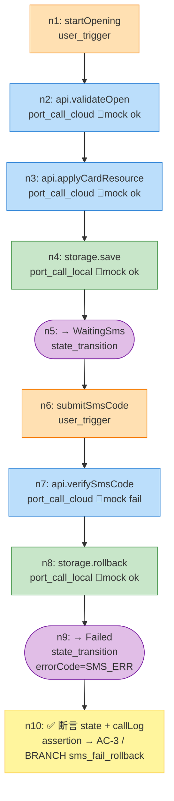

# DAG Schema 规范（v2 · UseCase 端到端化）

> **v2 模板说明**：v2 把 DAG 强制绑定到 `use-cases.yaml` 的 UseCase 与 branch，
> 节点类型扩充为「用户触发 / 云端口调用 / 本地端口调用 / 状态迁移 / 断言」等精确节点，
> 不再把 Toast / NavPathStack 等 UI 副作用画进 DAG（由 Skill 6 真机测试负责）。
>
> 下方 DAG 片段以"开卡流程"为参考示例，实际使用请按你自己的 UseCase / port 名替换。

## 概述

DAG（有向无环图）是业务级 UT 的核心数据结构，用 YAML 描述 **一个 UseCase 中的一条或多条分支** 的完整拓扑。
AI 根据 DAG 理解流程拓扑、打桩需求、断言点，自动生成对应 Hypium 端到端 UT。

v2 的核心变化：

- **每个 DAG 声明它属于哪个 UseCase（`use_case` 字段）以及覆盖哪些分支（`branches` 字段）**
- 节点类型从「代码执行/异步调用」这种实现视角，升级为「用户触发/云端口/本地端口/状态迁移」的**业务视角**
- UI 交互（Toast / Navigation / 用户真实输入）**不再出现在 DAG**，而是由 Skill 6 在 `device-testing-todo.md` 中跟踪
- `assertion` 节点必须声明 `linked_branch`（或通过 `linked_acceptance` 可反查到 branch），用于追溯

## 完整 Schema 定义（v2）

```yaml
# ============================================================================
# DAG 文件必填字段（v2）
# ============================================================================

flow_id: string                    # 唯一标识，snake_case，如 "card_opening_happy"
flow_name: string                  # 人类可读名称（中文），如 "开卡-完整成功路径"
module: string                     # 所属功能模块名，如 "card-opening"
version: string                    # 版本号，如 "2.0"

use_case: string                   # ★ v2 新增：对应 use-cases.yaml > use_cases[].class
                                   #           必须能在 use-cases.yaml 中找到同名 UseCase
branches:                          # ★ v2 新增：此 DAG 覆盖的分支 id 列表
  - string                         #   必须是 use-cases.yaml > use_cases[].branches[].id 的子集

linked_acceptance:                 # 此 DAG 关联的 AC 编号列表（来自 acceptance.yaml）
  - string                         # 如 "AC-1", "AC-2"

linked_boundaries:                 # 此 DAG 关联的 BD 编号列表（可选）
  - string                         # 如 "BD-1"

entry_point:                       # 流程入口（通常就是 UseCase 的 trigger 方法）
  module: string                   # 所属模块名（如 CardOpen）
  file: string                     # 入口文件路径（相对于项目根目录）
  function: string                 # 入口函数名，推荐为 UseCase 的 trigger 方法名

# ============================================================================
# 节点列表（v2 扩充节点类型）
# ============================================================================

nodes:
  - id: string                     # 节点 ID，如 "n1"，在 DAG 内唯一
    type: enum                     # 节点类型（见下方 v2 枚举）
    description: string            # 节点描述（中文），说明这一步的业务含义

    # --- source 引用（除 user_trigger / assertion 外推荐）---
    source:
      file: string                 # 源码文件路径（相对于项目根目录）
      function: string             # 函数/方法名
      class: string                # 所属类名（可选）

    next: [string]                 # 后续节点 ID 列表，assertion 节点通常为 []

    # === 以下为特定节点类型的专属字段 ===

    # --- user_trigger 专属（v2）---
    trigger:
      event: string                # 对应 use-cases.yaml > triggers[].event
      simulated_value: string      # 用户提交值的模拟表达式，如 "'123456'"
      from_branch: string          # 本 trigger 隶属哪个 branch（辅助追溯）

    # --- port_call_cloud / port_call_local 专属（v2）---
    port:
      name: string                 # 对应 use-cases.yaml > ports[].name，如 "api" / "storage"
      type: string                 # 对应 use-cases.yaml > ports[].type，如 "CardOpenApi"
      method: string               # 所调用的 port 方法名，如 "validateOpen"
    stub_strategy: enum            # mock_response | mock_error | throw | mock_delay
    mock_data:
      success:
        description: string
        value: string              # Mock 返回值的代码表示
      error:
        description: string
        value: string
      empty:
        description: string
        value: string

    # --- state_transition 专属（v2）---
    transition:
      from_phase: string           # 可选，便于阅读；运行时由 UseCase 内部保证
      to_phase: string             # 必填；对应 use-cases.yaml > state_model.phases
      field_updates: object        # 可选：如 { errorCode: "'VAL_ERR'" }

    # --- conditional_branch 专属（保留兼容）---
    condition: string
    branches:
      true_branch: [string]
      false_branch: [string]

    # --- assertion 专属（v2 增强）---
    linked_branch: string          # ★ v2 强烈推荐：对应 use-cases.yaml 的 branch id
    linked_acceptance: [string]    # 关联 AC/BD 编号（仍保留，两者至少一个）
    assertions:
      - type: enum                 # state_check | port_call_log | data_check | error_check
        target: string             # 断言目标（如 "useCase.state.phase" / "spyStorage.callLog"）
        expected: string           # 预期值（如 "Phase.Success" / "['save','update']"）
        description: string        # 断言描述（可选）

    # --- 已弃用/不建议使用（由 Skill 6 覆盖）---
    # user_intervention / ui_navigation：v2 不建议在 DAG 中出现，
    # 如需覆盖请写入 doc/features/{feature}/device-testing-todo.md 交 Skill 6。
```

## 节点类型枚举（v2）

| type 值 | 说明 | 必填专属字段 |
|---------|------|------------|
| `user_trigger` | 用户事件触发 UseCase（`useCase.xxx(...)`） | `trigger.event` |
| `port_call_cloud` | 调用云侧 port 方法 | `port`, `stub_strategy`, `mock_data` |
| `port_call_local` | 调用本地 port 方法（持久化/文件） | `port`, `stub_strategy`, `mock_data` |
| `state_transition` | UseCase 内部 state.phase 迁移 | `transition.to_phase` |
| `assertion` | 断言检查点（state/port 调用序列/数据） | `linked_branch` 或 `linked_acceptance`, `assertions` |
| `conditional_branch` | 条件分支（保留；优先用 branch 多 DAG 表达） | `condition`, `branches` |
| `code_execution` | 纯同步计算（保留兼容） | `source` |
| `async_call` | 通用异步调用（保留兼容；优先拆为 port_call_*） | `source`, `stub_strategy`, `mock_data` |
| `background_task` | 后台任务（保留兼容） | `source`, `task` |
| `user_intervention` | ⚠️ 已弃用：交 Skill 6 真机 | — |
| `ui_navigation` | ⚠️ 已弃用：交 Skill 6 真机 | — |

## 断言类型枚举（v2）

| assertions[].type 值 | 说明 | target 格式 |
|----------------------|------|------------|
| `state_check` | 检查 UseCase state 字段值 | `useCase.state.<field>` |
| `port_call_log` | 验证 Spy port 的调用序列 | `spyApi.callLog` / `spyStorage.callLog` |
| `data_check` | 验证数据完整性（持久化内容/内存对象） | `spyStorage.saved[0].cardId` |
| `error_check` | 验证错误码与错误态 | `useCase.state.errorCode` |
| ~~`ui_verify`~~ | ⚠️ 已弃用：交 Skill 6 | — |

## 打桩策略枚举

| stub_strategy 值 | 说明 |
|------------------|------|
| `mock_response` | 返回预设的成功/空/异常响应数据 |
| `mock_error` | 模拟调用失败（结构化错误返回） |
| `throw` | 抛出异常（模拟网络或磁盘异常） |
| `mock_delay` | 模拟延迟响应（用于测试加载状态） |

## 约束规则（v2）

1. **UseCase 绑定（新）**：`use_case` 必须匹配 `use-cases.yaml > use_cases[].class`；`branches[]` 必须是该 UseCase 分支 id 的子集
2. **分支分工（新）**：同一个 UseCase 的所有 DAG 的 `branches[]` 必须**互不重叠**，且**并集覆盖**所有 branch（除标记 `device_only` 的以外）
3. **节点类型封闭**：`type` 字段必须来自上述枚举
4. **无环约束**：`next` 链不可形成环路（必须可拓扑排序）
5. **入口可达**：所有节点必须从 `entry_point` 对应的节点可达
6. **assertion 终止**：assertion 节点的 `next` 通常为空列表 `[]`
7. **追溯强约束（新）**：assertion 节点必须声明 `linked_branch` 或 `linked_acceptance`（二者之一可反查到某条 branch）
8. **port 引用一致性（新）**：`port.name` / `port.type` / `port.method` 必须能在 `use-cases.yaml > ports` 中找到对应声明
9. **source 存在性**：`source.file` 引用的文件必须在工程中存在（对非 user_trigger / state_transition 节点）
10. **ID 唯一**：节点 ID 在同一 DAG 内不可重复
11. **mock 完整**：`port_call_*` / `async_call` 节点至少定义一种 mock_data 场景（success 或 error）
12. **UI 副作用禁入**：禁止在 DAG 中画 `NavPathStack.push` / `showToast` 等 UI 副作用节点

## 示例：开卡-短验失败回滚分支（v2）

```yaml
flow_id: card_opening_sms_fail
flow_name: 开卡-短验失败回滚分支
module: card-opening
version: "2.0"

use_case: CardOpeningUseCase
branches:
  - sms_fail_rollback

linked_acceptance: [AC-3]

entry_point:
  module: CardOpen
  file: 02-Feature/CardOpen/src/main/ets/domain/usecase/CardOpeningUseCase.ets
  function: startOpening

nodes:
  - id: n1
    type: user_trigger
    description: 用户提交开卡请求
    trigger:
      event: startOpening
      simulated_value: "{ bankCode: 'BOC' }"
      from_branch: sms_fail_rollback
    next: [n2]

  - id: n2
    type: port_call_cloud
    description: 云侧开卡校验成功
    source:
      file: 02-Feature/CardOpen/src/main/ets/domain/usecase/CardOpeningUseCase.ets
      function: startOpening
      class: CardOpeningUseCase
    port: { name: api, type: CardOpenApi, method: validateOpen }
    stub_strategy: mock_response
    mock_data:
      success:
        description: 校验通过返回 token
        value: "{ ok: true, token: 't' }"
    next: [n3]

  - id: n3
    type: port_call_cloud
    description: 云侧申请卡资源成功
    port: { name: api, type: CardOpenApi, method: applyCardResource }
    stub_strategy: mock_response
    mock_data:
      success:
        description: 返回 cardId
        value: "{ cardId: 'c1', holder: 'u1' }"
    next: [n4]

  - id: n4
    type: port_call_local
    description: 本地持久化卡记录
    port: { name: storage, type: CardPersistence, method: save }
    stub_strategy: mock_response
    mock_data:
      success:
        description: 成功写入
        value: "undefined"
    next: [n5]

  - id: n5
    type: state_transition
    description: 等待短验
    transition:
      from_phase: Persisting
      to_phase: WaitingSms
    next: [n6]

  - id: n6
    type: user_trigger
    description: 用户提交短验码
    trigger:
      event: submitSmsCode
      simulated_value: "'999999'"
      from_branch: sms_fail_rollback
    next: [n7]

  - id: n7
    type: port_call_cloud
    description: 短验校验失败
    port: { name: api, type: CardOpenApi, method: verifySmsCode }
    stub_strategy: mock_error
    mock_data:
      error:
        description: 短验错误
        value: "{ ok: false, code: 'SMS_ERR' }"
    next: [n8]

  - id: n8
    type: port_call_local
    description: 回滚本地已写入的卡记录
    port: { name: storage, type: CardPersistence, method: rollback }
    stub_strategy: mock_response
    mock_data:
      success:
        description: 回滚成功
        value: "undefined"
    next: [n9]

  - id: n9
    type: state_transition
    description: 进入失败态
    transition:
      from_phase: Verifying
      to_phase: Failed
      field_updates: { errorCode: "'SMS_ERR'" }
    next: [n10]

  - id: n10
    type: assertion
    description: 验证最终 state、port 调用序列与数据回滚
    linked_branch: sms_fail_rollback
    linked_acceptance: [AC-3]
    assertions:
      - type: state_check
        target: useCase.state.phase
        expected: "Phase.Failed"
      - type: error_check
        target: useCase.state.errorCode
        expected: "'SMS_ERR'"
      - type: port_call_log
        target: spyStorage.callLog
        expected: "['save', 'rollback']"
      - type: data_check
        target: spyStorage.currentCards.length
        expected: "0"
```

## 可视化

v2 DAG 推荐 Mermaid 图以节点类型着色：



## 与 Skill 6 的分工

| 如果节点想表达的是……                   | 应出现在       | 备注 |
|--------------------------------------|---------------|------|
| 按钮点击、下拉刷新、输入真实字符、键盘弹出 | `device-testing-todo.md` | Skill 6 真机覆盖 |
| Toast / NavPathStack.push / 图层动画     | `device-testing-todo.md` | Skill 6 真机覆盖 |
| UseCase.trigger 调用（数据编排）        | ✅ 本 DAG（`user_trigger`） | UT 覆盖 |
| Spy 打桩的端口调用                       | ✅ 本 DAG（`port_call_*`） | UT 覆盖 |
| state.phase / state.errorCode 迁移     | ✅ 本 DAG（`state_transition` + `assertion`） | UT 覆盖 |
