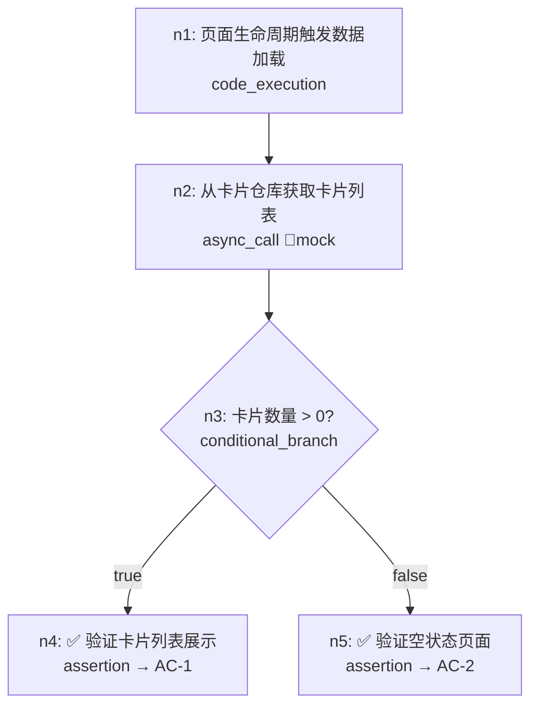

# DAG Schema 规范

> **模板说明**：下方 DAG 片段以钱包工程（`WalletMain` / `BankCard` / `CardRepository` 等）为参考示例演示字段填法；实际使用请按你自己工程的模块名替换。

## 概述

DAG（有向无环图）是业务级 UT 的核心数据结构，用 YAML 描述一个完整的业务流程。AI 根据 DAG 理解流程拓扑和打桩需求，自动生成对应的 UT 代码。

## 完整 Schema 定义

```yaml
# ============================================================================
# DAG 文件必填字段
# ============================================================================

flow_id: string             # 唯一标识，snake_case，如 "home_page_load"
flow_name: string           # 人类可读名称（中文），如 "首页数据加载流程"
module: string              # 所属功能模块名，如 "home-page"
version: string             # 版本号，如 "1.0"

linked_acceptance:          # 此 DAG 关联的 AC 编号列表（来自 acceptance.yaml）
  - string                  # 如 "AC-1", "AC-2"

linked_boundaries:          # 此 DAG 关联的 BD 编号列表（可选）
  - string                  # 如 "BD-1"

entry_point:                # 流程入口
  module: string            # 所属模块名（如 WalletMain）
  file: string              # 入口文件路径（相对于项目根目录）
  function: string          # 入口函数名

# ============================================================================
# 节点列表
# ============================================================================

nodes:
  - id: string              # 节点 ID，如 "n1"，在 DAG 内唯一
    type: enum              # 节点类型（见下方枚举）
    description: string     # 节点描述（中文），说明这一步的业务含义

    # --- source 引用（非 assertion 节点必填）---
    source:
      file: string          # 源码文件路径（相对于项目根目录）
      function: string      # 函数/方法名
      class: string         # 所属类名（可选）

    # --- 后续节点 ---
    next: [string]          # 后续节点 ID 列表，assertion 节点通常为 []

    # === 以下为特定节点类型的专属字段 ===

    # --- async_call 专属 ---
    stub_strategy: enum     # 打桩策略：mock_response | mock_error | mock_delay
    mock_data:              # Mock 数据定义（支持多场景）
      success:
        description: string
        value: string       # Mock 返回值的代码表示
      error:
        description: string
        value: string
      empty:
        description: string
        value: string

    # --- user_intervention 专属 ---
    intervention:
      ui_component: string  # UI 组件名
      input_field: string   # 输入字段名
      simulated_value: string # 模拟输入值
      event_type: string    # 事件类型（onClick / onChange / onSubmit）

    # --- background_task 专属 ---
    task:
      callback: string      # 回调函数名
      simulated_result: string # 模拟的回调结果

    # --- ui_navigation 专属 ---
    navigation:
      target_page: string   # 目标页面名
      params: object        # 传递的参数

    # --- conditional_branch 专属 ---
    condition: string       # 分支条件表达式
    branches:
      true_branch: [string]  # 条件为真时的后续节点 ID
      false_branch: [string] # 条件为假时的后续节点 ID

    # --- assertion 专属 ---
    linked_acceptance: [string]  # 关联的 AC/BD 编号
    assertions:
      - type: enum          # state_check | ui_verify | data_check | error_check
        target: string      # 断言目标（如 "HomePage.cardList"）
        expected: string    # 预期值/条件（如 "length === 3"）
        description: string # 断言描述（可选）
```

## 节点类型枚举

| type 值 | 说明 | 必填专属字段 |
|---------|------|------------|
| `code_execution` | 普通同步代码执行 | `source` |
| `async_call` | 异步调用（网络/IO/系统 API） | `source`, `stub_strategy`, `mock_data` |
| `user_intervention` | 需要用户操作 | `source`(可选), `intervention` |
| `background_task` | 后台任务 | `source`, `task` |
| `ui_navigation` | 页面跳转 | `source`(可选), `navigation` |
| `conditional_branch` | 条件分支 | `condition`, `branches` |
| `assertion` | 断言检查点 | `linked_acceptance`, `assertions` |

## 断言类型枚举

| assertions[].type 值 | 说明 | target 格式 |
|----------------------|------|------------|
| `state_check` | 检查状态变量的值 | `ClassName.propertyName` |
| `ui_verify` | 验证 UI 元素状态 | 组件描述或可访问性标识 |
| `data_check` | 验证数据完整性 | `ModelName.fieldName` |
| `error_check` | 验证错误处理行为 | 错误类型或提示信息 |

## 打桩策略枚举

| stub_strategy 值 | 说明 |
|------------------|------|
| `mock_response` | 返回预设的成功/空/异常响应数据 |
| `mock_error` | 模拟调用失败（抛出异常或返回错误状态） |
| `mock_delay` | 模拟延迟响应（用于测试加载状态） |

## 约束规则

1. **无环约束**：`next` 链不可形成环路（必须可拓扑排序）
2. **入口可达**：所有节点必须从 `entry_point` 对应的节点可达
3. **assertion 终止**：assertion 节点的 `next` 通常为空列表 `[]`
4. **AC 关联**：assertion 节点必须有 `linked_acceptance`，至少关联一个 AC/BD 编号
5. **source 存在性**：`source.file` 引用的文件必须在工程中存在
6. **ID 唯一**：节点 ID 在同一 DAG 内不可重复
7. **branches 完整**：`conditional_branch` 节点的 `true_branch` 和 `false_branch` 都必须非空
8. **mock 完整**：`async_call` 节点至少定义一种 mock_data 场景（success）

## 示例：首页加载流程

```yaml
flow_id: home_page_load
flow_name: 首页数据加载流程
module: home-page
version: "1.0"

linked_acceptance:
  - AC-1
  - AC-2

linked_boundaries:
  - BD-1

entry_point:
  module: WalletMain
  file: 02-Feature/WalletMain/src/main/ets/presentation/pages/HomePage.ets
  function: aboutToAppear

nodes:
  - id: n1
    type: code_execution
    description: 页面生命周期触发数据加载
    source:
      file: 02-Feature/WalletMain/src/main/ets/presentation/pages/HomePage.ets
      function: aboutToAppear
    next: [n2]

  - id: n2
    type: async_call
    description: 从卡片仓库获取卡片列表
    source:
      file: 02-Feature/WalletMain/src/main/ets/data/repository/CardRepository.ets
      function: getCardList
      class: CardRepository
    stub_strategy: mock_response
    mock_data:
      success:
        description: 正常返回 3 张卡片（银行卡、公交卡、门禁卡）
        value: "[mockBankCard, mockTransportCard, mockAccessCard]"
      empty:
        description: 返回空列表（用户无卡片）
        value: "[]"
      error:
        description: 模拟网络异常
        value: "throw new Error('Network unavailable')"
    next: [n3]

  - id: n3
    type: conditional_branch
    description: 根据卡片数量决定显示内容
    condition: "cardList.length > 0"
    branches:
      true_branch: [n4]
      false_branch: [n5]

  - id: n4
    type: assertion
    description: 验证卡片列表正常展示
    linked_acceptance: [AC-1]
    assertions:
      - type: state_check
        target: HomePage.cardList
        expected: "length === 3"
        description: 卡片列表包含 3 张卡片
      - type: state_check
        target: HomePage.isLoading
        expected: "false"
        description: 加载状态已结束

  - id: n5
    type: assertion
    description: 验证空状态页面展示
    linked_acceptance: [AC-2]
    assertions:
      - type: state_check
        target: HomePage.cardList
        expected: "length === 0"
      - type: state_check
        target: HomePage.showEmptyState
        expected: "true"
        description: 显示引导开卡的空状态页面
```

## 可视化

DAG 可使用 Mermaid flowchart 可视化：


