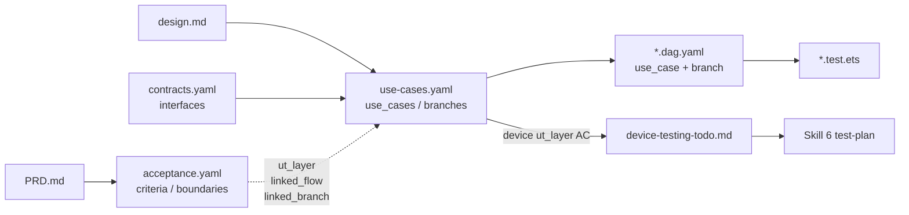

# `use-cases.yaml` Schema 规范

> 本文件定义 `doc/features/{module}/use-cases.yaml` 的 Schema。
> 该文件由 **Skill 2（需求设计）** 在设计阶段产出，是业务级 UT（Skill 5）做端到端分支覆盖的蓝图。

## 为什么要有 `use-cases.yaml`

鸿蒙 `@Component` + `@Consume('navPathStack')` + `$r()` 资源在纯 Hypium 单测里几乎无法实例化。如果业务逻辑写在页面 `onClick` 闭包里，UT 要么走真机 UI 自动化，要么只能退化成"测 Repository 数据条数"——都不是端到端业务级 UT。

`use-cases.yaml` 显式把**业务流程控制器（UseCase）** 提成一等公民：

- Skill 2 设计时就把"用户事件入口、依赖端口、内部 state、分支场景"列出来
- Skill 3 按这张表写一个**纯逻辑的 UseCase 类**（不 import 任何 UI 符号）
- Skill 5 按每条 `branch` 生成一条端到端 UT 用例

UT 里"用户事件"通过直接调用 `useCase.xxxTrigger(...)` 完成；"云侧接口 / 本地持久化"通过构造器注入 Spy 打桩；"导航 / Toast 等 UI 副作用" 完全不进 UT，由 Skill 6 真机测试消费 `device-testing-todo.md`。

## 完整 Schema

```yaml
# ============================================================================
# 顶层必填字段
# ============================================================================
schema_version: "1.0"
feature: string                 # feature 名，与目录名一致，如 "card-opening"

# ============================================================================
# use_cases 列表
# ============================================================================
use_cases:
  - id: string                  # snake_case，feature 内唯一，如 "card_opening"
    class: string               # UseCase 类名（PascalCase），如 "CardOpeningUseCase"
    file: string                # UseCase 源码相对路径，Skill 3 实现于此
    description: string         # 中文说明这个 UseCase 做什么

    # ------------------------------------------------------------------------
    # triggers：UseCase 暴露给 UI 层的事件入口方法
    #   UI 层 @Component 的 onClick/onChange 只能转发到这些方法
    #   UT 通过直接调用这些方法驱动流程
    # ------------------------------------------------------------------------
    triggers:
      - event: string           # 方法名（camelCase），如 "startOpening"
        params:                 # 参数列表
          - name: string
            type: string        # ArkTS 类型
        from_ac: [string]       # 对应哪几条 AC 是由该 trigger 启动（可选）

    # ------------------------------------------------------------------------
    # ports：UseCase 构造器注入的外部依赖接口
    #   - ownership: cloud   → 云侧远程接口（网络请求）
    #   - ownership: local   → 本地端口（持久化 / 文件 / 系统服务）
    #   禁止出现 UI 相关 port（导航 / Toast / @Component）
    # ------------------------------------------------------------------------
    ports:
      - name: string            # 属性名（camelCase），如 "api"
        type: string            # 接口/类名，如 "CardOpenApi"
        ownership: "cloud | local"
        methods:
          - name: string
            params: [string]    # 参数类型字符串列表
            returns: string     # 返回类型
            async: boolean      # 默认 true

    # ------------------------------------------------------------------------
    # state_model：UseCase 发布给 UI 层订阅的 state
    #   UseCase 不得直接调用 navPathStack.pushPath / showToast；
    #   必须改为更新 state，UI 层监听 state 变化翻译为副作用
    # ------------------------------------------------------------------------
    state_model:
      phases: [string]          # 状态机阶段枚举，如 [Idle, Validating, ...]
      fields:                   # 额外观察字段
        - name: string
          type: string          # 允许使用 TypeScript 类型字面量

    # ------------------------------------------------------------------------
    # branches：业务分支场景清单——Skill 5 按此 1:1 生成 UT 用例
    # ------------------------------------------------------------------------
    branches:
      - id: string              # snake_case，UseCase 内唯一，如 "happy_path"
        scenario: string        # 中文描述该分支语义

        # setup：Spy/Stub 的预设。key = "<port>.<method>"；value 定义：
        #   "ok"                   → 返回默认 ok 响应（由 UT 固定）
        #   "fail:<CODE>"          → 返回失败响应，错误码为 CODE
        #   "throw[:<Error>]"      → 该端口抛异常
        #   其他字符串              → 字面 payload / 自定义场景名
        setup:
          "<port>.<method>": "ok | fail:CODE | throw | throw:ErrName | <payload>"

        # 触发序列：UT 里依次调用哪些 trigger（可多次）；
        # 用于 submit 型流程（如 startOpening → submitSmsCode）
        triggers:
          - event: string
            with: object        # 调用实参（YAML 字面量，供 UT 按原样填入）

        expected_phase_sequence: [string]   # state.phase 的预期序列（含 Idle 起点）

        expected_port_calls: [string]       # 期望的 port 调用顺序，格式同 setup key

        expected_state:                     # 终态字段断言（除 phase 外）
          "<field>": any

        not_called: [string]                # 禁止被调用的 port 方法清单（同格式）

        linked_acceptance: [string]         # 对应的 AC / BD 编号，至少一条
```

## 强制规则

1. **ports 不含 UI**：`type` 不得为 `NavPathStack` / `ToastController` 等 UI 抽象；UI 副作用只通过 state 传导。
2. **triggers 是方法签名**：每条 trigger 在 UseCase 类中必须有同名异步方法。
3. **phases 首元素为 `Idle`**：`expected_phase_sequence` 应从 `Idle` 开始，便于 UT 建 spy 后先断言。
4. **branches 覆盖分支爆炸**：happy path + 每种可预期失败路径（云侧失败、本地失败、回滚路径）都列入，不省略。
5. **linked_acceptance 不能为空**：若某条分支暂无对应 AC，Skill 1/2 要补 AC 再回填。
6. **不允许出现 UI 副作用的断言字段**（如 `expected_navigation` / `expected_toast`）：这类期望统一写到 `doc/features/{feature}/device-testing-todo.md`。

## 与其他 Spec 的追溯关系



- `acceptance.yaml` 每条 `ut_layer in [unit, both]` 的 AC 必须填 `linked_flow` + `linked_branch`，引用本文件中的 UseCase 与分支
- `contracts.yaml.interfaces` 与本文件 `ports[].type` 一对一：同名接口、方法签名一致
- 每条 `*.dag.yaml` 必须填 `use_case: <class>` 与 `branch: <branch_id>` 指回本文件

## 最小示例

```yaml
schema_version: "1.0"
feature: "home-page"

use_cases:
  - id: "home_loading"
    class: "HomeLoadingUseCase"
    file: "02-Feature/WalletMain/src/main/ets/domain/usecase/HomeLoadingUseCase.ets"
    description: "首页进入时加载服务与活动数据"

    triggers:
      - event: "onAppear"
        params: []
        from_ac: ["AC-2"]

    ports:
      - name: "repo"
        type: "HomeRepository"
        ownership: "cloud"
        methods:
          - { name: "getServiceEntries", params: [], returns: "ServiceEntry[]", async: true }
          - { name: "getPromoList",      params: [], returns: "PromoInfo[]",    async: true }

    state_model:
      phases: [Idle, Loading, Loaded, Empty, Failed]
      fields:
        - { name: "errorCode", type: "string | null" }
        - { name: "services",  type: "ServiceEntry[]" }
        - { name: "promos",    type: "PromoInfo[]" }

    branches:
      - id: "happy_load"
        scenario: "服务与活动均返回非空列表"
        setup:
          "repo.getServiceEntries": "ok"
          "repo.getPromoList":      "ok"
        triggers: [ { event: "onAppear" } ]
        expected_phase_sequence: [Idle, Loading, Loaded]
        expected_port_calls: ["repo.getServiceEntries", "repo.getPromoList"]
        linked_acceptance: ["AC-2"]

      - id: "empty_data"
        scenario: "服务列表为空，进入 Empty 分支"
        setup:
          "repo.getServiceEntries": "[]"
          "repo.getPromoList":      "[]"
        triggers: [ { event: "onAppear" } ]
        expected_phase_sequence: [Idle, Loading, Empty]
        expected_port_calls: ["repo.getServiceEntries", "repo.getPromoList"]
        linked_acceptance: ["BD-2"]

      - id: "repo_failure"
        scenario: "Repository 抛错，降级到 Failed 且数据置空"
        setup:
          "repo.getServiceEntries": "throw"
        triggers: [ { event: "onAppear" } ]
        expected_phase_sequence: [Idle, Loading, Failed]
        expected_port_calls: ["repo.getServiceEntries"]
        not_called: ["repo.getPromoList"]
        expected_state:
          services: "[]"
          promos:   "[]"
        linked_acceptance: ["BD-1", "AC-10"]
```

## 校验建议（Harness 做什么）

| 检查项 | 归属 |
|---|---|
| `use-cases.yaml` 存在且 Schema 合规 | `check-ut.ts : usecase_spec_schema` |
| `use_cases[].class` 在 `<file>` 源码中定义 | `check-ut.ts : usecase_class_exists` |
| UseCase 源文件不 import UI 符号 | `check-ut.ts : usecase_class_pure` |
| ports 与 contracts.yaml 对齐 | `check-ut.ts : usecase_port_matches_contracts` |
| DAG 声明的 `use_case / branch` 在本文件存在 | `check-ut.ts : dag_linked_usecase` |
| 每个 branch 有对应的 `it()` | `check-ut.ts : branch_coverage_full` |
| 每条 `ut_layer in [unit, both]` 的 AC 有 `it()` | `check-ut.ts : ut_case_per_unit_ac` |
| state_model 完备性 / port 抽象粒度 | `verify-ut.md` 语义检查 |
